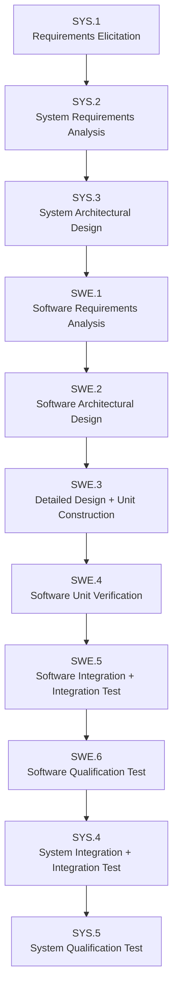

# foxBMS 2 — ASPICE Process-to-Artifact Map

**Generated:** 2026-09-19  
**Baseline:** BAS-REF-001 (commit `308028fb`, tag `v1.11.0`)  
**Standard:** ASPICE PAM 4.1 (+ ISO 26262:2018 cross-references)  
**Statuses from:** `governance/coverage-plan.json` (2026-09-18 run)  
**Corpus:** 67 artifacts + 70 links (`corpus.py check` → PASSED, selftest 11/11)

## 1. Process Chain

Note: ASPICE PAM 4.0/4.1 defines SYS.1–SYS.5 only; no SYS.6 process exists. The chain above ends at SYS.5 (System Qualification Test). Post-qualification closure continues through SUP.10 (change requests), SUP.11 (traceability), and the next release cycle — mapped in Section 4.

## 2. SYS.1 → SYS.2 → SYS.3 → SYS.4 → SYS.5 (system flow)

### SYS.1 — Requirements Elicitation | `mapped`

| Work product | Artifact | Links |
|---|---|---|
| Stakeholder needs | `01-stakeholder-requirements-specification.md` | use cases ← operational scenarios |
| Item definition | `FB2-MAN-SCO-000001` (project scope) | `validates` via TMS-009 (`LNK-047`, draft stub) |

### SYS.2 — System Requirements Analysis | `mapped`

| Work product | Artifact | Links |
|---|---|---|
| System requirements | `FB2-SAF-FSR-000001..000004` | `refines` SGO-000001 (`LNK-002/003/004`, `LNK-021`) |
| Safety goals | `FB2-SAF-SGO-000001` | `mitigates` HAZ-000001 (`LNK-001`) |
| Hazard analysis | `FB2-SAF-HAZ-000001` | `reviewed_by` REV-000001 (`LNK-019`, as_is) |

### SYS.3 — System Architectural Design | `mapped`

| Work product | Artifact | Links |
|---|---|---|
| HW/SW allocation | FSR → TSR/SWR allocation links | `LNK-005..010` (TSR→FSR, SWR→FSR) |
| HSI authority | `FB2-SYS-HSI-000001` | `source_refs` HW-000002 + COD-000001/000004; consumed by FMEA, assumptions, SCN-CHG-002 |
| Interface consistency | lateral matrix (`traceability-report.md`) | SPI 1 MHz, CRC-15, cell_voltage 0–5000 mV, freshness < 30 ms |

### SYS.4 — System Integration + Integration Test | `partially_mapped`

| Work product | Artifact | Links | Status |
|---|---|---|---|
| Integration plan | `07-software-integration-report.md` (waf build, task engine, CAN/DBC) | — | documented |
| Integration test spec | `FB2-VER-TMS-000007` (draft stub) | `verifies` SWR-001/002/003 (`LNK-039/040/041`) | no execution |
| Integration results | — | — | gap (blocked, not fabricated) |

### SYS.5 — System Qualification Test | `partially_mapped`

| Work product | Artifact | Links | Status |
|---|---|---|---|
| Qualification spec | `FB2-VER-TMS-000008` (draft stub) | `verifies` FSR-001..004 (`LNK-042/043/044/045`) | no execution |
| HIL spec | `FB2-VER-TMS-000011` (draft stub) | `verifies` FSR-001..004 (`LNK-049/050/051/052`) | no execution (HIL bench blocked) |
| Qualification results | — | — | gap (blocked, not fabricated) |

## 3. SYS.3 → SWE.1 → … → SWE.6 → SYS.4 → SYS.5 (software flow feeding back)

### SWE.1 — Software Requirements Analysis | `mapped`

| Work product | Artifact | Links |
|---|---|---|
| Software requirements | `FB2-SW-SWR-000001..000003` | `allocated_to` FSR-001/002/003 (`LNK-008/009/010`); upstream SYS.3 allocation |
| Reverse-engineered SWRs | `SWR-RE-01..15` (SRS doc 04) | implementing modules + anchors |
| Interfaces | DSN interface specs (`SOA_DATABASE_IN/OUT`, `CONTACTOR_SYS_IN/SBC_OUT/FEEDBACK_IN/DIAG_OUT`) | HSI-consistent |

### SWE.2 — Software Architectural Design | `mapped`

| Work product | Artifact | Links |
|---|---|---|
| Architecture | `05-software-architecture-specification.md` (40 modules, 4 layers) | task model, data exchange |
| Component designs | `FB2-SW-DSN-000001..000003` | `implements` SWR-001/002/003 (`LNK-011/012/013`) |

### SWE.3 — Detailed Design + Unit Construction | `mapped`

| Work product | Artifact | Links |
|---|---|---|
| Detailed design | `06-detailed-design-specification.md` + DSN records | responsibilities, interfaces, constraints, budgets, failure response |
| Source code | 40 modules in `src/app/` | `implementation_mapping` symbols per DSN (LTC6813-1, soa.c, contactor.c, sbc_fs8x.c, diag cbs) |
| Unit construction | config pairs `src/app/*/config/*_cfg.c\|h` | per-module wscript integration |

### SWE.4 — Software Unit Verification | `partially_mapped`

| Work product | Artifact | Links | Status |
|---|---|---|---|
| Unit test measures | TMS-001..006 (5 as_is `source_grounded` + synthetic mirrors) | `verifies` FSR/TSR/SWR (`LNK-014..018`, `LNK-021..032`) | 6/6 synthetic executed (`LNK-033..038`); as_is only TMS-001 (hashes placeholder) |
| Component stub | `FB2-VER-TMS-000010` (draft) | `verifies` SWR-002 (`LNK-048`) | no execution |
| 313 C unit tests | `tests/unit/app/**` | CI-enforced, 100% line/branch policy | inventory + coverage report |

### SWE.5 — Software Integration + Integration Test | `partially_mapped`

| Work product | Artifact | Links | Status |
|---|---|---|---|
| Integration approach | database/task model + build system (doc 07) | — | documented |
| Integration stub | `FB2-VER-TMS-000007` (draft) | `verifies` SWR-001/002/003 (`LNK-039/040/041`) | no execution |
| Integration results | — | — | gap (blocked, not fabricated) |

### SWE.6 — Software Qualification Test | `partially_mapped`

| Work product | Artifact | Links | Status |
|---|---|---|---|
| Qualification stub | `FB2-VER-TMS-000008` (draft) | `verifies` FSR-001..004 (`LNK-042/043/044/045`) | no execution |
| Qualification results | — | — | gap (blocked, not fabricated) |

### Feedback into SYS.4 → SYS.5

SWE.6 qualification output feeds system integration (SYS.4) and system qualification (SYS.5):

- `FB2-VER-TMS-000008` qualifies the integrated cell-voltage safety chain end to end (FSR-001..004) — the same chain SYS.5's HIL stub TMS-000011 verifies on target (`LNK-049..052`).
- Execution evidence does not yet exist at either level; both processes are honestly `partially_mapped` with linked planning stubs and blocked executions.
- Supporting closure: SUP.10 change lifecycles (3/3, BAS-REF-002/003/004), SUP.11 traceability (70 links, 0 dangling), SUP.8 Git baselines.

## 4. Process Status Summary

| Process | Applicability | Disposition | Blocking work product |
|---|---|---|---|
| SYS.1 | applicable | mapped | — |
| SYS.2 | applicable | mapped | — |
| SYS.3 | applicable | mapped | — |
| SYS.4 | applicable | partially_mapped | integration executions (TMS-007 stub linked) |
| SYS.5 | applicable | partially_mapped | qualification + HIL executions (TMS-008/011 stubs linked) |
| SWE.1 | applicable | mapped | — |
| SWE.2 | applicable | mapped | — |
| SWE.3 | applicable | mapped | — |
| SWE.4 | applicable | partially_mapped | as_is executions 4/5 missing; component execution (TMS-010 stub linked) |
| SWE.5 | applicable | partially_mapped | integration executions (TMS-007 stub linked) |
| SWE.6 | applicable | partially_mapped | qualification executions (TMS-008 stub linked) |
| HWE.1–HWE.4 | applicable | partially_mapped | HW test records (blocked) |
| VAL.1 | applicable | partially_mapped | validation executions (TMS-009 stub linked) |
| SUP.8/10/11 | applicable | mapped | — |
| MLE.1–MLE.4 | not_applicable | explicit non-applicability | — |

32 ASPICE processes inventoried (28 applicable + 4 not_applicable); 12 ISO parts (10 mapped/referenced + 2 not_applicable); acceptance gate 44/44.

## 5. Evidence Limits

- `mapped` in this document means the process has documented work products with typed traceability — not process capability assessment.
- All execution records are either `synthetic_fixture` (corpus structure only) or the single unsubstantiated `as_is` host run; `product_verification_credit` is `false` for every artifact and `human_approval_status` is `pending`.
- All draft stubs (TMS-007..011) hold verification intent with `verifies`/`validates` links but zero executions — blocked, not fabricated.
- No SYS.6 process exists in ASPICE PAM 4.0/4.1; post-qualification closure is covered by SUP.10/SUP.11 and release cycles.

---

*Generated: 2026-09-19 — hand-maintained from the machine-verifiable corpus and `governance/coverage-plan.json`.*
