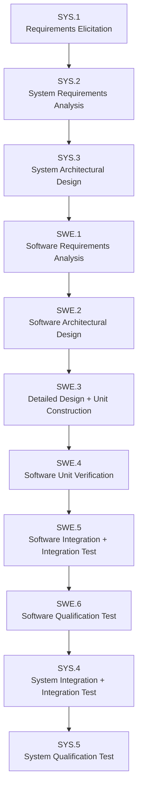

# foxBMS 2 — ASPICE Process-to-Artifact Map

**Generated:** 2026-09-19  
**Baseline:** BAS-REF-001 (commit `308028fb`, tag `v1.11.0`)  
**Standard:** ASPICE PAM 4.1 (+ ISO 26262:2018 cross-references)  
**Statuses from:** `governance/coverage-plan.json` (2026-09-18 run)  
**Corpus:** 67 artifacts + 70 links (`corpus.py check` → PASSED, selftest 11/11)

## 1. Process Chain

Note: ASPICE PAM 4.0/4.1 defines SYS.1–SYS.5 only; no SYS.6 process exists. The chain above ends at SYS.5 (System Qualification Test). Post-qualification closure continues through SUP.10 (change requests), SUP.11 (traceability), and the next release cycle — mapped in Section 4.

## 2. SYS.1 → SYS.2 → SYS.3 → SYS.4 → SYS.5 (system flow)

### SYS.1 — Requirements Elicitation | `mapped`

| Work product | Artifact | Links |
|---|---|---|
| Stakeholder needs | `01-stakeholder-requirements-specification.md` | use cases ← operational scenarios |
| Item definition | `FB2-MAN-SCO-000001` (project scope) | `validates` via TMS-009 (`LNK-047`, draft stub) |

### SYS.2 — System Requirements Analysis | `mapped`

| Work product | Artifact | Links |
|---|---|---|
| System requirements | `FB2-SAF-FSR-000001..000004` | `refines` SGO-000001 (`LNK-002/003/004`, `LNK-021`) |
| Safety goals | `FB2-SAF-SGO-000001` | `mitigates` HAZ-000001 (`LNK-001`) |
| Hazard analysis | `FB2-SAF-HAZ-000001` | `reviewed_by` REV-000001 (`LNK-019`, as_is) |

### SYS.3 — System Architectural Design | `mapped`

| Work product | Artifact | Links |
|---|---|---|
| HW/SW allocation | FSR → TSR/SWR allocation links | `LNK-005..010` (TSR→FSR, SWR→FSR) |
| HSI authority | `FB2-SYS-HSI-000001` | `source_refs` HW-000002 + COD-000001/000004; consumed by FMEA, assumptions, SCN-CHG-002 |
| Interface consistency | lateral matrix (`traceability-report.md`) | SPI 1 MHz, CRC-15, cell_voltage 0–5000 mV, freshness < 30 ms |

### SYS.4 — System Integration + Integration Test | `partially_mapped`

| Work product | Artifact | Links | Status |
|---|---|---|---|
| Integration plan | `07-software-integration-report.md` (waf build, task engine, CAN/DBC) | — | documented |
| Integration test spec | `FB2-VER-TMS-000007` (draft stub) | `verifies` SWR-001/002/003 (`LNK-039/040/041`) | no execution |
| Integration results | — | — | gap (blocked, not fabricated) |

### SYS.5 — System Qualification Test | `partially_mapped`

| Work product | Artifact | Links | Status |
|---|---|---|---|
| Qualification spec | `FB2-VER-TMS-000008` (draft stub) | `verifies` FSR-001..004 (`LNK-042/043/044/045`) | no execution |
| HIL spec | `FB2-VER-TMS-000011` (draft stub) | `verifies` FSR-001..004 (`LNK-049/050/051/052`) | no execution (HIL bench blocked) |
| Qualification results | — | — | gap (blocked, not fabricated) |

## 3. SYS.3 → SWE.1 → … → SWE.6 → SYS.4 → SYS.5 — artifact-level chains

Every requirement, design element, source symbol, test measure, and execution linked individually. Identical in both profiles unless noted (`as_is` lacks FSR-004/TSR-004 chain).

### 3.0 SYS.3 → SWE.1 — system requirements to software requirements

| System requirement (SWE.1 upstream) | Relation | Link | Software requirement (SWE.1) |
|---|---|---|---|
| `FB2-SAF-FSR-000001` | `allocated_to` (reverse) | `FB2-LNK-SAF-000008` | `FB2-SW-SWR-000001` |
| `FB2-SAF-FSR-000002` | `allocated_to` (reverse) | `FB2-LNK-SAF-000009` | `FB2-SW-SWR-000002` |
| `FB2-SAF-FSR-000003` | `allocated_to` (reverse) | `FB2-LNK-SAF-000010` | `FB2-SW-SWR-000003` |

### 3.1 SWE.1 → SWE.2 — requirements to architecture elements

| Requirement (SWE.1) | Relation | Link | Design element (SWE.2) |
|---|---|---|---|
| `FB2-SW-SWR-000001` (AFE acquisition 20 Hz, PEC, database ≤5 ms) | `implements` | `FB2-LNK-SAF-000011` | `FB2-SW-DSN-000001` — AFE_DATABASE / AFE_SPI interfaces, level `architecture` |
| `FB2-SW-SWR-000002` (SOA limit check ≤10 ms, debounce 2, FAULT) | `implements` | `FB2-LNK-SAF-000012` | `FB2-SW-DSN-000002` — SOA_DATABASE_IN / SOA_SYS_OUT interfaces, level `detailed_design` |
| `FB2-SW-SWR-000003` (state machine OPEN→PRECHARGE→CLOSE→HOLD, open ≤5 ms) | `implements` | `FB2-LNK-SAF-000013` | `FB2-SW-DSN-000003` — CONTACTOR_SYS_IN / SBC_OUT / FEEDBACK_IN / DIAG_OUT interfaces, level `detailed_design` |

### 3.2 SWE.2 → SWE.2 — interface chains between architecture elements

| Producer interface (output) | Consumer interface (input) | Matched signal |
|---|---|---|
| `FB2-SW-DSN-000001` `AFE_DATABASE` (cell_voltages uint16_t[] mV 0-5000, 20 Hz) | `FB2-SW-DSN-000002` `SOA_DATABASE_IN` (cell_voltages uint16_t[] mV, 20 Hz) | cell_voltages |
| `FB2-SW-DSN-000002` `SOA_SYS_OUT` (fault_request bool, event) | `FB2-SW-DSN-000003` `CONTACTOR_SYS_IN` (fault_request bool 0/1, event) | fault_request |
| `FB2-SW-DSN-000003` `CONTACTOR_DIAG_OUT` (weld_detected, stuck_open_detected, cycle_count) | `FB2-SW-DSN-000002` failure-response "Report violation details to DIAG" (diag_cbs_contactor.c) | weld/stuck diagnosis |

### 3.3 SWE.2 → SWE.3 — design elements to source symbols

| Design element (SWE.2) | Source file (SWE.3) | Symbol | Status |
|---|---|---|---|
| `FB2-SW-DSN-000001` | `src/app/driver/afe/ltc/common/ltc_afe.c` | `LTC_AFE_TriggerMeasurement` | `implemented` |
| `FB2-SW-DSN-000001` | `src/app/driver/afe/ltc/common/ltc_afe_dma.c` | `LTC_AFE_DMA_RxCallback` | `implemented` |
| `FB2-SW-DSN-000001` | `src/app/driver/afe/ltc/common/ltc_pec.c` | `LTC_PEC_Calculate` | `implemented` |
| `FB2-SW-DSN-000001` | `src/app/driver/afe/ltc/6813-1/ltc_6813-1.c` | `LTC_6813_ReadVoltages` | `implemented` |
| `FB2-SW-DSN-000002` | `src/app/application/soa/soa.c` | `SOA_CheckVoltageLimits` | `implemented` |
| `FB2-SW-DSN-000002` | `src/app/application/soa/soa.c` | `SOA_CheckCurrentLimits` | `implemented` |
| `FB2-SW-DSN-000002` | `src/app/application/soa/soa.c` | `SOA_CheckTemperatureLimits` | `implemented` |
| `FB2-SW-DSN-000002` | `src/app/engine/diag/cbs/diag_cbs_voltage.c` | `DIAG_CBS_Voltage` | `implemented` |
| `FB2-SW-DSN-000003` | `src/app/driver/contactor/contactor.c` | `CONTACTOR_StateMachine` | `implemented` |
| `FB2-SW-DSN-000003` | `src/app/driver/contactor/contactor.c` | `CONTACTOR_CheckFeedback` | `implemented` |
| `FB2-SW-DSN-000003` | `src/app/driver/sbc/fs8x_driver/sbc_fs8x.c` | `SBC_FS8X_SetContactor` | `implemented` |
| `FB2-SW-DSN-000003` | `src/app/engine/diag/cbs/diag_cbs_contactor.c` | `DIAG_CBS_Contactor` | `implemented` |

### 3.4 SWE.3 / SWE.1 → SWE.4 — source symbols and requirements to test measures

| Upstream (requirement / source) | Test measure (SWE.4) | `verifies` links | Execution (`result_of`) |
|---|---|---|---|
| `FB2-SW-SWR-000001` / `FSR-000001` | `FB2-VER-TMS-000003` (plausibility) | synthetic `LNK-026/027/028`; as_is `LNK-021/022` | synthetic `FB2-VER-EXE-000003` (`LNK-035`); as_is none |
| `FB2-SW-SWR-000002` / `FSR-000002` | `FB2-VER-TMS-000001` (SOA voltage) | synthetic `LNK-022/023`; as_is `LNK-014/015` | synthetic `FB2-VER-EXE-000001` (`LNK-033`); as_is `FB2-VER-EXE-000001` (`LNK-018`, hashes placeholder) |
| `FB2-SW-SWR-000003` / `FSR-000003` | `FB2-VER-TMS-000002` (contactor SM) | synthetic `LNK-024/025`; as_is `LNK-016/017` | synthetic `FB2-VER-EXE-000002` (`LNK-034`); as_is none |
| `FB2-HW-TSR-000001` / `FB2-HW-TSR-000002` | `FB2-VER-TMS-000004` (as_is, LTC6813-1 driver) | as_is `LNK-023/024` | none (as_is) |
| `FB2-HW-TSR-000003` | `FB2-VER-TMS-000005` (as_is, contactor driver) | as_is `LNK-025` | none (as_is) |
| `FB2-HW-TSR-000002` | `FB2-VER-TMS-000005` (synthetic, AFE communication) | `LNK-031` | synthetic `FB2-VER-EXE-000005` (`LNK-037`) |
| `FB2-HW-TSR-000003` | `FB2-VER-TMS-000006` (synthetic, contactor driver) | `LNK-032` | synthetic `FB2-VER-EXE-000006` (`LNK-038`) |
| `FB2-SAF-FSR-000004` / `FB2-HW-TSR-000004` | `FB2-VER-TMS-000004` (synthetic, independent monitor) | `LNK-029/030` | synthetic `FB2-VER-EXE-000004` (`LNK-036`) |
| `FB2-SW-SWR-000002` (component) | `FB2-VER-TMS-000010` (draft stub) | `LNK-048` | none — blocked |
| `FB2-SW-SWR-000001/002/003` (integration) | `FB2-VER-TMS-000007` (draft stub) | `LNK-039/040/041` | none — blocked |
| `FB2-SAF-FSR-000001..000004` (qualification) | `FB2-VER-TMS-000008` (draft stub) | `LNK-042/043/044/045` | none — blocked |
| `FB2-SAF-FSR-000001..000004` (HIL) | `FB2-VER-TMS-000011` (draft stub) | `LNK-049/050/051/052` | none — blocked |

### 3.5 SWE.4 → SWE.5 → SWE.6 → SYS.4 → SYS.5 — measures to executions to system closure

| Level | Artifact | Links to upstream | Status |
|---|---|---|---|
| SWE.4 unit executions | `FB2-VER-EXE-000001..000006` (synthetic fixtures) | `result_of` TMS-001..006 (`LNK-033..038`) | 6/6 pass, structure only |
| SWE.5 integration | `FB2-VER-TMS-000007` (draft stub) | `verifies` SWR-001/002/003 (`LNK-039/040/041`) | no execution |
| SWE.6 qualification | `FB2-VER-TMS-000008` (draft stub) | `verifies` FSR-001..004 (`LNK-042/043/044/045`) | no execution |
| SYS.4 integration (system) | same `FB2-VER-TMS-000007` + doc 07 build/task integration | — | partially_mapped |
| SYS.5 qualification (system) | same `FB2-VER-TMS-000008` + `FB2-VER-TMS-000011` (HIL stub, `LNK-049..052`) | — | no execution (bench blocked) |

The same measure artifacts serve SWE.5/SWE.6 and SYS.4/SYS.5 — the software qualification chain (FSR-001..004 end to end) is exactly what SYS.5's HIL stub verifies on target, closing the SWE.6 → SYS.4 → SYS.5 feedback path.

### 3.6 SYS.2 upstream (hazard → goal → FSR) for every SWE.1 requirement

| SWE.1 requirement | FSR parent | Safety goal | Hazard |
|---|---|---|---|
| `FB2-SW-SWR-000001` | `FSR-000001` (`LNK-008`) | `SGO-000001` (`LNK-002`) | `HAZ-000001` (`LNK-001`) |
| `FB2-SW-SWR-000002` | `FSR-000002` (`LNK-009`) | `SGO-000001` (`LNK-003`) | `HAZ-000001` (`LNK-001`) |
| `FB2-SW-SWR-000003` | `FSR-000003` (`LNK-010`) | `SGO-000001` (`LNK-004`) | `HAZ-000001` (`LNK-001`) |

## 4. Process Status Summary and Work-Product Detail

| Process | Applicability | Disposition | Blocking work product |
|---|---|---|---|
| SYS.1 | applicable | mapped | — |
| SYS.2 | applicable | mapped | — |
| SYS.3 | applicable | mapped | — |
| SYS.4 | applicable | partially_mapped | integration executions (TMS-007 stub linked) |
| SYS.5 | applicable | partially_mapped | qualification + HIL executions (TMS-008/011 stubs linked) |
| SWE.1 | applicable | mapped | — |
| SWE.2 | applicable | mapped | — |
| SWE.3 | applicable | mapped | — |
| SWE.4 | applicable | partially_mapped | as_is executions 4/5 missing; component execution (TMS-010 stub linked) |
| SWE.5 | applicable | partially_mapped | integration executions (TMS-007 stub linked) |
| SWE.6 | applicable | partially_mapped | qualification executions (TMS-008 stub linked) |
| HWE.1–HWE.4 | applicable | partially_mapped | HW test records (blocked) |
| VAL.1 | applicable | partially_mapped | validation executions (TMS-009 stub linked) |
| SUP.8/10/11 | applicable | mapped | — |
| MLE.1–MLE.4 | not_applicable | explicit non-applicability | — |

`partially_mapped` means every expected work product is either **present and linked** (specification, measures, trace links) or **explicitly blocked** (executions only). No work product is missing without disposition. Per-process detail:

### SYS.4 / SWE.5 — Integration (same measure artifact)

| Work product | State | Artifact / links |
|---|---|---|
| Integration plan | ✅ present | doc 07 (waf build, task engine, CAN/DBC, conf integration) |
| Integration test specification | ✅ linked | `FB2-VER-TMS-000007` (draft stub) — `verifies` SWR-001/002/003 (`LNK-039/040/041`), also referenced_designs DSN-001/002/003 |
| Integration test results | 🚫 blocked | no execution record — harness not in corpus scope; policy: blocked, not fabricated |

### SYS.5 / SWE.6 — Qualification (same measure artifact)

| Work product | State | Artifact / links |
|---|---|---|
| Qualification test specification | ✅ linked | `FB2-VER-TMS-000008` (draft stub) — `verifies` FSR-001..004 (`LNK-042/043/044/045`), referenced_designs DSN-001/002/003 |
| HIL test specification | ✅ linked | `FB2-VER-TMS-000011` (draft stub) — `verifies` FSR-001..004 (`LNK-049/050/051/052`), config `tests/hil` placeholder |
| Qualification test results | 🚫 blocked | no execution record — no qualification environment or target hardware |
| HIL test results | 🚫 blocked | no execution record — HIL bench unpublished upstream (`tests/hil` placeholder) |

### SWE.4 — Unit Verification

| Work product | State | Artifact / links |
|---|---|---|
| Unit verification measures | ✅ linked | TMS-001..006 (5 as_is `source_grounded` + synthetic mirrors) + TMS-010 component stub (`LNK-048`) |
| Unit test specifications | ✅ linked | structured steps/outcomes per TMS in docs 08/09; `tests/unit/app/**` (313 C files) |
| Unit test results (synthetic) | ✅ recorded | EXE-001..006 `synthetic_fixture` pass (`result_of` LNK-033..038) — corpus structure only |
| Unit test results (as_is) | ⚠️ partial | EXE-001 only (`actual_host_run`, hashes `sha256:placeholder`); TMS-002..005 no execution records |
| Component test results | 🚫 blocked | TMS-010 draft stub, no execution — component harness not in corpus scope |

### HWE.1–HWE.4 — Hardware

| Work product | State | Artifact / links |
|---|---|---|
| HW requirements | ✅ linked | `FB2-HW-TSR-000001..000004` — `allocated_to` FSR (`LNK-005/006/007`); TSR-004 no allocation link (gap) |
| HW architecture | ⚠️ partial | design packages inventoried (`source-registry.json` HW anchors); architecture extracted where readable |
| HW detailed design | ⚠️ partial | Altium/schematic packages referenced; CAD-format limited analysis |
| HW test specification | ✅ linked | as_is TMS-000004/000005 (LTC6813-1, contactor driver, `LNK-023/024`, `LNK-025`); synthetic TMS-000005/000006/000011 |
| HW test results | 🚫 blocked | no target-hardware executions — policy: blocked, not fabricated |

### VAL.1 — Validation

| Work product | State | Artifact / links |
|---|---|---|
| Validation plan/specification | ✅ linked | `FB2-VER-TMS-000009` (draft stub) — `validates` SGO-000001 + SCO-000001 (`LNK-046/047`) |
| Validation results | 🚫 blocked | no execution record — no validation environment or operational data |

32 ASPICE processes inventoried (28 applicable + 4 not_applicable); 12 ISO parts (10 mapped/referenced + 2 not_applicable); acceptance gate 44/44.

## 5. Evidence Limits

- `mapped` in this document means the process has documented work products with typed traceability — not process capability assessment.
- All execution records are either `synthetic_fixture` (corpus structure only) or the single unsubstantiated `as_is` host run; `product_verification_credit` is `false` for every artifact and `human_approval_status` is `pending`.
- All draft stubs (TMS-007..011) hold verification intent with `verifies`/`validates` links but zero executions — blocked, not fabricated.
- No SYS.6 process exists in ASPICE PAM 4.0/4.1; post-qualification closure is covered by SUP.10/SUP.11 and release cycles.

---

*Generated: 2026-09-19 — hand-maintained from the machine-verifiable corpus and `governance/coverage-plan.json`.*
