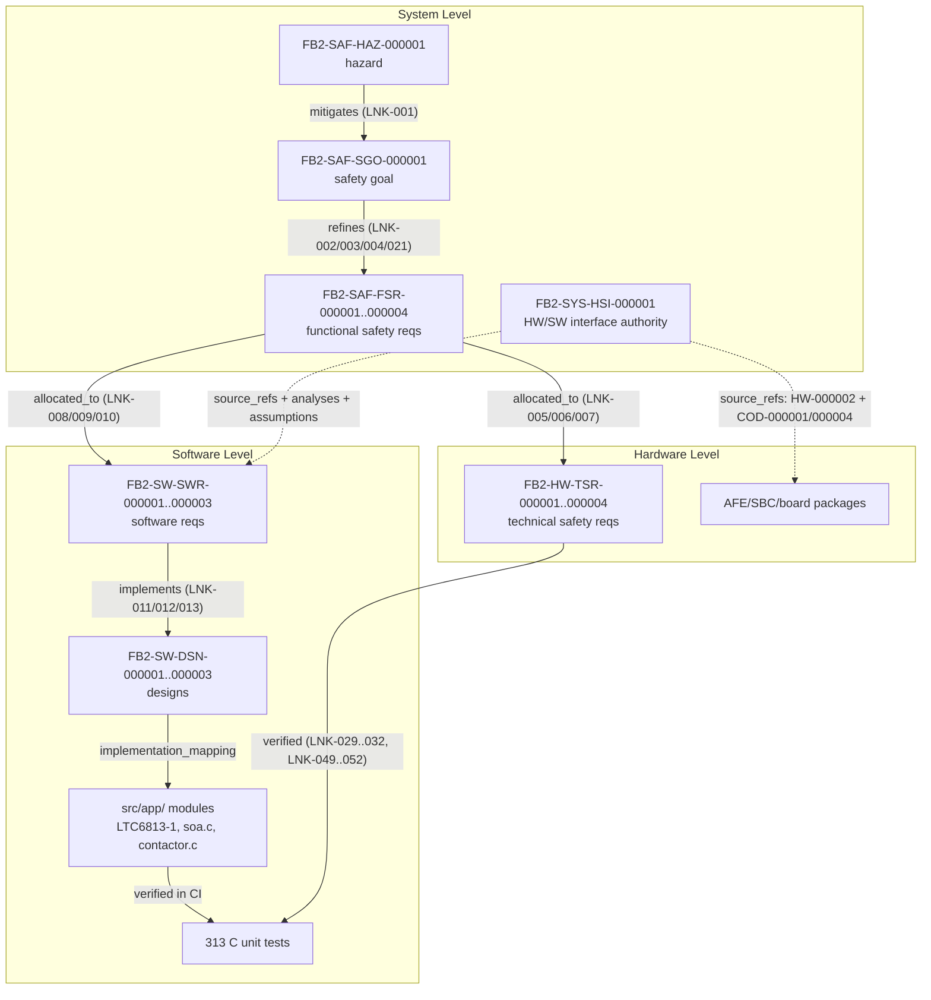

# foxBMS 2 — Cross-Domain Traceability Chain Map

**Generated:** 2026-09-19  
**Baseline:** BAS-REF-001 (commit `308028fb`, tag `v1.11.0`)  
**Profiles:** `as_is` (source-grounded) + `synthetic_reference` (hypothetical)  
**Data source:** 67 corpus artifacts + 70 traceability links + 43 source anchors + 12 assumptions + 10 parameters (`corpus.py check` → PASSED, selftest 11/11)

## 1. Purpose

One map of the complete bidirectional traceability between **system → software → hardware → system**, showing every typed link in both directions per profile. Complements `TRACEABILITY_DOCUMENT.md` (full corpus chains).

## 2. Cross-Domain Chain (synthetic_reference)



## 3. Direction-by-Direction Link Map

Link IDs identical in both profiles unless noted. `as_is` lacks FSR-004/TSR-004 chain entirely (synthetic only).

### 3.1 System → Software (downstream allocation)

| Source | Relation | Target | Link |
|---|---|---|---|
| `FB2-SAF-FSR-000001` | `allocated_to` (reverse: SWR→FSR) | `FB2-SW-SWR-000001` | `FB2-LNK-SAF-000008` |
| `FB2-SAF-FSR-000002` | `allocated_to` (reverse: SWR→FSR) | `FB2-SW-SWR-000002` | `FB2-LNK-SAF-000009` |
| `FB2-SAF-FSR-000003` | `allocated_to` (reverse: SWR→FSR) | `FB2-SW-SWR-000003` | `FB2-LNK-SAF-000010` |

### 3.2 Software → System (upstream refinement of implementation)

| Source | Relation | Target | Link |
|---|---|---|---|
| `FB2-SW-DSN-000001` | `implements` | `FB2-SW-SWR-000001` | `FB2-LNK-SAF-000011` |
| `FB2-SW-DSN-000002` | `implements` | `FB2-SW-SWR-000002` | `FB2-LNK-SAF-000012` |
| `FB2-SW-DSN-000003` | `implements` | `FB2-SW-SWR-000003` | `FB2-LNK-SAF-000013` |
| `FB2-SW-SWR-000002` | `verifies` (reverse: TMS→SWR) | back to `FB2-SAF-FSR-000002` | `FB2-LNK-SAF-000022` (synthetic) / `FB2-LNK-SAF-000014` (as_is) |

Software implements system requirements through DSNs; the DSN `implementation_mapping` anchors every symbol to `src/app/` (see Software Architecture Specification, Design-to-Implementation Allocation).

### 3.3 System → Hardware (downstream allocation)

| Source | Relation | Target | Link |
|---|---|---|---|
| `FB2-SAF-FSR-000001` | `allocated_to` (reverse: TSR→FSR) | `FB2-HW-TSR-000001` | `FB2-LNK-SAF-000005` |
| `FB2-SAF-FSR-000001` | `allocated_to` (reverse: TSR→FSR) | `FB2-HW-TSR-000002` | `FB2-LNK-SAF-000006` |
| `FB2-SAF-FSR-000003` | `allocated_to` (reverse: TSR→FSR) | `FB2-HW-TSR-000003` | `FB2-LNK-SAF-000007` |
| `FB2-SAF-FSR-000004` | `allocated_to` (reverse: TSR→FSR) | `FB2-HW-TSR-000004` | `LNK-058` (synthetic only) |

### 3.4 Hardware → System (upstream verification closure)

| Source | Relation | Target | synthetic_reference | as_is |
|---|---|---|---|---|
| `FB2-HW-TSR-000001` | `verifies` (reverse: TMS→TSR) | back to `FB2-SAF-FSR-000001` via TMS-003/TMS-004 | `FB2-LNK-SAF-000028` | `FB2-LNK-SAF-000023` |
| `FB2-HW-TSR-000002` | `verifies` (reverse: TMS→TSR) | back to FSR via TMS-005/TMS-004 | `FB2-LNK-SAF-000031` | `FB2-LNK-SAF-000024` |
| `FB2-HW-TSR-000003` | `verifies` (reverse: TMS→TSR) | back to FSR via TMS-006/TMS-005 | `FB2-LNK-SAF-000032` | `FB2-LNK-SAF-000025` |
| `FB2-HW-TSR-000001..000004` | `verifies` (HIL stub) | back to FSR-001..004 via TMS-011 | `FB2-LNK-SAF-000049/050/051/052` (draft, no execution) | — |

### 3.5 System closure loop (system → system)

The HSI authority (`FB2-SYS-HSI-000001`) closes the system→hardware→software→system loop without registry links:

- `source_refs`: `FB2-SRC-HW-000002` (AFE hardware), `FB2-SRC-COD-000001` (AFE driver), `FB2-SRC-COD-000004` (SOA) — hardware spec and software behavior pinned to the same interface.
- Consumed by: `FB2-SAF-ANL-000001` (FMEA), assumptions `FB2-ASM-001/004/005` (chemistry, SPI latency, noise), change lifecycle SCN-CHG-002 (LTC→ADI swap), mutation scenario SCN-MUT-005 (pin polarity).
- Interface consistency verified laterally: SPI 1 MHz / MSB first / CRC-15 / cell_voltage 0-5000 mV / freshness < 30 ms all consistent between HW spec and SW spec (see `traceability-report.md`, HW/SW Interface Consistency).

## 4. Full Vertical Chains (both directions)

### synthetic_reference (complete)

```
HAZ-000001 --mitigates(LNK-001)--> SGO-000001
SGO-000001 <--refines(LNK-002/003/004/021)-- FSR-000001/000002/000003/000004
FSR-000001 <--allocated_to(LNK-005/006)-- HW-TSR-000001/000002
FSR-000003 <--allocated_to(LNK-007)-- HW-TSR-000003
FSR-000001/002/003 <--allocated_to(LNK-008/009/010)-- SW-SWR-000001/000002/000003
SW-SWR-000001/000002/000003 <--implements(LNK-011/012/013)-- SW-DSN-000001/000002/000003
SW-DSN-000001/000002/000003 --implementation_mapping--> src/app/ symbols
TMS-000001..000009 --verifies(LNK-022..032, LNK-039..048)--> FSR/TSR/SWR/SGO/SCO
TMS-000010..000011 (draft stubs) --verifies(LNK-048..052)--> SWR/FSR
EXE-000001..000006 --result_of(LNK-033..038)--> TMS-000001..000006
REV-000001 (as_is only) --reviewed_by(LNK-019/020)--> HAZ/FSR
```

### as_is (complete minus FSR-004/TSR-004)

```
HAZ-000001 --mitigates(LNK-001)--> SGO-000001
SGO-000001 <--refines(LNK-002/003/004)-- FSR-000001/000002/000003
FSR-000001 <--allocated_to(LNK-005/006)-- HW-TSR-000001/000002
FSR-000003 <--allocated_to(LNK-007)-- HW-TSR-000003
FSR-000001/002/003 <--allocated_to(LNK-008/009/010)-- SW-SWR-000001/000002/000003
SW-SWR-000001/000002/000003 <--implements(LNK-011/012/013)-- SW-DSN-000001/000002/000003
TMS-000001..000005 --verifies(LNK-014..018, LNK-021..025)--> FSR/TSR/SWR
EXE-000001 --result_of(LNK-018)--> TMS-000001 (actual_host_run, hashes placeholder)
REV-000001 --reviewed_by(LNK-019/020)--> HAZ/FSR
```

## 5. Evidence Limits

- Every `verifies` link records verification intent; only `result_of`-linked executions with retained evidence confer execution credit.
- `as_is`: single `actual_host_run` pass (EXE-001) is not independently substantiated (hashes `sha256:placeholder`, `output_hashes` empty).
- `synthetic_reference`: all executions are `synthetic_fixture` (corpus structure only); TMS-007..011 are unexecuted planning stubs; `product_verification_credit` false everywhere.
- HSI has no dedicated registry links — closure is via `source_refs`, analyses, assumptions, and lateral consistency (documented, not fabricated).
- No design or SWR exists for the independent monitor pair (FSR-004/TSR-004, synthetic only).

---

*Generated: 2026-09-19 — hand-maintained from the machine-verifiable corpus (counts from `corpus.py coverage` 2026-09-18 run).*
