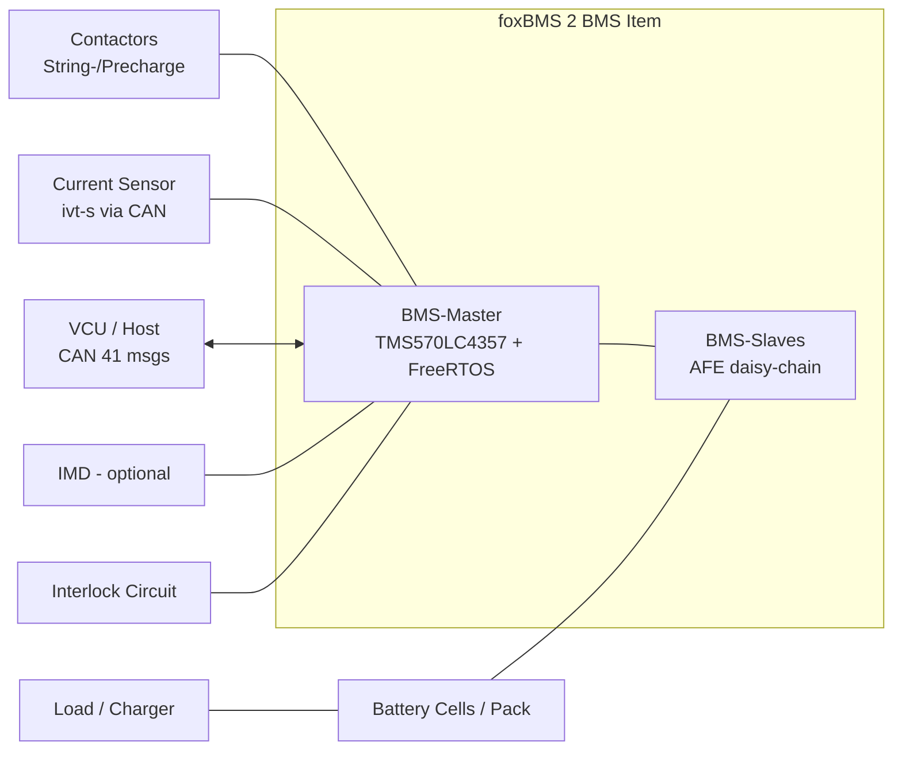

# foxBMS 2 — Stakeholder Requirements Specification

**Document Control**

| Field | Value |
|---|---|
| Project | foxBMS 2 — Battery Management System |
| Document | Stakeholder Requirements Specification |
| Baseline | BAS-REF-001 (commit `308028fb`, tag `v1.11.0`) |
| Profiles | `as_is` (source-grounded) + `synthetic_reference` (hypothetical) |
| Corpus status | `synthetic_ready_with_limitations` |
| Generated | 2026-09-13T02:20:37Z |

## Scope

Stakeholder requirements for the foxBMS 2 reference BMS item: item definition, boundaries, operational situation, modes, external systems, and stakeholder needs. Reverse-engineered from the repository (source tree, `conf/bms/bms.json`, `docs/` user documentation) and grounded in `FB2-SRC-DOC` governance artifacts.

## Item Definition

**Item**: foxBMS 2 Battery Management System Reference Platform

foxBMS 2 is a free, open and flexible development environment to design battery management systems — the first modular open-source BMS development platform (README, `docs/general/motivation.rst`). The platform controls modern and complex electrical energy storage systems of any size and is used for lithium-ion and solid-state batteries, lithium-sulfur batteries, sodium-ion batteries, lithium-ion capacitors (LIC), electric double-layer capacitors (EDLC), redox-flow batteries and fuel cells, or hybrid combinations.

The reference item consists of:

- **foxBMS BMS-Master** (two boards: BMS-Master + BMS-Interface), optionally extended by the BMS-Extension board,
- **BMS-Slaves** on the battery modules — measure cell voltages and cell temperatures and perform passive balancing, daisy-chainable,
- **Embedded BMS software** (`src/app`: 40 modules in application/driver/engine/task layers) running on the RTOS, plus bootloader (`src/bootloader`) and CLI tool (`cli/`).

Reference hardware/software configuration (reverse-engineered from `conf/bms/bms.json`):

| Property | Reference value |
|---|---|
| MCU | TI TMS570LC4357 (ARM Cortex-R5F, lockstep) |
| RTOS | freertos |
| AFE (per slave) | ltc 6813-1 |
| Current sensor | isabellenhuette ivt-s via can |
| Balancing strategy | voltage (passive) |
| Insulation monitoring device | none |
| Cell blocks (reference) | 18 (1 module(s) × 18 cell blocks, 1 string(s)) |
| State estimation (reference) | SOC counting, SOE counting, SOF trapezoid, SOH none |

## System Boundaries

**Included in item scope** (implemented in this repository):

- Embedded BMS application firmware (`src/app`) — measurement control, SOA monitoring, plausibility checks, redundancy checks, BMS state machine, contactor and precharge control, balancing, state estimation, diagnosis, database, system monitoring, CAN and Ethernet communication
- Bootloader (`src/bootloader`) — field update of the application via CAN
- CLI tool (`cli/`) — repository interaction, build/flash support (`fox` command)
- Unit test suite (`tests/unit`) — 313 C unit test files executed in CI
- foxBMS 2 documentation (`docs/`)

**Excluded from item scope (external)**:

- Battery cells and the battery pack itself (only parameters configured, e.g. `battery_cell_cfg.h`, `battery_system_cfg.h`)
- Superior control unit (VCU/host controller) — receives CAN messages, sends state requests (e.g. `f_BmsStateRequest`, 41-message DBC at `tools/dbc/foxbms.dbc`)
- Current sensor (Isabellenhütte ivt-s) — controlled via CAN, delivers current, voltage, temperature and power measurements
- Insulation monitoring device — optional external IMD (reference config: none)
- Battery packs / loads / chargers connected through the main contactors
- Interlock circuit actors (external emergency-stop wiring), only supervised by the BMS
- Power supply (KL30, KL15) feeding the BMS-Master

## Operational Situation

The documented and default-configured use case is a **stationary battery energy storage system** (`docs/introduction/use-case.rst`): the BMS supervises the battery, requests contactor state changes via CAN and opens the contactors on error to isolate the battery. Stationary operation permits disconnection on malfunction, unlike traction use cases where an immediate open would endanger passengers.

The BMS-Master additionally supervises a closely monitored interlock line and measures the pack current via a CAN-attached current sensor.

## Modes

Operational modes are implemented as the BMS finite state machine (`src/app/application/bms/bms.h`, 13 states, 34 substates):

- `BMS_FSM_STATE_UNINITIALIZED`
- `BMS_FSM_STATE_INITIALIZATION`
- `BMS_FSM_STATE_INITIALIZED`
- `BMS_FSM_STATE_IDLE`
- `BMS_FSM_STATE_OPEN_CONTACTORS`
- `BMS_FSM_STATE_STANDBY`
- `BMS_FSM_STATE_PRECHARGE`
- `BMS_FSM_STATE_NORMAL`
- `BMS_FSM_STATE_DISCHARGE`
- `BMS_FSM_STATE_CHARGE`
- `BMS_FSM_STATE_ERROR`
- `BMS_FSM_STATE_UNDEFINED`
- `BMS_FSM_STATE_RESERVED1`

Current-flow submodes: `BMS_CHARGING`, `BMS_DISCHARGING`, `BMS_RELAXATION`, `BMS_AT_REST`. The CAN-visible states (`BMS_CAN_STATE_*`) mirror the FSM states.

## External Systems

- Battery cells / pack (monitored, not part of the item)
- VCU / superior control unit (CAN, 41 messages in `foxbms.dbc`)
- Current sensor (CAN, Isabellenhütte ivt-s reference)
- Charger / inverter / load behind the contactors
- BMS-Slaves (via AFE daisy-chain interface on the BMS-Interface board)
- Interlock wiring / emergency stop
- IMD (optional)
- Power supply KL30/KL15, debug interfaces (UART, Ethernet, debugger)

## Stakeholder Needs

Reverse-engineered stakeholder needs and their repository anchors:

| ID | Need | Repository anchor |
|---|---|---|
| SN-01 | Open, free and modular BMS development platform | BSD-3-Clause license (`LICENSE`), open-source toolchain, modular drivers |
| SN-02 | Safe operation of the battery within its safe operating area (SOA) | `src/app/application/soa/`, MOL/RSL/MSL limit model, `docs/software/modules/application/soa/soa.rst` |
| SN-03 | Battery isolation on error (safe state = contactors open) | BMS FSM `BMS_FSM_STATE_ERROR` → `BMS_FSM_STATE_OPEN_CONTACTORS`; use-case doc |
| SN-04 | Accurate cell voltage / temperature measurement | AFE drivers (LTC/ADI/Maxim/NXP), `MEAS` module, plausibility + redundancy checks |
| SN-05 | Cell balancing to equalize cell voltages | `src/app/application/bal/` (voltage strategy reference) |
| SN-06 | State estimation (SOC/SOE/SOF/SOH) | `src/app/application/algorithm/state_estimation/` (counting/trapezoid reference) |
| SN-07 | Diagnosis and error handling with defined severities | 85 `DIAG_ID_*` entries in `src/app/engine/config/diag_cfg.h`, `docs/system/system-error-table.csv` |
| SN-08 | Communication with superior control unit (CAN) | `src/app/driver/can/`, DBC `tools/dbc/foxbms.dbc` (41 messages) |
| SN-09 | Ethernet interface for user-defined applications | `src/app/application/ethernet/` (FreeRTOS+TCP echo-server reference) |
| SN-10 | Field-updatable firmware | `src/bootloader/` + CLI `fox bootloader` (see `docs/software/bootloader/`) |
| SN-11 | High-quality, tested software | 313 unit test files, CI-enforced 100% line/branch coverage policy (`docs/developer-manual/software/software-testing.rst`... |
| SN-12 | Portability across MCU and OS | layered architecture, MCU wrapper HAL, FreeRTOS/SafeRTOS abstraction (`src/os/`) |

## Use-Case Context

The reference use case is a stationary battery storage: three power contactors (string minus, string plus, precharge) connect/disconnect the battery strings; on error the BMS opens the contactors and isolates the battery (source: `docs/introduction/use-case.rst`; safe-state premise `FB2-SAF-SGO-000001`).

Precharge sequence (implemented in BMS FSM substates `BMS_FSM_SUBSTATE_PRECHARGE_*`): close string-minus, close precharge, wait for precharge completion, open precharge, close string-plus.

**Caption**: System context — BMS item with external actors and boundary.

**Premise traceability**: hazard premises `FB2-SAF-HAZ-000001`; safety objective `FB2-SAF-SGO-000001`; item scope artifact `governance/scope-and-applicability.json`; repository anchors listed above.

---

*Generated: 2026-09-13T02:20:37Z — auto-generated from the machine-verifiable corpus. Regenerate with `python3 docs/artifacts/tools/render_spec_documents.py`.*
