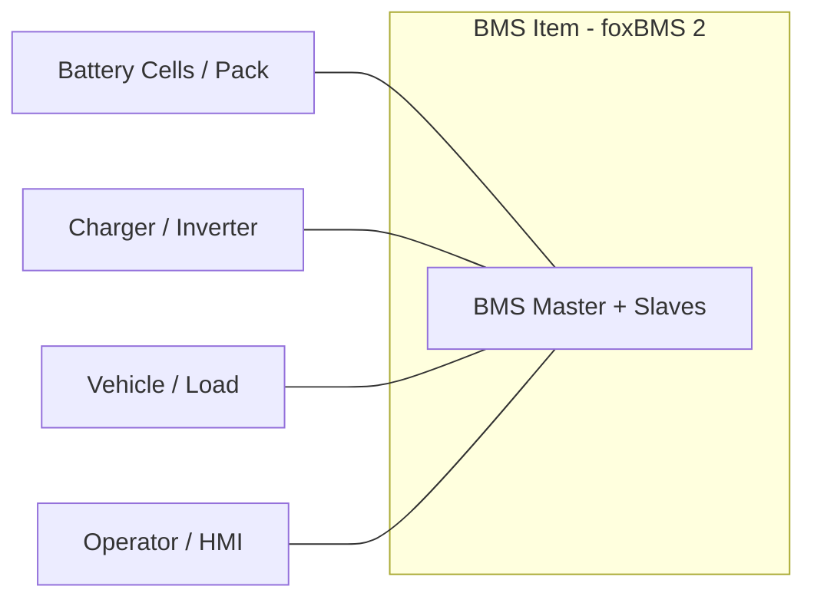

# foxBMS 2 — Stakeholder Requirements Specification

**Document Control**

| Field | Value |
|---|---|
| Project | foxBMS 2 — Battery Management System |
| Document | Stakeholder Requirements Specification |
| Baseline | BAS-REF-001 (commit `308028fb`, tag `v1.11.0`) |
| Profiles | `as_is` (source-grounded) + `synthetic_reference` (hypothetical) |
| Corpus status | `synthetic_ready_with_limitations` |
| Generated | 2026-09-12T01:01:53Z |

## Scope

Stakeholder requirements for the foxBMS 2 reference BMS item: item definition, boundaries, operational situation, modes, external systems, and stakeholder needs. Derived from `FB2-SRC-DOC` governance artifacts; premises traced by artifact ID.

## Item Definition

**Item**: foxBMS 2 Battery Management System Reference Platform

Modular, open-source BMS development platform for lithium-ion and other battery chemistries. Supports cell voltage/temperature measurement, balancing, state estimation, contactor control, insulation monitoring, and CAN/Ethernet communication. Based on TI TMS570LC4357 MCU with FreeRTOS.

## System Boundaries

**Included in item scope**:

**Excluded from item scope (external)**:

## Operational Situation

N/A

## Modes

- N/A — not specified in corpus

## External Systems

- N/A — not specified in corpus

## Stakeholder Needs

Stakeholder needs not enumerated in corpus scope artifact; premises trace to `FB2-SAF-HAZ-000001` (hazard premises) and `FB2-SAF-SGO-000001` (safety objective).

## Use-Case Context

The reference use case is a stationary battery storage: three power contactors (main plus, main minus, precharge) connect/disconnect the battery; on error the contactors open and isolate the battery (source: corpus use-case premise, `FB2-SAF-SGO-000001` safe state).

**Caption**: System context — BMS item with external actors and boundary.

**Premise traceability**: hazard premises `FB2-SAF-HAZ-000001`; safety objective `FB2-SAF-SGO-000001`; item scope artifact `governance/scope-and-applicability.json`.

---

*Generated: 2026-09-12T01:01:53Z — auto-generated from the machine-verifiable corpus. Regenerate with `python3 docs/artifacts/tools/render_spec_documents.py`.*
