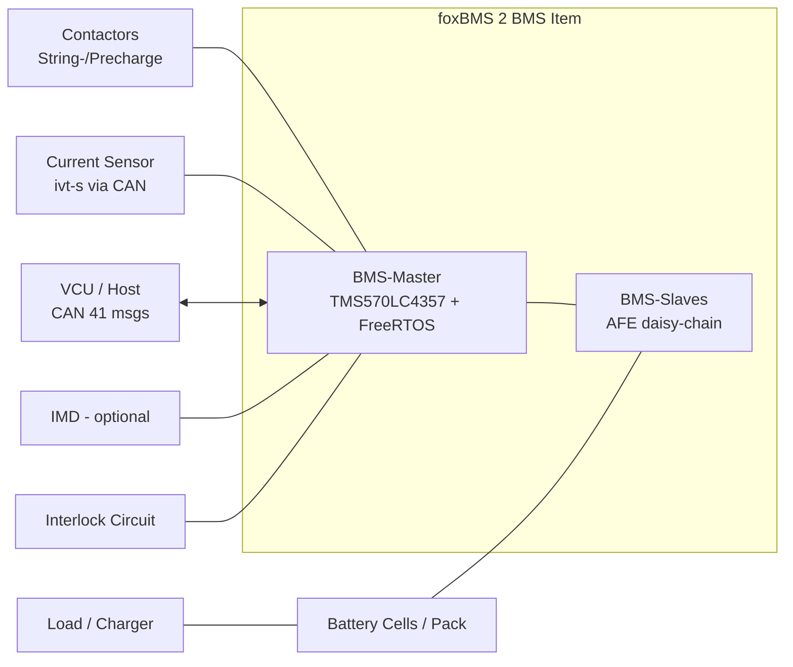

# foxBMS 2 — Stakeholder Requirements Specification

**Document Control**

| Field | Value |
|---|---|
| Project | foxBMS 2 — Battery Management System |
| Document | Stakeholder Requirements Specification |
| Baseline | BAS-REF-001 (commit `308028fb`, tag `v1.11.0`) |
| Profiles | `as_is` (source-grounded) + `synthetic_reference` (hypothetical) |
| Corpus status | `synthetic_ready_with_limitations` |
| Generated | 2026-10-01T16:36:58Z |

## Scope

Stakeholder requirements for the foxBMS 2 reference BMS item: item definition, boundaries, operational situation, modes, external systems, and stakeholder needs. Reverse-engineered from the repository (source tree, `conf/bms/bms.json`, `docs/` user documentation) and grounded in `FB2-SRC-DOC` governance artifacts.

## Item Definition

**Item**: foxBMS 2 Battery Management System Reference Platform

foxBMS 2 is a free, open and flexible development environment to design battery management systems — the first modular open-source BMS development platform (README, `docs/general/motivation.rst`). The platform controls modern and complex electrical energy storage systems of any size and is used for lithium-ion and solid-state batteries, lithium-sulfur batteries, sodium-ion batteries, lithium-ion capacitors (LIC), electric double-layer capacitors (EDLC), redox-flow batteries and fuel cells, or hybrid combinations.

The reference item consists of:

- **foxBMS BMS-Master** (two boards: BMS-Master + BMS-Interface), optionally extended by the BMS-Extension board,
- **BMS-Slaves** on the battery modules — measure cell voltages and cell temperatures and perform passive balancing, daisy-chainable,
- **Embedded BMS software** (`src/app`: 40 modules in application/driver/engine/task layers) running on the RTOS, plus bootloader (`src/bootloader`) and CLI tool (`cli/`).

Reference hardware/software configuration (reverse-engineered from `conf/bms/bms.json`):

| Property | Reference value |
|---|---|
| MCU | TI TMS570LC4357 (ARM Cortex-R5F, lockstep) |
| RTOS | freertos |
| AFE (per slave) | ltc 6813-1 |
| Current sensor | isabellenhuette ivt-s via can |
| Balancing strategy | voltage (passive) |
| Insulation monitoring device | none |
| Cell blocks (reference) | 18 (1 module(s) × 18 cell blocks, 1 string(s)) |
| State estimation (reference) | SOC counting, SOE counting, SOF trapezoid, SOH none |

## System Boundaries

**Included in item scope** (implemented in this repository):

- Embedded BMS application firmware (`src/app`) — measurement control, SOA monitoring, plausibility checks, redundancy checks, BMS state machine, contactor and precharge control, balancing, state estimation, diagnosis, database, system monitoring, CAN and Ethernet communication
- Bootloader (`src/bootloader`) — field update of the application via CAN
- CLI tool (`cli/`) — repository interaction, build/flash support (`fox` command)
- Unit test suite (`tests/unit`) — 313 C unit test files executed in CI
- foxBMS 2 documentation (`docs/`)

**Excluded from item scope (external)**:

- Battery cells and the battery pack itself (only parameters configured, e.g. `battery_cell_cfg.h`, `battery_system_cfg.h`)
- Superior control unit (VCU/host controller) — receives CAN messages, sends state requests (e.g. `f_BmsStateRequest`, 41-message DBC at `tools/dbc/foxbms.dbc`)
- Current sensor (Isabellenhütte ivt-s) — controlled via CAN, delivers current, voltage, temperature and power measurements
- Insulation monitoring device — optional external IMD (reference config: none)
- Battery packs / loads / chargers connected through the main contactors
- Interlock circuit actors (external emergency-stop wiring), only supervised by the BMS
- Power supply (KL30, KL15) feeding the BMS-Master

## Operational Situation

The documented and default-configured use case is a **stationary battery energy storage system** (`docs/introduction/use-case.rst`): the BMS supervises the battery, requests contactor state changes via CAN and opens the contactors on error to isolate the battery. Stationary operation permits disconnection on malfunction, unlike traction use cases where an immediate open would endanger passengers.

The BMS-Master additionally supervises a closely monitored interlock line and measures the pack current via a CAN-attached current sensor.

## Modes

Operational modes are implemented as the BMS finite state machine (`src/app/application/bms/bms.h`, 13 states, 34 substates):

- `BMS_FSM_STATE_UNINITIALIZED`
- `BMS_FSM_STATE_INITIALIZATION`
- `BMS_FSM_STATE_INITIALIZED`
- `BMS_FSM_STATE_IDLE`
- `BMS_FSM_STATE_OPEN_CONTACTORS`
- `BMS_FSM_STATE_STANDBY`
- `BMS_FSM_STATE_PRECHARGE`
- `BMS_FSM_STATE_NORMAL`
- `BMS_FSM_STATE_DISCHARGE`
- `BMS_FSM_STATE_CHARGE`
- `BMS_FSM_STATE_ERROR`
- `BMS_FSM_STATE_UNDEFINED`
- `BMS_FSM_STATE_RESERVED1`

Current-flow submodes: `BMS_CHARGING`, `BMS_DISCHARGING`, `BMS_RELAXATION`, `BMS_AT_REST`. The CAN-visible states (`BMS_CAN_STATE_*`) mirror the FSM states.

## External Systems

- Battery cells / pack (monitored, not part of the item)
- VCU / superior control unit (CAN, 41 messages in `foxbms.dbc`)
- Current sensor (CAN, Isabellenhütte ivt-s reference)
- Charger / inverter / load behind the contactors
- BMS-Slaves (via AFE daisy-chain interface on the BMS-Interface board)
- Interlock wiring / emergency stop
- IMD (optional)
- Power supply KL30/KL15, debug interfaces (UART, Ethernet, debugger)

## Stakeholder Needs

Reverse-engineered stakeholder needs and their repository anchors:

| ID | Need | Repository anchor |
|---|---|---|
| SN-01 | Open, free and modular BMS development platform | BSD-3-Clause license (`LICENSE`), open-source toolchain, modular drivers |
| SN-02 | Safe operation of the battery within its safe operating area (SOA) | `src/app/application/soa/`, MOL/RSL/MSL limit model, `docs/software/modules/application/soa/soa.rst` |
| SN-03 | Battery isolation on error (safe state = contactors open) | BMS FSM `BMS_FSM_STATE_ERROR` → `BMS_FSM_STATE_OPEN_CONTACTORS`; use-case doc |
| SN-04 | Accurate cell voltage / temperature measurement | AFE drivers (LTC/ADI/Maxim/NXP), `MEAS` module, plausibility + redundancy checks |
| SN-05 | Cell balancing to equalize cell voltages | `src/app/application/bal/` (voltage strategy reference) |
| SN-06 | State estimation (SOC/SOE/SOF/SOH) | `src/app/application/algorithm/state_estimation/` (counting/trapezoid reference) |
| SN-07 | Diagnosis and error handling with defined severities | 85 `DIAG_ID_*` entries in `src/app/engine/config/diag_cfg.h`, `docs/system/system-error-table.csv` |
| SN-08 | Communication with superior control unit (CAN) | `src/app/driver/can/`, DBC `tools/dbc/foxbms.dbc` (41 messages) |
| SN-09 | Ethernet interface for user-defined applications | `src/app/application/ethernet/` (FreeRTOS+TCP echo-server reference) |
| SN-10 | Field-updatable firmware | `src/bootloader/` + CLI `fox bootloader` (see `docs/software/bootloader/`) |
| SN-11 | High-quality, tested software | 313 unit test files, CI-enforced 100% line/branch coverage policy (`docs/developer-manual/software/software-testing.rst`... |
| SN-12 | Portability across MCU and OS | layered architecture, MCU wrapper HAL, FreeRTOS/SafeRTOS abstraction (`src/os/`) |

## Use-Case Context

The reference use case is a stationary battery storage: three power contactors (string minus, string plus, precharge) connect/disconnect the battery strings; on error the BMS opens the contactors and isolates the battery (source: `docs/introduction/use-case.rst`; safe-state premise `FB2-SAF-SGO-000001`).

Precharge sequence (implemented in BMS FSM substates `BMS_FSM_SUBSTATE_PRECHARGE_*`): close string-minus, close precharge, wait for precharge completion, open precharge, close string-plus.

**Caption**: System context — BMS item with external actors and boundary.

```mermaid
flowchart LR
    subgraph Item[foxBMS 2 BMS Item]
        MASTER[BMS-Master\nTMS570LC4357 + FreeRTOS]
        SLAVES[BMS-Slaves\nAFE daisy-chain]
        MASTER --- SLAVES
    end
    CELLS[Battery Cells / Pack] --- SLAVES
    CONT[Contactors\nString-/Precharge] --- MASTER
    CS[Current Sensor\nivt-s via CAN] --- MASTER
    VCU[VCU / Host\nCAN 41 msgs] <--> MASTER
    IMD[IMD - optional] --- MASTER
    ILCK[Interlock Circuit] --- MASTER
    LOAD[Load / Charger] --- CELLS
```

**Premise traceability**: hazard premises `FB2-SAF-HAZ-000001`; safety objective `FB2-SAF-SGO-000001`; item scope artifact `governance/scope-and-applicability.json`; repository anchors listed above.

### Profile: `synthetic_reference` — Part 3 item definition and SYS.1 elicitation

#### `FB2-SAF-ITE-000001` — Item definition: the hypothetical 400 V traction battery monitoring and control unit of Project Northcell (Part 3 item)

- **Item name**: Traction battery monitoring and control unit (BMS), 400 V class
- **Item purpose**: Monitor the cell voltages, cell temperatures and pack current of a 400 V lithium-ion traction battery, keep every cell inside its safe operating area, and control the high-voltage contactors that connect and disconnect the battery, so that no cell leaves its safe operating area without the item having detected the condition and acted within a bounded time.
- **Hypothetical**: `true` — this record describes a programme that does not exist
- **Operating envelope**: 400 V nominal pack, 2500 mV to 4200 mV per cell; 96 monitored cells
- **Functions**: 13 · **operational situations**: 9 · **modes**: 7 · **external systems**: 6
- **Guard**: profile=`synthetic_reference`, origin=`synthetic`, human_approval_status=`pending`, production_authorized=`false`

**Boundary**

| Inside the item | Why inside | Outside the item | Why outside | Residual risk owner |
|---|---|---|---|---|
| BMS master board: MCU, PMIC, independent hardware cell-voltage monitor... | It acquires the measurements the safety goal depends on and actuates the contactors that realise the safe stat... | Lithium-ion cells and the pack mechanical structure | Thermal runaway is a property of the cell chemistry, not of the item's E/E systems. It is outside the function... | Pack integrator (fictional role: pack_sa... |
| BMS master firmware: measurement control, SOA monitoring, plausibility... | The decision to open the contactors is taken here; so is the detection of the condition that requires it. | Battery enclosure, venting device and crash structure | Passive mechanical protection against a chemistry hazard, outside the E/E-system boundary. | Pack integrator (fictional role: pack_sa... |
| Four monitoring slaves with the analogue front end, cell input network... | The cell voltages are measured here. A fault in this element produces the hazardous event directly, so it cann... | Vehicle high-voltage interlock chain actuators and the emergency-stop ... | The item supervises the interlock; it does not actuate it. Whether the vehicle opens the circuit is the vehicl... | Vehicle manufacturer (fictional role: ve... |
| Configuration and calibration data: safe operating area limits, cell a... | The limits are the decision boundary between safe and unsafe operation. A wrong limit is a safety defect even ... | Charger, inverter and DC/DC converter control strategies | The item publishes charge and discharge limits and expects the converter to respect them. Whether it does is o... | Vehicle manufacturer (fictional role: ve... |
| Contactor feedback and interlock input conditioning | Without the feedback the item cannot know that the safe state was reached, so the fault reaction is unverified... | Production line programming and end-of-line test equipment | A production and service process, not a function of the item. It is covered by post-development lifecycle reco... | End-of-line test owner (fictional role: ... |

**Operational situations**

| Id | Situation | In/out | Argument |
|---|---|---|---|
| `OS-001` | Vehicle parked, charger connected, mains present, pack at rest. The item is fully active and supervises the pack. | including | The charging case is the situation in which overvoltage happens most readily and in which a single cell may sit at the top of its range while the pack... |
| `OS-002` | Vehicle in motion, pack discharging, traction requested. | including | In this situation opening the contactors removes propulsion while the vehicle is moving. The safe state is therefore mode-dependent, and a blanket 'op... |
| `OS-003` | Vehicle in motion, regenerative braking, pack charging under load. | including | Regeneration raises cell voltage under load, so the overvoltage detection path is exercised in a situation where opening the contactors is also disrup... |
| `OS-004` | Post-crash, high-voltage system possibly damaged, pack state unknown, insulation possibly lost. | including | After a crash the item may be the only thing that knows whether the pack is energised. Its behaviour must be defined even though the environment is ou... |
| `OS-005` | Production line, item not yet installed in a pack, cables not connected. | including | The commissioning mode is when open-circuit inputs and unconnected sensors are normal. A monitor that treats every open input as a cell at zero volts ... |
| `OS-006` | Workshop service, item removed from the pack, diagnostic tool connected. | including | A service technician connecting a tool is the most likely route by which an external actor reaches the item's communication interfaces. |
| `OS-007` | Storage and transport of the pack, not in a vehicle, not on a charger. | excluding | No electrical function of the item is active, so no hazardous event attributable to the item arises. Excluded from the item's operational situations a... |
| `OS-008` | Post-decommissioning, pack dismantled for recycling. | excluding | The item is destroyed or removed before this point. The hazard is handled by the recycler's own assumptions, recorded in the decommissioning record. |
| `OS-009` | Workshop, item powered on a service supply, one measurement channel degraded by component drift or damage while the pack is otherw... | including | A degrading channel is the situation in which the item's normal disagreement checks begin to fire on a pack that is not actually at a limit. Whether t... |

**Operating modes**

| Id | Mode | Entry | Exit | Safe state in this mode |
|---|---|---|---|---|
| `MOD-001` | INITIALISATION | Supply voltage within range and reset released. | All configured data structures initialised and self-checks passed. | Contactor drivers held de-energised. The item cannot command the contactors closed in this mode under any circ... |
| `MOD-002` | STANDBY | Self-checks passed and the vehicle controller has not requested a current flow. | A current-flow request is accepted, or a safety reaction is required. | Contactor drivers de-energised; monitoring fully active. |
| `MOD-003` | PRECHARGE | A current-flow request is accepted and the pack voltage is below the precharge t... | Pack voltage within tolerance of the bus voltage, or precharge timed out. | If the precharge path is interrupted the item opens the precharge contactor and returns to STANDBY. It must ne... |
| `MOD-004` | CLOSED / CURRENT FLOW | Precharge complete and string-plus closed. | A safety reaction, a state request to OPEN, or supply loss. | This is the mode where the safe state is genuinely mode-dependent. Opening the contactors removes propulsion f... |
| `MOD-005` | DEGRADED | A diagnosis entry whose severity permits continued operation with reduced capabi... | The degraded condition clears, or a condition requiring the full safe state aris... | Capability is reduced and the reduction is indicated to the vehicle controller. The item must not enter DEGRAD... |
| `MOD-006` | FAULT | A diagnosis entry whose severity requires the safe state. | The condition is acknowledged and cleared by an authorised service action only. | All high-voltage contactors open, charging disabled, fault logged. This mode is latched: it is not left by the... |
| `MOD-007` | COMMISSIONING | A maintenance pin or service tool asserts commissioning. | The service session ends and the pin is removed. | Contactor actuation inhibited unless an explicit, logged commissioning command is present. Open-circuit sensor... |

**Interfaces to other safety-related items**

- **Vehicle high-voltage safety monitor (the vehicle-level item that judges whether a collisio...** — The vehicle-level monitor asserts the interlock line and receives the item's state and insulation-related diagnosis. *Assumption dependence:* That the vehicle-level monitor is itself functional-safety qualified and that its assertion is not defeatable by the item. *If false:* A pack insulation fault could persist with the contactors closed, or the item could open the contactors in a collision where keeping the pack energised is required for first-responder operation.
- **Battery cell supplier's cell-protection function (embedded in the protection circuit of ea...** — The cell protection circuit disconnects a cell on its own overvoltage condition, independently of the item. *Assumption dependence:* That the cell protection circuit's threshold and timing are known to the item's integrator and are compatible with the item's own limits. *If false:* The cell protection circuit could act before the item detects the condition, producing an unexplained capacity loss, or could fail to act at all in a cell whose protection is defeated, in which case t...

**What this item definition does not establish**

- This item definition is synthetic. It describes a hypothetical programme and asserts no property of any real vehicle, pack, supplier or organisation.
- No stakeholder was interviewed, no workshop was held and no requirement was elicited from a real party. The stakeholder needs it raises are declared assumptions, which is why every one of them carries is_a_real_elicitation = false.
- The environmental limits in this record are engineering assumptions for the hypothetical programme. Nothing here demonstrates that the item meets any of them.
- The item definition establishes no ASIL. ASIL is assigned to safety goals in the hazard analysis, and this record does not allocate it.
- The boundary between the item's cell-voltage monitoring and the cell supplier's own cell protection is drawn from the hypothetical integrator's viewpoint. In a real programme this boundary is negotiated between two organisations and is a contractual artefact.
- The interfaces to other safety-related items are recorded as assumptions on systems the item does not contain. Whether those assumptions hold in a real vehicle is outside anything this corpus can show.

#### `FB2-SYS-NED-000001` — Stakeholder need: the pack manufacturer shall not lose usable capacity through false safety reactions

- **Stakeholder**: `STK-001` (pack_manufacturer), fictional=`true`
- **Need**: A pack manufacturer integrating the item shall be able to charge a healthy pack to its declared full state and discharge it to its declared minimum without the item reducing the pack's usable energy, and shall be able to state the delivered capacity against the declared capacity for warranty purposes.
- **Priority**: 1 — A safety function that reacts to a healthy pack is a cost the pack manufacturer carries and the driver experiences as a shortened range.
- **Elicitation**: `assumption_declaration` · **is_a_real_elicitation**: `false`
- **Refined into**: `FB2-SYS-SYR-000001`, `FB2-SYS-SYR-000002`
- **Validation measures**: `FB2-VER-TMS-000012`
- **Limitation**: This is a declared need, not an elicited one. No pack manufacturer stated it, and the warranty framing in it is this corpus's invention. Validating it confirms the item behaves as an assumed party would want; it cannot confirm that the assumption matches any real pack manufacturer's interest.

#### `FB2-SYS-NED-000002` — Stakeholder need: on a degradation the item shall retain a usable capability rather than escalate immediately

- **Stakeholder**: `STK-002` (end_user_driver), fictional=`true`
- **Need**: When a measurement channel degrades, the item shall continue to supervise and control the pack with reduced capability and shall announce the reduction, rather than opening the contactors on the first detected disagreement.
- **Priority**: 2 — The need is the difference between a serviceable vehicle and an immobilised one.
- **Elicitation**: `assumption_declaration` · **is_a_real_elicitation**: `false`
- **Refined into**: `FB2-SYS-SYR-000002`, `FB2-SYS-SYR-000004`
- **Validation measures**: `FB2-VER-TMS-000014`
- **Limitation**: Declared, not elicited. The degradation magnitudes this need implies are not specified anywhere in the corpus; the concept names three degraded modes but the boundary between degraded and fault is not defined numerically, and this need cannot be validated until it is.

#### `FB2-SYS-NED-000003` — Stakeholder need: a driver shall be left in control and told what happened when the item reaches the safe state under power

- **Stakeholder**: `STK-003` (vehicle_manufacturer), fictional=`true`
- **Need**: When the item opens the contactors under power, the vehicle shall remain steerable and brakeable and the driver shall be told, in ordinary language and without a service manual, that the battery has been isolated and why.
- **Priority**: 2 — This is the need that the master prompt's warning about mode-dependent safety behaviour makes unavoidable: disconnecting a battery during traction removes propulsion, so the reaction that satisfies th...
- **Elicitation**: `assumption_declaration` · **is_a_real_elicitation**: `false`
- **Refined into**: `FB2-SYS-SYR-000003`, `FB2-SYS-SYR-000004`
- **Validation measures**: `FB2-VER-TMS-000013`
- **Limitation**: Declared, not elicited, and the phrase 'ordinary language' is not measurable as written. No driver has been consulted and no usability study exists. The measure written against this need proposes asking a driver representative, which is a process invention rather than a derived acceptance criterion.

#### `FB2-SYS-NED-000004` — Stakeholder need: the vehicle manufacturer shall receive the item's state and limits and shall not be able to talk the item out of a safety decision

- **Stakeholder**: `STK-004` (service_technician), fictional=`true`
- **Need**: The item shall publish its state, its limits and its fault condition to the vehicle manufacturer's control unit, and shall act on that control unit's state requests only when doing so is consistent with the item's own safety evaluation.
- **Priority**: 3 — The vehicle manufacturer owns the vehicle-level safety case and needs enough of the item's state to integrate with it, and needs the item not to become a hazard to that case through an unhandled reque...
- **Elicitation**: `assumption_declaration` · **is_a_real_elicitation**: `false`
- **Refined into**: `FB2-SYS-SYR-000007`, `FB2-SYS-SYR-000006`
- **Validation measures**: `FB2-VER-TMS-000013`, `FB2-VER-TMS-000014`
- **Limitation**: Declared, not elicited. The corpus has no interface agreement with any vehicle manufacturer, so the set of requests the item may honour and the set it may refuse is not written down anywhere. The 'won't be able to talk the item out of a safety decision' half of this need is asserted by the cybersecurity requirements, not demonstrated.

#### `FB2-SYS-NED-000005` — Stakeholder need: a trained service technician shall be able to commission and service the item without being able to energise it incorrectly

- **Stakeholder**: `STK-005` (end_of_line_tester), fictional=`true`
- **Need**: A service technician following the item's documented commissioning and service procedure shall be able to complete every step in the order given, and shall not be able by any sequence of the documented steps to leave the item able to command the contactors closed with unconnected or open-circuit sensor inputs.
- **Priority**: 4 — The technician is the stakeholder with the least ability to recover from a mistake and the most opportunity to make one, because the procedure is executed on an item that is not yet trusted and theref...
- **Elicitation**: `assumption_declaration` · **is_a_real_elicitation**: `false`
- **Refined into**: `FB2-SYS-SYR-000008`
- **Validation measures**: `FB2-VER-TMS-000015`
- **Limitation**: Declared, not elicited. No service procedure exists in approved form anywhere in this corpus, and the technician who would execute it is fictional, so the need describes a requirement on a document that has not been written.

#### `FB2-SYS-UC-000001` — Use case: charging a healthy 400 V pack to its declared full state

- **Stakeholders served**: `FB2-SYS-NED-000001`, `FB2-SYS-NED-000004`
- **Validation measures**: `FB2-VER-TMS-000012`
**Main success scenario**

1. The charger requests a charge current flow → The item accepts and closes the contactors through the precharge sequence without any safety reaction
2. The charger ramps the pack toward its declared full state → The item monitors throughout and raises no entry that forces the safe state
3. The charger reaches the declared full state and stops requesting current → The item returns to a resting state with the contactors in their commanded position
4. The delivered energy is measured → At least 98% of the pack's declared usable capacity has been delivered

**Operational scenarios**

- **`OS-001`** — Vehicle parked, charger connected, pack charging at its limit
  - Perturbation: One cell approaches the configured maximum limit and sits within the measurement noise band of it for longer than the debounce window
  - Expected item behaviour: The item must not classify this as a violation and must not react, because the cell has not crossed the limit
  - Observable by: The pack manufacturer, from the delivered energy and the item's own fault output
  - Safe-state interaction: Not reached. This scenario tests that the item stays out of the safe state when it should, which is the failure mode a one-directional validation would miss.

**Limitations**

- This use case is declared, not elicited from a real charging operation. Its 98% delivered-energy figure is an engineering proposal with no basis in a pack specification.
- The single operational scenario covers the false-reaction case only. The genuine overvoltage case is the next use case, which is why the pair together covers the detection and the non-detection directions.
- No charging has been performed. The measure written against this use case is blocked.

#### `FB2-SYS-UC-000002` — Use case: cell overvoltage detected while the vehicle is being driven

- **Stakeholders served**: `FB2-SYS-NED-000003`, `FB2-SYS-NED-000001`
- **Validation measures**: `FB2-VER-TMS-000013`
**Main success scenario**

1. The cell voltage rises above the configured maximum limit → The item classifies the violation after the debounce and requests the safe state
2. The item commands the contactors open → All high-voltage contactors open within the fault-tolerant time interval
3. The vehicle coasts to a stop → Steering and brake assist remain available throughout
4. The driver is informed → An unambiguous statement that the battery has been isolated for a battery fault
5. The item remains in the fault mode after the vehicle has stopped → The fault is latched and does not clear on its own

**Operational scenarios**

- **`OS-002`** — Vehicle in motion under traction, pack discharging
  - Perturbation: One cell driven above the configured maximum limit at 20 mV/s
  - Expected item behaviour: Detect, confirm, command open, confirm open, latch the fault and indicate it
  - Observable by: The end-user driver, and the vehicle manufacturer from the item's published state
  - Safe-state interaction: Reached. This is the scenario in which the safe state costs the vehicle its propulsion, which is why the reaction is specified per mode rather than once.
- **`OS-003`** — Vehicle in motion under regenerative braking, pack charging under load
  - Perturbation: Regeneration drives a cell above the configured maximum limit
  - Expected item behaviour: The same detect-and-react chain, but the reaction also terminates the regeneration, so the converter must tolerate an abrupt load removal
  - Observable by: The vehicle manufacturer
  - Safe-state interaction: Reached.
- **`OS-004`** — Post-crash, pack state unknown, insulation possibly lost
  - Perturbation: Item loses its measurement link entirely
  - Expected item behaviour: The item treats loss of the measurement link as requiring the safe state rather than as a tolerable fault
  - Observable by: The vehicle manufacturer, from the item's published state
  - Safe-state interaction: Reached. Note that post-crash behaviour may be governed by the vehicle-level item instead; this scenario records the hypothetical project's assumption that the battery item acts on its own, which is an assumption and not...

**Limitations**

- The scenarios assume the vehicle remains controllable after an abrupt contactor opening, which is a vehicle-integration property this corpus does not model at all. It is the largest unverified assumption in this use case.
- The post-crash scenario records an assumption about division of responsibility with the vehicle-level safety item that no agreement supports.
- No vehicle has been driven and no driver has been observed.

#### `FB2-SYS-UC-000003` — Use case: a single measurement channel degrades in service

- **Stakeholders served**: `FB2-SYS-NED-000002`, `FB2-SYS-NED-000005`
- **Validation measures**: `FB2-VER-TMS-000014`
**Main success scenario**

1. A degradation begins on one measurement channel → The item detects the disagreement without being told
2. The item moves to its degraded mode → Contactor control is retained and the reduction is published to the vehicle control unit
3. The service technician inspects the item → The technician can identify which channel degraded from the item's own output without external equipment
4. The degradation is repaired and cleared → The item returns to normal mode and the degraded indication clears

**Operational scenarios**

- **`OS-001`** — Pack at rest in a workshop, item powered, healthy pack
  - Perturbation: The redundant channel is offset progressively beyond the plausibility envelope
  - Expected item behaviour: Enter degraded mode with monitoring rate increased and transfer limited, rather than opening the contactors
  - Observable by: The service technician and the vehicle manufacturer
  - Safe-state interaction: Deliberately not reached for a moderate degradation. Reaching it is the failure this scenario exists to detect, because an item that escalates every degradation is safe and useless.
- **`OS-009`** — Pack at rest in a workshop, degradation continues past the point of any usable reference
  - Perturbation: The degraded channel is driven to a total loss of reference
  - Expected item behaviour: Escalate to the safe state rather than continue on an unusable channel
  - Observable by: The service technician
  - Safe-state interaction: Reached. The boundary between the first scenario and this one is the degraded-to-fault threshold, and no numerical value for that boundary exists in this corpus.

**Limitations**

- The plausibility envelope that decides degraded versus fault is not numerically specified anywhere in the corpus, so the boundary this use case depends on does not exist yet as a checkable value.
- No channel was degraded and no degradation was injected.
- The service-technician diagnosability criterion has no agreed definition.

#### `FB2-SYS-UC-000004` — Use case: commissioning a new item and servicing it in the workshop

- **Stakeholders served**: `FB2-SYS-NED-000005`
- **Validation measures**: `FB2-VER-TMS-000015`
**Main success scenario**

1. The technician follows the commissioning procedure → Every step is executable in the order given without an undocumented intermediate state
2. The technician connects the sense leads and confirms the item sees the right cells → The cell count and the individual values match the pack's build record
3. The technician releases commissioning and removes the tool → The item returns to a state in which no contactor actuation is possible without a current-flow request
4. The technician performs a later service action → The item's latched faults can be read and cleared only through the authorised route

**Operational scenarios**

- **`OS-005`** — Production line, item not yet installed in a pack
  - Perturbation: The commissioning input is asserted and a contactor close is attempted
  - Expected item behaviour: The close command is refused and the refusal is diagnosed; open-circuit inputs are not interpreted as cells at zero volts
  - Observable by: The end-of-line test operator
  - Safe-state interaction: Not reached, and that is the point: the item stays in its unenergised state rather than reaching a safe state from a condition in which it never left commissioning.
- **`OS-006`** — Workshop service with a diagnostic tool connected
  - Perturbation: An unframed or control-byte sequence is sent on the service link
  - Expected item behaviour: Bytes outside a validated, authenticated frame are not acted on, and the item's actuation state is unchanged
  - Observable by: The service technician, from the item's own diagnosis output
  - Safe-state interaction: Not reached. The item's state is unchanged, which is the correct outcome for a rejected input.

**Limitations**

- The procedure this use case validates does not exist in approved form in this corpus, so the use case describes an intent rather than a testable sequence.
- The workshop scenario's second half is a cybersecurity scenario and is verified by the security measures rather than by the service measure; the use case records the linkage and does not duplicate the verification.
- No technician has performed anything.

---

### Why the elicitation records are declared rather than elicited

Every stakeholder need above carries `is_a_real_elicitation: false`. No workshop was held, no stakeholder was interviewed and no questionnaire was issued for this corpus. The needs are therefore declared assumptions about what a hypothetical programme's stakeholders would want, and the validation measures written against them confirm that the item behaves as an assumed party would want — which is not the same as confirming that the need was right. That distinction is stated on each need record as well, in its `limitation` field.

---

*Generated: 2026-10-01T16:36:58Z — auto-generated from the machine-verifiable corpus. Regenerate with `python3 docs/artifacts/tools/render_spec_documents.py`.*
