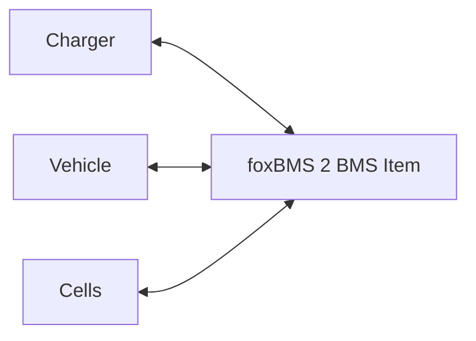
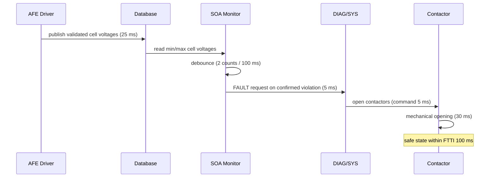

# foxBMS 2 — System Architecture Specification

**Document Control**

| Field | Value |
|---|---|
| Project | foxBMS 2 — Battery Management System |
| Document | System Architecture Specification |
| Baseline | BAS-REF-001 (commit `308028fb`, tag `v1.11.0`) |
| Profiles | `as_is` (source-grounded) + `synthetic_reference` (hypothetical) |
| Corpus status | `synthetic_ready_with_limitations` |
| Generated | 2026-09-12T01:01:53Z |

## Scope

System architecture viewpoints — context, functional block, dynamic — derived from the scope artifact and the per-profile link registries. One caption per diagram for text readers.

## Profile: `as_is`

### Context Viewpoint

**Caption**: BMS item boundary with external actors (from scope artifact).



### Functional Block Viewpoint

**Caption**: Cell-voltage protection chain blocks from the link registry (HAZ ← mitigates ← SGO ← refines ← FSRs ← allocated_to ← TSR/SWR).

```mermaid
flowchart TD
    HAZ["FB2-SAF-HAZ-000001 Hazard"]
    SGO["FB2-SAF-SGO-000001 Safety Goal"]
    HAZ --- SGO
    "FB2-SAF-FSR-000001" --- "FB2-SAF-SGO-000001"
    "FB2-SAF-FSR-000002" --- "FB2-SAF-SGO-000001"
    "FB2-SAF-FSR-000003" --- "FB2-SAF-SGO-000001"
    "FB2-HW-TSR-000001" -.allocated_to.-> "FB2-SAF-FSR-000001"
    "FB2-HW-TSR-000002" -.allocated_to.-> "FB2-SAF-FSR-000001"
    "FB2-HW-TSR-000003" -.allocated_to.-> "FB2-SAF-FSR-000003"
    "FB2-SW-SWR-000001" -.allocated_to.-> "FB2-SAF-FSR-000001"
    "FB2-SW-SWR-000002" -.allocated_to.-> "FB2-SAF-FSR-000002"
    "FB2-SW-SWR-000003" -.allocated_to.-> "FB2-SAF-FSR-000003"
    "FB2-SW-DSN-000001" -.implements.-> "FB2-SW-SWR-000001"
    "FB2-SW-DSN-000002" -.implements.-> "FB2-SW-SWR-000002"
    "FB2-SW-DSN-000003" -.implements.-> "FB2-SW-SWR-000003"
```

### Dynamic Viewpoint

**Caption**: Sequence of the cell-voltage protection chain (hazard detection to contactor opening) per link registry relations.



Relations derived from: `FB2-LNK-SAF-000001`, `FB2-LNK-SAF-000002`, `FB2-LNK-SAF-000003`, `FB2-LNK-SAF-000004`, `FB2-LNK-SAF-000005`, `FB2-LNK-SAF-000006` … (full registry in traceability document).

## Profile: `synthetic_reference`

### Context Viewpoint

**Caption**: BMS item boundary with external actors (from scope artifact).


### Functional Block Viewpoint

**Caption**: Cell-voltage protection chain blocks from the link registry (HAZ ← mitigates ← SGO ← refines ← FSRs ← allocated_to ← TSR/SWR).

```mermaid
flowchart TD
    HAZ["FB2-SAF-HAZ-000001 Hazard"]
    SGO["FB2-SAF-SGO-000001 Safety Goal"]
    HAZ --- SGO
    "FB2-SAF-FSR-000001" --- "FB2-SAF-SGO-000001"
    "FB2-SAF-FSR-000002" --- "FB2-SAF-SGO-000001"
    "FB2-SAF-FSR-000003" --- "FB2-SAF-SGO-000001"
    "FB2-SAF-FSR-000004" --- "FB2-SAF-SGO-000001"
    "FB2-HW-TSR-000001" -.allocated_to.-> "FB2-SAF-FSR-000001"
    "FB2-HW-TSR-000002" -.allocated_to.-> "FB2-SAF-FSR-000001"
    "FB2-HW-TSR-000003" -.allocated_to.-> "FB2-SAF-FSR-000003"
    "FB2-SW-SWR-000001" -.allocated_to.-> "FB2-SAF-FSR-000001"
    "FB2-SW-SWR-000002" -.allocated_to.-> "FB2-SAF-FSR-000002"
    "FB2-SW-SWR-000003" -.allocated_to.-> "FB2-SAF-FSR-000003"
    "FB2-SW-DSN-000001" -.implements.-> "FB2-SW-SWR-000001"
    "FB2-SW-DSN-000002" -.implements.-> "FB2-SW-SWR-000002"
    "FB2-SW-DSN-000003" -.implements.-> "FB2-SW-SWR-000003"
```

### Dynamic Viewpoint

**Caption**: Sequence of the cell-voltage protection chain (hazard detection to contactor opening) per link registry relations.


Relations derived from: `FB2-LNK-SAF-000001`, `FB2-LNK-SAF-000002`, `FB2-LNK-SAF-000003`, `FB2-LNK-SAF-000004`, `FB2-LNK-SAF-000005`, `FB2-LNK-SAF-000006` … (full registry in traceability document).


---

*Generated: 2026-09-12T01:01:53Z — auto-generated from the machine-verifiable corpus. Regenerate with `python3 docs/artifacts/tools/render_spec_documents.py`.*
