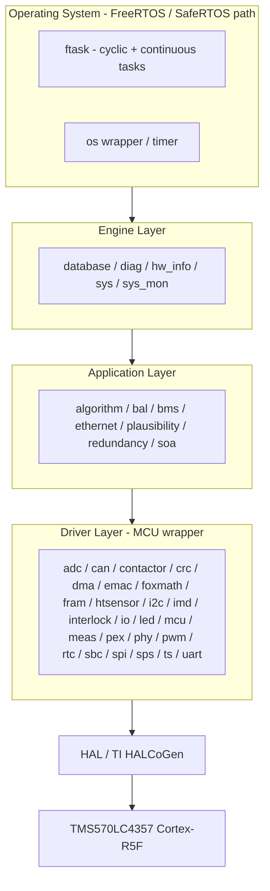
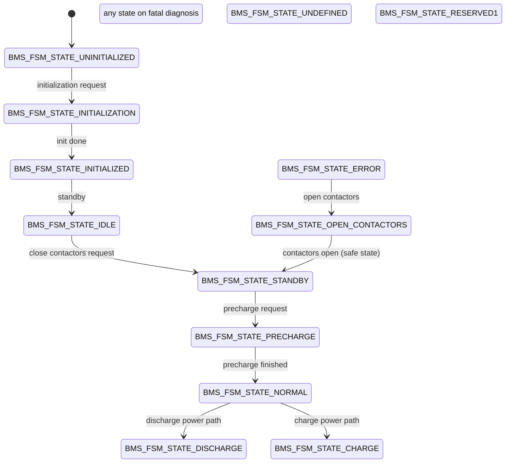
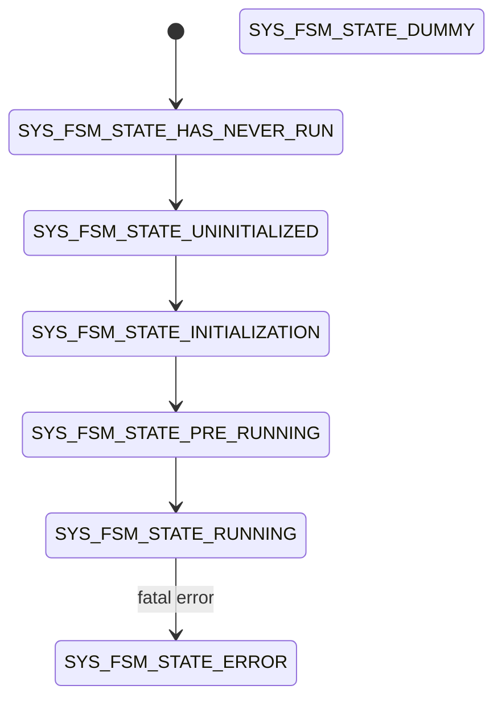
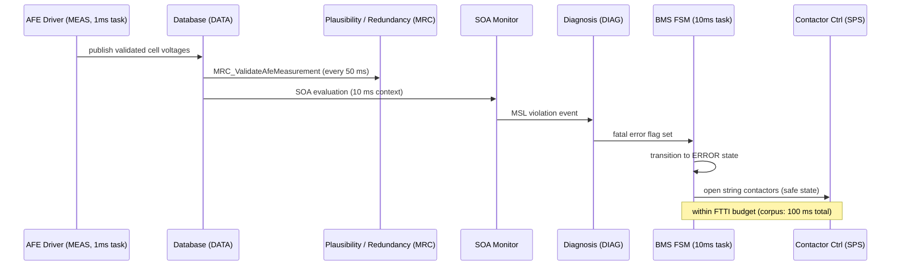

# foxBMS 2 — System Architecture Specification

**Document Control**

| Field | Value |
|---|---|
| Project | foxBMS 2 — Battery Management System |
| Document | System Architecture Specification |
| Baseline | BAS-REF-001 (commit `308028fb`, tag `v1.11.0`) |
| Profiles | `as_is` (source-grounded) + `synthetic_reference` (hypothetical) |
| Corpus status | `synthetic_ready_with_limitations` |
| Generated | 2026-09-13T15:17:46Z |

## Scope

System architecture viewpoints — context, functional block, dynamic — combining the reverse-engineered software architecture (layers, tasks, state machines, data flow; sources: `src/app`, `docs/software/structure/`) with the per-profile link registries.

## Context Viewpoint

**Caption**: foxBMS 2 system context — BMS-Master and BMS-Slaves with external actors (reverse-engineered from `docs/introduction/bms-overview.rst`, `conf/bms/bms.json`).

```mermaid
flowchart LR
    VCU[VCU / Host\nCAN: 41 msgs] <--> MASTER
    CS[Current Sensor\nivt-s] <--> MASTER
    IMD[IMD\noptional] --- MASTER
    subgraph Item[foxBMS 2 BMS Item]
        MASTER[BMS-Master\nTMS570LC4357 / FreeRTOS\nsrc/app: 40 modules]
        SLAVES[BMS-Slaves\nAFE daisy-chain]
    end
    MASTER <-->|SPI daisy-chain| SLAVES
    SLAVES --- CELLS[Battery Cells / Modules]\nvoltage + temperature + balancing
    MASTER --- CONT[Contactors\nString-/Precharge]
    MASTER --- ILCK[Interlock Circuit]
    CELLS --- LOAD[Load / Charger]
```


## Functional Block Viewpoint

**Caption**: Layered software architecture (source: `docs/software/structure/software-structure.rst`, `src/app/`) — application 7, driver 25, engine 5, task/OS 3 modules.

Design paradigms (from the structure documentation): (1) all application code runs in an operating-system context; (2) MCU and external-hardware dependent drivers are abstracted by wrappers/abstraction layers.



- **Engine layer**: diagnostics, error handling, system monitoring, database (producer/consumer asynchronous data exchange between tasks/modules).
- **Driver layer**: communication interfaces (CAN, UART, SPI, Ethernet/EMAC), measurement control (AFE, ADC, current sensor), hardware supervision (SBC, port expander, RTC, FRAM, interlock, contactors/SPS, IMD, LEDs).

### Task Engineering Viewpoint

**Caption**: Task-function mapping from `src/app/task/config/ftask_cfg.c` (user code functions per task, verified against the source).

| Task | Period / mode | Functions |
|---|---|---|
| 1ms | 1 ms cyclic | `OS_IncrementTimer`, `DIAG_UpdateFlags`, `MEAS_Control (AFE driver type FSM)`, `CAN_ReadRxBuffer` |
| 10ms | 10 ms cyclic | `SYSM_UpdateFramData`, `SYS_Trigger`, `ILCK_Trigger`, `ADC_Control`, `SPS_Ctrl`, `CAN_MainFunction`, `SOF_Calculation`, `ALGO_MonitorExecutionTime`, `SBC_Trigger`, `MRC_ValidateAfeMeasurement / MRC_ValidatePackMeasurement (every 50 ms)`, `BMS_Trigger (last: minimize reaction delay)` |
| 100ms | 100 ms cyclic | `SE_RunStateEstimations (every 1 s)`, `BAL_Trigger`, `IMD_Trigger`, `LED_Trigger`, `MINFO_CheckSupplyVoltageClamp30c` |
| 100ms-algorithm | 100 ms cyclic (algorithms) | `ALGO_MainFunction` |
| i2c (continuous) | continuous, 2 ms delay | `PEX_Trigger`, `HTSEN_Trigger`, `RTC_Trigger` |
| engine (continuous) | continuous, blocking | `SBC state machine / FRAM / engine sequencing` |

Priority order (from the docs): database/engine context highest, then 1 ms task (time-sensitive: diagnostics, measurement, CAN RX), 10 ms task (CAN TX, interlock, SPS, ADC, BMS trigger), 100 ms task (state estimation, balancing, IMD, LED), 100 ms algorithm task (user algorithms).

## Dynamic Viewpoint

### BMS State Machine (application core)

**Caption**: BMS FSM — 13 states (`src/app/application/bms/bms.h`), triggered every 10 ms by `BMS_Trigger()` in the 10 ms task.



Substates (34) implement the entry checks (interlock, state requests, balancing requests, error flags) and the precharge sequences (close minus → close precharge → check → open precharge → close plus; second-string variants included).

### SYS State Machine (engine startup sequencing)

**Caption**: SYS FSM — 7 states (`src/app/engine/sys/sys.h`), sequencing the startup: FRAM deep-discharge check, SBC init, interlock init, CAN init, RTC, built-in self-test, boot message, balancing init, first measurement cycle, current-sensor presence check, IMD init.




### Protection Chain Sequence (cell voltage)

**Caption**: Sequence of the cell-voltage protection chain (AFE → database → SOA plausibility → diagnosis → BMS FSM → contactors), matching the module call graph and the corpus FTTI allocation.




## Profile: `as_is` — Traceability Viewpoint

**Caption**: Cell-voltage protection chain blocks from the link registry (HAZ ← mitigates ← SGO ← refines ← FSRs ← allocated_to ← TSR/SWR).

```mermaid
flowchart TD
    HAZ["FB2-SAF-HAZ-000001 Hazard"]
    SGO["FB2-SAF-SGO-000001 Safety Goal"]
    HAZ --- SGO
    "FB2-SAF-FSR-000001" --- "FB2-SAF-SGO-000001"
    "FB2-SAF-FSR-000002" --- "FB2-SAF-SGO-000001"
    "FB2-SAF-FSR-000003" --- "FB2-SAF-SGO-000001"
    "FB2-HW-TSR-000001" -.allocated_to.-> "FB2-SAF-FSR-000001"
    "FB2-HW-TSR-000002" -.allocated_to.-> "FB2-SAF-FSR-000001"
    "FB2-HW-TSR-000003" -.allocated_to.-> "FB2-SAF-FSR-000003"
    "FB2-SW-SWR-000001" -.allocated_to.-> "FB2-SAF-FSR-000001"
    "FB2-SW-SWR-000002" -.allocated_to.-> "FB2-SAF-FSR-000002"
    "FB2-SW-SWR-000003" -.allocated_to.-> "FB2-SAF-FSR-000003"
    "FB2-SW-DSN-000001" -.implements.-> "FB2-SW-SWR-000001"
    "FB2-SW-DSN-000002" -.implements.-> "FB2-SW-SWR-000002"
    "FB2-SW-DSN-000003" -.implements.-> "FB2-SW-SWR-000003"
```


## Profile: `synthetic_reference` — Traceability Viewpoint

**Caption**: Cell-voltage protection chain blocks from the link registry (HAZ ← mitigates ← SGO ← refines ← FSRs ← allocated_to ← TSR/SWR).

```mermaid
flowchart TD
    HAZ["FB2-SAF-HAZ-000001 Hazard"]
    SGO["FB2-SAF-SGO-000001 Safety Goal"]
    HAZ --- SGO
    "FB2-SAF-FSR-000001" --- "FB2-SAF-SGO-000001"
    "FB2-SAF-FSR-000002" --- "FB2-SAF-SGO-000001"
    "FB2-SAF-FSR-000003" --- "FB2-SAF-SGO-000001"
    "FB2-SAF-FSR-000004" --- "FB2-SAF-SGO-000001"
    "FB2-HW-TSR-000001" -.allocated_to.-> "FB2-SAF-FSR-000001"
    "FB2-HW-TSR-000002" -.allocated_to.-> "FB2-SAF-FSR-000001"
    "FB2-HW-TSR-000003" -.allocated_to.-> "FB2-SAF-FSR-000003"
    "FB2-SW-SWR-000001" -.allocated_to.-> "FB2-SAF-FSR-000001"
    "FB2-SW-SWR-000002" -.allocated_to.-> "FB2-SAF-FSR-000002"
    "FB2-SW-SWR-000003" -.allocated_to.-> "FB2-SAF-FSR-000003"
    "FB2-SW-DSN-000001" -.implements.-> "FB2-SW-SWR-000001"
    "FB2-SW-DSN-000002" -.implements.-> "FB2-SW-SWR-000002"
    "FB2-SW-DSN-000003" -.implements.-> "FB2-SW-SWR-000003"
```


---

*Generated: 2026-09-13T15:17:46Z — auto-generated from the machine-verifiable corpus. Regenerate with `python3 docs/artifacts/tools/render_spec_documents.py`.*
