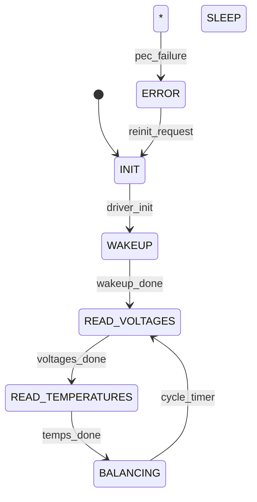
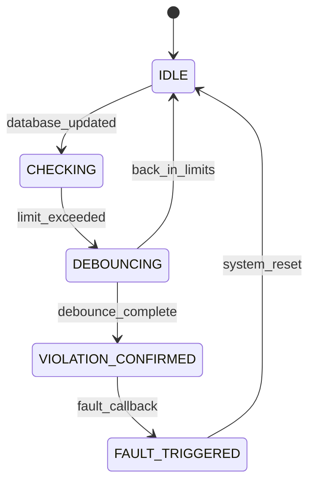
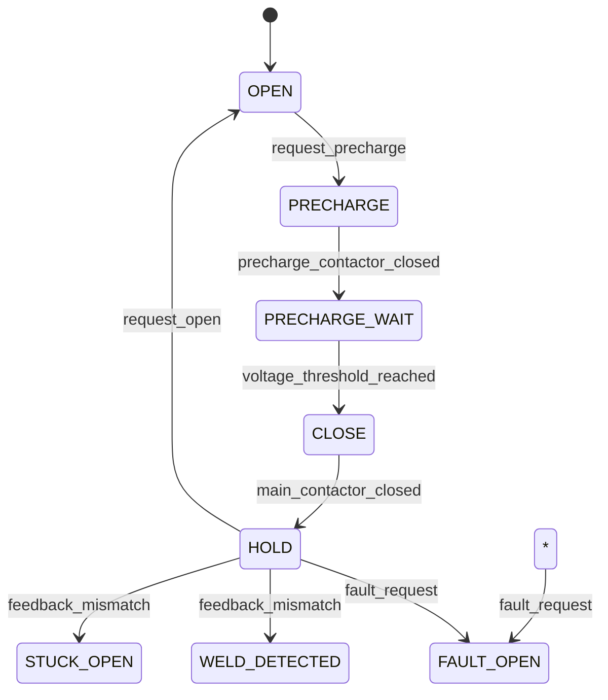
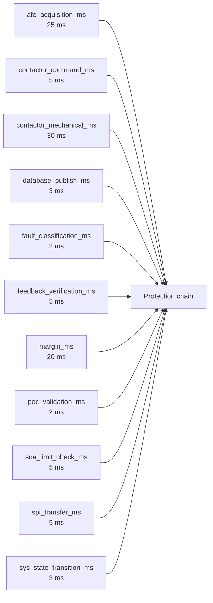

# foxBMS 2 — Software Architecture Specification

**Document Control**

| Field | Value |
|---|---|
| Project | foxBMS 2 — Battery Management System |
| Document | Software Architecture Specification |
| Baseline | BAS-REF-001 (commit `308028fb`, tag `v1.11.0`) |
| Profiles | `as_is` (source-grounded) + `synthetic_reference` (hypothetical) |
| Corpus status | `synthetic_ready_with_limitations` |
| Generated | 2026-09-12T01:01:53Z |

## Scope

Software architecture viewpoints: static component viewpoint (SWR/DSN relations), dynamic state-machine viewpoints per design artifact, and a task/thread timing context — all data-derived.

## Profile: `as_is`

### Static Component Viewpoint

**Caption**: SW requirements, designs, and implements/allocated_to relations.

```mermaid
flowchart TD
    "FB2-SW-SWR-000001" --> "FB2-SAF-FSR-000001"
    "FB2-SW-SWR-000002" --> "FB2-SAF-FSR-000002"
    "FB2-SW-SWR-000003" --> "FB2-SAF-FSR-000003"
    "FB2-SW-DSN-000001" -.implements.-> "FB2-SW-SWR-000001"
    "FB2-SW-DSN-000002" -.implements.-> "FB2-SW-SWR-000002"
    "FB2-SW-DSN-000003" -.implements.-> "FB2-SW-SWR-000003"
```


### Dynamic Viewpoint — `FB2-SW-DSN-000001`

**Caption**: State machine of `FB2-SW-DSN-000001` from `behavior_model` (state_machine).




### Dynamic Viewpoint — `FB2-SW-DSN-000002`

**Caption**: State machine of `FB2-SW-DSN-000002` from `behavior_model` (state_machine).




### Dynamic Viewpoint — `FB2-SW-DSN-000003`

**Caption**: State machine of `FB2-SW-DSN-000003` from `behavior_model` (state_machine).




## Profile: `synthetic_reference`

### Static Component Viewpoint

**Caption**: SW requirements, designs, and implements/allocated_to relations.

```mermaid
flowchart TD
    "FB2-SW-SWR-000001" --> "FB2-SAF-FSR-000001"
    "FB2-SW-SWR-000002" --> "FB2-SAF-FSR-000002"
    "FB2-SW-SWR-000003" --> "FB2-SAF-FSR-000003"
    "FB2-SW-DSN-000001" -.implements.-> "FB2-SW-SWR-000001"
    "FB2-SW-DSN-000002" -.implements.-> "FB2-SW-SWR-000002"
    "FB2-SW-DSN-000003" -.implements.-> "FB2-SW-SWR-000003"
```


### Dynamic Viewpoint — `FB2-SW-DSN-000001`

**Caption**: State machine of `FB2-SW-DSN-000001` from `behavior_model` (state_machine).


### Dynamic Viewpoint — `FB2-SW-DSN-000002`

**Caption**: State machine of `FB2-SW-DSN-000002` from `behavior_model` (state_machine).


### Dynamic Viewpoint — `FB2-SW-DSN-000003`

**Caption**: State machine of `FB2-SW-DSN-000003` from `behavior_model` (state_machine).


### Task/Thread Timing Context

**Caption**: Timing budget elements (from `FB2-SAF-SGO-000001`) as scheduling context.




---

*Generated: 2026-09-12T01:01:53Z — auto-generated from the machine-verifiable corpus. Regenerate with `python3 docs/artifacts/tools/render_spec_documents.py`.*
