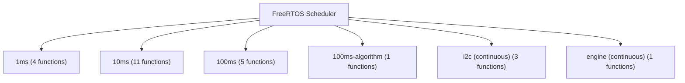
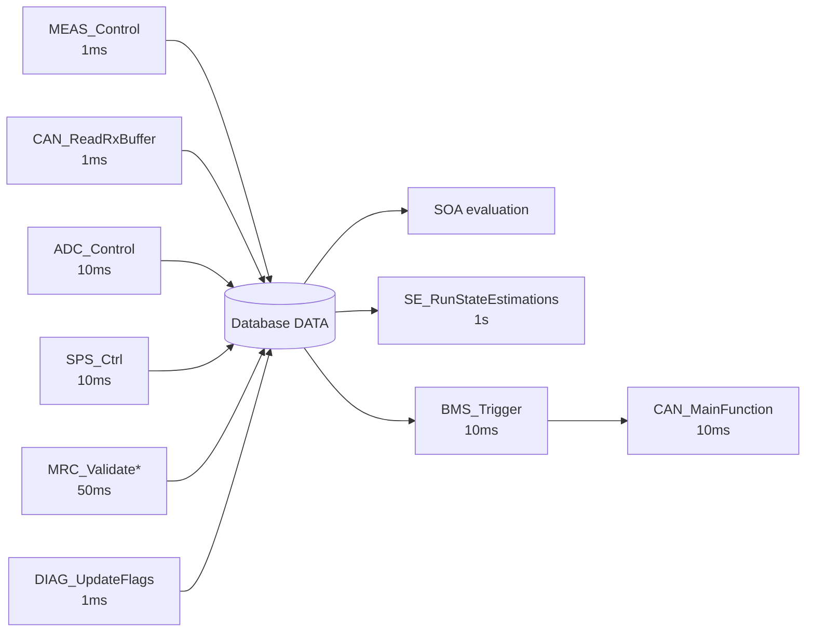
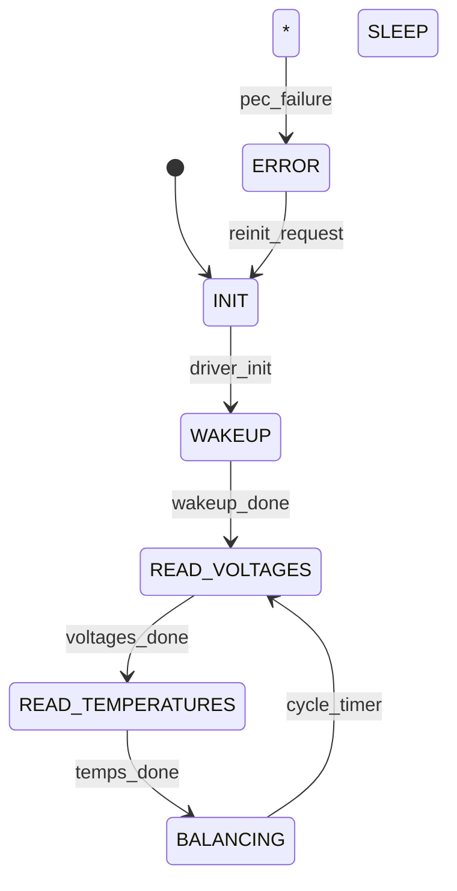
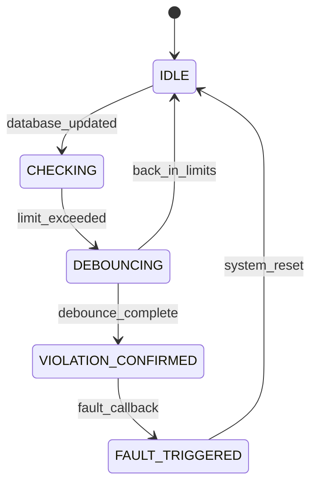
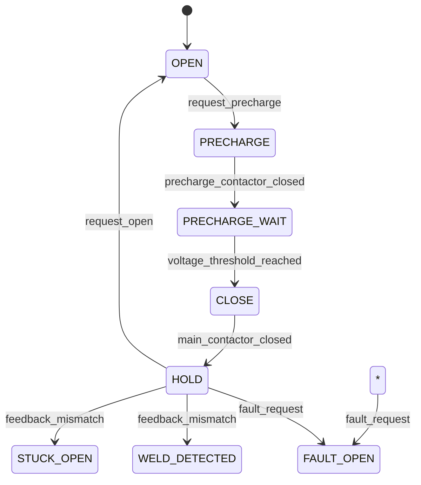
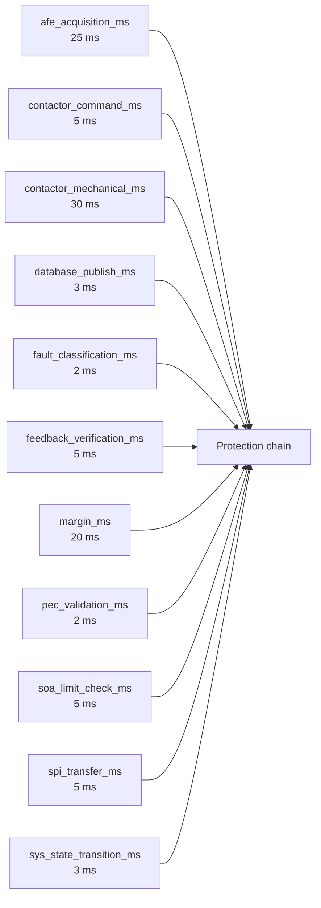

# foxBMS 2 — Software Architecture Specification

**Document Control**

| Field | Value |
|---|---|
| Project | foxBMS 2 — Battery Management System |
| Document | Software Architecture Specification |
| Baseline | BAS-REF-001 (commit `308028fb`, tag `v1.11.0`) |
| Profiles | `as_is` (source-grounded) + `synthetic_reference` (hypothetical) |
| Corpus status | `synthetic_ready_with_limitations` |
| Generated | 2026-09-13T15:17:46Z |

## Scope

Software architecture viewpoints: reverse-engineered static component viewpoint (40-module inventory across 4 layers with prefixes and unit tests), dynamic viewpoints (BMS/SYS state machines, task model), plus the corpus SWR/DSN relations per profile.

## Static Component Viewpoint — Module Inventory

All software modules reverse-engineered from `src/app/` (layer / module / prefix / brief / sources / unit tests).

### Layer: `engine` (5 modules)

| Module | Prefix | Responsibility (from `@brief`) | Files | Unit tests |
|---|---|---|---|---|
| `engine/database` | `DATA` | Database module header | 4 | 2 |
| `engine/diag` | `DIAG` | Diagnosis driver header | 24 | 1 |
| `engine/hw_info` | `MINFO` | General foxBMS-master system information | 2 | 1 |
| `engine/sys` | `SYS` | Software reset driver header | 4 | 2 |
| `engine/sys_mon` | `SYSM` | System monitoring module | 2 | 1 |

### Layer: `task` (3 modules)

| Module | Prefix | Responsibility (from `@brief`) | Files | Unit tests |
|---|---|---|---|---|
| `task/ftask` | `FTSK` | Header of task driver implementation | 3 | 2 |
| `task/os` | `OS` | Declaration of the OS wrapper interface | 4 | 1 |
| `task/timer` | `TIMER` | Header file for the timer wrapper | 2 | 1 |

### Layer: `application` (7 modules)

| Module | Prefix | Responsibility (from `@brief`) | Files | Unit tests |
|---|---|---|---|---|
| `application/algorithm` | `ALGO` | Algorithms framework: SOX estimation and moving averages | 26 | 1 |
| `application/bal` | `BAL` | Header for the driver for balancing | 5 | 1 |
| `application/bms` | `BMS` | BMS driver header | 2 | 1 |
| `application/ethernet` | `ETH` | Header of the ethernet software | 4 | 2 |
| `application/plausibility` | `PL` | Plausibility checks for cell voltage and cell temperatures | 2 | 1 |
| `application/redundancy` | `MRC` | Header files for handling redundancy between redundant cell voltage | 2 | 1 |
| `application/soa` | `SOA` | Header for SOA module, responsible for checking battery parameters | 2 | 1 |

### Layer: `driver` (25 modules)

| Module | Prefix | Responsibility (from `@brief`) | Files | Unit tests |
|---|---|---|---|---|
| `driver/adc` | `ADC` | Headers for the driver for the ADC module. | 2 | 1 |
| `driver/can` | `CAN` | Header for the driver for the CAN module | 44 | 4 |
| `driver/contactor` | `CONT` | Headers for the driver for the contactors. | 2 | 1 |
| `driver/crc` | `CRC` | CRC module header | 2 | 1 |
| `driver/dma` | `DMA` | Headers for the driver for the DMA module. | 2 | 4 |
| `driver/emac` | `EMAC` | Implementation of emac driver | 4 | 2 |
| `driver/foxmath` | `MATH` | Math library for often used math functions | 4 | 2 |
| `driver/fram` | `FRAM` | Header for the driver for the FRAM module | 2 | 1 |
| `driver/htsensor` | `HTSEN` | Header for the driver for the Sensirion SHT35-DIS I2C humidity/temperature sensor | 2 | 1 |
| `driver/i2c` | `I2C` | Header for the driver for the I2C module | 2 | 1 |
| `driver/imd` | `IMD` | API header for the insulation monitoring device | 12 | 1 |
| `driver/interlock` | `ILCK` | Headers for the driver for the interlock. | 2 | 1 |
| `driver/io` | `IO` | Header for the driver for the IO module | 2 | 1 |
| `driver/led` | `LED` | Header file of the debug LED driver | 2 | 1 |
| `driver/mcu` | `MCU` | Headers for the driver for the MCU module. | 2 | 1 |
| `driver/meas` | `MEAS` | Headers for the driver for the measurements needed by the BMS | 2 | 1 |
| `driver/pex` | `PEX` | Header for the driver for the NXP PCA9539 port expander module | 2 | 1 |
| `driver/phy` | `PHY` | Implementation of physical layer driver | 2 | 1 |
| `driver/pwm` | `PWM` | PWM driver for the TMS570LC43xx. | 2 | 1 |
| `driver/rtc` | `RTC` | Header file of the RTC driver | 2 | 1 |
| `driver/sbc` | `FS85` | Driver for the NXP FS85 SBC (system basis chip) supervisor | 11 | 3 |
| `driver/spi` | `SPI` | Headers for the driver for the SPI module. | 3 | 9 |
| `driver/sps` | `SPS` | Headers for the driver for the smart power switches. | 3 | 1 |
| `driver/ts` | `BETA` | Temperature sensor evaluation (resistive divider, beta model) | 44 | 1 |
| `driver/uart` | `UART` | Drivers for UART RS232 | 2 | 2 |

Configuration is separated from module logic into per-layer `config/` directories (`src/app/*/config/*_cfg.c|h`) — each module pairs with a `*_cfg` file (see Detailed Design).

## Dynamic Viewpoint — Task Model

**Caption**: RTOS task set (FreeRTOS): four cyclic tasks (1 ms, 10 ms, 100 ms, 100 ms algorithm) plus continuous blocking tasks (I2C, engine). Source: `src/app/task/ftask/ftask.c`, `src/app/task/config/ftask_cfg.c`.




## Data Exchange Viewpoint

**Caption**: Producer/consumer database (engine layer) — asynchronous data exchange between tasks; single producer, multiple consumers, integrity ensured (source: `docs/software/structure/application.rst`, `src/app/engine/database/`).




## Profile: `as_is` — Traceability Viewpoints

### Static Component Viewpoint (corpus)

**Caption**: SW requirements, designs, and implements/allocated_to relations.

```mermaid
flowchart TD
    "FB2-SW-SWR-000001" --> "FB2-SAF-FSR-000001"
    "FB2-SW-SWR-000002" --> "FB2-SAF-FSR-000002"
    "FB2-SW-SWR-000003" --> "FB2-SAF-FSR-000003"
    "FB2-SW-DSN-000001" -.implements.-> "FB2-SW-SWR-000001"
    "FB2-SW-DSN-000002" -.implements.-> "FB2-SW-SWR-000002"
    "FB2-SW-DSN-000003" -.implements.-> "FB2-SW-SWR-000003"
```


### Dynamic Viewpoint — `FB2-SW-DSN-000001`

**Caption**: State machine of `FB2-SW-DSN-000001` from `behavior_model` (state_machine).




### Dynamic Viewpoint — `FB2-SW-DSN-000002`

**Caption**: State machine of `FB2-SW-DSN-000002` from `behavior_model` (state_machine).




### Dynamic Viewpoint — `FB2-SW-DSN-000003`

**Caption**: State machine of `FB2-SW-DSN-000003` from `behavior_model` (state_machine).




## Profile: `synthetic_reference` — Traceability Viewpoints

### Static Component Viewpoint (corpus)

**Caption**: SW requirements, designs, and implements/allocated_to relations.

```mermaid
flowchart TD
    "FB2-SW-SWR-000001" --> "FB2-SAF-FSR-000001"
    "FB2-SW-SWR-000002" --> "FB2-SAF-FSR-000002"
    "FB2-SW-SWR-000003" --> "FB2-SAF-FSR-000003"
    "FB2-SW-DSN-000001" -.implements.-> "FB2-SW-SWR-000001"
    "FB2-SW-DSN-000002" -.implements.-> "FB2-SW-SWR-000002"
    "FB2-SW-DSN-000003" -.implements.-> "FB2-SW-SWR-000003"
```


### Dynamic Viewpoint — `FB2-SW-DSN-000001`

**Caption**: State machine of `FB2-SW-DSN-000001` from `behavior_model` (state_machine).


### Dynamic Viewpoint — `FB2-SW-DSN-000002`

**Caption**: State machine of `FB2-SW-DSN-000002` from `behavior_model` (state_machine).


### Dynamic Viewpoint — `FB2-SW-DSN-000003`

**Caption**: State machine of `FB2-SW-DSN-000003` from `behavior_model` (state_machine).


### Task/Thread Timing Context

**Caption**: Timing budget elements (from `FB2-SAF-SGO-000001`) as scheduling context.




---

*Generated: 2026-09-13T15:17:46Z — auto-generated from the machine-verifiable corpus. Regenerate with `python3 docs/artifacts/tools/render_spec_documents.py`.*
