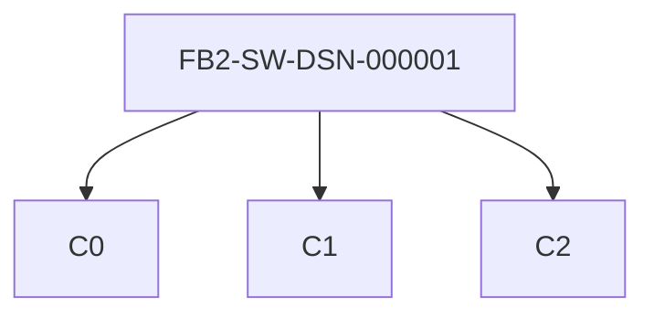
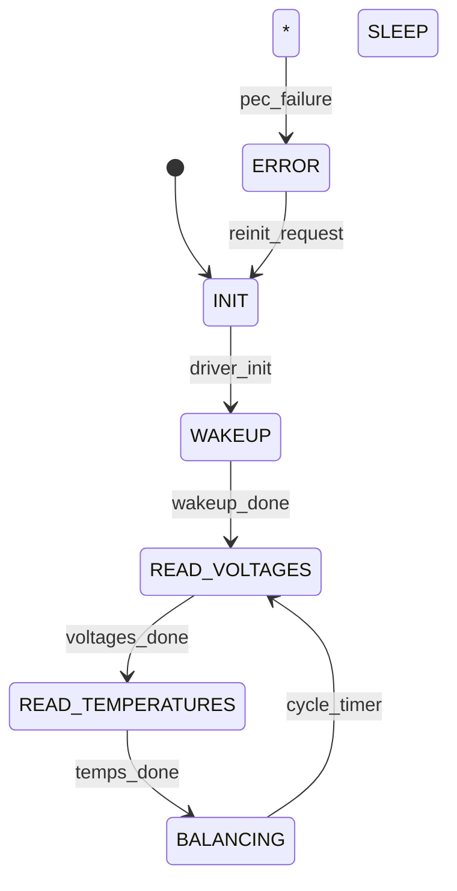
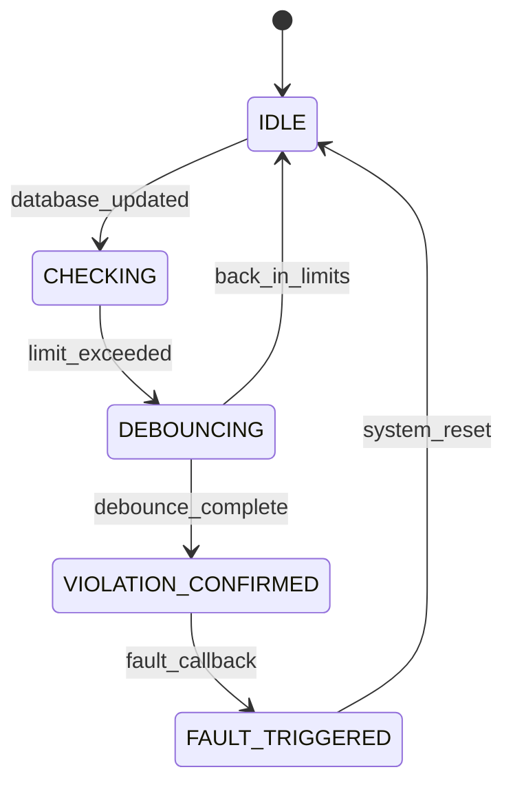
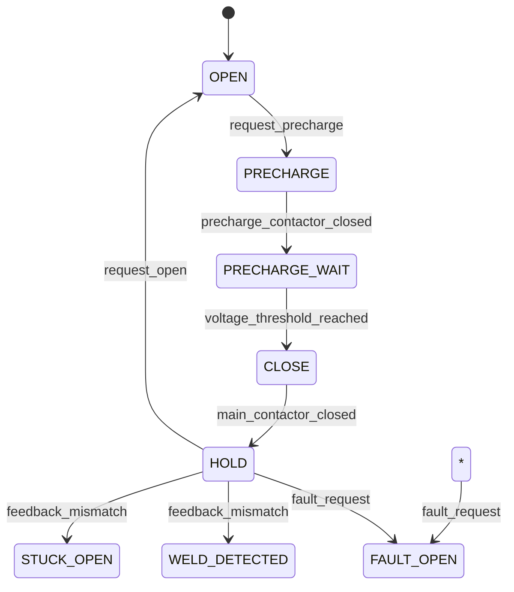

# foxBMS 2 — Detailed Design Specification

**Document Control**

| Field | Value |
|---|---|
| Project | foxBMS 2 — Battery Management System |
| Document | Detailed Design Specification |
| Baseline | BAS-REF-001 (commit `308028fb`, tag `v1.11.0`) |
| Profiles | `as_is` (source-grounded) + `synthetic_reference` (hypothetical) |
| Corpus status | `synthetic_ready_with_limitations` |
| Generated | 2026-09-13T04:11:53Z |

## Scope

Detailed design per software component: (1) reverse-engineered per-module design from `src/app/` — files, config, responsibilities, unit tests, documentation anchors; (2) corpus design artifacts with decomposition, interfaces, constraints, budgets, failure response and behavior models.

## Reverse-Engineered Module Designs

Per-module design of all 40 software modules, mined from the source tree. `Sources` lists the C/H files, `Config` the module's configuration pair in `src/app/*/config/`, `Unit tests` the Ceedling/Unity test files run in CI.

### `application/algorithm`

- **Prefix**: `ALGO` | **Layer group**: `ALGORITHMS`
- **Responsibility**: Algorithms framework: SOX estimation and moving averages
- **Sources (26)**: `src/app/application/algorithm/algorithm.c`, `src/app/application/algorithm/algorithm.h`, `src/app/application/algorithm/config/algorithm_cfg.c`, `src/app/application/algorithm/config/algorithm_cfg.h`, `src/app/application/algorithm/moving_average/moving_average.c`, `src/app/application/algorithm/moving_average/moving_average.h`, `src/app/application/algorithm/state_estimation/soc/counting/soc_counting.c`, `src/app/application/algorithm/state_estimation/soc/counting/soc_counting_cfg.h` …
- **Unit tests (1)**: `test_algorithm.c`
- **Module documentation**: `docs/software/modules/application/algorithm/algorithm.rst`

### `application/bal`

- **Prefix**: `BAL` | **Layer group**: `APPLICATION`
- **Responsibility**: Header for the driver for balancing
- **Sources (5)**: `src/app/application/bal/bal.c`, `src/app/application/bal/bal.h`, `src/app/application/bal/history/bal_strategy_history.c`, `src/app/application/bal/none/bal_strategy_none.c`, `src/app/application/bal/voltage/bal_strategy_voltage.c`
- **Configuration**: `src/app/application/config/bal_cfg.c`, `src/app/application/config/bal_cfg.h`
- **Unit tests (1)**: `test_bal.c`
- **Module documentation**: `docs/software/modules/application/bal/bal.rst`

### `application/bms`

- **Prefix**: `BMS` | **Layer group**: `ENGINE`
- **Responsibility**: BMS driver header
- **Sources (2)**: `src/app/application/bms/bms.c`, `src/app/application/bms/bms.h`
- **Configuration**: `src/app/application/config/bms_cfg.h`
- **Unit tests (1)**: `test_bms.c`
- **Module documentation**: `docs/software/modules/application/bms/bms.rst`

### `application/ethernet`

- **Prefix**: `ETH` | **Layer group**: `APPLICATION`
- **Responsibility**: Header of the ethernet software
- **Sources (4)**: `src/app/application/ethernet/ethernet.c`, `src/app/application/ethernet/ethernet.h`, `src/app/application/ethernet/ethernet_freertos.c`, `src/app/application/ethernet/ethernet_freertos.h`
- **Configuration**: `src/app/application/config/ethernet_cfg.c`, `src/app/application/config/ethernet_cfg.h`
- **Unit tests (2)**: `test_ethernet.c`, `test_ethernet_freertos.c`
- **Module documentation**: `docs/software/modules/application/ethernet/ethernet.rst`

### `application/plausibility`

- **Prefix**: `PL` | **Layer group**: `APPLICATION`
- **Responsibility**: Plausibility checks for cell voltage and cell temperatures
- **Sources (2)**: `src/app/application/plausibility/plausibility.c`, `src/app/application/plausibility/plausibility.h`
- **Configuration**: `src/app/application/config/plausibility_cfg.h`
- **Unit tests (1)**: `test_plausibility.c`
- **Module documentation**: `docs/software/modules/application/plausibility/plausibility.rst`

### `application/redundancy`

- **Prefix**: `MRC` | **Layer group**: `APPLICATION`
- **Responsibility**: Header files for handling redundancy between redundant cell voltage
- **Sources (2)**: `src/app/application/redundancy/redundancy.c`, `src/app/application/redundancy/redundancy.h`
- **Unit tests (1)**: `test_redundancy.c`
- **Module documentation**: `docs/software/modules/application/redundancy/redundancy.rst`

### `application/soa`

- **Prefix**: `SOA` | **Layer group**: `APPLICATION`
- **Responsibility**: Header for SOA module, responsible for checking battery parameters
- **Sources (2)**: `src/app/application/soa/soa.c`, `src/app/application/soa/soa.h`
- **Configuration**: `src/app/application/config/soa_cfg.c`, `src/app/application/config/soa_cfg.h`
- **Unit tests (1)**: `test_soa.c`
- **Module documentation**: `docs/software/modules/application/soa/soa.rst`

### `driver/adc`

- **Prefix**: `ADC` | **Layer group**: `DRIVERS`
- **Responsibility**: Headers for the driver for the ADC module.
- **Sources (2)**: `src/app/driver/adc/adc.c`, `src/app/driver/adc/adc.h`
- **Unit tests (1)**: `test_adc.c`
- **Module documentation**: `docs/software/modules/driver/adc/adc.rst`

### `driver/can`

- **Prefix**: `CAN` | **Layer group**: `DRIVERS`
- **Responsibility**: Header for the driver for the CAN module
- **Sources (44)**: `src/app/driver/can/can.c`, `src/app/driver/can/can.h`, `src/app/driver/can/cbs/can_helper.c`, `src/app/driver/can/cbs/can_helper.h`, `src/app/driver/can/cbs/rx/can_cbs_rx.h`, `src/app/driver/can/cbs/rx/can_cbs_rx_afe_cell-temperatures.c`, `src/app/driver/can/cbs/rx/can_cbs_rx_afe_cell-voltages.c`, `src/app/driver/can/cbs/rx/can_cbs_rx_as_honeywell-bas6c-x00.c` …
- **Configuration**: `src/app/driver/config/can_cfg.c`, `src/app/driver/config/can_cfg.h`
- **Unit tests (4)**: `test_can.c`, `test_can_1.c`, `test_can_2.c`, `test_can_can_message_notification.c`
- **Module documentation**: `docs/software/modules/driver/can/can.rst`

### `driver/contactor`

- **Prefix**: `CONT` | **Layer group**: `DRIVERS`
- **Responsibility**: Headers for the driver for the contactors.
- **Sources (2)**: `src/app/driver/contactor/contactor.c`, `src/app/driver/contactor/contactor.h`
- **Configuration**: `src/app/driver/config/contactor_cfg.c`, `src/app/driver/config/contactor_cfg.h`
- **Unit tests (1)**: `test_contactor.c`
- **Module documentation**: `docs/software/modules/driver/contactor/contactor.rst`

### `driver/crc`

- **Prefix**: `CRC` | **Layer group**: `DRIVERS`
- **Responsibility**: CRC module header
- **Sources (2)**: `src/app/driver/crc/crc.c`, `src/app/driver/crc/crc.h`
- **Unit tests (1)**: `test_crc.c`
- **Module documentation**: `docs/software/modules/driver/crc/crc.rst`

### `driver/dma`

- **Prefix**: `DMA` | **Layer group**: `DRIVERS`
- **Responsibility**: Headers for the driver for the DMA module.
- **Sources (2)**: `src/app/driver/dma/dma.c`, `src/app/driver/dma/dma.h`
- **Configuration**: `src/app/driver/config/dma_cfg.c`, `src/app/driver/config/dma_cfg.h`
- **Unit tests (4)**: `test_dma.c`, `test_dma_dma_group_a_notification.c`, `test_dma_nxp.c`, `test_dma_uart.c`
- **Module documentation**: `docs/software/modules/driver/dma/dma.rst`

### `driver/emac`

- **Prefix**: `EMAC` | **Layer group**: `DRIVERS`
- **Responsibility**: Implementation of emac driver
- **Sources (4)**: `src/app/driver/emac/emac-low-level.c`, `src/app/driver/emac/emac-low-level.h`, `src/app/driver/emac/emac.c`, `src/app/driver/emac/emac.h`
- **Configuration**: `src/app/driver/config/emac_cfg.h`
- **Unit tests (2)**: `test_emac-low-level.c`, `test_emac.c`
- **Module documentation**: `docs/software/modules/driver/emac/emac.rst`

### `driver/foxmath`

- **Prefix**: `MATH` | **Layer group**: `DRIVERS`
- **Responsibility**: Math library for often used math functions
- **Sources (4)**: `src/app/driver/foxmath/foxmath.c`, `src/app/driver/foxmath/foxmath.h`, `src/app/driver/foxmath/utils.c`, `src/app/driver/foxmath/utils.h`
- **Unit tests (2)**: `test_foxmath.c`, `test_utils.c`
- **Module documentation**: `docs/software/modules/driver/foxmath/foxmath.rst`

### `driver/fram`

- **Prefix**: `FRAM` | **Layer group**: `DRIVERS`
- **Responsibility**: Header for the driver for the FRAM module
- **Sources (2)**: `src/app/driver/fram/fram.c`, `src/app/driver/fram/fram.h`
- **Configuration**: `src/app/driver/config/fram_cfg.c`, `src/app/driver/config/fram_cfg.h`
- **Unit tests (1)**: `test_fram.c`
- **Module documentation**: `docs/software/modules/driver/fram/fram.rst`

### `driver/htsensor`

- **Prefix**: `HTSEN` | **Layer group**: `DRIVERS`
- **Responsibility**: Header for the driver for the Sensirion SHT35-DIS I2C humidity/temperature sensor
- **Sources (2)**: `src/app/driver/htsensor/htsensor.c`, `src/app/driver/htsensor/htsensor.h`
- **Unit tests (1)**: `test_htsensor.c`
- **Module documentation**: `docs/software/modules/driver/htsensor/htsensor.rst`

### `driver/i2c`

- **Prefix**: `I2C` | **Layer group**: `DRIVERS`
- **Responsibility**: Header for the driver for the I2C module
- **Sources (2)**: `src/app/driver/i2c/i2c.c`, `src/app/driver/i2c/i2c.h`
- **Unit tests (1)**: `test_i2c.c`
- **Module documentation**: `docs/software/modules/driver/i2c/i2c.rst`

### `driver/imd`

- **Prefix**: `IMD` | **Layer group**: `DRIVERS`
- **Responsibility**: API header for the insulation monitoring device
- **Sources (12)**: `src/app/driver/imd/bender/ir155/bender_ir155.c`, `src/app/driver/imd/bender/ir155/bender_ir155.h`, `src/app/driver/imd/bender/ir155/bender_ir155_helper.c`, `src/app/driver/imd/bender/ir155/bender_ir155_helper.h`, `src/app/driver/imd/bender/ir155/config/bender_ir155_cfg.h`, `src/app/driver/imd/bender/iso165c/bender_iso165c.c`, `src/app/driver/imd/bender/iso165c/bender_iso165c.h`, `src/app/driver/imd/bender/iso165c/config/bender_iso165c_cfg.h` …
- **Unit tests (1)**: `test_imd.c`
- **Module documentation**: `docs/software/modules/driver/imd/imd.rst`

### `driver/interlock`

- **Prefix**: `ILCK` | **Layer group**: `DRIVERS`
- **Responsibility**: Headers for the driver for the interlock.
- **Sources (2)**: `src/app/driver/interlock/interlock.c`, `src/app/driver/interlock/interlock.h`
- **Configuration**: `src/app/driver/config/interlock_cfg.h`
- **Unit tests (1)**: `test_interlock.c`
- **Module documentation**: `docs/software/modules/driver/interlock/interlock.rst`

### `driver/io`

- **Prefix**: `IO` | **Layer group**: `DRIVERS`
- **Responsibility**: Header for the driver for the IO module
- **Sources (2)**: `src/app/driver/io/io.c`, `src/app/driver/io/io.h`
- **Unit tests (1)**: `test_io.c`
- **Module documentation**: `docs/software/modules/driver/io/io.rst`

### `driver/led`

- **Prefix**: `LED` | **Layer group**: `DRIVERS`
- **Responsibility**: Header file of the debug LED driver
- **Sources (2)**: `src/app/driver/led/led.c`, `src/app/driver/led/led.h`
- **Unit tests (1)**: `test_led.c`
- **Module documentation**: `docs/software/modules/driver/led/led.rst`

### `driver/mcu`

- **Prefix**: `MCU` | **Layer group**: `DRIVERS`
- **Responsibility**: Headers for the driver for the MCU module.
- **Sources (2)**: `src/app/driver/mcu/mcu.c`, `src/app/driver/mcu/mcu.h`
- **Unit tests (1)**: `test_mcu.c`
- **Module documentation**: `docs/software/modules/driver/mcu/mcu.rst`

### `driver/meas`

- **Prefix**: `MEAS` | **Layer group**: `DRIVERS`
- **Responsibility**: Headers for the driver for the measurements needed by the BMS
- **Sources (2)**: `src/app/driver/meas/meas.c`, `src/app/driver/meas/meas.h`
- **Unit tests (1)**: `test_meas.c`
- **Module documentation**: `docs/software/modules/driver/meas/meas.rst`

### `driver/pex`

- **Prefix**: `PEX` | **Layer group**: `DRIVERS`
- **Responsibility**: Header for the driver for the NXP PCA9539 port expander module
- **Sources (2)**: `src/app/driver/pex/pex.c`, `src/app/driver/pex/pex.h`
- **Configuration**: `src/app/driver/config/pex_cfg.c`, `src/app/driver/config/pex_cfg.h`
- **Unit tests (1)**: `test_pex.c`
- **Module documentation**: `docs/software/modules/driver/pex/pex.rst`

### `driver/phy`

- **Prefix**: `PHY` | **Layer group**: `DRIVERS`
- **Responsibility**: Implementation of physical layer driver
- **Sources (2)**: `src/app/driver/phy/dp83869.c`, `src/app/driver/phy/dp83869.h`
- **Configuration**: `src/app/driver/config/phy_cfg.h`
- **Unit tests (1)**: `test_dp83869.c`
- **Module documentation**: `docs/software/modules/driver/phy/phy.rst`

### `driver/pwm`

- **Prefix**: `PWM` | **Layer group**: `DRIVERS`
- **Responsibility**: PWM driver for the TMS570LC43xx.
- **Sources (2)**: `src/app/driver/pwm/pwm.c`, `src/app/driver/pwm/pwm.h`
- **Unit tests (1)**: `test_pwm.c`
- **Module documentation**: `docs/software/modules/driver/pwm/pwm.rst`

### `driver/rtc`

- **Prefix**: `RTC` | **Layer group**: `DRIVERS`
- **Responsibility**: Header file of the RTC driver
- **Sources (2)**: `src/app/driver/rtc/rtc.c`, `src/app/driver/rtc/rtc.h`
- **Unit tests (1)**: `test_rtc.c`
- **Module documentation**: `docs/software/modules/driver/rtc/rtc.rst`

### `driver/sbc`

- **Prefix**: `FS85` | **Layer group**: `DRIVERS`
- **Responsibility**: Driver for the NXP FS85 SBC (system basis chip) supervisor
- **Sources (11)**: `src/app/driver/sbc/fs8x_driver/sbc_fs8x.c`, `src/app/driver/sbc/fs8x_driver/sbc_fs8x.h`, `src/app/driver/sbc/fs8x_driver/sbc_fs8x_assert.h`, `src/app/driver/sbc/fs8x_driver/sbc_fs8x_common.h`, `src/app/driver/sbc/fs8x_driver/sbc_fs8x_communication.c`, `src/app/driver/sbc/fs8x_driver/sbc_fs8x_communication.h`, `src/app/driver/sbc/fs8x_driver/sbc_fs8x_map.h`, `src/app/driver/sbc/nxpfs85xx.c` …
- **Unit tests (3)**: `test_nxpfs85xx.c`, `test_nxpfs85xx_mcu_spi_transfer_data.c`, `test_sbc.c`
- **Module documentation**: `docs/software/modules/driver/sbc/sbc.rst`

### `driver/spi`

- **Prefix**: `SPI` | **Layer group**: `DRIVERS`
- **Responsibility**: Headers for the driver for the SPI module.
- **Sources (3)**: `src/app/driver/spi/spi.c`, `src/app/driver/spi/spi.h`, `src/app/driver/spi/spi_cfg-helper.h`
- **Configuration**: `src/app/driver/config/spi_cfg.c`, `src/app/driver/config/spi_cfg.h`
- **Unit tests (9)**: `test_spi.c`, `test_spi_adi.c`, `test_spi_debug.c`, `test_spi_ltc.c`, `test_spi_mxm.c`, `test_spi_nxp.c`, `test_spi_spi_notification.c`, `test_spi_st.c`, `test_spi_ti.c`
- **Module documentation**: `docs/software/modules/driver/spi/spi.rst`

### `driver/sps`

- **Prefix**: `SPS` | **Layer group**: `DRIVERS`
- **Responsibility**: Headers for the driver for the smart power switches.
- **Sources (3)**: `src/app/driver/sps/sps.c`, `src/app/driver/sps/sps.h`, `src/app/driver/sps/sps_types.h`
- **Configuration**: `src/app/driver/config/sps_cfg.c`, `src/app/driver/config/sps_cfg.h`
- **Unit tests (1)**: `test_sps.c`
- **Module documentation**: `docs/software/modules/driver/sps/sps.rst`

### `driver/ts`

- **Prefix**: `BETA` | **Layer group**: `DRIVERS`
- **Responsibility**: Temperature sensor evaluation (resistive divider, beta model)
- **Sources (44)**: `src/app/driver/ts/api/tsi.h`, `src/app/driver/ts/api/tsi_limits.c`, `src/app/driver/ts/beta.c`, `src/app/driver/ts/beta.h`, `src/app/driver/ts/epcos/b57251v5103j060/epcos_b57251v5103j060.c`, `src/app/driver/ts/epcos/b57251v5103j060/epcos_b57251v5103j060.h`, `src/app/driver/ts/epcos/b57251v5103j060/lookup-table/epcos_b57251v5103j060_lookup-table.c`, `src/app/driver/ts/epcos/b57251v5103j060/polynomial/epcos_b57251v5103j060_polynomial.c` …
- **Unit tests (1)**: `test_beta.c`
- **Module documentation**: `docs/software/modules/driver/ts/ts.rst`

### `driver/uart`

- **Prefix**: `UART` | **Layer group**: `DRIVERS`
- **Responsibility**: Drivers for UART RS232
- **Sources (2)**: `src/app/driver/uart/uart.c`, `src/app/driver/uart/uart.h`
- **Configuration**: `src/app/driver/config/uart_cfg.h`
- **Unit tests (2)**: `test_uart.c`, `test_uart_sci_notification.c`
- **Module documentation**: `docs/software/modules/driver/uart/uart.rst`

### `engine/database`

- **Prefix**: `DATA` | **Layer group**: `ENGINE`
- **Responsibility**: Database module header
- **Sources (4)**: `src/app/engine/database/database.c`, `src/app/engine/database/database.h`, `src/app/engine/database/database_helper.c`, `src/app/engine/database/database_helper.h`
- **Configuration**: `src/app/engine/config/database_cfg.c`, `src/app/engine/config/database_cfg.h`
- **Unit tests (2)**: `test_database.c`, `test_database_helper.c`
- **Module documentation**: `docs/software/modules/engine/database/database.rst`

### `engine/diag`

- **Prefix**: `DIAG` | **Layer group**: `ENGINE`
- **Responsibility**: Diagnosis driver header
- **Sources (24)**: `src/app/engine/diag/cbs/diag_cbs.h`, `src/app/engine/diag/cbs/diag_cbs_aerosol-sensor.c`, `src/app/engine/diag/cbs/diag_cbs_afe.c`, `src/app/engine/diag/cbs/diag_cbs_bms.c`, `src/app/engine/diag/cbs/diag_cbs_can.c`, `src/app/engine/diag/cbs/diag_cbs_clamp30c.c`, `src/app/engine/diag/cbs/diag_cbs_contactor.c`, `src/app/engine/diag/cbs/diag_cbs_current-sensor.c` …
- **Configuration**: `src/app/engine/config/diag_cfg.c`, `src/app/engine/config/diag_cfg.h`
- **Unit tests (1)**: `test_diag.c`
- **Module documentation**: `docs/software/modules/engine/diag/diag.rst`

### `engine/hw_info`

- **Prefix**: `MINFO` | **Layer group**: `ENGINE`
- **Responsibility**: General foxBMS-master system information
- **Sources (2)**: `src/app/engine/hw_info/master_info.c`, `src/app/engine/hw_info/master_info.h`
- **Unit tests (1)**: `test_master_info.c`
- **Module documentation**: `docs/software/modules/engine/hw_info/hw_info.rst`

### `engine/sys`

- **Prefix**: `SYS` | **Layer group**: `ENGINE`
- **Responsibility**: Software reset driver header
- **Sources (4)**: `src/app/engine/sys/reset.c`, `src/app/engine/sys/reset.h`, `src/app/engine/sys/sys.c`, `src/app/engine/sys/sys.h`
- **Configuration**: `src/app/engine/config/sys_cfg.c`, `src/app/engine/config/sys_cfg.h`
- **Unit tests (2)**: `test_reset.c`, `test_sys.c`
- **Module documentation**: `docs/software/modules/engine/sys/sys.rst`

### `engine/sys_mon`

- **Prefix**: `SYSM` | **Layer group**: `ENGINE`
- **Responsibility**: System monitoring module
- **Sources (2)**: `src/app/engine/sys_mon/sys_mon.c`, `src/app/engine/sys_mon/sys_mon.h`
- **Configuration**: `src/app/engine/config/sys_mon_cfg.c`, `src/app/engine/config/sys_mon_cfg.h`
- **Unit tests (1)**: `test_sys_mon.c`
- **Module documentation**: `docs/software/modules/engine/sys_mon/sys_mon.rst`

### `task/ftask`

- **Prefix**: `FTSK` | **Layer group**: `TASK`
- **Responsibility**: Header of task driver implementation
- **Sources (3)**: `src/app/task/ftask/freertos/ftask_freertos.c`, `src/app/task/ftask/ftask.c`, `src/app/task/ftask/ftask.h`
- **Configuration**: `src/app/task/config/ftask_cfg.c`, `src/app/task/config/ftask_cfg.h`
- **Unit tests (2)**: `test_ftask.c`, `test_ftask_emac.c`
- **Module documentation**: `docs/software/modules/task/ftask/ftask.rst`

### `task/os`

- **Prefix**: `OS` | **Layer group**: `OS`
- **Responsibility**: Declaration of the OS wrapper interface
- **Sources (4)**: `src/app/task/os/freertos/os_freertos.c`, `src/app/task/os/freertos/os_freertos_config-validation.h`, `src/app/task/os/os.c`, `src/app/task/os/os.h`
- **Unit tests (1)**: `test_os.c`
- **Module documentation**: `docs/software/modules/task/os/os.rst`

### `task/timer`

- **Prefix**: `TIMER` | **Layer group**: `TASK`
- **Responsibility**: Header file for the timer wrapper
- **Sources (2)**: `src/app/task/timer/timer.c`, `src/app/task/timer/timer.h`
- **Unit tests (1)**: `test_timer.c`
- **Module documentation**: `docs/software/modules/task/timer/timer.rst`

### State Machine Design Details

- **BMS FSM** (`src/app/application/bms/bms.c`): 13 states / 34 substates; entry/exit via `BMS_Trigger()` (10 ms context); state requests over CAN (`f_BmsStateRequest`); error entry on fatal diagnosis flags.
- **SYS FSM** (`src/app/engine/sys/sys.c`): 7 states / 28 substates; startup sequencing (SBC, interlock, CAN, RTC, BIST, boot message, balancing enable, first measurement cycle, current-sensor presence, IMD).

## Detailed Design: `FB2-SW-DSN-000001` (as_is)

**Title**: Design: AFE Driver Architecture (LTC Family) | **Level**: `architecture`

### Responsibilities

- SPI/DMA communication with LTC AFEs
- Command sequencing (wakeup, read, balancing)
- PEC calculation and validation
- Data conversion to mV/°C
- Database publishing

### Decomposition

**Caption**: Component decomposition of `FB2-SW-DSN-000001`.

### Interfaces

| Interface | Direction | Signals |
|---|---|---|
| `AFE_DATABASE` | output | `cell_voltages` (uint16_t[], mV, 0-5000, 20 Hz), `cell_temperatures` (int16_t[], 0.1°C, -400-1500, 20 Hz), `balancing_feedback` (bool[], bool, 0/1, 20 Hz) |
| `AFE_SPI` | bidirectional | `spi_tx` (uint8_t[], bytes, 0-255, 1 MHz), `spi_rx` (uint8_t[], bytes, 0-255, 1 MHz) |

### Constraints

- SPI clock ≤ 1 MHz (LTC6811 spec)
- DMA buffer size: 256 bytes per slave
- Task period: 100 ms (FreeRTOS task)
- Stack usage: < 2 KB

### Budgets

- **cpu_time_ms**: 5
- **memory_bytes**: 8192
- **stack_bytes**: 2048

### Failure Response

| Failure mode | Detection | Reaction |
|---|---|---|
| PEC failure | CRC check on RX | Retry 3x, then ERROR state |
| SPI timeout | DMA timeout | ERROR state, report to DIAG |
| AFE not responding | No RX data | ERROR state |

### Dynamic Diagram

**Caption**: State machine of `FB2-SW-DSN-000001`.

### Implementation Requirements (extracted)

Extracted from `FB2-SW-DSN-000001` design fields:

- SPI clock ≤ 1 MHz (LTC6811 spec) (source: `FB2-SW-DSN-000001` constraints)
- DMA buffer size: 256 bytes per slave (source: `FB2-SW-DSN-000001` constraints)
- Task period: 100 ms (FreeRTOS task) (source: `FB2-SW-DSN-000001` constraints)
- Stack usage: < 2 KB (source: `FB2-SW-DSN-000001` constraints)
- Budget `cpu_time_ms` = 5 (source: `FB2-SW-DSN-000001` budgets)
- Budget `memory_bytes` = 8192 (source: `FB2-SW-DSN-000001` budgets)
- Budget `stack_bytes` = 2048 (source: `FB2-SW-DSN-000001` budgets)

## Detailed Design: `FB2-SW-DSN-000002` (as_is)

**Title**: Design: SOA Voltage Monitoring Module | **Level**: `detailed_design`

### Responsibilities

- Read cell voltages from database
- Compare against min/max limits from config
- Debounce violations (configurable count)
- Trigger FAULT state on confirmed violation
- Report violation details to DIAG

### Decomposition

Decomposition not specified in corpus.

### Interfaces

| Interface | Direction | Signals |
|---|---|---|
| `SOA_DATABASE_IN` | input | `cell_voltages` (uint16_t[], mV, 0-5000, 20 Hz), `soa_config` (SOA_CONFIG_s, struct, config, static) |
| `SOA_SYS_OUT` | output | `fault_request` (bool, bool, 0/1, event), `violation_details` (SOA_VIOLATION_s, struct, details, event) |

### Constraints

- Check latency < 10 ms from database update
- Debounce count configurable (default: 2)
- Must not block database access
- Stack usage: < 1 KB

### Budgets

- **cpu_time_ms**: 2
- **memory_bytes**: 4096
- **stack_bytes**: 1024

### Failure Response

| Failure mode | Detection | Reaction |
|---|---|---|
| Database read failure | DATA_ReadData returns error | Report to DIAG, use last valid |
| Config invalid | Config checksum mismatch | Use safe defaults, report to DIAG |

### Dynamic Diagram

**Caption**: State machine of `FB2-SW-DSN-000002`.

### Implementation Requirements (extracted)

Extracted from `FB2-SW-DSN-000002` design fields:

- Check latency < 10 ms from database update (source: `FB2-SW-DSN-000002` constraints)
- Debounce count configurable (default: 2) (source: `FB2-SW-DSN-000002` constraints)
- Must not block database access (source: `FB2-SW-DSN-000002` constraints)
- Stack usage: < 1 KB (source: `FB2-SW-DSN-000002` constraints)
- Budget `cpu_time_ms` = 2 (source: `FB2-SW-DSN-000002` budgets)
- Budget `memory_bytes` = 4096 (source: `FB2-SW-DSN-000002` budgets)
- Budget `stack_bytes` = 1024 (source: `FB2-SW-DSN-000002` budgets)

## Detailed Design: `FB2-SW-DSN-000003` (as_is)

**Title**: Design: Contactor State Machine | **Level**: `detailed_design`

### Responsibilities

- Execute contactor state machine (OPEN -> PRECHARGE -> CLOSE -> HOLD)
- Monitor precharge voltage and timeout
- Drive contactor coils via SBC (FS85xx)
- Monitor auxiliary feedback contacts
- Detect weld/stuck-open conditions
- Count contactor cycles (FRAM persistence)
- Emergency open on FAULT request

### Decomposition

Decomposition not specified in corpus.

### Interfaces

| Interface | Direction | Signals |
|---|---|---|
| `CONTACTOR_SYS_IN` | input | `state_request` (CONTACTOR_REQUEST_e, enum, OPEN/PRECHARGE/CLOSE/HOLD, event), `fault_request` (bool, bool, 0/1, event), `config` (CONTACTOR_CFG_s, struct, config, static) |
| `CONTACTOR_SBC_OUT` | output | `coil_command` (uint8_t, bitmask, 0-0xFF, event), `precharge_command` (bool, bool, 0/1, event) |
| `CONTACTOR_FEEDBACK_IN` | input | `feedback_main_plus` (bool, bool, 0/1, 100 Hz), `feedback_main_minus` (bool, bool, 0/1, 100 Hz), `feedback_precharge` (bool, bool, 0/1, 100 Hz) |
| `CONTACTOR_DIAG_OUT` | output | `weld_detected` (bool, bool, 0/1, event), `stuck_open_detected` (bool, bool, 0/1, event), `cycle_count` (uint32_t, cycles, 0-4G, event) |

### Constraints

- Precharge timeout: configurable (default 5 s)
- Voltage threshold: configurable (default 95% pack voltage)
- Feedback debounce: 10 ms
- Cycle count persisted to FRAM
- Emergency open: < 5 ms from fault request

### Budgets

- **cpu_time_ms**: 1
- **memory_bytes**: 2048
- **stack_bytes**: 512

### Failure Response

| Failure mode | Detection | Reaction |
|---|---|---|
| Weld detected | Feedback closed when commanded open | FAULT_OPEN, report to DIAG |
| Stuck open | Feedback open when commanded closed | FAULT_OPEN, retry once |
| Precharge timeout | Timer expired | OPEN, report timeout |

### Dynamic Diagram

**Caption**: State machine of `FB2-SW-DSN-000003`.

### Implementation Requirements (extracted)

Extracted from `FB2-SW-DSN-000003` design fields:

- Precharge timeout: configurable (default 5 s) (source: `FB2-SW-DSN-000003` constraints)
- Voltage threshold: configurable (default 95% pack voltage) (source: `FB2-SW-DSN-000003` constraints)
- Feedback debounce: 10 ms (source: `FB2-SW-DSN-000003` constraints)
- Cycle count persisted to FRAM (source: `FB2-SW-DSN-000003` constraints)
- Emergency open: < 5 ms from fault request (source: `FB2-SW-DSN-000003` constraints)
- Budget `cpu_time_ms` = 1 (source: `FB2-SW-DSN-000003` budgets)
- Budget `memory_bytes` = 2048 (source: `FB2-SW-DSN-000003` budgets)
- Budget `stack_bytes` = 512 (source: `FB2-SW-DSN-000003` budgets)

## Detailed Design: `FB2-SW-DSN-000001` (synthetic_reference)

**Title**: Design: AFE Driver Architecture (LTC Family) | **Level**: `architecture`

### Responsibilities

- SPI/DMA communication with LTC AFEs
- Command sequencing (wakeup, read, balancing)
- PEC calculation and validation
- Data conversion to mV/°C
- Database publishing

### Decomposition

**Caption**: Component decomposition of `FB2-SW-DSN-000001`.

### Interfaces

| Interface | Direction | Signals |
|---|---|---|
| `AFE_DATABASE` | output | `cell_voltages` (uint16_t[], mV, 0-5000, 20 Hz), `cell_temperatures` (int16_t[], 0.1°C, -400-1500, 20 Hz), `balancing_feedback` (bool[], bool, 0/1, 20 Hz) |
| `AFE_SPI` | bidirectional | `spi_tx` (uint8_t[], bytes, 0-255, 1 MHz), `spi_rx` (uint8_t[], bytes, 0-255, 1 MHz) |

### Constraints

- SPI clock ≤ 1 MHz (LTC6811 spec)
- DMA buffer size: 256 bytes per slave
- Task period: 100 ms (FreeRTOS task)
- Stack usage: < 2 KB

### Budgets

- **cpu_time_ms**: 5
- **memory_bytes**: 8192
- **stack_bytes**: 2048

### Failure Response

| Failure mode | Detection | Reaction |
|---|---|---|
| PEC failure | CRC check on RX | Retry 3x, then ERROR state |
| SPI timeout | DMA timeout | ERROR state, report to DIAG |
| AFE not responding | No RX data | ERROR state |

### Dynamic Diagram

**Caption**: State machine of `FB2-SW-DSN-000001`.

### Implementation Requirements (extracted)

Extracted from `FB2-SW-DSN-000001` design fields:

- SPI clock ≤ 1 MHz (LTC6811 spec) (source: `FB2-SW-DSN-000001` constraints)
- DMA buffer size: 256 bytes per slave (source: `FB2-SW-DSN-000001` constraints)
- Task period: 100 ms (FreeRTOS task) (source: `FB2-SW-DSN-000001` constraints)
- Stack usage: < 2 KB (source: `FB2-SW-DSN-000001` constraints)
- Budget `cpu_time_ms` = 5 (source: `FB2-SW-DSN-000001` budgets)
- Budget `memory_bytes` = 8192 (source: `FB2-SW-DSN-000001` budgets)
- Budget `stack_bytes` = 2048 (source: `FB2-SW-DSN-000001` budgets)

## Detailed Design: `FB2-SW-DSN-000002` (synthetic_reference)

**Title**: Design: SOA Voltage Monitoring Module | **Level**: `detailed_design`

### Responsibilities

- Read cell voltages from database
- Compare against min/max limits from config
- Debounce violations (configurable count)
- Trigger FAULT state on confirmed violation
- Report violation details to DIAG

### Decomposition

Decomposition not specified in corpus.

### Interfaces

| Interface | Direction | Signals |
|---|---|---|
| `SOA_DATABASE_IN` | input | `cell_voltages` (uint16_t[], mV, 0-5000, 20 Hz), `soa_config` (SOA_CONFIG_s, struct, config, static) |
| `SOA_SYS_OUT` | output | `fault_request` (bool, bool, 0/1, event), `violation_details` (SOA_VIOLATION_s, struct, details, event) |

### Constraints

- Check latency < 10 ms from database update
- Debounce count configurable (default: 2)
- Must not block database access
- Stack usage: < 1 KB

### Budgets

- **cpu_time_ms**: 2
- **memory_bytes**: 4096
- **stack_bytes**: 1024

### Failure Response

| Failure mode | Detection | Reaction |
|---|---|---|
| Database read failure | DATA_ReadData returns error | Report to DIAG, use last valid |
| Config invalid | Config checksum mismatch | Use safe defaults, report to DIAG |

### Dynamic Diagram

**Caption**: State machine of `FB2-SW-DSN-000002`.

### Implementation Requirements (extracted)

Extracted from `FB2-SW-DSN-000002` design fields:

- Check latency < 10 ms from database update (source: `FB2-SW-DSN-000002` constraints)
- Debounce count configurable (default: 2) (source: `FB2-SW-DSN-000002` constraints)
- Must not block database access (source: `FB2-SW-DSN-000002` constraints)
- Stack usage: < 1 KB (source: `FB2-SW-DSN-000002` constraints)
- Budget `cpu_time_ms` = 2 (source: `FB2-SW-DSN-000002` budgets)
- Budget `memory_bytes` = 4096 (source: `FB2-SW-DSN-000002` budgets)
- Budget `stack_bytes` = 1024 (source: `FB2-SW-DSN-000002` budgets)

## Detailed Design: `FB2-SW-DSN-000003` (synthetic_reference)

**Title**: Design: Contactor State Machine | **Level**: `detailed_design`

### Responsibilities

- Execute contactor state machine (OPEN -> PRECHARGE -> CLOSE -> HOLD)
- Monitor precharge voltage and timeout
- Drive contactor coils via SBC (FS85xx)
- Monitor auxiliary feedback contacts
- Detect weld/stuck-open conditions
- Count contactor cycles (FRAM persistence)
- Emergency open on FAULT request

### Decomposition

Decomposition not specified in corpus.

### Interfaces

| Interface | Direction | Signals |
|---|---|---|
| `CONTACTOR_SYS_IN` | input | `state_request` (CONTACTOR_REQUEST_e, enum, OPEN/PRECHARGE/CLOSE/HOLD, event), `fault_request` (bool, bool, 0/1, event), `config` (CONTACTOR_CFG_s, struct, config, static) |
| `CONTACTOR_SBC_OUT` | output | `coil_command` (uint8_t, bitmask, 0-0xFF, event), `precharge_command` (bool, bool, 0/1, event) |
| `CONTACTOR_FEEDBACK_IN` | input | `feedback_main_plus` (bool, bool, 0/1, 100 Hz), `feedback_main_minus` (bool, bool, 0/1, 100 Hz), `feedback_precharge` (bool, bool, 0/1, 100 Hz) |
| `CONTACTOR_DIAG_OUT` | output | `weld_detected` (bool, bool, 0/1, event), `stuck_open_detected` (bool, bool, 0/1, event), `cycle_count` (uint32_t, cycles, 0-4G, event) |

### Constraints

- Precharge timeout: configurable (default 5 s)
- Voltage threshold: configurable (default 95% pack voltage)
- Feedback debounce: 10 ms
- Cycle count persisted to FRAM
- Emergency open: < 5 ms from fault request

### Budgets

- **cpu_time_ms**: 1
- **memory_bytes**: 2048
- **stack_bytes**: 512

### Failure Response

| Failure mode | Detection | Reaction |
|---|---|---|
| Weld detected | Feedback closed when commanded open | FAULT_OPEN, report to DIAG |
| Stuck open | Feedback open when commanded closed | FAULT_OPEN, retry once |
| Precharge timeout | Timer expired | OPEN, report timeout |

### Dynamic Diagram

**Caption**: State machine of `FB2-SW-DSN-000003`.

### Implementation Requirements (extracted)

Extracted from `FB2-SW-DSN-000003` design fields:

- Precharge timeout: configurable (default 5 s) (source: `FB2-SW-DSN-000003` constraints)
- Voltage threshold: configurable (default 95% pack voltage) (source: `FB2-SW-DSN-000003` constraints)
- Feedback debounce: 10 ms (source: `FB2-SW-DSN-000003` constraints)
- Cycle count persisted to FRAM (source: `FB2-SW-DSN-000003` constraints)
- Emergency open: < 5 ms from fault request (source: `FB2-SW-DSN-000003` constraints)
- Budget `cpu_time_ms` = 1 (source: `FB2-SW-DSN-000003` budgets)
- Budget `memory_bytes` = 2048 (source: `FB2-SW-DSN-000003` budgets)
- Budget `stack_bytes` = 512 (source: `FB2-SW-DSN-000003` budgets)

---

*Generated: 2026-09-13T04:11:53Z — auto-generated from the machine-verifiable corpus. Regenerate with `python3 docs/artifacts/tools/render_spec_documents.py`.*
