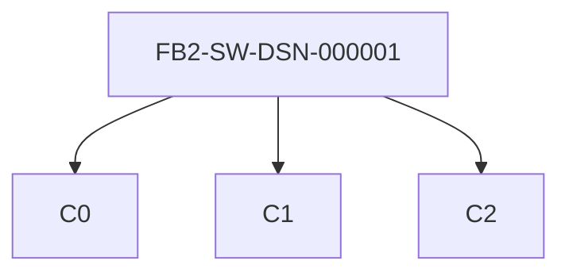
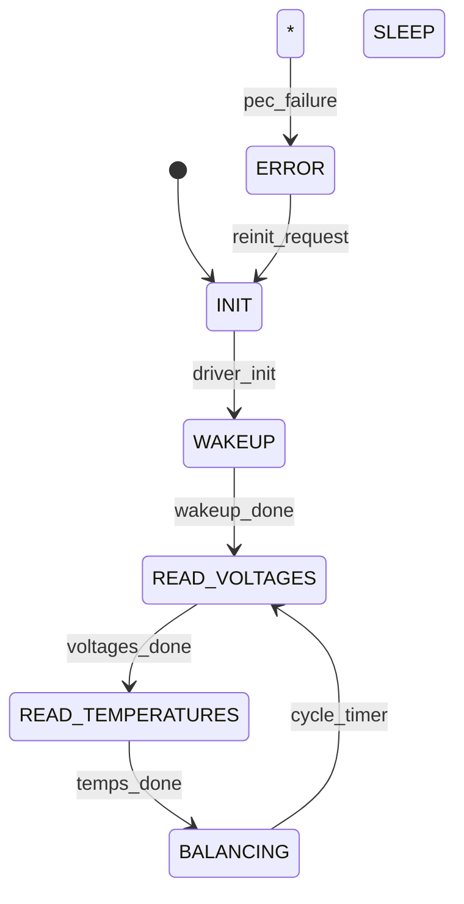
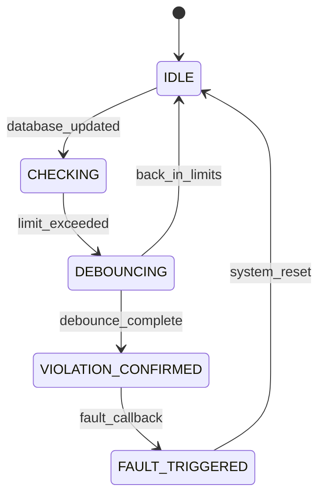
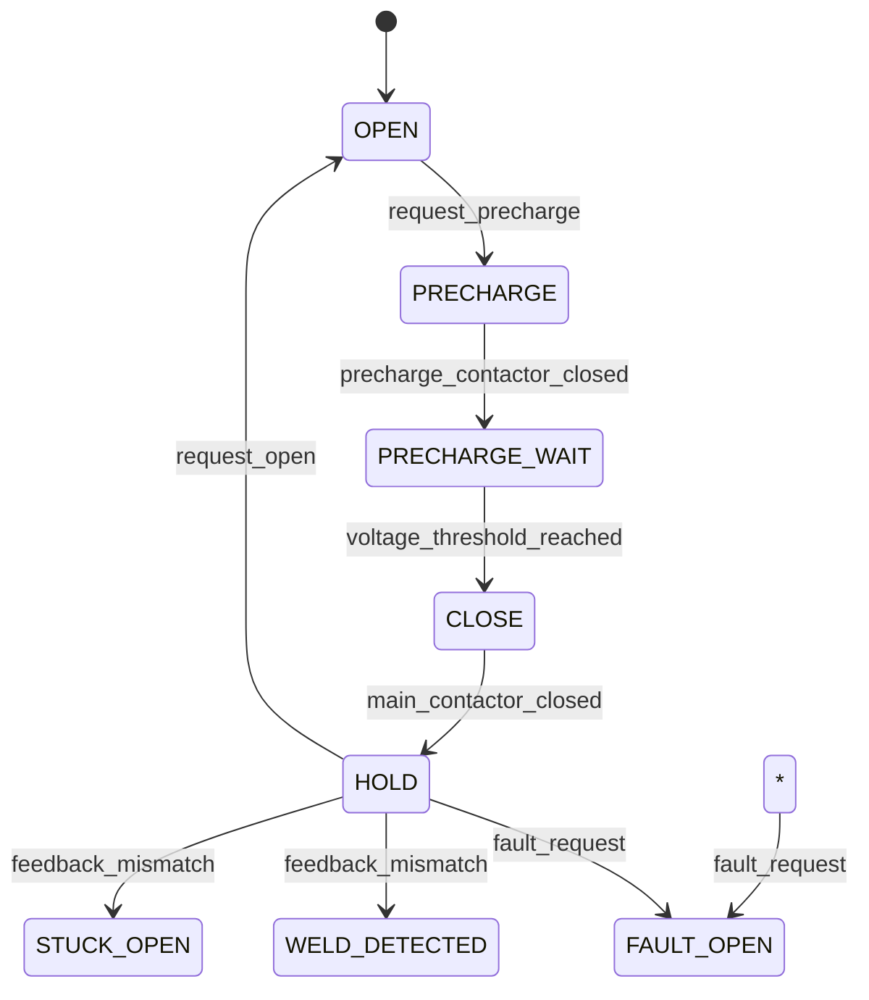

# foxBMS 2 — Detailed Design Specification

**Document Control**

| Field | Value |
|---|---|
| Project | foxBMS 2 — Battery Management System |
| Document | Detailed Design Specification |
| Baseline | BAS-REF-001 (commit `308028fb`, tag `v1.11.0`) |
| Profiles | `as_is` (source-grounded) + `synthetic_reference` (hypothetical) |
| Corpus status | `synthetic_ready_with_limitations` |
| Generated | 2026-09-12T01:01:53Z |

## Scope

Detailed design per software component: responsibilities, decomposition, interfaces, constraints, budgets, failure response, static and dynamic diagrams, and implementation requirements extracted from design fields.

## Detailed Design: `FB2-SW-DSN-000001` (as_is)

**Title**: Design: AFE Driver Architecture (LTC Family) | **Level**: `architecture`

### Responsibilities

- SPI/DMA communication with LTC AFEs
- Command sequencing (wakeup, read, balancing)
- PEC calculation and validation
- Data conversion to mV/°C
- Database publishing

### Decomposition

**Caption**: Component decomposition of `FB2-SW-DSN-000001`.

### Interfaces

| Interface | Direction | Signals |
|---|---|---|
| `AFE_DATABASE` | output | `cell_voltages` (uint16_t[], mV, 0-5000, 20 Hz), `cell_temperatures` (int16_t[], 0.1°C, -400-1500, 20 Hz), `balancing_feedback` (bool[], bool, 0/1, 20 Hz) |
| `AFE_SPI` | bidirectional | `spi_tx` (uint8_t[], bytes, 0-255, 1 MHz), `spi_rx` (uint8_t[], bytes, 0-255, 1 MHz) |

### Constraints

- SPI clock ≤ 1 MHz (LTC6811 spec)
- DMA buffer size: 256 bytes per slave
- Task period: 100 ms (FreeRTOS task)
- Stack usage: < 2 KB

### Budgets

- **cpu_time_ms**: 5
- **memory_bytes**: 8192
- **stack_bytes**: 2048

### Failure Response

| Failure mode | Detection | Reaction |
|---|---|---|
| PEC failure | CRC check on RX | Retry 3x, then ERROR state |
| SPI timeout | DMA timeout | ERROR state, report to DIAG |
| AFE not responding | No RX data | ERROR state |

### Dynamic Diagram

**Caption**: State machine of `FB2-SW-DSN-000001`.

### Implementation Requirements (extracted)

Extracted from `FB2-SW-DSN-000001` design fields:

- SPI clock ≤ 1 MHz (LTC6811 spec) (source: `FB2-SW-DSN-000001` constraints)
- DMA buffer size: 256 bytes per slave (source: `FB2-SW-DSN-000001` constraints)
- Task period: 100 ms (FreeRTOS task) (source: `FB2-SW-DSN-000001` constraints)
- Stack usage: < 2 KB (source: `FB2-SW-DSN-000001` constraints)
- Budget `cpu_time_ms` = 5 (source: `FB2-SW-DSN-000001` budgets)
- Budget `memory_bytes` = 8192 (source: `FB2-SW-DSN-000001` budgets)
- Budget `stack_bytes` = 2048 (source: `FB2-SW-DSN-000001` budgets)

## Detailed Design: `FB2-SW-DSN-000002` (as_is)

**Title**: Design: SOA Voltage Monitoring Module | **Level**: `detailed_design`

### Responsibilities

- Read cell voltages from database
- Compare against min/max limits from config
- Debounce violations (configurable count)
- Trigger FAULT state on confirmed violation
- Report violation details to DIAG

### Decomposition

Decomposition not specified in corpus.

### Interfaces

| Interface | Direction | Signals |
|---|---|---|
| `SOA_DATABASE_IN` | input | `cell_voltages` (uint16_t[], mV, 0-5000, 20 Hz), `soa_config` (SOA_CONFIG_s, struct, config, static) |
| `SOA_SYS_OUT` | output | `fault_request` (bool, bool, 0/1, event), `violation_details` (SOA_VIOLATION_s, struct, details, event) |

### Constraints

- Check latency < 10 ms from database update
- Debounce count configurable (default: 2)
- Must not block database access
- Stack usage: < 1 KB

### Budgets

- **cpu_time_ms**: 2
- **memory_bytes**: 4096
- **stack_bytes**: 1024

### Failure Response

| Failure mode | Detection | Reaction |
|---|---|---|
| Database read failure | DATA_ReadData returns error | Report to DIAG, use last valid |
| Config invalid | Config checksum mismatch | Use safe defaults, report to DIAG |

### Dynamic Diagram

**Caption**: State machine of `FB2-SW-DSN-000002`.

### Implementation Requirements (extracted)

Extracted from `FB2-SW-DSN-000002` design fields:

- Check latency < 10 ms from database update (source: `FB2-SW-DSN-000002` constraints)
- Debounce count configurable (default: 2) (source: `FB2-SW-DSN-000002` constraints)
- Must not block database access (source: `FB2-SW-DSN-000002` constraints)
- Stack usage: < 1 KB (source: `FB2-SW-DSN-000002` constraints)
- Budget `cpu_time_ms` = 2 (source: `FB2-SW-DSN-000002` budgets)
- Budget `memory_bytes` = 4096 (source: `FB2-SW-DSN-000002` budgets)
- Budget `stack_bytes` = 1024 (source: `FB2-SW-DSN-000002` budgets)

## Detailed Design: `FB2-SW-DSN-000003` (as_is)

**Title**: Design: Contactor State Machine | **Level**: `detailed_design`

### Responsibilities

- Execute contactor state machine (OPEN -> PRECHARGE -> CLOSE -> HOLD)
- Monitor precharge voltage and timeout
- Drive contactor coils via SBC (FS85xx)
- Monitor auxiliary feedback contacts
- Detect weld/stuck-open conditions
- Count contactor cycles (FRAM persistence)
- Emergency open on FAULT request

### Decomposition

Decomposition not specified in corpus.

### Interfaces

| Interface | Direction | Signals |
|---|---|---|
| `CONTACTOR_SYS_IN` | input | `state_request` (CONTACTOR_REQUEST_e, enum, OPEN/PRECHARGE/CLOSE/HOLD, event), `fault_request` (bool, bool, 0/1, event), `config` (CONTACTOR_CFG_s, struct, config, static) |
| `CONTACTOR_SBC_OUT` | output | `coil_command` (uint8_t, bitmask, 0-0xFF, event), `precharge_command` (bool, bool, 0/1, event) |
| `CONTACTOR_FEEDBACK_IN` | input | `feedback_main_plus` (bool, bool, 0/1, 100 Hz), `feedback_main_minus` (bool, bool, 0/1, 100 Hz), `feedback_precharge` (bool, bool, 0/1, 100 Hz) |
| `CONTACTOR_DIAG_OUT` | output | `weld_detected` (bool, bool, 0/1, event), `stuck_open_detected` (bool, bool, 0/1, event), `cycle_count` (uint32_t, cycles, 0-4G, event) |

### Constraints

- Precharge timeout: configurable (default 5 s)
- Voltage threshold: configurable (default 95% pack voltage)
- Feedback debounce: 10 ms
- Cycle count persisted to FRAM
- Emergency open: < 5 ms from fault request

### Budgets

- **cpu_time_ms**: 1
- **memory_bytes**: 2048
- **stack_bytes**: 512

### Failure Response

| Failure mode | Detection | Reaction |
|---|---|---|
| Weld detected | Feedback closed when commanded open | FAULT_OPEN, report to DIAG |
| Stuck open | Feedback open when commanded closed | FAULT_OPEN, retry once |
| Precharge timeout | Timer expired | OPEN, report timeout |

### Dynamic Diagram

**Caption**: State machine of `FB2-SW-DSN-000003`.

### Implementation Requirements (extracted)

Extracted from `FB2-SW-DSN-000003` design fields:

- Precharge timeout: configurable (default 5 s) (source: `FB2-SW-DSN-000003` constraints)
- Voltage threshold: configurable (default 95% pack voltage) (source: `FB2-SW-DSN-000003` constraints)
- Feedback debounce: 10 ms (source: `FB2-SW-DSN-000003` constraints)
- Cycle count persisted to FRAM (source: `FB2-SW-DSN-000003` constraints)
- Emergency open: < 5 ms from fault request (source: `FB2-SW-DSN-000003` constraints)
- Budget `cpu_time_ms` = 1 (source: `FB2-SW-DSN-000003` budgets)
- Budget `memory_bytes` = 2048 (source: `FB2-SW-DSN-000003` budgets)
- Budget `stack_bytes` = 512 (source: `FB2-SW-DSN-000003` budgets)

## Detailed Design: `FB2-SW-DSN-000001` (synthetic_reference)

**Title**: Design: AFE Driver Architecture (LTC Family) | **Level**: `architecture`

### Responsibilities

- SPI/DMA communication with LTC AFEs
- Command sequencing (wakeup, read, balancing)
- PEC calculation and validation
- Data conversion to mV/°C
- Database publishing

### Decomposition

**Caption**: Component decomposition of `FB2-SW-DSN-000001`.

### Interfaces

| Interface | Direction | Signals |
|---|---|---|
| `AFE_DATABASE` | output | `cell_voltages` (uint16_t[], mV, 0-5000, 20 Hz), `cell_temperatures` (int16_t[], 0.1°C, -400-1500, 20 Hz), `balancing_feedback` (bool[], bool, 0/1, 20 Hz) |
| `AFE_SPI` | bidirectional | `spi_tx` (uint8_t[], bytes, 0-255, 1 MHz), `spi_rx` (uint8_t[], bytes, 0-255, 1 MHz) |

### Constraints

- SPI clock ≤ 1 MHz (LTC6811 spec)
- DMA buffer size: 256 bytes per slave
- Task period: 100 ms (FreeRTOS task)
- Stack usage: < 2 KB

### Budgets

- **cpu_time_ms**: 5
- **memory_bytes**: 8192
- **stack_bytes**: 2048

### Failure Response

| Failure mode | Detection | Reaction |
|---|---|---|
| PEC failure | CRC check on RX | Retry 3x, then ERROR state |
| SPI timeout | DMA timeout | ERROR state, report to DIAG |
| AFE not responding | No RX data | ERROR state |

### Dynamic Diagram

**Caption**: State machine of `FB2-SW-DSN-000001`.

### Implementation Requirements (extracted)

Extracted from `FB2-SW-DSN-000001` design fields:

- SPI clock ≤ 1 MHz (LTC6811 spec) (source: `FB2-SW-DSN-000001` constraints)
- DMA buffer size: 256 bytes per slave (source: `FB2-SW-DSN-000001` constraints)
- Task period: 100 ms (FreeRTOS task) (source: `FB2-SW-DSN-000001` constraints)
- Stack usage: < 2 KB (source: `FB2-SW-DSN-000001` constraints)
- Budget `cpu_time_ms` = 5 (source: `FB2-SW-DSN-000001` budgets)
- Budget `memory_bytes` = 8192 (source: `FB2-SW-DSN-000001` budgets)
- Budget `stack_bytes` = 2048 (source: `FB2-SW-DSN-000001` budgets)

## Detailed Design: `FB2-SW-DSN-000002` (synthetic_reference)

**Title**: Design: SOA Voltage Monitoring Module | **Level**: `detailed_design`

### Responsibilities

- Read cell voltages from database
- Compare against min/max limits from config
- Debounce violations (configurable count)
- Trigger FAULT state on confirmed violation
- Report violation details to DIAG

### Decomposition

Decomposition not specified in corpus.

### Interfaces

| Interface | Direction | Signals |
|---|---|---|
| `SOA_DATABASE_IN` | input | `cell_voltages` (uint16_t[], mV, 0-5000, 20 Hz), `soa_config` (SOA_CONFIG_s, struct, config, static) |
| `SOA_SYS_OUT` | output | `fault_request` (bool, bool, 0/1, event), `violation_details` (SOA_VIOLATION_s, struct, details, event) |

### Constraints

- Check latency < 10 ms from database update
- Debounce count configurable (default: 2)
- Must not block database access
- Stack usage: < 1 KB

### Budgets

- **cpu_time_ms**: 2
- **memory_bytes**: 4096
- **stack_bytes**: 1024

### Failure Response

| Failure mode | Detection | Reaction |
|---|---|---|
| Database read failure | DATA_ReadData returns error | Report to DIAG, use last valid |
| Config invalid | Config checksum mismatch | Use safe defaults, report to DIAG |

### Dynamic Diagram

**Caption**: State machine of `FB2-SW-DSN-000002`.

### Implementation Requirements (extracted)

Extracted from `FB2-SW-DSN-000002` design fields:

- Check latency < 10 ms from database update (source: `FB2-SW-DSN-000002` constraints)
- Debounce count configurable (default: 2) (source: `FB2-SW-DSN-000002` constraints)
- Must not block database access (source: `FB2-SW-DSN-000002` constraints)
- Stack usage: < 1 KB (source: `FB2-SW-DSN-000002` constraints)
- Budget `cpu_time_ms` = 2 (source: `FB2-SW-DSN-000002` budgets)
- Budget `memory_bytes` = 4096 (source: `FB2-SW-DSN-000002` budgets)
- Budget `stack_bytes` = 1024 (source: `FB2-SW-DSN-000002` budgets)

## Detailed Design: `FB2-SW-DSN-000003` (synthetic_reference)

**Title**: Design: Contactor State Machine | **Level**: `detailed_design`

### Responsibilities

- Execute contactor state machine (OPEN -> PRECHARGE -> CLOSE -> HOLD)
- Monitor precharge voltage and timeout
- Drive contactor coils via SBC (FS85xx)
- Monitor auxiliary feedback contacts
- Detect weld/stuck-open conditions
- Count contactor cycles (FRAM persistence)
- Emergency open on FAULT request

### Decomposition

Decomposition not specified in corpus.

### Interfaces

| Interface | Direction | Signals |
|---|---|---|
| `CONTACTOR_SYS_IN` | input | `state_request` (CONTACTOR_REQUEST_e, enum, OPEN/PRECHARGE/CLOSE/HOLD, event), `fault_request` (bool, bool, 0/1, event), `config` (CONTACTOR_CFG_s, struct, config, static) |
| `CONTACTOR_SBC_OUT` | output | `coil_command` (uint8_t, bitmask, 0-0xFF, event), `precharge_command` (bool, bool, 0/1, event) |
| `CONTACTOR_FEEDBACK_IN` | input | `feedback_main_plus` (bool, bool, 0/1, 100 Hz), `feedback_main_minus` (bool, bool, 0/1, 100 Hz), `feedback_precharge` (bool, bool, 0/1, 100 Hz) |
| `CONTACTOR_DIAG_OUT` | output | `weld_detected` (bool, bool, 0/1, event), `stuck_open_detected` (bool, bool, 0/1, event), `cycle_count` (uint32_t, cycles, 0-4G, event) |

### Constraints

- Precharge timeout: configurable (default 5 s)
- Voltage threshold: configurable (default 95% pack voltage)
- Feedback debounce: 10 ms
- Cycle count persisted to FRAM
- Emergency open: < 5 ms from fault request

### Budgets

- **cpu_time_ms**: 1
- **memory_bytes**: 2048
- **stack_bytes**: 512

### Failure Response

| Failure mode | Detection | Reaction |
|---|---|---|
| Weld detected | Feedback closed when commanded open | FAULT_OPEN, report to DIAG |
| Stuck open | Feedback open when commanded closed | FAULT_OPEN, retry once |
| Precharge timeout | Timer expired | OPEN, report timeout |

### Dynamic Diagram

**Caption**: State machine of `FB2-SW-DSN-000003`.

### Implementation Requirements (extracted)

Extracted from `FB2-SW-DSN-000003` design fields:

- Precharge timeout: configurable (default 5 s) (source: `FB2-SW-DSN-000003` constraints)
- Voltage threshold: configurable (default 95% pack voltage) (source: `FB2-SW-DSN-000003` constraints)
- Feedback debounce: 10 ms (source: `FB2-SW-DSN-000003` constraints)
- Cycle count persisted to FRAM (source: `FB2-SW-DSN-000003` constraints)
- Emergency open: < 5 ms from fault request (source: `FB2-SW-DSN-000003` constraints)
- Budget `cpu_time_ms` = 1 (source: `FB2-SW-DSN-000003` budgets)
- Budget `memory_bytes` = 2048 (source: `FB2-SW-DSN-000003` budgets)
- Budget `stack_bytes` = 512 (source: `FB2-SW-DSN-000003` budgets)

---

*Generated: 2026-09-12T01:01:53Z — auto-generated from the machine-verifiable corpus. Regenerate with `python3 docs/artifacts/tools/render_spec_documents.py`.*
