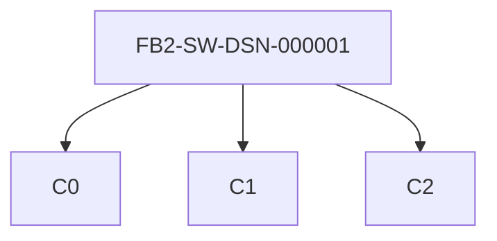
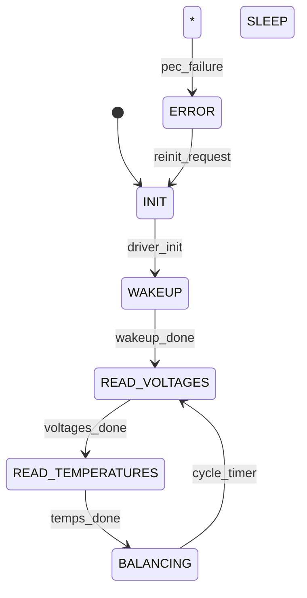
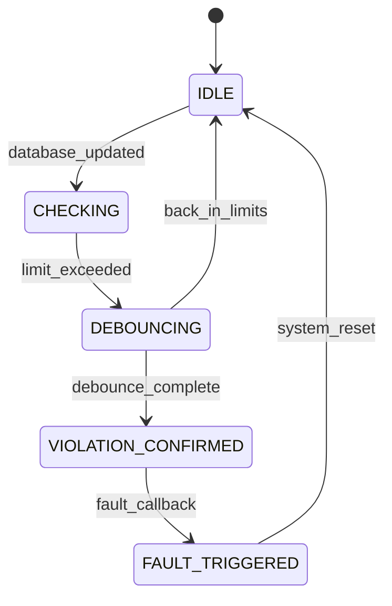
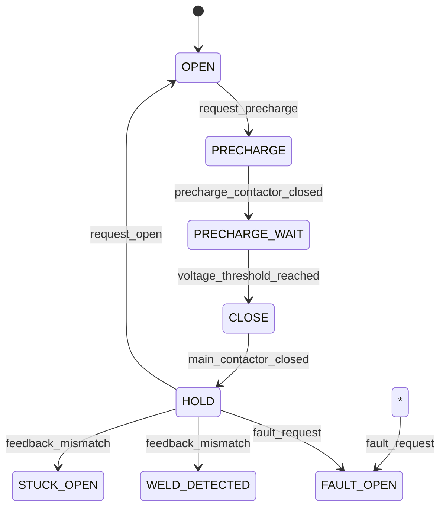
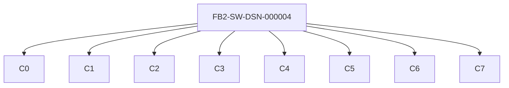
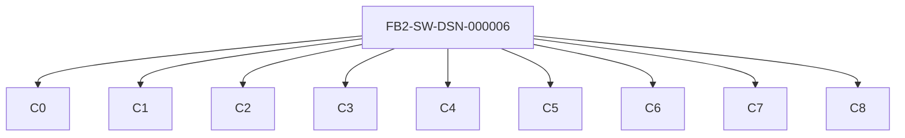

# foxBMS 2 — Detailed Design Specification

**Document Control**

| Field | Value |
|---|---|
| Project | foxBMS 2 — Battery Management System |
| Document | Detailed Design Specification |
| Baseline | BAS-REF-001 (commit `308028fb`, tag `v1.11.0`) |
| Profiles | `as_is` (source-grounded) + `synthetic_reference` (hypothetical) |
| Corpus status | `synthetic_ready_with_limitations` |
| Generated | 2026-10-01T19:25:12Z |

## Scope

Detailed design per software component: (1) reverse-engineered per-module design from `src/app/` — files, config, responsibilities, unit tests, documentation anchors; (2) corpus design artifacts with decomposition, interfaces, constraints, budgets, failure response and behavior models.

## Reverse-Engineered Module Designs

Per-module design of all 40 software modules, mined from the source tree. `Sources` lists the C/H files, `Config` the module's configuration pair in `src/app/*/config/`, `Unit tests` the Ceedling/Unity test files run in CI.

### `application/algorithm`

- **Prefix**: `ALGO` | **Layer group**: `ALGORITHMS`
- **Responsibility**: Algorithms framework: SOX estimation and moving averages
- **Sources (26)**: `src/app/application/algorithm/algorithm.c`, `src/app/application/algorithm/algorithm.h`, `src/app/application/algorithm/config/algorithm_cfg.c`, `src/app/application/algorithm/config/algorithm_cfg.h`, `src/app/application/algorithm/moving_average/moving_average.c`, `src/app/application/algorithm/moving_average/moving_average.h`, `src/app/application/algorithm/state_estimation/soc/counting/soc_counting.c`, `src/app/application/algorithm/state_estimation/soc/counting/soc_counting_cfg.h` …
- **Unit tests (1)**: `test_algorithm.c`
- **Module documentation**: `docs/software/modules/application/algorithm/algorithm.rst`

### `application/bal`

- **Prefix**: `BAL` | **Layer group**: `APPLICATION`
- **Responsibility**: Header for the driver for balancing
- **Sources (5)**: `src/app/application/bal/bal.c`, `src/app/application/bal/bal.h`, `src/app/application/bal/history/bal_strategy_history.c`, `src/app/application/bal/none/bal_strategy_none.c`, `src/app/application/bal/voltage/bal_strategy_voltage.c`
- **Configuration**: `src/app/application/config/bal_cfg.c`, `src/app/application/config/bal_cfg.h`
- **Unit tests (1)**: `test_bal.c`
- **Module documentation**: `docs/software/modules/application/bal/bal.rst`

### `application/bms`

- **Prefix**: `BMS` | **Layer group**: `ENGINE`
- **Responsibility**: BMS driver header
- **Sources (2)**: `src/app/application/bms/bms.c`, `src/app/application/bms/bms.h`
- **Configuration**: `src/app/application/config/bms_cfg.h`
- **Unit tests (1)**: `test_bms.c`
- **Module documentation**: `docs/software/modules/application/bms/bms.rst`

### `application/ethernet`

- **Prefix**: `ETH` | **Layer group**: `APPLICATION`
- **Responsibility**: Header of the ethernet software
- **Sources (4)**: `src/app/application/ethernet/ethernet.c`, `src/app/application/ethernet/ethernet.h`, `src/app/application/ethernet/ethernet_freertos.c`, `src/app/application/ethernet/ethernet_freertos.h`
- **Configuration**: `src/app/application/config/ethernet_cfg.c`, `src/app/application/config/ethernet_cfg.h`
- **Unit tests (2)**: `test_ethernet.c`, `test_ethernet_freertos.c`
- **Module documentation**: `docs/software/modules/application/ethernet/ethernet.rst`

### `application/plausibility`

- **Prefix**: `PL` | **Layer group**: `APPLICATION`
- **Responsibility**: Plausibility checks for cell voltage and cell temperatures
- **Sources (2)**: `src/app/application/plausibility/plausibility.c`, `src/app/application/plausibility/plausibility.h`
- **Configuration**: `src/app/application/config/plausibility_cfg.h`
- **Unit tests (1)**: `test_plausibility.c`
- **Module documentation**: `docs/software/modules/application/plausibility/plausibility.rst`

### `application/redundancy`

- **Prefix**: `MRC` | **Layer group**: `APPLICATION`
- **Responsibility**: Header files for handling redundancy between redundant cell voltage
- **Sources (2)**: `src/app/application/redundancy/redundancy.c`, `src/app/application/redundancy/redundancy.h`
- **Unit tests (1)**: `test_redundancy.c`
- **Module documentation**: `docs/software/modules/application/redundancy/redundancy.rst`

### `application/soa`

- **Prefix**: `SOA` | **Layer group**: `APPLICATION`
- **Responsibility**: Header for SOA module, responsible for checking battery parameters
- **Sources (2)**: `src/app/application/soa/soa.c`, `src/app/application/soa/soa.h`
- **Configuration**: `src/app/application/config/soa_cfg.c`, `src/app/application/config/soa_cfg.h`
- **Unit tests (1)**: `test_soa.c`
- **Module documentation**: `docs/software/modules/application/soa/soa.rst`

### `driver/adc`

- **Prefix**: `ADC` | **Layer group**: `DRIVERS`
- **Responsibility**: Headers for the driver for the ADC module.
- **Sources (2)**: `src/app/driver/adc/adc.c`, `src/app/driver/adc/adc.h`
- **Unit tests (1)**: `test_adc.c`
- **Module documentation**: `docs/software/modules/driver/adc/adc.rst`

### `driver/can`

- **Prefix**: `CAN` | **Layer group**: `DRIVERS`
- **Responsibility**: Header for the driver for the CAN module
- **Sources (44)**: `src/app/driver/can/can.c`, `src/app/driver/can/can.h`, `src/app/driver/can/cbs/can_helper.c`, `src/app/driver/can/cbs/can_helper.h`, `src/app/driver/can/cbs/rx/can_cbs_rx.h`, `src/app/driver/can/cbs/rx/can_cbs_rx_afe_cell-temperatures.c`, `src/app/driver/can/cbs/rx/can_cbs_rx_afe_cell-voltages.c`, `src/app/driver/can/cbs/rx/can_cbs_rx_as_honeywell-bas6c-x00.c` …
- **Configuration**: `src/app/driver/config/can_cfg.c`, `src/app/driver/config/can_cfg.h`
- **Unit tests (4)**: `test_can.c`, `test_can_1.c`, `test_can_2.c`, `test_can_can_message_notification.c`
- **Module documentation**: `docs/software/modules/driver/can/can.rst`

### `driver/contactor`

- **Prefix**: `CONT` | **Layer group**: `DRIVERS`
- **Responsibility**: Headers for the driver for the contactors.
- **Sources (2)**: `src/app/driver/contactor/contactor.c`, `src/app/driver/contactor/contactor.h`
- **Configuration**: `src/app/driver/config/contactor_cfg.c`, `src/app/driver/config/contactor_cfg.h`
- **Unit tests (1)**: `test_contactor.c`
- **Module documentation**: `docs/software/modules/driver/contactor/contactor.rst`

### `driver/crc`

- **Prefix**: `CRC` | **Layer group**: `DRIVERS`
- **Responsibility**: CRC module header
- **Sources (2)**: `src/app/driver/crc/crc.c`, `src/app/driver/crc/crc.h`
- **Unit tests (1)**: `test_crc.c`
- **Module documentation**: `docs/software/modules/driver/crc/crc.rst`

### `driver/dma`

- **Prefix**: `DMA` | **Layer group**: `DRIVERS`
- **Responsibility**: Headers for the driver for the DMA module.
- **Sources (2)**: `src/app/driver/dma/dma.c`, `src/app/driver/dma/dma.h`
- **Configuration**: `src/app/driver/config/dma_cfg.c`, `src/app/driver/config/dma_cfg.h`
- **Unit tests (4)**: `test_dma.c`, `test_dma_dma_group_a_notification.c`, `test_dma_nxp.c`, `test_dma_uart.c`
- **Module documentation**: `docs/software/modules/driver/dma/dma.rst`

### `driver/emac`

- **Prefix**: `EMAC` | **Layer group**: `DRIVERS`
- **Responsibility**: Implementation of emac driver
- **Sources (4)**: `src/app/driver/emac/emac-low-level.c`, `src/app/driver/emac/emac-low-level.h`, `src/app/driver/emac/emac.c`, `src/app/driver/emac/emac.h`
- **Configuration**: `src/app/driver/config/emac_cfg.h`
- **Unit tests (2)**: `test_emac-low-level.c`, `test_emac.c`
- **Module documentation**: `docs/software/modules/driver/emac/emac.rst`

### `driver/foxmath`

- **Prefix**: `MATH` | **Layer group**: `DRIVERS`
- **Responsibility**: Math library for often used math functions
- **Sources (4)**: `src/app/driver/foxmath/foxmath.c`, `src/app/driver/foxmath/foxmath.h`, `src/app/driver/foxmath/utils.c`, `src/app/driver/foxmath/utils.h`
- **Unit tests (2)**: `test_foxmath.c`, `test_utils.c`
- **Module documentation**: `docs/software/modules/driver/foxmath/foxmath.rst`

### `driver/fram`

- **Prefix**: `FRAM` | **Layer group**: `DRIVERS`
- **Responsibility**: Header for the driver for the FRAM module
- **Sources (2)**: `src/app/driver/fram/fram.c`, `src/app/driver/fram/fram.h`
- **Configuration**: `src/app/driver/config/fram_cfg.c`, `src/app/driver/config/fram_cfg.h`
- **Unit tests (1)**: `test_fram.c`
- **Module documentation**: `docs/software/modules/driver/fram/fram.rst`

### `driver/htsensor`

- **Prefix**: `HTSEN` | **Layer group**: `DRIVERS`
- **Responsibility**: Header for the driver for the Sensirion SHT35-DIS I2C humidity/temperature sensor
- **Sources (2)**: `src/app/driver/htsensor/htsensor.c`, `src/app/driver/htsensor/htsensor.h`
- **Unit tests (1)**: `test_htsensor.c`
- **Module documentation**: `docs/software/modules/driver/htsensor/htsensor.rst`

### `driver/i2c`

- **Prefix**: `I2C` | **Layer group**: `DRIVERS`
- **Responsibility**: Header for the driver for the I2C module
- **Sources (2)**: `src/app/driver/i2c/i2c.c`, `src/app/driver/i2c/i2c.h`
- **Unit tests (1)**: `test_i2c.c`
- **Module documentation**: `docs/software/modules/driver/i2c/i2c.rst`

### `driver/imd`

- **Prefix**: `IMD` | **Layer group**: `DRIVERS`
- **Responsibility**: API header for the insulation monitoring device
- **Sources (12)**: `src/app/driver/imd/bender/ir155/bender_ir155.c`, `src/app/driver/imd/bender/ir155/bender_ir155.h`, `src/app/driver/imd/bender/ir155/bender_ir155_helper.c`, `src/app/driver/imd/bender/ir155/bender_ir155_helper.h`, `src/app/driver/imd/bender/ir155/config/bender_ir155_cfg.h`, `src/app/driver/imd/bender/iso165c/bender_iso165c.c`, `src/app/driver/imd/bender/iso165c/bender_iso165c.h`, `src/app/driver/imd/bender/iso165c/config/bender_iso165c_cfg.h` …
- **Unit tests (1)**: `test_imd.c`
- **Module documentation**: `docs/software/modules/driver/imd/imd.rst`

### `driver/interlock`

- **Prefix**: `ILCK` | **Layer group**: `DRIVERS`
- **Responsibility**: Headers for the driver for the interlock.
- **Sources (2)**: `src/app/driver/interlock/interlock.c`, `src/app/driver/interlock/interlock.h`
- **Configuration**: `src/app/driver/config/interlock_cfg.h`
- **Unit tests (1)**: `test_interlock.c`
- **Module documentation**: `docs/software/modules/driver/interlock/interlock.rst`

### `driver/io`

- **Prefix**: `IO` | **Layer group**: `DRIVERS`
- **Responsibility**: Header for the driver for the IO module
- **Sources (2)**: `src/app/driver/io/io.c`, `src/app/driver/io/io.h`
- **Unit tests (1)**: `test_io.c`
- **Module documentation**: `docs/software/modules/driver/io/io.rst`

### `driver/led`

- **Prefix**: `LED` | **Layer group**: `DRIVERS`
- **Responsibility**: Header file of the debug LED driver
- **Sources (2)**: `src/app/driver/led/led.c`, `src/app/driver/led/led.h`
- **Unit tests (1)**: `test_led.c`
- **Module documentation**: `docs/software/modules/driver/led/led.rst`

### `driver/mcu`

- **Prefix**: `MCU` | **Layer group**: `DRIVERS`
- **Responsibility**: Headers for the driver for the MCU module.
- **Sources (2)**: `src/app/driver/mcu/mcu.c`, `src/app/driver/mcu/mcu.h`
- **Unit tests (1)**: `test_mcu.c`
- **Module documentation**: `docs/software/modules/driver/mcu/mcu.rst`

### `driver/meas`

- **Prefix**: `MEAS` | **Layer group**: `DRIVERS`
- **Responsibility**: Headers for the driver for the measurements needed by the BMS
- **Sources (2)**: `src/app/driver/meas/meas.c`, `src/app/driver/meas/meas.h`
- **Unit tests (1)**: `test_meas.c`
- **Module documentation**: `docs/software/modules/driver/meas/meas.rst`

### `driver/pex`

- **Prefix**: `PEX` | **Layer group**: `DRIVERS`
- **Responsibility**: Header for the driver for the NXP PCA9539 port expander module
- **Sources (2)**: `src/app/driver/pex/pex.c`, `src/app/driver/pex/pex.h`
- **Configuration**: `src/app/driver/config/pex_cfg.c`, `src/app/driver/config/pex_cfg.h`
- **Unit tests (1)**: `test_pex.c`
- **Module documentation**: `docs/software/modules/driver/pex/pex.rst`

### `driver/phy`

- **Prefix**: `PHY` | **Layer group**: `DRIVERS`
- **Responsibility**: Implementation of physical layer driver
- **Sources (2)**: `src/app/driver/phy/dp83869.c`, `src/app/driver/phy/dp83869.h`
- **Configuration**: `src/app/driver/config/phy_cfg.h`
- **Unit tests (1)**: `test_dp83869.c`
- **Module documentation**: `docs/software/modules/driver/phy/phy.rst`

### `driver/pwm`

- **Prefix**: `PWM` | **Layer group**: `DRIVERS`
- **Responsibility**: PWM driver for the TMS570LC43xx.
- **Sources (2)**: `src/app/driver/pwm/pwm.c`, `src/app/driver/pwm/pwm.h`
- **Unit tests (1)**: `test_pwm.c`
- **Module documentation**: `docs/software/modules/driver/pwm/pwm.rst`

### `driver/rtc`

- **Prefix**: `RTC` | **Layer group**: `DRIVERS`
- **Responsibility**: Header file of the RTC driver
- **Sources (2)**: `src/app/driver/rtc/rtc.c`, `src/app/driver/rtc/rtc.h`
- **Unit tests (1)**: `test_rtc.c`
- **Module documentation**: `docs/software/modules/driver/rtc/rtc.rst`

### `driver/sbc`

- **Prefix**: `FS85` | **Layer group**: `DRIVERS`
- **Responsibility**: Driver for the NXP FS85 SBC (system basis chip) supervisor
- **Sources (11)**: `src/app/driver/sbc/fs8x_driver/sbc_fs8x.c`, `src/app/driver/sbc/fs8x_driver/sbc_fs8x.h`, `src/app/driver/sbc/fs8x_driver/sbc_fs8x_assert.h`, `src/app/driver/sbc/fs8x_driver/sbc_fs8x_common.h`, `src/app/driver/sbc/fs8x_driver/sbc_fs8x_communication.c`, `src/app/driver/sbc/fs8x_driver/sbc_fs8x_communication.h`, `src/app/driver/sbc/fs8x_driver/sbc_fs8x_map.h`, `src/app/driver/sbc/nxpfs85xx.c` …
- **Unit tests (3)**: `test_nxpfs85xx.c`, `test_nxpfs85xx_mcu_spi_transfer_data.c`, `test_sbc.c`
- **Module documentation**: `docs/software/modules/driver/sbc/sbc.rst`

### `driver/spi`

- **Prefix**: `SPI` | **Layer group**: `DRIVERS`
- **Responsibility**: Headers for the driver for the SPI module.
- **Sources (3)**: `src/app/driver/spi/spi.c`, `src/app/driver/spi/spi.h`, `src/app/driver/spi/spi_cfg-helper.h`
- **Configuration**: `src/app/driver/config/spi_cfg.c`, `src/app/driver/config/spi_cfg.h`
- **Unit tests (9)**: `test_spi.c`, `test_spi_adi.c`, `test_spi_debug.c`, `test_spi_ltc.c`, `test_spi_mxm.c`, `test_spi_nxp.c`, `test_spi_spi_notification.c`, `test_spi_st.c`, `test_spi_ti.c`
- **Module documentation**: `docs/software/modules/driver/spi/spi.rst`

### `driver/sps`

- **Prefix**: `SPS` | **Layer group**: `DRIVERS`
- **Responsibility**: Headers for the driver for the smart power switches.
- **Sources (3)**: `src/app/driver/sps/sps.c`, `src/app/driver/sps/sps.h`, `src/app/driver/sps/sps_types.h`
- **Configuration**: `src/app/driver/config/sps_cfg.c`, `src/app/driver/config/sps_cfg.h`
- **Unit tests (1)**: `test_sps.c`
- **Module documentation**: `docs/software/modules/driver/sps/sps.rst`

### `driver/ts`

- **Prefix**: `BETA` | **Layer group**: `DRIVERS`
- **Responsibility**: Temperature sensor evaluation (resistive divider, beta model)
- **Sources (44)**: `src/app/driver/ts/api/tsi.h`, `src/app/driver/ts/api/tsi_limits.c`, `src/app/driver/ts/beta.c`, `src/app/driver/ts/beta.h`, `src/app/driver/ts/epcos/b57251v5103j060/epcos_b57251v5103j060.c`, `src/app/driver/ts/epcos/b57251v5103j060/epcos_b57251v5103j060.h`, `src/app/driver/ts/epcos/b57251v5103j060/lookup-table/epcos_b57251v5103j060_lookup-table.c`, `src/app/driver/ts/epcos/b57251v5103j060/polynomial/epcos_b57251v5103j060_polynomial.c` …
- **Unit tests (1)**: `test_beta.c`
- **Module documentation**: `docs/software/modules/driver/ts/ts.rst`

### `driver/uart`

- **Prefix**: `UART` | **Layer group**: `DRIVERS`
- **Responsibility**: Drivers for UART RS232
- **Sources (2)**: `src/app/driver/uart/uart.c`, `src/app/driver/uart/uart.h`
- **Configuration**: `src/app/driver/config/uart_cfg.h`
- **Unit tests (2)**: `test_uart.c`, `test_uart_sci_notification.c`
- **Module documentation**: `docs/software/modules/driver/uart/uart.rst`

### `engine/database`

- **Prefix**: `DATA` | **Layer group**: `ENGINE`
- **Responsibility**: Database module header
- **Sources (4)**: `src/app/engine/database/database.c`, `src/app/engine/database/database.h`, `src/app/engine/database/database_helper.c`, `src/app/engine/database/database_helper.h`
- **Configuration**: `src/app/engine/config/database_cfg.c`, `src/app/engine/config/database_cfg.h`
- **Unit tests (2)**: `test_database.c`, `test_database_helper.c`
- **Module documentation**: `docs/software/modules/engine/database/database.rst`

### `engine/diag`

- **Prefix**: `DIAG` | **Layer group**: `ENGINE`
- **Responsibility**: Diagnosis driver header
- **Sources (24)**: `src/app/engine/diag/cbs/diag_cbs.h`, `src/app/engine/diag/cbs/diag_cbs_aerosol-sensor.c`, `src/app/engine/diag/cbs/diag_cbs_afe.c`, `src/app/engine/diag/cbs/diag_cbs_bms.c`, `src/app/engine/diag/cbs/diag_cbs_can.c`, `src/app/engine/diag/cbs/diag_cbs_clamp30c.c`, `src/app/engine/diag/cbs/diag_cbs_contactor.c`, `src/app/engine/diag/cbs/diag_cbs_current-sensor.c` …
- **Configuration**: `src/app/engine/config/diag_cfg.c`, `src/app/engine/config/diag_cfg.h`
- **Unit tests (1)**: `test_diag.c`
- **Module documentation**: `docs/software/modules/engine/diag/diag.rst`

### `engine/hw_info`

- **Prefix**: `MINFO` | **Layer group**: `ENGINE`
- **Responsibility**: General foxBMS-master system information
- **Sources (2)**: `src/app/engine/hw_info/master_info.c`, `src/app/engine/hw_info/master_info.h`
- **Unit tests (1)**: `test_master_info.c`
- **Module documentation**: `docs/software/modules/engine/hw_info/hw_info.rst`

### `engine/sys`

- **Prefix**: `SYS` | **Layer group**: `ENGINE`
- **Responsibility**: Software reset driver header
- **Sources (4)**: `src/app/engine/sys/reset.c`, `src/app/engine/sys/reset.h`, `src/app/engine/sys/sys.c`, `src/app/engine/sys/sys.h`
- **Configuration**: `src/app/engine/config/sys_cfg.c`, `src/app/engine/config/sys_cfg.h`
- **Unit tests (2)**: `test_reset.c`, `test_sys.c`
- **Module documentation**: `docs/software/modules/engine/sys/sys.rst`

### `engine/sys_mon`

- **Prefix**: `SYSM` | **Layer group**: `ENGINE`
- **Responsibility**: System monitoring module
- **Sources (2)**: `src/app/engine/sys_mon/sys_mon.c`, `src/app/engine/sys_mon/sys_mon.h`
- **Configuration**: `src/app/engine/config/sys_mon_cfg.c`, `src/app/engine/config/sys_mon_cfg.h`
- **Unit tests (1)**: `test_sys_mon.c`
- **Module documentation**: `docs/software/modules/engine/sys_mon/sys_mon.rst`

### `task/ftask`

- **Prefix**: `FTSK` | **Layer group**: `TASK`
- **Responsibility**: Header of task driver implementation
- **Sources (3)**: `src/app/task/ftask/freertos/ftask_freertos.c`, `src/app/task/ftask/ftask.c`, `src/app/task/ftask/ftask.h`
- **Configuration**: `src/app/task/config/ftask_cfg.c`, `src/app/task/config/ftask_cfg.h`
- **Unit tests (2)**: `test_ftask.c`, `test_ftask_emac.c`
- **Module documentation**: `docs/software/modules/task/ftask/ftask.rst`

### `task/os`

- **Prefix**: `OS` | **Layer group**: `OS`
- **Responsibility**: Declaration of the OS wrapper interface
- **Sources (4)**: `src/app/task/os/freertos/os_freertos.c`, `src/app/task/os/freertos/os_freertos_config-validation.h`, `src/app/task/os/os.c`, `src/app/task/os/os.h`
- **Unit tests (1)**: `test_os.c`
- **Module documentation**: `docs/software/modules/task/os/os.rst`

### `task/timer`

- **Prefix**: `TIMER` | **Layer group**: `TASK`
- **Responsibility**: Header file for the timer wrapper
- **Sources (2)**: `src/app/task/timer/timer.c`, `src/app/task/timer/timer.h`
- **Unit tests (1)**: `test_timer.c`
- **Module documentation**: `docs/software/modules/task/timer/timer.rst`

### State Machine Design Details

- **BMS FSM** (`src/app/application/bms/bms.c`): 13 states / 34 substates; entry/exit via `BMS_Trigger()` (10 ms context); state requests over CAN (`f_BmsStateRequest`); error entry on fatal diagnosis flags.
- **SYS FSM** (`src/app/engine/sys/sys.c`): 7 states / 28 substates; startup sequencing (SBC, interlock, CAN, RTC, BIST, boot message, balancing enable, first measurement cycle, current-sensor presence, IMD).

## Detailed Design: `FB2-SW-DSN-000001` (as_is)

**Title**: Design: AFE Driver Architecture (LTC Family) | **Level**: `architecture`

### Responsibilities

- SPI/DMA communication with LTC AFEs
- Command sequencing (wakeup, read, balancing)
- PEC calculation and validation
- Data conversion to mV/°C
- Database publishing

### Decomposition

**Caption**: Component decomposition of `FB2-SW-DSN-000001`.

```mermaid
flowchart TD
    D["FB2-SW-DSN-000001"]
    C0["C0"]
    D --> C0
    C1["C1"]
    D --> C1
    C2["C2"]
    D --> C2
```

### Interfaces

| Interface | Direction | Signals |
|---|---|---|
| `AFE_DATABASE` | output | `cell_voltages` (uint16_t[], mV, 0-5000, 20 Hz), `cell_temperatures` (int16_t[], 0.1°C, -400-1500, 20 Hz), `balancing_feedback` (bool[], bool, 0/1, 20 Hz) |
| `AFE_SPI` | bidirectional | `spi_tx` (uint8_t[], bytes, 0-255, 1 MHz), `spi_rx` (uint8_t[], bytes, 0-255, 1 MHz) |

### Constraints

- SPI clock ≤ 1 MHz (LTC6811 spec)
- DMA buffer size: 256 bytes per slave
- Task period: 100 ms (FreeRTOS task)
- Stack usage: < 2 KB

### Budgets

- **cpu_time_ms**: 5
- **memory_bytes**: 8192
- **stack_bytes**: 2048

### Failure Response

| Failure mode | Detection | Reaction |
|---|---|---|
| PEC failure | CRC check on RX | Retry 3x, then ERROR state |
| SPI timeout | DMA timeout | ERROR state, report to DIAG |
| AFE not responding | No RX data | ERROR state |

### Dynamic Diagram

**Caption**: State machine of `FB2-SW-DSN-000001`.

```mermaid
stateDiagram-v2
    [*] --> INIT
    INIT --> WAKEUP : driver_init
    WAKEUP --> READ_VOLTAGES : wakeup_done
    READ_VOLTAGES --> READ_TEMPERATURES : voltages_done
    READ_TEMPERATURES --> BALANCING : temps_done
    BALANCING --> READ_VOLTAGES : cycle_timer
    * --> ERROR : pec_failure
    ERROR --> INIT : reinit_request
    INIT
    WAKEUP
    READ_VOLTAGES
    READ_TEMPERATURES
    BALANCING
    ERROR
    SLEEP
```

### Implementation Requirements (extracted)

Extracted from `FB2-SW-DSN-000001` design fields:

- SPI clock ≤ 1 MHz (LTC6811 spec) (source: `FB2-SW-DSN-000001` constraints)
- DMA buffer size: 256 bytes per slave (source: `FB2-SW-DSN-000001` constraints)
- Task period: 100 ms (FreeRTOS task) (source: `FB2-SW-DSN-000001` constraints)
- Stack usage: < 2 KB (source: `FB2-SW-DSN-000001` constraints)
- Budget `cpu_time_ms` = 5 (source: `FB2-SW-DSN-000001` budgets)
- Budget `memory_bytes` = 8192 (source: `FB2-SW-DSN-000001` budgets)
- Budget `stack_bytes` = 2048 (source: `FB2-SW-DSN-000001` budgets)

## Detailed Design: `FB2-SW-DSN-000002` (as_is)

**Title**: Design: SOA Voltage Monitoring Module | **Level**: `detailed_design`

### Responsibilities

- Read cell voltages from database
- Compare against min/max limits from config
- Debounce violations (configurable count)
- Trigger FAULT state on confirmed violation
- Report violation details to DIAG

### Decomposition

Decomposition not specified in corpus.

### Interfaces

| Interface | Direction | Signals |
|---|---|---|
| `SOA_DATABASE_IN` | input | `cell_voltages` (uint16_t[], mV, 0-5000, 20 Hz), `soa_config` (SOA_CONFIG_s, struct, config, static) |
| `SOA_SYS_OUT` | output | `fault_request` (bool, bool, 0/1, event), `violation_details` (SOA_VIOLATION_s, struct, details, event) |

### Constraints

- Check latency < 10 ms from database update
- Debounce count configurable (default: 2)
- Must not block database access
- Stack usage: < 1 KB

### Budgets

- **cpu_time_ms**: 2
- **memory_bytes**: 4096
- **stack_bytes**: 1024

### Failure Response

| Failure mode | Detection | Reaction |
|---|---|---|
| Database read failure | DATA_ReadData returns error | Report to DIAG, use last valid |
| Config invalid | Config checksum mismatch | Use safe defaults, report to DIAG |

### Dynamic Diagram

**Caption**: State machine of `FB2-SW-DSN-000002`.

```mermaid
stateDiagram-v2
    [*] --> IDLE
    IDLE --> CHECKING : database_updated
    CHECKING --> DEBOUNCING : limit_exceeded
    DEBOUNCING --> VIOLATION_CONFIRMED : debounce_complete
    DEBOUNCING --> IDLE : back_in_limits
    VIOLATION_CONFIRMED --> FAULT_TRIGGERED : fault_callback
    FAULT_TRIGGERED --> IDLE : system_reset
    IDLE
    CHECKING
    DEBOUNCING
    VIOLATION_CONFIRMED
    FAULT_TRIGGERED
```

### Implementation Requirements (extracted)

Extracted from `FB2-SW-DSN-000002` design fields:

- Check latency < 10 ms from database update (source: `FB2-SW-DSN-000002` constraints)
- Debounce count configurable (default: 2) (source: `FB2-SW-DSN-000002` constraints)
- Must not block database access (source: `FB2-SW-DSN-000002` constraints)
- Stack usage: < 1 KB (source: `FB2-SW-DSN-000002` constraints)
- Budget `cpu_time_ms` = 2 (source: `FB2-SW-DSN-000002` budgets)
- Budget `memory_bytes` = 4096 (source: `FB2-SW-DSN-000002` budgets)
- Budget `stack_bytes` = 1024 (source: `FB2-SW-DSN-000002` budgets)

## Detailed Design: `FB2-SW-DSN-000003` (as_is)

**Title**: Design: Contactor State Machine | **Level**: `detailed_design`

### Responsibilities

- Execute contactor state machine (OPEN -> PRECHARGE -> CLOSE -> HOLD)
- Monitor precharge voltage and timeout
- Drive contactor coils via SBC (FS85xx)
- Monitor auxiliary feedback contacts
- Detect weld/stuck-open conditions
- Count contactor cycles (FRAM persistence)
- Emergency open on FAULT request

### Decomposition

Decomposition not specified in corpus.

### Interfaces

| Interface | Direction | Signals |
|---|---|---|
| `CONTACTOR_SYS_IN` | input | `state_request` (CONTACTOR_REQUEST_e, enum, OPEN/PRECHARGE/CLOSE/HOLD, event), `fault_request` (bool, bool, 0/1, event), `config` (CONTACTOR_CFG_s, struct, config, static) |
| `CONTACTOR_SBC_OUT` | output | `coil_command` (uint8_t, bitmask, 0-0xFF, event), `precharge_command` (bool, bool, 0/1, event) |
| `CONTACTOR_FEEDBACK_IN` | input | `feedback_main_plus` (bool, bool, 0/1, 100 Hz), `feedback_main_minus` (bool, bool, 0/1, 100 Hz), `feedback_precharge` (bool, bool, 0/1, 100 Hz) |
| `CONTACTOR_DIAG_OUT` | output | `weld_detected` (bool, bool, 0/1, event), `stuck_open_detected` (bool, bool, 0/1, event), `cycle_count` (uint32_t, cycles, 0-4G, event) |

### Constraints

- Precharge timeout: configurable (default 5 s)
- Voltage threshold: configurable (default 95% pack voltage)
- Feedback debounce: 10 ms
- Cycle count persisted to FRAM
- Emergency open: < 5 ms from fault request

### Budgets

- **cpu_time_ms**: 1
- **memory_bytes**: 2048
- **stack_bytes**: 512

### Failure Response

| Failure mode | Detection | Reaction |
|---|---|---|
| Weld detected | Feedback closed when commanded open | FAULT_OPEN, report to DIAG |
| Stuck open | Feedback open when commanded closed | FAULT_OPEN, retry once |
| Precharge timeout | Timer expired | OPEN, report timeout |

### Dynamic Diagram

**Caption**: State machine of `FB2-SW-DSN-000003`.

```mermaid
stateDiagram-v2
    [*] --> OPEN
    OPEN --> PRECHARGE : request_precharge
    PRECHARGE --> PRECHARGE_WAIT : precharge_contactor_closed
    PRECHARGE_WAIT --> CLOSE : voltage_threshold_reached
    CLOSE --> HOLD : main_contactor_closed
    HOLD --> FAULT_OPEN : fault_request
    HOLD --> OPEN : request_open
    * --> FAULT_OPEN : fault_request
    HOLD --> WELD_DETECTED : feedback_mismatch
    HOLD --> STUCK_OPEN : feedback_mismatch
    OPEN
    PRECHARGE
    PRECHARGE_WAIT
    CLOSE
    HOLD
    FAULT_OPEN
    WELD_DETECTED
    STUCK_OPEN
```

### Implementation Requirements (extracted)

Extracted from `FB2-SW-DSN-000003` design fields:

- Precharge timeout: configurable (default 5 s) (source: `FB2-SW-DSN-000003` constraints)
- Voltage threshold: configurable (default 95% pack voltage) (source: `FB2-SW-DSN-000003` constraints)
- Feedback debounce: 10 ms (source: `FB2-SW-DSN-000003` constraints)
- Cycle count persisted to FRAM (source: `FB2-SW-DSN-000003` constraints)
- Emergency open: < 5 ms from fault request (source: `FB2-SW-DSN-000003` constraints)
- Budget `cpu_time_ms` = 1 (source: `FB2-SW-DSN-000003` budgets)
- Budget `memory_bytes` = 2048 (source: `FB2-SW-DSN-000003` budgets)
- Budget `stack_bytes` = 512 (source: `FB2-SW-DSN-000003` budgets)

## Detailed Design: `FB2-SW-DSN-000001` (synthetic_reference)

**Title**: Design: AFE Driver Architecture (LTC Family) | **Level**: `architecture`

### Responsibilities

- SPI/DMA communication with LTC AFEs
- Command sequencing (wakeup, read, balancing)
- PEC calculation and validation
- Data conversion to mV/°C
- Database publishing

### Decomposition

**Caption**: Component decomposition of `FB2-SW-DSN-000001`.

```mermaid
flowchart TD
    D["FB2-SW-DSN-000001"]
    C0["C0"]
    D --> C0
    C1["C1"]
    D --> C1
    C2["C2"]
    D --> C2
```

### Interfaces

| Interface | Direction | Signals |
|---|---|---|
| `AFE_DATABASE` | output | `cell_voltages` (uint16_t[], mV, 0-5000, 20 Hz), `cell_temperatures` (int16_t[], 0.1°C, -400-1500, 20 Hz), `balancing_feedback` (bool[], bool, 0/1, 20 Hz) |
| `AFE_SPI` | bidirectional | `spi_tx` (uint8_t[], bytes, 0-255, 1 MHz), `spi_rx` (uint8_t[], bytes, 0-255, 1 MHz) |

### Constraints

- SPI clock ≤ 1 MHz (LTC6811 spec)
- DMA buffer size: 256 bytes per slave
- Task period: 100 ms (FreeRTOS task)
- Stack usage: < 2 KB

### Budgets

- **cpu_time_ms**: 5
- **memory_bytes**: 8192
- **stack_bytes**: 2048

### Failure Response

| Failure mode | Detection | Reaction |
|---|---|---|
| PEC failure | CRC check on RX | Retry 3x, then ERROR state |
| SPI timeout | DMA timeout | ERROR state, report to DIAG |
| AFE not responding | No RX data | ERROR state |

### Dynamic Diagram

**Caption**: State machine of `FB2-SW-DSN-000001`.

```mermaid
stateDiagram-v2
    [*] --> INIT
    INIT --> WAKEUP : driver_init
    WAKEUP --> READ_VOLTAGES : wakeup_done
    READ_VOLTAGES --> READ_TEMPERATURES : voltages_done
    READ_TEMPERATURES --> BALANCING : temps_done
    BALANCING --> READ_VOLTAGES : cycle_timer
    * --> ERROR : pec_failure
    ERROR --> INIT : reinit_request
    INIT
    WAKEUP
    READ_VOLTAGES
    READ_TEMPERATURES
    BALANCING
    ERROR
    SLEEP
```

### Implementation Requirements (extracted)

Extracted from `FB2-SW-DSN-000001` design fields:

- SPI clock ≤ 1 MHz (LTC6811 spec) (source: `FB2-SW-DSN-000001` constraints)
- DMA buffer size: 256 bytes per slave (source: `FB2-SW-DSN-000001` constraints)
- Task period: 100 ms (FreeRTOS task) (source: `FB2-SW-DSN-000001` constraints)
- Stack usage: < 2 KB (source: `FB2-SW-DSN-000001` constraints)
- Budget `cpu_time_ms` = 5 (source: `FB2-SW-DSN-000001` budgets)
- Budget `memory_bytes` = 8192 (source: `FB2-SW-DSN-000001` budgets)
- Budget `stack_bytes` = 2048 (source: `FB2-SW-DSN-000001` budgets)

## Detailed Design: `FB2-SW-DSN-000002` (synthetic_reference)

**Title**: Design: SOA Voltage Monitoring Module | **Level**: `detailed_design`

### Responsibilities

- Read cell voltages from database
- Compare against min/max limits from config
- Debounce violations (configurable count)
- Trigger FAULT state on confirmed violation
- Report violation details to DIAG

### Decomposition

Decomposition not specified in corpus.

### Interfaces

| Interface | Direction | Signals |
|---|---|---|
| `SOA_DATABASE_IN` | input | `cell_voltages` (uint16_t[], mV, 0-5000, 20 Hz), `soa_config` (SOA_CONFIG_s, struct, config, static) |
| `SOA_SYS_OUT` | output | `fault_request` (bool, bool, 0/1, event), `violation_details` (SOA_VIOLATION_s, struct, details, event) |

### Constraints

- Check latency < 10 ms from database update
- Debounce count configurable (default: 2)
- Must not block database access
- Stack usage: < 1 KB

### Budgets

- **cpu_time_ms**: 2
- **memory_bytes**: 4096
- **stack_bytes**: 1024

### Failure Response

| Failure mode | Detection | Reaction |
|---|---|---|
| Database read failure | DATA_ReadData returns error | Report to DIAG, use last valid |
| Config invalid | Config checksum mismatch | Use safe defaults, report to DIAG |

### Dynamic Diagram

**Caption**: State machine of `FB2-SW-DSN-000002`.

```mermaid
stateDiagram-v2
    [*] --> IDLE
    IDLE --> CHECKING : database_updated
    CHECKING --> DEBOUNCING : limit_exceeded
    DEBOUNCING --> VIOLATION_CONFIRMED : debounce_complete
    DEBOUNCING --> IDLE : back_in_limits
    VIOLATION_CONFIRMED --> FAULT_TRIGGERED : fault_callback
    FAULT_TRIGGERED --> IDLE : system_reset
    IDLE
    CHECKING
    DEBOUNCING
    VIOLATION_CONFIRMED
    FAULT_TRIGGERED
```

### Implementation Requirements (extracted)

Extracted from `FB2-SW-DSN-000002` design fields:

- Check latency < 10 ms from database update (source: `FB2-SW-DSN-000002` constraints)
- Debounce count configurable (default: 2) (source: `FB2-SW-DSN-000002` constraints)
- Must not block database access (source: `FB2-SW-DSN-000002` constraints)
- Stack usage: < 1 KB (source: `FB2-SW-DSN-000002` constraints)
- Budget `cpu_time_ms` = 2 (source: `FB2-SW-DSN-000002` budgets)
- Budget `memory_bytes` = 4096 (source: `FB2-SW-DSN-000002` budgets)
- Budget `stack_bytes` = 1024 (source: `FB2-SW-DSN-000002` budgets)

## Detailed Design: `FB2-SW-DSN-000003` (synthetic_reference)

**Title**: Design: Contactor State Machine | **Level**: `detailed_design`

### Responsibilities

- Execute contactor state machine (OPEN -> PRECHARGE -> CLOSE -> HOLD)
- Monitor precharge voltage and timeout
- Drive contactor coils via SBC (FS85xx)
- Monitor auxiliary feedback contacts
- Detect weld/stuck-open conditions
- Count contactor cycles (FRAM persistence)
- Emergency open on FAULT request

### Decomposition

Decomposition not specified in corpus.

### Interfaces

| Interface | Direction | Signals |
|---|---|---|
| `CONTACTOR_SYS_IN` | input | `state_request` (CONTACTOR_REQUEST_e, enum, OPEN/PRECHARGE/CLOSE/HOLD, event), `fault_request` (bool, bool, 0/1, event), `config` (CONTACTOR_CFG_s, struct, config, static) |
| `CONTACTOR_SBC_OUT` | output | `coil_command` (uint8_t, bitmask, 0-0xFF, event), `precharge_command` (bool, bool, 0/1, event) |
| `CONTACTOR_FEEDBACK_IN` | input | `feedback_main_plus` (bool, bool, 0/1, 100 Hz), `feedback_main_minus` (bool, bool, 0/1, 100 Hz), `feedback_precharge` (bool, bool, 0/1, 100 Hz) |
| `CONTACTOR_DIAG_OUT` | output | `weld_detected` (bool, bool, 0/1, event), `stuck_open_detected` (bool, bool, 0/1, event), `cycle_count` (uint32_t, cycles, 0-4G, event) |

### Constraints

- Precharge timeout: configurable (default 5 s)
- Voltage threshold: configurable (default 95% pack voltage)
- Feedback debounce: 10 ms
- Cycle count persisted to FRAM
- Emergency open: < 5 ms from fault request

### Budgets

- **cpu_time_ms**: 1
- **memory_bytes**: 2048
- **stack_bytes**: 512

### Failure Response

| Failure mode | Detection | Reaction |
|---|---|---|
| Weld detected | Feedback closed when commanded open | FAULT_OPEN, report to DIAG |
| Stuck open | Feedback open when commanded closed | FAULT_OPEN, retry once |
| Precharge timeout | Timer expired | OPEN, report timeout |

### Dynamic Diagram

**Caption**: State machine of `FB2-SW-DSN-000003`.

```mermaid
stateDiagram-v2
    [*] --> OPEN
    OPEN --> PRECHARGE : request_precharge
    PRECHARGE --> PRECHARGE_WAIT : precharge_contactor_closed
    PRECHARGE_WAIT --> CLOSE : voltage_threshold_reached
    CLOSE --> HOLD : main_contactor_closed
    HOLD --> FAULT_OPEN : fault_request
    HOLD --> OPEN : request_open
    * --> FAULT_OPEN : fault_request
    HOLD --> WELD_DETECTED : feedback_mismatch
    HOLD --> STUCK_OPEN : feedback_mismatch
    OPEN
    PRECHARGE
    PRECHARGE_WAIT
    CLOSE
    HOLD
    FAULT_OPEN
    WELD_DETECTED
    STUCK_OPEN
```

### Implementation Requirements (extracted)

Extracted from `FB2-SW-DSN-000003` design fields:

- Precharge timeout: configurable (default 5 s) (source: `FB2-SW-DSN-000003` constraints)
- Voltage threshold: configurable (default 95% pack voltage) (source: `FB2-SW-DSN-000003` constraints)
- Feedback debounce: 10 ms (source: `FB2-SW-DSN-000003` constraints)
- Cycle count persisted to FRAM (source: `FB2-SW-DSN-000003` constraints)
- Emergency open: < 5 ms from fault request (source: `FB2-SW-DSN-000003` constraints)
- Budget `cpu_time_ms` = 1 (source: `FB2-SW-DSN-000003` budgets)
- Budget `memory_bytes` = 2048 (source: `FB2-SW-DSN-000003` budgets)
- Budget `stack_bytes` = 512 (source: `FB2-SW-DSN-000003` budgets)

## Detailed Design: `FB2-SW-DSN-000004` (synthetic_reference)

**Title**: Detailed Design: LTC 6813-1 AFE measurement driver - internal units, PEC contract, transmission timing and error propagation | **Level**: `detailed_design`

### Responsibilities

- Accept measurement and maintenance requests from the application layer and convert each into an LTC_STATEMACH_e state request against ltc_stateBase, returning whether the request was accepted (src/app/driver/afe/ltc/api/ltc_afe.c:86-140)
- Advance one LTC 6813-1 state machine instance per call from the transmission and receive buffers held in LTC_STATE_s (src/app/driver/afe/ltc/6813-1/ltc_6813-1.c:833-2964)
- Verify the LTC 6813-1 packet error code over every received block and record per-device validity in the error table (src/app/driver/afe/ltc/6813-1/ltc_6813-1.c:3838-3878)
- Convert validated cell voltages and GPIO temperatures into the database and set the per-cell invalidCellVoltage bits from the error table rather than from a separate plausibility pass (src/app/driver/afe/ltc/6813-1/ltc_6813-1.c:597-654, 3110-3135)
- Release the state machine from the SPI DMA completion interrupt that signals the end of a transmission (src/app/driver/afe/ltc/common/ltc_afe_dma.c:88-93)
- Compute the CRC-15 packet error code used by the transmit and receive paths (src/app/driver/afe/ltc/common/ltc_pec.c:75-115)

### Decomposition

**Caption**: Component decomposition of `FB2-SW-DSN-000004`.

```mermaid
flowchart TD
    D["FB2-SW-DSN-000004"]
    C0["C0"]
    D --> C0
    C1["C1"]
    D --> C1
    C2["C2"]
    D --> C2
    C3["C3"]
    D --> C3
    C4["C4"]
    D --> C4
    C5["C5"]
    D --> C5
    C6["C6"]
    D --> C6
    C7["C7"]
    D --> C7
```

### Interfaces

| Interface | Direction | Signals |
|---|---|---|
| `AFE_MEAS_REQUEST` | input | `string` (uint8_t, dimensionless, 0 .. BS_NR_OF_STRINGS-1; the source does not state a numeric bound, it asserts string < BS_NR_OF_STRINGS, ?), `request` (LTC_STATE_REQUEST_e, dimensionless, one of LTC_STATE_NO_REQUEST, LTC_STATE_INIT_REQUEST, LTC_STATE_EEPROM_READ_REQUEST, LTC_STATE_EEPROM_WRITE_RE... |
| `AFE_DIAG_ERROR_ENTRY` | output | `spiDiagErrorEntry` (DIAG_ID_e, dimensionless, a diagnosis identifier held in LTC_STATE_s; the source does not bound it and the closed enumeration lives in diag_cfg.h, ?), `pecDiagErrorEntry` (DIAG_ID_e, dimensionless, a diagnosis identifier held in LTC_STATE_s; the source does not bound it, ?) |
| `LTC_PEC_15` | output | `pec` (uint16_t, dimensionless, 0 .. 0xFFFE as emitted; the value is masked with LTC_PEC15_MASK (0x7FFF) and then shifted left one bit, so the low bit of the returned code is always zero, ?), `ltc_crc15Table` (uint16_t[256], dimensionless, 256 entries indexed by a masked byte position, sized by LTC_... |
| `LTC_SAVE_TO_DATABASE` | output | `cellVoltage_mV` (int16_t, mV, not bounded by the driver. The conversion performed is ((val_ui) * 100e-6f * 1000.0f), i.e. the LTC register LSB scaled to mV, and the result is stored without a range check., ?), `invalidCellVoltage` (uint8_t, dimensionless, 0 or 1; 0 means valid, 1 means invalid, ?) |
| `SPI_DMA_TRANSMIT_OWNERSHIP` | bidirectional | `transmit_ongoing` (bool, dimensionless, true or false, ?), `spiIndex` (uint8_t, dimensionless, asserted to equal SPI_GetSpiIndex(spiREG1) or SPI_GetSpiIndex(spiREG4), ?) |

### Constraints

- Transmission budget per command: LTC_TRANSMISSION_TIMEOUT is 10 and is added to LTC_STATE_s->commandDataTransferTime for each armed transition (src/app/driver/afe/ltc/6813-1/config/ltc_6813-1_cfg.h:162).
- Daisy-chain frame geometry: LTC_N_BYTES_FOR_DATA_TRANSMISSION is 4 + 8 * LTC_N_LTC and LTC_N_LTC resolves to BS_NR_OF_MODULES_PER_STRING (src/app/driver/afe/ltc/common/config/ltc_cfg.h:68,79). LTC_CheckPec indexes the received buffer at 4 + (i * 8) t...
- PEC payload length is fixed: LTC_DATA_SIZE_IN_BYTES is 6 and LTC_CheckPec copies exactly six bytes into PEC_Check before computing (src/app/driver/afe/ltc/common/ltc_defs.h:87, src/app/driver/afe/ltc/6813-1/ltc_6813-1.c:3838-3878).
- CRC table bound: LTC_PEC_PRECOMPUTED_TABLE_SIZE is 256 and the index is masked with LTC_PEC_ONE_BYTE_MASK (src/app/driver/afe/ltc/common/ltc_pec.h:66-68).
- PEC accumulator bound: the accumulator is masked with LTC_PEC15_MASK (0x7FFF) and shifted left one, so it cannot exceed 0xFFFE (src/app/driver/afe/ltc/common/ltc_pec.h:70-72).
- Per-device array bounds: the error table is indexed [BS_NR_OF_STRINGS][LTC_N_LTC] and every write to PEC_valid is inside a loop bounded by LTC_N_LTC (src/app/driver/afe/ltc/common/ltc_defs.h:74-81, src/app/driver/afe/ltc/6813-1/ltc_6813-1.c:3850-3876...
- Invalidation granularity: a PEC failure invalidates exactly LTC_NUMBER_OF_CELL_VOLTAGES_PER_REGISTER cells, so the validity of one cell is decided by the integrity of a whole register (src/app/driver/afe/ltc/6813-1/config/ltc_6813-1_cfg.h:130, src/ap...
- Concurrency: AFE_DmaCallback runs in SPI DMA complete interrupt context and writes LTC_STATE_s->transmit_ongoing on the global ltc_stateBase, while AFE_SetTransmitOngoing and AFE_IsTransmitOngoing read and write the same field from task context. No c...
- Re-entrance: LTC_Trigger and BMS_Trigger both implement their own re-entrance counter (ltc_state->triggerentry) and return early when it is exceeded; the counters are independent and are not synchronised with each other.
- Trigger cadence is build-configuration dependent, not fixed by the driver source. For the LTC family the build tool sets FOXBMS_AFE_DRIVER_TYPE_FSM because afe_driver_type defaults to "fsm" and the ltc branch does not change it, which places MEAS_Con...
- Interface identity restriction: AFE_DmaCallback asserts that spiIndex is one of exactly two SPI peripherals, so the driver cannot be moved to a third SPI peripheral without changing the assertion.

### Budgets

- **cpu_time_ms**: 10
- **memory_bytes**: 48
- **stack_bytes**: 4096

### Failure Response

| Failure mode | Detection | Reaction |
|---|---|---|
| Packet error code mismatch on one device in the daisy chain | LTC_CheckPec recomputes the CRC-15 over the six data bytes of each device block and byte-compares the result against the two received PEC bytes (src/a... | With LTC_DISCARD_PEC false, which is the pinned configuration, PEC_valid[stringNumber][i] is set false and LTC_CheckPec returns STD_NOT_OK. The caller... |
| PEC check compiled out | The LTC_DISCARD_PEC macro is a compile-time switch, so the condition is not detected at runtime; the alternative branch is visible in the source (src/... | With LTC_DISCARD_PEC true the source sets PEC_valid true on a mismatch and leaves retVal at STD_OK, so a corrupted block is accepted and no diagnosis ... |
| SPI operation returns a non-STD_OK value, including a transmission that does not complete within LTC_TRANSMISSION_TIMEOUT | The return value of the SPI operation is tested in LTC_CondBasedStateTransition, and independently LTC_Trigger skips its state switch while the armed ... | LTC_CondBasedStateTransition calls DIAG_Handler with DIAG_EVENT_NOT_OK at DIAG_STRING impact for the current string and transitions to the caller-supp... |
| DMA completion interrupt arrives for a different SPI peripheral | AFE_DmaCallback compares the completing spiIndex against SPI_GetSpiIndex(ltc_stateBase.ltcData.pSpiInterface->pNode) before clearing the flag (src/app... | The flag is left set. No diagnosis entry is raised and no error is reported; the consequence is that LTC_Trigger continues to skip its state switch un... |
| Out-of-range or null pointer reaches a driver entry point | FAS_ASSERT at the top of each entry point: string < BS_NR_OF_STRINGS on every request function, length > 0 and data != NULL_PTR on LTC_CalculatePec15,... | The assertion traps. There is no return path for a rejected argument and no error code for it. |
| Received cell voltage outside the plausible cell range | The driver performs no range check. The pinned source contains no plausibility comparison on the converted cell voltage in the LTC path; plausibility ... | None in the driver. The value is stored and published with invalidCellVoltage false, so an out-of-range but correctly-PEC-checked value is published a... |

### Dynamic Diagram

**Caption**: State machine of `FB2-SW-DSN-000004`.

```mermaid
stateDiagram-v2
    [*] --> LTC_STATEMACH_UNINITIALIZED
    LTC_STATEMACH_UNINITIALIZED --> LTC_STATEMACH_INITIALIZATION : LTC_Trigger entry with substat...
    LTC_STATEMACH_INITIALIZATION --> LTC_STATEMACH_INITIALIZATION : LTC_CHECK_INITIALIZATION
    LTC_STATEMACH_INITIALIZATION --> LTC_STATEMACH_INITIALIZATION : LTC_EXIT_INITIALIZATION
    any state with a non-STD_OK operation result --> LTC_STATEMACH_ERROR_SPIFAILED : LTC_CondBasedStateTransition w...
    any state with a STD_OK operation result --> caller-supplied state_ok : LTC_CondBasedStateTransition w...
    LTC_STATEMACH_MEASCYCLE_FINISHED --> LTC_STATEMACH_IDLE : completion of a measurement cy...
    any state, on every LTC_Trigger entry --> unchanged : entry-time timer gate
    LTC_STATEMACH_UNINITIALIZED
    LTC_STATEMACH_INITIALIZATION
    LTC_STATEMACH_REINIT
    LTC_STATEMACH_INITIALIZED
    LTC_STATEMACH_IDLE
    LTC_STATEMACH_STARTMEAS
    LTC_STATEMACH_READVOLTAGE
    LTC_STATEMACH_MUXMEASUREMENT
    LTC_STATEMACH_MUXMEASUREMENT_FINISHED
    LTC_STATEMACH_BALANCE_CONTROL
    LTC_STATEMACH_ALL_GPIO_MEASUREMENT
    LTC_STATEMACH_READALLGPIO
    LTC_STATEMACH_READVOLTAGE_2CELLS
    LTC_STATEMACH_STARTMEAS_2CELLS
    LTC_STATEMACH_USER_IO_CONTROL
    LTC_STATEMACH_USER_IO_FEEDBACK
    LTC_STATEMACH_EEPROM_READ
    LTC_STATEMACH_EEPROM_WRITE
    LTC_STATEMACH_TEMP_SENS_READ
    LTC_STATEMACH_BALANCE_FEEDBACK
    LTC_STATEMACH_OPENWIRE_CHECK
    LTC_STATEMACH_DEVICE_PARAMETER
    LTC_STATEMACH_ADC_ACCURACY
    LTC_STATEMACH_DIGITAL_FILTER
    LTC_STATEMACH_VOLTAGE_MEASURE_SUM_OF_CELLS
    LTC_STATEMACH_EEPROM_READ_UID
    LTC_STATEMACH_USER_IO_CONTROL_TI
    LTC_STATEMACH_USER_IO_FEEDBACK_TI
    LTC_STATEMACH_STARTMEAS_CONTINUE
    LTC_STATEMACH_MEASCYCLE_FINISHED
    LTC_STATEMACH_UNDEFINED
    LTC_STATEMACH_RESERVED1
    LTC_STATEMACH_ERROR_SPIFAILED
    LTC_STATEMACH_ERROR_PEC_FAILED
    LTC_STATEMACH_ERROR_MULTIPLEXER_FAILED
    LTC_STATEMACH_ERROR_INITIALIZATION
```

### Implementation Requirements (extracted)

Extracted from `FB2-SW-DSN-000004` design fields:

- Transmission budget per command: LTC_TRANSMISSION_TIMEOUT is 10 and is added to LTC_STATE_s->commandDataTransferTime for each armed transition (src/app/driver/afe/ltc/6813-1/config/ltc_6813-1_cfg.h:16... (source: `FB2-SW-DSN-000004` constraints)
- Daisy-chain frame geometry: LTC_N_BYTES_FOR_DATA_TRANSMISSION is 4 + 8 * LTC_N_LTC and LTC_N_LTC resolves to BS_NR_OF_MODULES_PER_STRING (src/app/driver/afe/ltc/common/config/ltc_cfg.h:68,79). LTC_Che... (source: `FB2-SW-DSN-000004` constraints)
- PEC payload length is fixed: LTC_DATA_SIZE_IN_BYTES is 6 and LTC_CheckPec copies exactly six bytes into PEC_Check before computing (src/app/driver/afe/ltc/common/ltc_defs.h:87, src/app/driver/afe/ltc/... (source: `FB2-SW-DSN-000004` constraints)
- CRC table bound: LTC_PEC_PRECOMPUTED_TABLE_SIZE is 256 and the index is masked with LTC_PEC_ONE_BYTE_MASK (src/app/driver/afe/ltc/common/ltc_pec.h:66-68). (source: `FB2-SW-DSN-000004` constraints)
- PEC accumulator bound: the accumulator is masked with LTC_PEC15_MASK (0x7FFF) and shifted left one, so it cannot exceed 0xFFFE (src/app/driver/afe/ltc/common/ltc_pec.h:70-72). (source: `FB2-SW-DSN-000004` constraints)
- Per-device array bounds: the error table is indexed [BS_NR_OF_STRINGS][LTC_N_LTC] and every write to PEC_valid is inside a loop bounded by LTC_N_LTC (src/app/driver/afe/ltc/common/ltc_defs.h:74-81, sr... (source: `FB2-SW-DSN-000004` constraints)
- Invalidation granularity: a PEC failure invalidates exactly LTC_NUMBER_OF_CELL_VOLTAGES_PER_REGISTER cells, so the validity of one cell is decided by the integrity of a whole register (src/app/driver/... (source: `FB2-SW-DSN-000004` constraints)
- Concurrency: AFE_DmaCallback runs in SPI DMA complete interrupt context and writes LTC_STATE_s->transmit_ongoing on the global ltc_stateBase, while AFE_SetTransmitOngoing and AFE_IsTransmitOngoing rea... (source: `FB2-SW-DSN-000004` constraints)
- Re-entrance: LTC_Trigger and BMS_Trigger both implement their own re-entrance counter (ltc_state->triggerentry) and return early when it is exceeded; the counters are independent and are not synchroni... (source: `FB2-SW-DSN-000004` constraints)
- Trigger cadence is build-configuration dependent, not fixed by the driver source. For the LTC family the build tool sets FOXBMS_AFE_DRIVER_TYPE_FSM because afe_driver_type defaults to "fsm" and the lt... (source: `FB2-SW-DSN-000004` constraints)
- Interface identity restriction: AFE_DmaCallback asserts that spiIndex is one of exactly two SPI peripherals, so the driver cannot be moved to a third SPI peripheral without changing the assertion. (source: `FB2-SW-DSN-000004` constraints)
- Budget `cpu_time_ms` = 10 (source: `FB2-SW-DSN-000004` budgets)
- Budget `memory_bytes` = 48 (source: `FB2-SW-DSN-000004` budgets)
- Budget `stack_bytes` = 4096 (source: `FB2-SW-DSN-000004` budgets)

## Detailed Design: `FB2-SW-DSN-000005` (synthetic_reference)

**Title**: Detailed Design: SOA monitoring - tiered limit evaluation, limit-provider split, validity gating and the unimplemented slave-temperature entry point | **Level**: `detailed_design`

### Responsibilities

- Compare the per-string minimum and maximum cell voltage against three ordered over-voltage limits and three ordered under-voltage limits, raising or clearing one diagnosis entry per limit actually crossed (src/app/application/soa/soa.c:81-146)
- Select the over-temperature and under-temperature limit set from the measured current direction, so that charging and discharging are evaluated against different thresholds, and raise or clear one diagnosis entry per limit crossed (src/app/applicatio...
- Gate the current evaluation on the per-string and pack validity bits before comparing against string, cell and pack current limits, and additionally test for current flowing on a string whose contactors report open (src/app/application/soa/soa.c:271-...
- Supply the numeric current limits and the current-on-open-string predicate to the evaluator, keeping the thresholds out of the evaluation code (src/app/application/config/soa_cfg.c:76-129)
- Quantise a signed current to a three-valued flow direction so that a current below the rest threshold is neither charge nor discharge and is therefore exempt from every over-current limit (src/app/application/bms/bms.c:1697-1719)

### Decomposition

**Caption**: Component decomposition of `FB2-SW-DSN-000005`.

```mermaid
flowchart TD
    D["FB2-SW-DSN-000005"]
    C0["C0"]
    D --> C0
    C1["C1"]
    D --> C1
    C2["C2"]
    D --> C2
    C3["C3"]
    D --> C3
    C4["C4"]
    D --> C4
    C5["C5"]
    D --> C5
    C6["C6"]
    D --> C6
    C7["C7"]
    D --> C7
```

### Interfaces

| Interface | Direction | Signals |
|---|---|---|
| `SOA_INPUT_MIN_MAX` | input | `minimumCellVoltage_mV, maximumCellVoltage_mV` (int16_t, mV, not bounded by this module. The declared element type is int16_t, so the representable range is -32768..32767 mV, and the evaluator applies no further check of its own., ?), `minimumTemperature_ddegC, maximumTemperature_ddegC` (int16_t, 0.... |
| `SOA_INPUT_PACK_VALUES` | input | `invalidStringCurrent` (uint8_t[BS_NR_OF_STRINGS], dimensionless, 0 or 1; the header comment states 0 means valid and 1 means invalid, ?), `invalidPackCurrent` (uint8_t, dimensionless, 0 or 1; the header comment states 0 means valid, 1 means invalid, ?), `stringCurrent_mA` (int32_t, mA, not bounded ... |
| `SOA_LIMIT_PROVIDER` | output | `current_mA` (uint32_t, mA, 0 .. 2147483647 mA as the largest value a correctly behaving abs() of an int32_t can produce; the cell-current provider multiplies a named per-cell limit by BS_NR_OF_PARALLEL_CELLS_PER_CELL_BLOCK, which is 1 in the pinned configuration, so the effective cell limit equals ... |
| `SOA_DIAG_OUTPUT` | output | `DIAG_RETURNTYPE_e returned by DIAG_Handler` (DIAG_RETURNTYPE_e, dimensionless, DIAG_HANDLER_RETURN_OK, DIAG_HANDLER_RETURN_ERR_OCCURRED, DIAG_HANDLER_RETURN_WARNING_OCCURRED, DIAG_HANDLER_RETURN_WRONG_ID, DIAG_HANDLER_RETURN_UNKNOWN, DIAG_HANDLER_INVALID_TYPE, DIAG_HANDLER_INVALID_DATA, DIAG_HANDLE... |

### Constraints

- Evaluation period: all four entry points are called from BMS_Trigger at lines 913 to 916, and BMS_Trigger is called at the end of FTSK_RunUserCodeCyclic10ms. The SOA evaluation therefore runs at 10 ms in the pinned configuration (src/app/application/...
- Loop bound: every evaluator iterates s from 0 to BS_NR_OF_STRINGS, which is 1 in the pinned configuration. The arrays indexed by s are declared with the same macro, so the loop cannot exceed the array (src/app/application/soa/soa.c:85 and 154 and 275...
- Comparison granularity: an entry is raised or cleared only when the value is on the far side of a named threshold, so the module's resolution is the spacing between MSL, RSL and MOL. In the pinned configuration that spacing is 80 mV between MOL and R...
- Direction quantisation: a current whose magnitude is below BS_REST_CURRENT_mA, which is 200 mA, is reported as at rest and is therefore exempt from every current limit and from the current-on-open-string check. This is a resolution limit on the direc...
- Sign convention dependency: the mapping from a signed current to a direction is inverted by BS_POSITIVE_DISCHARGE_CURRENT, so the meaning of a positive stringCurrent_mA is a configuration decision and the limit sets applied follow from it (src/app/ap...
- Cell-current limit derivation: SOA_IsCellCurrentLimitViolated compares against BS_NR_OF_PARALLEL_CELLS_PER_CELL_BLOCK multiplied by the per-cell MSL macro rather than against a configured pack-level current, so changing the parallelism silently chang...
- Contactors crossed: SOA_IsCurrentOnOpenString reaches into the BMS layer for BMS_IsStringClosed and BMS_IsStringPrecharging, so the SOA evaluation is not a function of its arguments alone and its result depends on contactor state that the contactor d...
- Ordering: the three populated evaluators run in the fixed order voltages, temperatures, current, and each raises or clears entries rather than accumulating, so within one pass a later evaluator cannot change an entry raised by an earlier one.
- No debouncing in this module: every conclusion is published on the evaluation that reaches it. Any persistence across evaluations is a property of the diagnosis subsystem, not of the SOA module.

### Budgets

- **cpu_time_ms**: 10
- **memory_bytes**: 0
- **stack_bytes**: 0

### Failure Response

| Failure mode | Detection | Reaction |
|---|---|---|
| Null structure pointer passed to any evaluator | FAS_ASSERT on the pointer at the top of each entry point | The assertion traps. There is no return code and no skip path; the 10 ms pass stops at that call. |
| String index at or beyond BS_NR_OF_STRINGS reaches SOA_IsCurrentOnOpenString | FAS_ASSERT(stringNumber < BS_NR_OF_STRINGS) at the top of that provider | The assertion traps. The evaluator's own loop cannot produce such an index, so the only way to reach this is a caller outside the module. |
| String or pack current is invalid | The invalidStringCurrent and invalidPackCurrent bits read from the pack-values structure | The corresponding block is skipped. No entry is raised, so an invalid current cannot raise a fault; and no entry is cleared, so an entry raised by an ... |
| Diagnosis subsystem refuses an entry | DIAG_Handler returns one of DIAG_HANDLER_RETURN_NOT_READY, DIAG_HANDLER_INVALID_TYPE, DIAG_HANDLER_RETURN_WRONG_ID or DIAG_HANDLER_RETURN_UNKNOWN | Ignored, with one exception. Every call except the under-voltage MSL call discards the return. The under-voltage MSL call's return is compared against... |
| A measured value lies outside the representable range of its element type | Not detected. The module casts the absolute current to uint32_t without checking, and applies no range check to voltage or temperature at all. | None. The comparison proceeds on the cast value. |
| A slave temperature exceeds its limit | Not detected. SOA_CheckSlaveTemperatures has an empty body. | None. No slave-temperature limit is evaluated at any point. |
| A limit is violated but no action follows inside the module | The module's only action is to raise a diagnosis entry; it contains no contactor, no derating and no shutdown logic | None inside the module. The reaction to a raised entry is whatever the diagnosis subsystem and the BMS state machine are separately configured to perf... |

### Dynamic Diagram

**Caption**: State machine of `FB2-SW-DSN-000005`.

```mermaid
stateDiagram-v2
    [*] --> string voltage evaluated
    string voltage evaluated --> string voltage evaluated : maximumCellVoltage_mV >= BC_VO...
    string voltage evaluated --> string voltage evaluated : maximumCellVoltage_mV < BC_VOL...
    string voltage evaluated --> string voltage evaluated : minimumCellVoltage_mV <= BC_VO...
    string voltage evaluated --> string voltage evaluated : minimumCellVoltage_mV <= BC_VO...
    string temperature evaluated against the discharge limit set --> string temperature evaluated against the charge limit set : BMS_GetCurrentFlowDirection(st...
    string current valid and evaluated --> string current valid and evaluated : SOA_IsStringCurrentLimitViolat...
    string current valid and evaluated --> string current valid and evaluated : SOA_IsCurrentOnOpenString(curr...
    string current invalid and skipped --> pack current valid and evaluated : end of the string loop
    any state --> slave temperature not evaluated : BMS_Trigger calls SOA_CheckSla...
    string voltage evaluated
    string temperature evaluated against the discharge limit set
    string temperature evaluated against the charge limit set
    string current valid and evaluated
    string current invalid and skipped
    pack current valid and evaluated
    pack current invalid and skipped
    current direction unresolved at rest and exempt from all current limits
    slave temperature not evaluated
```

### Implementation Requirements (extracted)

Extracted from `FB2-SW-DSN-000005` design fields:

- Evaluation period: all four entry points are called from BMS_Trigger at lines 913 to 916, and BMS_Trigger is called at the end of FTSK_RunUserCodeCyclic10ms. The SOA evaluation therefore runs at 10 ms... (source: `FB2-SW-DSN-000005` constraints)
- Loop bound: every evaluator iterates s from 0 to BS_NR_OF_STRINGS, which is 1 in the pinned configuration. The arrays indexed by s are declared with the same macro, so the loop cannot exceed the array... (source: `FB2-SW-DSN-000005` constraints)
- Comparison granularity: an entry is raised or cleared only when the value is on the far side of a named threshold, so the module's resolution is the spacing between MSL, RSL and MOL. In the pinned con... (source: `FB2-SW-DSN-000005` constraints)
- Direction quantisation: a current whose magnitude is below BS_REST_CURRENT_mA, which is 200 mA, is reported as at rest and is therefore exempt from every current limit and from the current-on-open-str... (source: `FB2-SW-DSN-000005` constraints)
- Sign convention dependency: the mapping from a signed current to a direction is inverted by BS_POSITIVE_DISCHARGE_CURRENT, so the meaning of a positive stringCurrent_mA is a configuration decision and... (source: `FB2-SW-DSN-000005` constraints)
- Cell-current limit derivation: SOA_IsCellCurrentLimitViolated compares against BS_NR_OF_PARALLEL_CELLS_PER_CELL_BLOCK multiplied by the per-cell MSL macro rather than against a configured pack-level c... (source: `FB2-SW-DSN-000005` constraints)
- Contactors crossed: SOA_IsCurrentOnOpenString reaches into the BMS layer for BMS_IsStringClosed and BMS_IsStringPrecharging, so the SOA evaluation is not a function of its arguments alone and its resu... (source: `FB2-SW-DSN-000005` constraints)
- Ordering: the three populated evaluators run in the fixed order voltages, temperatures, current, and each raises or clears entries rather than accumulating, so within one pass a later evaluator cannot... (source: `FB2-SW-DSN-000005` constraints)
- No debouncing in this module: every conclusion is published on the evaluation that reaches it. Any persistence across evaluations is a property of the diagnosis subsystem, not of the SOA module. (source: `FB2-SW-DSN-000005` constraints)
- Budget `cpu_time_ms` = 10 (source: `FB2-SW-DSN-000005` budgets)
- Budget `memory_bytes` = 0 (source: `FB2-SW-DSN-000005` budgets)
- Budget `stack_bytes` = 0 (source: `FB2-SW-DSN-000005` budgets)

## Detailed Design: `FB2-SW-DSN-000006` (synthetic_reference)

**Title**: Detailed Design: contactor actuation and auxiliary feedback - registry, command/feedback split, lookup contract and the open-wire TODO | **Level**: `detailed_design`

### Responsibilities

- Hold the contactor registry: one entry per contactor carrying the commanded state, the last observed feedback, the feedback source kind, the owning string, the contactor type, the switch-peripheral channel and the preferred breaking direction (src/ap...
- Translate a request to open or close a named contactor on a named string into a switch-peripheral channel request, and report whether the registry contained a matching entry (src/app/driver/contactor/contactor.c:165-201)
- Sample the auxiliary feedback of every contactor from whichever of the four configured feedback sources that contactor uses, and publish it into the registry (src/app/driver/contactor/contactor.c:86-106)
- Compare commanded state against sampled feedback per contactor and raise or clear one diagnosis entry per contactor type (src/app/driver/contactor/contactor.c:125-163)
- Gate the precharge-specific open and close calls on the string actually having a precharge contactor configured (src/app/driver/contactor/contactor.c:203-221)
- Open every contactor unconditionally as a safe-state sweep, without consulting the current state (src/app/driver/contactor/contactor.c:236-244)
- Validate the registry once at initialisation: every configured channel must exist and every channel must be affiliated to a contactor (src/app/driver/contactor/contactor.c:108-122)

### Decomposition

**Caption**: Component decomposition of `FB2-SW-DSN-000006`.

```mermaid
flowchart TD
    D["FB2-SW-DSN-000006"]
    C0["C0"]
    D --> C0
    C1["C1"]
    D --> C1
    C2["C2"]
    D --> C2
    C3["C3"]
    D --> C3
    C4["C4"]
    D --> C4
    C5["C5"]
    D --> C5
    C6["C6"]
    D --> C6
    C7["C7"]
    D --> C7
    C8["C8"]
    D --> C8
```

### Interfaces

| Interface | Direction | Signals |
|---|---|---|
| `CONT_COMMAND` | output | `stringNumber` (uint8_t, dimensionless, asserted stringNumber < BS_NR_OF_STRINGS; the source states no numeric bound, it asserts against the named macro, ?), `contactor` (CONT_TYPE_e, dimensionless, CONT_PLUS, CONT_MINUS or CONT_PRECHARGE accepted; CONT_UNDEFINED rejected, ?), `currentSet` (CONT_ELE... |
| `CONT_PRECHARGE_GATE` | bidirectional | `bs_stringsWithPrecharge` (per-string precharge configuration, dimensionless, compared against BS_STRING_WITH_PRECHARGE; a string without a precharge contactor takes a different value, ?) |
| `CONT_FEEDBACK_ACQUIRE` | input | `feedbackPinType` (CONT_FEEDBACK_TYPE_e, dimensionless, CONT_HAS_NO_FEEDBACK, CONT_FEEDBACK_THROUGH_CURRENT, CONT_FEEDBACK_NORMALLY_OPEN, CONT_FEEDBACK_NORMALLY_CLOSED, ?), `feedback` (CONT_ELECTRICAL_STATE_TYPE_e, dimensionless, CONT_SWITCH_OFF or CONT_SWITCH_ON as returned by the peripheral driver... |
| `CONT_DIAG_FEEDBACK` | output | `feedbackStatus` (DIAG_EVENT_e, dimensionless, DIAG_EVENT_OK when currentSet equals feedback, DIAG_EVENT_NOT_OK otherwise, ?), `diagnosis identifier by contactor type` (DIAG_ID_e, dimensionless, DIAG_ID_STRING_PLUS_CONTACTOR_FEEDBACK, DIAG_ID_STRING_MINUS_CONTACTOR_FEEDBACK or DIAG_ID_PRECHARGE_CONT... |
| `CONT_SAFE_STATE_SWEEP` | output | `SPS_CHANNEL_OFF` (peripheral channel request, dimensionless, one request per registry entry; CONT_OpenAllContactors issues BS_NR_OF_CONTACTORS of them, ?) |

### Constraints

- Evaluation period: CONT_CheckFeedback is called from BMS_Trigger on every pass, and BMS_Trigger runs at the end of FTSK_RunUserCodeCyclic10ms, so commanded and sampled states are compared at 10 ms in the pinned configuration (src/app/application/bms/...
- Registry size: BS_NR_OF_CONTACTORS is defined as 2 * BS_NR_OF_STRINGS plus BS_NR_OF_CONTACTORS_OUTSIDE_STRINGS, which is 1 in the pinned configuration, giving 3 entries for a single-string system. Every loop in the module is bounded by this macro and...
- Channel bound: the registry validator asserts spsChannel < SPS_NR_OF_AVAILABLE_SPS_CHANNELS, which is the product of the per-IC contactor channel count and the IC count. The same quantity is the size of the peripheral driver's channel arrays, so the ...
- Channel reservation: SPS_NR_OF_REQUIRED_CONTACTOR_CHANNELS is set to BS_NR_OF_CONTACTORS, so the peripheral driver reserves exactly as many channels as the registry needs. The assertion and the reservation agree by construction at the pinned values, ...
- Lookup complexity: every command and every state query is a linear scan over the registry with an early break, so cost is proportional to BS_NR_OF_CONTACTORS. With 3 entries this is immaterial; the design has no index structure and would degrade line...
- Command ordering: currentSet is written before SPS_RequestContactorState is called on both the open and the close path. The registry therefore never claims a commanded state that has not been requested of the peripheral.
- Feedback freshness: CONT_CheckFeedback samples every contactor on every pass and immediately compares, so the compared feedback is at most one pass old and there is no separate staleness flag.
- Contactor-type uniqueness is not enforced: both CONT_InitializationCheckOfContactorRegistry and CONT_CheckFeedback carry a TODO to add a check that only one contactor of each type is configured per string, so the first-match break in the lookup is cu...
- Feedback-source fallback: the feedback dispatch tests three of the four CONT_FEEDBACK_TYPE_e values and treats the remaining else as the normally-closed case, so an unrecognised or corrupted feedback kind reads as normally closed rather than being re...
- No latching: a feedback mismatch is re-evaluated from scratch on every pass and the module holds no counter, so a transient mismatch clears on the next agreeing pass.

### Budgets

- **cpu_time_ms**: 10
- **memory_bytes**: 0
- **stack_bytes**: 0

### Failure Response

| Failure mode | Detection | Reaction |
|---|---|---|
| Configured switch channel does not exist | FAS_ASSERT(cont_contactorStates[contactor].spsChannel < SPS_NR_OF_AVAILABLE_SPS_CHANNELS) in the registry validator | The assertion traps during CONT_Initialize. There is no diagnosis entry and no degraded start; the system does not proceed to operate contactors with ... |
| Configured channel exists but is affiliated to something other than a contactor | FAS_ASSERT(SPS_AFF_CONTACTOR == channelAffiliation), which queries the peripheral driver rather than trusting the configuration | The assertion traps. This check is what catches two contactor entries sharing one channel, because the first entry written would leave the channel cor... |
| Contactor registry holds a type outside plus, minus and precharge | The default arm of the type switch in CONT_CheckFeedback | FAS_ASSERT(FAS_TRAP) executes and the pass stops. The module treats an unconfigured type as unrecoverable rather than skipping it, which is a delibera... |
| Command issued for a string and type the registry does not contain | The linear scan completes without a match; the function's own control flow detects it | STD_NOT_OK is returned, no registry field is written and no peripheral request is issued. The failure is silent at the hardware level and does not rai... |
| Contactor does not reach the commanded state, for example welded or mechanically stuck | CONT_CheckFeedback compares currentSet against the sampled feedback each pass and finds them unequal | The diagnosis entry for that contactor type is raised with DIAG_EVENT_NOT_OK at DIAG_STRING impact. The module does not retry, does not latch and does... |
| A contactor has no feedback source configured | Not a failure: the CONT_HAS_NO_FEEDBACK configuration is handled by substituting the commanded state | The comparison is satisfied by construction and the diagnosis entry is always cleared. Such a contactor is permanently reported as healthy. |
| Loss of the 30 V supply to the contactor electronics | The BMS state machine reaches the substate that handles supply-voltage loss | CONT_OpenAllContactors requests every registry channel off, SPS_SwitchOffAllGeneralIoChannels requests the general IO channels off, and the machine le... |
| Out-of-range string or undefined contactor type reaches a command entry point | FAS_ASSERT on each argument | The assertion traps before the scan, so the STD_NOT_OK return can never carry this meaning. |

### Dynamic Diagram

**Caption**: State machine of `FB2-SW-DSN-000006`.

```mermaid
stateDiagram-v2
    [*] --> command recorded, feedback not yet sampled
    command recorded, feedback not yet sampled --> command recorded, feedback sampled and matching : CONT_OpenContactor or CONT_Clo...
    command recorded, feedback not yet sampled --> command recorded, feedback sampled and mismatching : CONT_OpenContactor or CONT_Clo...
    any state --> contactor configured without feedback : CONT_GetFeedbackOfAllContactor...
    no registry entry matched the request --> no registry entry matched the request : the linear scan over BS_NR_OF_...
    string without a precharge contactor --> string without a precharge contactor : CONT_ClosePrecharge or CONT_Op...
    any state --> command recorded, feedback not yet sampled : CONT_OpenAllContactors from th...
    registry unvalidated --> registry validated : CONT_Initialize calls the regi...
    command recorded, feedback not yet sampled
    command recorded, feedback sampled and matching
    command recorded, feedback sampled and mismatching
    contactor configured without feedback
    no registry entry matched the request
    string without a precharge contactor
    registry unvalidated
    registry validated
```

### Implementation Requirements (extracted)

Extracted from `FB2-SW-DSN-000006` design fields:

- Evaluation period: CONT_CheckFeedback is called from BMS_Trigger on every pass, and BMS_Trigger runs at the end of FTSK_RunUserCodeCyclic10ms, so commanded and sampled states are compared at 10 ms in ... (source: `FB2-SW-DSN-000006` constraints)
- Registry size: BS_NR_OF_CONTACTORS is defined as 2 * BS_NR_OF_STRINGS plus BS_NR_OF_CONTACTORS_OUTSIDE_STRINGS, which is 1 in the pinned configuration, giving 3 entries for a single-string system. Eve... (source: `FB2-SW-DSN-000006` constraints)
- Channel bound: the registry validator asserts spsChannel < SPS_NR_OF_AVAILABLE_SPS_CHANNELS, which is the product of the per-IC contactor channel count and the IC count. The same quantity is the size ... (source: `FB2-SW-DSN-000006` constraints)
- Channel reservation: SPS_NR_OF_REQUIRED_CONTACTOR_CHANNELS is set to BS_NR_OF_CONTACTORS, so the peripheral driver reserves exactly as many channels as the registry needs. The assertion and the reserv... (source: `FB2-SW-DSN-000006` constraints)
- Lookup complexity: every command and every state query is a linear scan over the registry with an early break, so cost is proportional to BS_NR_OF_CONTACTORS. With 3 entries this is immaterial; the de... (source: `FB2-SW-DSN-000006` constraints)
- Command ordering: currentSet is written before SPS_RequestContactorState is called on both the open and the close path. The registry therefore never claims a commanded state that has not been requeste... (source: `FB2-SW-DSN-000006` constraints)
- Feedback freshness: CONT_CheckFeedback samples every contactor on every pass and immediately compares, so the compared feedback is at most one pass old and there is no separate staleness flag. (source: `FB2-SW-DSN-000006` constraints)
- Contactor-type uniqueness is not enforced: both CONT_InitializationCheckOfContactorRegistry and CONT_CheckFeedback carry a TODO to add a check that only one contactor of each type is configured per st... (source: `FB2-SW-DSN-000006` constraints)
- Feedback-source fallback: the feedback dispatch tests three of the four CONT_FEEDBACK_TYPE_e values and treats the remaining else as the normally-closed case, so an unrecognised or corrupted feedback ... (source: `FB2-SW-DSN-000006` constraints)
- No latching: a feedback mismatch is re-evaluated from scratch on every pass and the module holds no counter, so a transient mismatch clears on the next agreeing pass. (source: `FB2-SW-DSN-000006` constraints)
- Budget `cpu_time_ms` = 10 (source: `FB2-SW-DSN-000006` budgets)
- Budget `memory_bytes` = 0 (source: `FB2-SW-DSN-000006` budgets)
- Budget `stack_bytes` = 0 (source: `FB2-SW-DSN-000006` budgets)

---

*Generated: 2026-10-01T19:25:12Z — auto-generated from the machine-verifiable corpus. Regenerate with `python3 docs/artifacts/tools/render_spec_documents.py`.*
