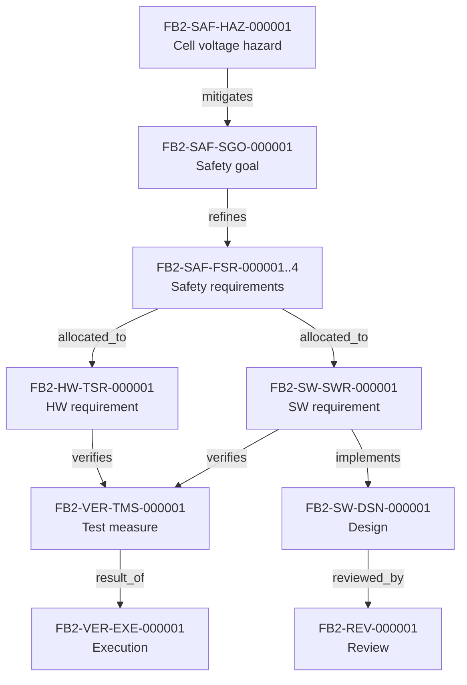

# Concept and safety — cell voltage vertical slice (generated view)

Generated: 2026-10-04T03:41:34Z | Baseline: BAS-REF-001 | 321 artifacts, 585 links

## Provenance and status of this file

- **Derived, not authored.** Every table and section below is generated by
  `docs/artifacts/tools/corpus.py cmd_render` from the canonical JSON records. This file contains no
  hand-written engineering content and is not an independent source of truth.
- **Regenerable.** Re-run `python3 docs/artifacts/tools/corpus.py render` to
  reproduce it. Edit the canonical record, never this file.
- **Scope of this view:** The `concept-and-safety` domain: hazard, safety goal, safety requirements, safety analyses, TARA and safety case held in the corpus.
- **Guard fields.** Every record shown below is printed with its own
  `profile`, `origin`, `human_approval_status` and `production_authorized`
  values. Across the whole corpus `human_approval_status` is `pending` and
  `production_authorized` is `false`; `product_verification_credit` is `false`.
  This view does not and cannot change that.
- **Not a conformity claim.** This corpus is synthetic. Nothing here asserts
  ISO 26262 conformity, an ASIL capability level, an Automotive SPICE
  assessment, human review, or human approval.
- **Diagram validation.** Mermaid blocks are checked by
  `mermaid-cli` when it is available on the rendering host; the per-view
  *Diagram validation* section states plainly whether that check ran. An
  unvalidated diagram is never described as validated.

## Vertical slice records

The canonical cell-voltage safety chain, in traversal order. The same id exists in both profiles; both copies are shown.

### FB2-SAF-HAZ-000001 (as_is) — Cell Overvoltage / Undervoltage Hazard

- type: `hazard` | revision: `2` | lifecycle: `reviewed`
- guard: profile=`as_is` \| origin=`derived` \| human_approval_status=`pending` \| production_authorized=`false`

### FB2-SAF-HAZ-000001 (synthetic_reference) — Cell Overvoltage / Undervoltage Hazard

- type: `hazard` | revision: `1` | lifecycle: `baselined`
- guard: profile=`synthetic_reference` \| origin=`synthetic` \| human_approval_status=`pending` \| production_authorized=`false`

### FB2-SAF-SGO-000001 (as_is) — Cell Voltage Safety Goal

- type: `safety_goal` | revision: `2` | lifecycle: `reviewed`
- guard: profile=`as_is` \| origin=`derived` \| human_approval_status=`pending` \| production_authorized=`false`
- statement: The BMS shall detect cell voltage limit violations and open HV contactors within the fault tolerant time interval (FTTI = 100 ms) to prevent cell overvoltage/undervoltage hazardous events.

### FB2-SAF-SGO-000001 (synthetic_reference) — Cell Voltage Safety Goal

- type: `safety_goal` | revision: `4` | lifecycle: `baselined`
- guard: profile=`synthetic_reference` \| origin=`synthetic` \| human_approval_status=`pending` \| production_authorized=`false`
- statement: The BMS shall detect cell voltage limit violations and open all HV contactors within the fault tolerant time interval (FTTI = 100 ms) to prevent cell overvoltage/undervoltage hazardous events, with a target diagnostic test interval of 10 ms, a target contactor mechanical opening time of 30 ms (FB2-PRM-000005 / FB2-ASM-006) and a resulting 40 ms from the fault request to feedback-confirmed contact…

### FB2-SAF-FSR-000001 (as_is) — FSR: Cell Voltage Acquisition and Validation

- type: `requirement` | revision: `3` | lifecycle: `reviewed`
- guard: profile=`as_is` \| origin=`derived` \| human_approval_status=`pending` \| production_authorized=`false`
- statement: The BMS shall acquire all cell voltages from AFE slaves at a minimum rate of 20 Hz with PEC/CRC validation, and publish validated data to the database within 25 ms of acquisition trigger.

### FB2-SAF-FSR-000001 (synthetic_reference) — FSR: Cell Voltage Acquisition and Validation

- type: `requirement` | revision: `2` | lifecycle: `baselined`
- guard: profile=`synthetic_reference` \| origin=`synthetic` \| human_approval_status=`pending` \| production_authorized=`false`
- statement: The BMS shall acquire all cell voltages from AFE slaves at a minimum rate of 20 Hz with PEC/CRC validation, and publish validated data to the database within 25 ms of acquisition trigger.

### FB2-SAF-FSR-000002 (as_is) — FSR: SOA Voltage Limit Monitoring with Debounce

- type: `requirement` | revision: `3` | lifecycle: `reviewed`
- guard: profile=`as_is` \| origin=`derived` \| human_approval_status=`pending` \| production_authorized=`false`
- statement: The BMS shall monitor each cell voltage against configured minimum and maximum limits with a debounce of 2 consecutive violations within 100 ms, and classify violations within 5 ms of data availability, triggering FAULT state request on confirmed violation.

### FB2-SAF-FSR-000002 (synthetic_reference) — FSR: SOA Voltage Limit Monitoring with Debounce

- type: `requirement` | revision: `2` | lifecycle: `baselined`
- guard: profile=`synthetic_reference` \| origin=`synthetic` \| human_approval_status=`pending` \| production_authorized=`false`
- statement: The BMS shall monitor each cell voltage against configured minimum and maximum limits with a debounce of 2 consecutive violations within 100 ms, and classify violations within 5 ms of data availability, triggering FAULT state request on confirmed violation.

### FB2-SAF-FSR-000003 (as_is) — FSR: Contactor Opening on SOA Violation

- type: `requirement` | revision: `3` | lifecycle: `reviewed`
- guard: profile=`as_is` \| origin=`derived` \| human_approval_status=`pending` \| production_authorized=`false`
- statement: The BMS shall open all HV contactors within 30 ms of FAULT state request from SOA/DIAG, with auxiliary feedback confirmation within 5 ms of coil de-energization.

### FB2-SAF-FSR-000003 (synthetic_reference) — FSR: Contactor Opening on SOA Violation

- type: `requirement` | revision: `3` | lifecycle: `baselined`
- guard: profile=`synthetic_reference` \| origin=`synthetic` \| human_approval_status=`pending` \| production_authorized=`false`
- statement: The BMS shall command all HV contactors to open within 5 ms of a FAULT state request from SOA/DIAG, shall reach the mechanically open state within 35 ms of that request, and shall confirm the commanded state from the auxiliary feedback within 40 ms of that request.

### FB2-SAF-FSR-000004 (synthetic_reference) — FSR: Independent Hardware Voltage Monitor

- type: `requirement` | revision: `3` | lifecycle: `baselined`
- guard: profile=`synthetic_reference` \| origin=`synthetic` \| human_approval_status=`pending` \| production_authorized=`false`
- statement: The item shall maintain, as a second barrier to the ASIL D cell-voltage safety goal FB2-SAF-SGO-000001, a cell-overvoltage detection and HV-contactor-opening capability that is independent of the main measurement, decision and command path, so that a failure confined to the main path does not remove the overvoltage reaction; the capability shall be allocated ASIL B and shall produce its contactor…

### FB2-HW-TSR-000001 (as_is) — TSR: AFE Cell Voltage Measurement Accuracy

- type: `requirement` | revision: `2` | lifecycle: `reviewed`
- guard: profile=`as_is` \| origin=`derived` \| human_approval_status=`pending` \| production_authorized=`false`
- statement: The AFE shall measure cell voltages with ±1.5 mV accuracy (including calibration) over -40°C to +85°C for 2.5V-4.2V range.

### FB2-HW-TSR-000001 (synthetic_reference) — TSR: AFE Cell Voltage Measurement Accuracy

- type: `requirement` | revision: `1` | lifecycle: `baselined`
- guard: profile=`synthetic_reference` \| origin=`synthetic` \| human_approval_status=`pending` \| production_authorized=`false`
- statement: The AFE shall measure cell voltages with ±1.5 mV accuracy (including calibration) over -40°C to +85°C for 2.5V-4.2V range.

### FB2-SW-SWR-000001 (as_is) — SWR: AFE Driver - Cell Voltage Acquisition

- type: `requirement` | revision: `2` | lifecycle: `reviewed`
- guard: profile=`as_is` \| origin=`derived` \| human_approval_status=`pending` \| production_authorized=`false`
- statement: The AFE driver shall trigger SPI/DMA acquisition of all cell voltages at 20 Hz, validate PEC/CRC, and publish to database within 5 ms of acquisition complete.

### FB2-SW-SWR-000001 (synthetic_reference) — SWR: AFE Driver - Cell Voltage Acquisition

- type: `requirement` | revision: `1` | lifecycle: `baselined`
- guard: profile=`synthetic_reference` \| origin=`synthetic` \| human_approval_status=`pending` \| production_authorized=`false`
- statement: The AFE driver shall trigger SPI/DMA acquisition of all cell voltages at 20 Hz, validate PEC/CRC, and publish to database within 5 ms of acquisition complete.

### FB2-SW-DSN-000001 (as_is) — Design: AFE Driver Architecture (LTC Family)

- type: `design` | revision: `1` | lifecycle: `reviewed`
- guard: profile=`as_is` \| origin=`derived` \| human_approval_status=`pending` \| production_authorized=`false`

### FB2-SW-DSN-000001 (synthetic_reference) — Design: AFE Driver Architecture (LTC Family)

- type: `design` | revision: `1` | lifecycle: `baselined`
- guard: profile=`synthetic_reference` \| origin=`synthetic` \| human_approval_status=`pending` \| production_authorized=`false`

### FB2-VER-TMS-000001 (as_is) — Test: SOA Voltage Limit Detection

- type: `test_measure` | revision: `1` | lifecycle: `reviewed`
- guard: profile=`as_is` \| origin=`source_observed` \| human_approval_status=`pending` \| production_authorized=`false`

### FB2-VER-TMS-000001 (synthetic_reference) — Test: SOA Voltage Limit Detection

- type: `test_measure` | revision: `1` | lifecycle: `reviewed`
- guard: profile=`synthetic_reference` \| origin=`synthetic` \| human_approval_status=`pending` \| production_authorized=`false`

### FB2-VER-EXE-000001 (as_is) — Execution: SOA Voltage Limit Test (real macOS host run)

- type: `execution` | revision: `2` | lifecycle: `reviewed`
- guard: profile=`as_is` \| origin=`source_observed` \| human_approval_status=`pending` \| production_authorized=`false`

### FB2-VER-EXE-000001 (synthetic_reference) — Execution: FB2-VER-TMS-000001 (synthetic_fixture)

- type: `execution` | revision: `2` | lifecycle: `reviewed`
- guard: profile=`synthetic_reference` \| origin=`synthetic` \| human_approval_status=`pending` \| production_authorized=`false`

### FB2-REV-000001 (as_is) — Review: Cell Voltage Protection Vertical Slice

- type: `review` | revision: `2` | lifecycle: `reviewed`
- guard: profile=`as_is` \| origin=`derived` \| human_approval_status=`pending` \| production_authorized=`false`

### Chain diagram

## Diagram validation

Validator: mermaid-cli /opt/homebrew/bin/mmdc with Chrome; 9/9 diagrams parsed and rendered to SVG

| Diagram | Result |
|---|---|
| `concept-and-safety.chain` | validated |

