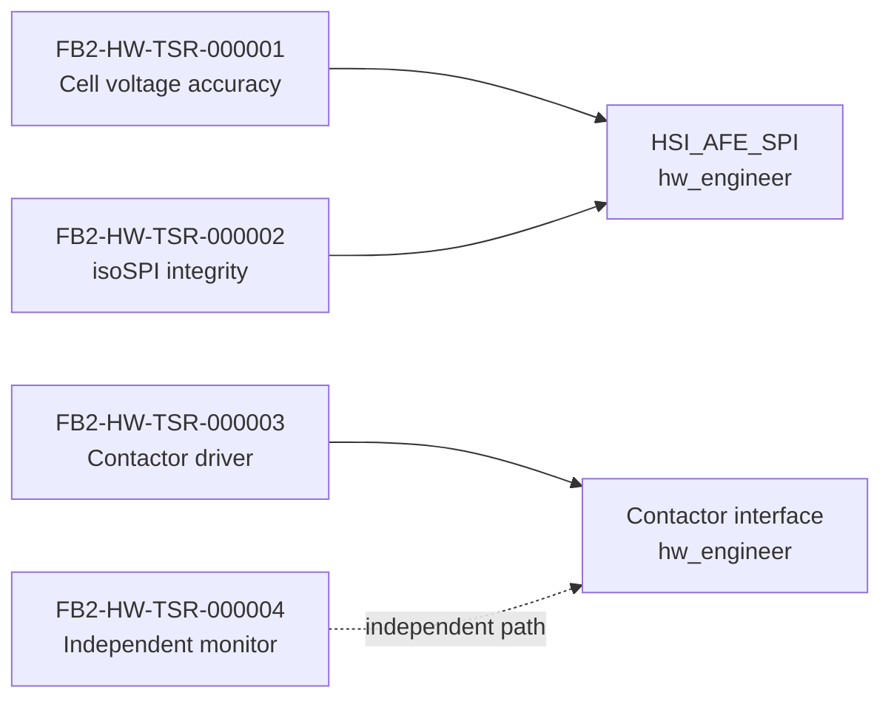

# Hardware — requirements, design and interfaces (generated view)

Generated: 2026-09-29T14:03:33Z | Baseline: BAS-REF-001 | 219 artifacts, 460 links

## Provenance and status of this file

- **Derived, not authored.** Every table and section below is generated by
  `docs/artifacts/tools/corpus.py cmd_render` from the canonical JSON records. This file contains no
  hand-written engineering content and is not an independent source of truth.
- **Regenerable.** Re-run `python3 docs/artifacts/tools/corpus.py render` to
  reproduce it. Edit the canonical record, never this file.
- **Scope of this view:** The `hardware` domain: hardware TSRs, hardware design records, and the hardware-owned part of the HSI signal set.
- **Guard fields.** Every record shown below is printed with its own
  `profile`, `origin`, `human_approval_status` and `production_authorized`
  values. Across the whole corpus `human_approval_status` is `pending` and
  `production_authorized` is `false`; `product_verification_credit` is `false`.
  This view does not and cannot change that.
- **Not a conformity claim.** This corpus is synthetic. Nothing here asserts
  ISO 26262 conformity, an ASIL capability level, an Automotive SPICE
  assessment, human review, or human approval.
- **Diagram validation.** Mermaid blocks are checked by
  `mermaid-cli` when it is available on the rendering host; the per-view
  *Diagram validation* section states plainly whether that check ran. An
  unvalidated diagram is never described as validated.

## Hardware technical safety requirements (TSR)

| Id | Profile | Title | ASIL | Lifecycle | Guard |
|---|---|---|---|---|---|
| `FB2-HW-TSR-000001` | as_is | TSR: AFE Cell Voltage Measurement Accuracy | ASIL_D | reviewed | profile=`as_is` \| origin=`source_observed` \| human_approval_status=`pending` \| production_authorized=`false` |
| `FB2-HW-TSR-000001` | synthetic_reference | TSR: AFE Cell Voltage Measurement Accuracy | ASIL_D | baselined | profile=`synthetic_reference` \| origin=`synthetic` \| human_approval_status=`pending` \| production_authorized=`false` |
| `FB2-HW-TSR-000002` | as_is | TSR: AFE isoSPI Communication Integrity | ASIL_D | reviewed | profile=`as_is` \| origin=`source_observed` \| human_approval_status=`pending` \| production_authorized=`false` |
| `FB2-HW-TSR-000002` | synthetic_reference | TSR: AFE isoSPI Communication Integrity | ASIL_D | baselined | profile=`synthetic_reference` \| origin=`synthetic` \| human_approval_status=`pending` \| production_authorized=`false` |
| `FB2-HW-TSR-000003` | as_is | TSR: Contactor Driver and Feedback | ASIL_D | reviewed | profile=`as_is` \| origin=`source_observed` \| human_approval_status=`pending` \| production_authorized=`false` |
| `FB2-HW-TSR-000003` | synthetic_reference | TSR: Contactor Driver and Feedback | ASIL_D | baselined | profile=`synthetic_reference` \| origin=`synthetic` \| human_approval_status=`pending` \| production_authorized=`false` |
| `FB2-HW-TSR-000004` | synthetic_reference | TSR: Independent Hardware Voltage Monitor | ASIL_B | baselined | profile=`synthetic_reference` \| origin=`synthetic` \| human_approval_status=`pending` \| production_authorized=`false` |

### FB2-HW-TSR-000001 (as_is) — TSR: AFE Cell Voltage Measurement Accuracy

- guard: profile=`as_is` \| origin=`source_observed` \| human_approval_status=`pending` \| production_authorized=`false`
- statement: The AFE shall measure cell voltages with ±1.5 mV accuracy (including calibration) over -40°C to +85°C for 2.5V-4.2V range.
- rationale: Required to support SOA limit detection with 1 mV threshold accuracy (FSR-002)
- acceptance criteria: {'criterion': 'Measurement accuracy', 'measure': 'Total error (offset + gain + temp drift)', 'threshold': '1.5', 'unit': 'mV'}; {'criterion': 'Resolution', 'measure': 'LSB size', 'threshold': '0.5', 'unit': 'mV'}; {'criterion': 'PEC error detection', 'measure': 'Single-bit error detection', 'threshold': '100%', 'unit': '%'}
- safety allocation: asil=ASIL_D, mitigation=PEC, redundant measurement, plausibility, safety_goal_ref=FB2-SAF-SGO-000001
- source_refs: FB2-SRC-HW-000002; FB2-SRC-COD-000001

### FB2-HW-TSR-000001 (synthetic_reference) — TSR: AFE Cell Voltage Measurement Accuracy

- guard: profile=`synthetic_reference` \| origin=`synthetic` \| human_approval_status=`pending` \| production_authorized=`false`
- statement: The AFE shall measure cell voltages with ±1.5 mV accuracy (including calibration) over -40°C to +85°C for 2.5V-4.2V range.
- rationale: Required to support SOA limit detection with 1 mV threshold accuracy (FSR-002)
- acceptance criteria: {'criterion': 'Measurement accuracy', 'measure': 'Total error (offset + gain + temp drift)', 'threshold': '1.5', 'unit': 'mV'}; {'criterion': 'Resolution', 'measure': 'LSB size', 'threshold': '0.5', 'unit': 'mV'}; {'criterion': 'PEC error detection', 'measure': 'Single-bit error detection', 'threshold': '100%', 'unit': '%'}
- safety allocation: asil=ASIL_D, mitigation=PEC, redundant measurement, plausibility, safety_goal_ref=FB2-SAF-SGO-000001
- source_refs: FB2-SRC-HW-000002; FB2-SRC-COD-000001

### FB2-HW-TSR-000002 (as_is) — TSR: AFE isoSPI Communication Integrity

- guard: profile=`as_is` \| origin=`source_observed` \| human_approval_status=`pending` \| production_authorized=`false`
- statement: The isoSPI interface shall provide communication with BER < 10^-9 and detect communication failures within 5 ms.
- rationale: Communication failures must be detected within FTTI budget for AFE data
- acceptance criteria: {'criterion': 'Bit error rate', 'measure': 'BER under EMC conditions', 'threshold': '1E-9', 'unit': 'errors/bit'}; {'criterion': 'Failure detection time', 'measure': 'Time from communication loss to SW notification', 'threshold': '5', 'unit': 'ms'}; {'criterion': 'CRC coverage', 'measure': 'CRC polynomial coverage', 'threshold': '100%', 'unit': '%'}
- safety allocation: asil=ASIL_D, mitigation=CRC, timeout monitoring, SW plausibility, safety_goal_ref=FB2-SAF-SGO-000001
- source_refs: FB2-SRC-HW-000003; FB2-SRC-COD-000021; FB2-SRC-COD-000023

### FB2-HW-TSR-000002 (synthetic_reference) — TSR: AFE isoSPI Communication Integrity

- guard: profile=`synthetic_reference` \| origin=`synthetic` \| human_approval_status=`pending` \| production_authorized=`false`
- statement: The isoSPI interface shall provide communication with BER < 10^-9 and detect communication failures within 5 ms.
- rationale: Communication failures must be detected within FTTI budget for AFE data
- acceptance criteria: {'criterion': 'Bit error rate', 'measure': 'BER under EMC conditions', 'threshold': '1E-9', 'unit': 'errors/bit'}; {'criterion': 'Failure detection time', 'measure': 'Time from communication loss to SW notification', 'threshold': '5', 'unit': 'ms'}; {'criterion': 'CRC coverage', 'measure': 'CRC polynomial coverage', 'threshold': '100%', 'unit': '%'}
- safety allocation: asil=ASIL_D, mitigation=CRC, timeout monitoring, SW plausibility, safety_goal_ref=FB2-SAF-SGO-000001
- source_refs: FB2-SRC-HW-000003; FB2-SRC-COD-000021; FB2-SRC-COD-000023

### FB2-HW-TSR-000003 (as_is) — TSR: Contactor Driver and Feedback

- guard: profile=`as_is` \| origin=`source_observed` \| human_approval_status=`pending` \| production_authorized=`false`
- statement: The SBC (FS85xx) shall drive contactor coils with controlled slew rate and monitor auxiliary feedback contacts with < 2 ms latency.
- rationale: Contactor control and feedback monitoring must meet FSR-003 30 ms latency budget
- acceptance criteria: {'criterion': 'Coil drive slew rate', 'measure': 'dV/dt at coil terminals', 'threshold': '50', 'unit': 'V/ms'}; {'criterion': 'Feedback latency', 'measure': 'Time from contactor state change to SW notification', 'threshold': '2', 'unit': 'ms'}; {'criterion': 'Weld detection', 'measure': 'Feedback mismatch detection time', 'threshold': '100', 'unit': 'ms'}
- safety allocation: asil=ASIL_D, mitigation=Independent SBC, feedback monitoring, watchdog, safety_goal_ref=FB2-SAF-SGO-000001
- source_refs: FB2-SRC-HW-000001; FB2-SRC-COD-000007; FB2-SRC-COD-000008; FB2-SRC-COD-000027

### FB2-HW-TSR-000003 (synthetic_reference) — TSR: Contactor Driver and Feedback

- guard: profile=`synthetic_reference` \| origin=`synthetic` \| human_approval_status=`pending` \| production_authorized=`false`
- statement: The SBC (FS85xx) shall drive contactor coils with controlled slew rate and monitor auxiliary feedback contacts with < 2 ms latency.
- rationale: Contactor control and feedback monitoring must meet the FB2-SAF-FSR-000003 reaction budget: 5 ms coil command plus 30 ms mechanical opening (FB2-PRM-000005) reaches the mechanically open state 35 ms after the fault request, and 5 ms of auxiliary feedback confirmation completes the reaction 40 ms after it
- acceptance criteria: {'criterion': 'Coil drive slew rate', 'measure': 'dV/dt at coil terminals', 'threshold': '50', 'unit': 'V/ms'}; {'criterion': 'Feedback latency', 'measure': 'Time from contactor state change to SW notification', 'threshold': '2', 'unit': 'ms'}; {'criterion': 'Weld detection', 'measure': 'Feedback mismatch detection time. The criterion is the weld detection budget of the actuated path and is deliberately not the reaction budget of FB2-SAF-FSR-000003, which is 40 ms end to end; see finding FB2-REV-FND-000024 for the 50 ms figure recorded here and the 100 ms figure of FB2-HW-TSR-000003', 'threshold': '100', 'unit': 'ms'}
- safety allocation: asil=ASIL_D, mitigation=Independent SBC, feedback monitoring, watchdog, safety_goal_ref=FB2-SAF-SGO-000001
- source_refs: FB2-SRC-HW-000001; FB2-SRC-COD-000007; FB2-SRC-COD-000008; FB2-SRC-COD-000027

### FB2-HW-TSR-000004 (synthetic_reference) — TSR: Independent Hardware Voltage Monitor

- guard: profile=`synthetic_reference` \| origin=`synthetic` \| human_approval_status=`pending` \| production_authorized=`false`
- statement: The hardware shall realise the ASIL B overvoltage reaction as a discrete chain separate from the main measurement chain: every cell monitored by the main chain shall be divided by a dedicated divider network into a comparator that holds its own overvoltage threshold reference on a supply rail not shared with the main chain, and the comparator output shall drive a contactor driver stage whose command is not sourced from the main microcontroller. No divider, reference, comparator, driver or suppl…
- rationale: Hardware realisation of the second barrier required by FB2-SAF-FSR-000004, decomposed at system level by FB2-SYS-SYR-000005 and allocated to element AR-005 of FB2-SAF-TSC-000001. Freedom from interference for the ASIL D cell-voltage goal rests on this chain sharing no measurement, reference, supply or command resource with the main chain: as allocated in FB2-SAF-SGO-000001 the main path is 85 ms …
- acceptance criteria: {'criterion': 'Independent chain coverage', 'measure': 'Cells in the pack that the main measurement chain monitors and that the independent divider network also measures, as a fraction of that monitored set', 'threshold': '100', 'unit': '%'}; {'criterion': 'Independent chain detection latency', 'measure': "Time from the independent comparator's threshold being exceeded to the contactor driver command at the coil", 'threshold': '50', 'unit': 'ms'}; {'criterion': 'Supply-rail separation', 'measure': 'Supply rails common to the independent chain and the main measurement chain', 'threshold': '0', 'unit': 'rails'}; {'criterion': 'Threshold-reference separation', 'measure': 'Overvoltage threshold references common to the independent chain and the main chain', 'threshold': '0', 'unit': 'references'}; {'criterion': 'Command-source separation', 'measure': 'Contactor driver stages the independent chain can reach that are commanded from the main microcontroller', 'threshold': '0', 'unit': 'stages'}; {'criterion': 'Overvoltage threshold accuracy', 'measure': 'Difference between the overvoltage threshold realised by the independent comparator chain and the configured cell shutdown threshold', 'threshold': '50', 'unit': 'mV'}; {'criterion': 'Independent chain diagnosability', 'measure': 'Diagnosis entries raised per detected failure of the independent chain itself: supply rail out of range, threshold reference out of range, or self-test failure', 'threshold': '1', 'unit': 'entry per detected failure'}
- safety allocation: asil=ASIL_B, mitigation=Independent power, sensing, and actuation path, safety_goal_ref=FB2-SAF-SGO-000001
- source_refs: -

## Hardware design records

### Coverage gap: hardware design records

**No records in the corpus for this area - this is a coverage gap, not an omission from this view.**

The corpus contains **no hardware-domain design record** in either profile — no hardware architecture, detailed design, interface/connector definition, BOM mapping, FMEDA or hardware bring-up record. The hardware domain is populated by requirements only. The hardware views in `reports/aspice-process-map.md` describe HWE.2 and HWE.3 as `partially_mapped`, which is consistent with this; there is simply no canonical record to render here.

## Hardware-relevant HSI signals

Signals from the system-owned interface authority whose owning interface is hardware. The authority itself is system-owned; this table is a read-only projection, not a second source of truth.

| Authority | Interface | Signal | Type | Unit | Range | Direction | Owner | Guard |
|---|---|---|---|---|---|---|---|---|
| `FB2-SYS-HSI-000001` | `HSI_AFE_SPI` | `SPI_CLK` | clock | MHz | 0.5-1.0 | MCU->AFE | hw_engineer | profile=`synthetic_reference` \| origin=`synthetic` \| human_approval_status=`pending` \| production_authorized=`false` |
| `FB2-SYS-HSI-000001` | `HSI_AFE_SPI` | `SPI_MOSI` | data | bits | 0/1 | MCU->AFE | hw_engineer | profile=`synthetic_reference` \| origin=`synthetic` \| human_approval_status=`pending` \| production_authorized=`false` |
| `FB2-SYS-HSI-000001` | `HSI_AFE_SPI` | `SPI_MISO` | data | bits | 0/1 | AFE->MCU | hw_engineer | profile=`synthetic_reference` \| origin=`synthetic` \| human_approval_status=`pending` \| production_authorized=`false` |
| `FB2-SYS-HSI-000001` | `HSI_AFE_SPI` | `SPI_CS[n]` | control | active_low | 0/1 | MCU->AFE | hw_engineer | profile=`synthetic_reference` \| origin=`synthetic` \| human_approval_status=`pending` \| production_authorized=`false` |
| `FB2-SYS-HSI-000001` | `HSI_AFE_DATABASE` | `cell_voltage[mV]` | uint16_t[] | mV | 0-5000 | AFE_DRV->DB | sw_engineer | profile=`synthetic_reference` \| origin=`synthetic` \| human_approval_status=`pending` \| production_authorized=`false` |
| `FB2-SYS-HSI-000001` | `HSI_AFE_DATABASE` | `cell_temperature[0.1°C]` | int16_t[] | 0.1°C | -400-1500 | AFE_DRV->DB | sw_engineer | profile=`synthetic_reference` \| origin=`synthetic` \| human_approval_status=`pending` \| production_authorized=`false` |
| `FB2-SYS-HSI-000001` | `HSI_AFE_DATABASE` | `balancing_status` | bool[] | bool | 0/1 | AFE_DRV->DB | sw_engineer | profile=`synthetic_reference` \| origin=`synthetic` \| human_approval_status=`pending` \| production_authorized=`false` |
| `FB2-SYS-HSI-000001` | `HSI_AFE_DATABASE` | `communication_error_count` | uint16_t | count | 0-65535 | AFE_DRV->DB | sw_engineer | profile=`synthetic_reference` \| origin=`synthetic` \| human_approval_status=`pending` \| production_authorized=`false` |

### Hardware allocation diagram

## Diagram validation

Validator: mermaid-cli /opt/homebrew/bin/mmdc with Chrome; 8/8 diagrams parsed and rendered to SVG

| Diagram | Result |
|---|---|
| `hardware.allocation` | validated |

