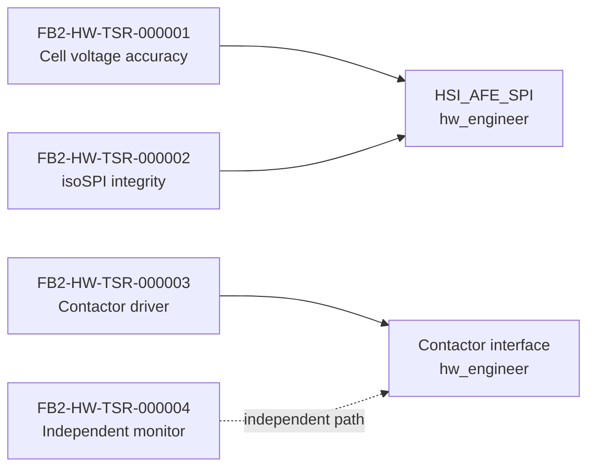

# Hardware — requirements, design and interfaces (generated view)

Generated: 2026-09-29T10:09:01Z | Baseline: BAS-REF-001 | 153 artifacts, 283 links

## Provenance and status of this file

- **Derived, not authored.** Every table and section below is generated by
  `docs/artifacts/tools/corpus.py cmd_render` from the canonical JSON records. This file contains no
  hand-written engineering content and is not an independent source of truth.
- **Regenerable.** Re-run `python3 docs/artifacts/tools/corpus.py render` to
  reproduce it. Edit the canonical record, never this file.
- **Scope of this view:** The `hardware` domain: hardware TSRs, hardware design records, and the hardware-owned part of the HSI signal set.
- **Guard fields.** Every record shown below is printed with its own
  `profile`, `origin`, `human_approval_status` and `production_authorized`
  values. Across the whole corpus `human_approval_status` is `pending` and
  `production_authorized` is `false`; `product_verification_credit` is `false`.
  This view does not and cannot change that.
- **Not a conformity claim.** This corpus is synthetic. Nothing here asserts
  ISO 26262 conformity, an ASIL capability level, an Automotive SPICE
  assessment, human review, or human approval.
- **Diagram validation.** Mermaid blocks are checked by
  `mermaid-cli` when it is available on the rendering host; the per-view
  *Diagram validation* section states plainly whether that check ran. An
  unvalidated diagram is never described as validated.

## Hardware technical safety requirements (TSR)

| Id | Profile | Title | ASIL | Lifecycle | Guard |
|---|---|---|---|---|---|
| `FB2-HW-TSR-000001` | as_is | TSR: AFE Cell Voltage Measurement Accuracy | ASIL_D | reviewed | profile=`as_is` \| origin=`source_observed` \| human_approval_status=`pending` \| production_authorized=`false` |
| `FB2-HW-TSR-000001` | synthetic_reference | TSR: AFE Cell Voltage Measurement Accuracy | ASIL_D | baselined | profile=`synthetic_reference` \| origin=`synthetic` \| human_approval_status=`pending` \| production_authorized=`false` |
| `FB2-HW-TSR-000002` | as_is | TSR: AFE isoSPI Communication Integrity | ASIL_D | reviewed | profile=`as_is` \| origin=`source_observed` \| human_approval_status=`pending` \| production_authorized=`false` |
| `FB2-HW-TSR-000002` | synthetic_reference | TSR: AFE isoSPI Communication Integrity | ASIL_D | baselined | profile=`synthetic_reference` \| origin=`synthetic` \| human_approval_status=`pending` \| production_authorized=`false` |
| `FB2-HW-TSR-000003` | as_is | TSR: Contactor Driver and Feedback | ASIL_D | reviewed | profile=`as_is` \| origin=`source_observed` \| human_approval_status=`pending` \| production_authorized=`false` |
| `FB2-HW-TSR-000003` | synthetic_reference | TSR: Contactor Driver and Feedback | ASIL_D | baselined | profile=`synthetic_reference` \| origin=`synthetic` \| human_approval_status=`pending` \| production_authorized=`false` |
| `FB2-HW-TSR-000004` | synthetic_reference | TSR: Independent Hardware Voltage Monitor | ASIL_B | baselined | profile=`synthetic_reference` \| origin=`synthetic` \| human_approval_status=`pending` \| production_authorized=`false` |

### FB2-HW-TSR-000001 (as_is) — TSR: AFE Cell Voltage Measurement Accuracy

- guard: profile=`as_is` \| origin=`source_observed` \| human_approval_status=`pending` \| production_authorized=`false`
- statement: The AFE shall measure cell voltages with ±1.5 mV accuracy (including calibration) over -40°C to +85°C for 2.5V-4.2V range.
- rationale: Required to support SOA limit detection with 1 mV threshold accuracy (FSR-002)
- acceptance criteria: {'criterion': 'Measurement accuracy', 'measure': 'Total error (offset + gain + temp drift)', 'threshold': '1.5', 'unit': 'mV'}; {'criterion': 'Resolution', 'measure': 'LSB size', 'threshold': '0.5', 'unit': 'mV'}; {'criterion': 'PEC error detection', 'measure': 'Single-bit error detection', 'threshold': '100%', 'unit': '%'}
- safety allocation: asil=ASIL_D, mitigation=PEC, redundant measurement, plausibility, safety_goal_ref=FB2-SAF-SGO-000001
- source_refs: FB2-SRC-HW-000002; FB2-SRC-COD-000001

### FB2-HW-TSR-000001 (synthetic_reference) — TSR: AFE Cell Voltage Measurement Accuracy

- guard: profile=`synthetic_reference` \| origin=`synthetic` \| human_approval_status=`pending` \| production_authorized=`false`
- statement: The AFE shall measure cell voltages with ±1.5 mV accuracy (including calibration) over -40°C to +85°C for 2.5V-4.2V range.
- rationale: Required to support SOA limit detection with 1 mV threshold accuracy (FSR-002)
- acceptance criteria: {'criterion': 'Measurement accuracy', 'measure': 'Total error (offset + gain + temp drift)', 'threshold': '1.5', 'unit': 'mV'}; {'criterion': 'Resolution', 'measure': 'LSB size', 'threshold': '0.5', 'unit': 'mV'}; {'criterion': 'PEC error detection', 'measure': 'Single-bit error detection', 'threshold': '100%', 'unit': '%'}
- safety allocation: asil=ASIL_D, mitigation=PEC, redundant measurement, plausibility, safety_goal_ref=FB2-SAF-SGO-000001
- source_refs: FB2-SRC-HW-000002; FB2-SRC-COD-000001

### FB2-HW-TSR-000002 (as_is) — TSR: AFE isoSPI Communication Integrity

- guard: profile=`as_is` \| origin=`source_observed` \| human_approval_status=`pending` \| production_authorized=`false`
- statement: The isoSPI interface shall provide communication with BER < 10^-9 and detect communication failures within 5 ms.
- rationale: Communication failures must be detected within FTTI budget for AFE data
- acceptance criteria: {'criterion': 'Bit error rate', 'measure': 'BER under EMC conditions', 'threshold': '1E-9', 'unit': 'errors/bit'}; {'criterion': 'Failure detection time', 'measure': 'Time from communication loss to SW notification', 'threshold': '5', 'unit': 'ms'}; {'criterion': 'CRC coverage', 'measure': 'CRC polynomial coverage', 'threshold': '100%', 'unit': '%'}
- safety allocation: asil=ASIL_D, mitigation=CRC, timeout monitoring, SW plausibility, safety_goal_ref=FB2-SAF-SGO-000001
- source_refs: FB2-SRC-HW-000003; FB2-SRC-COD-000021; FB2-SRC-COD-000023

### FB2-HW-TSR-000002 (synthetic_reference) — TSR: AFE isoSPI Communication Integrity

- guard: profile=`synthetic_reference` \| origin=`synthetic` \| human_approval_status=`pending` \| production_authorized=`false`
- statement: The isoSPI interface shall provide communication with BER < 10^-9 and detect communication failures within 5 ms.
- rationale: Communication failures must be detected within FTTI budget for AFE data
- acceptance criteria: {'criterion': 'Bit error rate', 'measure': 'BER under EMC conditions', 'threshold': '1E-9', 'unit': 'errors/bit'}; {'criterion': 'Failure detection time', 'measure': 'Time from communication loss to SW notification', 'threshold': '5', 'unit': 'ms'}; {'criterion': 'CRC coverage', 'measure': 'CRC polynomial coverage', 'threshold': '100%', 'unit': '%'}
- safety allocation: asil=ASIL_D, mitigation=CRC, timeout monitoring, SW plausibility, safety_goal_ref=FB2-SAF-SGO-000001
- source_refs: FB2-SRC-HW-000003; FB2-SRC-COD-000021; FB2-SRC-COD-000023

### FB2-HW-TSR-000003 (as_is) — TSR: Contactor Driver and Feedback

- guard: profile=`as_is` \| origin=`source_observed` \| human_approval_status=`pending` \| production_authorized=`false`
- statement: The SBC (FS85xx) shall drive contactor coils with controlled slew rate and monitor auxiliary feedback contacts with < 2 ms latency.
- rationale: Contactor control and feedback monitoring must meet FSR-003 30 ms latency budget
- acceptance criteria: {'criterion': 'Coil drive slew rate', 'measure': 'dV/dt at coil terminals', 'threshold': '50', 'unit': 'V/ms'}; {'criterion': 'Feedback latency', 'measure': 'Time from contactor state change to SW notification', 'threshold': '2', 'unit': 'ms'}; {'criterion': 'Weld detection', 'measure': 'Feedback mismatch detection time', 'threshold': '100', 'unit': 'ms'}
- safety allocation: asil=ASIL_D, mitigation=Independent SBC, feedback monitoring, watchdog, safety_goal_ref=FB2-SAF-SGO-000001
- source_refs: FB2-SRC-HW-000001; FB2-SRC-COD-000007; FB2-SRC-COD-000008; FB2-SRC-COD-000027

### FB2-HW-TSR-000003 (synthetic_reference) — TSR: Contactor Driver and Feedback

- guard: profile=`synthetic_reference` \| origin=`synthetic` \| human_approval_status=`pending` \| production_authorized=`false`
- statement: The SBC (FS85xx) shall drive contactor coils with controlled slew rate and monitor auxiliary feedback contacts with < 2 ms latency.
- rationale: Contactor control and feedback monitoring must meet FSR-003 30 ms latency budget
- acceptance criteria: {'criterion': 'Coil drive slew rate', 'measure': 'dV/dt at coil terminals', 'threshold': '50', 'unit': 'V/ms'}; {'criterion': 'Feedback latency', 'measure': 'Time from contactor state change to SW notification', 'threshold': '2', 'unit': 'ms'}; {'criterion': 'Weld detection', 'measure': 'Feedback mismatch detection time', 'threshold': '100', 'unit': 'ms'}
- safety allocation: asil=ASIL_D, mitigation=Independent SBC, feedback monitoring, watchdog, safety_goal_ref=FB2-SAF-SGO-000001
- source_refs: FB2-SRC-HW-000001; FB2-SRC-COD-000007; FB2-SRC-COD-000008; FB2-SRC-COD-000027

### FB2-HW-TSR-000004 (synthetic_reference) — TSR: Independent Hardware Voltage Monitor

- guard: profile=`synthetic_reference` \| origin=`synthetic` \| human_approval_status=`pending` \| production_authorized=`false`
- statement: The BMS shall include an independent hardware voltage monitor (ASIL B) that continuously monitors cell voltages and can open HV contactors independently of the main MCU within 50 ms of overvoltage detection.
- rationale: Provides freedom from interference for ASIL D safety goal; addresses timing budget violation in main path (115 ms > 100 ms FTTI) by providing parallel safety channel
- acceptance criteria: {'criterion': 'Independent detection latency', 'measure': 'Time from overvoltage to contactor command', 'threshold': '50', 'unit': 'ms'}; {'criterion': 'Independence', 'measure': 'No shared MCU, power supply, or communication with main path', 'threshold': '100%', 'unit': '%'}; {'criterion': 'Monitoring coverage', 'measure': 'Cells monitored', 'threshold': 'All cells (or representative subset >= 50%)', 'unit': '%'}; {'criterion': 'Threshold accuracy', 'measure': 'Overvoltage threshold accuracy', 'threshold': '50', 'unit': 'mV'}
- safety allocation: asil=ASIL_B, mitigation=Independent power, sensing, and actuation path, safety_goal_ref=FB2-SAF-SGO-000001
- source_refs: -

## Hardware design records

### Coverage gap: hardware design records

**No records in the corpus for this area - this is a coverage gap, not an omission from this view.**

The corpus contains **no hardware-domain design record** in either profile — no hardware architecture, detailed design, interface/connector definition, BOM mapping, FMEDA or hardware bring-up record. The hardware domain is populated by requirements only. The hardware views in `reports/aspice-process-map.md` describe HWE.2 and HWE.3 as `partially_mapped`, which is consistent with this; there is simply no canonical record to render here.

## Hardware-relevant HSI signals

Signals from the system-owned interface authority whose owning interface is hardware. The authority itself is system-owned; this table is a read-only projection, not a second source of truth.

| Authority | Interface | Signal | Type | Unit | Range | Direction | Owner | Guard |
|---|---|---|---|---|---|---|---|---|
| `FB2-SYS-HSI-000001` | `HSI_AFE_SPI` | `SPI_CLK` | clock | MHz | 0.5-1.0 | MCU->AFE | hw_engineer | profile=`synthetic_reference` \| origin=`synthetic` \| human_approval_status=`pending` \| production_authorized=`false` |
| `FB2-SYS-HSI-000001` | `HSI_AFE_SPI` | `SPI_MOSI` | data | bits | 0/1 | MCU->AFE | hw_engineer | profile=`synthetic_reference` \| origin=`synthetic` \| human_approval_status=`pending` \| production_authorized=`false` |
| `FB2-SYS-HSI-000001` | `HSI_AFE_SPI` | `SPI_MISO` | data | bits | 0/1 | AFE->MCU | hw_engineer | profile=`synthetic_reference` \| origin=`synthetic` \| human_approval_status=`pending` \| production_authorized=`false` |
| `FB2-SYS-HSI-000001` | `HSI_AFE_SPI` | `SPI_CS[n]` | control | active_low | 0/1 | MCU->AFE | hw_engineer | profile=`synthetic_reference` \| origin=`synthetic` \| human_approval_status=`pending` \| production_authorized=`false` |
| `FB2-SYS-HSI-000001` | `HSI_AFE_DATABASE` | `cell_voltage[mV]` | uint16_t[] | mV | 0-5000 | AFE_DRV->DB | sw_engineer | profile=`synthetic_reference` \| origin=`synthetic` \| human_approval_status=`pending` \| production_authorized=`false` |
| `FB2-SYS-HSI-000001` | `HSI_AFE_DATABASE` | `cell_temperature[0.1°C]` | int16_t[] | 0.1°C | -400-1500 | AFE_DRV->DB | sw_engineer | profile=`synthetic_reference` \| origin=`synthetic` \| human_approval_status=`pending` \| production_authorized=`false` |
| `FB2-SYS-HSI-000001` | `HSI_AFE_DATABASE` | `balancing_status` | bool[] | bool | 0/1 | AFE_DRV->DB | sw_engineer | profile=`synthetic_reference` \| origin=`synthetic` \| human_approval_status=`pending` \| production_authorized=`false` |
| `FB2-SYS-HSI-000001` | `HSI_AFE_DATABASE` | `communication_error_count` | uint16_t | count | 0-65535 | AFE_DRV->DB | sw_engineer | profile=`synthetic_reference` \| origin=`synthetic` \| human_approval_status=`pending` \| production_authorized=`false` |

### Hardware allocation diagram

## Diagram validation

Validator: mermaid-cli /opt/homebrew/bin/mmdc with Chrome; 8/8 diagrams parsed and rendered to SVG

| Diagram | Result |
|---|---|
| `hardware.allocation` | validated |

