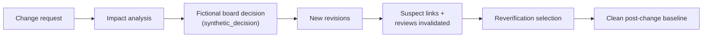

# Management — project, changes and decisions (generated view)

Generated: 2026-09-29T12:17:31Z | Baseline: BAS-REF-001 | 218 artifacts, 460 links

## Provenance and status of this file

- **Derived, not authored.** Every table and section below is generated by
  `docs/artifacts/tools/corpus.py cmd_render` from the canonical JSON records. This file contains no
  hand-written engineering content and is not an independent source of truth.
- **Regenerable.** Re-run `python3 docs/artifacts/tools/corpus.py render` to
  reproduce it. Edit the canonical record, never this file.
- **Scope of this view:** The `management` domain: project scope, safety plan, change records and their synthetic decisions.
- **Guard fields.** Every record shown below is printed with its own
  `profile`, `origin`, `human_approval_status` and `production_authorized`
  values. Across the whole corpus `human_approval_status` is `pending` and
  `production_authorized` is `false`; `product_verification_credit` is `false`.
  This view does not and cannot change that.
- **Not a conformity claim.** This corpus is synthetic. Nothing here asserts
  ISO 26262 conformity, an ASIL capability level, an Automotive SPICE
  assessment, human review, or human approval.
- **Diagram validation.** Mermaid blocks are checked by
  `mermaid-cli` when it is available on the rendering host; the per-view
  *Diagram validation* section states plainly whether that check ran. An
  unvalidated diagram is never described as validated.

## Project scope and safety plan

| Id | Profile | Type | Title | Guard |
|---|---|---|---|---|
| `FB2-MAN-SCO-000001` | synthetic_reference | requirement | Project Scope: foxBMS 2 Reference BMS Development | profile=`synthetic_reference` \| origin=`synthetic` \| human_approval_status=`pending` \| production_authorized=`false` |
| `FB2-MAN-SPL-000001` | synthetic_reference | design | Safety Plan: foxBMS 2 Reference BMS | profile=`synthetic_reference` \| origin=`synthetic` \| human_approval_status=`pending` \| production_authorized=`false` |

### FB2-MAN-SCO-000001 — Project Scope: foxBMS 2 Reference BMS Development

- guard: profile=`synthetic_reference` \| origin=`synthetic` \| human_approval_status=`pending` \| production_authorized=`false`
- statement: Develop a reference implementation of a production-intent BMS based on the foxBMS 2 platform, covering all safety-critical functions for a hypothetical 400V/100kWh EV battery pack with ASIL D cell voltage monitoring.

### FB2-MAN-SPL-000001 — Safety Plan: foxBMS 2 Reference BMS

- guard: profile=`synthetic_reference` \| origin=`synthetic` \| human_approval_status=`pending` \| production_authorized=`false`
- responsibilities:
  - Define safety activities and milestones
  - Assign safety roles and responsibilities
  - Define safety analysis methods and tools
  - Plan verification and validation activities
  - Define confirmation measures and independence
  - Plan safety-oriented configuration management
  - Define safety culture and escalation arrangements
- decisions: {'decision_id': 'DEC-SAF-001', 'alternatives': ['Full ASIL D', 'ASIL B with independent monitor'], 'selected': 'ASIL D with independent HW monitor (ASIL B)', 'rationale': 'Addresses timing budget violation in main path'}; {'decision_id': 'DEC-SAF-002', 'alternatives': ['Internal confirmation', 'External assessor'], 'selected': 'Synthetic AI-assisted review (human pending)', 'rationale': 'Corpus is synthetic; real assessment not applicable'}

## Change records

| Id | Profile | Change type | Lifecycle | Guard |
|---|---|---|---|---|
| `FB2-MAN-CHG-000001` | synthetic_reference | safety_threshold | draft | profile=`synthetic_reference` \| origin=`synthetic` \| human_approval_status=`pending` \| production_authorized=`false` |
| `FB2-MAN-CHG-000002` | synthetic_reference | hsi_interface | draft | profile=`synthetic_reference` \| origin=`synthetic` \| human_approval_status=`pending` \| production_authorized=`false` |
| `FB2-MAN-CHG-000003` | synthetic_reference | software_behavior | draft | profile=`synthetic_reference` \| origin=`synthetic` \| human_approval_status=`pending` \| production_authorized=`false` |

### FB2-MAN-CHG-000001 — Change Record CR-001: Cell Voltage Maximum Limit Reduction 4200 mV -> 4150 mV (Cell Supplier Re-Specification)

- guard: profile=`synthetic_reference` \| origin=`synthetic` \| human_approval_status=`pending` \| production_authorized=`false`
- change_type: `safety_threshold` | lifecycle: `draft`
- implementation_status: `not_in_source`
- decision: `FB2-CHG-REF-000001` by change_control_board chair, fictional role identity 'A. Renner' (synthetic scenario character; not a foxBMS maintainer, not SoftwareDevLabs staff, not a real person)
- decision rationale: The supplier limit is mandatory, so the change cannot be rejected; there is no design freedom in the ceiling itself. The board therefore dispositions the request as approved in the fictional workflow sense and accepts the availability cost, because the safety margin increase (100 mV -> 150 mV to the FB2-ASM-002 runaway boundary) dominates a false-positive rate that is still bounded by the same 1E-6 events/hour criterion. Three dispositions are bundled and are each independently required: raise the debounce count from 2 to 3 to hold the false-positive rate; rebuild the warning/derating/shutdown ladder so that warning < derating < shutdown below the new ceiling; and reissue FB2-ASM-001 and FB…
- trigger: date=2026-09-15T00:00:00Z, description=The cell supplier for the synthetic reference pack re-specifies the maximum charge voltage of the selected cell from 4200 mV to 4150 mV following a chemistry optimisation. Assumption FB2-ASM-001 states an operating range of 2.5 V-4.2 V and is invalidated by this notification; the supplier limit is mandatory and is not negotiable by the project., external_to_corpus=True, source=Synthetic cell supplier change notification (fictional supplier, hypothetical project), trigger_class=external_mandatory
- impact — affected artifacts: FB2-SAF-FSR-000002; FB2-SAF-HAZ-000001; FB2-HW-TSR-000001; FB2-SW-DSN-000002; FB2-VER-TMS-000001
- impact — affected links: FB2-LNK-SAF-000001; FB2-LNK-SAF-000003; FB2-LNK-SAF-000009; FB2-LNK-SAF-000012; FB2-LNK-SAF-000022; FB2-LNK-SAF-000023; FB2-LNK-SAF-000033
- impact — risk: The change is safety-improving in the hazard sense and availability-degrading in the noise sense, and those two effects pull in opposite directions. (1) Safety margin grows: FB2-ASM-002 places the thermal-runaway boundary above 4300 mV, so tripping at 4150 mV leaves 150 mV of boundary margin where the current 4200 mV limit leaves 100 mV. (2) Availability degrades: FB2-ASM-005 bounds measurement noise at sigma <= 5 mV, and FB2-SAF-FSR-000002 accepts a false-positive rate of 1E-6 events/hour for …
- new revisions: {'artifact_id': 'FB2-SAF-FSR-000002', 'old_revision': '1', 'new_revision': '2'}; {'artifact_id': 'FB2-SAF-HAZ-000001', 'old_revision': '1', 'new_revision': '2'}; {'artifact_id': 'FB2-HW-TSR-000001', 'old_revision': '1', 'new_revision': '2'}; {'artifact_id': 'FB2-SW-DSN-000002', 'old_revision': '1', 'new_revision': '2'}; {'artifact_id': 'FB2-VER-TMS-000001', 'old_revision': '1', 'new_revision': '2'}
- suspect links: FB2-LNK-SAF-000001; FB2-LNK-SAF-000003; FB2-LNK-SAF-000009; FB2-LNK-SAF-000012; FB2-LNK-SAF-000022; FB2-LNK-SAF-000023; FB2-LNK-SAF-000033
- reverification selection: FB2-VER-TMS-000001; FB2-VER-TMS-000002; FB2-VER-TMS-000003
- synthetic_decision: is_human_approval=False, is_synthetic=True, label=synthetic_decision:change_control_board_chair:FB2-CHG-REF-000001, statement=decision.disposition 'approved' is a fictional workflow outcome of the synthetic-reference project's change control board. It is NOT a human approval, NOT a foxBMS maintainer decision, NOT a SoftwareDevLabs decision, and NOT a statement that any change was made to any real project. human_approval_status remains 'pending' and production_authorized remains false.
- limitations/boundaries: asserts_measured_test_result=False, asserts_real_approval=False, asserts_real_project_change=False, human_approval_status=pending, product_verification_credit=False, production_authorized=False

### FB2-MAN-CHG-000002 — Change Record CR-002: AFE Front-End Migration from LTC6811 (isoSPI) to ADI ADES1830 (SPI/DMA)

- guard: profile=`synthetic_reference` \| origin=`synthetic` \| human_approval_status=`pending` \| production_authorized=`false`
- change_type: `hsi_interface` | lifecycle: `draft`
- implementation_status: `not_in_source`
- decision: `FB2-CHG-REF-000002` by change_control_board chair, fictional role identity 'A. Renner' (synthetic scenario character; not a foxBMS maintainer, not SoftwareDevLabs staff, not a real person)
- decision rationale: Obsolescence is mandatory, so the request cannot be rejected. The board dispositions it as approved for the front-end migration and, in the same decision, records two things it is NOT approving. First, it does not accept the loss of the 2500 Vrms galvanic barrier as residual risk: an independent monitoring path that crosses the pack potential is an architecture question, and the corpus has no artifact that currently provides a second monitoring route, so the loss is dispositioned 'deferred to a follow-up architecture change' rather than 'accepted'. Second, it does not approve reusing the existing HSI record by re-parameterising it. FB2-SYS-HSI-000001 already says in its own variant_applicab…
- trigger: date=2026-10-01T00:00:00Z, description=The selected AFE, LTC6811, is announced as not recommended for new designs. For the synthetic reference project the migration target is fixed by the parameter set already present in the corpus: VAR-AFE-ADI-1830 is inventoried in sources/variant-matrix.json and FB2-SYS-HSI-000001 already records that this variant needs a different interface, 'HSI_AFE_SPI_ADI', rather than a re-parameterisation of the existing one. The migration therefore adds a second AFE front end to the reference configuration; it does not re-point the existing one., external_to_corpus=True, source=Synthetic semiconductor supplier obsolescence notice (LTC6811 entering NRND; hypothetical project), trigger_class=external_mandatory
- impact — affected artifacts: FB2-SYS-HSI-000001; FB2-HW-TSR-000001; FB2-HW-TSR-000002; FB2-SW-SWR-000001; FB2-SW-DSN-000001; FB2-VER-TMS-000003; FB2-VER-TMS-000005
- impact — affected links: FB2-LNK-SAF-000005; FB2-LNK-SAF-000006; FB2-LNK-SAF-000008; FB2-LNK-SAF-000011; FB2-LNK-SAF-000027; FB2-LNK-SAF-000028; FB2-LNK-SAF-000031
- impact — risk: This is the highest-exposure change of the three, because the migration removes a safety barrier rather than moving a threshold. (1) The galvanic barrier disappears. FB2-SYS-HSI-000001 specifies iso_spi_transformer_isolation_vrms of 2500, so today the MCU-to-slave monitoring link is a transformer-isolated bus; a direct SPI/DMA link to an ADES1830 sitting at pack potential has no such barrier, and the cell-voltage acquisition path that feeds the ASIL D FB2-SAF-FSR-000001 therefore becomes reacha…
- new revisions: {'artifact_id': 'FB2-SYS-HSI-000001', 'old_revision': '1', 'new_revision': '2'}; {'artifact_id': 'FB2-HW-TSR-000001', 'old_revision': '1', 'new_revision': '2'}; {'artifact_id': 'FB2-HW-TSR-000002', 'old_revision': '1', 'new_revision': '2'}; {'artifact_id': 'FB2-SW-SWR-000001', 'old_revision': '1', 'new_revision': '2'}; {'artifact_id': 'FB2-SW-DSN-000001', 'old_revision': '1', 'new_revision': '2'}; {'artifact_id': 'FB2-VER-TMS-000003', 'old_revision': '1', 'new_revision': '2'}; {'artifact_id': 'FB2-VER-TMS-000005', 'old_revision': '1', 'new_revision': '2'}
- suspect links: FB2-LNK-SAF-000005; FB2-LNK-SAF-000006; FB2-LNK-SAF-000008; FB2-LNK-SAF-000011; FB2-LNK-SAF-000027; FB2-LNK-SAF-000028; FB2-LNK-SAF-000031
- reverification selection: FB2-VER-TMS-000003; FB2-VER-TMS-000005; FB2-VER-TMS-000001; FB2-VER-TMS-000002
- synthetic_decision: is_human_approval=False, is_synthetic=True, label=synthetic_decision:change_control_board_chair:FB2-CHG-REF-000002, statement=decision.disposition 'partial' is a fictional workflow outcome of the synthetic-reference project's change control board. It is NOT a human approval, NOT a foxBMS maintainer decision, NOT a SoftwareDevLabs decision, and NOT a statement that any change was made to any real project. human_approval_status remains 'pending' and production_authorized remains false.
- limitations/boundaries: asserts_measured_test_result=False, asserts_real_approval=False, asserts_real_hardware_variant_available=False, asserts_real_project_change=False, human_approval_status=pending, product_verification_credit=False, production_authorized=False

### FB2-MAN-CHG-000003 — Change Record CR-003: SOA Debounce Counter Not Reset on Return to In-Range Voltage (Design-Implementation Divergence)

- guard: profile=`synthetic_reference` \| origin=`synthetic` \| human_approval_status=`pending` \| production_authorized=`false`
- change_type: `software_behavior` | lifecycle: `draft`
- implementation_status: `not_in_source`
- decision: `FB2-CHG-REF-000003` by change_control_board chair, fictional role identity 'A. Renner' (synthetic scenario character; not a foxBMS maintainer, not SoftwareDevLabs staff, not a real person)
- decision rationale: Dispositioned approved as a defect correction with a deliberately narrow work scope. The board fixes three things and refuses one. Fixed: the software requirement is clarified to state the reset semantics explicitly, because a requirement that is silent on reset cannot constrain an implementation; the safety requirement is clarified in the same terms so the two do not diverge again; and the test is extended with the recovery sequence, because a defect that the verification set could not express cannot be shown fixed by a test that still cannot express it. Refused: no new design element. FB2-SW-DSN-000002 already specifies the DEBOUNCING -> IDLE transition with the reset_debounce action, so …
- trigger: date=2026-11-01T00:00:00Z, description=A transient voltage excursion above the configured limit advances the debounce counter, and when the voltage returns within limits the counter is not cleared. Because the counter is not cleared, a later, unrelated excursion resumes from a partially advanced count and confirms a violation that no single excursion justifies. The trigger is a behavioural observation against a baselined design, not a supplier event and not a change in requirement., external_to_corpus=False, source=Synthetic integration test observation and field report from the synthetic-reference project (hypothetical), trigger_class=internal_defect
- impact — affected artifacts: FB2-SAF-FSR-000002; FB2-SW-DSN-000002; FB2-SW-SWR-000002; FB2-VER-TMS-000001
- impact — affected links: FB2-LNK-SAF-000009; FB2-LNK-SAF-000012; FB2-LNK-SAF-000022; FB2-LNK-SAF-000023; FB2-LNK-SAF-000033
- impact — risk: The safety exposure is availability and trust, not a missing safety function, and the distinction matters for how the fix is reviewed. (1) No hazard is created: the protective reaction still occurs, and it occurs sooner than it should. FB2-SAF-HAZ-000001 lists 'All HV contactors open' and 'Vehicle propulsion disabled' as safe states for the cell-voltage hazard, and a spurious entry into those states is a conservative failure in the safety sense. (2) The exposure is that the ASIL D path becomes …
- new revisions: {'artifact_id': 'FB2-SAF-FSR-000002', 'old_revision': '1', 'new_revision': '2'}; {'artifact_id': 'FB2-SW-SWR-000002', 'old_revision': '1', 'new_revision': '2'}; {'artifact_id': 'FB2-VER-TMS-000001', 'old_revision': '1', 'new_revision': '2'}
- suspect links: FB2-LNK-SAF-000009; FB2-LNK-SAF-000012; FB2-LNK-SAF-000022; FB2-LNK-SAF-000023; FB2-LNK-SAF-000033
- reverification selection: FB2-VER-TMS-000001; FB2-VER-TMS-000002
- synthetic_decision: is_human_approval=False, is_synthetic=True, label=synthetic_decision:change_control_board_chair:FB2-CHG-REF-000003, statement=decision.disposition 'approved' is a fictional workflow outcome of the synthetic-reference project's change control board. It is NOT a human approval, NOT a foxBMS maintainer decision, NOT a SoftwareDevLabs decision, and NOT a statement that any defect was found, reproduced or fixed in any real product. The observation that triggers this record is a synthetic one: no field report about a foxBMS product exists, and none is claimed. human_approval_status remains 'pending' and production_authorized remains false.
- limitations/boundaries: asserts_measured_test_result=False, asserts_real_approval=False, asserts_real_defect_in_real_product=False, asserts_real_project_change=False, human_approval_status=pending, product_verification_credit=False, production_authorized=False

### Change lifecycle diagram

## Diagram validation

Validator: mermaid-cli /opt/homebrew/bin/mmdc with Chrome; 8/8 diagrams parsed and rendered to SVG

| Diagram | Result |
|---|---|
| `management.change-lifecycle` | validated |

