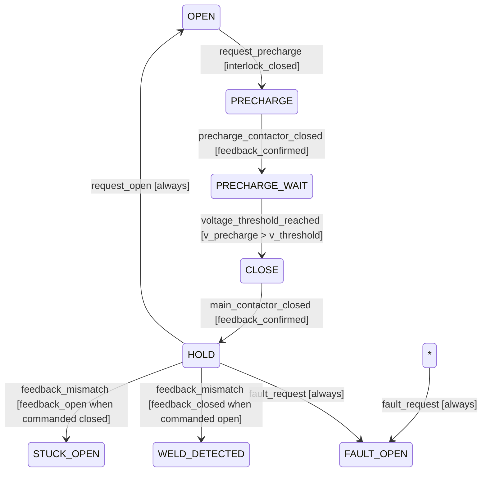

# Software — requirements, design and deviations (generated view)

Generated: 2026-09-29T10:09:01Z | Baseline: BAS-REF-001 | 153 artifacts, 283 links

## Provenance and status of this file

- **Derived, not authored.** Every table and section below is generated by
  `docs/artifacts/tools/corpus.py cmd_render` from the canonical JSON records. This file contains no
  hand-written engineering content and is not an independent source of truth.
- **Regenerable.** Re-run `python3 docs/artifacts/tools/corpus.py render` to
  reproduce it. Edit the canonical record, never this file.
- **Scope of this view:** The `software` domain: software requirements, software design records, and the 26 MISRA C:2012 deviation records.
- **Guard fields.** Every record shown below is printed with its own
  `profile`, `origin`, `human_approval_status` and `production_authorized`
  values. Across the whole corpus `human_approval_status` is `pending` and
  `production_authorized` is `false`; `product_verification_credit` is `false`.
  This view does not and cannot change that.
- **Not a conformity claim.** This corpus is synthetic. Nothing here asserts
  ISO 26262 conformity, an ASIL capability level, an Automotive SPICE
  assessment, human review, or human approval.
- **Diagram validation.** Mermaid blocks are checked by
  `mermaid-cli` when it is available on the rendering host; the per-view
  *Diagram validation* section states plainly whether that check ran. An
  unvalidated diagram is never described as validated.

## Software requirements

| Id | Profile | Title | ASIL | Verification approach | Guard |
|---|---|---|---|---|---|
| `FB2-SW-SWR-000001` | as_is | SWR: AFE Driver - Cell Voltage Acquisition | ASIL_D | test | profile=`as_is` \| origin=`source_observed` \| human_approval_status=`pending` \| production_authorized=`false` |
| `FB2-SW-SWR-000001` | synthetic_reference | SWR: AFE Driver - Cell Voltage Acquisition | ASIL_D | test | profile=`synthetic_reference` \| origin=`synthetic` \| human_approval_status=`pending` \| production_authorized=`false` |
| `FB2-SW-SWR-000002` | as_is | SWR: SOA Voltage Limit Monitoring | ASIL_D | test | profile=`as_is` \| origin=`source_observed` \| human_approval_status=`pending` \| production_authorized=`false` |
| `FB2-SW-SWR-000002` | synthetic_reference | SWR: SOA Voltage Limit Monitoring | ASIL_D | test | profile=`synthetic_reference` \| origin=`synthetic` \| human_approval_status=`pending` \| production_authorized=`false` |
| `FB2-SW-SWR-000003` | as_is | SWR: Contactor State Machine and Fault Response | ASIL_D | test | profile=`as_is` \| origin=`source_observed` \| human_approval_status=`pending` \| production_authorized=`false` |
| `FB2-SW-SWR-000003` | synthetic_reference | SWR: Contactor State Machine and Fault Response | ASIL_D | test | profile=`synthetic_reference` \| origin=`synthetic` \| human_approval_status=`pending` \| production_authorized=`false` |

### FB2-SW-SWR-000001 (as_is) — SWR: AFE Driver - Cell Voltage Acquisition

- guard: profile=`as_is` \| origin=`source_observed` \| human_approval_status=`pending` \| production_authorized=`false`
- statement: The AFE driver shall trigger SPI/DMA acquisition of all cell voltages at 20 Hz, validate PEC/CRC, and publish to database within 5 ms of acquisition complete.
- acceptance criteria: {'criterion': 'Acquisition period', 'measure': 'Timer period', 'threshold': '50', 'unit': 'ms'}; {'criterion': 'PEC/CRC validation', 'measure': 'Error detection before database write', 'threshold': '100%', 'unit': '%'}; {'criterion': 'Database publish latency', 'measure': 'Time from SPI complete to database write', 'threshold': '5', 'unit': 'ms'}
- conditions/modes: NORMAL; CHARGING; PRECHARGE; DERATING
- source_refs: FB2-SRC-COD-000001; FB2-SRC-COD-000002; FB2-SRC-COD-000021; FB2-SRC-COD-000023

### FB2-SW-SWR-000001 (synthetic_reference) — SWR: AFE Driver - Cell Voltage Acquisition

- guard: profile=`synthetic_reference` \| origin=`synthetic` \| human_approval_status=`pending` \| production_authorized=`false`
- statement: The AFE driver shall trigger SPI/DMA acquisition of all cell voltages at 20 Hz, validate PEC/CRC, and publish to database within 5 ms of acquisition complete.
- acceptance criteria: {'criterion': 'Acquisition period', 'measure': 'Timer period', 'threshold': '50', 'unit': 'ms'}; {'criterion': 'PEC/CRC validation', 'measure': 'Error detection before database write', 'threshold': '100%', 'unit': '%'}; {'criterion': 'Database publish latency', 'measure': 'Time from SPI complete to database write', 'threshold': '25', 'unit': 'ms'}
- conditions/modes: NORMAL; CHARGING; PRECHARGE; DERATING
- source_refs: FB2-SRC-COD-000001; FB2-SRC-COD-000002; FB2-SRC-COD-000021; FB2-SRC-COD-000023

### FB2-SW-SWR-000002 (as_is) — SWR: SOA Voltage Limit Monitoring

- guard: profile=`as_is` \| origin=`source_observed` \| human_approval_status=`pending` \| production_authorized=`false`
- statement: The SOA module shall read cell voltages from database and compare against configured limits within 10 ms of data availability, triggering FAULT state on confirmed violation.
- acceptance criteria: {'criterion': 'Limit check latency', 'measure': 'Time from database read to violation classification', 'threshold': '10', 'unit': 'ms'}; {'criterion': 'Threshold accuracy', 'measure': 'Comparison accuracy vs config', 'threshold': '1', 'unit': 'mV'}; {'criterion': 'FAULT state transition', 'measure': 'Time from violation to SYS state FAULT', 'threshold': '5', 'unit': 'ms'}
- conditions/modes: NORMAL; CHARGING; PRECHARGE; DERATING
- source_refs: FB2-SRC-COD-000004; FB2-SRC-COD-000009; FB2-SRC-COD-000010

### FB2-SW-SWR-000002 (synthetic_reference) — SWR: SOA Voltage Limit Monitoring

- guard: profile=`synthetic_reference` \| origin=`synthetic` \| human_approval_status=`pending` \| production_authorized=`false`
- statement: The SOA module shall read cell voltages from database and compare against configured minimum (2.5V) and maximum (4.2V) limits with a debounce of 2 consecutive violations within 100 ms, and classify violations within 5 ms of data availability, triggering FAULT state request on confirmed violation.
- acceptance criteria: {'criterion': 'Limit check latency', 'measure': 'Time from database read to violation classification', 'threshold': '5', 'unit': 'ms'}; {'criterion': 'Limit accuracy', 'measure': 'Threshold comparison accuracy', 'threshold': '1', 'unit': 'mV'}; {'criterion': 'Debounce filtering', 'measure': 'False positive rate (Gaussian noise, sigma=5mV)', 'threshold': '1E-6', 'unit': 'events/hour'}; {'criterion': 'FAULT request latency', 'measure': 'Time from confirmed violation to SYS fault request', 'threshold': '2', 'unit': 'ms'}
- conditions/modes: NORMAL; CHARGING; PRECHARGE; DERATING
- source_refs: FB2-SRC-COD-000004; FB2-SRC-COD-000005; FB2-SRC-COD-000006

### FB2-SW-SWR-000003 (as_is) — SWR: Contactor State Machine and Fault Response

- guard: profile=`as_is` \| origin=`source_observed` \| human_approval_status=`pending` \| production_authorized=`false`
- statement: The contactor driver shall execute state machine (OPEN -> PRECHARGE -> CLOSE -> HOLD) and open contactors within 5 ms of FAULT state request from SOA/DIAG.
- acceptance criteria: {'criterion': 'Fault response latency', 'measure': 'Time from FAULT request to coil de-energize command', 'threshold': '5', 'unit': 'ms'}; {'criterion': 'Feedback verification', 'measure': 'Auxiliary contact readback after command', 'threshold': '100%', 'unit': '%'}; {'criterion': 'State machine correctness', 'measure': 'Valid transitions only', 'threshold': '100%', 'unit': '%'}
- conditions/modes: NORMAL; CHARGING; PRECHARGE; DERATING; FAULT
- source_refs: FB2-SRC-COD-000007; FB2-SRC-COD-000008; FB2-SRC-COD-000009; FB2-SRC-COD-000013

### FB2-SW-SWR-000003 (synthetic_reference) — SWR: Contactor State Machine and Fault Response

- guard: profile=`synthetic_reference` \| origin=`synthetic` \| human_approval_status=`pending` \| production_authorized=`false`
- statement: The contactor driver shall execute state machine (OPEN -> PRECHARGE -> CLOSE -> HOLD) and open contactors within 5 ms of FAULT state request from SOA/DIAG.
- acceptance criteria: {'criterion': 'Fault response latency', 'measure': 'Time from FAULT request to coil de-energize command', 'threshold': '5', 'unit': 'ms'}; {'criterion': 'Feedback verification', 'measure': 'Auxiliary contact readback after command', 'threshold': '100%', 'unit': '%'}; {'criterion': 'State machine correctness', 'measure': 'Valid transitions only', 'threshold': '100%', 'unit': '%'}
- conditions/modes: NORMAL; CHARGING; PRECHARGE; DERATING; FAULT
- source_refs: FB2-SRC-COD-000007; FB2-SRC-COD-000008; FB2-SRC-COD-000009; FB2-SRC-COD-000013

## Software design records

| Id | Profile | Level | Title | Guard |
|---|---|---|---|---|
| `FB2-SW-DSN-000001` | as_is | architecture | Design: AFE Driver Architecture (LTC Family) | profile=`as_is` \| origin=`source_observed` \| human_approval_status=`pending` \| production_authorized=`false` |
| `FB2-SW-DSN-000001` | synthetic_reference | architecture | Design: AFE Driver Architecture (LTC Family) | profile=`synthetic_reference` \| origin=`synthetic` \| human_approval_status=`pending` \| production_authorized=`false` |
| `FB2-SW-DSN-000002` | as_is | detailed_design | Design: SOA Voltage Monitoring Module | profile=`as_is` \| origin=`source_observed` \| human_approval_status=`pending` \| production_authorized=`false` |
| `FB2-SW-DSN-000002` | synthetic_reference | detailed_design | Design: SOA Voltage Monitoring Module | profile=`synthetic_reference` \| origin=`synthetic` \| human_approval_status=`pending` \| production_authorized=`false` |
| `FB2-SW-DSN-000003` | as_is | detailed_design | Design: Contactor State Machine | profile=`as_is` \| origin=`source_observed` \| human_approval_status=`pending` \| production_authorized=`false` |
| `FB2-SW-DSN-000003` | synthetic_reference | detailed_design | Design: Contactor State Machine | profile=`synthetic_reference` \| origin=`synthetic` \| human_approval_status=`pending` \| production_authorized=`false` |

### FB2-SW-DSN-000001 (as_is) — Design: AFE Driver Architecture (LTC Family)

- guard: profile=`as_is` \| origin=`source_observed` \| human_approval_status=`pending` \| production_authorized=`false`
- design_level: `architecture` | lifecycle: `reviewed`
- responsibilities: SPI/DMA communication with LTC AFEs; Command sequencing (wakeup, read, balancing); PEC calculation and validation; Data conversion to mV/°C; Database publishing
- constraints: SPI clock ≤ 1 MHz (LTC6811 spec); DMA buffer size: 256 bytes per slave; Task period: 100 ms (FreeRTOS task); Stack usage: < 2 KB
- behavior model (`state_machine`) states: INIT; WAKEUP; READ_VOLTAGES; READ_TEMPERATURES; BALANCING; ERROR; SLEEP
  - `INIT` → `WAKEUP` on `driver_init` [guard: config_valid] → send_wakeup
  - `WAKEUP` → `READ_VOLTAGES` on `wakeup_done` [guard: afe_ready] → start_voltage_read
  - `READ_VOLTAGES` → `READ_TEMPERATURES` on `voltages_done` [guard: pec_valid] → start_temp_read
  - `READ_TEMPERATURES` → `BALANCING` on `temps_done` [guard: pec_valid] → apply_balancing
  - `BALANCING` → `READ_VOLTAGES` on `cycle_timer` [guard: period_elapsed] → start_voltage_read
  - `*` → `ERROR` on `pec_failure` [guard: retries_exhausted] → report_fault
  - `ERROR` → `INIT` on `reinit_request` [guard: fault_cleared] → restart_driver
- implementation mapping: {'source_file': 'src/app/driver/afe/ltc/common/ltc_afe.c', 'symbol': 'LTC_AFE_TriggerMeasurement', 'status': 'implemented'}; {'source_file': 'src/app/driver/afe/ltc/common/ltc_afe_dma.c', 'symbol': 'LTC_AFE_DMA_RxCallback', 'status': 'implemented'}; {'source_file': 'src/app/driver/afe/ltc/common/ltc_pec.c', 'symbol': 'LTC_PEC_Calculate', 'status': 'implemented'}; {'source_file': 'src/app/driver/afe/ltc/6813-1/ltc_6813-1.c', 'symbol': 'LTC_6813_ReadVoltages', 'status': 'implemented'}

### FB2-SW-DSN-000001 (synthetic_reference) — Design: AFE Driver Architecture (LTC Family)

- guard: profile=`synthetic_reference` \| origin=`synthetic` \| human_approval_status=`pending` \| production_authorized=`false`
- design_level: `architecture` | lifecycle: `baselined`
- responsibilities: SPI/DMA communication with LTC AFEs; Command sequencing (wakeup, read, balancing); PEC calculation and validation; Data conversion to mV/°C; Database publishing
- constraints: SPI clock ≤ 1 MHz (LTC6811 spec); DMA buffer size: 256 bytes per slave; Task period: 100 ms (FreeRTOS task); Stack usage: < 2 KB
- behavior model (`state_machine`) states: INIT; WAKEUP; READ_VOLTAGES; READ_TEMPERATURES; BALANCING; ERROR; SLEEP
  - `INIT` → `WAKEUP` on `driver_init` [guard: config_valid] → send_wakeup
  - `WAKEUP` → `READ_VOLTAGES` on `wakeup_done` [guard: afe_ready] → start_voltage_read
  - `READ_VOLTAGES` → `READ_TEMPERATURES` on `voltages_done` [guard: pec_valid] → start_temp_read
  - `READ_TEMPERATURES` → `BALANCING` on `temps_done` [guard: pec_valid] → apply_balancing
  - `BALANCING` → `READ_VOLTAGES` on `cycle_timer` [guard: period_elapsed] → start_voltage_read
  - `*` → `ERROR` on `pec_failure` [guard: retries_exhausted] → report_fault
  - `ERROR` → `INIT` on `reinit_request` [guard: fault_cleared] → restart_driver
- implementation mapping: {'source_file': 'src/app/driver/afe/ltc/common/ltc_afe.c', 'symbol': 'LTC_AFE_TriggerMeasurement', 'status': 'implemented'}; {'source_file': 'src/app/driver/afe/ltc/common/ltc_afe_dma.c', 'symbol': 'LTC_AFE_DMA_RxCallback', 'status': 'implemented'}; {'source_file': 'src/app/driver/afe/ltc/common/ltc_pec.c', 'symbol': 'LTC_PEC_Calculate', 'status': 'implemented'}; {'source_file': 'src/app/driver/afe/ltc/6813-1/ltc_6813-1.c', 'symbol': 'LTC_6813_ReadVoltages', 'status': 'implemented'}

### FB2-SW-DSN-000002 (as_is) — Design: SOA Voltage Monitoring Module

- guard: profile=`as_is` \| origin=`source_observed` \| human_approval_status=`pending` \| production_authorized=`false`
- design_level: `detailed_design` | lifecycle: `reviewed`
- responsibilities: Read cell voltages from database; Compare against min/max limits from config; Debounce violations (configurable count); Trigger FAULT state on confirmed violation; Report violation details to DIAG
- constraints: Check latency < 10 ms from database update; Debounce count configurable (default: 2); Must not block database access; Stack usage: < 1 KB
- behavior model (`state_machine`) states: IDLE; CHECKING; DEBOUNCING; VIOLATION_CONFIRMED; FAULT_TRIGGERED
  - `IDLE` → `CHECKING` on `database_updated` [guard: data_valid] → read_voltages
  - `CHECKING` → `DEBOUNCING` on `limit_exceeded` [guard: voltage > max OR voltage < min] → start_debounce
  - `DEBOUNCING` → `VIOLATION_CONFIRMED` on `debounce_complete` [guard: consecutive_violations >= config] → confirm_violation
  - `DEBOUNCING` → `IDLE` on `back_in_limits` [guard: voltage within limits] → reset_debounce
  - `VIOLATION_CONFIRMED` → `FAULT_TRIGGERED` on `fault_callback` [guard: always] → request_fault_state
  - `FAULT_TRIGGERED` → `IDLE` on `system_reset` [guard: fault_cleared] → reset_state
- implementation mapping: {'source_file': 'src/app/application/soa/soa.c', 'symbol': 'SOA_CheckVoltageLimits', 'status': 'implemented'}; {'source_file': 'src/app/application/soa/soa.c', 'symbol': 'SOA_CheckCurrentLimits', 'status': 'implemented'}; {'source_file': 'src/app/application/soa/soa.c', 'symbol': 'SOA_CheckTemperatureLimits', 'status': 'implemented'}; {'source_file': 'src/app/engine/diag/cbs/diag_cbs_voltage.c', 'symbol': 'DIAG_CBS_Voltage', 'status': 'implemented'}

### FB2-SW-DSN-000002 (synthetic_reference) — Design: SOA Voltage Monitoring Module

- guard: profile=`synthetic_reference` \| origin=`synthetic` \| human_approval_status=`pending` \| production_authorized=`false`
- design_level: `detailed_design` | lifecycle: `baselined`
- responsibilities: Read cell voltages from database; Compare against min/max limits from config; Debounce violations (configurable count); Trigger FAULT state on confirmed violation; Report violation details to DIAG
- constraints: Check latency < 10 ms from database update; Debounce count configurable (default: 2); Must not block database access; Stack usage: < 1 KB
- behavior model (`state_machine`) states: IDLE; CHECKING; DEBOUNCING; VIOLATION_CONFIRMED; FAULT_TRIGGERED
  - `IDLE` → `CHECKING` on `database_updated` [guard: data_valid] → read_voltages
  - `CHECKING` → `DEBOUNCING` on `limit_exceeded` [guard: voltage > max OR voltage < min] → start_debounce
  - `DEBOUNCING` → `VIOLATION_CONFIRMED` on `debounce_complete` [guard: consecutive_violations >= config] → confirm_violation
  - `DEBOUNCING` → `IDLE` on `back_in_limits` [guard: voltage within limits] → reset_debounce
  - `VIOLATION_CONFIRMED` → `FAULT_TRIGGERED` on `fault_callback` [guard: always] → request_fault_state
  - `FAULT_TRIGGERED` → `IDLE` on `system_reset` [guard: fault_cleared] → reset_state
- implementation mapping: {'source_file': 'src/app/application/soa/soa.c', 'symbol': 'SOA_CheckVoltageLimits', 'status': 'implemented'}; {'source_file': 'src/app/application/soa/soa.c', 'symbol': 'SOA_CheckCurrentLimits', 'status': 'implemented'}; {'source_file': 'src/app/application/soa/soa.c', 'symbol': 'SOA_CheckTemperatureLimits', 'status': 'implemented'}; {'source_file': 'src/app/engine/diag/cbs/diag_cbs_voltage.c', 'symbol': 'DIAG_CBS_Voltage', 'status': 'implemented'}

### FB2-SW-DSN-000003 (as_is) — Design: Contactor State Machine

- guard: profile=`as_is` \| origin=`source_observed` \| human_approval_status=`pending` \| production_authorized=`false`
- design_level: `detailed_design` | lifecycle: `reviewed`
- responsibilities: Execute contactor state machine (OPEN -> PRECHARGE -> CLOSE -> HOLD); Monitor precharge voltage and timeout; Drive contactor coils via SBC (FS85xx); Monitor auxiliary feedback contacts; Detect weld/stuck-open conditions; Count contactor cycles (FRAM persistence); Emergency open on FAULT request
- constraints: Precharge timeout: configurable (default 5 s); Voltage threshold: configurable (default 95% pack voltage); Feedback debounce: 10 ms; Cycle count persisted to FRAM; Emergency open: < 5 ms from fault request
- behavior model (`state_machine`) states: OPEN; PRECHARGE; PRECHARGE_WAIT; CLOSE; HOLD; FAULT_OPEN; WELD_DETECTED; STUCK_OPEN
  - `OPEN` → `PRECHARGE` on `request_precharge` [guard: interlock_closed] → close_precharge, start_timer
  - `PRECHARGE` → `PRECHARGE_WAIT` on `precharge_contactor_closed` [guard: feedback_confirmed] → monitor_voltage
  - `PRECHARGE_WAIT` → `CLOSE` on `voltage_threshold_reached` [guard: v_precharge > v_threshold] → close_main, open_precharge
  - `CLOSE` → `HOLD` on `main_contactor_closed` [guard: feedback_confirmed] → enable_monitoring
  - `HOLD` → `FAULT_OPEN` on `fault_request` [guard: always] → open_all, report_fault
  - `HOLD` → `OPEN` on `request_open` [guard: always] → open_all
  - `*` → `FAULT_OPEN` on `fault_request` [guard: always] → open_all, report_fault
  - `HOLD` → `WELD_DETECTED` on `feedback_mismatch` [guard: feedback_closed when commanded open] → report_weld
  - `HOLD` → `STUCK_OPEN` on `feedback_mismatch` [guard: feedback_open when commanded closed] → report_stuck_open
- implementation mapping: {'source_file': 'src/app/driver/contactor/contactor.c', 'symbol': 'CONTACTOR_StateMachine', 'status': 'implemented'}; {'source_file': 'src/app/driver/contactor/contactor.c', 'symbol': 'CONTACTOR_CheckFeedback', 'status': 'implemented'}; {'source_file': 'src/app/driver/sbc/fs8x_driver/sbc_fs8x.c', 'symbol': 'SBC_FS8X_SetContactor', 'status': 'implemented'}; {'source_file': 'src/app/engine/diag/cbs/diag_cbs_contactor.c', 'symbol': 'DIAG_CBS_Contactor', 'status': 'implemented'}

### FB2-SW-DSN-000003 (synthetic_reference) — Design: Contactor State Machine

- guard: profile=`synthetic_reference` \| origin=`synthetic` \| human_approval_status=`pending` \| production_authorized=`false`
- design_level: `detailed_design` | lifecycle: `baselined`
- responsibilities: Execute contactor state machine (OPEN -> PRECHARGE -> CLOSE -> HOLD); Monitor precharge voltage and timeout; Drive contactor coils via SBC (FS85xx); Monitor auxiliary feedback contacts; Detect weld/stuck-open conditions; Count contactor cycles (FRAM persistence); Emergency open on FAULT request
- constraints: Precharge timeout: configurable (default 5 s); Voltage threshold: configurable (default 95% pack voltage); Feedback debounce: 10 ms; Cycle count persisted to FRAM; Emergency open: < 5 ms from fault request
- behavior model (`state_machine`) states: OPEN; PRECHARGE; PRECHARGE_WAIT; CLOSE; HOLD; FAULT_OPEN; WELD_DETECTED; STUCK_OPEN
  - `OPEN` → `PRECHARGE` on `request_precharge` [guard: interlock_closed] → close_precharge, start_timer
  - `PRECHARGE` → `PRECHARGE_WAIT` on `precharge_contactor_closed` [guard: feedback_confirmed] → monitor_voltage
  - `PRECHARGE_WAIT` → `CLOSE` on `voltage_threshold_reached` [guard: v_precharge > v_threshold] → close_main, open_precharge
  - `CLOSE` → `HOLD` on `main_contactor_closed` [guard: feedback_confirmed] → enable_monitoring
  - `HOLD` → `FAULT_OPEN` on `fault_request` [guard: always] → open_all, report_fault
  - `HOLD` → `OPEN` on `request_open` [guard: always] → open_all
  - `*` → `FAULT_OPEN` on `fault_request` [guard: always] → open_all, report_fault
  - `HOLD` → `WELD_DETECTED` on `feedback_mismatch` [guard: feedback_closed when commanded open] → report_weld
  - `HOLD` → `STUCK_OPEN` on `feedback_mismatch` [guard: feedback_open when commanded closed] → report_stuck_open
- implementation mapping: {'source_file': 'src/app/driver/contactor/contactor.c', 'symbol': 'CONTACTOR_StateMachine', 'status': 'implemented'}; {'source_file': 'src/app/driver/contactor/contactor.c', 'symbol': 'CONTACTOR_CheckFeedback', 'status': 'implemented'}; {'source_file': 'src/app/driver/sbc/fs8x_driver/sbc_fs8x.c', 'symbol': 'SBC_FS8X_SetContactor', 'status': 'implemented'}; {'source_file': 'src/app/engine/diag/cbs/diag_cbs_contactor.c', 'symbol': 'DIAG_CBS_Contactor', 'status': 'implemented'}

### Contactor state machine

Derived from `FB2-SW-DSN-000003` (as_is) `behavior_model`.

## MISRA C:2012 deviation records

These 26 records are the largest single slice of the `as_is` profile. They are derived from in-source static-analysis suppressions at the pinned baseline; the source comment text is the authority for each rationale. **No record here asserts MISRA conformance, and no deviation has been approved by a human.**

### Deviation summary by rule

| Guideline | Rule | Count | Deviation types | Profiles |
|---|---|---|---|---|
| MisraC2012 | `1.1` | 3 | type_conversion_for_hardware_register_access | as_is |
| MisraC2012 | `1.2` | 6 | memory_section_placement; toolchain_or_compiler_extension | as_is |
| MisraC2012 | `10.4` | 2 | static_assert_on_predefined_macro_values | as_is |
| MisraC2012 | `11.4` | 1 | base_address_as_integer_literal | as_is |
| MisraC2012 | `2.2` | 2 | generated_code_vendor_pattern; readability_vs_redundancy | as_is |
| MisraC2012 | `2.5` | 3 | completeness_of_interface_definitions | as_is |
| MisraC2012 | `20.10` | 1 | preprocessor_macro_required_by_language_subset | as_is |
| MisraC2012 | `21.10` | 1 | standard_library_dependency | as_is |
| MisraC2012 | `Directive-1.1` | 4 | toolchain_or_compiler_extension | as_is |
| MisraC2012 | `Directive-4.1` | 2 | deliberate_truncation_of_wider_value | as_is |
| MisraC2012 | `Directive-4.9` | 1 | preprocessor_macro_required_by_language_subset | as_is |

### Deviation register

| Id | Rule | Type | Affected file | Symbol | Lines | Review disposition | Lifecycle | Guard |
|---|---|---|---|---|---|---|---|---|
| `FB2-SW-DEV-000001` | `Directive-4.1` | deliberate_truncation_of_wider_value | `src/app/application/redundancy/redundancy.c` | MRC_ValidateBatteryVoltageMeasurement | 658-662,669-673 | recorded_inline_no_governance_evidence | draft | profile=`as_is` \| origin=`source_observed` \| human_approval_status=`pending` \| production_authorized=`false` |
| `FB2-SW-DEV-000002` | `1.2` | memory_section_placement | `src/app/driver/afe/adi/common/ades183x/adi_ades183x.c` | adi_bufferRxPec / adi_bufferTxPec | 86-91 | recorded_inline_no_governance_evidence | draft | profile=`as_is` \| origin=`source_observed` \| human_approval_status=`pending` \| production_authorized=`false` |
| `FB2-SW-DEV-000003` | `1.2` | memory_section_placement | `src/app/driver/afe/ltc/6806/ltc_6806.c` | ltc_RxPecBuffer / ltc_TxPecBuffer | 110-115 | recorded_inline_no_governance_evidence | draft | profile=`as_is` \| origin=`source_observed` \| human_approval_status=`pending` \| production_authorized=`false` |
| `FB2-SW-DEV-000004` | `1.2` | memory_section_placement | `src/app/driver/afe/ltc/6813-1/ltc_6813-1.c` | ltc_RxPecBuffer / ltc_TxPecBuffer | 112-117 | recorded_inline_no_governance_evidence | draft | profile=`as_is` \| origin=`source_observed` \| human_approval_status=`pending` \| production_authorized=`false` |
| `FB2-SW-DEV-000005` | `2.5` | completeness_of_interface_definitions | `src/app/driver/afe/maxim/common/mxm_41b_register_map.h` | module level (MXM_41B register address defines) | 80-332 | recorded_inline_no_governance_evidence | draft | profile=`as_is` \| origin=`source_observed` \| human_approval_status=`pending` \| production_authorized=`false` |
| `FB2-SW-DEV-000006` | `2.5` | completeness_of_interface_definitions | `src/app/driver/afe/maxim/common/mxm_bit_extract.h` | module level (MXM_41B_REG_BIT_VALUE defines) | 70-110 | recorded_inline_no_governance_evidence | draft | profile=`as_is` \| origin=`source_observed` \| human_approval_status=`pending` \| production_authorized=`false` |
| `FB2-SW-DEV-000007` | `2.2` | generated_code_vendor_pattern | `src/app/driver/can/can.c` | CAN_ConfigureRxMailboxesForExtendedIdentifiers | 279-562 | recorded_inline_ambiguous_rule_scope | draft | profile=`as_is` \| origin=`source_observed` \| human_approval_status=`pending` \| production_authorized=`false` |
| `FB2-SW-DEV-000008` | `2.5` | completeness_of_interface_definitions | `src/app/driver/config/pex_cfg.h` | PEX_PORT_EXPANDER1 / PEX_PORT_EXPANDER2 / PEX_PORT_EXPANDER… | 73-97 | recorded_inline_no_governance_evidence | draft | profile=`as_is` \| origin=`source_observed` \| human_approval_status=`pending` \| production_authorized=`false` |
| `FB2-SW-DEV-000009` | `1.2` | toolchain_or_compiler_extension | `src/app/driver/emac/emac.c` | EMAC_TxInterruptServiceRoutine | 581-584 | recorded_inline_no_governance_evidence | draft | profile=`as_is` \| origin=`source_observed` \| human_approval_status=`pending` \| production_authorized=`false` |
| `FB2-SW-DEV-000010` | `1.2` | toolchain_or_compiler_extension | `src/app/driver/emac/emac.c` | EMAC_RxInterruptServiceRoutine | 597-600 | recorded_inline_no_governance_evidence | draft | profile=`as_is` \| origin=`source_observed` \| human_approval_status=`pending` \| production_authorized=`false` |
| `FB2-SW-DEV-000011` | `1.1` | type_conversion_for_hardware_register_access | `src/app/driver/i2c/i2c.c` | I2C_ReadDma | 454-456 | recorded_inline_no_governance_evidence | draft | profile=`as_is` \| origin=`source_observed` \| human_approval_status=`pending` \| production_authorized=`false` |
| `FB2-SW-DEV-000012` | `1.1` | type_conversion_for_hardware_register_access | `src/app/driver/i2c/i2c.c` | I2C_WriteDma | 548-550 | recorded_inline_no_governance_evidence | draft | profile=`as_is` \| origin=`source_observed` \| human_approval_status=`pending` \| production_authorized=`false` |
| `FB2-SW-DEV-000013` | `1.1` | type_conversion_for_hardware_register_access | `src/app/driver/i2c/i2c.c` | I2C_WriteReadDma | 645-647,698-700 | recorded_inline_no_governance_evidence | draft | profile=`as_is` \| origin=`source_observed` \| human_approval_status=`pending` \| production_authorized=`false` |
| `FB2-SW-DEV-000014` | `21.10` | standard_library_dependency | `src/app/driver/rtc/rtc.c` | module level (whole rtc.c module body, Disable at line 70 /… | 70-653 | recorded_inline_no_governance_evidence | draft | profile=`as_is` \| origin=`source_observed` \| human_approval_status=`pending` \| production_authorized=`false` |
| `FB2-SW-DEV-000015` | `1.2` | memory_section_placement | `src/app/driver/rtc/rtc.c` | rtc_i2cWriteBuffer / rtc_i2cReadBuffer | 77-84 | recorded_inline_no_governance_evidence | draft | profile=`as_is` \| origin=`source_observed` \| human_approval_status=`pending` \| production_authorized=`false` |
| `FB2-SW-DEV-000016` | `2.2` | readability_vs_redundancy | `src/app/driver/spi/spi_cfg-helper.h` | module level (SPI_HARDWARE_CHIP_SELECT_*_ACTIVE defines) | 79-89,93-103,107-117,121-131,… | recorded_inline_no_governance_evidence | draft | profile=`as_is` \| origin=`source_observed` \| human_approval_status=`pending` \| production_authorized=`false` |
| `FB2-SW-DEV-000017` | `Directive-1.1` | toolchain_or_compiler_extension | `src/app/main/include/fassert.h` | FAS_DisableInterrupts | 97-120 | recorded_inline_no_governance_evidence | draft | profile=`as_is` \| origin=`source_observed` \| human_approval_status=`pending` \| production_authorized=`false` |
| `FB2-SW-DEV-000018` | `Directive-1.1` | toolchain_or_compiler_extension | `src/app/main/include/fsystem.h` | FSYS_RaisePrivilege | 66-119 | recorded_inline_no_governance_evidence | draft | profile=`as_is` \| origin=`source_observed` \| human_approval_status=`pending` \| production_authorized=`false` |
| `FB2-SW-DEV-000019` | `10.4` | static_assert_on_predefined_macro_values | `src/app/main/include/general.h` | module level (FAS_STATIC_ASSERT datatype invariants) | 94-102 | recorded_inline_no_governance_evidence | draft | profile=`as_is` \| origin=`source_observed` \| human_approval_status=`pending` \| production_authorized=`false` |
| `FB2-SW-DEV-000020` | `20.10` | preprocessor_macro_required_by_language_subset | `src/app/main/include/general.h` | GEN_REPEAT_Ux | 212-214 | recorded_inline_ambiguous_rule_scope | draft | profile=`as_is` \| origin=`source_observed` \| human_approval_status=`pending` \| production_authorized=`false` |
| `FB2-SW-DEV-000021` | `Directive-4.9` | preprocessor_macro_required_by_language_subset | `src/app/main/include/general.h` | GEN_STRIP | 248-255 | recorded_inline_ambiguous_rule_scope | draft | profile=`as_is` \| origin=`source_observed` \| human_approval_status=`pending` \| production_authorized=`false` |
| `FB2-SW-DEV-000022` | `11.4` | base_address_as_integer_literal | `src/bootloader/driver/config/flash_cfg.c` | module level (FLASH_FLASH_BANK_s / FLASH_FLASH_SECTOR_s tab… | 68-402 | recorded_inline_no_governance_evidence | draft | profile=`as_is` \| origin=`source_observed` \| human_approval_status=`pending` \| production_authorized=`false` |
| `FB2-SW-DEV-000023` | `Directive-4.1` | deliberate_truncation_of_wider_value | `src/bootloader/driver/crc/crc.c` | CRC_SemiAutoCrcCalculation | 237-245 | recorded_inline_no_governance_evidence | draft | profile=`as_is` \| origin=`source_observed` \| human_approval_status=`pending` \| production_authorized=`false` |
| `FB2-SW-DEV-000024` | `Directive-1.1` | toolchain_or_compiler_extension | `src/bootloader/main/include/fassert.h` | FAS_DisableInterrupts | 97-120 | recorded_inline_no_governance_evidence | draft | profile=`as_is` \| origin=`source_observed` \| human_approval_status=`pending` \| production_authorized=`false` |
| `FB2-SW-DEV-000025` | `Directive-1.1` | toolchain_or_compiler_extension | `src/bootloader/main/include/fsystem.h` | FSYS_RaisePrivilegeToSystemModeSWI | 101-145 | recorded_inline_ambiguous_rule_scope | draft | profile=`as_is` \| origin=`source_observed` \| human_approval_status=`pending` \| production_authorized=`false` |
| `FB2-SW-DEV-000026` | `10.4` | static_assert_on_predefined_macro_values | `src/bootloader/main/include/general.h` | module level (FAS_STATIC_ASSERT datatype invariants) | 68-76 | recorded_inline_no_governance_evidence | draft | profile=`as_is` \| origin=`source_observed` \| human_approval_status=`pending` \| production_authorized=`false` |

### Deviation detail

#### FB2-SW-DEV-000001 — Deviation: Directive-4.1 loop-counter / accumulation casts in MRC_ValidateBatteryVoltageMeasurement (redundancy.c) - one record, 3 suppressed sites

- guard: profile=`as_is` \| origin=`source_observed` \| human_approval_status=`pending` \| production_authorized=`false`
- guideline/rule: `MisraC2012` / `Directive-4.1` (advisory_directive)
- location: `src/app/application/redundancy/redundancy.c` symbol `MRC_ValidateBatteryVoltageMeasurement` lines `658-662,669-673`
- deviation type: `deliberate_truncation_of_wider_value` | suppression: `disable_enable_block` scope `block`
- rationale (from source): Values start with 0, iteration is less than UINT8_MAX; overflow impossible
- normative verification: conformance_claimed=False, rule_severity_asserted=False, rule_text_reproduced=False, status=rule_reference_unverified_against_proprietary_source
- review disposition: `recorded_inline_no_governance_evidence`
- reanalysis trigger: The two block suppressions are justified by a bound argument ('iteration is less than UINT8_MAX') that depends on BS_NR_OF_STRINGS staying below UINT8_MAX and on stringVoltage_mV staying inside int32_t. Neither bound is checked at run time and neither is stated in the record. The third site (line 680, AXIVION Next Codeline Style MisraC2012Directive-4.1) is a different claim: 'we sum INT32 values …
- tool: annotation=MisraC2012Directive-4.1, check_family=Style MisraC2012Directive, tool=Axivion
- project process evidence: {'document_path': 'docs/developer-manual/software/software-programming-language.rst', 'line': '22', 'what_it_states': "Project-level MUST: 'Code contributed to this project **MUST** be compatible with MISRA C:2012 which is described in :cite:`MISRA-C:2012`.' This is the only occurrence of 'MISRA' in the whole pinned docs/ tree and is the statement every suppression in this record set is a deviation from."}; {'document_path': 'docs/developer-manual/style-guide/guidelines_c.rst', 'line': '540-545', 'what_it_states': "C:015 defines the project's only documented in-source deviation annotation syntax: 'If no assertion can be made for the parameter ... the parameter **MUST** be marked like this at the start of the function context: /* AXIVION Routine Generic-MissingParameterAssert: *ENTITY_NAME*: *RATIONALE* */.' The written guideline therefore mandates the '<ENTITY>: <RATIONALE>' annotation shape for one Axivion check family only; the MisraC2012 style-check family follows the same shape in practice but is not covered by any C:001..C:033 rule."}; {'document_path': 'docs/developer-manual/style-guide/guidelines_overview_c.csv', 'line': '1-34', 'what_it_states': "The project's own C coding guideline is a 33-rule set (C:001..C:033) with an 'Automated Check' column. Only C:002, C:004, C:005, C:006 and C:029 are marked 'Yes'; no rule in the set corresponds to a MisraC2012 style check, so the guideline set does not govern the rules these suppressions waive."}; {'document_path': 'docs/developer-manual/software/criticality-mapping-of-third-party-tools.csv', 'line': '1-11', 'what_it_states': 'The third-party tool criticality table classifies git, TI ARM CGT, gcc, vs-code, waf, sphinx, ceedling and a custom HIL runner. No static-analysis tool (Axivion, cppcheck or equivalent) is classified, so no tool criticality or qualification basis for the tool that produced these suppressions is recorded in the repository.'}
- impact notes: {'aspect': 'type_safety', 'note': 'sumOfStringValues_mV is declared int64_t and accumulated in a loop bounded by BS_NR_OF_STRINGS, but the result is truncated to int32_t by the cast at line 682; the suppression itself covers the loop counters, not that final cast.'}; {'aspect': 'runtime_behavior', 'note': 'When no string is closed (numberOfConnectedStrings == 0) the function averages over all valid strings, and when none is valid it publishes batteryVoltage_mV = INT32_MAX with invalidBatteryVoltage = 1. The suppressed loop is on both branches.'}; {'aspect': 'safety_argument', 'note': "This is the redundancy cross-check path. The rationale asserts 'overflow impossible' but the record carries no bound evidence, so the assertion is unreviewed within this corpus."}

#### FB2-SW-DEV-000002 — Deviation: MisraC2012-1.2 shared-RAM section placement of the ADI ADES183x PEC buffers (adi_ades183x.c)

- guard: profile=`as_is` \| origin=`source_observed` \| human_approval_status=`pending` \| production_authorized=`false`
- guideline/rule: `MisraC2012` / `1.2` (rule)
- location: `src/app/driver/afe/adi/common/ades183x/adi_ades183x.c` symbol `adi_bufferRxPec / adi_bufferTxPec` lines `86-91`
- deviation type: `memory_section_placement` | suppression: `disable_enable_block` scope `block`
- rationale (from source): The Pec buffer must be put in the shared RAM section for performance reasons
- normative verification: conformance_claimed=False, rule_severity_asserted=False, rule_text_reproduced=False, status=rule_reference_unverified_against_proprietary_source
- review disposition: `recorded_inline_no_governance_evidence`
- reanalysis trigger: The section placement is a toolchain-dependent, linker-script-dependent construct. Re-analyse on any change to the linker command file, the .sharedRAM output-section definition, the DMA cache configuration for the AFE channels, or the buffer size ADI_N_BYTES_FOR_DATA_TRANSMISSION, because the shared section is a scarce, non-cacheable RAM region and moving or growing these buffers can silently col…
- tool: annotation=MisraC2012-1.2, check_family=Style MisraC2012, tool=Axivion
- project process evidence: {'document_path': 'docs/developer-manual/software/software-programming-language.rst', 'line': '22', 'what_it_states': "Project-level MUST: 'Code contributed to this project **MUST** be compatible with MISRA C:2012 which is described in :cite:`MISRA-C:2012`.' This is the only occurrence of 'MISRA' in the whole pinned docs/ tree and is the statement every suppression in this record set is a deviation from."}; {'document_path': 'docs/developer-manual/style-guide/guidelines_c.rst', 'line': '540-545', 'what_it_states': "C:015 defines the project's only documented in-source deviation annotation syntax: 'If no assertion can be made for the parameter ... the parameter **MUST** be marked like this at the start of the function context: /* AXIVION Routine Generic-MissingParameterAssert: *ENTITY_NAME*: *RATIONALE* */.' The written guideline therefore mandates the '<ENTITY>: <RATIONALE>' annotation shape for one Axivion check family only; the MisraC2012 style-check family follows the same shape in practice but is not covered by any C:001..C:033 rule."}; {'document_path': 'docs/developer-manual/style-guide/guidelines_overview_c.csv', 'line': '1-34', 'what_it_states': "The project's own C coding guideline is a 33-rule set (C:001..C:033) with an 'Automated Check' column. Only C:002, C:004, C:005, C:006 and C:029 are marked 'Yes'; no rule in the set corresponds to a MisraC2012 style check, so the guideline set does not govern the rules these suppressions waive."}; {'document_path': 'docs/developer-manual/software/criticality-mapping-of-third-party-tools.csv', 'line': '1-11', 'what_it_states': 'The third-party tool criticality table classifies git, TI ARM CGT, gcc, vs-code, waf, sphinx, ceedling and a custom HIL runner. No static-analysis tool (Axivion, cppcheck or equivalent) is classified, so no tool criticality or qualification basis for the tool that produced these suppressions is recorded in the repository.'}
- impact notes: {'aspect': 'memory_placement', 'note': "Both PEC buffers are forced into the '.sharedRAM' section by #pragma SET_DATA_SECTION, overriding the default placement and the C:002 'static variable placement' expectation of the project guideline set."}; {'aspect': 'verification_coverage', 'note': 'The as_is test anchor FB2-SRC-TST-000003 covers the LTC6813-1 driver only; no test anchor exists for the ADI ADES183x driver, so the placement rationale is untested in this corpus.'}; {'aspect': 'safety_argument', 'note': 'PEC is the integrity check on AFE telemetry. A misplaced PEC buffer that is cache-coherent-inconsistent with DMA would corrupt the check rather than fail loudly.'}

#### FB2-SW-DEV-000003 — Deviation: MisraC2012-1.2 shared-RAM section placement of the LTC6806 PEC buffers (ltc_6806.c)

- guard: profile=`as_is` \| origin=`source_observed` \| human_approval_status=`pending` \| production_authorized=`false`
- guideline/rule: `MisraC2012` / `1.2` (rule)
- location: `src/app/driver/afe/ltc/6806/ltc_6806.c` symbol `ltc_RxPecBuffer / ltc_TxPecBuffer` lines `110-115`
- deviation type: `memory_section_placement` | suppression: `disable_enable_block` scope `block`
- rationale (from source): The Pec buffer must be put in the shared RAM section for performance reasons
- normative verification: conformance_claimed=False, rule_severity_asserted=False, rule_text_reproduced=False, status=rule_reference_unverified_against_proprietary_source
- review disposition: `recorded_inline_no_governance_evidence`
- reanalysis trigger: Re-analyse on linker-command-file change, on change of LTC_N_BYTES_FOR_DATA_TRANSMISSION, and on any change to the LTC6806 DMA/cache setup. The matching Enable annotation adds a scope claim ('only Pec buffer needed to be in the shared RAM section') that is narrower than the Disable; that asymmetry should be re-checked whenever neighbouring buffers are added.
- tool: annotation=MisraC2012-1.2, check_family=Style MisraC2012, tool=Axivion
- project process evidence: {'document_path': 'docs/developer-manual/software/software-programming-language.rst', 'line': '22', 'what_it_states': "Project-level MUST: 'Code contributed to this project **MUST** be compatible with MISRA C:2012 which is described in :cite:`MISRA-C:2012`.' This is the only occurrence of 'MISRA' in the whole pinned docs/ tree and is the statement every suppression in this record set is a deviation from."}; {'document_path': 'docs/developer-manual/style-guide/guidelines_c.rst', 'line': '540-545', 'what_it_states': "C:015 defines the project's only documented in-source deviation annotation syntax: 'If no assertion can be made for the parameter ... the parameter **MUST** be marked like this at the start of the function context: /* AXIVION Routine Generic-MissingParameterAssert: *ENTITY_NAME*: *RATIONALE* */.' The written guideline therefore mandates the '<ENTITY>: <RATIONALE>' annotation shape for one Axivion check family only; the MisraC2012 style-check family follows the same shape in practice but is not covered by any C:001..C:033 rule."}; {'document_path': 'docs/developer-manual/style-guide/guidelines_overview_c.csv', 'line': '1-34', 'what_it_states': "The project's own C coding guideline is a 33-rule set (C:001..C:033) with an 'Automated Check' column. Only C:002, C:004, C:005, C:006 and C:029 are marked 'Yes'; no rule in the set corresponds to a MisraC2012 style check, so the guideline set does not govern the rules these suppressions waive."}; {'document_path': 'docs/developer-manual/software/criticality-mapping-of-third-party-tools.csv', 'line': '1-11', 'what_it_states': 'The third-party tool criticality table classifies git, TI ARM CGT, gcc, vs-code, waf, sphinx, ceedling and a custom HIL runner. No static-analysis tool (Axivion, cppcheck or equivalent) is classified, so no tool criticality or qualification basis for the tool that produced these suppressions is recorded in the repository.'}
- impact notes: {'aspect': 'memory_placement', 'note': "The two PEC buffers are non-static (no 'static' storage class) and are placed in '.sharedRAM' by a toolchain pragma."}; {'aspect': 'maintainability', 'note': 'The Disable/Enable pair is unbalanced in detail: the Enable comment carries a scope restriction that the Disable does not, which makes the intended suppression extent ambiguous on review.'}; {'aspect': 'timing', 'note': 'The stated reason is performance; the record contains no measurement backing the placement decision.'}

#### FB2-SW-DEV-000004 — Deviation: MisraC2012-1.2 shared-RAM section placement of the LTC6813-1 PEC buffers (ltc_6813-1.c)

- guard: profile=`as_is` \| origin=`source_observed` \| human_approval_status=`pending` \| production_authorized=`false`
- guideline/rule: `MisraC2012` / `1.2` (rule)
- location: `src/app/driver/afe/ltc/6813-1/ltc_6813-1.c` symbol `ltc_RxPecBuffer / ltc_TxPecBuffer` lines `112-117`
- deviation type: `memory_section_placement` | suppression: `disable_enable_block` scope `block`
- rationale (from source): The Pec buffer must be put in the shared RAM section for performance reasons
- normative verification: conformance_claimed=False, rule_severity_asserted=False, rule_text_reproduced=False, status=rule_reference_unverified_against_proprietary_source
- review disposition: `recorded_inline_no_governance_evidence`
- reanalysis trigger: Re-analyse on linker-command-file change, on change of LTC_N_BYTES_FOR_DATA_TRANSMISSION, and on any change to the LTC6813-1 DMA/cache setup. Same unbalanced Disable/Enable detail as the LTC6806 sibling, and the two drivers declare identically named buffers in different files, so a refactor that unifies the LTC PEC buffers must re-check both suppressions.
- tool: annotation=MisraC2012-1.2, check_family=Style MisraC2012, tool=Axivion
- project process evidence: {'document_path': 'docs/developer-manual/software/software-programming-language.rst', 'line': '22', 'what_it_states': "Project-level MUST: 'Code contributed to this project **MUST** be compatible with MISRA C:2012 which is described in :cite:`MISRA-C:2012`.' This is the only occurrence of 'MISRA' in the whole pinned docs/ tree and is the statement every suppression in this record set is a deviation from."}; {'document_path': 'docs/developer-manual/style-guide/guidelines_c.rst', 'line': '540-545', 'what_it_states': "C:015 defines the project's only documented in-source deviation annotation syntax: 'If no assertion can be made for the parameter ... the parameter **MUST** be marked like this at the start of the function context: /* AXIVION Routine Generic-MissingParameterAssert: *ENTITY_NAME*: *RATIONALE* */.' The written guideline therefore mandates the '<ENTITY>: <RATIONALE>' annotation shape for one Axivion check family only; the MisraC2012 style-check family follows the same shape in practice but is not covered by any C:001..C:033 rule."}; {'document_path': 'docs/developer-manual/style-guide/guidelines_overview_c.csv', 'line': '1-34', 'what_it_states': "The project's own C coding guideline is a 33-rule set (C:001..C:033) with an 'Automated Check' column. Only C:002, C:004, C:005, C:006 and C:029 are marked 'Yes'; no rule in the set corresponds to a MisraC2012 style check, so the guideline set does not govern the rules these suppressions waive."}; {'document_path': 'docs/developer-manual/software/criticality-mapping-of-third-party-tools.csv', 'line': '1-11', 'what_it_states': 'The third-party tool criticality table classifies git, TI ARM CGT, gcc, vs-code, waf, sphinx, ceedling and a custom HIL runner. No static-analysis tool (Axivion, cppcheck or equivalent) is classified, so no tool criticality or qualification basis for the tool that produced these suppressions is recorded in the repository.'}
- impact notes: {'aspect': 'memory_placement', 'note': "The two PEC buffers are forced into the '.sharedRAM' section, the same shared region the I2C and RTC DMA buffers compete for (see FB2-SW-DEV-000014 and FB2-SW-DEV-000015)."}; {'aspect': 'verification_coverage', 'note': 'This is the only one of the four AFE PEC-buffer suppressions for which the as_is profile carries a test anchor (FB2-SRC-TST-000003).'}; {'aspect': 'safety_argument', 'note': "PEC guards AFE telemetry integrity; the placement is justified only by 'performance reasons' with no stated safety consideration either way."}

#### FB2-SW-DEV-000005 — Deviation: MisraC2012-2.5 over 250 unused MXM_41B register-address defines (mxm_41b_register_map.h)

- guard: profile=`as_is` \| origin=`source_observed` \| human_approval_status=`pending` \| production_authorized=`false`
- guideline/rule: `MisraC2012` / `2.5` (rule)
- location: `src/app/driver/afe/maxim/common/mxm_41b_register_map.h` symbol `module level (MXM_41B register address defines)` lines `80-332`
- deviation type: `completeness_of_interface_definitions` | suppression: `disable_enable_block` scope `block`
- rationale (from source): For completeness, this section lists all register addresses even though the driver does not use them.
- normative verification: conformance_claimed=False, rule_severity_asserted=False, rule_text_reproduced=False, status=rule_reference_unverified_against_proprietary_source
- review disposition: `recorded_inline_no_governance_evidence`
- reanalysis trigger: The suppression spans roughly 250 lines (80-332) of defines that the driver never uses. It must be re-analysed whenever the MAX17841B register set or the driver changes, and the suppression extent should be re-checked if any define inside the block starts being used - at that point part of the block stops being a deviation and the block-level Disable/Enable pair becomes misleading.
- tool: annotation=MisraC2012-2.5, check_family=Style MisraC2012, tool=Axivion
- project process evidence: {'document_path': 'docs/developer-manual/software/software-programming-language.rst', 'line': '22', 'what_it_states': "Project-level MUST: 'Code contributed to this project **MUST** be compatible with MISRA C:2012 which is described in :cite:`MISRA-C:2012`.' This is the only occurrence of 'MISRA' in the whole pinned docs/ tree and is the statement every suppression in this record set is a deviation from."}; {'document_path': 'docs/developer-manual/style-guide/guidelines_c.rst', 'line': '540-545', 'what_it_states': "C:015 defines the project's only documented in-source deviation annotation syntax: 'If no assertion can be made for the parameter ... the parameter **MUST** be marked like this at the start of the function context: /* AXIVION Routine Generic-MissingParameterAssert: *ENTITY_NAME*: *RATIONALE* */.' The written guideline therefore mandates the '<ENTITY>: <RATIONALE>' annotation shape for one Axivion check family only; the MisraC2012 style-check family follows the same shape in practice but is not covered by any C:001..C:033 rule."}; {'document_path': 'docs/developer-manual/style-guide/guidelines_overview_c.csv', 'line': '1-34', 'what_it_states': "The project's own C coding guideline is a 33-rule set (C:001..C:033) with an 'Automated Check' column. Only C:002, C:004, C:005, C:006 and C:029 are marked 'Yes'; no rule in the set corresponds to a MisraC2012 style check, so the guideline set does not govern the rules these suppressions waive."}; {'document_path': 'docs/developer-manual/software/criticality-mapping-of-third-party-tools.csv', 'line': '1-11', 'what_it_states': 'The third-party tool criticality table classifies git, TI ARM CGT, gcc, vs-code, waf, sphinx, ceedling and a custom HIL runner. No static-analysis tool (Axivion, cppcheck or equivalent) is classified, so no tool criticality or qualification basis for the tool that produced these suppressions is recorded in the repository.'}
- impact notes: {'aspect': 'maintainability', 'note': 'About 250 unused object-like macros are compiled into every translation unit that includes this header; the values are unverified against the MAX17841B datasheet within this corpus.'}; {'aspect': 'portability', 'note': 'The defines are typed casts of hex literals; a wrong width or suffix in an unused define is not caught by any consumer.'}; {'aspect': 'verification_coverage', 'note': 'No as_is design, requirement, test or execution artifact in the corpus covers the MAXIM41B driver, so neither the used nor the unused portion of this register map is verified.'}

#### FB2-SW-DEV-000006 — Deviation: MisraC2012-2.5 bit-value defines in mxm_bit_extract.h kept for datasheet completeness

- guard: profile=`as_is` \| origin=`source_observed` \| human_approval_status=`pending` \| production_authorized=`false`
- guideline/rule: `MisraC2012` / `2.5` (rule)
- location: `src/app/driver/afe/maxim/common/mxm_bit_extract.h` symbol `module level (MXM_41B_REG_BIT_VALUE defines)` lines `70-110`
- deviation type: `completeness_of_interface_definitions` | suppression: `disable_enable_block` scope `block`
- rationale (from source): Defines are based on datasheet and exist all for completeness.
- normative verification: conformance_claimed=False, rule_severity_asserted=False, rule_text_reproduced=False, status=rule_reference_unverified_against_proprietary_source
- review disposition: `recorded_inline_no_governance_evidence`
- reanalysis trigger: The block (70-110) is a header-wide suppression covering the whole bit-value enum-like set of defines, including the baud-rate, threshold and mode bit values. Re-analyse when the MAX17841B bit layout is revised or when the driver starts consuming additional defines, and re-scope the Disable/Enable pair if only part of the block ever becomes used.
- tool: annotation=MisraC2012-2.5, check_family=Style MisraC2012, tool=Axivion
- project process evidence: {'document_path': 'docs/developer-manual/software/software-programming-language.rst', 'line': '22', 'what_it_states': "Project-level MUST: 'Code contributed to this project **MUST** be compatible with MISRA C:2012 which is described in :cite:`MISRA-C:2012`.' This is the only occurrence of 'MISRA' in the whole pinned docs/ tree and is the statement every suppression in this record set is a deviation from."}; {'document_path': 'docs/developer-manual/style-guide/guidelines_c.rst', 'line': '540-545', 'what_it_states': "C:015 defines the project's only documented in-source deviation annotation syntax: 'If no assertion can be made for the parameter ... the parameter **MUST** be marked like this at the start of the function context: /* AXIVION Routine Generic-MissingParameterAssert: *ENTITY_NAME*: *RATIONALE* */.' The written guideline therefore mandates the '<ENTITY>: <RATIONALE>' annotation shape for one Axivion check family only; the MisraC2012 style-check family follows the same shape in practice but is not covered by any C:001..C:033 rule."}; {'document_path': 'docs/developer-manual/style-guide/guidelines_overview_c.csv', 'line': '1-34', 'what_it_states': "The project's own C coding guideline is a 33-rule set (C:001..C:033) with an 'Automated Check' column. Only C:002, C:004, C:005, C:006 and C:029 are marked 'Yes'; no rule in the set corresponds to a MisraC2012 style check, so the guideline set does not govern the rules these suppressions waive."}; {'document_path': 'docs/developer-manual/software/criticality-mapping-of-third-party-tools.csv', 'line': '1-11', 'what_it_states': 'The third-party tool criticality table classifies git, TI ARM CGT, gcc, vs-code, waf, sphinx, ceedling and a custom HIL runner. No static-analysis tool (Axivion, cppcheck or equivalent) is classified, so no tool criticality or qualification basis for the tool that produced these suppressions is recorded in the repository.'}
- impact notes: {'aspect': 'maintainability', 'note': 'All bit values are declared as used-by-datasheet but are not referenced by the driver; the header-wide suppression removes static-analysis feedback for the entire file.'}; {'aspect': 'verification_coverage', 'note': 'No as_is artifact in the corpus covers the MAXIM41B AFE family.'}

#### FB2-SW-DEV-000007 — Deviation: MisraC2012-2.2 magic numbers in CAN_ConfigureRxMailboxesForExtendedIdentifiers, copied from the TI HALCoGen generated configuration (can.c)

- guard: profile=`as_is` \| origin=`source_observed` \| human_approval_status=`pending` \| production_authorized=`false`
- guideline/rule: `MisraC2012` / `2.2` (rule)
- location: `src/app/driver/can/can.c` symbol `CAN_ConfigureRxMailboxesForExtendedIdentifiers` lines `279-562`
- deviation type: `generated_code_vendor_pattern` | suppression: `disable_enable_block` scope `block`
- rationale (from source): Content copied from HALCoGen generated configuration file
- normative verification: conformance_claimed=False, rule_severity_asserted=False, rule_text_reproduced=False, status=rule_reference_unverified_against_proprietary_source
- review disposition: `recorded_inline_ambiguous_rule_scope`
- reanalysis trigger: This is the highest-risk suppression in the set: it disables four check families over roughly 280 lines of raw hardware-register writes for CAN1 mailboxes 42, 61, 62, 63 and 64. It must be re-analysed on every HALCoGen re-generation, on any mailbox renumbering, and on any change of the TI Hercules CAN driver register map, because a stale block silently reverts mailbox configuration while still re…
- tool: annotation=MisraC2012-2.2, check_family=Style MisraC2012, tool=Axivion
- project process evidence: {'document_path': 'docs/developer-manual/software/software-programming-language.rst', 'line': '22', 'what_it_states': "Project-level MUST: 'Code contributed to this project **MUST** be compatible with MISRA C:2012 which is described in :cite:`MISRA-C:2012`.' This is the only occurrence of 'MISRA' in the whole pinned docs/ tree and is the statement every suppression in this record set is a deviation from."}; {'document_path': 'docs/developer-manual/style-guide/guidelines_c.rst', 'line': '540-545', 'what_it_states': "C:015 defines the project's only documented in-source deviation annotation syntax: 'If no assertion can be made for the parameter ... the parameter **MUST** be marked like this at the start of the function context: /* AXIVION Routine Generic-MissingParameterAssert: *ENTITY_NAME*: *RATIONALE* */.' The written guideline therefore mandates the '<ENTITY>: <RATIONALE>' annotation shape for one Axivion check family only; the MisraC2012 style-check family follows the same shape in practice but is not covered by any C:001..C:033 rule."}; {'document_path': 'docs/developer-manual/style-guide/guidelines_overview_c.csv', 'line': '1-34', 'what_it_states': "The project's own C coding guideline is a 33-rule set (C:001..C:033) with an 'Automated Check' column. Only C:002, C:004, C:005, C:006 and C:029 are marked 'Yes'; no rule in the set corresponds to a MisraC2012 style check, so the guideline set does not govern the rules these suppressions waive."}; {'document_path': 'docs/developer-manual/software/criticality-mapping-of-third-party-tools.csv', 'line': '1-11', 'what_it_states': 'The third-party tool criticality table classifies git, TI ARM CGT, gcc, vs-code, waf, sphinx, ceedling and a custom HIL runner. No static-analysis tool (Axivion, cppcheck or equivalent) is classified, so no tool criticality or qualification basis for the tool that produced these suppressions is recorded in the repository.'}
- impact notes: {'aspect': 'runtime_behavior', 'note': 'The suppressed region performs the CAN1 mailbox control/DMA/parity/EEC/wakeup register writes that decide whether extended-identifier messages are received at all.'}; {'aspect': 'safety_argument', 'note': 'CAN reception is the transport for the diagnostic and measurement messages referenced by FB2-SAF-FSR-000001..000003. A silent regression in this vendored block would remove reception without producing any diagnostic event.'}; {'aspect': 'maintainability', 'note': 'The block is marked as generated content but is hand-maintained in the repository with no regeneration marker, diff hook or generation script reference in the record.'}; {'aspect': 'portability', 'note': 'Register writes are literal-number based and are bound to one TI Hercules CAN peripheral configuration; the suppression removes the check that would flag a wrong mailbox index.'}

#### FB2-SW-DEV-000008 — Deviation: MisraC2012-2.5 port-expander index defines kept to match the hardware description (pex_cfg.h)

- guard: profile=`as_is` \| origin=`source_observed` \| human_approval_status=`pending` \| production_authorized=`false`
- guideline/rule: `MisraC2012` / `2.5` (rule)
- location: `src/app/driver/config/pex_cfg.h` symbol `PEX_PORT_EXPANDER1 / PEX_PORT_EXPANDER2 / PEX_PORT_EXPANDER…` lines `73-97`
- deviation type: `completeness_of_interface_definitions` | suppression: `disable_enable_block` scope `block`
- rationale (from source): Values are defined even if unused for driver usage.
- normative verification: conformance_claimed=False, rule_severity_asserted=False, rule_text_reproduced=False, status=rule_reference_unverified_against_proprietary_source
- review disposition: `recorded_inline_no_governance_evidence`
- reanalysis trigger: The suppression is a block suppression: 'AXIVION Disable Style MisraC2012-2.5' is at line 73 and its matching 'AXIVION Enable Style MisraC2012-2.5' is at line 97, so the covered region is lines 73-97 and not just the three expander-index defines at lines 74-76. The same block also covers the sixteen PEX_PORT_x_PIN_y defines at lines 81-96, which carry the identical 'Values are defined even if unu…
- tool: annotation=MisraC2012-2.5, check_family=Style MisraC2012, tool=Axivion
- project process evidence: {'document_path': 'docs/developer-manual/software/software-programming-language.rst', 'line': '22', 'what_it_states': "Project-level MUST: 'Code contributed to this project **MUST** be compatible with MISRA C:2012 which is described in :cite:`MISRA-C:2012`.' This is the only occurrence of 'MISRA' in the whole pinned docs/ tree and is the statement every suppression in this record set is a deviation from."}; {'document_path': 'docs/developer-manual/style-guide/guidelines_c.rst', 'line': '540-545', 'what_it_states': "C:015 defines the project's only documented in-source deviation annotation syntax: 'If no assertion can be made for the parameter ... the parameter **MUST** be marked like this at the start of the function context: /* AXIVION Routine Generic-MissingParameterAssert: *ENTITY_NAME*: *RATIONALE* */.' The written guideline therefore mandates the '<ENTITY>: <RATIONALE>' annotation shape for one Axivion check family only; the MisraC2012 style-check family follows the same shape in practice but is not covered by any C:001..C:033 rule."}; {'document_path': 'docs/developer-manual/style-guide/guidelines_overview_c.csv', 'line': '1-34', 'what_it_states': "The project's own C coding guideline is a 33-rule set (C:001..C:033) with an 'Automated Check' column. Only C:002, C:004, C:005, C:006 and C:029 are marked 'Yes'; no rule in the set corresponds to a MisraC2012 style check, so the guideline set does not govern the rules these suppressions waive."}; {'document_path': 'docs/developer-manual/software/criticality-mapping-of-third-party-tools.csv', 'line': '1-11', 'what_it_states': 'The third-party tool criticality table classifies git, TI ARM CGT, gcc, vs-code, waf, sphinx, ceedling and a custom HIL runner. No static-analysis tool (Axivion, cppcheck or equivalent) is classified, so no tool criticality or qualification basis for the tool that produced these suppressions is recorded in the repository.'}
- impact notes: {'aspect': 'runtime_behavior', 'note': 'None observed in the suppressed range: the three expander-index defines at lines 74-76 and the sixteen PEX_PORT_x_PIN_y defines at lines 81-96 are pure constants and no control flow depends on them.'}; {'aspect': 'maintainability', 'note': 'The suppression ties a coding rule to a hardware-boarding fact; a board variant change invalidates the rationale without any code change.'}; {'aspect': 'verification_coverage', 'note': 'No as_is artifact covers the port expander subsystem.'}

#### FB2-SW-DEV-000009 — Deviation: MisraC2012-1.2 toolchain ISR registration pragmas on EMAC_TxInterruptServiceRoutine (emac.c)

- guard: profile=`as_is` \| origin=`source_observed` \| human_approval_status=`pending` \| production_authorized=`false`
- guideline/rule: `MisraC2012` / `1.2` (rule)
- location: `src/app/driver/emac/emac.c` symbol `EMAC_TxInterruptServiceRoutine` lines `581-584`
- deviation type: `toolchain_or_compiler_extension` | suppression: `disable_enable_block` scope `block`
- rationale (from source): Register ISR
- normative verification: conformance_claimed=False, rule_severity_asserted=False, rule_text_reproduced=False, status=rule_reference_unverified_against_proprietary_source
- review disposition: `recorded_inline_no_governance_evidence`
- reanalysis trigger: The rationale 'Register ISR' is the shortest in the set and states no constraint that could be checked. The ISRs must be re-registered whenever the vector table, the interrupt priority configuration, the FreeRTOS port or the TI compiler version changes; the 32 in #pragma CODE_STATE is a placement attribute whose meaning is toolchain specific and is not documented anywhere in this corpus.
- tool: annotation=MisraC2012-1.2, check_family=Style MisraC2012, tool=Axivion
- project process evidence: {'document_path': 'docs/developer-manual/software/software-programming-language.rst', 'line': '22', 'what_it_states': "Project-level MUST: 'Code contributed to this project **MUST** be compatible with MISRA C:2012 which is described in :cite:`MISRA-C:2012`.' This is the only occurrence of 'MISRA' in the whole pinned docs/ tree and is the statement every suppression in this record set is a deviation from."}; {'document_path': 'docs/developer-manual/style-guide/guidelines_c.rst', 'line': '540-545', 'what_it_states': "C:015 defines the project's only documented in-source deviation annotation syntax: 'If no assertion can be made for the parameter ... the parameter **MUST** be marked like this at the start of the function context: /* AXIVION Routine Generic-MissingParameterAssert: *ENTITY_NAME*: *RATIONALE* */.' The written guideline therefore mandates the '<ENTITY>: <RATIONALE>' annotation shape for one Axivion check family only; the MisraC2012 style-check family follows the same shape in practice but is not covered by any C:001..C:033 rule."}; {'document_path': 'docs/developer-manual/style-guide/guidelines_overview_c.csv', 'line': '1-34', 'what_it_states': "The project's own C coding guideline is a 33-rule set (C:001..C:033) with an 'Automated Check' column. Only C:002, C:004, C:005, C:006 and C:029 are marked 'Yes'; no rule in the set corresponds to a MisraC2012 style check, so the guideline set does not govern the rules these suppressions waive."}; {'document_path': 'docs/developer-manual/software/criticality-mapping-of-third-party-tools.csv', 'line': '1-11', 'what_it_states': 'The third-party tool criticality table classifies git, TI ARM CGT, gcc, vs-code, waf, sphinx, ceedling and a custom HIL runner. No static-analysis tool (Axivion, cppcheck or equivalent) is classified, so no tool criticality or qualification basis for the tool that produced these suppressions is recorded in the repository.'}
- impact notes: {'aspect': 'runtime_behavior', 'note': 'The two pragmas are what places the transmit ISR in the vector table; removing or mis-scoping them would leave the function defined but never invoked.'}; {'aspect': 'portability', 'note': 'Both pragmas are TI ARM CGT extensions; the code has no ISO C11 equivalent, which is the concrete form the 1.2 deviation takes here.'}; {'aspect': 'timing', 'note': "The ISR calls EMAC_TxInterruptHandler and then acknowledges the interrupt core; the placement attribute interacts with the driver's timing budget and is not analysed in the record."}

#### FB2-SW-DEV-000010 — Deviation: MisraC2012-1.2 toolchain ISR registration pragmas on EMAC_RxInterruptServiceRoutine (emac.c)

- guard: profile=`as_is` \| origin=`source_observed` \| human_approval_status=`pending` \| production_authorized=`false`
- guideline/rule: `MisraC2012` / `1.2` (rule)
- location: `src/app/driver/emac/emac.c` symbol `EMAC_RxInterruptServiceRoutine` lines `597-600`
- deviation type: `toolchain_or_compiler_extension` | suppression: `disable_enable_block` scope `block`
- rationale (from source): Register ISR
- normative verification: conformance_claimed=False, rule_severity_asserted=False, rule_text_reproduced=False, status=rule_reference_unverified_against_proprietary_source
- review disposition: `recorded_inline_no_governance_evidence`
- reanalysis trigger: Same re-analysis triggers as the transmit ISR (FB2-SW-DEV-000009): vector table, priority configuration, FreeRTOS port, compiler version. The receive ISR additionally contains the descriptor traversal and PHY-link polling loops (lines 601-660) whose interrupt-context execution time is not bounded anywhere in the record, so a change to the buffer descriptor handling must re-trigger the analysis.
- tool: annotation=MisraC2012-1.2, check_family=Style MisraC2012, tool=Axivion
- project process evidence: {'document_path': 'docs/developer-manual/software/software-programming-language.rst', 'line': '22', 'what_it_states': "Project-level MUST: 'Code contributed to this project **MUST** be compatible with MISRA C:2012 which is described in :cite:`MISRA-C:2012`.' This is the only occurrence of 'MISRA' in the whole pinned docs/ tree and is the statement every suppression in this record set is a deviation from."}; {'document_path': 'docs/developer-manual/style-guide/guidelines_c.rst', 'line': '540-545', 'what_it_states': "C:015 defines the project's only documented in-source deviation annotation syntax: 'If no assertion can be made for the parameter ... the parameter **MUST** be marked like this at the start of the function context: /* AXIVION Routine Generic-MissingParameterAssert: *ENTITY_NAME*: *RATIONALE* */.' The written guideline therefore mandates the '<ENTITY>: <RATIONALE>' annotation shape for one Axivion check family only; the MisraC2012 style-check family follows the same shape in practice but is not covered by any C:001..C:033 rule."}; {'document_path': 'docs/developer-manual/style-guide/guidelines_overview_c.csv', 'line': '1-34', 'what_it_states': "The project's own C coding guideline is a 33-rule set (C:001..C:033) with an 'Automated Check' column. Only C:002, C:004, C:005, C:006 and C:029 are marked 'Yes'; no rule in the set corresponds to a MisraC2012 style check, so the guideline set does not govern the rules these suppressions waive."}; {'document_path': 'docs/developer-manual/software/criticality-mapping-of-third-party-tools.csv', 'line': '1-11', 'what_it_states': 'The third-party tool criticality table classifies git, TI ARM CGT, gcc, vs-code, waf, sphinx, ceedling and a custom HIL runner. No static-analysis tool (Axivion, cppcheck or equivalent) is classified, so no tool criticality or qualification basis for the tool that produced these suppressions is recorded in the repository.'}
- impact notes: {'aspect': 'runtime_behavior', 'note': 'The pragmas are what make the receive ISR reachable; without them no Ethernet frame is ever processed.'}; {'aspect': 'timing', 'note': 'The ISR body spins on buffer-descriptor ownership (while (emacIsOwner == true)) inside interrupt context; the suppression is unrelated to that pattern but the same function.'}; {'aspect': 'portability', 'note': 'TI ARM CGT extension pragmas, no ISO C11 equivalent.'}

#### FB2-SW-DEV-000011 — Deviation: MisraC2012-1.1 integer-to-pointer cast of the DMA receive buffer address in I2C_ReadDma (i2c.c)

- guard: profile=`as_is` \| origin=`source_observed` \| human_approval_status=`pending` \| production_authorized=`false`
- guideline/rule: `MisraC2012` / `1.1` (rule)
- location: `src/app/driver/i2c/i2c.c` symbol `I2C_ReadDma` lines `454-456`
- deviation type: `type_conversion_for_hardware_register_access` | suppression: `disable_enable_block` scope `block`
- rationale (from source): Cast necessary for DMA configuration
- normative verification: conformance_claimed=False, rule_severity_asserted=False, rule_text_reproduced=False, status=rule_reference_unverified_against_proprietary_source
- review disposition: `recorded_inline_no_governance_evidence`
- reanalysis trigger: The cast drops pointer provenance and assumes the buffer address is representable in 32 bits, which is true on this target but is a target assumption rather than a language guarantee. Re-analyse on any change of pointer width, address-space layout, DMA channel assignment, or the shared-RAM section base, and whenever a NULL check on readData is added or removed.
- tool: annotation=MisraC2012-1.1, check_family=Style MisraC2012, tool=Axivion
- project process evidence: {'document_path': 'docs/developer-manual/software/software-programming-language.rst', 'line': '22', 'what_it_states': "Project-level MUST: 'Code contributed to this project **MUST** be compatible with MISRA C:2012 which is described in :cite:`MISRA-C:2012`.' This is the only occurrence of 'MISRA' in the whole pinned docs/ tree and is the statement every suppression in this record set is a deviation from."}; {'document_path': 'docs/developer-manual/style-guide/guidelines_c.rst', 'line': '540-545', 'what_it_states': "C:015 defines the project's only documented in-source deviation annotation syntax: 'If no assertion can be made for the parameter ... the parameter **MUST** be marked like this at the start of the function context: /* AXIVION Routine Generic-MissingParameterAssert: *ENTITY_NAME*: *RATIONALE* */.' The written guideline therefore mandates the '<ENTITY>: <RATIONALE>' annotation shape for one Axivion check family only; the MisraC2012 style-check family follows the same shape in practice but is not covered by any C:001..C:033 rule."}; {'document_path': 'docs/developer-manual/style-guide/guidelines_overview_c.csv', 'line': '1-34', 'what_it_states': "The project's own C coding guideline is a 33-rule set (C:001..C:033) with an 'Automated Check' column. Only C:002, C:004, C:005, C:006 and C:029 are marked 'Yes'; no rule in the set corresponds to a MisraC2012 style check, so the guideline set does not govern the rules these suppressions waive."}; {'document_path': 'docs/developer-manual/software/criticality-mapping-of-third-party-tools.csv', 'line': '1-11', 'what_it_states': 'The third-party tool criticality table classifies git, TI ARM CGT, gcc, vs-code, waf, sphinx, ceedling and a custom HIL runner. No static-analysis tool (Axivion, cppcheck or equivalent) is classified, so no tool criticality or qualification basis for the tool that produced these suppressions is recorded in the repository.'}
- impact notes: {'aspect': 'type_safety', 'note': "readData is converted from pointer to uint32_t; the record contains no statement that the buffer lies in the 32-bit-addressable region, and the DMA buffer is expected to be in '.sharedRAM' (see FB2-SW-DEV-000015)."}; {'aspect': 'runtime_behavior', 'note': 'IDADDR is written while the core is in privileged mode inside a task-critical section; the window between privilege elevation and OS_ExitTaskCritical is the only protection for the DMA register write.'}; {'aspect': 'verification_coverage', 'note': 'No as_is test or execution artifact covers the I2C DMA read path.'}

#### FB2-SW-DEV-000012 — Deviation: MisraC2012-1.1 integer-to-pointer cast of the DMA transmit buffer address in I2C_WriteDma (i2c.c)

- guard: profile=`as_is` \| origin=`source_observed` \| human_approval_status=`pending` \| production_authorized=`false`
- guideline/rule: `MisraC2012` / `1.1` (rule)
- location: `src/app/driver/i2c/i2c.c` symbol `I2C_WriteDma` lines `548-550`
- deviation type: `type_conversion_for_hardware_register_access` | suppression: `disable_enable_block` scope `block`
- rationale (from source): Cast necessary for DMA configuration
- normative verification: conformance_claimed=False, rule_severity_asserted=False, rule_text_reproduced=False, status=rule_reference_unverified_against_proprietary_source
- review disposition: `recorded_inline_no_governance_evidence`
- reanalysis trigger: Same re-analysis triggers as the receive path (FB2-SW-DEV-000011). Additionally the ITCOUNT write on the following line shifts nrBytes into a frame counter; if nrBytes can reach the frame-counter width the shift becomes a partial-write trigger and the suppression would mask it, so the bound must be re-established whenever the transaction size limit changes.
- tool: annotation=MisraC2012-1.1, check_family=Style MisraC2012, tool=Axivion
- project process evidence: {'document_path': 'docs/developer-manual/software/software-programming-language.rst', 'line': '22', 'what_it_states': "Project-level MUST: 'Code contributed to this project **MUST** be compatible with MISRA C:2012 which is described in :cite:`MISRA-C:2012`.' This is the only occurrence of 'MISRA' in the whole pinned docs/ tree and is the statement every suppression in this record set is a deviation from."}; {'document_path': 'docs/developer-manual/style-guide/guidelines_c.rst', 'line': '540-545', 'what_it_states': "C:015 defines the project's only documented in-source deviation annotation syntax: 'If no assertion can be made for the parameter ... the parameter **MUST** be marked like this at the start of the function context: /* AXIVION Routine Generic-MissingParameterAssert: *ENTITY_NAME*: *RATIONALE* */.' The written guideline therefore mandates the '<ENTITY>: <RATIONALE>' annotation shape for one Axivion check family only; the MisraC2012 style-check family follows the same shape in practice but is not covered by any C:001..C:033 rule."}; {'document_path': 'docs/developer-manual/style-guide/guidelines_overview_c.csv', 'line': '1-34', 'what_it_states': "The project's own C coding guideline is a 33-rule set (C:001..C:033) with an 'Automated Check' column. Only C:002, C:004, C:005, C:006 and C:029 are marked 'Yes'; no rule in the set corresponds to a MisraC2012 style check, so the guideline set does not govern the rules these suppressions waive."}; {'document_path': 'docs/developer-manual/software/criticality-mapping-of-third-party-tools.csv', 'line': '1-11', 'what_it_states': 'The third-party tool criticality table classifies git, TI ARM CGT, gcc, vs-code, waf, sphinx, ceedling and a custom HIL runner. No static-analysis tool (Axivion, cppcheck or equivalent) is classified, so no tool criticality or qualification basis for the tool that produced these suppressions is recorded in the repository.'}
- impact notes: {'aspect': 'type_safety', 'note': 'writeData is converted from pointer to uint32_t, dropping provenance.'}; {'aspect': 'runtime_behavior', 'note': 'ISADDR is programmed in privileged mode inside a task-critical section; the DMA engine then reads the buffer concurrently, so buffer placement and cache coherency are the safety-relevant part of the deviation.'}

#### FB2-SW-DEV-000013 — Deviation: MisraC2012-1.1 integer-to-pointer casts in I2C_WriteReadDma, two suppressed sites in one symbol

- guard: profile=`as_is` \| origin=`source_observed` \| human_approval_status=`pending` \| production_authorized=`false`
- guideline/rule: `MisraC2012` / `1.1` (rule)
- location: `src/app/driver/i2c/i2c.c` symbol `I2C_WriteReadDma` lines `645-647,698-700`
- deviation type: `type_conversion_for_hardware_register_access` | suppression: `disable_enable_block` scope `block`
- rationale (from source): Cast necessary for DMA configuration
- normative verification: conformance_claimed=False, rule_severity_asserted=False, rule_text_reproduced=False, status=rule_reference_unverified_against_proprietary_source
- review disposition: `recorded_inline_no_governance_evidence`
- reanalysis trigger: Two suppressions in one function because it configures a transmit and then a receive DMA channel. Re-analyse the pair together: the transmit buffer and the receive buffer must both satisfy the same placement and width assumptions, and a change to one without the other would leave the function half-suppressed. Re-trigger on buffer type/size change, on DMA channel remapping, and on any change to th…
- tool: annotation=MisraC2012-1.1, check_family=Style MisraC2012, tool=Axivion
- project process evidence: {'document_path': 'docs/developer-manual/software/software-programming-language.rst', 'line': '22', 'what_it_states': "Project-level MUST: 'Code contributed to this project **MUST** be compatible with MISRA C:2012 which is described in :cite:`MISRA-C:2012`.' This is the only occurrence of 'MISRA' in the whole pinned docs/ tree and is the statement every suppression in this record set is a deviation from."}; {'document_path': 'docs/developer-manual/style-guide/guidelines_c.rst', 'line': '540-545', 'what_it_states': "C:015 defines the project's only documented in-source deviation annotation syntax: 'If no assertion can be made for the parameter ... the parameter **MUST** be marked like this at the start of the function context: /* AXIVION Routine Generic-MissingParameterAssert: *ENTITY_NAME*: *RATIONALE* */.' The written guideline therefore mandates the '<ENTITY>: <RATIONALE>' annotation shape for one Axivion check family only; the MisraC2012 style-check family follows the same shape in practice but is not covered by any C:001..C:033 rule."}; {'document_path': 'docs/developer-manual/style-guide/guidelines_overview_c.csv', 'line': '1-34', 'what_it_states': "The project's own C coding guideline is a 33-rule set (C:001..C:033) with an 'Automated Check' column. Only C:002, C:004, C:005, C:006 and C:029 are marked 'Yes'; no rule in the set corresponds to a MisraC2012 style check, so the guideline set does not govern the rules these suppressions waive."}; {'document_path': 'docs/developer-manual/software/criticality-mapping-of-third-party-tools.csv', 'line': '1-11', 'what_it_states': 'The third-party tool criticality table classifies git, TI ARM CGT, gcc, vs-code, waf, sphinx, ceedling and a custom HIL runner. No static-analysis tool (Axivion, cppcheck or equivalent) is classified, so no tool criticality or qualification basis for the tool that produced these suppressions is recorded in the repository.'}
- impact notes: {'aspect': 'type_safety', 'note': 'writeData and readData are both converted from pointer to uint32_t, and the two buffers are simultaneously live during the combined transaction.'}; {'aspect': 'runtime_behavior', 'note': 'Between the two DMA configurations the function performs a synchronous, interrupt-flag-based Tx wait (I2C_WaitForTxCompletedNotification); a timeout deactivates DMA and returns STD_NOT_OK, which is the only failure indication in this path.'}; {'aspect': 'maintainability', 'note': 'The identical one-line rationale is repeated four times across the three I2C DMA entry points, indicating a copy-paste convention rather than a per-site analysis.'}

#### FB2-SW-DEV-000014 — Deviation: MisraC2012-21.10 dependency on the hosted <time.h> implementation in rtc.c

- guard: profile=`as_is` \| origin=`source_observed` \| human_approval_status=`pending` \| production_authorized=`false`
- guideline/rule: `MisraC2012` / `21.10` (rule)
- location: `src/app/driver/rtc/rtc.c` symbol `module level (whole rtc.c module body, Disable at line 70 /…` lines `70-653`
- deviation type: `standard_library_dependency` | suppression: `disable_enable_block` scope `block`
- rationale (from source): Time implementation is suitable for the application
- normative verification: conformance_claimed=False, rule_severity_asserted=False, rule_text_reproduced=False, status=rule_reference_unverified_against_proprietary_source
- review disposition: `recorded_inline_no_governance_evidence`
- reanalysis trigger: The rationale 'Time implementation is suitable for the application' is an assertion, not an argument: no property of the <time.h> implementation is named, and the claim depends entirely on which C library the TI ARM CGT runtime supplies. It is also asserted for a 584-line region (lines 70-653) that is 580 times larger than the '#include <time.h>' at line 71 that it appears to justify, so any 21.1…
- tool: annotation=MisraC2012-21.10, check_family=Style MisraC2012, tool=Axivion
- project process evidence: {'document_path': 'docs/developer-manual/software/software-programming-language.rst', 'line': '22', 'what_it_states': "Project-level MUST: 'Code contributed to this project **MUST** be compatible with MISRA C:2012 which is described in :cite:`MISRA-C:2012`.' This is the only occurrence of 'MISRA' in the whole pinned docs/ tree and is the statement every suppression in this record set is a deviation from."}; {'document_path': 'docs/developer-manual/style-guide/guidelines_c.rst', 'line': '540-545', 'what_it_states': "C:015 defines the project's only documented in-source deviation annotation syntax: 'If no assertion can be made for the parameter ... the parameter **MUST** be marked like this at the start of the function context: /* AXIVION Routine Generic-MissingParameterAssert: *ENTITY_NAME*: *RATIONALE* */.' The written guideline therefore mandates the '<ENTITY>: <RATIONALE>' annotation shape for one Axivion check family only; the MisraC2012 style-check family follows the same shape in practice but is not covered by any C:001..C:033 rule."}; {'document_path': 'docs/developer-manual/style-guide/guidelines_overview_c.csv', 'line': '1-34', 'what_it_states': "The project's own C coding guideline is a 33-rule set (C:001..C:033) with an 'Automated Check' column. Only C:002, C:004, C:005, C:006 and C:029 are marked 'Yes'; no rule in the set corresponds to a MisraC2012 style check, so the guideline set does not govern the rules these suppressions waive."}; {'document_path': 'docs/developer-manual/software/criticality-mapping-of-third-party-tools.csv', 'line': '1-11', 'what_it_states': 'The third-party tool criticality table classifies git, TI ARM CGT, gcc, vs-code, waf, sphinx, ceedling and a custom HIL runner. No static-analysis tool (Axivion, cppcheck or equivalent) is classified, so no tool criticality or qualification basis for the tool that produced these suppressions is recorded in the repository.'}
- impact notes: {'aspect': 'portability', 'note': 'The include makes the RTC driver depend on a hosted C library facility; the file also runs in a freertos-plus host build for unit tests, where the implementation differs from the target one.'}; {'aspect': 'safety_argument', 'note': 'The RTC is the time base for timeouts and diagnostics. The suppressed check is about which time implementation is linked, which is directly safety-relevant for timeout correctness, yet the justification asserts suitability without evidence.'}; {'aspect': 'verification_coverage', 'note': 'No as_is artifact covers the RTC driver.'}; {'aspect': 'maintainability', 'note': "The suppression is module-file-wide: it covers lines 70-653, which is 584 of the file's lines, while the rationale text is written about the single #include at line 71. Any future 21.10 finding added anywhere in rtc.c is therefore suppressed by a justification that was never written about that code, and no reviewer-visible signal distinguishes a newly silenced finding from one that was already silenced."}

#### FB2-SW-DEV-000015 — Deviation: MisraC2012-1.2 shared-RAM placement of the RTC I2C transaction buffers (rtc.c)

- guard: profile=`as_is` \| origin=`source_observed` \| human_approval_status=`pending` \| production_authorized=`false`
- guideline/rule: `MisraC2012` / `1.2` (rule)
- location: `src/app/driver/rtc/rtc.c` symbol `rtc_i2cWriteBuffer / rtc_i2cReadBuffer` lines `77-84`
- deviation type: `memory_section_placement` | suppression: `disable_enable_block` scope `block`
- rationale (from source): i2c buffer must be put in shared RAM section if used with DMA and cache
- normative verification: conformance_claimed=False, rule_severity_asserted=False, rule_text_reproduced=False, status=rule_reference_unverified_against_proprietary_source
- review disposition: `recorded_inline_no_governance_evidence`
- reanalysis trigger: The rationale is conditional ('if used with DMA and cache') and the record does not state whether the condition currently holds. Re-analyse when the RTC transport changes from I2C to SPI, when the cache configuration changes, when RTC_MAX_I2C_TRANSACTION_SIZE_IN_BYTES grows, and whenever another driver adds buffers to '.sharedRAM' (the same shared region is claimed by the AFE PEC buffers, FB2-SW-…
- tool: annotation=MisraC2012-1.2, check_family=Style MisraC2012, tool=Axivion
- project process evidence: {'document_path': 'docs/developer-manual/software/software-programming-language.rst', 'line': '22', 'what_it_states': "Project-level MUST: 'Code contributed to this project **MUST** be compatible with MISRA C:2012 which is described in :cite:`MISRA-C:2012`.' This is the only occurrence of 'MISRA' in the whole pinned docs/ tree and is the statement every suppression in this record set is a deviation from."}; {'document_path': 'docs/developer-manual/style-guide/guidelines_c.rst', 'line': '540-545', 'what_it_states': "C:015 defines the project's only documented in-source deviation annotation syntax: 'If no assertion can be made for the parameter ... the parameter **MUST** be marked like this at the start of the function context: /* AXIVION Routine Generic-MissingParameterAssert: *ENTITY_NAME*: *RATIONALE* */.' The written guideline therefore mandates the '<ENTITY>: <RATIONALE>' annotation shape for one Axivion check family only; the MisraC2012 style-check family follows the same shape in practice but is not covered by any C:001..C:033 rule."}; {'document_path': 'docs/developer-manual/style-guide/guidelines_overview_c.csv', 'line': '1-34', 'what_it_states': "The project's own C coding guideline is a 33-rule set (C:001..C:033) with an 'Automated Check' column. Only C:002, C:004, C:005, C:006 and C:029 are marked 'Yes'; no rule in the set corresponds to a MisraC2012 style check, so the guideline set does not govern the rules these suppressions waive."}; {'document_path': 'docs/developer-manual/software/criticality-mapping-of-third-party-tools.csv', 'line': '1-11', 'what_it_states': 'The third-party tool criticality table classifies git, TI ARM CGT, gcc, vs-code, waf, sphinx, ceedling and a custom HIL runner. No static-analysis tool (Axivion, cppcheck or equivalent) is classified, so no tool criticality or qualification basis for the tool that produced these suppressions is recorded in the repository.'}
- impact notes: {'aspect': 'memory_placement', 'note': 'Two fixed-size static buffers are pinned to the shared, DMA-visible RAM section; together with the four AFE PEC buffer pairs this is at least eight objects competing for one non-cacheable region.'}; {'aspect': 'runtime_behavior', 'note': 'The condition in the rationale (DMA plus cache) is exactly what makes the placement necessary; if the RTC ever stops using DMA the placement would become a pure cost with no recorded trigger to remove it.'}; {'aspect': 'maintainability', 'note': "The Enable annotation again carries a scope restriction ('only i2c buffer') absent from the Disable, the same asymmetry seen in both LTC PEC buffer suppressions."}

#### FB2-SW-DEV-000016 — Deviation: MisraC2012-2.2 redundant shift expressions in the seven SPI hardware chip-select masks (spi_cfg-helper.h)

- guard: profile=`as_is` \| origin=`source_observed` \| human_approval_status=`pending` \| production_authorized=`false`
- guideline/rule: `MisraC2012` / `2.2` (rule)
- location: `src/app/driver/spi/spi_cfg-helper.h` symbol `module level (SPI_HARDWARE_CHIP_SELECT_*_ACTIVE defines)` lines `79-89,93-103,107-117,121-131,135-145,14…`
- deviation type: `readability_vs_redundancy` | suppression: `disable_enable_block` scope `block`
- rationale (from source): Redundant expressions are kept to enhance code readability
- normative verification: conformance_claimed=False, rule_severity_asserted=False, rule_text_reproduced=False, status=rule_reference_unverified_against_proprietary_source
- review disposition: `recorded_inline_no_governance_evidence`
- reanalysis trigger: Seven separate, identical Disable/Enable pairs, one per chip-select mask, at 79/89, 93/103, 107/117, 121/131, 135/145, 149/159 and 163/173; each pair is also wrapped in clang-format off/on. The masks must be re-analysed whenever a chip-select bit position constant changes, whenever a new CS line is added, and whenever the surrounding clang-format region is moved, because the suppression is scoped…
- tool: annotation=MisraC2012-2.2, check_family=Style MisraC2012, tool=Axivion
- project process evidence: {'document_path': 'docs/developer-manual/software/software-programming-language.rst', 'line': '22', 'what_it_states': "Project-level MUST: 'Code contributed to this project **MUST** be compatible with MISRA C:2012 which is described in :cite:`MISRA-C:2012`.' This is the only occurrence of 'MISRA' in the whole pinned docs/ tree and is the statement every suppression in this record set is a deviation from."}; {'document_path': 'docs/developer-manual/style-guide/guidelines_c.rst', 'line': '540-545', 'what_it_states': "C:015 defines the project's only documented in-source deviation annotation syntax: 'If no assertion can be made for the parameter ... the parameter **MUST** be marked like this at the start of the function context: /* AXIVION Routine Generic-MissingParameterAssert: *ENTITY_NAME*: *RATIONALE* */.' The written guideline therefore mandates the '<ENTITY>: <RATIONALE>' annotation shape for one Axivion check family only; the MisraC2012 style-check family follows the same shape in practice but is not covered by any C:001..C:033 rule."}; {'document_path': 'docs/developer-manual/style-guide/guidelines_overview_c.csv', 'line': '1-34', 'what_it_states': "The project's own C coding guideline is a 33-rule set (C:001..C:033) with an 'Automated Check' column. Only C:002, C:004, C:005, C:006 and C:029 are marked 'Yes'; no rule in the set corresponds to a MisraC2012 style check, so the guideline set does not govern the rules these suppressions waive."}; {'document_path': 'docs/developer-manual/software/criticality-mapping-of-third-party-tools.csv', 'line': '1-11', 'what_it_states': 'The third-party tool criticality table classifies git, TI ARM CGT, gcc, vs-code, waf, sphinx, ceedling and a custom HIL runner. No static-analysis tool (Axivion, cppcheck or equivalent) is classified, so no tool criticality or qualification basis for the tool that produced these suppressions is recorded in the repository.'}
- impact notes: {'aspect': 'runtime_behavior', 'note': 'Each mask ORs six shifted literals into the CSNR field: five carry SPI_HARDWARE_CHIP_SELECT_NOT_ACTIVE (1) and exactly one carries SPI_HARDWARE_CHIP_SELECT_ACTIVE (0). Spelling out all six positions, including the zero-valued one, is what makes the de-selected line explicit. A wrong term changes which AFE slave is selected, i.e. which cell voltages are read.'}; {'aspect': 'maintainability', 'note': 'The rationale is a readability trade-off, which is the weakest justification class in this set: the same result can be obtained by a table-driven or single-mask formulation that static analysis accepts.'}; {'aspect': 'verification_coverage', 'note': 'The masks are exercised only through the AFE driver path; no as_is unit-test artifact in the corpus targets spi_cfg-helper.h directly.'}

#### FB2-SW-DEV-000017 — Deviation: Directive-1.1, MisraC2012-1.2 and MisraC2012-8.6 for the #pragma SWI_ALIAS interrupt alias FAS_DisableInterrupts (application fassert.h)

- guard: profile=`as_is` \| origin=`source_observed` \| human_approval_status=`pending` \| production_authorized=`false`
- guideline/rule: `MisraC2012` / `Directive-1.1` (advisory_directive)
- location: `src/app/main/include/fassert.h` symbol `FAS_DisableInterrupts` lines `97-120`
- deviation type: `toolchain_or_compiler_extension` | suppression: `disable_enable_block` scope `block`
- rationale (from source): 'pragma' required to tell the TI ARM CGT compiler, that this is an interrupt function (see SPNU151V-January1998-RevisedFebruary2020: 5.11.29 The SWI_ALIAS Pragma)
- normative verification: conformance_claimed=False, rule_severity_asserted=False, rule_text_reproduced=False, status=rule_reference_unverified_against_proprietary_source
- review disposition: `recorded_inline_no_governance_evidence`
- reanalysis trigger: This is the best-documented suppression in the set: it cites the TI application report SPNU151V and the exact assembler symbol (portasm.asm::swiPortDisableInterrupts) it aliases. Re-analyse on any change of the SWI number (5), of the FreeRTOS portasm.asm implementation, of the interrupt-controller configuration, or of the compiler. The three suppressed rules must be re-checked together because th…
- tool: annotation=MisraC2012Directive-1.1, check_family=Style MisraC2012Directive, tool=Axivion
- project process evidence: {'document_path': 'docs/developer-manual/software/software-programming-language.rst', 'line': '22', 'what_it_states': "Project-level MUST: 'Code contributed to this project **MUST** be compatible with MISRA C:2012 which is described in :cite:`MISRA-C:2012`.' This is the only occurrence of 'MISRA' in the whole pinned docs/ tree and is the statement every suppression in this record set is a deviation from."}; {'document_path': 'docs/developer-manual/style-guide/guidelines_c.rst', 'line': '540-545', 'what_it_states': "C:015 defines the project's only documented in-source deviation annotation syntax: 'If no assertion can be made for the parameter ... the parameter **MUST** be marked like this at the start of the function context: /* AXIVION Routine Generic-MissingParameterAssert: *ENTITY_NAME*: *RATIONALE* */.' The written guideline therefore mandates the '<ENTITY>: <RATIONALE>' annotation shape for one Axivion check family only; the MisraC2012 style-check family follows the same shape in practice but is not covered by any C:001..C:033 rule."}; {'document_path': 'docs/developer-manual/style-guide/guidelines_overview_c.csv', 'line': '1-34', 'what_it_states': "The project's own C coding guideline is a 33-rule set (C:001..C:033) with an 'Automated Check' column. Only C:002, C:004, C:005, C:006 and C:029 are marked 'Yes'; no rule in the set corresponds to a MisraC2012 style check, so the guideline set does not govern the rules these suppressions waive."}; {'document_path': 'docs/developer-manual/software/criticality-mapping-of-third-party-tools.csv', 'line': '1-11', 'what_it_states': 'The third-party tool criticality table classifies git, TI ARM CGT, gcc, vs-code, waf, sphinx, ceedling and a custom HIL runner. No static-analysis tool (Axivion, cppcheck or equivalent) is classified, so no tool criticality or qualification basis for the tool that produced these suppressions is recorded in the repository.'}
- impact notes: {'aspect': 'runtime_behavior', 'note': "FAS_DisableInterrupts is the project's global interrupt-disable entry point; the SWI_ALIAS number 5 is a hard contract with the FreeRTOS port assembly."}; {'aspect': 'portability', 'note': 'Three separate rules are waived for one construct because the construct is a vendor toolchain mechanism with no ISO C11 equivalent. This is the clearest example in the set of a deliberate language-subset boundary.'}; {'aspect': 'safety_argument', 'note': 'Interrupt masking is used inside task-critical regions; the deviation removes static-analysis coverage of the only declaration through which the masking is requested.'}

#### FB2-SW-DEV-000018 — Deviation: Directive-1.1, MisraC2012-1.2 and MisraC2012-8.6 for the #pragma SWI_ALIAS privilege-raise alias FSYS_RaisePrivilege (application fsystem.h)

- guard: profile=`as_is` \| origin=`source_observed` \| human_approval_status=`pending` \| production_authorized=`false`
- guideline/rule: `MisraC2012` / `Directive-1.1` (advisory_directive)
- location: `src/app/main/include/fsystem.h` symbol `FSYS_RaisePrivilege` lines `66-119`
- deviation type: `toolchain_or_compiler_extension` | suppression: `disable_enable_block` scope `block`
- rationale (from source): 'pragma' required to tell the TI ARM CGT compiler, that this is an interrupt function (see SPNU151V-January1998-RevisedFebruary2020: 5.11.29 The SWI_ALIAS Pragma)
- normative verification: conformance_claimed=False, rule_severity_asserted=False, rule_text_reproduced=False, status=rule_reference_unverified_against_proprietary_source
- review disposition: `recorded_inline_no_governance_evidence`
- reanalysis trigger: Re-analyse on change of the SWI number (1), of the assembler implementation, or of the processor state model. The interface is also declared to return long, and the doxygen comment explicitly warns that the return type must be re-evaluated when the platform or compiler changes; that is a re-analysis trigger in its own right and it is recorded in the source comment rather than in any reviewed arti…
- tool: annotation=MisraC2012Directive-1.1, check_family=Style MisraC2012Directive, tool=Axivion
- project process evidence: {'document_path': 'docs/developer-manual/software/software-programming-language.rst', 'line': '22', 'what_it_states': "Project-level MUST: 'Code contributed to this project **MUST** be compatible with MISRA C:2012 which is described in :cite:`MISRA-C:2012`.' This is the only occurrence of 'MISRA' in the whole pinned docs/ tree and is the statement every suppression in this record set is a deviation from."}; {'document_path': 'docs/developer-manual/style-guide/guidelines_c.rst', 'line': '540-545', 'what_it_states': "C:015 defines the project's only documented in-source deviation annotation syntax: 'If no assertion can be made for the parameter ... the parameter **MUST** be marked like this at the start of the function context: /* AXIVION Routine Generic-MissingParameterAssert: *ENTITY_NAME*: *RATIONALE* */.' The written guideline therefore mandates the '<ENTITY>: <RATIONALE>' annotation shape for one Axivion check family only; the MisraC2012 style-check family follows the same shape in practice but is not covered by any C:001..C:033 rule."}; {'document_path': 'docs/developer-manual/style-guide/guidelines_overview_c.csv', 'line': '1-34', 'what_it_states': "The project's own C coding guideline is a 33-rule set (C:001..C:033) with an 'Automated Check' column. Only C:002, C:004, C:005, C:006 and C:029 are marked 'Yes'; no rule in the set corresponds to a MisraC2012 style check, so the guideline set does not govern the rules these suppressions waive."}; {'document_path': 'docs/developer-manual/software/criticality-mapping-of-third-party-tools.csv', 'line': '1-11', 'what_it_states': 'The third-party tool criticality table classifies git, TI ARM CGT, gcc, vs-code, waf, sphinx, ceedling and a custom HIL runner. No static-analysis tool (Axivion, cppcheck or equivalent) is classified, so no tool criticality or qualification basis for the tool that produced these suppressions is recorded in the repository.'}
- impact notes: {'aspect': 'runtime_behavior', 'note': 'FSYS_RaisePrivilege is the only documented way the application enters privileged mode; every DMA register write in the I2C driver depends on it and on the paired FSYS_SwitchToUserMode.'}; {'aspect': 'type_safety', 'note': "The function returns long while the I2C callers store the result in int32_t (e.g. 'const int32_t raisePrivilegeResult = FSYS_RaisePrivilege();'), a width mismatch the suppression area does not cover but the doxygen comment flags."}; {'aspect': 'portability', 'note': 'Vendor SWI_ALIAS pragma; no ISO C11 equivalent.'}

#### FB2-SW-DEV-000019 — Deviation: MisraC2012-10.4 for the FAS_STATIC_ASSERT block asserting the predefined bool / STD_RETURN_TYPE_e values (application general.h)

- guard: profile=`as_is` \| origin=`source_observed` \| human_approval_status=`pending` \| production_authorized=`false`
- guideline/rule: `MisraC2012` / `10.4` (rule)
- location: `src/app/main/include/general.h` symbol `module level (FAS_STATIC_ASSERT datatype invariants)` lines `94-102`
- deviation type: `static_assert_on_predefined_macro_values` | suppression: `disable_enable_block` scope `block`
- rationale (from source): These assertions have to check the actual values of the enums and defines.
- normative verification: conformance_claimed=False, rule_severity_asserted=False, rule_text_reproduced=False, status=rule_reference_unverified_against_proprietary_source
- review disposition: `recorded_inline_no_governance_evidence`
- reanalysis trigger: The suppressed check flags comparison of a value with an unnamed literal, which is exactly what these six assertions do by design. Re-analyse if fstd_types.h changes the representation of bool or STD_RETURN_TYPE_e, if a unit-test configuration redefines them, or if new invariant assertions are added to the block, since the Disable/Enable pair is a single block. The assertion is a compile-time gat…
- tool: annotation=MisraC2012-10.4, check_family=Style MisraC2012, tool=Axivion
- project process evidence: {'document_path': 'docs/developer-manual/software/software-programming-language.rst', 'line': '22', 'what_it_states': "Project-level MUST: 'Code contributed to this project **MUST** be compatible with MISRA C:2012 which is described in :cite:`MISRA-C:2012`.' This is the only occurrence of 'MISRA' in the whole pinned docs/ tree and is the statement every suppression in this record set is a deviation from."}; {'document_path': 'docs/developer-manual/style-guide/guidelines_c.rst', 'line': '540-545', 'what_it_states': "C:015 defines the project's only documented in-source deviation annotation syntax: 'If no assertion can be made for the parameter ... the parameter **MUST** be marked like this at the start of the function context: /* AXIVION Routine Generic-MissingParameterAssert: *ENTITY_NAME*: *RATIONALE* */.' The written guideline therefore mandates the '<ENTITY>: <RATIONALE>' annotation shape for one Axivion check family only; the MisraC2012 style-check family follows the same shape in practice but is not covered by any C:001..C:033 rule."}; {'document_path': 'docs/developer-manual/style-guide/guidelines_overview_c.csv', 'line': '1-34', 'what_it_states': "The project's own C coding guideline is a 33-rule set (C:001..C:033) with an 'Automated Check' column. Only C:002, C:004, C:005, C:006 and C:029 are marked 'Yes'; no rule in the set corresponds to a MisraC2012 style check, so the guideline set does not govern the rules these suppressions waive."}; {'document_path': 'docs/developer-manual/software/criticality-mapping-of-third-party-tools.csv', 'line': '1-11', 'what_it_states': 'The third-party tool criticality table classifies git, TI ARM CGT, gcc, vs-code, waf, sphinx, ceedling and a custom HIL runner. No static-analysis tool (Axivion, cppcheck or equivalent) is classified, so no tool criticality or qualification basis for the tool that produced these suppressions is recorded in the repository.'}
- impact notes: {'aspect': 'runtime_behavior', 'note': 'None at run time: FAS_STATIC_ASSERT is a compile-time construct. The deviation removes the static-analysis finding, not the check.'}; {'aspect': 'verification_coverage', 'note': 'The assertions encode an interface contract between fstd_types.h and every consumer of STD_RETURN_TYPE_e; it is the only place that contract is asserted, and it is inside a suppressed block.'}; {'aspect': 'portability', 'note': 'The invariant that STD_OK == 0 and STD_NOT_OK == 1 is an ABI-relevant assumption relied on by any serialisation of return values.'}

#### FB2-SW-DEV-000020 — Deviation: Directive-4.9 and MisraC2012-20.10 for the function-like GEN_REPEAT_Ux token-pasting macro (application general.h)

- guard: profile=`as_is` \| origin=`source_observed` \| human_approval_status=`pending` \| production_authorized=`false`
- guideline/rule: `MisraC2012` / `20.10` (rule)
- location: `src/app/main/include/general.h` symbol `GEN_REPEAT_Ux` lines `212-214`
- deviation type: `preprocessor_macro_required_by_language_subset` | suppression: `disable_enable_block` scope `block`
- rationale (from source): Usage allowed as long as remarks in documentation are honored.
- normative verification: conformance_claimed=False, rule_severity_asserted=False, rule_text_reproduced=False, status=rule_reference_unverified_against_proprietary_source
- review disposition: `recorded_inline_ambiguous_rule_scope`
- reanalysis trigger: The rationale makes conformance conditional on the documentation being honoured, which is only checkable by inspection of every call site. Re-analyse on any addition of a call site to GEN_REPEAT_U(), on any change of GEN_REPEAT_MAXIMUM_REPETITIONS (currently 99u), and on any refactor of the GEN_REPEAT_U1u..GEN_REPEAT_U99u ladder. Because the ladder is 99 macros, a newly added repetition level sil…
- tool: annotation=MisraC2012-20.10, check_family=Style MisraC2012, tool=Axivion
- project process evidence: {'document_path': 'docs/developer-manual/software/software-programming-language.rst', 'line': '22', 'what_it_states': "Project-level MUST: 'Code contributed to this project **MUST** be compatible with MISRA C:2012 which is described in :cite:`MISRA-C:2012`.' This is the only occurrence of 'MISRA' in the whole pinned docs/ tree and is the statement every suppression in this record set is a deviation from."}; {'document_path': 'docs/developer-manual/style-guide/guidelines_c.rst', 'line': '540-545', 'what_it_states': "C:015 defines the project's only documented in-source deviation annotation syntax: 'If no assertion can be made for the parameter ... the parameter **MUST** be marked like this at the start of the function context: /* AXIVION Routine Generic-MissingParameterAssert: *ENTITY_NAME*: *RATIONALE* */.' The written guideline therefore mandates the '<ENTITY>: <RATIONALE>' annotation shape for one Axivion check family only; the MisraC2012 style-check family follows the same shape in practice but is not covered by any C:001..C:033 rule."}; {'document_path': 'docs/developer-manual/style-guide/guidelines_overview_c.csv', 'line': '1-34', 'what_it_states': "The project's own C coding guideline is a 33-rule set (C:001..C:033) with an 'Automated Check' column. Only C:002, C:004, C:005, C:006 and C:029 are marked 'Yes'; no rule in the set corresponds to a MisraC2012 style check, so the guideline set does not govern the rules these suppressions waive."}; {'document_path': 'docs/developer-manual/software/criticality-mapping-of-third-party-tools.csv', 'line': '1-11', 'what_it_states': 'The third-party tool criticality table classifies git, TI ARM CGT, gcc, vs-code, waf, sphinx, ceedling and a custom HIL runner. No static-analysis tool (Axivion, cppcheck or equivalent) is classified, so no tool criticality or qualification basis for the tool that produced these suppressions is recorded in the repository.'}
- impact notes: {'aspect': 'maintainability', 'note': '99 hand-written macro levels plus a token-pasting dispatcher; a new level must be added manually and no analysis would flag the omission because the whole ladder is suppressed.'}; {'aspect': 'type_safety', 'note': 'The macros cannot parenthesise the repeated token (stated in the rationale), so a repeated token containing a comma would expand into more initialisers than the author intended. Nothing in the record tests that bound.'}; {'aspect': 'portability', 'note': 'Token pasting with ## and variadic argument forwarding are the mechanism; the suppression is a direct consequence of needing this from the preprocessor.'}; {'aspect': 'verification_coverage', 'note': 'The rationale is conditional on documentation compliance; no as_is review artifact records that the call sites were inspected.'}

#### FB2-SW-DEV-000021 — Deviation: Directive-4.9 and MisraC2012-20.7 for the function-like GEN_STRIP parenthesis-stripping macro (application general.h)

- guard: profile=`as_is` \| origin=`source_observed` \| human_approval_status=`pending` \| production_authorized=`false`
- guideline/rule: `MisraC2012` / `Directive-4.9` (advisory_directive)
- location: `src/app/main/include/general.h` symbol `GEN_STRIP` lines `248-255`
- deviation type: `preprocessor_macro_required_by_language_subset` | suppression: `disable_enable_block` scope `block`
- rationale (from source): Function-like macro needed for this feature. Parenthesis stripping is intended here.
- normative verification: conformance_claimed=False, rule_severity_asserted=False, rule_text_reproduced=False, status=rule_reference_unverified_against_proprietary_source
- review disposition: `recorded_inline_ambiguous_rule_scope`
- reanalysis trigger: GEN_STRIP(x) expands to GEN_GET_ARGS x, which is a deliberate parenthesisation trick: it only works because a parenthesised argument is accepted as a single macro argument and then unwrapped. It therefore silently succeeds or fails based on how the caller wrote the argument, which no static analysis can fully check. Re-analyse on every new GEN_STRIP call site, on any change to the GEN_REPEAT_U fa…
- tool: annotation=MisraC2012Directive-4.9, check_family=Style MisraC2012Directive, tool=Axivion
- project process evidence: {'document_path': 'docs/developer-manual/software/software-programming-language.rst', 'line': '22', 'what_it_states': "Project-level MUST: 'Code contributed to this project **MUST** be compatible with MISRA C:2012 which is described in :cite:`MISRA-C:2012`.' This is the only occurrence of 'MISRA' in the whole pinned docs/ tree and is the statement every suppression in this record set is a deviation from."}; {'document_path': 'docs/developer-manual/style-guide/guidelines_c.rst', 'line': '540-545', 'what_it_states': "C:015 defines the project's only documented in-source deviation annotation syntax: 'If no assertion can be made for the parameter ... the parameter **MUST** be marked like this at the start of the function context: /* AXIVION Routine Generic-MissingParameterAssert: *ENTITY_NAME*: *RATIONALE* */.' The written guideline therefore mandates the '<ENTITY>: <RATIONALE>' annotation shape for one Axivion check family only; the MisraC2012 style-check family follows the same shape in practice but is not covered by any C:001..C:033 rule."}; {'document_path': 'docs/developer-manual/style-guide/guidelines_overview_c.csv', 'line': '1-34', 'what_it_states': "The project's own C coding guideline is a 33-rule set (C:001..C:033) with an 'Automated Check' column. Only C:002, C:004, C:005, C:006 and C:029 are marked 'Yes'; no rule in the set corresponds to a MisraC2012 style check, so the guideline set does not govern the rules these suppressions waive."}; {'document_path': 'docs/developer-manual/software/criticality-mapping-of-third-party-tools.csv', 'line': '1-11', 'what_it_states': 'The third-party tool criticality table classifies git, TI ARM CGT, gcc, vs-code, waf, sphinx, ceedling and a custom HIL runner. No static-analysis tool (Axivion, cppcheck or equivalent) is classified, so no tool criticality or qualification basis for the tool that produced these suppressions is recorded in the repository.'}
- impact notes: {'aspect': 'type_safety', 'note': "The macro is documented as 'Strips a token of its surrounding parenthesis', which is by construction a construct that cannot be checked: correctness depends entirely on the caller's spelling of the argument."}; {'aspect': 'maintainability', 'note': 'The Disable annotation claims four check families and the Enable closes three, so the suppression extent for CertC-PRE01 is undetermined in the source itself.'}; {'aspect': 'portability', 'note': 'Variadic macros plus argument-parenthesis elision; the technique is a preprocessor workaround, which is what the Directive-4.9 deviation records.'}; {'aspect': 'verification_coverage', 'note': 'No as_is test artifact exercises GEN_STRIP directly; its behaviour is only reachable through the GEN_REPEAT_U family.'}

#### FB2-SW-DEV-000022 — Deviation: MisraC2012-11.4 integer-to-pointer constants in the bootloader flash bank / sector tables (flash_cfg.c)

- guard: profile=`as_is` \| origin=`source_observed` \| human_approval_status=`pending` \| production_authorized=`false`
- guideline/rule: `MisraC2012` / `11.4` (rule)
- location: `src/bootloader/driver/config/flash_cfg.c` symbol `module level (FLASH_FLASH_BANK_s / FLASH_FLASH_SECTOR_s tab…` lines `68-402`
- deviation type: `base_address_as_integer_literal` | suppression: `disable_enable_block` scope `block`
- rationale (from source): it is intended to convert uint to pointer
- normative verification: conformance_claimed=False, rule_severity_asserted=False, rule_text_reproduced=False, status=rule_reference_unverified_against_proprietary_source
- review disposition: `recorded_inline_no_governance_evidence`
- reanalysis trigger: The rationale is one clause with no stated constraint on the address range. The constants are hard device addresses (0x001FFFFF, 0x00200000, 0x003FFFFF, 0xF0200000, 0xF021FFFF) whose validity depends on the flash/EEPROM memory map of the specific device. Re-analyse on any change of bootloader.cmd, of the target device or its memory map, of the FAPI/Flash API version, and whenever a bank or sector…
- tool: annotation=MisraC2012-11.4, check_family=Style MisraC2012, tool=Axivion
- project process evidence: {'document_path': 'docs/developer-manual/software/software-programming-language.rst', 'line': '22', 'what_it_states': "Project-level MUST: 'Code contributed to this project **MUST** be compatible with MISRA C:2012 which is described in :cite:`MISRA-C:2012`.' This is the only occurrence of 'MISRA' in the whole pinned docs/ tree and is the statement every suppression in this record set is a deviation from."}; {'document_path': 'docs/developer-manual/style-guide/guidelines_c.rst', 'line': '540-545', 'what_it_states': "C:015 defines the project's only documented in-source deviation annotation syntax: 'If no assertion can be made for the parameter ... the parameter **MUST** be marked like this at the start of the function context: /* AXIVION Routine Generic-MissingParameterAssert: *ENTITY_NAME*: *RATIONALE* */.' The written guideline therefore mandates the '<ENTITY>: <RATIONALE>' annotation shape for one Axivion check family only; the MisraC2012 style-check family follows the same shape in practice but is not covered by any C:001..C:033 rule."}; {'document_path': 'docs/developer-manual/style-guide/guidelines_overview_c.csv', 'line': '1-34', 'what_it_states': "The project's own C coding guideline is a 33-rule set (C:001..C:033) with an 'Automated Check' column. Only C:002, C:004, C:005, C:006 and C:029 are marked 'Yes'; no rule in the set corresponds to a MisraC2012 style check, so the guideline set does not govern the rules these suppressions waive."}; {'document_path': 'docs/developer-manual/software/criticality-mapping-of-third-party-tools.csv', 'line': '1-11', 'what_it_states': 'The third-party tool criticality table classifies git, TI ARM CGT, gcc, vs-code, waf, sphinx, ceedling and a custom HIL runner. No static-analysis tool (Axivion, cppcheck or equivalent) is classified, so no tool criticality or qualification basis for the tool that produced these suppressions is recorded in the repository.'}
- impact notes: {'aspect': 'type_safety', 'note': 'Integer literals are cast to uint32_t* and uint8_t* to form device base and limit pointers; the casts are the intended behaviour, not a defect, but they are unchecked by any static analysis over the 330-line block.'}; {'aspect': 'portability', 'note': "The addresses are specific to one device's memory map; a device change would leave the constants compiling while pointing at the wrong region."}; {'aspect': 'safety_argument', 'note': 'These tables drive bootloader flash programming and validation. A wrong address range is a silent, non-diagnosable failure mode, and the whole table sits inside one suppression.'}; {'aspect': 'maintainability', 'note': 'The file header explains the const-in-RAM requirement and points at bootloader.cmd, but the suppression rationale itself does not restate it; the two justifications are split across two places.'}

#### FB2-SW-DEV-000023 — Deviation: Directive-4.1 for the 64-bit CRC signature split into the two 32-bit CRC peripheral registers (bootloader crc.c)

- guard: profile=`as_is` \| origin=`source_observed` \| human_approval_status=`pending` \| production_authorized=`false`
- guideline/rule: `MisraC2012` / `Directive-4.1` (advisory_directive)
- location: `src/bootloader/driver/crc/crc.c` symbol `CRC_SemiAutoCrcCalculation` lines `237-245`
- deviation type: `deliberate_truncation_of_wider_value` | suppression: `disable_enable_block` scope `block`
- rationale (from source): this cast is supposed to only extract one part (32 high bits) of 64-bit CRC signature stored in the root variable.
- normative verification: conformance_claimed=False, rule_severity_asserted=False, rule_text_reproduced=False, status=rule_reference_unverified_against_proprietary_source
- review disposition: `recorded_inline_no_governance_evidence`
- reanalysis trigger: One block-level Disable/Enable pair covers two separate casts with two separate rationales, so the suppression extent is a superset of both claims. Re-analyse if the CRC hardware register width changes, if the CRC polynomial or signature width changes, or if CRC_NUM_OF_BITS_PSA_SIGREGH1 is retuned; the shift amount is the load-bearing constant and nothing in the record states its value or its der…
- tool: annotation=MisraC2012Directive-4.1, check_family=Style MisraC2012Directive, tool=Axivion
- project process evidence: {'document_path': 'docs/developer-manual/software/software-programming-language.rst', 'line': '22', 'what_it_states': "Project-level MUST: 'Code contributed to this project **MUST** be compatible with MISRA C:2012 which is described in :cite:`MISRA-C:2012`.' This is the only occurrence of 'MISRA' in the whole pinned docs/ tree and is the statement every suppression in this record set is a deviation from."}; {'document_path': 'docs/developer-manual/style-guide/guidelines_c.rst', 'line': '540-545', 'what_it_states': "C:015 defines the project's only documented in-source deviation annotation syntax: 'If no assertion can be made for the parameter ... the parameter **MUST** be marked like this at the start of the function context: /* AXIVION Routine Generic-MissingParameterAssert: *ENTITY_NAME*: *RATIONALE* */.' The written guideline therefore mandates the '<ENTITY>: <RATIONALE>' annotation shape for one Axivion check family only; the MisraC2012 style-check family follows the same shape in practice but is not covered by any C:001..C:033 rule."}; {'document_path': 'docs/developer-manual/style-guide/guidelines_overview_c.csv', 'line': '1-34', 'what_it_states': "The project's own C coding guideline is a 33-rule set (C:001..C:033) with an 'Automated Check' column. Only C:002, C:004, C:005, C:006 and C:029 are marked 'Yes'; no rule in the set corresponds to a MisraC2012 style check, so the guideline set does not govern the rules these suppressions waive."}; {'document_path': 'docs/developer-manual/software/criticality-mapping-of-third-party-tools.csv', 'line': '1-11', 'what_it_states': 'The third-party tool criticality table classifies git, TI ARM CGT, gcc, vs-code, waf, sphinx, ceedling and a custom HIL runner. No static-analysis tool (Axivion, cppcheck or equivalent) is classified, so no tool criticality or qualification basis for the tool that produced these suppressions is recorded in the repository.'}
- impact notes: {'aspect': 'runtime_behavior', 'note': 'The two writes load the half of the 64-bit CRC signature that the CRC peripheral compares against in semi-automatic mode; getting the halves swapped produces a mismatch, not a wrong answer, but a wrong shift count produces a wrong accepted signature.'}; {'aspect': 'type_safety', 'note': 'root is 64-bit; both casts truncate to 32-bit by design. The record states the intent for each half but not the width of the peripheral registers.'}; {'aspect': 'safety_argument', 'note': "The CRC signature is part of the bootloader's application-validity decision; it is calculated over flash contents and compared before the application is marked valid."}; {'aspect': 'maintainability', 'note': 'A single Enable at line 245 closes two Disables at 237 and 241; the pattern makes it impossible to suppress one half without the other.'}

#### FB2-SW-DEV-000024 — Deviation: Directive-1.1, MisraC2012-1.2 and MisraC2012-8.6 for the bootloader #pragma SWI_ALIAS interrupt alias FAS_DisableInterrupts

- guard: profile=`as_is` \| origin=`source_observed` \| human_approval_status=`pending` \| production_authorized=`false`
- guideline/rule: `MisraC2012` / `Directive-1.1` (advisory_directive)
- location: `src/bootloader/main/include/fassert.h` symbol `FAS_DisableInterrupts` lines `97-120`
- deviation type: `toolchain_or_compiler_extension` | suppression: `disable_enable_block` scope `block`
- rationale (from source): 'pragma' required to tell the TI ARM CGT compiler, that this is an interrupt function (see SPNU151V-January1998-RevisedFebruary2020: 5.11.29 The SWI_ALIAS Pragma)
- normative verification: conformance_claimed=False, rule_severity_asserted=False, rule_text_reproduced=False, status=rule_reference_unverified_against_proprietary_source
- review disposition: `recorded_inline_no_governance_evidence`
- reanalysis trigger: Identical triggers to the application copy: SWI number change, assembler implementation change, interrupt-controller change, compiler change. Because the same annotation text is maintained in two files, a change to one copy is not automatically reviewed in the other; a re-analysis of both is required whenever either is edited.
- tool: annotation=MisraC2012Directive-1.1, check_family=Style MisraC2012Directive, tool=Axivion
- project process evidence: {'document_path': 'docs/developer-manual/software/software-programming-language.rst', 'line': '22', 'what_it_states': "Project-level MUST: 'Code contributed to this project **MUST** be compatible with MISRA C:2012 which is described in :cite:`MISRA-C:2012`.' This is the only occurrence of 'MISRA' in the whole pinned docs/ tree and is the statement every suppression in this record set is a deviation from."}; {'document_path': 'docs/developer-manual/style-guide/guidelines_c.rst', 'line': '540-545', 'what_it_states': "C:015 defines the project's only documented in-source deviation annotation syntax: 'If no assertion can be made for the parameter ... the parameter **MUST** be marked like this at the start of the function context: /* AXIVION Routine Generic-MissingParameterAssert: *ENTITY_NAME*: *RATIONALE* */.' The written guideline therefore mandates the '<ENTITY>: <RATIONALE>' annotation shape for one Axivion check family only; the MisraC2012 style-check family follows the same shape in practice but is not covered by any C:001..C:033 rule."}; {'document_path': 'docs/developer-manual/style-guide/guidelines_overview_c.csv', 'line': '1-34', 'what_it_states': "The project's own C coding guideline is a 33-rule set (C:001..C:033) with an 'Automated Check' column. Only C:002, C:004, C:005, C:006 and C:029 are marked 'Yes'; no rule in the set corresponds to a MisraC2012 style check, so the guideline set does not govern the rules these suppressions waive."}; {'document_path': 'docs/developer-manual/software/criticality-mapping-of-third-party-tools.csv', 'line': '1-11', 'what_it_states': 'The third-party tool criticality table classifies git, TI ARM CGT, gcc, vs-code, waf, sphinx, ceedling and a custom HIL runner. No static-analysis tool (Axivion, cppcheck or equivalent) is classified, so no tool criticality or qualification basis for the tool that produced these suppressions is recorded in the repository.'}
- impact notes: {'aspect': 'runtime_behavior', 'note': "The bootloader's global interrupt-disable entry point depends on the same SWI number 5 contract as the application copy."}; {'aspect': 'maintainability', 'note': 'Duplicated suppression block across two independently built targets; a divergence in one copy would be invisible to review of the other.'}; {'aspect': 'portability', 'note': 'Vendor SWI_ALIAS pragma with no ISO C11 equivalent.'}

#### FB2-SW-DEV-000025 — Deviation: Directive-1.1, MisraC2012-1.2 and MisraC2012-8.6 for the bootloader #pragma SWI_ALIAS privilege-mode alias FSYS_RaisePrivilegeToSystemModeSWI

- guard: profile=`as_is` \| origin=`source_observed` \| human_approval_status=`pending` \| production_authorized=`false`
- guideline/rule: `MisraC2012` / `Directive-1.1` (advisory_directive)
- location: `src/bootloader/main/include/fsystem.h` symbol `FSYS_RaisePrivilegeToSystemModeSWI` lines `101-145`
- deviation type: `toolchain_or_compiler_extension` | suppression: `disable_enable_block` scope `block`
- rationale (from source): 'pragma' required to tell the TI ARM CGT compiler, that this is an interrupt function (see SPNU151V-January1998-RevisedFebruary2020: 5.11.29 The SWI_ALIAS Pragma)
- normative verification: conformance_claimed=False, rule_severity_asserted=False, rule_text_reproduced=False, status=rule_reference_unverified_against_proprietary_source
- review disposition: `recorded_inline_ambiguous_rule_scope`
- reanalysis trigger: This copy aliases a different assembler symbol (operation_modes.asm::switch_operation_mode) and a differently named function from the application copy, so the two are genuinely different constructs despite the identical annotation text. Re-analyse on SWI number change, on operation_modes.asm changes, and on any change to the bootloader's processor-state model, which is distinct from the applicati…
- tool: annotation=MisraC2012Directive-1.1, check_family=Style MisraC2012Directive, tool=Axivion
- project process evidence: {'document_path': 'docs/developer-manual/software/software-programming-language.rst', 'line': '22', 'what_it_states': "Project-level MUST: 'Code contributed to this project **MUST** be compatible with MISRA C:2012 which is described in :cite:`MISRA-C:2012`.' This is the only occurrence of 'MISRA' in the whole pinned docs/ tree and is the statement every suppression in this record set is a deviation from."}; {'document_path': 'docs/developer-manual/style-guide/guidelines_c.rst', 'line': '540-545', 'what_it_states': "C:015 defines the project's only documented in-source deviation annotation syntax: 'If no assertion can be made for the parameter ... the parameter **MUST** be marked like this at the start of the function context: /* AXIVION Routine Generic-MissingParameterAssert: *ENTITY_NAME*: *RATIONALE* */.' The written guideline therefore mandates the '<ENTITY>: <RATIONALE>' annotation shape for one Axivion check family only; the MisraC2012 style-check family follows the same shape in practice but is not covered by any C:001..C:033 rule."}; {'document_path': 'docs/developer-manual/style-guide/guidelines_overview_c.csv', 'line': '1-34', 'what_it_states': "The project's own C coding guideline is a 33-rule set (C:001..C:033) with an 'Automated Check' column. Only C:002, C:004, C:005, C:006 and C:029 are marked 'Yes'; no rule in the set corresponds to a MisraC2012 style check, so the guideline set does not govern the rules these suppressions waive."}; {'document_path': 'docs/developer-manual/software/criticality-mapping-of-third-party-tools.csv', 'line': '1-11', 'what_it_states': 'The third-party tool criticality table classifies git, TI ARM CGT, gcc, vs-code, waf, sphinx, ceedling and a custom HIL runner. No static-analysis tool (Axivion, cppcheck or equivalent) is classified, so no tool criticality or qualification basis for the tool that produced these suppressions is recorded in the repository.'}
- impact notes: {'aspect': 'runtime_behavior', 'note': "The bootloader's privilege-state switch is a hard contract with operation_modes.asm; the same SWI number 1 as the application copy is reused for a different function."}; {'aspect': 'portability', 'note': 'Vendor SWI_ALIAS pragma with no ISO C11 equivalent.'}; {'aspect': 'maintainability', 'note': 'The record shows the same annotation wording reused across application and bootloader headers for two different assembler targets, which makes a text search for the annotation an unreliable way to find all affected constructs.'}

#### FB2-SW-DEV-000026 — Deviation: MisraC2012-10.4 for the bootloader FAS_STATIC_ASSERT block asserting the predefined bool / STD_RETURN_TYPE_e values

- guard: profile=`as_is` \| origin=`source_observed` \| human_approval_status=`pending` \| production_authorized=`false`
- guideline/rule: `MisraC2012` / `10.4` (rule)
- location: `src/bootloader/main/include/general.h` symbol `module level (FAS_STATIC_ASSERT datatype invariants)` lines `68-76`
- deviation type: `static_assert_on_predefined_macro_values` | suppression: `disable_enable_block` scope `block`
- rationale (from source): These assertions have to check the actual values of the enums and defines.
- normative verification: conformance_claimed=False, rule_severity_asserted=False, rule_text_reproduced=False, status=rule_reference_unverified_against_proprietary_source
- review disposition: `recorded_inline_no_governance_evidence`
- reanalysis trigger: Same re-analysis triggers as the application copy: a change to the representation of bool or STD_RETURN_TYPE_e, a unit-test configuration that redefines them, or a new invariant added to the block. Because the block is duplicated per build target, both copies must be re-analysed when fstd_types.h changes.
- tool: annotation=MisraC2012-10.4, check_family=Style MisraC2012, tool=Axivion
- project process evidence: {'document_path': 'docs/developer-manual/software/software-programming-language.rst', 'line': '22', 'what_it_states': "Project-level MUST: 'Code contributed to this project **MUST** be compatible with MISRA C:2012 which is described in :cite:`MISRA-C:2012`.' This is the only occurrence of 'MISRA' in the whole pinned docs/ tree and is the statement every suppression in this record set is a deviation from."}; {'document_path': 'docs/developer-manual/style-guide/guidelines_c.rst', 'line': '540-545', 'what_it_states': "C:015 defines the project's only documented in-source deviation annotation syntax: 'If no assertion can be made for the parameter ... the parameter **MUST** be marked like this at the start of the function context: /* AXIVION Routine Generic-MissingParameterAssert: *ENTITY_NAME*: *RATIONALE* */.' The written guideline therefore mandates the '<ENTITY>: <RATIONALE>' annotation shape for one Axivion check family only; the MisraC2012 style-check family follows the same shape in practice but is not covered by any C:001..C:033 rule."}; {'document_path': 'docs/developer-manual/style-guide/guidelines_overview_c.csv', 'line': '1-34', 'what_it_states': "The project's own C coding guideline is a 33-rule set (C:001..C:033) with an 'Automated Check' column. Only C:002, C:004, C:005, C:006 and C:029 are marked 'Yes'; no rule in the set corresponds to a MisraC2012 style check, so the guideline set does not govern the rules these suppressions waive."}; {'document_path': 'docs/developer-manual/software/criticality-mapping-of-third-party-tools.csv', 'line': '1-11', 'what_it_states': 'The third-party tool criticality table classifies git, TI ARM CGT, gcc, vs-code, waf, sphinx, ceedling and a custom HIL runner. No static-analysis tool (Axivion, cppcheck or equivalent) is classified, so no tool criticality or qualification basis for the tool that produced these suppressions is recorded in the repository.'}
- impact notes: {'aspect': 'runtime_behavior', 'note': 'None at run time; FAS_STATIC_ASSERT is compile-time.'}; {'aspect': 'verification_coverage', 'note': 'The invariant is asserted separately in each build target, so a divergence between the two copies would not be caught by a single shared header.'}; {'aspect': 'portability', 'note': 'STD_OK == 0 and STD_NOT_OK == 1 are ABI-relevant assumptions relied on by bootloader serialisation of return values.'}

## Diagram validation

Validator: mermaid-cli /opt/homebrew/bin/mmdc with Chrome; 8/8 diagrams parsed and rendered to SVG

| Diagram | Result |
|---|---|
| `software.contactor-state-machine` | validated |

