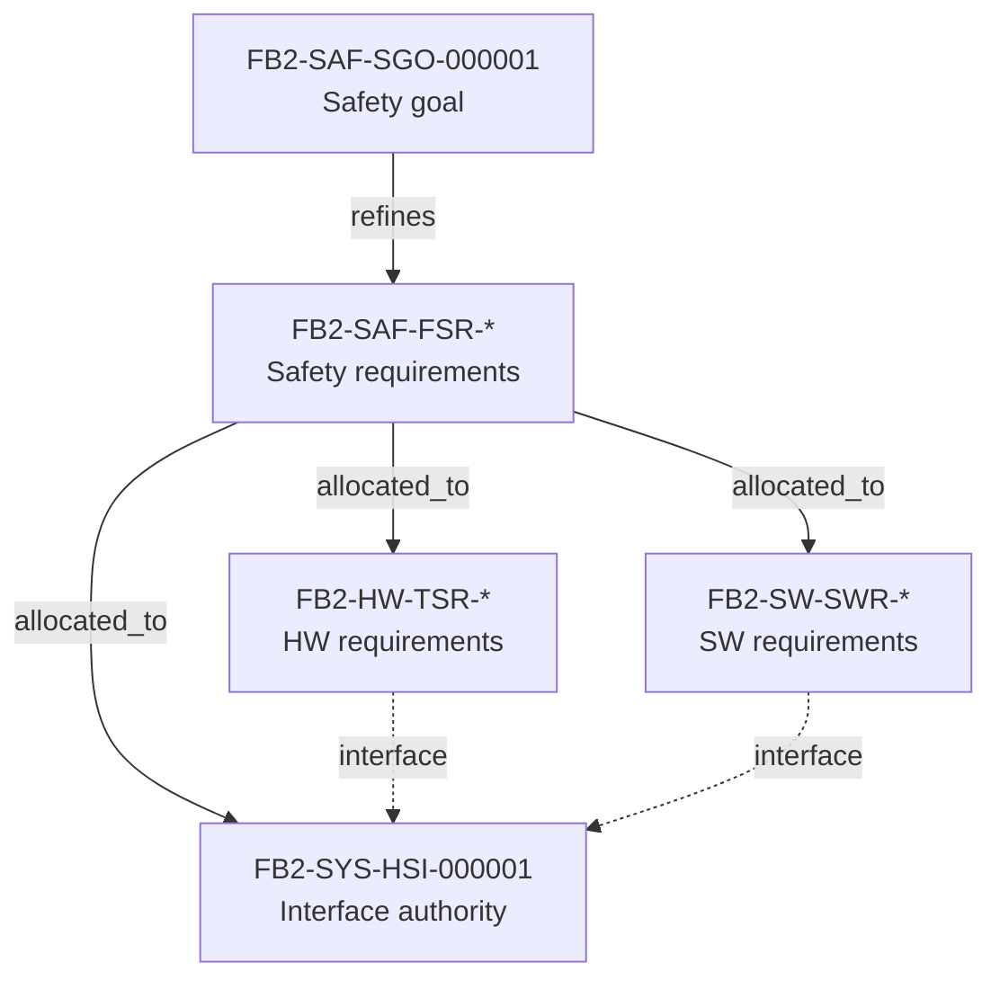

# System — requirements, interfaces and architecture (generated view)

Generated: 2026-10-01T05:09:29Z | Baseline: BAS-REF-001 | 263 artifacts, 489 links

## Provenance and status of this file

- **Derived, not authored.** Every table and section below is generated by
  `docs/artifacts/tools/corpus.py cmd_render` from the canonical JSON records. This file contains no
  hand-written engineering content and is not an independent source of truth.
- **Regenerable.** Re-run `python3 docs/artifacts/tools/corpus.py render` to
  reproduce it. Edit the canonical record, never this file.
- **Scope of this view:** The `system` domain: system requirements, the system-owned HSI/interface authority, and the system architecture chain.
- **Guard fields.** Every record shown below is printed with its own
  `profile`, `origin`, `human_approval_status` and `production_authorized`
  values. Across the whole corpus `human_approval_status` is `pending` and
  `production_authorized` is `false`; `product_verification_credit` is `false`.
  This view does not and cannot change that.
- **Not a conformity claim.** This corpus is synthetic. Nothing here asserts
  ISO 26262 conformity, an ASIL capability level, an Automotive SPICE
  assessment, human review, or human approval.
- **Diagram validation.** Mermaid blocks are checked by
  `mermaid-cli` when it is available on the rendering host; the per-view
  *Diagram validation* section states plainly whether that check ran. An
  unvalidated diagram is never described as validated.

## System requirements

| Id | Profile | Title | Guard |
|---|---|---|---|
| `FB2-SYS-SYR-000001` | synthetic_reference | SYR: every monitored cell voltage shall be acquired, validated and published with its age | profile=`synthetic_reference` \| origin=`synthetic` \| human_approval_status=`pending` \| production_authorized=`false` |
| `FB2-SYS-SYR-000002` | synthetic_reference | SYR: the item shall enforce the configured safe operating area, and shall distinguish a recoverable measurement degrada… | profile=`synthetic_reference` \| origin=`synthetic` \| human_approval_status=`pending` \| production_authorized=`false` |
| `FB2-SYS-SYR-000003` | synthetic_reference | SYR: the item shall reach and confirm the safe state within the fault-tolerant time interval, and shall latch the condi… | profile=`synthetic_reference` \| origin=`synthetic` \| human_approval_status=`pending` \| production_authorized=`false` |
| `FB2-SYS-SYR-000004` | synthetic_reference | SYR: the fault reaction shall be selected by mode, and a degraded condition shall never be reacted to as if it were a s… | profile=`synthetic_reference` \| origin=`synthetic` \| human_approval_status=`pending` \| production_authorized=`false` |
| `FB2-SYS-SYR-000005` | synthetic_reference | SYR: the item shall include a hardware voltage monitor that can detect an overvoltage and open the contactors without t… | profile=`synthetic_reference` \| origin=`synthetic` \| human_approval_status=`pending` \| production_authorized=`false` |
| `FB2-SYS-SYR-000006` | synthetic_reference | SYR: pack current and cell temperature shall be acquired, plausibility-checked and supplied to the item's supervisory f… | profile=`synthetic_reference` \| origin=`synthetic` \| human_approval_status=`pending` \| production_authorized=`false` |
| `FB2-SYS-SYR-000007` | synthetic_reference | SYR: the item shall publish its state and shall not accept a request that contradicts its own safety evaluation | profile=`synthetic_reference` \| origin=`synthetic` \| human_approval_status=`pending` \| production_authorized=`false` |
| `FB2-SYS-SYR-000008` | synthetic_reference | SYR: commissioning and service shall not permit the item to energise on unconnected or untrusted inputs | profile=`synthetic_reference` \| origin=`synthetic` \| human_approval_status=`pending` \| production_authorized=`false` |

## HSI / interface authority

### FB2-SYS-HSI-000001 — HSI: Cell Voltage Interface Authority

- guard: profile=`synthetic_reference` \| origin=`synthetic` \| human_approval_status=`pending` \| production_authorized=`false`
- design_level: `interface_specification` | lifecycle: `baselined`
- variant applicability: VAR-REF-001; VAR-AFE-LTC-6813; VAR-AFE-LTC-6806; VAR-AFE-ADI-1830; VAR-AFE-MAXIM-17841B; VAR-AFE-NXP-MC33775A

Signals (system-owned authority; hardware and software views link here rather than duplicating these definitions):

| Interface | Signal | Type | Unit | Range | Direction | Invalid/stale state | Owner |
|---|---|---|---|---|---|---|---|
| `HSI_AFE_SPI` | `SPI_CLK` | clock | MHz | 0.5-1.0 | MCU->AFE | stuck high/low | hw_engineer |
| `HSI_AFE_SPI` | `SPI_MOSI` | data | bits | 0/1 | MCU->AFE | stuck | hw_engineer |
| `HSI_AFE_SPI` | `SPI_MISO` | data | bits | 0/1 | AFE->MCU | stuck | hw_engineer |
| `HSI_AFE_SPI` | `SPI_CS[n]` | control | active_low | 0/1 | MCU->AFE | stuck low | hw_engineer |
| `HSI_AFE_DATABASE` | `cell_voltage[mV]` | uint16_t[] | mV | 0-5000 | AFE_DRV->DB | stale (>100ms) | sw_engineer |
| `HSI_AFE_DATABASE` | `cell_temperature[0.1°C]` | int16_t[] | 0.1°C | -400-1500 | AFE_DRV->DB | stale (>100ms) | sw_engineer |
| `HSI_AFE_DATABASE` | `balancing_status` | bool[] | bool | 0/1 | AFE_DRV->DB | stale | sw_engineer |
| `HSI_AFE_DATABASE` | `communication_error_count` | uint16_t | count | 0-65535 | AFE_DRV->DB | overflow | sw_engineer |

- timing_budget: acquisition_trigger_to_spi_start_us=100, database_publish_us=3000, pec_validation_us=20, spi_transaction_us=500, total_acquisition_to_db_ms=25
- fault_indications: {'signal': 'cell_voltage', 'fault': 'stale_data', 'condition': 'age > 100ms', 'reaction': 'DIAG fault, use last valid'}; {'signal': 'cell_voltage', 'fault': 'pec_error', 'condition': 'CRC mismatch', 'reaction': 'Retry 3x, then DIAG fault'}; {'signal': 'cell_voltage', 'fault': 'out_of_range', 'condition': 'value < 0 or > 5000mV', 'reaction': 'DIAG fault, plausibility'}; {'signal': 'SPI_CS', 'fault': 'stuck_low', 'condition': 'CS low > 10ms', 'reaction': 'DIAG fault, SPI bus recovery'}
- electrical_budgets: cs_setup_ns=100, dma_buffer_bytes=256, iso_spi_transformer_isolation_vrms=2500, spi_clock_max_mhz=1.0, spi_hold_ns=50, spi_setup_ns=50
- decisions: {'decision_id': 'DEC-HSI-001', 'alternatives': ['Polling vs Interrupt-driven'], 'selected': 'DMA + callback', 'rationale': 'Minimizes CPU load, deterministic timing'}; {'decision_id': 'DEC-HSI-002', 'alternatives': ['Single database signal per cell', 'Packed array'], 'selected': 'Packed array (uint16_t[])', 'rationale': 'Memory efficiency, atomic update'}
## System architecture chain

| Link | Source | Relation | Target | Provenance | Review state |
|---|---|---|---|---|---|
| `FB2-LNK-CHG-000006` | `FB2-MAN-CHG-000002` | changes | `FB2-SYS-HSI-000001` | synthetic | pending |
| `FB2-LNK-CPT-000019` | `FB2-SAF-ITE-000001` | supports | `FB2-SYS-UC-000001` | derived | reviewed |
| `FB2-LNK-CPT-000020` | `FB2-SAF-ITE-000001` | supports | `FB2-SYS-UC-000002` | derived | reviewed |
| `FB2-LNK-CPT-000021` | `FB2-SAF-ITE-000001` | supports | `FB2-SYS-UC-000003` | derived | reviewed |
| `FB2-LNK-CPT-000022` | `FB2-SAF-ITE-000001` | supports | `FB2-SYS-UC-000004` | derived | reviewed |
| `FB2-LNK-ELC-000023` | `FB2-SYS-NED-000001` | refines | `FB2-SAF-ITE-000001` | derived | reviewed |
| `FB2-LNK-ELC-000024` | `FB2-SYS-NED-000002` | refines | `FB2-SAF-ITE-000001` | derived | reviewed |
| `FB2-LNK-ELC-000025` | `FB2-SYS-NED-000003` | refines | `FB2-SAF-ITE-000001` | derived | reviewed |
| `FB2-LNK-ELC-000026` | `FB2-SYS-NED-000004` | refines | `FB2-SAF-ITE-000001` | derived | reviewed |
| `FB2-LNK-ELC-000027` | `FB2-SYS-NED-000005` | refines | `FB2-SAF-ITE-000001` | derived | reviewed |
| `FB2-LNK-ELC-000028` | `FB2-SYS-SYR-000001` | refines | `FB2-SYS-NED-000001` | derived | reviewed |
| `FB2-LNK-ELC-000029` | `FB2-SYS-SYR-000001` | refines | `FB2-SYS-NED-000004` | derived | reviewed |
| `FB2-LNK-ELC-000030` | `FB2-SYS-SYR-000001` | refines | `FB2-SAF-SGO-000001` | derived | reviewed |
| `FB2-LNK-ELC-000031` | `FB2-SYS-SYR-000002` | refines | `FB2-SYS-NED-000001` | derived | reviewed |
| `FB2-LNK-ELC-000032` | `FB2-SYS-SYR-000002` | refines | `FB2-SYS-NED-000002` | derived | reviewed |
| `FB2-LNK-ELC-000033` | `FB2-SYS-SYR-000002` | refines | `FB2-SAF-SGO-000001` | derived | reviewed |
| `FB2-LNK-ELC-000034` | `FB2-SYS-SYR-000003` | refines | `FB2-SYS-NED-000003` | derived | reviewed |
| `FB2-LNK-ELC-000035` | `FB2-SYS-SYR-000003` | refines | `FB2-SAF-SGO-000001` | derived | reviewed |
| `FB2-LNK-ELC-000036` | `FB2-SYS-SYR-000004` | refines | `FB2-SYS-NED-000002` | derived | reviewed |
| `FB2-LNK-ELC-000037` | `FB2-SYS-SYR-000004` | refines | `FB2-SYS-NED-000003` | derived | reviewed |
| `FB2-LNK-ELC-000038` | `FB2-SYS-SYR-000004` | refines | `FB2-SAF-SGO-000001` | derived | reviewed |
| `FB2-LNK-ELC-000039` | `FB2-SYS-SYR-000005` | refines | `FB2-SAF-SGO-000001` | derived | reviewed |
| `FB2-LNK-ELC-000040` | `FB2-SYS-SYR-000006` | refines | `FB2-SYS-NED-000004` | derived | reviewed |
| `FB2-LNK-ELC-000041` | `FB2-SYS-SYR-000007` | refines | `FB2-SYS-NED-000004` | derived | reviewed |
| `FB2-LNK-ELC-000042` | `FB2-SYS-SYR-000008` | refines | `FB2-SYS-NED-000005` | derived | reviewed |
| `FB2-LNK-ELC-000043` | `FB2-HW-TSR-000001` | allocated_to | `FB2-SYS-SYR-000001` | derived | reviewed |
| `FB2-LNK-ELC-000044` | `FB2-SW-SWR-000001` | allocated_to | `FB2-SYS-SYR-000001` | derived | reviewed |
| `FB2-LNK-ELC-000045` | `FB2-SW-SWR-000002` | allocated_to | `FB2-SYS-SYR-000002` | derived | reviewed |
| `FB2-LNK-ELC-000046` | `FB2-SW-SWR-000001` | allocated_to | `FB2-SYS-SYR-000002` | derived | reviewed |
| `FB2-LNK-ELC-000047` | `FB2-HW-TSR-000001` | allocated_to | `FB2-SYS-SYR-000002` | derived | reviewed |
| `FB2-LNK-ELC-000048` | `FB2-SW-SWR-000003` | allocated_to | `FB2-SYS-SYR-000003` | derived | reviewed |
| `FB2-LNK-ELC-000049` | `FB2-HW-TSR-000003` | allocated_to | `FB2-SYS-SYR-000003` | derived | reviewed |
| `FB2-LNK-ELC-000050` | `FB2-HW-TSR-000004` | allocated_to | `FB2-SYS-SYR-000003` | derived | reviewed |
| `FB2-LNK-ELC-000051` | `FB2-SW-SWR-000003` | allocated_to | `FB2-SYS-SYR-000004` | derived | reviewed |
| `FB2-LNK-ELC-000052` | `FB2-HW-TSR-000003` | allocated_to | `FB2-SYS-SYR-000004` | derived | reviewed |
| `FB2-LNK-ELC-000053` | `FB2-HW-TSR-000004` | allocated_to | `FB2-SYS-SYR-000005` | derived | reviewed |
| `FB2-LNK-ELC-000054` | `FB2-SW-SWR-000001` | allocated_to | `FB2-SYS-SYR-000006` | derived | reviewed |
| `FB2-LNK-ELC-000055` | `FB2-HW-TSR-000002` | allocated_to | `FB2-SYS-SYR-000006` | derived | reviewed |
| `FB2-LNK-ELC-000056` | `FB2-SW-SWR-000001` | allocated_to | `FB2-SYS-SYR-000007` | derived | reviewed |
| `FB2-LNK-ELC-000057` | `FB2-HW-TSR-000002` | allocated_to | `FB2-SYS-SYR-000007` | derived | reviewed |
| `FB2-LNK-ELC-000058` | `FB2-SW-SWR-000003` | allocated_to | `FB2-SYS-SYR-000008` | derived | reviewed |
| `FB2-LNK-ELC-000059` | `FB2-SAF-SEC-000001` | allocated_to | `FB2-SYS-SYR-000008` | derived | reviewed |
| `FB2-LNK-ELC-000060` | `FB2-SAF-SEC-000004` | allocated_to | `FB2-SYS-SYR-000008` | derived | reviewed |
| `FB2-LNK-ELC-000061` | `FB2-SYS-SYR-000002` | refines | `FB2-SYS-UC-000001` | derived | reviewed |
| `FB2-LNK-ELC-000062` | `FB2-SYS-SYR-000003` | refines | `FB2-SYS-UC-000002` | derived | reviewed |
| `FB2-LNK-ELC-000063` | `FB2-SYS-SYR-000004` | refines | `FB2-SYS-UC-000003` | derived | reviewed |
| `FB2-LNK-ELC-000064` | `FB2-SYS-SYR-000008` | refines | `FB2-SYS-UC-000004` | derived | reviewed |
| `FB2-LNK-FND-000114` | `FB2-REV-FND-000027` | supports | `FB2-SYS-SYR-000005` | derived | reviewed |
| `FB2-LNK-IMP-000107` | `FB2-SW-IMP-000004` | implements | `FB2-SYS-SYR-000007` | synthetic | pending |
| `FB2-LNK-LIF-000099` | `FB2-REL-RLS-000001` | depends_on | `FB2-SYS-SYR-000003` | derived | reviewed |
| `FB2-LNK-LIF-000100` | `FB2-PRD-EOL-000001` | depends_on | `FB2-SYS-SYR-000003` | derived | reviewed |
| `FB2-LNK-LIF-000101` | `FB2-PRD-CAL-000001` | depends_on | `FB2-SYS-SYR-000002` | derived | reviewed |
| `FB2-LNK-LIF-000102` | `FB2-PRD-CAL-000001` | depends_on | `FB2-SYS-SYR-000006` | derived | reviewed |
| `FB2-LNK-LIF-000103` | `FB2-SVC-SVC-000001` | depends_on | `FB2-SYS-SYR-000008` | derived | reviewed |
| `FB2-LNK-LIF-000104` | `FB2-OPS-MON-000001` | depends_on | `FB2-SYS-SYR-000003` | derived | reviewed |
| `FB2-LNK-LIF-000105` | `FB2-MAN-PLN-000001` | depends_on | `FB2-SYS-SYR-000001` | derived | reviewed |
| `FB2-LNK-REVB-000072` | `FB2-REV-000008` | reviewed_by | `FB2-SYS-HSI-000001` | derived | reviewed |
| `FB2-LNK-REVB-000127` | `FB2-REV-000013` | reviewed_by | `FB2-SYS-NED-000001` | derived | reviewed |
| `FB2-LNK-REVB-000128` | `FB2-REV-000013` | reviewed_by | `FB2-SYS-NED-000002` | derived | reviewed |
| `FB2-LNK-REVB-000129` | `FB2-REV-000013` | reviewed_by | `FB2-SYS-NED-000003` | derived | reviewed |
| `FB2-LNK-REVB-000130` | `FB2-REV-000013` | reviewed_by | `FB2-SYS-NED-000004` | derived | reviewed |
| `FB2-LNK-REVB-000131` | `FB2-REV-000013` | reviewed_by | `FB2-SYS-NED-000005` | derived | reviewed |
| `FB2-LNK-REVB-000132` | `FB2-REV-000013` | reviewed_by | `FB2-SYS-UC-000001` | derived | reviewed |
| `FB2-LNK-REVB-000133` | `FB2-REV-000013` | reviewed_by | `FB2-SYS-UC-000002` | derived | reviewed |
| `FB2-LNK-REVB-000134` | `FB2-REV-000013` | reviewed_by | `FB2-SYS-UC-000003` | derived | reviewed |
| `FB2-LNK-REVB-000135` | `FB2-REV-000013` | reviewed_by | `FB2-SYS-UC-000004` | derived | reviewed |
| `FB2-LNK-REVB-000153` | `FB2-REV-000013` | reviewed_by | `FB2-SYS-SYR-000001` | derived | reviewed |
| `FB2-LNK-REVB-000154` | `FB2-REV-000013` | reviewed_by | `FB2-SYS-SYR-000002` | derived | reviewed |
| `FB2-LNK-REVB-000155` | `FB2-REV-000013` | reviewed_by | `FB2-SYS-SYR-000003` | derived | reviewed |
| `FB2-LNK-REVB-000156` | `FB2-REV-000013` | reviewed_by | `FB2-SYS-SYR-000004` | derived | reviewed |
| `FB2-LNK-REVB-000157` | `FB2-REV-000013` | reviewed_by | `FB2-SYS-SYR-000005` | derived | reviewed |
| `FB2-LNK-REVB-000158` | `FB2-REV-000013` | reviewed_by | `FB2-SYS-SYR-000006` | derived | reviewed |
| `FB2-LNK-REVB-000159` | `FB2-REV-000013` | reviewed_by | `FB2-SYS-SYR-000007` | derived | reviewed |
| `FB2-LNK-REVB-000160` | `FB2-REV-000013` | reviewed_by | `FB2-SYS-SYR-000008` | derived | reviewed |
| `FB2-LNK-SEC-000076` | `FB2-VER-TMS-000016` | verifies | `FB2-SYS-SYR-000007` | derived | reviewed |
| `FB2-LNK-SEC-000077` | `FB2-VER-TMS-000016` | verifies | `FB2-SYS-SYR-000008` | derived | reviewed |
| `FB2-LNK-SEC-000079` | `FB2-VER-TMS-000017` | verifies | `FB2-SYS-SYR-000007` | derived | reviewed |
| `FB2-LNK-SEC-000080` | `FB2-VER-TMS-000017` | verifies | `FB2-SYS-SYR-000008` | derived | reviewed |
| `FB2-LNK-SEC-000082` | `FB2-VER-TMS-000018` | verifies | `FB2-SYS-SYR-000007` | derived | reviewed |
| `FB2-LNK-SEC-000083` | `FB2-VER-TMS-000018` | verifies | `FB2-SYS-SYR-000008` | derived | reviewed |
| `FB2-LNK-SEC-000085` | `FB2-VER-TMS-000019` | verifies | `FB2-SYS-SYR-000007` | derived | reviewed |
| `FB2-LNK-SEC-000086` | `FB2-VER-TMS-000019` | verifies | `FB2-SYS-SYR-000008` | derived | reviewed |
| `FB2-LNK-SEC-000088` | `FB2-VER-TMS-000020` | verifies | `FB2-SYS-SYR-000007` | derived | reviewed |
| `FB2-LNK-SEC-000089` | `FB2-VER-TMS-000020` | verifies | `FB2-SYS-SYR-000008` | derived | reviewed |
| `FB2-LNK-SYR-000121` | `FB2-VER-TMS-000021` | verifies | `FB2-SYS-SYR-000001` | synthetic | pending |
| `FB2-LNK-SYR-000122` | `FB2-VER-TMS-000022` | verifies | `FB2-SYS-SYR-000001` | synthetic | pending |
| `FB2-LNK-SYR-000123` | `FB2-VER-TMS-000023` | verifies | `FB2-SYS-SYR-000002` | synthetic | pending |
| `FB2-LNK-SYR-000124` | `FB2-VER-TMS-000024` | verifies | `FB2-SYS-SYR-000002` | synthetic | pending |
| `FB2-LNK-SYR-000125` | `FB2-VER-TMS-000025` | verifies | `FB2-SYS-SYR-000003` | synthetic | pending |
| `FB2-LNK-SYR-000126` | `FB2-VER-TMS-000026` | verifies | `FB2-SYS-SYR-000004` | synthetic | pending |
| `FB2-LNK-SYR-000127` | `FB2-VER-TMS-000027` | verifies | `FB2-SYS-SYR-000005` | synthetic | pending |
| `FB2-LNK-SYR-000128` | `FB2-VER-TMS-000028` | verifies | `FB2-SYS-SYR-000006` | synthetic | pending |
| `FB2-LNK-VAL-000065` | `FB2-VER-TMS-000012` | validates | `FB2-SYS-NED-000001` | derived | reviewed |
| `FB2-LNK-VAL-000066` | `FB2-VER-TMS-000012` | validates | `FB2-SYS-UC-000001` | derived | reviewed |
| `FB2-LNK-VAL-000067` | `FB2-VER-TMS-000013` | validates | `FB2-SYS-NED-000003` | derived | reviewed |
| `FB2-LNK-VAL-000068` | `FB2-VER-TMS-000013` | validates | `FB2-SYS-UC-000002` | derived | reviewed |
| `FB2-LNK-VAL-000069` | `FB2-VER-TMS-000014` | validates | `FB2-SYS-NED-000002` | derived | reviewed |
| `FB2-LNK-VAL-000070` | `FB2-VER-TMS-000014` | validates | `FB2-SYS-NED-000005` | derived | reviewed |
| `FB2-LNK-VAL-000071` | `FB2-VER-TMS-000014` | validates | `FB2-SYS-UC-000003` | derived | reviewed |
| `FB2-LNK-VAL-000072` | `FB2-VER-TMS-000015` | validates | `FB2-SYS-NED-000005` | derived | reviewed |
| `FB2-LNK-VAL-000073` | `FB2-VER-TMS-000015` | validates | `FB2-SYS-UC-000004` | derived | reviewed |

### Allocation diagram

## Diagram validation

Validator: mermaid-cli /opt/homebrew/bin/mmdc with Chrome; 9/9 diagrams parsed and rendered to SVG

| Diagram | Result |
|---|---|
| `system.allocation` | validated |

