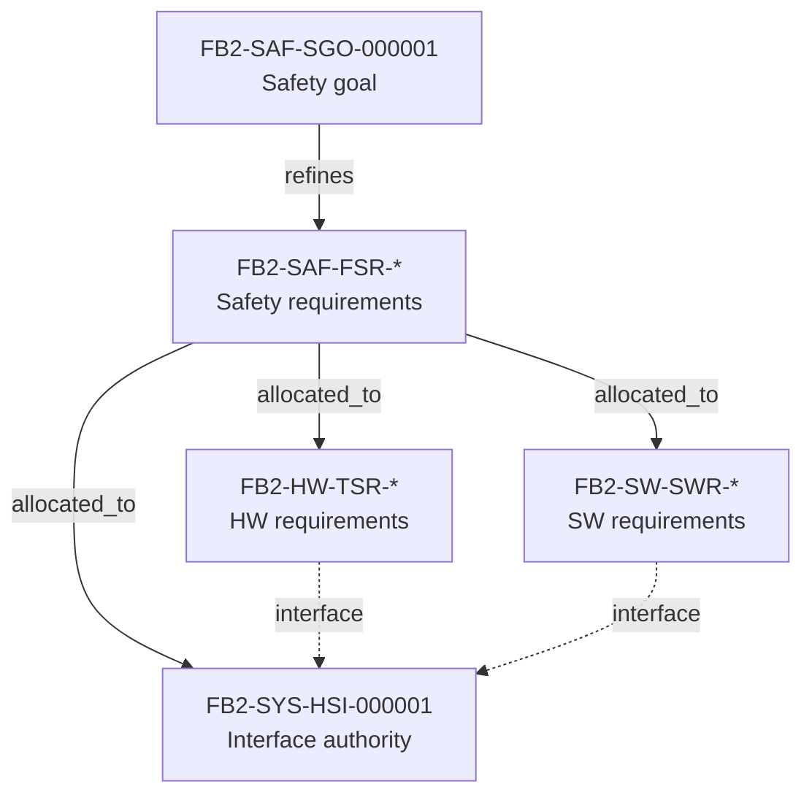

# System — requirements, interfaces and architecture (generated view)

Generated: 2026-09-29T10:09:01Z | Baseline: BAS-REF-001 | 153 artifacts, 283 links

## Provenance and status of this file

- **Derived, not authored.** Every table and section below is generated by
  `docs/artifacts/tools/corpus.py cmd_render` from the canonical JSON records. This file contains no
  hand-written engineering content and is not an independent source of truth.
- **Regenerable.** Re-run `python3 docs/artifacts/tools/corpus.py render` to
  reproduce it. Edit the canonical record, never this file.
- **Scope of this view:** The `system` domain: system requirements, the system-owned HSI/interface authority, and the system architecture chain.
- **Guard fields.** Every record shown below is printed with its own
  `profile`, `origin`, `human_approval_status` and `production_authorized`
  values. Across the whole corpus `human_approval_status` is `pending` and
  `production_authorized` is `false`; `product_verification_credit` is `false`.
  This view does not and cannot change that.
- **Not a conformity claim.** This corpus is synthetic. Nothing here asserts
  ISO 26262 conformity, an ASIL capability level, an Automotive SPICE
  assessment, human review, or human approval.
- **Diagram validation.** Mermaid blocks are checked by
  `mermaid-cli` when it is available on the rendering host; the per-view
  *Diagram validation* section states plainly whether that check ran. An
  unvalidated diagram is never described as validated.

## System requirements

### Coverage gap: system requirements

**No records in the corpus for this area - this is a coverage gap, not an omission from this view.**

The corpus contains **no system-level or stakeholder requirement record** in either profile, and this is a coverage gap, not a rendering omission: no record matching the expectation exists on disk in any profile. The expectation is retained in the coverage plan and is not satisfied. The plan's current position, read at render time, is that `SYS.1` (Requirements Elicitation) is recorded `gap`; `SYS.2` (System Requirements Analysis) is recorded `gap`; and `artifact_coverage_targets.requirements` is restated as an unmet target with status `partially_mapped`. This view reports what the corpus actually holds and quotes the plan as it stands now; where the plan has been corrected, the corrected status appears here automatically, so this text cannot drift from the governance file.

Adjacent material that does exist: the system-domain HSI design `FB2-SYS-HSI-000001`, the project-scope record `FB2-MAN-SCO-000001` (management domain), and the scenario `FB2-SCN-CHG-000002`.

## HSI / interface authority

### FB2-SYS-HSI-000001 — HSI: Cell Voltage Interface Authority

- guard: profile=`synthetic_reference` \| origin=`synthetic` \| human_approval_status=`pending` \| production_authorized=`false`
- design_level: `interface_specification` | lifecycle: `baselined`
- variant applicability: VAR-REF-001; VAR-AFE-LTC-6813; VAR-AFE-LTC-6806; VAR-AFE-ADI-1830; VAR-AFE-MAXIM-17841B; VAR-AFE-NXP-MC33775A

Signals (system-owned authority; hardware and software views link here rather than duplicating these definitions):

| Interface | Signal | Type | Unit | Range | Direction | Invalid/stale state | Owner |
|---|---|---|---|---|---|---|---|
| `HSI_AFE_SPI` | `SPI_CLK` | clock | MHz | 0.5-1.0 | MCU->AFE | stuck high/low | hw_engineer |
| `HSI_AFE_SPI` | `SPI_MOSI` | data | bits | 0/1 | MCU->AFE | stuck | hw_engineer |
| `HSI_AFE_SPI` | `SPI_MISO` | data | bits | 0/1 | AFE->MCU | stuck | hw_engineer |
| `HSI_AFE_SPI` | `SPI_CS[n]` | control | active_low | 0/1 | MCU->AFE | stuck low | hw_engineer |
| `HSI_AFE_DATABASE` | `cell_voltage[mV]` | uint16_t[] | mV | 0-5000 | AFE_DRV->DB | stale (>100ms) | sw_engineer |
| `HSI_AFE_DATABASE` | `cell_temperature[0.1°C]` | int16_t[] | 0.1°C | -400-1500 | AFE_DRV->DB | stale (>100ms) | sw_engineer |
| `HSI_AFE_DATABASE` | `balancing_status` | bool[] | bool | 0/1 | AFE_DRV->DB | stale | sw_engineer |
| `HSI_AFE_DATABASE` | `communication_error_count` | uint16_t | count | 0-65535 | AFE_DRV->DB | overflow | sw_engineer |

- timing_budget: acquisition_trigger_to_spi_start_us=100, database_publish_us=3000, pec_validation_us=20, spi_transaction_us=500, total_acquisition_to_db_ms=25
- fault_indications: {'signal': 'cell_voltage', 'fault': 'stale_data', 'condition': 'age > 100ms', 'reaction': 'DIAG fault, use last valid'}; {'signal': 'cell_voltage', 'fault': 'pec_error', 'condition': 'CRC mismatch', 'reaction': 'Retry 3x, then DIAG fault'}; {'signal': 'cell_voltage', 'fault': 'out_of_range', 'condition': 'value < 0 or > 5000mV', 'reaction': 'DIAG fault, plausibility'}; {'signal': 'SPI_CS', 'fault': 'stuck_low', 'condition': 'CS low > 10ms', 'reaction': 'DIAG fault, SPI bus recovery'}
- electrical_budgets: cs_setup_ns=100, dma_buffer_bytes=256, iso_spi_transformer_isolation_vrms=2500, spi_clock_max_mhz=1.0, spi_hold_ns=50, spi_setup_ns=50
- decisions: {'decision_id': 'DEC-HSI-001', 'alternatives': ['Polling vs Interrupt-driven'], 'selected': 'DMA + callback', 'rationale': 'Minimizes CPU load, deterministic timing'}; {'decision_id': 'DEC-HSI-002', 'alternatives': ['Single database signal per cell', 'Packed array'], 'selected': 'Packed array (uint16_t[])', 'rationale': 'Memory efficiency, atomic update'}
## System architecture chain

| Link | Source | Relation | Target | Provenance | Review state |
|---|---|---|---|---|---|
| `FB2-LNK-CHG-000006` | `FB2-MAN-CHG-000002` | changes | `FB2-SYS-HSI-000001` | synthetic | pending |
| `FB2-LNK-REVB-000072` | `FB2-REV-000008` | reviewed_by | `FB2-SYS-HSI-000001` | derived | reviewed |

### Allocation diagram

## Diagram validation

Validator: mermaid-cli /opt/homebrew/bin/mmdc with Chrome; 8/8 diagrams parsed and rendered to SVG

| Diagram | Result |
|---|---|
| `system.allocation` | validated |

