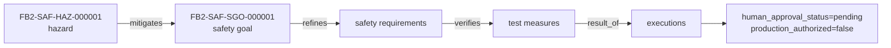

# Traceability — the corpus traceability document (generated)

Generated: 2026-10-05T13:19:46Z | Baseline: BAS-REF-001 | 323 artifacts, 599 links

## Provenance and status of this file

- **Derived, not authored.** Every table and section below is generated by
  `docs/artifacts/tools/corpus.py cmd_render` from the canonical JSON records. This file contains no
  hand-written engineering content and is not an independent source of truth.
- **Regenerable.** Re-run `python3 docs/artifacts/tools/corpus.py render` to
  reproduce it. Edit the canonical record, never this file.
- **Scope of this view:** The whole corpus in one derived document: artifact and link census, guard-field census, verification reachability, standards dispositions, the coverage dimensions recomputed live, and the measured negative-scenario result.
- **Guard fields.** Every record shown below is printed with its own
  `profile`, `origin`, `human_approval_status` and `production_authorized`
  values. Across the whole corpus `human_approval_status` is `pending` and
  `production_authorized` is `false`; `product_verification_credit` is `false`.
  This view does not and cannot change that.
- **Not a conformity claim.** This corpus is synthetic. Nothing here asserts
  ISO 26262 conformity, an ASIL capability level, an Automotive SPICE
  assessment, human review, or human approval.
- **Diagram validation.** Mermaid blocks are checked by
  `mermaid-cli` when it is available on the rendering host; the per-view
  *Diagram validation* section states plainly whether that check ran. An
  unvalidated diagram is never described as validated.

## What this document is

This is the traceability document for the foxBMS 2 lifecycle artifact corpus. It is a derived work product: a census of the records the corpus actually holds, of the links between them, and of what the corpus's own checkers measure about them. It is regenerated from the canonical JSON records by `docs/artifacts/tools/corpus.py cmd_render`, and the repository-root path `TRACEABILITY_DOCUMENT.md` is a pointer to this file rather than a second copy.

It reports three different populations and does not merge them:

- **323 artifacts, 599 links** — records and links in the tool's index, the population every count below is drawn from.
- Records that exist in both profiles appear once per profile. The same identifier in `as_is` and in `synthetic_reference` is two different records by design, and are counted separately.
- A coverage ratio is a ratio, not a score. Where the denominator is a target rather than a population, the table says so in its own column.

## Artifact census

Computed from the artifact index at render time.

| Artifact type | as_is | synthetic_reference | Total |
|---|---|---|---|
| `change` | 0 | 3 | 3 |
| `controlled_vocabulary` | 0 | 1 | 1 |
| `design` | 3 | 8 | 11 |
| `deviation` | 26 | 0 | 26 |
| `execution` | 16 | 28 | 44 |
| `finding` | 14 | 28 | 42 |
| `hardware_configuration_baseline` | 0 | 1 | 1 |
| `hardware_detailed_design_gap` | 0 | 1 | 1 |
| `hardware_variant_applicability` | 0 | 1 | 1 |
| `hardware_verification_plan` | 0 | 1 | 1 |
| `hazard` | 1 | 1 | 2 |
| `implementation` | 10 | 4 | 14 |
| `integration_plan` | 0 | 1 | 1 |
| `interpretation_guidelines` | 0 | 1 | 1 |
| `item_definition` | 0 | 1 | 1 |
| `measurement_plan` | 0 | 1 | 1 |
| `post_development_record` | 0 | 6 | 6 |
| `process_improvement` | 0 | 2 | 2 |
| `process_record` | 0 | 6 | 6 |
| `project_plan` | 0 | 1 | 1 |
| `qualification_test_plan` | 0 | 1 | 1 |
| `requirement` | 9 | 31 | 40 |
| `review` | 7 | 13 | 20 |
| `risk_register` | 0 | 1 | 1 |
| `safety_analysis` | 0 | 4 | 4 |
| `safety_case` | 0 | 1 | 1 |
| `safety_concept` | 0 | 2 | 2 |
| `safety_goal` | 1 | 1 | 2 |
| `scenario` | 0 | 23 | 23 |
| `software_interface_specification` | 0 | 16 | 16 |
| `stakeholder_need` | 0 | 5 | 5 |
| `tara` | 0 | 1 | 1 |
| `test_measure` | 5 | 28 | 33 |
| `unit_test_specification` | 1 | 1 | 2 |
| `use_case` | 0 | 4 | 4 |
| `verification_deficiency_register` | 0 | 1 | 1 |
| `verification_summary` | 0 | 1 | 1 |
| **Total** | 93 | 230 | 323 |

323 records carry an `id` and are therefore countable. Registry container files (parameter and assumption registries) carry no top-level `id` and are counted separately below; they are not lifecycle artifacts.

### Non-record registries

| Registry | Canonical file | Entries |
|---|---|---|
| source anchors | `sources/source-registry.json` | 130 |
| assumption registry | `shared/assumption-registry.json` | 12 |
| parameter registry | `shared/parameter-registry.json` | 10 |

## Guard-field census

Counted from the index. This is the population-wide position of the four guard fields, not a claim about any one record.

| `human_approval_status` | `production_authorized` | `product_verification_credit` | Records |
|---|---|---|---|
| pending | false | false | 323 |

No record in this corpus carries a human approval: 0 records are in any state other than `pending`. No record is authorized for production: 0 records are in any state other than `false`. Automated review performed by this toolchain is not organizational independence and is not a human confirmation. Nothing in this document can change those two numbers.

### ASIL field values — hypothetical only

2 records carry an `asil` field and 2 of them carry an `asil_justification` block. `ASIL` in this corpus is a field value on a synthetic record in a fictional reference project, used to exercise how allocation is expressed. It is **not** an ASIL assigned to any real product, it is **not** a determination of any kind, and no HARA has been performed for any real product. This document states no capability level and asserts none.

## Link registry census

Computed from the canonical link registries at render time.

| Relation type | as_is | synthetic_reference | Total |
|---|---|---|---|
| `allocated_to` | 9 | 37 | 46 |
| `changes` | 0 | 16 | 16 |
| `consumes` | 3 | 0 | 3 |
| `depends_on` | 1 | 31 | 32 |
| `implements` | 6 | 10 | 16 |
| `mitigates` | 1 | 2 | 3 |
| `refines` | 9 | 42 | 51 |
| `result_of` | 5 | 28 | 33 |
| `reviewed_by` | 92 | 183 | 275 |
| `specified_by` | 0 | 15 | 15 |
| `supports` | 0 | 30 | 30 |
| `validates` | 0 | 15 | 15 |
| `verifies` | 12 | 52 | 64 |
| **Total** | 138 | 461 | 599 |

Link metadata completeness, counted over the same links:

| Link field | Links carrying it | Links total | Share |
|---|---|---|---|
| `rationale` | 599 | 599 | 100% |
| `provenance` | 599 | 599 | 100% |
| `review_state` | 599 | 599 | 100% |
| `change_suspect_status` | 599 | 599 | 100% |

374 links are marked change-suspect and 133 links are not in `review_state: reviewed`. Neither number is a defect count: both are the state the registries record.

## Verification reachability

Built from `verifies` and `validates` links in the canonical registries, counted per profile. A requirement with no verification link is a gap and is named, not hidden.

| Profile | Requirements | With a verification link | Without one | Ids without one |
|---|---|---|---|---|
| as_is | 9 | 9 | 0 | — |
| synthetic_reference | 31 | 28 | 3 | `FB2-SW-SIR-000001`; `FB2-SW-SIR-000005`; `FB2-SW-SIR-000006` |

## Standards dispositions

Read from `governance/coverage-plan.json` and `governance/standards-lock.json` at render time. These are the corpus's own recorded dispositions against the two standards it has locked. A recorded disposition is a statement about work booked in this corpus; it is not a statement that the work satisfies the standard, and this corpus is not assessed against any standard by anyone.

| ASPICE process disposition | Processes |
|---|---|
| `gap` | 1 |
| `mapped` | 4 |
| `not_applicable` | 4 |
| `partially_mapped` | 23 |
| **Total** | 32 |

`SYS.1` (Requirements Elicitation) is recorded `partially_mapped`; `SYS.2` (System Requirements Analysis) is recorded `partially_mapped`; and `SUP.9` (Problem Resolution Management) is recorded `partially_mapped`.

| ISO 26262 part disposition | Parts |
|---|---|
| `mapped` | 2 |
| `not_applicable` | 2 |
| `partially_mapped` | 8 |
| **Total** | 12 |

| Locked standard | Title | Edition | Locked by |
|---|---|---|---|
| `ISO_26262_2018` | ISO 26262:2018 - Road vehicles - Functional safety | 2018 | safety |
| `ASPICE_PAM_41` | Automotive SPICE Process Assessment Model (PAM) v4.1 | 4.1 | safety |

A standard that is not in the lock has no records mapped to it in this corpus and cannot have any disposition shown above. Its absence is a fact about the corpus, not about the standard.

## Coverage dimensions

Recomputed by the same function `corpus.py coverage` prints, at render time. Nothing here is copied out of a report. The last column states what each numerator actually counts, because a dimension whose name implies a measurement and whose numerator is a presence check or a constant would otherwise read as stronger than it is. Such dimensions are marked **presence** or **constant**; the rest are measured from the records on this run.

| Dimension | Value | Numerator basis | What it counts |
|---|---|---|---|
| `scope_accounting` | 1/1 | **presence** | source/feature/variant inventories present — 1 if the source inventory file carries a claimed file count; it does not compare that claim against the tree, which acceptance gate [2/8] inventory does |
| `artifact_population` | 13/13 | **measured** | families populated: ['change', 'design', 'deviation', 'execution', 'hazard', 'requirement', 'review', 'safety_analysis', 'safety_case', 'safety_goal'… — artifact families that hold at least one record |
| `standards_mapping` | 38/38 | **measured** | 38/38 standards entries are backed by an artefact that exists in the index. ASPICE: 28/28 applicable processes backed, 4 declared not_applicable; ISO… — ASPICE processes and ISO 26262 parts whose coverage-plan text names at least one FB2- id that RESOLVES against the artifact index or the source registry. It is a measure of entries that are BACKED BY AN ARTEFACT THAT EXISTS, not a count of plan entries and not a count of satisfied mappings; entries declaring not_applicable are out of the denominator and named in the detail, and entries that claim a disposition while naming nothing that exists are counted as unbacked. Read the disposition tally in the detail for the ASPICE/ISO split |
| `source_grounding` | 131/323 | **measured** | artifacts with source_refs (130 anchors available) — records carrying at least one `source_refs` entry |
| `traceability_integrity` | 599/599 | **measured** | 599 links, 0 dangling (link validation re-run for this figure) — links that are not dangling, from a link validation re-run for this figure |
| `semantic_consistency_checks` | 24/24 | **measured** | 24 of 24 declared semantic rules evaluated on this run; 24 of them are declared, 0 are executed but undeclared, 0 are declared but did not execute. M… — semantic rules _validate_semantic_rules actually EVALUATED this run, counted by the recorder each rule block fills in on entry, over the rules SEMANTIC_RULE_IDS declares. Computed, not declared: the previous figure was the literal 10/10 against a function that evaluates 21 rules |
| `automated_review_coverage` | 182/284 | **measured** | 182/284 artifacts covered by 20 review records; reviewed_by links consistent with reviewed_ids — unique indexed ids covered by a review record or a `reviewed_by` link; the two sources are unioned, and whether they AGREE is reported separately because the ratio does not move when one is deleted |
| `verification_planning` | 33/7 | **measured** | 33 test measures for 7 FSRs. THE RATIO IS NOT A COVERAGE RATIO: the numerator counts records whose id carries -TMS- and the denominator counts record… — records whose id carries -TMS- over records whose id carries -FSR-. NOT a coverage ratio: the two are disjoint populations, so the figure does not mean measures per requirement and over-100% is not over-coverage. The detail names what each number counts and reports the measured requirements-with-a-linked-measure and measures-verifying-a-requirement beside them |
| `actual_product_evidence` | 0/33 | **measured** | 0 target-hardware executions: execution_kind can now express a run on the product's own hardware, but none has been performed (blocked, not fabricate… — test measures backed by an execution whose `execution_kind` names the product's own hardware |
| `synthetic_fixture_coverage` | 12/13 | **measured** | 12/13 artefact families hold at least one synthetic_reference record; 230 synthetic_reference records in total (a count, not the numerator). families… — artefact families holding at least one `synthetic_reference` record, over the families the corpus defines; the record count is reported in the detail as a count. Not a ratio against a typed-in target |
| `negative_scenario_validation` | 20/20 | **measured** | 20/20 mutations passed (executed and detected by their own declared rule); 3/3 change lifecycles — mutation scenarios that PASS when executed: the rule each declares is implemented, is silent on the unmutated corpus, and produces a finding the baseline did not contain |
| `final_status` | `synthetic_ready_with_limitations` | — | recorded status |
| `export_reproducibility` | 1/1 | **measured** | 3 exported file(s) hashed identically across two independent exports into separate temporary directories; measured here, not read from docs/artifacts… — 1 if exporting the corpus into two separate temporary directories yields identical content hashes for every declared file; measured in this dimension rather than read from exports/manifest.json, which the acceptance suite creates moments before this runs |
| `human_approval` | 0/323 | **measured** | 0 of 323 records carry a properly evidenced human approval -- the numerator is 0 because NOTHING HAS BEEN APPROVED: 323 of 323 records carry human_ap… — records whose human_approval_status carries a human decision AND whose approval_evidence.human_approval carries all six required elements (named individual, declared role, independence evidence against owner_role and the current-revision author, ISO-8601 date, a review-packet digest chain resolved against a packet on disk whose own recorded record digest matches, and a revision_history entry citing it), over every record. Was the literal {"numerator": 0}, which read 0/321 before any signature existed and would have read 0/321 after three hundred. Computed by the same predicate the `human_approval_rejected` rule enforces, so the figure cannot exceed what the gate permits |
| `production_authorization` | 0/323 | **measured** | 0 of 323 records carry a properly evidenced production authorization -- the numerator is 0 because NOTHING HAS BEEN APPROVED: 323 of 323 records carr… — the same computation over production_authorized, with the bar STRICTLY HIGHER: the approving role must be one this corpus grants production authority to and the record's family must be one human approval is required for. Was the literal {"numerator": 0}. Enforced by the `production_authorized_rejected` rule and by acceptance gate [7/8] |

## Negative-scenario validation

Measured by executing the suite on this run: 20/20 mutation scenarios passed and 3/3 change lifecycles are structurally complete. A mutation scenario counts as passing only when the rule it declares detects the defect the mutation injects.

| Scenario | Declared detector | Detector state | Result | Why |
|---|---|---|---|---|
| `SCN-MUT-001` | `traceability_checker` | implemented | PASS | high/traceability on FB2-SAF-FSR-000001: FSR has no parent safety goal (missing refines link) |
| `SCN-MUT-002` | `link_forbidden_relation_type` | implemented | PASS | high/traceability on FB2-LNK-SAF-000014: relation_type 'related_to' forbidden (not in allowed set) |
| `SCN-MUT-003` | `revision_consistency_checker` | implemented | PASS | medium/consistency on FB2-SAF-FSR-000001: revision 99 not found in revision_history |
| `SCN-MUT-004` | `parameter_unit_consistency` | implemented | PASS | medium/consistency on FB2-PRM-000001: parameter FB2-PRM-000001 unit is V but value 4.2 suggests mV (missing scaling) |
| `SCN-MUT-005` | `hsi_interface_consistency` | implemented | PASS | high/traceability on FB2-SYS-HSI-000001: HSI/HW interface mismatch for signal SPI_CLK (polarity): HSI=CPOL=1, CPHA=1, H… |
| `SCN-MUT-006` | `ftti_budget_consistency_checker` | implemented | PASS | high/consistency on FB2-SAF-SGO-000001: timing budget 330ms exceeds FTTI 100ms (interval resolved from fault_tolerant_t… |
| `SCN-MUT-007` | `parameter_threshold_order` | implemented | PASS | high/consistency on FB2-PRM-000001: parameter FB2-PRM-000001 threshold order violated: warning=4300, derating=4200, shu… |
| `SCN-MUT-008` | `safety_requirement_completeness_checker` | implemented | PASS | medium/verification on FB2-SAF-FSR-000002: safety requirement FB2-SAF-FSR-000002 has no fault_reaction defined |
| `SCN-MUT-009` | `asil_assignment_validator` | implemented | PASS | high/verification on FB2-SAF-SGO-000001: safety goal FB2-SAF-SGO-000001 is assigned ASIL ASIL_B but its own justificati… |
| `SCN-MUT-010` | `diagnostic_coverage_claim_validator` | implemented | PASS | high/verification on FB2-SAF-FSR-000003: safety requirement FB2-SAF-FSR-000003 claims diagnostic coverage '99%' without… |
| `SCN-MUT-011` | `configuration_consistency` | implemented | PASS | high/consistency on FB2-PRM-000001: configuration FB2-PRM-000001 enables mutually exclusive options: {'none', 'voltage_… |
| `SCN-MUT-012` | `execution_kind_classifier` | implemented | PASS | medium/evidence on FB2-VER-EXE-000001: execution FB2-VER-EXE-000001 claims actual_host_run but origin is 'synthetic' (f… |
| `SCN-MUT-013` | `requirement_applicability_validator` | implemented | PASS | medium/verification on FB2-SAF-FSR-000004: requirement FB2-SAF-FSR-000004 is marked not applicable (safety_allocation.a… |
| `SCN-MUT-014` | `evidence_reference_validator` | implemented | PASS | high/provenance on FB2-VER-TMS-000001: artifact FB2-VER-TMS-000001 references non-existent evidence FB2-VER-EXE-999999 |
| `SCN-MUT-015` | `identity_uniqueness_checker` | implemented | PASS | high/traceability on FB2-SAF-FSR-000001: duplicate artifact ID FB2-SAF-FSR-000001 within profile synthetic_reference |
| `SCN-MUT-016` | `source_anchor_drift_detector` | implemented | PASS | high/provenance on FB2-SAF-ANL-000001: artifact FB2-SAF-ANL-000001 location symbol 'NONEXISTENT_FUNCTION' drifts from a… |
| `SCN-MUT-017` | `production_authorization_governance_checker` | implemented | PASS | high/process on FB2-SAF-SGO-000001: artifact FB2-SAF-SGO-000001 has production_authorized=true but human_approval_statu… |
| `SCN-MUT-018` | `incomplete_propagation` | implemented | PASS | high/traceability on FB2-PRM-000001: parameter FB2-PRM-000001 changed but dependent artifact FB2-SW-SWR-000002 has no m… |
| `SCN-MUT-019` | `refinement_cycle_detector` | implemented | PASS | high/traceability on FB2-SAF-FSR-000001: circular refinement chain detected involving FB2-SAF-FSR-000001 |
| `SCN-MUT-020` | `verification_traceability_checker` | implemented | PASS | medium/verification on FB2-SAF-SEC-000001: safety requirement has no verifies/validates link |
| `SCN-CHG-001` | structural completeness | 9 required elements | PASS | structure complete |
| `SCN-CHG-002` | structural completeness | 9 required elements | PASS | structure complete |
| `SCN-CHG-003` | structural completeness | 9 required elements | PASS | structure complete |

The scenario suite establishes that the corpus's own detectors fire on defects this corpus has modelled. It does not establish that the detector set is complete, that any rule is correct, or that the corpus is free of defects: a defect no scenario models is undetected by construction.

### Chain diagram

## Diagram validation

Validator: mermaid-cli /opt/homebrew/bin/mmdc with Chrome; 9/9 diagrams parsed and rendered to SVG

| Diagram | Result |
|---|---|
| `traceability.coverage-matrix` | validated |
| `traceability.document-chain` | validated |
| `traceability.vertical-chain` | validated |

