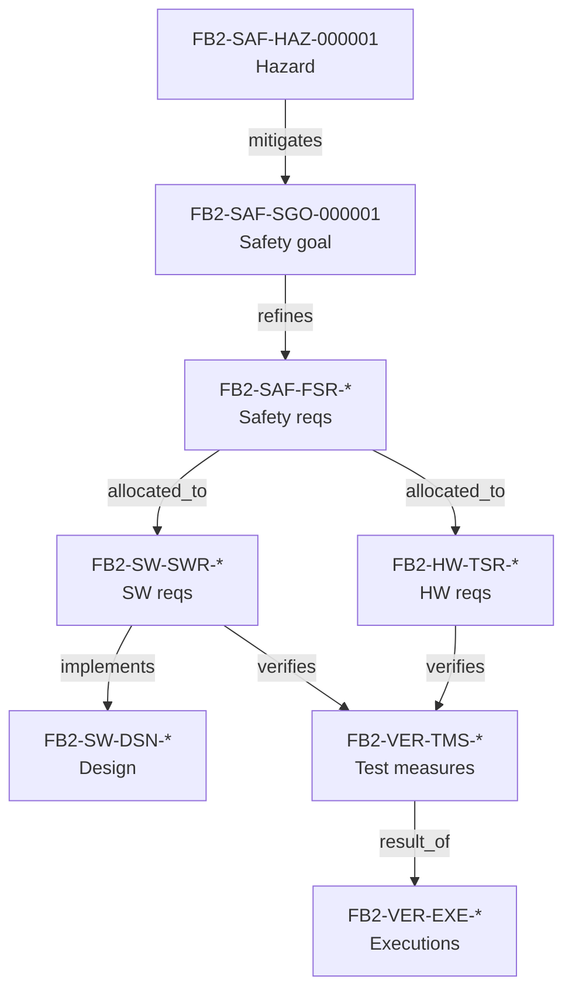
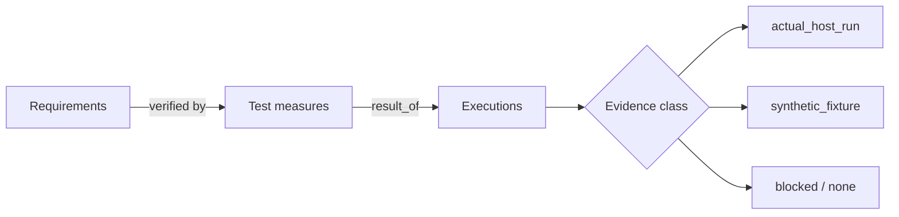

# Traceability — links, chains and coverage (generated view)

Generated: 2026-09-29T10:09:01Z | Baseline: BAS-REF-001 | 153 artifacts, 283 links

## Provenance and status of this file

- **Derived, not authored.** Every table and section below is generated by
  `docs/artifacts/tools/corpus.py cmd_render` from the canonical JSON records. This file contains no
  hand-written engineering content and is not an independent source of truth.
- **Regenerable.** Re-run `python3 docs/artifacts/tools/corpus.py render` to
  reproduce it. Edit the canonical record, never this file.
- **Scope of this view:** The canonical link registries: link-type statistics, vertical chains, lateral links, and the requirement-to-test coverage matrix.
- **Guard fields.** Every record shown below is printed with its own
  `profile`, `origin`, `human_approval_status` and `production_authorized`
  values. Across the whole corpus `human_approval_status` is `pending` and
  `production_authorized` is `false`; `product_verification_credit` is `false`.
  This view does not and cannot change that.
- **Not a conformity claim.** This corpus is synthetic. Nothing here asserts
  ISO 26262 conformity, an ASIL capability level, an Automotive SPICE
  assessment, human review, or human approval.
- **Diagram validation.** Mermaid blocks are checked by
  `mermaid-cli` when it is available on the rendering host; the per-view
  *Diagram validation* section states plainly whether that check ran. An
  unvalidated diagram is never described as validated.

## Link-type statistics

Derived from the canonical link registries. Counts are computed here, not transcribed from a report.

| Relation type | as_is | synthetic_reference | Total |
|---|---|---|---|
| `allocated_to` | 6 | 7 | 13 |
| `changes` | 0 | 16 | 16 |
| `implements` | 3 | 3 | 6 |
| `mitigates` | 1 | 1 | 2 |
| `refines` | 9 | 4 | 13 |
| `result_of` | 5 | 11 | 16 |
| `reviewed_by` | 78 | 89 | 167 |
| `supports` | 0 | 16 | 16 |
| `validates` | 0 | 2 | 2 |
| `verifies` | 9 | 23 | 32 |
| **Total** | 111 | 172 | 283 |

`related_to` is forbidden in canonical registries and appears only in mutation fixtures, where it is the injected defect.

## Vertical chains

Full traversals from hazard down to evidence, computed by following the canonical relations. A chain that stops early is a real traceability gap, not a rendering limit.

### as_is

| From | Relation | To | Title | Guard |
|---|---|---|---|---|
| `FB2-SAF-SGO-000001` | mitigates | `FB2-SAF-HAZ-000001` | Cell Overvoltage / Undervoltage Hazard | profile=`as_is` \| origin=`derived` \| human_approval_status=`pending` \| production_authorized=`false` |

### synthetic_reference

| From | Relation | To | Title | Guard |
|---|---|---|---|---|
| `FB2-SAF-SGO-000001` | mitigates | `FB2-SAF-HAZ-000001` | Cell Overvoltage / Undervoltage Hazard | profile=`synthetic_reference` \| origin=`synthetic` \| human_approval_status=`pending` \| production_authorized=`false` |

### Chain diagram

## Lateral links

Cross-cutting relations that do not sit on a single vertical chain.

| Link | Profile | Relation | Source | Target | Review state | Change-suspect |
|---|---|---|---|---|---|---|
| `FB2-LNK-CHG-000001` | synthetic_reference | changes | `FB2-MAN-CHG-000001` | `FB2-SAF-FSR-000002` | pending | false |
| `FB2-LNK-CHG-000002` | synthetic_reference | changes | `FB2-MAN-CHG-000001` | `FB2-SAF-HAZ-000001` | pending | false |
| `FB2-LNK-CHG-000003` | synthetic_reference | changes | `FB2-MAN-CHG-000001` | `FB2-HW-TSR-000001` | pending | false |
| `FB2-LNK-CHG-000004` | synthetic_reference | changes | `FB2-MAN-CHG-000001` | `FB2-SW-DSN-000002` | pending | false |
| `FB2-LNK-CHG-000005` | synthetic_reference | changes | `FB2-MAN-CHG-000001` | `FB2-VER-TMS-000001` | pending | false |
| `FB2-LNK-CHG-000006` | synthetic_reference | changes | `FB2-MAN-CHG-000002` | `FB2-SYS-HSI-000001` | pending | false |
| `FB2-LNK-CHG-000007` | synthetic_reference | changes | `FB2-MAN-CHG-000002` | `FB2-HW-TSR-000001` | pending | false |
| `FB2-LNK-CHG-000008` | synthetic_reference | changes | `FB2-MAN-CHG-000002` | `FB2-HW-TSR-000002` | pending | false |
| `FB2-LNK-CHG-000009` | synthetic_reference | changes | `FB2-MAN-CHG-000002` | `FB2-SW-SWR-000001` | pending | false |
| `FB2-LNK-CHG-000010` | synthetic_reference | changes | `FB2-MAN-CHG-000002` | `FB2-SW-DSN-000001` | pending | false |
| `FB2-LNK-CHG-000011` | synthetic_reference | changes | `FB2-MAN-CHG-000002` | `FB2-VER-TMS-000003` | pending | false |
| `FB2-LNK-CHG-000012` | synthetic_reference | changes | `FB2-MAN-CHG-000002` | `FB2-VER-TMS-000005` | pending | false |
| `FB2-LNK-CHG-000013` | synthetic_reference | changes | `FB2-MAN-CHG-000003` | `FB2-SAF-FSR-000002` | pending | false |
| `FB2-LNK-CHG-000014` | synthetic_reference | changes | `FB2-MAN-CHG-000003` | `FB2-SW-DSN-000002` | pending | false |
| `FB2-LNK-CHG-000015` | synthetic_reference | changes | `FB2-MAN-CHG-000003` | `FB2-SW-SWR-000002` | pending | false |
| `FB2-LNK-CHG-000016` | synthetic_reference | changes | `FB2-MAN-CHG-000003` | `FB2-VER-TMS-000001` | pending | false |
| `FB2-LNK-REVB-000001` | as_is | reviewed_by | `FB2-REV-000010` | `FB2-SAF-HAZ-000001` | reviewed | false |
| `FB2-LNK-REVB-000001` | synthetic_reference | reviewed_by | `FB2-REV-000009` | `FB2-SAF-HAZ-000001` | reviewed | false |
| `FB2-LNK-REVB-000002` | as_is | reviewed_by | `FB2-REV-000010` | `FB2-SAF-SGO-000001` | reviewed | false |
| `FB2-LNK-REVB-000002` | synthetic_reference | reviewed_by | `FB2-REV-000009` | `FB2-SAF-SGO-000001` | reviewed | false |
| `FB2-LNK-REVB-000003` | as_is | reviewed_by | `FB2-REV-000010` | `FB2-SAF-FSR-000001` | reviewed | false |
| `FB2-LNK-REVB-000003` | synthetic_reference | reviewed_by | `FB2-REV-000009` | `FB2-SAF-FSR-000001` | reviewed | false |
| `FB2-LNK-REVB-000004` | as_is | reviewed_by | `FB2-REV-000010` | `FB2-SAF-FSR-000002` | reviewed | false |
| `FB2-LNK-REVB-000004` | synthetic_reference | reviewed_by | `FB2-REV-000009` | `FB2-SAF-FSR-000002` | reviewed | false |
| `FB2-LNK-REVB-000005` | as_is | reviewed_by | `FB2-REV-000010` | `FB2-SAF-FSR-000003` | reviewed | false |
| `FB2-LNK-REVB-000005` | synthetic_reference | reviewed_by | `FB2-REV-000009` | `FB2-SAF-FSR-000003` | reviewed | false |
| `FB2-LNK-REVB-000006` | as_is | reviewed_by | `FB2-REV-000010` | `FB2-HW-TSR-000001` | reviewed | false |
| `FB2-LNK-REVB-000006` | synthetic_reference | reviewed_by | `FB2-REV-000009` | `FB2-SAF-FSR-000004` | reviewed | false |
| `FB2-LNK-REVB-000007` | as_is | reviewed_by | `FB2-REV-000010` | `FB2-HW-TSR-000002` | reviewed | false |
| `FB2-LNK-REVB-000007` | synthetic_reference | reviewed_by | `FB2-REV-000009` | `FB2-SAF-ANL-000001` | reviewed | false |
| `FB2-LNK-REVB-000008` | as_is | reviewed_by | `FB2-REV-000010` | `FB2-HW-TSR-000003` | reviewed | false |
| `FB2-LNK-REVB-000008` | synthetic_reference | reviewed_by | `FB2-REV-000009` | `FB2-SAF-ANL-000002` | reviewed | false |
| `FB2-LNK-REVB-000009` | as_is | reviewed_by | `FB2-REV-000010` | `FB2-SW-SWR-000001` | reviewed | false |
| `FB2-LNK-REVB-000009` | synthetic_reference | reviewed_by | `FB2-REV-000009` | `FB2-SAF-ANL-000003` | reviewed | false |
| `FB2-LNK-REVB-000010` | as_is | reviewed_by | `FB2-REV-000010` | `FB2-SW-SWR-000002` | reviewed | false |
| `FB2-LNK-REVB-000010` | synthetic_reference | reviewed_by | `FB2-REV-000009` | `FB2-SAF-ANL-000004` | reviewed | false |
| `FB2-LNK-REVB-000011` | as_is | reviewed_by | `FB2-REV-000010` | `FB2-SW-SWR-000003` | reviewed | false |
| `FB2-LNK-REVB-000011` | synthetic_reference | reviewed_by | `FB2-REV-000009` | `FB2-SAF-SCS-000001` | reviewed | false |
| `FB2-LNK-REVB-000012` | as_is | reviewed_by | `FB2-REV-000010` | `FB2-SW-DSN-000001` | reviewed | false |
| `FB2-LNK-REVB-000012` | synthetic_reference | reviewed_by | `FB2-REV-000009` | `FB2-SAF-TAR-000001` | reviewed | false |
| `FB2-LNK-REVB-000013` | as_is | reviewed_by | `FB2-REV-000010` | `FB2-SW-DSN-000002` | reviewed | false |
| `FB2-LNK-REVB-000013` | synthetic_reference | reviewed_by | `FB2-REV-000009` | `FB2-SAF-SEC-000001` | reviewed | false |
| `FB2-LNK-REVB-000014` | as_is | reviewed_by | `FB2-REV-000010` | `FB2-SW-DSN-000003` | reviewed | false |
| `FB2-LNK-REVB-000014` | synthetic_reference | reviewed_by | `FB2-REV-000009` | `FB2-SAF-SEC-000002` | reviewed | false |
| `FB2-LNK-REVB-000015` | as_is | reviewed_by | `FB2-REV-000010` | `FB2-VER-TMS-000001` | reviewed | false |
| `FB2-LNK-REVB-000015` | synthetic_reference | reviewed_by | `FB2-REV-000009` | `FB2-SAF-SEC-000003` | reviewed | false |
| `FB2-LNK-REVB-000016` | as_is | reviewed_by | `FB2-REV-000010` | `FB2-VER-TMS-000002` | reviewed | false |
| `FB2-LNK-REVB-000016` | synthetic_reference | reviewed_by | `FB2-REV-000009` | `FB2-SAF-SEC-000004` | reviewed | false |
| `FB2-LNK-REVB-000017` | as_is | reviewed_by | `FB2-REV-000002` | `FB2-SW-DEV-000001` | reviewed | false |
| `FB2-LNK-REVB-000017` | synthetic_reference | reviewed_by | `FB2-REV-000009` | `FB2-SAF-SEC-000005` | reviewed | false |
| `FB2-LNK-REVB-000018` | as_is | reviewed_by | `FB2-REV-000002` | `FB2-SW-DEV-000002` | reviewed | false |
| `FB2-LNK-REVB-000018` | synthetic_reference | reviewed_by | `FB2-REV-000009` | `FB2-MAN-CHG-000001` | reviewed | false |
| `FB2-LNK-REVB-000019` | as_is | reviewed_by | `FB2-REV-000002` | `FB2-SW-DEV-000003` | reviewed | false |
| `FB2-LNK-REVB-000019` | synthetic_reference | reviewed_by | `FB2-REV-000009` | `FB2-MAN-CHG-000002` | reviewed | false |
| `FB2-LNK-REVB-000020` | as_is | reviewed_by | `FB2-REV-000002` | `FB2-SW-DEV-000004` | reviewed | false |
| `FB2-LNK-REVB-000020` | synthetic_reference | reviewed_by | `FB2-REV-000009` | `FB2-MAN-CHG-000003` | reviewed | false |
| `FB2-LNK-REVB-000021` | as_is | reviewed_by | `FB2-REV-000002` | `FB2-SW-DEV-000005` | reviewed | false |
| `FB2-LNK-REVB-000021` | synthetic_reference | reviewed_by | `FB2-REV-000004` | `FB2-MAN-CHG-000001` | reviewed | false |
| `FB2-LNK-REVB-000022` | as_is | reviewed_by | `FB2-REV-000002` | `FB2-SW-DEV-000006` | reviewed | false |
| `FB2-LNK-REVB-000022` | synthetic_reference | reviewed_by | `FB2-REV-000004` | `FB2-MAN-CHG-000002` | reviewed | false |
| `FB2-LNK-REVB-000023` | as_is | reviewed_by | `FB2-REV-000002` | `FB2-SW-DEV-000007` | reviewed | false |
| `FB2-LNK-REVB-000023` | synthetic_reference | reviewed_by | `FB2-REV-000004` | `FB2-MAN-CHG-000003` | reviewed | false |
| `FB2-LNK-REVB-000024` | as_is | reviewed_by | `FB2-REV-000002` | `FB2-SW-DEV-000008` | reviewed | false |
| `FB2-LNK-REVB-000024` | synthetic_reference | reviewed_by | `FB2-REV-000003` | `FB2-SAF-TAR-000001` | reviewed | false |
| `FB2-LNK-REVB-000025` | as_is | reviewed_by | `FB2-REV-000002` | `FB2-SW-DEV-000009` | reviewed | false |
| `FB2-LNK-REVB-000025` | synthetic_reference | reviewed_by | `FB2-REV-000003` | `FB2-SAF-SEC-000001` | reviewed | false |
| `FB2-LNK-REVB-000026` | as_is | reviewed_by | `FB2-REV-000002` | `FB2-SW-DEV-000010` | reviewed | false |
| `FB2-LNK-REVB-000026` | synthetic_reference | reviewed_by | `FB2-REV-000003` | `FB2-SAF-SEC-000002` | reviewed | false |
| `FB2-LNK-REVB-000027` | as_is | reviewed_by | `FB2-REV-000002` | `FB2-SW-DEV-000011` | reviewed | false |
| `FB2-LNK-REVB-000027` | synthetic_reference | reviewed_by | `FB2-REV-000003` | `FB2-SAF-SEC-000003` | reviewed | false |
| `FB2-LNK-REVB-000028` | as_is | reviewed_by | `FB2-REV-000002` | `FB2-SW-DEV-000012` | reviewed | false |
| `FB2-LNK-REVB-000028` | synthetic_reference | reviewed_by | `FB2-REV-000003` | `FB2-SAF-SEC-000004` | reviewed | false |
| `FB2-LNK-REVB-000029` | as_is | reviewed_by | `FB2-REV-000002` | `FB2-SW-DEV-000013` | reviewed | false |
| `FB2-LNK-REVB-000029` | synthetic_reference | reviewed_by | `FB2-REV-000003` | `FB2-SAF-SEC-000005` | reviewed | false |
| `FB2-LNK-REVB-000030` | as_is | reviewed_by | `FB2-REV-000002` | `FB2-SW-DEV-000014` | reviewed | false |
| `FB2-LNK-REVB-000030` | synthetic_reference | reviewed_by | `FB2-REV-000012` | `FB2-SAF-ANL-000001` | reviewed | false |
| `FB2-LNK-REVB-000031` | as_is | reviewed_by | `FB2-REV-000002` | `FB2-SW-DEV-000015` | reviewed | false |
| `FB2-LNK-REVB-000031` | synthetic_reference | reviewed_by | `FB2-REV-000012` | `FB2-SAF-ANL-000002` | reviewed | false |
| `FB2-LNK-REVB-000032` | as_is | reviewed_by | `FB2-REV-000002` | `FB2-SW-DEV-000016` | reviewed | false |
| `FB2-LNK-REVB-000032` | synthetic_reference | reviewed_by | `FB2-REV-000012` | `FB2-SAF-ANL-000003` | reviewed | false |
| `FB2-LNK-REVB-000033` | as_is | reviewed_by | `FB2-REV-000002` | `FB2-SW-DEV-000017` | reviewed | false |
| `FB2-LNK-REVB-000033` | synthetic_reference | reviewed_by | `FB2-REV-000012` | `FB2-SAF-ANL-000004` | reviewed | false |
| `FB2-LNK-REVB-000034` | as_is | reviewed_by | `FB2-REV-000002` | `FB2-SW-DEV-000018` | reviewed | false |
| `FB2-LNK-REVB-000034` | synthetic_reference | reviewed_by | `FB2-REV-000012` | `FB2-SAF-SCS-000001` | reviewed | false |
| `FB2-LNK-REVB-000035` | as_is | reviewed_by | `FB2-REV-000002` | `FB2-SW-DEV-000019` | reviewed | false |
| `FB2-LNK-REVB-000035` | synthetic_reference | reviewed_by | `FB2-REV-000012` | `FB2-SAF-FSR-000004` | reviewed | false |
| `FB2-LNK-REVB-000036` | as_is | reviewed_by | `FB2-REV-000002` | `FB2-SW-DEV-000020` | reviewed | false |
| `FB2-LNK-REVB-000036` | synthetic_reference | reviewed_by | `FB2-REV-000012` | `FB2-HW-TSR-000004` | reviewed | false |
| `FB2-LNK-REVB-000037` | as_is | reviewed_by | `FB2-REV-000002` | `FB2-SW-DEV-000021` | reviewed | false |
| `FB2-LNK-REVB-000037` | synthetic_reference | reviewed_by | `FB2-REV-000012` | `FB2-VER-TMS-000006` | reviewed | false |
| `FB2-LNK-REVB-000038` | as_is | reviewed_by | `FB2-REV-000002` | `FB2-SW-DEV-000022` | reviewed | false |
| `FB2-LNK-REVB-000038` | synthetic_reference | reviewed_by | `FB2-REV-000012` | `FB2-VER-TMS-000007` | reviewed | false |
| `FB2-LNK-REVB-000039` | as_is | reviewed_by | `FB2-REV-000002` | `FB2-SW-DEV-000023` | reviewed | false |
| `FB2-LNK-REVB-000039` | synthetic_reference | reviewed_by | `FB2-REV-000012` | `FB2-VER-TMS-000008` | reviewed | false |
| `FB2-LNK-REVB-000040` | as_is | reviewed_by | `FB2-REV-000002` | `FB2-SW-DEV-000024` | reviewed | false |
| `FB2-LNK-REVB-000040` | synthetic_reference | reviewed_by | `FB2-REV-000012` | `FB2-VER-TMS-000009` | reviewed | false |
| `FB2-LNK-REVB-000041` | as_is | reviewed_by | `FB2-REV-000002` | `FB2-SW-DEV-000025` | reviewed | false |
| `FB2-LNK-REVB-000041` | synthetic_reference | reviewed_by | `FB2-REV-000012` | `FB2-VER-TMS-000010` | reviewed | false |
| `FB2-LNK-REVB-000042` | as_is | reviewed_by | `FB2-REV-000002` | `FB2-SW-DEV-000026` | reviewed | false |
| `FB2-LNK-REVB-000042` | synthetic_reference | reviewed_by | `FB2-REV-000012` | `FB2-VER-TMS-000011` | reviewed | false |
| `FB2-LNK-REVB-000043` | as_is | reviewed_by | `FB2-REV-000011` | `FB2-SAF-HAZ-000001` | reviewed | false |
| `FB2-LNK-REVB-000043` | synthetic_reference | reviewed_by | `FB2-REV-000012` | `FB2-VER-EXE-000006` | reviewed | false |
| `FB2-LNK-REVB-000044` | as_is | reviewed_by | `FB2-REV-000011` | `FB2-SAF-SGO-000001` | reviewed | false |
| `FB2-LNK-REVB-000044` | synthetic_reference | reviewed_by | `FB2-REV-000012` | `FB2-VER-EXE-000007` | reviewed | false |
| `FB2-LNK-REVB-000045` | as_is | reviewed_by | `FB2-REV-000011` | `FB2-SAF-FSR-000001` | reviewed | false |
| `FB2-LNK-REVB-000045` | synthetic_reference | reviewed_by | `FB2-REV-000012` | `FB2-VER-EXE-000008` | reviewed | false |
| `FB2-LNK-REVB-000046` | as_is | reviewed_by | `FB2-REV-000011` | `FB2-SAF-FSR-000002` | reviewed | false |
| `FB2-LNK-REVB-000046` | synthetic_reference | reviewed_by | `FB2-REV-000012` | `FB2-VER-EXE-000009` | reviewed | false |
| `FB2-LNK-REVB-000047` | as_is | reviewed_by | `FB2-REV-000011` | `FB2-SAF-FSR-000003` | reviewed | false |
| `FB2-LNK-REVB-000047` | synthetic_reference | reviewed_by | `FB2-REV-000012` | `FB2-VER-EXE-000010` | reviewed | false |
| `FB2-LNK-REVB-000048` | as_is | reviewed_by | `FB2-REV-000011` | `FB2-HW-TSR-000001` | reviewed | false |
| `FB2-LNK-REVB-000048` | synthetic_reference | reviewed_by | `FB2-REV-000012` | `FB2-VER-EXE-000011` | reviewed | false |
| `FB2-LNK-REVB-000049` | as_is | reviewed_by | `FB2-REV-000011` | `FB2-HW-TSR-000002` | reviewed | false |
| `FB2-LNK-REVB-000049` | synthetic_reference | reviewed_by | `FB2-REV-000012` | `FB2-SAF-HAZ-000001` | reviewed | false |
| `FB2-LNK-REVB-000050` | as_is | reviewed_by | `FB2-REV-000011` | `FB2-HW-TSR-000003` | reviewed | false |
| `FB2-LNK-REVB-000050` | synthetic_reference | reviewed_by | `FB2-REV-000012` | `FB2-SAF-SGO-000001` | reviewed | false |
| `FB2-LNK-REVB-000051` | as_is | reviewed_by | `FB2-REV-000011` | `FB2-SW-SWR-000001` | reviewed | false |
| `FB2-LNK-REVB-000051` | synthetic_reference | reviewed_by | `FB2-REV-000012` | `FB2-SAF-FSR-000001` | reviewed | false |
| `FB2-LNK-REVB-000052` | as_is | reviewed_by | `FB2-REV-000011` | `FB2-SW-SWR-000002` | reviewed | false |
| `FB2-LNK-REVB-000052` | synthetic_reference | reviewed_by | `FB2-REV-000012` | `FB2-SAF-FSR-000002` | reviewed | false |
| `FB2-LNK-REVB-000053` | as_is | reviewed_by | `FB2-REV-000011` | `FB2-SW-SWR-000003` | reviewed | false |
| `FB2-LNK-REVB-000053` | synthetic_reference | reviewed_by | `FB2-REV-000012` | `FB2-SAF-FSR-000003` | reviewed | false |
| `FB2-LNK-REVB-000054` | as_is | reviewed_by | `FB2-REV-000011` | `FB2-SW-DSN-000001` | reviewed | false |
| `FB2-LNK-REVB-000054` | synthetic_reference | reviewed_by | `FB2-REV-000012` | `FB2-SAF-TAR-000001` | reviewed | false |
| `FB2-LNK-REVB-000055` | as_is | reviewed_by | `FB2-REV-000011` | `FB2-SW-DSN-000002` | reviewed | false |
| `FB2-LNK-REVB-000055` | synthetic_reference | reviewed_by | `FB2-REV-000012` | `FB2-SAF-SEC-000001` | reviewed | false |
| `FB2-LNK-REVB-000056` | as_is | reviewed_by | `FB2-REV-000011` | `FB2-SW-DSN-000003` | reviewed | false |
| `FB2-LNK-REVB-000056` | synthetic_reference | reviewed_by | `FB2-REV-000012` | `FB2-SAF-SEC-000002` | reviewed | false |
| `FB2-LNK-REVB-000057` | as_is | reviewed_by | `FB2-REV-000011` | `FB2-VER-TMS-000001` | reviewed | false |
| `FB2-LNK-REVB-000057` | synthetic_reference | reviewed_by | `FB2-REV-000012` | `FB2-SAF-SEC-000003` | reviewed | false |
| `FB2-LNK-REVB-000058` | as_is | reviewed_by | `FB2-REV-000011` | `FB2-VER-TMS-000002` | reviewed | false |
| `FB2-LNK-REVB-000058` | synthetic_reference | reviewed_by | `FB2-REV-000012` | `FB2-SAF-SEC-000004` | reviewed | false |
| `FB2-LNK-REVB-000059` | as_is | reviewed_by | `FB2-REV-000006` | `FB2-VER-TMS-000003` | reviewed | false |
| `FB2-LNK-REVB-000059` | synthetic_reference | reviewed_by | `FB2-REV-000012` | `FB2-SAF-SEC-000005` | reviewed | false |
| `FB2-LNK-REVB-000060` | as_is | reviewed_by | `FB2-REV-000006` | `FB2-VER-TMS-000004` | reviewed | false |
| `FB2-LNK-REVB-000060` | synthetic_reference | reviewed_by | `FB2-REV-000012` | `FB2-MAN-CHG-000001` | reviewed | false |
| `FB2-LNK-REVB-000061` | as_is | reviewed_by | `FB2-REV-000006` | `FB2-VER-TMS-000005` | reviewed | false |
| `FB2-LNK-REVB-000061` | synthetic_reference | reviewed_by | `FB2-REV-000012` | `FB2-MAN-CHG-000002` | reviewed | false |
| `FB2-LNK-REVB-000062` | as_is | reviewed_by | `FB2-REV-000001` | `FB2-SAF-SGO-000001` | reviewed | false |
| `FB2-LNK-REVB-000062` | synthetic_reference | reviewed_by | `FB2-REV-000012` | `FB2-MAN-CHG-000003` | reviewed | false |
| `FB2-LNK-REVB-000063` | as_is | reviewed_by | `FB2-REV-000001` | `FB2-SAF-FSR-000002` | reviewed | false |
| `FB2-LNK-REVB-000063` | synthetic_reference | reviewed_by | `FB2-REV-000005` | `FB2-SAF-ANL-000001` | reviewed | false |
| `FB2-LNK-REVB-000064` | as_is | reviewed_by | `FB2-REV-000001` | `FB2-SAF-FSR-000003` | reviewed | false |
| `FB2-LNK-REVB-000064` | synthetic_reference | reviewed_by | `FB2-REV-000005` | `FB2-SAF-ANL-000002` | reviewed | false |
| `FB2-LNK-REVB-000065` | as_is | reviewed_by | `FB2-REV-000001` | `FB2-HW-TSR-000001` | reviewed | false |
| `FB2-LNK-REVB-000065` | synthetic_reference | reviewed_by | `FB2-REV-000005` | `FB2-SAF-ANL-000003` | reviewed | false |
| `FB2-LNK-REVB-000066` | as_is | reviewed_by | `FB2-REV-000001` | `FB2-HW-TSR-000002` | reviewed | false |
| `FB2-LNK-REVB-000066` | synthetic_reference | reviewed_by | `FB2-REV-000005` | `FB2-SAF-ANL-000004` | reviewed | false |
| `FB2-LNK-REVB-000067` | as_is | reviewed_by | `FB2-REV-000001` | `FB2-HW-TSR-000003` | reviewed | false |
| `FB2-LNK-REVB-000067` | synthetic_reference | reviewed_by | `FB2-REV-000005` | `FB2-SAF-SCS-000001` | reviewed | false |
| `FB2-LNK-REVB-000068` | as_is | reviewed_by | `FB2-REV-000001` | `FB2-SW-SWR-000001` | reviewed | false |
| `FB2-LNK-REVB-000068` | synthetic_reference | reviewed_by | `FB2-REV-000005` | `FB2-SAF-FSR-000004` | reviewed | false |
| `FB2-LNK-REVB-000069` | as_is | reviewed_by | `FB2-REV-000001` | `FB2-SW-SWR-000002` | reviewed | false |
| `FB2-LNK-REVB-000069` | synthetic_reference | reviewed_by | `FB2-REV-000005` | `FB2-HW-TSR-000004` | reviewed | false |
| `FB2-LNK-REVB-000070` | as_is | reviewed_by | `FB2-REV-000001` | `FB2-SW-SWR-000003` | reviewed | false |
| `FB2-LNK-REVB-000070` | synthetic_reference | reviewed_by | `FB2-REV-000008` | `FB2-MAN-SCO-000001` | reviewed | false |
| `FB2-LNK-REVB-000071` | as_is | reviewed_by | `FB2-REV-000001` | `FB2-SW-DSN-000001` | reviewed | false |
| `FB2-LNK-REVB-000071` | synthetic_reference | reviewed_by | `FB2-REV-000008` | `FB2-MAN-SPL-000001` | reviewed | false |
| `FB2-LNK-REVB-000072` | as_is | reviewed_by | `FB2-REV-000001` | `FB2-SW-DSN-000002` | reviewed | false |
| `FB2-LNK-REVB-000072` | synthetic_reference | reviewed_by | `FB2-REV-000008` | `FB2-SYS-HSI-000001` | reviewed | false |
| `FB2-LNK-REVB-000073` | as_is | reviewed_by | `FB2-REV-000001` | `FB2-SW-DSN-000003` | reviewed | false |
| `FB2-LNK-REVB-000073` | synthetic_reference | reviewed_by | `FB2-REV-000008` | `FB2-SCN-MUT-000001` | reviewed | false |
| `FB2-LNK-REVB-000074` | as_is | reviewed_by | `FB2-REV-000001` | `FB2-VER-TMS-000001` | reviewed | false |
| `FB2-LNK-REVB-000074` | synthetic_reference | reviewed_by | `FB2-REV-000008` | `FB2-SCN-MUT-000002` | reviewed | false |
| `FB2-LNK-REVB-000075` | as_is | reviewed_by | `FB2-REV-000001` | `FB2-VER-TMS-000002` | reviewed | false |
| `FB2-LNK-REVB-000075` | synthetic_reference | reviewed_by | `FB2-REV-000008` | `FB2-SCN-CHG-000001` | reviewed | false |
| `FB2-LNK-REVB-000076` | as_is | reviewed_by | `FB2-REV-000001` | `FB2-VER-EXE-000001` | reviewed | false |
| `FB2-LNK-REVB-000076` | synthetic_reference | reviewed_by | `FB2-REV-000008` | `FB2-SCN-CHG-000002` | reviewed | false |
| `FB2-LNK-REVB-000077` | synthetic_reference | reviewed_by | `FB2-REV-000008` | `FB2-SCN-CHG-000003` | reviewed | false |
| `FB2-LNK-REVB-000078` | synthetic_reference | reviewed_by | `FB2-REV-000007` | `FB2-VER-TMS-000006` | reviewed | false |
| `FB2-LNK-REVB-000079` | synthetic_reference | reviewed_by | `FB2-REV-000007` | `FB2-VER-TMS-000007` | reviewed | false |
| `FB2-LNK-REVB-000080` | synthetic_reference | reviewed_by | `FB2-REV-000007` | `FB2-VER-TMS-000008` | reviewed | false |
| `FB2-LNK-REVB-000081` | synthetic_reference | reviewed_by | `FB2-REV-000007` | `FB2-VER-TMS-000009` | reviewed | false |
| `FB2-LNK-REVB-000082` | synthetic_reference | reviewed_by | `FB2-REV-000007` | `FB2-VER-TMS-000010` | reviewed | false |
| `FB2-LNK-REVB-000083` | synthetic_reference | reviewed_by | `FB2-REV-000007` | `FB2-VER-TMS-000011` | reviewed | false |
| `FB2-LNK-REVB-000084` | synthetic_reference | reviewed_by | `FB2-REV-000007` | `FB2-VER-EXE-000006` | reviewed | false |
| `FB2-LNK-REVB-000085` | synthetic_reference | reviewed_by | `FB2-REV-000007` | `FB2-VER-EXE-000007` | reviewed | false |
| `FB2-LNK-REVB-000086` | synthetic_reference | reviewed_by | `FB2-REV-000007` | `FB2-VER-EXE-000008` | reviewed | false |
| `FB2-LNK-REVB-000087` | synthetic_reference | reviewed_by | `FB2-REV-000007` | `FB2-VER-EXE-000009` | reviewed | false |
| `FB2-LNK-REVB-000088` | synthetic_reference | reviewed_by | `FB2-REV-000007` | `FB2-VER-EXE-000010` | reviewed | false |
| `FB2-LNK-REVB-000089` | synthetic_reference | reviewed_by | `FB2-REV-000007` | `FB2-VER-EXE-000011` | reviewed | false |
| `FB2-LNK-SAF-000019` | as_is | reviewed_by | `FB2-REV-000001` | `FB2-SAF-HAZ-000001` | reviewed | false |
| `FB2-LNK-SAF-000020` | as_is | reviewed_by | `FB2-REV-000001` | `FB2-SAF-FSR-000001` | reviewed | false |
| `FB2-LNK-SEC-000001` | synthetic_reference | supports | `FB2-SAF-TAR-000001` | `FB2-SAF-SEC-000001` | pending | false |
| `FB2-LNK-SEC-000002` | synthetic_reference | supports | `FB2-SAF-TAR-000001` | `FB2-SAF-SEC-000002` | pending | false |
| `FB2-LNK-SEC-000003` | synthetic_reference | supports | `FB2-SAF-TAR-000001` | `FB2-SAF-SEC-000003` | pending | false |
| `FB2-LNK-SEC-000004` | synthetic_reference | supports | `FB2-SAF-TAR-000001` | `FB2-SAF-SEC-000004` | pending | false |
| `FB2-LNK-SEC-000005` | synthetic_reference | supports | `FB2-SAF-TAR-000001` | `FB2-SAF-SEC-000005` | pending | false |
| `FB2-LNK-SEC-000006` | synthetic_reference | supports | `FB2-SAF-SEC-000001` | `FB2-SAF-SGO-000001` | pending | false |
| `FB2-LNK-SEC-000007` | synthetic_reference | supports | `FB2-SAF-SEC-000002` | `FB2-SAF-SGO-000001` | pending | false |
| `FB2-LNK-SEC-000008` | synthetic_reference | supports | `FB2-SAF-SEC-000003` | `FB2-SAF-FSR-000001` | pending | false |
| `FB2-LNK-SEC-000009` | synthetic_reference | supports | `FB2-SAF-SEC-000003` | `FB2-SAF-FSR-000002` | pending | false |
| `FB2-LNK-SEC-000010` | synthetic_reference | supports | `FB2-SAF-SEC-000004` | `FB2-SAF-SGO-000001` | pending | false |
| `FB2-LNK-SEC-000011` | synthetic_reference | supports | `FB2-SAF-SEC-000005` | `FB2-SAF-SCS-000001` | pending | false |
| `FB2-LNK-SEC-000012` | synthetic_reference | supports | `FB2-SAF-TAR-000001` | `FB2-SAF-SGO-000001` | pending | false |
| `FB2-LNK-SEC-000013` | synthetic_reference | supports | `FB2-SAF-TAR-000001` | `FB2-SAF-FSR-000001` | pending | false |
| `FB2-LNK-SEC-000014` | synthetic_reference | supports | `FB2-SAF-TAR-000001` | `FB2-SAF-FSR-000002` | pending | false |
| `FB2-LNK-SEC-000015` | synthetic_reference | supports | `FB2-SAF-TAR-000001` | `FB2-SAF-FSR-000003` | pending | false |
| `FB2-LNK-SEC-000016` | synthetic_reference | supports | `FB2-SAF-TAR-000001` | `FB2-SAF-SCS-000001` | pending | false |

Relation types defined by the model but **not used by any canonical link in this corpus**: `constrained_by`, `consumes`, `depends_on`, `produces`, `specified_by`, `supersedes`. Their absence is reported rather than hidden.

## Requirement-to-test coverage matrix

Built from `verifies` and `validates` links only. A requirement with no row in this table has no verification link; that is a coverage gap, not an implied pass.

| Profile | Test measure | Measure title | Requirement | Requirement title | Requirement guard | Execution evidence |
|---|---|---|---|---|---|---|
| as_is | `FB2-VER-TMS-000001` | Test: SOA Voltage Limit Detection | `FB2-SAF-FSR-000002` | FSR: SOA Voltage Limit Monitoring with Debounce | profile=`as_is` \| origin=`source_observed` \| human_approval_status=`pending` \| production_authorized=`false` | `FB2-VER-EXE-000001` actual_host_run/pass |
| as_is | `FB2-VER-TMS-000001` | Test: SOA Voltage Limit Detection | `FB2-SW-SWR-000002` | SWR: SOA Voltage Limit Monitoring | profile=`as_is` \| origin=`source_observed` \| human_approval_status=`pending` \| production_authorized=`false` | `FB2-VER-EXE-000001` actual_host_run/pass |
| as_is | `FB2-VER-TMS-000002` | Test: Contactor State Machine and Fault Response | `FB2-SAF-FSR-000003` | FSR: Contactor Opening on SOA Violation | profile=`as_is` \| origin=`source_observed` \| human_approval_status=`pending` \| production_authorized=`false` | `FB2-VER-EXE-000002` actual_host_run/pass |
| as_is | `FB2-VER-TMS-000002` | Test: Contactor State Machine and Fault Response | `FB2-SW-SWR-000003` | SWR: Contactor State Machine and Fault Response | profile=`as_is` \| origin=`source_observed` \| human_approval_status=`pending` \| production_authorized=`false` | `FB2-VER-EXE-000002` actual_host_run/pass |
| as_is | `FB2-VER-TMS-000003` | Test: AFE Cell Voltage Plausibility Checks | `FB2-SAF-FSR-000001` | FSR: Cell Voltage Acquisition and Validation | profile=`as_is` \| origin=`source_observed` \| human_approval_status=`pending` \| production_authorized=`false` | `FB2-VER-EXE-000003` actual_host_run/pass; `FB2-VER-EXE-000008` actual_host_run/fail; `FB2-VER-EXE-000009` actual_host_run/fail; `FB2-VER-EXE-000010` actual_host_run/fail; `FB2-VER-EXE-000011` actual_host_run/fail; `FB2-VER-EXE-000012` actual_host_run/fail; `FB2-VER-EXE-000013` actual_host_run/fail; `FB2-VER-EXE-000014` actual_host_run/fail |
| as_is | `FB2-VER-TMS-000003` | Test: AFE Cell Voltage Plausibility Checks | `FB2-SW-SWR-000001` | SWR: AFE Driver - Cell Voltage Acquisition | profile=`as_is` \| origin=`source_observed` \| human_approval_status=`pending` \| production_authorized=`false` | `FB2-VER-EXE-000003` actual_host_run/pass; `FB2-VER-EXE-000008` actual_host_run/fail; `FB2-VER-EXE-000009` actual_host_run/fail; `FB2-VER-EXE-000010` actual_host_run/fail; `FB2-VER-EXE-000011` actual_host_run/fail; `FB2-VER-EXE-000012` actual_host_run/fail; `FB2-VER-EXE-000013` actual_host_run/fail; `FB2-VER-EXE-000014` actual_host_run/fail |
| synthetic_reference | `FB2-VER-TMS-000001` | Test: SOA Voltage Limit Detection | `FB2-SAF-FSR-000002` | FSR: SOA Voltage Limit Monitoring with Debounce | profile=`synthetic_reference` \| origin=`synthetic` \| human_approval_status=`pending` \| production_authorized=`false` | `FB2-VER-EXE-000001` synthetic_fixture/pass |
| as_is | `FB2-VER-TMS-000004` | Test: LTC6813-1 AFE Driver Communication and Measurement | `FB2-HW-TSR-000001` | TSR: AFE Cell Voltage Measurement Accuracy | profile=`as_is` \| origin=`source_observed` \| human_approval_status=`pending` \| production_authorized=`false` | `FB2-VER-EXE-000004` none/blocked |
| synthetic_reference | `FB2-VER-TMS-000001` | Test: SOA Voltage Limit Detection | `FB2-SW-SWR-000002` | SWR: SOA Voltage Limit Monitoring | profile=`synthetic_reference` \| origin=`synthetic` \| human_approval_status=`pending` \| production_authorized=`false` | `FB2-VER-EXE-000001` synthetic_fixture/pass |
| as_is | `FB2-VER-TMS-000004` | Test: LTC6813-1 AFE Driver Communication and Measurement | `FB2-HW-TSR-000002` | TSR: AFE isoSPI Communication Integrity | profile=`as_is` \| origin=`source_observed` \| human_approval_status=`pending` \| production_authorized=`false` | `FB2-VER-EXE-000004` none/blocked |
| synthetic_reference | `FB2-VER-TMS-000002` | Test: Contactor State Machine Fault Response | `FB2-SAF-FSR-000003` | FSR: Contactor Opening on SOA Violation | profile=`synthetic_reference` \| origin=`synthetic` \| human_approval_status=`pending` \| production_authorized=`false` | `FB2-VER-EXE-000002` synthetic_fixture/pass |
| as_is | `FB2-VER-TMS-000005` | Test: Contactor Driver Configuration and Control | `FB2-HW-TSR-000003` | TSR: Contactor Driver and Feedback | profile=`as_is` \| origin=`source_observed` \| human_approval_status=`pending` \| production_authorized=`false` | `FB2-VER-EXE-000005` actual_host_run/pass |
| synthetic_reference | `FB2-VER-TMS-000002` | Test: Contactor State Machine Fault Response | `FB2-SW-SWR-000003` | SWR: Contactor State Machine and Fault Response | profile=`synthetic_reference` \| origin=`synthetic` \| human_approval_status=`pending` \| production_authorized=`false` | `FB2-VER-EXE-000002` synthetic_fixture/pass |
| synthetic_reference | `FB2-VER-TMS-000003` | Test: AFE Cell Voltage Plausibility Checks | `FB2-SAF-FSR-000001` | FSR: Cell Voltage Acquisition and Validation | profile=`synthetic_reference` \| origin=`synthetic` \| human_approval_status=`pending` \| production_authorized=`false` | `FB2-VER-EXE-000003` synthetic_fixture/pass |
| synthetic_reference | `FB2-VER-TMS-000003` | Test: AFE Cell Voltage Plausibility Checks | `FB2-SW-SWR-000001` | SWR: AFE Driver - Cell Voltage Acquisition | profile=`synthetic_reference` \| origin=`synthetic` \| human_approval_status=`pending` \| production_authorized=`false` | `FB2-VER-EXE-000003` synthetic_fixture/pass |
| synthetic_reference | `FB2-VER-TMS-000003` | Test: AFE Cell Voltage Plausibility Checks | `FB2-HW-TSR-000001` | TSR: AFE Cell Voltage Measurement Accuracy | profile=`synthetic_reference` \| origin=`synthetic` \| human_approval_status=`pending` \| production_authorized=`false` | `FB2-VER-EXE-000003` synthetic_fixture/pass |
| synthetic_reference | `FB2-VER-TMS-000004` | Test: Independent Voltage Monitor Reaction | `FB2-SAF-FSR-000004` | FSR: Independent Hardware Voltage Monitor | profile=`synthetic_reference` \| origin=`synthetic` \| human_approval_status=`pending` \| production_authorized=`false` | `FB2-VER-EXE-000004` synthetic_fixture/pass |
| synthetic_reference | `FB2-VER-TMS-000004` | Test: Independent Voltage Monitor Reaction | `FB2-HW-TSR-000004` | TSR: Independent Hardware Voltage Monitor | profile=`synthetic_reference` \| origin=`synthetic` \| human_approval_status=`pending` \| production_authorized=`false` | `FB2-VER-EXE-000004` synthetic_fixture/pass |
| synthetic_reference | `FB2-VER-TMS-000005` | Test: AFE Communication Integrity | `FB2-HW-TSR-000002` | TSR: AFE isoSPI Communication Integrity | profile=`synthetic_reference` \| origin=`synthetic` \| human_approval_status=`pending` \| production_authorized=`false` | `FB2-VER-EXE-000005` synthetic_fixture/pass |
| synthetic_reference | `FB2-VER-TMS-000006` | Test: Contactor Driver Configuration and Control | `FB2-HW-TSR-000003` | TSR: Contactor Driver and Feedback | profile=`synthetic_reference` \| origin=`synthetic` \| human_approval_status=`pending` \| production_authorized=`false` | `FB2-VER-EXE-000006` synthetic_fixture/pass |
| synthetic_reference | `FB2-VER-TMS-000007` | Test: Software Integration Chain (SOA-Database-Contactor) | `FB2-SW-SWR-000001` | SWR: AFE Driver - Cell Voltage Acquisition | profile=`synthetic_reference` \| origin=`synthetic` \| human_approval_status=`pending` \| production_authorized=`false` | `FB2-VER-EXE-000007` none/blocked |
| synthetic_reference | `FB2-VER-TMS-000007` | Test: Software Integration Chain (SOA-Database-Contactor) | `FB2-SW-SWR-000002` | SWR: SOA Voltage Limit Monitoring | profile=`synthetic_reference` \| origin=`synthetic` \| human_approval_status=`pending` \| production_authorized=`false` | `FB2-VER-EXE-000007` none/blocked |
| synthetic_reference | `FB2-VER-TMS-000007` | Test: Software Integration Chain (SOA-Database-Contactor) | `FB2-SW-SWR-000003` | SWR: Contactor State Machine and Fault Response | profile=`synthetic_reference` \| origin=`synthetic` \| human_approval_status=`pending` \| production_authorized=`false` | `FB2-VER-EXE-000007` none/blocked |
| synthetic_reference | `FB2-VER-TMS-000008` | Test: System Qualification (Cell-Voltage Safety Chain) | `FB2-SAF-FSR-000001` | FSR: Cell Voltage Acquisition and Validation | profile=`synthetic_reference` \| origin=`synthetic` \| human_approval_status=`pending` \| production_authorized=`false` | `FB2-VER-EXE-000008` none/blocked |
| synthetic_reference | `FB2-VER-TMS-000008` | Test: System Qualification (Cell-Voltage Safety Chain) | `FB2-SAF-FSR-000002` | FSR: SOA Voltage Limit Monitoring with Debounce | profile=`synthetic_reference` \| origin=`synthetic` \| human_approval_status=`pending` \| production_authorized=`false` | `FB2-VER-EXE-000008` none/blocked |
| synthetic_reference | `FB2-VER-TMS-000008` | Test: System Qualification (Cell-Voltage Safety Chain) | `FB2-SAF-FSR-000003` | FSR: Contactor Opening on SOA Violation | profile=`synthetic_reference` \| origin=`synthetic` \| human_approval_status=`pending` \| production_authorized=`false` | `FB2-VER-EXE-000008` none/blocked |
| synthetic_reference | `FB2-VER-TMS-000008` | Test: System Qualification (Cell-Voltage Safety Chain) | `FB2-SAF-FSR-000004` | FSR: Independent Hardware Voltage Monitor | profile=`synthetic_reference` \| origin=`synthetic` \| human_approval_status=`pending` \| production_authorized=`false` | `FB2-VER-EXE-000008` none/blocked |
| synthetic_reference | `FB2-VER-TMS-000009` | Test: Stakeholder Validation (Cell-Voltage Use Cases) | `FB2-SAF-SGO-000001` | Cell Voltage Safety Goal | profile=`synthetic_reference` \| origin=`synthetic` \| human_approval_status=`pending` \| production_authorized=`false` | `FB2-VER-EXE-000009` none/blocked |
| synthetic_reference | `FB2-VER-TMS-000009` | Test: Stakeholder Validation (Cell-Voltage Use Cases) | `FB2-MAN-SCO-000001` | Project Scope: foxBMS 2 Reference BMS Development | profile=`synthetic_reference` \| origin=`synthetic` \| human_approval_status=`pending` \| production_authorized=`false` | `FB2-VER-EXE-000009` none/blocked |
| synthetic_reference | `FB2-VER-TMS-000010` | Test: Component Verification (SOA Monitor + DIAG Callbacks) | `FB2-SW-SWR-000002` | SWR: SOA Voltage Limit Monitoring | profile=`synthetic_reference` \| origin=`synthetic` \| human_approval_status=`pending` \| production_authorized=`false` | `FB2-VER-EXE-000010` none/blocked |
| synthetic_reference | `FB2-VER-TMS-000011` | Test: HIL Fault Reaction (Target) | `FB2-SAF-FSR-000001` | FSR: Cell Voltage Acquisition and Validation | profile=`synthetic_reference` \| origin=`synthetic` \| human_approval_status=`pending` \| production_authorized=`false` | `FB2-VER-EXE-000011` none/blocked |
| synthetic_reference | `FB2-VER-TMS-000011` | Test: HIL Fault Reaction (Target) | `FB2-SAF-FSR-000002` | FSR: SOA Voltage Limit Monitoring with Debounce | profile=`synthetic_reference` \| origin=`synthetic` \| human_approval_status=`pending` \| production_authorized=`false` | `FB2-VER-EXE-000011` none/blocked |
| synthetic_reference | `FB2-VER-TMS-000011` | Test: HIL Fault Reaction (Target) | `FB2-SAF-FSR-000003` | FSR: Contactor Opening on SOA Violation | profile=`synthetic_reference` \| origin=`synthetic` \| human_approval_status=`pending` \| production_authorized=`false` | `FB2-VER-EXE-000011` none/blocked |
| synthetic_reference | `FB2-VER-TMS-000011` | Test: HIL Fault Reaction (Target) | `FB2-SAF-FSR-000004` | FSR: Independent Hardware Voltage Monitor | profile=`synthetic_reference` \| origin=`synthetic` \| human_approval_status=`pending` \| production_authorized=`false` | `FB2-VER-EXE-000011` none/blocked |

### Coverage diagram

## Diagram validation

Validator: mermaid-cli /opt/homebrew/bin/mmdc with Chrome; 8/8 diagrams parsed and rendered to SVG

| Diagram | Result |
|---|---|
| `traceability.coverage-matrix` | validated |
| `traceability.vertical-chain` | validated |

