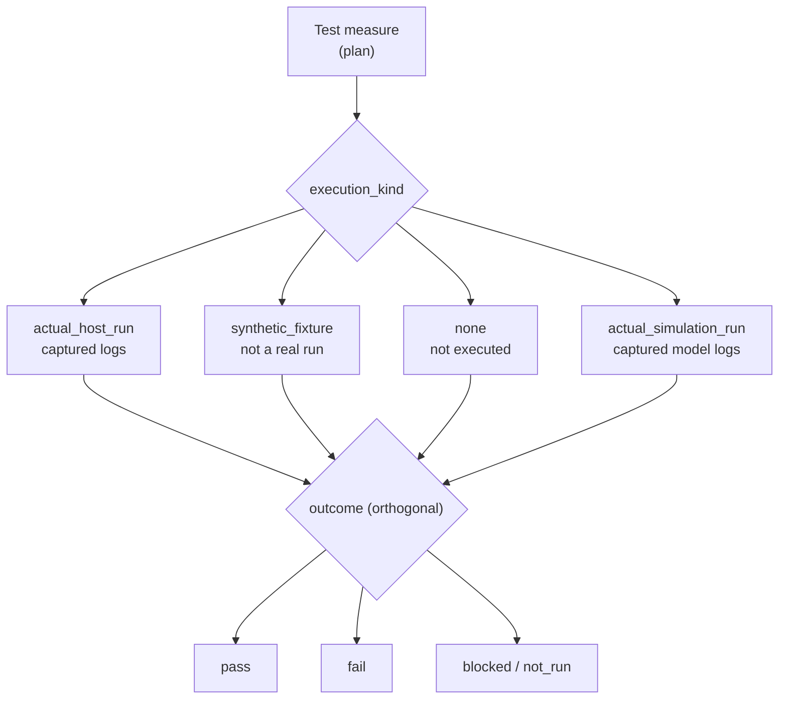

# Verification and validation — measures, executions, evidence (generated view)

Generated: 2026-10-05T13:19:34Z | Baseline: BAS-REF-001 | 323 artifacts, 599 links

## Provenance and status of this file

- **Derived, not authored.** Every table and section below is generated by
  `docs/artifacts/tools/corpus.py cmd_render` from the canonical JSON records. This file contains no
  hand-written engineering content and is not an independent source of truth.
- **Regenerable.** Re-run `python3 docs/artifacts/tools/corpus.py render` to
  reproduce it. Edit the canonical record, never this file.
- **Scope of this view:** The `verification` domain: every test measure and every execution record, with `execution_kind` and `outcome` shown as the orthogonal pair they are.
- **Guard fields.** Every record shown below is printed with its own
  `profile`, `origin`, `human_approval_status` and `production_authorized`
  values. Across the whole corpus `human_approval_status` is `pending` and
  `production_authorized` is `false`; `product_verification_credit` is `false`.
  This view does not and cannot change that.
- **Not a conformity claim.** This corpus is synthetic. Nothing here asserts
  ISO 26262 conformity, an ASIL capability level, an Automotive SPICE
  assessment, human review, or human approval.
- **Diagram validation.** Mermaid blocks are checked by
  `mermaid-cli` when it is available on the rendering host; the per-view
  *Diagram validation* section states plainly whether that check ran. An
  unvalidated diagram is never described as validated.

## Execution classification model

`execution_kind` and `outcome` are **orthogonal**: how the run was performed is recorded separately from what it concluded. A synthetic fixture can legitimately report `pass`, and that pass is not product evidence. Generated consistency-check results validate the corpus, not the BMS product.

| execution_kind | meaning |
|---|---|
| `none` | not executed |
| `actual_host_run` | executed on a real host, logs captured |
| `actual_simulation_run` | executed model with captured logs |
| `actual_target_hardware_run` | executed on the product's own target hardware; the only member that is product-hardware evidence |
| `synthetic_fixture` | fixture, never a real run |

| outcome | meaning |
|---|---|
| `pass` | as defined by the execution schema |
| `fail` | as defined by the execution schema |
| `inconclusive` | as defined by the execution schema |
| `not_run` | as defined by the execution schema |
| `blocked` | as defined by the execution schema |

## Test measures

| Id | Profile | Title | Test type | Oracle basis | Lifecycle | Guard |
|---|---|---|---|---|---|---|
| `FB2-VER-TMS-000001` | as_is | Test: SOA Voltage Limit Detection | unit | source_grounded | reviewed | profile=`as_is` \| origin=`source_observed` \| human_approval_status=`pending` \| production_authorized=`false` |
| `FB2-VER-TMS-000001` | synthetic_reference | Test: SOA Voltage Limit Detection | unit | synthetic_assumption | reviewed | profile=`synthetic_reference` \| origin=`synthetic` \| human_approval_status=`pending` \| production_authorized=`false` |
| `FB2-VER-TMS-000002` | as_is | Test: Contactor State Machine and Fault Response | unit | source_grounded | reviewed | profile=`as_is` \| origin=`source_observed` \| human_approval_status=`pending` \| production_authorized=`false` |
| `FB2-VER-TMS-000002` | synthetic_reference | Test: Contactor State Machine Fault Response | unit | synthetic_assumption | reviewed | profile=`synthetic_reference` \| origin=`synthetic` \| human_approval_status=`pending` \| production_authorized=`false` |
| `FB2-VER-TMS-000003` | as_is | Test: AFE Cell Voltage Plausibility Checks | unit | source_grounded | reviewed | profile=`as_is` \| origin=`source_observed` \| human_approval_status=`pending` \| production_authorized=`false` |
| `FB2-VER-TMS-000003` | synthetic_reference | Test: AFE Cell Voltage Plausibility Checks | unit | synthetic_assumption | reviewed | profile=`synthetic_reference` \| origin=`synthetic` \| human_approval_status=`pending` \| production_authorized=`false` |
| `FB2-VER-TMS-000004` | as_is | Test: LTC6813-1 AFE Driver Communication and Measurement | unit | source_grounded | reviewed | profile=`as_is` \| origin=`source_observed` \| human_approval_status=`pending` \| production_authorized=`false` |
| `FB2-VER-TMS-000004` | synthetic_reference | Test: Independent Voltage Monitor Reaction | fault_injection | synthetic_assumption | reviewed | profile=`synthetic_reference` \| origin=`synthetic` \| human_approval_status=`pending` \| production_authorized=`false` |
| `FB2-VER-TMS-000005` | as_is | Test: Contactor Driver Configuration and Control | unit | source_grounded | reviewed | profile=`as_is` \| origin=`source_observed` \| human_approval_status=`pending` \| production_authorized=`false` |
| `FB2-VER-TMS-000005` | synthetic_reference | Test: AFE Communication Integrity | robustness | synthetic_assumption | reviewed | profile=`synthetic_reference` \| origin=`synthetic` \| human_approval_status=`pending` \| production_authorized=`false` |
| `FB2-VER-TMS-000006` | synthetic_reference | Test: Contactor Driver Configuration and Control | unit | synthetic_assumption | reviewed | profile=`synthetic_reference` \| origin=`synthetic` \| human_approval_status=`pending` \| production_authorized=`false` |
| `FB2-VER-TMS-000007` | synthetic_reference | Test: Software Integration Chain (SOA-Database-Contactor) | integration | synthetic_assumption | draft | profile=`synthetic_reference` \| origin=`synthetic` \| human_approval_status=`pending` \| production_authorized=`false` |
| `FB2-VER-TMS-000008` | synthetic_reference | Test: System Qualification (Cell-Voltage Safety Chain) | qualification | synthetic_assumption | draft | profile=`synthetic_reference` \| origin=`synthetic` \| human_approval_status=`pending` \| production_authorized=`false` |
| `FB2-VER-TMS-000009` | synthetic_reference | Test: Stakeholder Validation (Cell-Voltage Use Cases) | validation | synthetic_assumption | draft | profile=`synthetic_reference` \| origin=`synthetic` \| human_approval_status=`pending` \| production_authorized=`false` |
| `FB2-VER-TMS-000010` | synthetic_reference | Test: Component Verification (SOA Monitor + DIAG Callbacks) | unit | synthetic_assumption | draft | profile=`synthetic_reference` \| origin=`synthetic` \| human_approval_status=`pending` \| production_authorized=`false` |
| `FB2-VER-TMS-000011` | synthetic_reference | Test: HIL Fault Reaction (Target) | system | synthetic_assumption | draft | profile=`synthetic_reference` \| origin=`synthetic` \| human_approval_status=`pending` \| production_authorized=`false` |
| `FB2-VER-TMS-000012` | synthetic_reference | Validation: charging a healthy pack at the limit does not cause a spurious safety reaction (stakeho… | validation | synthetic_assumption | draft | profile=`synthetic_reference` \| origin=`synthetic` \| human_approval_status=`pending` \| production_authorized=`false` |
| `FB2-VER-TMS-000013` | synthetic_reference | Validation: the driver's usable experience after a genuine overvoltage reaction (operational scenar… | validation | synthetic_assumption | draft | profile=`synthetic_reference` \| origin=`synthetic` \| human_approval_status=`pending` \| production_authorized=`false` |
| `FB2-VER-TMS-000014` | synthetic_reference | Validation: degraded operation remains usable and is announced before it becomes a hard stop (opera… | validation | analytical_model | draft | profile=`synthetic_reference` \| origin=`synthetic` \| human_approval_status=`pending` \| production_authorized=`false` |
| `FB2-VER-TMS-000015` | synthetic_reference | Validation: the service technician can commission and service the item without being able to energi… | validation | synthetic_assumption | draft | profile=`synthetic_reference` \| origin=`synthetic` \| human_approval_status=`pending` \| production_authorized=`false` |
| `FB2-VER-TMS-000016` | synthetic_reference | Verification: an unauthenticated peer is refused service, and an authenticated session's payload is… | robustness | source_grounded | draft | profile=`synthetic_reference` \| origin=`synthetic` \| human_approval_status=`pending` \| production_authorized=`false` |
| `FB2-VER-TMS-000017` | synthetic_reference | Verification: a peer holding the maximum permitted connections open and silent does not deny servic… | robustness | analytical_model | draft | profile=`synthetic_reference` \| origin=`synthetic` \| human_approval_status=`pending` \| production_authorized=`false` |
| `FB2-VER-TMS-000018` | synthetic_reference | Verification: a bus peer without the shared secret cannot present a frame the dispatch layer accepts | robustness | source_grounded | draft | profile=`synthetic_reference` \| origin=`synthetic` \| human_approval_status=`pending` \| production_authorized=`false` |
| `FB2-VER-TMS-000019` | synthetic_reference | Verification: the serial link acts only on authenticated frames, and the XOFF/XON byte values are d… | robustness | source_grounded | draft | profile=`synthetic_reference` \| origin=`synthetic` \| human_approval_status=`pending` \| production_authorized=`false` |
| `FB2-VER-TMS-000020` | synthetic_reference | Verification: the initial sequence number is unpredictable across connections and power cycles, and… | robustness | synthetic_assumption | draft | profile=`synthetic_reference` \| origin=`synthetic` \| human_approval_status=`pending` \| production_authorized=`false` |
| `FB2-VER-TMS-000021` | synthetic_reference | Test: every transferred cell-voltage value is integrity-checked before any decision consumes it, an… | integration | source_grounded | draft | profile=`synthetic_reference` \| origin=`synthetic` \| human_approval_status=`pending` \| production_authorized=`false` |
| `FB2-VER-TMS-000022` | synthetic_reference | Test: the configured measurement period yields at least the acquisition rate FB2-SYS-SYR-000001 req… | qualification | analytical_model | draft | profile=`synthetic_reference` \| origin=`synthetic` \| human_approval_status=`pending` \| production_authorized=`false` |
| `FB2-VER-TMS-000023` | synthetic_reference | Test: an excursion into each safe-operating-area tier produces the graded reaction the pinned sourc… | integration | source_grounded | draft | profile=`synthetic_reference` \| origin=`synthetic` \| human_approval_status=`pending` \| production_authorized=`false` |
| `FB2-VER-TMS-000024` | synthetic_reference | Test: the debounce and the degraded-to-fault boundary FB2-SYS-SYR-000002 demands, against an explic… | unit | synthetic_assumption | draft | profile=`synthetic_reference` \| origin=`synthetic` \| human_approval_status=`pending` \| production_authorized=`false` |
| `FB2-VER-TMS-000025` | synthetic_reference | Test: the end-to-end fault-reaction budget FB2-SYS-SYR-000003 allocates, computed from the waits th… | qualification | analytical_model | draft | profile=`synthetic_reference` \| origin=`synthetic` \| human_approval_status=`pending` \| production_authorized=`false` |
| `FB2-VER-TMS-000026` | synthetic_reference | Test: the limit applied, and the reaction reached, depend on the mode or direction in which the con… | integration | source_grounded | draft | profile=`synthetic_reference` \| origin=`synthetic` \| human_approval_status=`pending` \| production_authorized=`false` |
| `FB2-VER-TMS-000027` | synthetic_reference | Test: the second-barrier voltage monitor FB2-SYS-SYR-000005 requires is separable from the main cha… | qualification | synthetic_assumption | draft | profile=`synthetic_reference` \| origin=`synthetic` \| human_approval_status=`pending` \| production_authorized=`false` |
| `FB2-VER-TMS-000028` | synthetic_reference | Test: a current or temperature measurement whose trust cannot be established is marked invalid befo… | integration | source_grounded | draft | profile=`synthetic_reference` \| origin=`synthetic` \| human_approval_status=`pending` \| production_authorized=`false` |

### FB2-VER-TMS-000001 (as_is) — Test: SOA Voltage Limit Detection

- guard: profile=`as_is` \| origin=`source_observed` \| human_approval_status=`pending` \| production_authorized=`false`
- objective: Verify SOA voltage limit detection accuracy and latency
- referenced requirements: FB2-SAF-FSR-000002; FB2-SW-SWR-000002
- referenced designs: FB2-SW-DSN-000002
- preconditions: SOA module initialized with valid config; Database accessible; Test doubles for DATA_ReadData injected
- expected outcomes: {'signal': 'fault_request', 'expected_value': 'true', 'tolerance': 'exact', 'unit': 'bool'}; {'signal': 'violation_cell_index', 'expected_value': '0', 'tolerance': 'exact', 'unit': 'index'}; {'signal': 'violation_type', 'expected_value': 'OVERVOLTAGE', 'tolerance': 'exact', 'unit': 'enum'}
- tolerances: latency=10 ms, voltage_threshold=1 mV
- timing: max_execution_time_ms=100, setup_time_ms=10, teardown_time_ms=5
- oracle basis: `source_grounded`
- regression selection: Always included in regression suite

### FB2-VER-TMS-000001 (synthetic_reference) — Test: SOA Voltage Limit Detection

- guard: profile=`synthetic_reference` \| origin=`synthetic` \| human_approval_status=`pending` \| production_authorized=`false`
- objective: Verify SOA voltage limit detection accuracy and latency
- referenced requirements: FB2-SAF-FSR-000002; FB2-SW-SWR-000002
- referenced designs: FB2-SW-DSN-000002
- preconditions: Module initialized with valid config; Test doubles injected
- expected outcomes: {'signal': 'fault_request', 'expected_value': 'true', 'tolerance': 'exact', 'unit': 'bool'}; {'signal': 'violation_type', 'expected_value': 'OVERVOLTAGE', 'tolerance': 'exact', 'unit': 'enum'}
- tolerances: value=exact
- timing: max_execution_time_ms=100, setup_time_ms=10, teardown_time_ms=5
- oracle basis: `synthetic_assumption`
- regression selection: Always included in regression suite

### FB2-VER-TMS-000002 (as_is) — Test: Contactor State Machine and Fault Response

- guard: profile=`as_is` \| origin=`source_observed` \| human_approval_status=`pending` \| production_authorized=`false`
- objective: Verify contactor state machine transitions and fault response latency
- referenced requirements: FB2-SAF-FSR-000003; FB2-SW-SWR-000003
- referenced designs: FB2-SW-DSN-000003
- preconditions: Contactor driver initialized; SBC mock injected; Feedback GPIO mocks injected; FRAM mock injected
- expected outcomes: {'signal': 'precharge_coil', 'expected_value': 'energized', 'tolerance': 'exact', 'unit': 'state'}; {'signal': 'main_coil', 'expected_value': 'energized', 'tolerance': 'exact', 'unit': 'state'}; {'signal': 'fault_response_latency', 'expected_value': '< 5', 'tolerance': 'max', 'unit': 'ms'}; {'signal': 'final_state', 'expected_value': 'FAULT_OPEN', 'tolerance': 'exact', 'unit': 'enum'}
- tolerances: fault_latency=5 ms, precharge_timeout=5 s, voltage_threshold=1 V
- timing: max_execution_time_ms=500, setup_time_ms=20, teardown_time_ms=10
- oracle basis: `source_grounded`
- regression selection: Always included in regression suite

### FB2-VER-TMS-000002 (synthetic_reference) — Test: Contactor State Machine Fault Response

- guard: profile=`synthetic_reference` \| origin=`synthetic` \| human_approval_status=`pending` \| production_authorized=`false`
- objective: Verify contactor state machine transitions and fault response latency
- referenced requirements: FB2-SAF-FSR-000003; FB2-SW-SWR-000003
- referenced designs: FB2-SW-DSN-000003
- preconditions: Module initialized with valid config; Test doubles injected
- expected outcomes: {'signal': 'contactor_open_latency_ms', 'expected_value': '<50', 'tolerance': 'exact', 'unit': 'ms'}; {'signal': 'fault_feedback_diag', 'expected_value': 'true', 'tolerance': 'exact', 'unit': 'bool'}
- tolerances: value=exact
- timing: max_execution_time_ms=100, setup_time_ms=10, teardown_time_ms=5
- oracle basis: `synthetic_assumption`
- regression selection: Always included in regression suite

### FB2-VER-TMS-000003 (as_is) — Test: AFE Cell Voltage Plausibility Checks

- guard: profile=`as_is` \| origin=`source_observed` \| human_approval_status=`pending` \| production_authorized=`false`
- objective: Verify AFE cell voltage measurement plausibility validation before database entry
- referenced requirements: FB2-SAF-FSR-000001; FB2-SW-SWR-000001
- referenced designs: FB2-SW-DSN-000001
- preconditions: Module initialized with valid config; Test doubles injected
- expected outcomes: {'signal': 'plausibility_result', 'expected_value': 'pass', 'tolerance': 'exact', 'unit': 'enum'}; {'signal': 'flagged_cell', 'expected_value': 'true', 'tolerance': 'exact', 'unit': 'bool'}
- tolerances: value=exact
- timing: max_execution_time_ms=100, setup_time_ms=10, teardown_time_ms=5
- oracle basis: `source_grounded`
- regression selection: Always included in regression suite

### FB2-VER-TMS-000003 (synthetic_reference) — Test: AFE Cell Voltage Plausibility Checks

- guard: profile=`synthetic_reference` \| origin=`synthetic` \| human_approval_status=`pending` \| production_authorized=`false`
- objective: Verify AFE cell voltage measurement plausibility validation before database entry
- referenced requirements: FB2-SAF-FSR-000001; FB2-SW-SWR-000001; FB2-HW-TSR-000001
- referenced designs: FB2-SW-DSN-000001
- preconditions: Module initialized with valid config; Test doubles injected
- expected outcomes: {'signal': 'plausibility_result', 'expected_value': 'pass', 'tolerance': 'exact', 'unit': 'enum'}
- tolerances: value=exact
- timing: max_execution_time_ms=100, setup_time_ms=10, teardown_time_ms=5
- oracle basis: `synthetic_assumption`
- regression selection: Always included in regression suite

### FB2-VER-TMS-000004 (as_is) — Test: LTC6813-1 AFE Driver Communication and Measurement

- guard: profile=`as_is` \| origin=`source_observed` \| human_approval_status=`pending` \| production_authorized=`false`
- objective: Verify AFE driver SPI communication integrity and cell voltage measurement accuracy
- referenced requirements: FB2-HW-TSR-000001; FB2-HW-TSR-000002
- referenced designs: -
- preconditions: Module initialized with valid config; Test doubles injected
- expected outcomes: {'signal': 'cell_voltage_mv', 'expected_value': '3300', 'tolerance': '±1.5 mV', 'unit': 'mV'}; {'signal': 'pec_error', 'expected_value': 'true', 'tolerance': 'exact', 'unit': 'bool'}
- tolerances: value=exact
- timing: max_execution_time_ms=100, setup_time_ms=10, teardown_time_ms=5
- oracle basis: `source_grounded`
- regression selection: Always included in regression suite

### FB2-VER-TMS-000004 (synthetic_reference) — Test: Independent Voltage Monitor Reaction

- guard: profile=`synthetic_reference` \| origin=`synthetic` \| human_approval_status=`pending` \| production_authorized=`false`
- objective: Verify independent monitor detects overvoltage and opens contactors on diverse path
- referenced requirements: FB2-SAF-FSR-000004; FB2-HW-TSR-000004
- referenced designs: -
- preconditions: Module initialized with valid config; Test doubles injected
- expected outcomes: {'signal': 'independent_open_latency_ms', 'expected_value': '<80', 'tolerance': 'exact', 'unit': 'ms'}; {'signal': 'path_independent', 'expected_value': 'true', 'tolerance': 'exact', 'unit': 'bool'}
- tolerances: value=exact
- timing: max_execution_time_ms=100, setup_time_ms=10, teardown_time_ms=5
- oracle basis: `synthetic_assumption`
- regression selection: Always included in regression suite

### FB2-VER-TMS-000005 (as_is) — Test: Contactor Driver Configuration and Control

- guard: profile=`as_is` \| origin=`source_observed` \| human_approval_status=`pending` \| production_authorized=`false`
- objective: Verify contactor driver initialization, channel mapping and switch-off safety behavior
- referenced requirements: FB2-HW-TSR-000003
- referenced designs: -
- preconditions: Module initialized with valid config; Test doubles injected
- expected outcomes: {'signal': 'contactor_state', 'expected_value': 'on', 'tolerance': 'exact', 'unit': 'enum'}; {'signal': 'all_off', 'expected_value': 'true', 'tolerance': 'exact', 'unit': 'bool'}
- tolerances: value=exact
- timing: max_execution_time_ms=100, setup_time_ms=10, teardown_time_ms=5
- oracle basis: `source_grounded`
- regression selection: Always included in regression suite

### FB2-VER-TMS-000005 (synthetic_reference) — Test: AFE Communication Integrity

- guard: profile=`synthetic_reference` \| origin=`synthetic` \| human_approval_status=`pending` \| production_authorized=`false`
- objective: Verify AFE SPI communication integrity under frame corruption
- referenced requirements: FB2-HW-TSR-000002
- referenced designs: -
- preconditions: Module initialized with valid config; Test doubles injected
- expected outcomes: {'signal': 'pec_error', 'expected_value': 'true', 'tolerance': 'exact', 'unit': 'bool'}; {'signal': 'afe_diag_entry', 'expected_value': 'true', 'tolerance': 'exact', 'unit': 'bool'}
- tolerances: value=exact
- timing: max_execution_time_ms=100, setup_time_ms=10, teardown_time_ms=5
- oracle basis: `synthetic_assumption`
- regression selection: Always included in regression suite

### FB2-VER-TMS-000006 (synthetic_reference) — Test: Contactor Driver Configuration and Control

- guard: profile=`synthetic_reference` \| origin=`synthetic` \| human_approval_status=`pending` \| production_authorized=`false`
- objective: Verify contactor driver initialization, channel mapping and switch-off safety behavior
- referenced requirements: FB2-HW-TSR-000003
- referenced designs: -
- preconditions: Module initialized with valid config; Test doubles injected
- expected outcomes: {'signal': 'all_off', 'expected_value': 'true', 'tolerance': 'exact', 'unit': 'bool'}
- tolerances: value=exact
- timing: max_execution_time_ms=100, setup_time_ms=10, teardown_time_ms=5
- oracle basis: `synthetic_assumption`
- regression selection: Always included in regression suite

### FB2-VER-TMS-000007 (synthetic_reference) — Test: Software Integration Chain (SOA-Database-Contactor)

- guard: profile=`synthetic_reference` \| origin=`synthetic` \| human_approval_status=`pending` \| production_authorized=`false`
- objective: Define the software integration verification intent for the SOA-database-contactor chain; PLANNING STUB — no execution performed, execution blocked (no integration harness in corpus scope)
- referenced requirements: FB2-SW-SWR-000001; FB2-SW-SWR-000002; FB2-SW-SWR-000003
- referenced designs: FB2-SW-DSN-000001; FB2-SW-DSN-000002; FB2-SW-DSN-000003
- preconditions: SOA, database and contactor units available as host builds; Integration harness defined (blocked — not in corpus scope)
- expected outcomes: {'signal': 'chain_fault_to_open_verified', 'expected_value': 'true', 'tolerance': 'exact', 'unit': 'bool'}
- tolerances: value=exact
- timing: max_execution_time_ms=1000, setup_time_ms=100, teardown_time_ms=50
- oracle basis: `synthetic_assumption`
- regression selection: Include once integration harness exists

### FB2-VER-TMS-000008 (synthetic_reference) — Test: System Qualification (Cell-Voltage Safety Chain)

- guard: profile=`synthetic_reference` \| origin=`synthetic` \| human_approval_status=`pending` \| production_authorized=`false`
- objective: Define the system/software qualification verification intent against FSR-001..004 end to end; PLANNING STUB — no execution performed, execution blocked (no qualification harness or target hardware in corpus scope)
- referenced requirements: FB2-SAF-FSR-000001; FB2-SAF-FSR-000002; FB2-SAF-FSR-000003; FB2-SAF-FSR-000004
- referenced designs: FB2-SW-DSN-000001; FB2-SW-DSN-000002; FB2-SW-DSN-000003
- preconditions: Integrated system build available (blocked — not in corpus scope); Qualification environment defined (blocked)
- expected outcomes: {'signal': 'qual_chain_pass', 'expected_value': 'true', 'tolerance': 'exact', 'unit': 'bool'}
- tolerances: value=exact
- timing: max_execution_time_ms=5000, setup_time_ms=500, teardown_time_ms=100
- oracle basis: `synthetic_assumption`
- regression selection: Include once qualification environment exists

### FB2-VER-TMS-000009 (synthetic_reference) — Test: Stakeholder Validation (Cell-Voltage Use Cases)

- guard: profile=`synthetic_reference` \| origin=`synthetic` \| human_approval_status=`pending` \| production_authorized=`false`
- objective: Define the validation intent of cell-voltage stakeholder use cases on the integrated system; PLANNING STUB — no execution performed, execution blocked (no validation environment or operational data in corpus scope)
- referenced requirements: FB2-SAF-SGO-000001; FB2-MAN-SCO-000001
- referenced designs: -
- preconditions: Stakeholder use cases baselined; Validation environment defined (blocked — not in corpus scope)
- expected outcomes: {'signal': 'validation_accepted', 'expected_value': 'true', 'tolerance': 'exact', 'unit': 'bool'}
- tolerances: value=exact
- timing: max_execution_time_ms=60000, setup_time_ms=5000, teardown_time_ms=1000
- oracle basis: `synthetic_assumption`
- regression selection: Include once validation environment exists

### FB2-VER-TMS-000010 (synthetic_reference) — Test: Component Verification (SOA Monitor + DIAG Callbacks)

- guard: profile=`synthetic_reference` \| origin=`synthetic` \| human_approval_status=`pending` \| production_authorized=`false`
- objective: Define the component-level verification intent for the SOA monitor plus DIAG callback chain; PLANNING STUB — no execution performed, execution blocked (no component harness in corpus scope)
- referenced requirements: FB2-SW-SWR-000002
- referenced designs: FB2-SW-DSN-000002
- preconditions: SOA and DIAG units available as host builds; Component harness defined (blocked — not in corpus scope)
- expected outcomes: {'expected_value': 'true', 'signal': 'component_reaction_verified', 'tolerance': 'exact', 'unit': 'bool'}
- tolerances: value=exact
- timing: max_execution_time_ms=1000, setup_time_ms=100, teardown_time_ms=50
- oracle basis: `synthetic_assumption`
- regression selection: Include once component harness exists

### FB2-VER-TMS-000011 (synthetic_reference) — Test: HIL Fault Reaction (Target)

- guard: profile=`synthetic_reference` \| origin=`synthetic` \| human_approval_status=`pending` \| production_authorized=`false`
- objective: Define the HIL verification intent for the cell-voltage safety chain on target hardware; PLANNING STUB — no execution performed, execution blocked (tests/hil placeholder only, no target hardware in corpus scope)
- referenced requirements: FB2-SAF-FSR-000001; FB2-SAF-FSR-000002; FB2-SAF-FSR-000003; FB2-SAF-FSR-000004
- referenced designs: FB2-SW-DSN-000001; FB2-SW-DSN-000002; FB2-SW-DSN-000003
- preconditions: HIL bench available (blocked — unpublished upstream); Target program built with coverage instrumentation (blocked)
- expected outcomes: {'expected_value': 'true', 'signal': 'hil_reaction_verified', 'tolerance': 'exact', 'unit': 'bool'}
- tolerances: value=exact
- timing: max_execution_time_ms=60000, setup_time_ms=5000, teardown_time_ms=1000
- oracle basis: `synthetic_assumption`
- regression selection: Include once HIL bench exists

### FB2-VER-TMS-000012 (synthetic_reference) — Validation: charging a healthy pack at the limit does not cause a spurious safety reaction (stakeholder intent: pack manufacturer)

- guard: profile=`synthetic_reference` \| origin=`synthetic` \| human_approval_status=`pending` \| production_authorized=`false`
- objective: Confirm that a pack operated correctly at its published charge limit produces no spurious safe-state reaction over a full charge, because the pack manufacturer's stated need is that the item does not reduce usable capacity through false reactions. This is a false-reaction validation: it does not test that the item detects a real violation (FB2-VER-TMS-000005 does that) but that it stays quiet whe…
- referenced requirements: FB2-SYS-NED-000001; FB2-SAF-SGO-000001
- referenced designs: -
- preconditions: The item is fitted to the declared pack configuration and its configuration data matches the pack's build record.; The cell voltages, temperatures and the pack current are logged at a rate that resolves 100 ms.; The charger respects the charge limits the item publishes (FB2-ASM-003).
- expected outcomes: {'signal': 'fault_reaction_count', 'expected_value': '0', 'tolerance': 'exact', 'unit': 'count'}; {'signal': 'delivered_capacity_fraction', 'expected_value': '98', 'tolerance': 'at least', 'unit': '%'}; {'signal': 'diagnosis_entries_forcing_safe_state', 'expected_value': '0', 'tolerance': 'exact', 'unit': 'entries'}
- tolerances: delivered_capacity_fraction=0.98, false_reaction_count=0
- timing: max_execution_time_ms=3600000, setup_time_ms=1800000, teardown_time_ms=600000
- oracle basis: `synthetic_assumption`
- regression selection: Re-run whenever the debounce, the limit set, the plausibility limits or the measurement path changes, and once per pack build. This is the single measure that detects a false reaction, so it is not a sample-only regression.

### FB2-VER-TMS-000013 (synthetic_reference) — Validation: the driver's usable experience after a genuine overvoltage reaction (operational scenario OS-002, traction discharge)

- guard: profile=`synthetic_reference` \| origin=`synthetic` \| human_approval_status=`pending` \| production_authorized=`false`
- objective: Confirm that when a genuine overvoltage reaction occurs while the vehicle is being driven, the outcome is the one the end-user driver stakeholder needs: the pack is isolated, the vehicle coasts to a stop under its own control, and the driver is told what happened in terms that do not require a diagnostic engineer to interpret. This measure exists because the master prompt warns that disconnecting…
- referenced requirements: FB2-SYS-NED-000003; FB2-SAF-SGO-000001
- referenced designs: -
- preconditions: The pack, vehicle and charger are real (hypothetical) installations, not a bench.; A driver representative from the declared end-user class is available and has not been briefed on what the item will do.; A logging setup captures the driver-facing indication, not only the internal state.
- expected outcomes: {'signal': 'contactor_open_time', 'expected_value': '100', 'tolerance': 'at most', 'unit': 'ms'}; {'signal': 'steering_and_brake_assist_retained', 'expected_value': 'true', 'tolerance': 'exact', 'unit': 'bool'}; {'signal': 'driver_indication_states_the_cause', 'expected_value': 'true', 'tolerance': 'exact', 'unit': 'bool'}
- tolerances: safe_state_reached_ms=100, unexplained_indication_count=0
- timing: max_execution_time_ms=3600000, setup_time_ms=1800000, teardown_time_ms=600000
- oracle basis: `synthetic_assumption`
- regression selection: Re-run whenever the fault-reaction logic, the state indication, the latching policy or the mode arbitration changes. It is the only measure that tests whether the mode-dependent reaction is comprehensible, so it is never sampled out.

### FB2-VER-TMS-000014 (synthetic_reference) — Validation: degraded operation remains usable and is announced before it becomes a hard stop (operational scenario: single-channel measurement degradation)

- guard: profile=`synthetic_reference` \| origin=`synthetic` \| human_approval_status=`pending` \| production_authorized=`false`
- objective: Confirm that a measurement-path degradation moves the item into its degraded mode with a capability the pack manufacturer can still use, and that the reduction is announced before the condition becomes a hard stop. The failure this guards against is specific: a degraded mode that silently removes capability, or one that escalates to a full safe state on the first degradation, makes the item unusa…
- referenced requirements: FB2-SYS-NED-000002; FB2-SYS-NED-000005
- referenced designs: -
- preconditions: The pack is at a nominal mid-discharge state with the vehicle stationary.; A channel degradation can be injected without disturbing the cells themselves.; The vehicle control unit is logging the item's published state.
- expected outcomes: {'signal': 'mode_on_first_degradation', 'expected_value': 'DEGRADED', 'tolerance': 'exact', 'unit': 'mode'}; {'signal': 'contactor_control_retained', 'expected_value': 'true', 'tolerance': 'exact', 'unit': 'bool'}; {'signal': 'degraded_indication_latency', 'expected_value': '100', 'tolerance': 'at most', 'unit': 'ms'}
- tolerances: degraded_indication_latency_ms=100, escalation_to_fault_on_first_degradation=0
- timing: max_execution_time_ms=3600000, setup_time_ms=1800000, teardown_time_ms=600000
- oracle basis: `analytical_model`
- regression selection: Re-run whenever a diagnosis severity changes, whenever a degraded mode is added or removed, and whenever the plausibility limits change.

### FB2-VER-TMS-000015 (synthetic_reference) — Validation: the service technician can commission and service the item without being able to energise it incorrectly (operational scenario OS-006, workshop service)

- guard: profile=`synthetic_reference` \| origin=`synthetic` \| human_approval_status=`pending` \| production_authorized=`false`
- objective: Confirm that a service technician following the documented commissioning and service procedure cannot bring the item into a state in which the contactors are commanded closed with open-circuit sensor inputs, and that the procedure's steps are executable in the order given. The stakeholder need is the service class's: a procedure that is technically correct but not executable in sequence causes te…
- referenced requirements: FB2-SYS-NED-000005
- referenced designs: -
- preconditions: The item is unpowered or on a low-voltage service supply with the contactor drivers inhibited.; The service procedure under test exists as an approved document; in this corpus it does not, and this measure is blocked partly for that reason.; Sense leads may be connected or left open without damaging anything, which is an assumption this corpus does not verify.
- expected outcomes: {'signal': 'contactor_close_command_without_sense_leads', 'expected_value': '0', 'tolerance': 'exact', 'unit': 'commands'}; {'signal': 'open_circuit_diagnosed', 'expected_value': 'true', 'tolerance': 'exact', 'unit': 'bool'}; {'signal': 'technician_improvised_steps', 'expected_value': '0', 'tolerance': 'exact', 'unit': 'steps'}
- tolerances: contactor_close_without_leads=0, unassisted_completion=pass
- timing: max_execution_time_ms=3600000, setup_time_ms=1800000, teardown_time_ms=600000
- oracle basis: `synthetic_assumption`
- regression selection: Re-run whenever the commissioning logic, the service interface, the maintenance input or the service procedure changes.

### FB2-VER-TMS-000016 (synthetic_reference) — Verification: an unauthenticated peer is refused service, and an authenticated session's payload is neither readable nor alterable by a passive or active segment observer

- guard: profile=`synthetic_reference` \| origin=`synthetic` \| human_approval_status=`pending` \| production_authorized=`false`
- objective: Confirm that the master software completes no externally reachable network session with a peer that has not authenticated, and that after authentication the session's application payload is neither recoverable in plaintext by an observer on the segment nor modifiable by one. Also confirm that each refusal is diagnosable, because a silent refusal cannot be distinguished from an outage during field…
- referenced requirements: FB2-SAF-SEC-000001
- referenced designs: FB2-SYS-SYR-000007; FB2-SYS-SYR-000008
- preconditions: The service is externally reachable in the configuration under test, which is the hypothetical project's planned commissioning service, not the one that exists in the pinned source.; The item is otherwise in a nominal mode with no active fault.; A capture point exists on the segment.
- expected outcomes: {'signal': 'unauthenticated_sessions', 'expected_value': '0', 'tolerance': 'exact', 'unit': 'sessions'}; {'signal': 'plaintext_payload_bytes_recovered', 'expected_value': '0', 'tolerance': 'exact', 'unit': 'bytes'}; {'signal': 'altered_frames_accepted', 'expected_value': '0', 'tolerance': 'exact', 'unit': 'frames'}; {'signal': 'authentication_latency', 'expected_value': '100', 'tolerance': 'at most', 'unit': 'ms'}; {'signal': 'diagnosis_entries_per_refusal', 'expected_value': '1', 'tolerance': 'exact', 'unit': 'entry'}
- tolerances: altered_frames_accepted=exact, authentication_latency=at most, diagnosis_entries_per_refusal=exact, plaintext_payload_bytes_recovered=exact, unauthenticated_sessions=exact
- timing: max_execution_time_ms=86400000, setup_time_ms=3600000, teardown_time_ms=1800000
- oracle basis: `source_grounded`
- regression selection: Re-run on every change to the service's authentication path, to the cryptographic library, to the key-derivation or storage, and to the session timeout. Also re-run once per release because the acceptance criteria are zero-tolerance and a single regression fails the whole measure.

### FB2-VER-TMS-000017 (synthetic_reference) — Verification: a peer holding the maximum permitted connections open and silent does not deny service to legitimate peers

- guard: profile=`synthetic_reference` \| origin=`synthetic` \| human_approval_status=`pending` \| production_authorized=`false`
- objective: Confirm that a hostile peer cannot make the service unavailable to a legitimate peer by opening the maximum number of permitted connections and sending nothing on them, and that every refusal and every budget breach is diagnosable. This is the measure for the requirement's availability clause; the resource figures it checks are the requirement's own, not figures this measure chooses.
- referenced requirements: FB2-SAF-SEC-000002
- referenced designs: FB2-SYS-SYR-000007; FB2-SYS-SYR-000008
- preconditions: The service under test implements the caps the requirement states.; The hostile peer can hold sockets open without sending data.; The legitimate peer behaves as a legitimate peer.
- expected outcomes: {'signal': 'concurrent_connections_serviced', 'expected_value': '4', 'tolerance': 'at most', 'unit': 'connections'}; {'signal': 'receive_timeout', 'expected_value': '2000', 'tolerance': 'at most', 'unit': 'ms'}; {'signal': 'per_connection_byte_budget', 'expected_value': '65536', 'tolerance': 'at most', 'unit': 'bytes'}; {'signal': 'breach_to_close_time', 'expected_value': '100', 'tolerance': 'at most', 'unit': 'ms'}; {'signal': 'legitimate_connections_per_hour_under_exhaustion', 'expected_value': '1', 'tolerance': 'at least', 'unit': 'connections/hour'}
- tolerances: breach_to_close_time=at most, concurrent_connections_serviced=at most, legitimate_connections_per_hour_under_exhaustion=at least, per_connection_byte_budget=at most, receive_timeout=at most
- timing: max_execution_time_ms=86400000, setup_time_ms=3600000, teardown_time_ms=1800000
- oracle basis: `analytical_model`
- regression selection: Re-run on any change to the connection limit, the timeout, the buffer sizes or the accept loop. This is the measure that would catch the single-deep-queue and discarded-enqueue behaviour the requirement's rationale describes, so it is never sampled out.

### FB2-VER-TMS-000018 (synthetic_reference) — Verification: a bus peer without the shared secret cannot present a frame the dispatch layer accepts

- guard: profile=`synthetic_reference` \| origin=`synthetic` \| human_approval_status=`pending` \| production_authorized=`false`
- objective: Confirm that for every CAN identifier whose payload influences a safety function, a frame carrying a valid identifier but no valid counter, no valid integrity value or the wrong data-length code is rejected before the receive callback is invoked, and that a genuine frame with a sequence error is rejected rather than accepted out of order.
- referenced requirements: FB2-SAF-SEC-000003
- referenced designs: FB2-SYS-SYR-000007; FB2-SYS-SYR-000008
- preconditions: The bus under test carries the item's normal traffic.; The shared secret is held only by the genuine peer and by the item.; The identifiers whose payloads influence a safety function are enumerated.
- expected outcomes: {'signal': 'injected_frames_accepted', 'expected_value': '0', 'tolerance': 'exact', 'unit': 'frames'}; {'signal': 'replayed_frames_accepted', 'expected_value': '0', 'tolerance': 'exact', 'unit': 'frames'}; {'signal': 'short_frames_accepted', 'expected_value': '0', 'tolerance': 'exact', 'unit': 'frames'}; {'signal': 'verification_latency', 'expected_value': '2', 'tolerance': 'at most', 'unit': 'ms'}; {'signal': 'genuine_frames_observed', 'expected_value': '3e6', 'tolerance': 'at least', 'unit': 'frames in the 24 h campaign'}; {'signal': 'genuine_frames_rejected', 'expected_value': '0', 'tolerance': 'exact, over a genuine-frame population of at least 3e6, i.e. a one-sided 95 percent upper bound of 1 per 10^6 genuine frames', 'unit': 'frames'}; {'signal': 'integrity_value_width', 'expected_value': '22', 'tolerance': 'at least', 'unit': 'bits'}
- tolerances: genuine_frames_observed=at least, genuine_frames_rejected=exact over a population of at least 3e6 frames, injected_frames_accepted=exact, integrity_value_width=at least, replayed_frames_accepted=exact, short_frames_accepted=exact, verification_latency=at most
- timing: max_execution_time_ms=86400000, setup_time_ms=3600000, teardown_time_ms=1800000
- oracle basis: `source_grounded`
- regression selection: Re-run on any change to the identifier set, the counter discipline, the integrity primitive, the key or the dispatch order. A change that removes one check from the dispatch path must re-run this measure and must fail it.

### FB2-VER-TMS-000019 (synthetic_reference) — Verification: the serial link acts only on authenticated frames, and the XOFF/XON byte values are demoted to ordinary payload

- guard: profile=`synthetic_reference` \| origin=`synthetic` \| human_approval_status=`pending` \| production_authorized=`false`
- objective: Confirm that no byte on the serial receive line reaches the application layer without passing a length check and an integrity check, that a structurally valid frame with a modified payload is rejected, that neither 0x13 nor 0x11 can change the transmit-enabled state outside an authenticated frame, and that a receive overflow is diagnosable.
- referenced requirements: FB2-SAF-SEC-000004
- referenced designs: FB2-SYS-SYR-000007; FB2-SYS-SYR-000008
- preconditions: The serial link under test is the link the item uses for its external service interface.; The item is otherwise nominal and no genuine peer is mid-transfer.; The receive queue depth is configured and known.
- expected outcomes: {'signal': 'unframed_bytes_passing', 'expected_value': '0', 'tolerance': 'exact', 'unit': 'bytes'}; {'signal': 'transmit_state_transitions_from_control_bytes', 'expected_value': '0', 'tolerance': 'exact', 'unit': 'transitions'}; {'signal': 'modified_payload_frames_accepted', 'expected_value': '0', 'tolerance': 'exact', 'unit': 'frames'}; {'signal': 'length_mismatch_frames_passed', 'expected_value': '0', 'tolerance': 'exact', 'unit': 'frames'}; {'signal': 'diagnosis_entries_per_overflow', 'expected_value': '1', 'tolerance': 'exact', 'unit': 'entry'}; {'signal': 'genuine_frames_observed', 'expected_value': '3e6', 'tolerance': 'at least', 'unit': 'frames in the 24 h campaign'}; {'signal': 'genuine_frames_rejected', 'expected_value': '0', 'tolerance': 'exact, over a genuine-frame population of at least 3e6, i.e. a one-sided 95 percent upper bound of 1 per 10^6 genuine frames', 'unit': 'frames'}; {'signal': 'integrity_value_width', 'expected_value': '22', 'tolerance': 'at least', 'unit': 'bits'}
- tolerances: diagnosis_entries_per_overflow=exact, genuine_frames_observed=at least, genuine_frames_rejected=exact over a population of at least 3e6 frames, integrity_value_width=at least, length_mismatch_frames_passed=exact, modified_payload_frames_accepted=exact, transmit_state_transitions_from_control_bytes=exact, unframed_bytes_passing=exact
- timing: max_execution_time_ms=86400000, setup_time_ms=3600000, teardown_time_ms=1800000
- oracle basis: `source_grounded`
- regression selection: Re-run on any change to the framing format, the integrity primitive, the key, the queue depth or the parser's resynchronisation behaviour. Any change that makes a byte actionable outside a verified frame must fail this measure.

### FB2-VER-TMS-000020 (synthetic_reference) — Verification: the initial sequence number is unpredictable across connections and power cycles, and the third-party component inventory is evidenced and checked against an advisory source on a stated interval

- guard: profile=`synthetic_reference` \| origin=`synthetic` \| human_approval_status=`pending` \| production_authorized=`false`
- objective: Two clauses with two different oracles, stated separately rather than blended. First: confirm that the initial TCP sequence number takes a distinct value on every one of 1000 connection establishments and that the entropy seed is distinct across 1000 power cycles. Second: confirm that every entry in the component inventory carries either evidenced version information or an explicit null with a st…
- referenced requirements: FB2-SAF-SEC-000005
- referenced designs: FB2-SYS-SYR-000007; FB2-SYS-SYR-000008
- preconditions: The item's network stack is reachable and the source can be inspected for the seed's origin.; A power-cycle fixture exists that records the seed at each boot.; The component inventory exists as a maintained document with an owner.; An authoritative advisory source exists and the project is permitted to consult it. This last precondition is NOT satisfied in this corpus, which is why this measure cannot produce a pass even in principle.
- expected outcomes: {'signal': 'distinct_initial_sequence_numbers', 'expected_value': '1000', 'tolerance': 'exact', 'unit': 'values'}; {'signal': 'distinct_seeds_across_power_cycles', 'expected_value': '1000', 'tolerance': 'exact', 'unit': 'values'}; {'signal': 'build_time_fixed_seeds', 'expected_value': '0', 'tolerance': 'exact', 'unit': 'seeds'}; {'signal': 'inventory_entries_with_version_evidence_or_explicit_null', 'expected_value': '100', 'tolerance': 'at least', 'unit': '%'}; {'signal': 'days_since_last_advisory_check', 'expected_value': '30', 'tolerance': 'at most', 'unit': 'days'}; {'signal': 'matches_without_adjudication', 'expected_value': '0', 'tolerance': 'exact', 'unit': 'matches'}; {'signal': 'entries_with_guessed_version', 'expected_value': '0', 'tolerance': 'exact', 'unit': 'entries'}
- tolerances: build_time_fixed_seeds=exact, days_since_last_advisory_check=at most, distinct_initial_sequence_numbers=exact, distinct_seeds_across_power_cycles=exact, entries_with_guessed_version=exact, inventory_entries_with_version_evidence_or_explicit_null=at least, matches_without_adjudication=exact
- timing: max_execution_time_ms=86400000, setup_time_ms=3600000, teardown_time_ms=1800000
- oracle basis: `synthetic_assumption`
- regression selection: Re-run on any change to the network stack's randomness path, to the seeding procedure, to the boot sequence, and on every advisory check cycle. The inventory half is re-run quarterly regardless of whether the firmware changed, because the vulnerability question changes without the code changing.

### FB2-VER-TMS-000021 (synthetic_reference) — Test: every transferred cell-voltage value is integrity-checked before any decision consumes it, and every published value carries a usable age

- guard: profile=`synthetic_reference` \| origin=`synthetic` \| human_approval_status=`pending` \| production_authorized=`false`
- objective: Confirm two of FB2-SYS-SYR-000001's four acceptance criteria against the pinned source's own mechanism: that the integrity of every transferred value is decided before any decision uses it, and that each published value carries an age that can be read. The integrity criterion is judged against LTC_CheckPec's per-LTC comparison and the fact that a PEC mismatch marks the cell-voltage entry invalid …
- referenced requirements: FB2-SYS-SYR-000001
- referenced designs: FB2-SW-DSN-000001
- preconditions: The reference project's AFE driver is initialised and a measurement cycle has completed at least once.; The database is initialised so that a write stamps the block header.; The AFE plausibility entry is available for the range check.
- expected outcomes: {'signal': 'cycles_with_integrity_decided_before_use', 'expected_value': '100', 'tolerance': 'exact', 'unit': 'cycles'}; {'signal': 'corrupted_frames_consumed_unchallenged', 'expected_value': '0', 'tolerance': 'exact', 'unit': 'frames'}; {'signal': 'published_blocks_with_readable_age', 'expected_value': '100', 'tolerance': 'exact', 'unit': 'blocks'}; {'signal': 'age_monotonic_across_cycles', 'expected_value': 'true', 'tolerance': 'exact', 'unit': 'bool'}
- tolerances: age_monotonic_across_cycles=exact, corrupted_frames_consumed_unchallenged=exact, cycles_with_integrity_decided_before_use=exact, published_blocks_with_readable_age=exact
- timing: max_execution_time_ms=120000, setup_time_ms=60000, teardown_time_ms=30000
- oracle basis: `source_grounded`
- regression selection: Re-run on every change to LTC_CheckPec, to the invalidCellVoltage handling, to the database write path or to the header timestamp update. Also re-run whenever a new decision path is added that reads the cell-voltage block, because this oracle says nothing about how that path uses the invalid flag.

### FB2-VER-TMS-000022 (synthetic_reference) — Test: the configured measurement period yields at least the acquisition rate FB2-SYS-SYR-000001 requires, computed rather than measured

- guard: profile=`synthetic_reference` \| origin=`synthetic` \| human_approval_status=`pending` \| production_authorized=`false`
- objective: Compute whether the reference project's configured measurement period meets the acquisition-rate criterion of FB2-SYS-SYR-000001, and record the arithmetic rather than an observation. The criterion is at least 20 acquisitions per second in every monitoring mode; the parameter registry records the acquisition period as 50 ms (FB2-PRM-000003); 1/0.050 s is 20 per second exactly, so the criterion is…
- referenced requirements: FB2-SYS-SYR-000001
- referenced designs: FB2-SW-DSN-000001
- preconditions: The parameter registry entry for the acquisition period is the authoritative configured value for the reference project.; The measurement is a computation over that value, not a run.
- expected outcomes: {'signal': 'acquisitions_per_second_at_registry_period', 'expected_value': '20', 'tolerance': 'at least', 'unit': 'Hz'}; {'signal': 'margin_above_requirement', 'expected_value': '0', 'tolerance': 'at least', 'unit': 'Hz'}; {'signal': 'longest_period_still_meeting_criterion', 'expected_value': '50', 'tolerance': 'at most', 'unit': 'ms'}
- tolerances: acquisitions_per_second_at_registry_period=at least, longest_period_still_meeting_criterion=at most, margin_above_requirement=at least
- timing: max_execution_time_ms=1000, setup_time_ms=0, teardown_time_ms=0
- oracle basis: `analytical_model`
- regression selection: Re-run whenever the acquisition-period parameter changes, whenever the AFE-triggering task's cycle time changes, and whenever the requirement's rate threshold changes. Also re-run on any change that alters acquisition cost, because a rate that was achievable at the current cost may not remain so.

### FB2-VER-TMS-000023 (synthetic_reference) — Test: an excursion into each safe-operating-area tier produces the graded reaction the pinned source actually configures, and only the safety-limit tier reaches the fault reaction

- guard: profile=`synthetic_reference` \| origin=`synthetic` \| human_approval_status=`pending` \| production_authorized=`false`
- objective: Establish, against the pinned source rather than against the item's output, which of FB2-SYS-SYR-000002's reactions the code can produce. SOA_CheckVoltages compares each string's extremes against three nested tiers per direction - operating, recommended safety and maximum safety - and raises a diagnosis entry per crossed tier; the configuration table then decides what each entry means. Reading th…
- referenced requirements: FB2-SYS-SYR-000002
- referenced designs: FB2-SW-DSN-000002
- preconditions: The reference project's limit configuration is loaded from the parameter registry.; The diagnosis configuration table is the one in the pinned source, which is what determines the grading.
- expected outcomes: {'signal': 'entries_raised_at_operating_limit', 'expected_value': '1', 'tolerance': 'exact', 'unit': 'entries'}; {'signal': 'entries_raised_below_maximum_safety', 'expected_value': '2', 'tolerance': 'exact', 'unit': 'entries'}; {'signal': 'entries_raised_at_maximum_safety', 'expected_value': '3', 'tolerance': 'exact', 'unit': 'entries'}; {'signal': 'tiers_configured_as_fatal_error', 'expected_value': '1', 'tolerance': 'exact', 'unit': 'tiers'}
- tolerances: entries_raised_at_maximum_safety=exact, entries_raised_at_operating_limit=exact, entries_raised_below_maximum_safety=exact, tiers_configured_as_fatal_error=exact
- timing: max_execution_time_ms=60000, setup_time_ms=30000, teardown_time_ms=15000
- oracle basis: `source_grounded`
- regression selection: Re-run on every change to diag_cfg.c, to the diagnosis severity enumeration, to the SOA tier thresholds, or to the SOA comparison structure. Also re-run on any change to the fault-reaction aggregation, because this measure establishes the grading the aggregation then acts on.

### FB2-VER-TMS-000024 (synthetic_reference) — Test: the debounce and the degraded-to-fault boundary FB2-SYS-SYR-000002 demands, against an explicitly labelled synthetic assumption

- guard: profile=`synthetic_reference` \| origin=`synthetic` \| human_approval_status=`pending` \| production_authorized=`false`
- objective: Verify the two parts of FB2-SYS-SYR-000002 that have no counterpart in the pinned source and can therefore only be judged against a stated assumption: that a classification requires two consecutive violations within 100 ms, and that a numerical or named rule separates the degraded reaction from the fault reaction. The oracle is declared a synthetic assumption and the assumption is stated in the r…
- referenced requirements: FB2-SYS-SYR-000002
- referenced designs: FB2-SW-DSN-000002
- preconditions: The assumption about the reference project's debounce behaviour is stated in this record and is not derived from any observation.; The degraded-to-fault boundary is stated as a value to be declared, not as a value that exists.
- expected outcomes: {'signal': 'soa_debounce_state_found_in_source', 'expected_value': '0', 'tolerance': 'exact', 'unit': 'occurrences'}; {'signal': 'consecutive_violations_required_by_requirement', 'expected_value': '2', 'tolerance': 'exact', 'unit': 'violations'}; {'signal': 'verdict_depends_on_declared_assumption_classification_outcome_is_assumption_dependent', 'expected_value': 'true', 'tolerance': 'exact', 'unit': 'bool'}; {'signal': 'degraded_to_fault_boundary_declared_declared_boundary_value', 'expected_value': 'not_declared', 'tolerance': 'exact', 'unit': 'n/a'}
- tolerances: consecutive_violations_required_by_requirement=exact, degraded_to_fault_boundary_declared_declared_boundary_value=exact, soa_debounce_state_found_in_source=exact, verdict_depends_on_declared_assumption_classification_outcome_is_assumption_dependent=exact
- timing: max_execution_time_ms=1000, setup_time_ms=0, teardown_time_ms=0
- oracle basis: `synthetic_assumption`
- regression selection: Re-run when the requirement's debounce parameters change, when the reference project's debounce implementation exists, and whenever the diagnosis layer's occurrence-threshold mechanism is reconfigured - because a configuration change there could make the requirement satisfiable without any new code…

### FB2-VER-TMS-000025 (synthetic_reference) — Test: the end-to-end fault-reaction budget FB2-SYS-SYR-000003 allocates, computed from the waits the pinned source actually configures

- guard: profile=`synthetic_reference` \| origin=`synthetic` \| human_approval_status=`pending` \| production_authorized=`false`
- objective: Compute whether the reaction chain the pinned source implements can close inside the interval FB2-SYS-SYR-000003 allocates, and record the arithmetic. The oracle is the sum of the configured waits the source actually applies between the stages of opening, taken from the application configuration at the pinned commit, compared against the allocated interval and against the contactor-mechanical fig…
- referenced requirements: FB2-SYS-SYR-000003
- referenced designs: FB2-SW-DSN-000003
- preconditions: The application configuration's waits are the ones the pinned source applies.; The parameter registry's contactor-mechanical figure is the reference project's declared figure for the mechanical stage.
- expected outcomes: {'signal': 'earliest_confirmed_open_lower_bound_ms', 'expected_value': 'at least the wait after opening a precharge contactor', 'tolerance': 'at least', 'unit': 'ms'}; {'signal': 'reaction_time_exceeds_allocated_interval_end_to_end_reaction_ms', 'expected_value': 'greater than the allocated interval', 'tolerance': 'outside', 'unit': 'ms'}; {'signal': 'largest_mechanical_time_still_fitting_max_mechanical_time_ms', 'expected_value': 'recorded', 'tolerance': 'exact', 'unit': 'ms'}
- tolerances: earliest_confirmed_open_lower_bound_ms=at least, largest_mechanical_time_still_fitting_max_mechanical_time_ms=exact, reaction_time_exceeds_allocated_interval_end_to_end_reaction_ms=outside
- timing: max_execution_time_ms=1000, setup_time_ms=0, teardown_time_ms=0
- oracle basis: `analytical_model`
- regression selection: Re-run on every change to the application's configured waits, to the task cycle time, to the contactor-mechanical parameter, or to the interval the requirement allocates. This measure is the corpus's early-warning indicator for a timing-budget contradiction between the requirement and the configura…

### FB2-VER-TMS-000026 (synthetic_reference) — Test: the limit applied, and the reaction reached, depend on the mode or direction in which the condition occurs

- guard: profile=`synthetic_reference` \| origin=`synthetic` \| human_approval_status=`pending` \| production_authorized=`false`
- objective: Confirm that FB2-SYS-SYR-000004's core claim is falsifiable against the pinned source: that the limit applied and the reaction reached are selected by the mode or direction rather than fixed. Two independent mechanisms in the source select on mode or direction. SOA_CheckTemperatures chooses between a discharge tier set and a charge tier set from the sign of the string current, so the same tempera…
- referenced requirements: FB2-SYS-SYR-000004
- referenced designs: FB2-SW-DSN-000002
- preconditions: The reference project's limit configuration is loaded.; The application's state machine is initialised in the uninitialised state.
- expected outcomes: {'signal': 'distinct_reaction_sets_by_direction', 'expected_value': 'true', 'tolerance': 'exact', 'unit': 'bool'}; {'signal': 'initialisation_accepted_in_uninitialised_state', 'expected_value': 'true', 'tolerance': 'exact', 'unit': 'bool'}; {'signal': 'initialisation_refused_after_initialisation', 'expected_value': 'true', 'tolerance': 'exact', 'unit': 'bool'}; {'signal': 'refusal_reason_attributable_to_state', 'expected_value': 'true', 'tolerance': 'exact', 'unit': 'bool'}
- tolerances: distinct_reaction_sets_by_direction=exact, initialisation_accepted_in_uninitialised_state=exact, initialisation_refused_after_initialisation=exact, refusal_reason_attributable_to_state=exact
- timing: max_execution_time_ms=90000, setup_time_ms=30000, teardown_time_ms=15000
- oracle basis: `source_grounded`
- regression selection: Re-run on every change to the temperature tier selection, to the request admissibility rules, to the application's state enumeration, or on any addition of a mode. Also re-run whenever a mode is added, because this measure can only check the modes the code actually branches on and a new mode is exa…

### FB2-VER-TMS-000027 (synthetic_reference) — Test: the second-barrier voltage monitor FB2-SYS-SYR-000005 requires is separable from the main chain in every one of the four declared ways

- guard: profile=`synthetic_reference` \| origin=`synthetic` \| human_approval_status=`pending` \| production_authorized=`false`
- objective: Verify FB2-SYS-SYR-000005's four independence criteria - zero processing resources, zero shared supply rails, zero shared communication paths and a stated threshold accuracy - against an explicitly labelled synthetic assumption, because the element the requirement describes does not exist in either profile and cannot be inspected. The assumption is the declared one the corpus already carries for …
- referenced requirements: FB2-SYS-SYR-000005
- referenced designs: -
- preconditions: The assumption that the second barrier is implementable with a separate divider, comparator and reference is the one the corpus already declares for this element, and is adopted here unchanged rather than restated as if it were derived.; No hardware design package for the barrier exists in this corpus.
- expected outcomes: {'signal': 'independence_requirements_enumerated', 'expected_value': '4', 'tolerance': 'exact', 'unit': 'requirements'}; {'signal': 'independence_requirements_with_evidence_in_corpus', 'expected_value': '0', 'tolerance': 'exact', 'unit': 'requirements'}; {'signal': 'accuracy_allocation_measured_threshold_accuracy_mV_measured', 'expected_value': 'not_measured', 'tolerance': 'exact', 'unit': 'mV'}
- tolerances: accuracy_allocation_measured_threshold_accuracy_mv_measured=exact, independence_requirements_enumerated=exact, independence_requirements_with_evidence_in_corpus=exact
- timing: max_execution_time_ms=1000, setup_time_ms=0, teardown_time_ms=0
- oracle basis: `synthetic_assumption`
- regression selection: Not a regression measure in its present form, because there is nothing to regress against. Re-run when a hardware design package for the barrier exists, when any measurement of it is taken, or when the declared assumption changes - and in all three cases it must be re-authored rather than merely re…

### FB2-VER-TMS-000028 (synthetic_reference) — Test: a current or temperature measurement whose trust cannot be established is marked invalid before any supervisory comparison consumes it

- guard: profile=`synthetic_reference` \| origin=`synthetic` \| human_approval_status=`pending` \| production_authorized=`false`
- objective: Confirm FB2-SYS-SYR-000006's validity-marking and envelope-check criteria against the pinned source. Two independent gates are available. On the acquisition side, the current-sensor receive callback sets the per-string invalidMeasurement flag on every channel error it handles and clears it on reset, so an untrusted measurement is marked at the boundary rather than at the consumer. On the consumpt…
- referenced requirements: FB2-SYS-SYR-000006
- referenced designs: FB2-SW-DSN-000002
- preconditions: The current-sensor receive callback is linked so that channel-error handling can be driven.; The SOA module is linked with the database write path so that the invalid flags it reads are the ones the callback writes.
- expected outcomes: {'signal': 'invalid_flag_set_at_acquisition_boundary', 'expected_value': 'true', 'tolerance': 'exact', 'unit': 'bool'}; {'signal': 'limit_entries_raised_while_invalid', 'expected_value': '0', 'tolerance': 'exact', 'unit': 'entries'}; {'signal': 'limit_entries_raised_after_validity_restored', 'expected_value': 'at least 1', 'tolerance': 'at least', 'unit': 'entries'}; {'signal': 'temperature_tiers_selected_by_direction', 'expected_value': 'true', 'tolerance': 'exact', 'unit': 'bool'}
- tolerances: invalid_flag_set_at_acquisition_boundary=exact, limit_entries_raised_after_validity_restored=at least, limit_entries_raised_while_invalid=exact, temperature_tiers_selected_by_direction=exact
- timing: max_execution_time_ms=90000, setup_time_ms=30000, teardown_time_ms=15000
- oracle basis: `source_grounded`
- regression selection: Re-run on every change to the current-sensor receive callback's error handling, to the SOA module's validity gating, or to the database block layout that carries the invalid flags. Also re-run whenever a new consumer of the current or temperature block is added, because this measure only covers the…

## Executions

| Id | Profile | Test measure | execution_kind | outcome | Lifecycle | Guard |
|---|---|---|---|---|---|---|
| `FB2-VER-EXE-000001` | as_is | `FB2-VER-TMS-000001` | `actual_host_run` | `pass` | reviewed | profile=`as_is` \| origin=`source_observed` \| human_approval_status=`pending` \| production_authorized=`false` |
| `FB2-VER-EXE-000001` | synthetic_reference | `FB2-VER-TMS-000001` | `synthetic_fixture` | `pass` | reviewed | profile=`synthetic_reference` \| origin=`synthetic` \| human_approval_status=`pending` \| production_authorized=`false` |
| `FB2-VER-EXE-000002` | as_is | `FB2-VER-TMS-000002` | `actual_host_run` | `pass` | reviewed | profile=`as_is` \| origin=`source_observed` \| human_approval_status=`pending` \| production_authorized=`false` |
| `FB2-VER-EXE-000002` | synthetic_reference | `FB2-VER-TMS-000002` | `synthetic_fixture` | `pass` | reviewed | profile=`synthetic_reference` \| origin=`synthetic` \| human_approval_status=`pending` \| production_authorized=`false` |
| `FB2-VER-EXE-000003` | as_is | `FB2-VER-TMS-000003` | `actual_host_run` | `pass` | reviewed | profile=`as_is` \| origin=`source_observed` \| human_approval_status=`pending` \| production_authorized=`false` |
| `FB2-VER-EXE-000003` | synthetic_reference | `FB2-VER-TMS-000003` | `synthetic_fixture` | `pass` | reviewed | profile=`synthetic_reference` \| origin=`synthetic` \| human_approval_status=`pending` \| production_authorized=`false` |
| `FB2-VER-EXE-000004` | as_is | `FB2-VER-TMS-000004` | `none` | `blocked` | reviewed | profile=`as_is` \| origin=`source_observed` \| human_approval_status=`pending` \| production_authorized=`false` |
| `FB2-VER-EXE-000004` | synthetic_reference | `FB2-VER-TMS-000004` | `synthetic_fixture` | `pass` | reviewed | profile=`synthetic_reference` \| origin=`synthetic` \| human_approval_status=`pending` \| production_authorized=`false` |
| `FB2-VER-EXE-000005` | as_is | `FB2-VER-TMS-000005` | `actual_host_run` | `pass` | reviewed | profile=`as_is` \| origin=`source_observed` \| human_approval_status=`pending` \| production_authorized=`false` |
| `FB2-VER-EXE-000005` | synthetic_reference | `FB2-VER-TMS-000005` | `synthetic_fixture` | `pass` | reviewed | profile=`synthetic_reference` \| origin=`synthetic` \| human_approval_status=`pending` \| production_authorized=`false` |
| `FB2-VER-EXE-000006` | as_is | `FB2-VER-TMS-000001..000005` | `actual_host_run` | `fail` | reviewed | profile=`as_is` \| origin=`source_observed` \| human_approval_status=`pending` \| production_authorized=`false` |
| `FB2-VER-EXE-000006` | synthetic_reference | `FB2-VER-TMS-000006` | `synthetic_fixture` | `pass` | reviewed | profile=`synthetic_reference` \| origin=`synthetic` \| human_approval_status=`pending` \| production_authorized=`false` |
| `FB2-VER-EXE-000007` | as_is | `FB2-VER-TMS-000001..000005` | `actual_host_run` | `fail` | reviewed | profile=`as_is` \| origin=`source_observed` \| human_approval_status=`pending` \| production_authorized=`false` |
| `FB2-VER-EXE-000007` | synthetic_reference | `FB2-VER-TMS-000007` | `none` | `blocked` | reviewed | profile=`synthetic_reference` \| origin=`synthetic` \| human_approval_status=`pending` \| production_authorized=`false` |
| `FB2-VER-EXE-000008` | as_is | `FB2-VER-TMS-000003` | `actual_host_run` | `fail` | reviewed | profile=`as_is` \| origin=`source_observed` \| human_approval_status=`pending` \| production_authorized=`false` |
| `FB2-VER-EXE-000008` | synthetic_reference | `FB2-VER-TMS-000008` | `none` | `blocked` | reviewed | profile=`synthetic_reference` \| origin=`synthetic` \| human_approval_status=`pending` \| production_authorized=`false` |
| `FB2-VER-EXE-000009` | as_is | `FB2-VER-TMS-000003` | `actual_host_run` | `fail` | reviewed | profile=`as_is` \| origin=`source_observed` \| human_approval_status=`pending` \| production_authorized=`false` |
| `FB2-VER-EXE-000009` | synthetic_reference | `FB2-VER-TMS-000009` | `none` | `blocked` | reviewed | profile=`synthetic_reference` \| origin=`synthetic` \| human_approval_status=`pending` \| production_authorized=`false` |
| `FB2-VER-EXE-000010` | as_is | `FB2-VER-TMS-000003` | `actual_host_run` | `fail` | reviewed | profile=`as_is` \| origin=`source_observed` \| human_approval_status=`pending` \| production_authorized=`false` |
| `FB2-VER-EXE-000010` | synthetic_reference | `FB2-VER-TMS-000010` | `none` | `blocked` | reviewed | profile=`synthetic_reference` \| origin=`synthetic` \| human_approval_status=`pending` \| production_authorized=`false` |
| `FB2-VER-EXE-000011` | as_is | `FB2-VER-TMS-000003` | `actual_host_run` | `fail` | reviewed | profile=`as_is` \| origin=`source_observed` \| human_approval_status=`pending` \| production_authorized=`false` |
| `FB2-VER-EXE-000011` | synthetic_reference | `FB2-VER-TMS-000011` | `none` | `blocked` | reviewed | profile=`synthetic_reference` \| origin=`synthetic` \| human_approval_status=`pending` \| production_authorized=`false` |
| `FB2-VER-EXE-000012` | as_is | `FB2-VER-TMS-000003` | `actual_host_run` | `pass` | reviewed | profile=`as_is` \| origin=`source_observed` \| human_approval_status=`pending` \| production_authorized=`false` |
| `FB2-VER-EXE-000012` | synthetic_reference | `FB2-VER-TMS-000012` | `none` | `blocked` | draft | profile=`synthetic_reference` \| origin=`synthetic` \| human_approval_status=`pending` \| production_authorized=`false` |
| `FB2-VER-EXE-000013` | as_is | `FB2-VER-TMS-000003` | `actual_host_run` | `fail` | reviewed | profile=`as_is` \| origin=`source_observed` \| human_approval_status=`pending` \| production_authorized=`false` |
| `FB2-VER-EXE-000013` | synthetic_reference | `FB2-VER-TMS-000013` | `none` | `blocked` | draft | profile=`synthetic_reference` \| origin=`synthetic` \| human_approval_status=`pending` \| production_authorized=`false` |
| `FB2-VER-EXE-000014` | as_is | `FB2-VER-TMS-000003` | `actual_host_run` | `fail` | reviewed | profile=`as_is` \| origin=`source_observed` \| human_approval_status=`pending` \| production_authorized=`false` |
| `FB2-VER-EXE-000014` | synthetic_reference | `FB2-VER-TMS-000014` | `none` | `blocked` | draft | profile=`synthetic_reference` \| origin=`synthetic` \| human_approval_status=`pending` \| production_authorized=`false` |
| `FB2-VER-EXE-000015` | as_is | `FB2-VER-TMS-000001..000005` | `actual_host_run` | `fail` | reviewed | profile=`as_is` \| origin=`source_observed` \| human_approval_status=`pending` \| production_authorized=`false` |
| `FB2-VER-EXE-000015` | synthetic_reference | `FB2-VER-TMS-000015` | `none` | `blocked` | draft | profile=`synthetic_reference` \| origin=`synthetic` \| human_approval_status=`pending` \| production_authorized=`false` |
| `FB2-VER-EXE-000016` | as_is | `FB2-VER-TMS-000004` | `actual_host_run` | `fail` | reviewed | profile=`as_is` \| origin=`source_observed` \| human_approval_status=`pending` \| production_authorized=`false` |
| `FB2-VER-EXE-000016` | synthetic_reference | `FB2-VER-TMS-000016` | `none` | `blocked` | draft | profile=`synthetic_reference` \| origin=`synthetic` \| human_approval_status=`pending` \| production_authorized=`false` |
| `FB2-VER-EXE-000017` | synthetic_reference | `FB2-VER-TMS-000017` | `none` | `blocked` | draft | profile=`synthetic_reference` \| origin=`synthetic` \| human_approval_status=`pending` \| production_authorized=`false` |
| `FB2-VER-EXE-000018` | synthetic_reference | `FB2-VER-TMS-000018` | `none` | `blocked` | draft | profile=`synthetic_reference` \| origin=`synthetic` \| human_approval_status=`pending` \| production_authorized=`false` |
| `FB2-VER-EXE-000019` | synthetic_reference | `FB2-VER-TMS-000019` | `none` | `blocked` | draft | profile=`synthetic_reference` \| origin=`synthetic` \| human_approval_status=`pending` \| production_authorized=`false` |
| `FB2-VER-EXE-000020` | synthetic_reference | `FB2-VER-TMS-000020` | `none` | `blocked` | draft | profile=`synthetic_reference` \| origin=`synthetic` \| human_approval_status=`pending` \| production_authorized=`false` |
| `FB2-VER-EXE-000021` | synthetic_reference | `FB2-VER-TMS-000021` | `none` | `blocked` | draft | profile=`synthetic_reference` \| origin=`synthetic` \| human_approval_status=`pending` \| production_authorized=`false` |
| `FB2-VER-EXE-000022` | synthetic_reference | `FB2-VER-TMS-000022` | `none` | `blocked` | draft | profile=`synthetic_reference` \| origin=`synthetic` \| human_approval_status=`pending` \| production_authorized=`false` |
| `FB2-VER-EXE-000023` | synthetic_reference | `FB2-VER-TMS-000023` | `none` | `blocked` | draft | profile=`synthetic_reference` \| origin=`synthetic` \| human_approval_status=`pending` \| production_authorized=`false` |
| `FB2-VER-EXE-000024` | synthetic_reference | `FB2-VER-TMS-000024` | `none` | `blocked` | draft | profile=`synthetic_reference` \| origin=`synthetic` \| human_approval_status=`pending` \| production_authorized=`false` |
| `FB2-VER-EXE-000025` | synthetic_reference | `FB2-VER-TMS-000025` | `none` | `blocked` | draft | profile=`synthetic_reference` \| origin=`synthetic` \| human_approval_status=`pending` \| production_authorized=`false` |
| `FB2-VER-EXE-000026` | synthetic_reference | `FB2-VER-TMS-000026` | `none` | `blocked` | draft | profile=`synthetic_reference` \| origin=`synthetic` \| human_approval_status=`pending` \| production_authorized=`false` |
| `FB2-VER-EXE-000027` | synthetic_reference | `FB2-VER-TMS-000027` | `none` | `blocked` | draft | profile=`synthetic_reference` \| origin=`synthetic` \| human_approval_status=`pending` \| production_authorized=`false` |
| `FB2-VER-EXE-000028` | synthetic_reference | `FB2-VER-TMS-000028` | `none` | `blocked` | draft | profile=`synthetic_reference` \| origin=`synthetic` \| human_approval_status=`pending` \| production_authorized=`false` |

### Evidence classes present in the corpus

**Real captured host runs (15).** These have captured logs under `docs/artifacts/evidence/actual-runs/` and per-run input/output hashes. They are the only executions in this corpus that constitute captured evidence, and even they are host-platform results, not target-hardware results.

| Id | Profile | execution_kind | outcome | Environment | Captured logs | Guard |
|---|---|---|---|---|---|---|
| `FB2-VER-EXE-000001` | as_is | `actual_host_run` | `pass` | arm64-apple-darwin27 (Apple Silicon Mac, Darwin 27.0.0) | docs/artifacts/evidence/actual-runs/foxbms2-host-unit-test-macos-2026-09-29/logs-strict/tests__unit__app__application__soa__test_soa.txt | profile=`as_is` \| origin=`source_observed` \| human_approval_status=`pending` \| production_authorized=`false` |
| `FB2-VER-EXE-000002` | as_is | `actual_host_run` | `pass` | arm64-apple-darwin27 (Apple Silicon Mac, Darwin 27.0.0) | docs/artifacts/evidence/actual-runs/foxbms2-host-unit-test-macos-2026-09-29/logs-relaxed/tests__unit__app__driver__contactor__test_contactor.txt | profile=`as_is` \| origin=`source_observed` \| human_approval_status=`pending` \| production_authorized=`false` |
| `FB2-VER-EXE-000003` | as_is | `actual_host_run` | `pass` | arm64-apple-darwin27 (Apple Silicon Mac, Darwin 27.0.0) | docs/artifacts/evidence/actual-runs/foxbms2-host-unit-test-macos-2026-09-29/logs-strict/tests__unit__app__driver__afe__api__test_afe_plausibility.txt | profile=`as_is` \| origin=`source_observed` \| human_approval_status=`pending` \| production_authorized=`false` |
| `FB2-VER-EXE-000005` | as_is | `actual_host_run` | `pass` | arm64-apple-darwin27 (Apple Silicon Mac, Darwin 27.0.0) | docs/artifacts/evidence/actual-runs/foxbms2-host-unit-test-macos-2026-09-29/logs-relaxed/tests__unit__app__driver__contactor__test_contactor.txt | profile=`as_is` \| origin=`source_observed` \| human_approval_status=`pending` \| production_authorized=`false` |
| `FB2-VER-EXE-000006` | as_is | `actual_host_run` | `fail` | arm64-apple-darwin27 (Apple Silicon Mac, Darwin 27.0.0) | docs/artifacts/evidence/actual-runs/foxbms2-host-unit-test-macos-2026-09-29/results-strict.json | profile=`as_is` \| origin=`source_observed` \| human_approval_status=`pending` \| production_authorized=`false` |
| `FB2-VER-EXE-000007` | as_is | `actual_host_run` | `fail` | arm64-apple-darwin27 (Apple Silicon Mac, Darwin 27.0.0) | docs/artifacts/evidence/actual-runs/foxbms2-host-unit-test-macos-2026-09-29/results-relaxed.json | profile=`as_is` \| origin=`source_observed` \| human_approval_status=`pending` \| production_authorized=`false` |
| `FB2-VER-EXE-000008` | as_is | `actual_host_run` | `fail` | arm64-apple-darwin27 (Apple Silicon Mac, Darwin 27.0.0) | docs/artifacts/evidence/actual-runs/foxbms2-sil-host-unit-test-macos-2026-09-29/logs-strict/tests__unit__app__application__algorithm__moving_average__test_moving_average.log; docs/artifacts/evidence/actual-runs/foxbms2-sil-host-unit-test-macos-2026-09-29/results-sil-all.json | profile=`as_is` \| origin=`source_observed` \| human_approval_status=`pending` \| production_authorized=`false` |
| `FB2-VER-EXE-000009` | as_is | `actual_host_run` | `fail` | arm64-apple-darwin27 (Apple Silicon Mac, Darwin 27.0.0) | docs/artifacts/evidence/actual-runs/foxbms2-sil-host-unit-test-macos-2026-09-29/logs-strict/tests__unit__app__application__algorithm__state_estimation__soc__lookup-table__test_soc_lookup-table.log; docs/artifacts/evidence/actual-runs/foxbms2-sil-host-unit-test-macos-2026-09-29/results-sil-all.json | profile=`as_is` \| origin=`source_observed` \| human_approval_status=`pending` \| production_authorized=`false` |
| `FB2-VER-EXE-000010` | as_is | `actual_host_run` | `fail` | arm64-apple-darwin27 (Apple Silicon Mac, Darwin 27.0.0) | docs/artifacts/evidence/actual-runs/foxbms2-sil-host-unit-test-macos-2026-09-29/logs-strict/tests__unit__app__application__algorithm__state_estimation__test_state_estimation.log; docs/artifacts/evidence/actual-runs/foxbms2-sil-host-unit-test-macos-2026-09-29/results-sil-all.json | profile=`as_is` \| origin=`source_observed` \| human_approval_status=`pending` \| production_authorized=`false` |
| `FB2-VER-EXE-000011` | as_is | `actual_host_run` | `fail` | arm64-apple-darwin27 (Apple Silicon Mac, Darwin 27.0.0) | docs/artifacts/evidence/actual-runs/foxbms2-sil-host-unit-test-macos-2026-09-29/logs-strict/tests__unit__app__driver__afe__debug__default__test_debug_default.log; docs/artifacts/evidence/actual-runs/foxbms2-sil-host-unit-test-macos-2026-09-29/results-sil-all.json | profile=`as_is` \| origin=`source_observed` \| human_approval_status=`pending` \| production_authorized=`false` |
| `FB2-VER-EXE-000012` | as_is | `actual_host_run` | `pass` | arm64-apple-darwin27 (Apple Silicon Mac, Darwin 27.0.0) | docs/artifacts/evidence/actual-runs/foxbms2-sil-host-unit-test-macos-2026-09-29/logs-strict/tests__unit__app__engine__config__test_diag_cfg.log; docs/artifacts/evidence/actual-runs/foxbms2-sil-host-unit-test-macos-2026-09-29/results-sil-all.json | profile=`as_is` \| origin=`source_observed` \| human_approval_status=`pending` \| production_authorized=`false` |
| `FB2-VER-EXE-000013` | as_is | `actual_host_run` | `fail` | arm64-apple-darwin27 (Apple Silicon Mac, Darwin 27.0.0) | docs/artifacts/evidence/actual-runs/foxbms2-host-unit-test-macos-2026-09-29/logs-relaxed/tests__unit__app__application__redundancy__test_redundancy.txt | profile=`as_is` \| origin=`source_observed` \| human_approval_status=`pending` \| production_authorized=`false` |
| `FB2-VER-EXE-000014` | as_is | `actual_host_run` | `fail` | arm64-apple-darwin27 (Apple Silicon Mac, Darwin 27.0.0) | docs/artifacts/evidence/actual-runs/foxbms2-host-unit-test-macos-2026-09-29/logs-relaxed/tests__unit__app__engine__diag__test_diag.txt | profile=`as_is` \| origin=`source_observed` \| human_approval_status=`pending` \| production_authorized=`false` |
| `FB2-VER-EXE-000015` | as_is | `actual_host_run` | `fail` | arm64-apple-darwin27 (Apple Silicon Mac, Darwin 27.0.0) | docs/artifacts/evidence/actual-runs/foxbms2-sil-host-unit-test-macos-2026-09-29/results-sil-all.json; docs/artifacts/evidence/actual-runs/foxbms2-sil-host-unit-test-macos-2026-09-29/hl-surface.json; docs/artifacts/evidence/actual-runs/foxbms2-sil-host-unit-test-macos-2026-09-29/hal-signatures.json; docs/artifacts/evidence/actual-runs/foxbms2-sil-host-unit-test-macos-2026-09-29/results-sil-halcogen-blocked-200.json; docs/artifacts/evidence/actual-runs/foxbms2-sil-host-unit-test-macos-2026-09-29/REPORT.md; docs/artifacts/evidence/actual-runs/foxbms2-sil-host-unit-test-macos-2026-09-29/RUNBOOK.md; docs/artifacts/evidence/actual-runs/foxbms2-sil-host-unit-test-macos-2026-09-29-task1/RESULTS-TASK1-PRE.json; docs/artifacts/evidence/actual-runs/foxbms2-sil-host-unit-test-macos-2026-09-29-task1/RESULTS-TASK1-POST.json; docs/artifacts/evidence/actual-runs/foxbms2-sil-host-unit-test-macos-2026-09-29-task1/TASK1-CLASSIFICATION.md; docs/artifacts/evidence/actual-runs/foxbms2-sil-host-unit-test-macos-2026-09-29-task1/TASK2-SEGFAULT.md; docs/artifacts/evidence/actual-runs/foxbms2-sil-host-unit-test-macos-2026-09-29-task4/RESULTS-TASK4-BASELINE-PRE.json; docs/artifacts/evidence/actual-runs/foxbms2-sil-host-unit-test-macos-2026-09-29-task4/RESULTS-TASK4-POST.json; docs/artifacts/evidence/actual-runs/foxbms2-sil-host-unit-test-macos-2026-09-29-task4/sweep-TASK4-PRE.log; docs/artifacts/evidence/actual-runs/foxbms2-sil-host-unit-test-macos-2026-09-29-task4/sweep-TASK4-POST.log; docs/artifacts/evidence/actual-runs/foxbms2-sil-host-unit-test-macos-2026-09-29-task4/test_dp83869-pty-crash-trace.txt; docs/artifacts/evidence/verification-env/sil/logs/FINAL.json; docs/artifacts/evidence/verification-env/sil/logs/BEFORE.json; docs/artifacts/evidence/verification-env/sil/RELAXED-DIAGNOSTICS.md; docs/artifacts/evidence/verification-env/sil/tools/sil_cc.py; docs/artifacts/evidence/verification-env/sil/logs/exclusion-verification.json; docs/artifacts/evidence/verification-env/sil/logs/evidence-classifier-nondeterminism-24runs.txt; docs/artifacts/evidence/verification-env/sil/logs/evidence-classifier-flip-detail.txt | profile=`as_is` \| origin=`source_observed` \| human_approval_status=`pending` \| production_authorized=`false` |
| `FB2-VER-EXE-000016` | as_is | `actual_host_run` | `fail` | arm64-apple-darwin27 (Apple Silicon Mac, Darwin 27.0.0) | docs/artifacts/evidence/actual-runs/foxbms2-sil-host-unit-test-macos-2026-09-29/hl-surface.json; docs/artifacts/evidence/actual-runs/foxbms2-sil-host-unit-test-macos-2026-09-29/hal-signatures.json; docs/artifacts/evidence/actual-runs/foxbms2-sil-host-unit-test-macos-2026-09-29/results-sil-halcogen-blocked-200.json; docs/artifacts/evidence/actual-runs/foxbms2-sil-host-unit-test-macos-2026-09-29/REPORT.md; docs/artifacts/evidence/actual-runs/foxbms2-sil-host-unit-test-macos-2026-09-29/RUNBOOK.md | profile=`as_is` \| origin=`source_observed` \| human_approval_status=`pending` \| production_authorized=`false` |

**Synthetic fixtures (6).** `execution_kind=synthetic_fixture` with `outcome=pass`. These are fixtures, not runs. The `evidence/synthetic-fixtures/` directory is the designated home for their captured fixture artefacts; whether it holds them is reported in the verification-evidence report and in `evidence/synthetic-fixtures/`, and is not asserted here.

| Id | Profile | execution_kind | outcome | Distinct input digests | Guard |
|---|---|---|---|---|---|
| `FB2-VER-EXE-000001` | synthetic_reference | `synthetic_fixture` | `pass` | - | profile=`synthetic_reference` \| origin=`synthetic` \| human_approval_status=`pending` \| production_authorized=`false` |
| `FB2-VER-EXE-000002` | synthetic_reference | `synthetic_fixture` | `pass` | - | profile=`synthetic_reference` \| origin=`synthetic` \| human_approval_status=`pending` \| production_authorized=`false` |
| `FB2-VER-EXE-000003` | synthetic_reference | `synthetic_fixture` | `pass` | - | profile=`synthetic_reference` \| origin=`synthetic` \| human_approval_status=`pending` \| production_authorized=`false` |
| `FB2-VER-EXE-000004` | synthetic_reference | `synthetic_fixture` | `pass` | - | profile=`synthetic_reference` \| origin=`synthetic` \| human_approval_status=`pending` \| production_authorized=`false` |
| `FB2-VER-EXE-000005` | synthetic_reference | `synthetic_fixture` | `pass` | - | profile=`synthetic_reference` \| origin=`synthetic` \| human_approval_status=`pending` \| production_authorized=`false` |
| `FB2-VER-EXE-000006` | synthetic_reference | `synthetic_fixture` | `pass` | - | profile=`synthetic_reference` \| origin=`synthetic` \| human_approval_status=`pending` \| production_authorized=`false` |

**Blocked / not executed (23).** `execution_kind=none` with `outcome=blocked`. These record why a run did not happen.

| Id | Profile | execution_kind | outcome | Limitations | Guard |
|---|---|---|---|---|---|
| `FB2-VER-EXE-000004` | as_is | `none` | `blocked` | Not executed: HALCoGen-generated TI headers unavailable on this host; No verification credit for production | profile=`as_is` \| origin=`source_observed` \| human_approval_status=`pending` \| production_authorized=`false` |
| `FB2-VER-EXE-000007` | synthetic_reference | `none` | `blocked` | Integration harness not defined in corpus scope — execution blocked; No verification credit for production | profile=`synthetic_reference` \| origin=`synthetic` \| human_approval_status=`pending` \| production_authorized=`false` |
| `FB2-VER-EXE-000008` | synthetic_reference | `none` | `blocked` | No qualification environment or target hardware in corpus scope — execution blocked; No verification credit for production | profile=`synthetic_reference` \| origin=`synthetic` \| human_approval_status=`pending` \| production_authorized=`false` |
| `FB2-VER-EXE-000009` | synthetic_reference | `none` | `blocked` | No validation environment or operational data in corpus scope — execution blocked; No verification credit for production | profile=`synthetic_reference` \| origin=`synthetic` \| human_approval_status=`pending` \| production_authorized=`false` |
| `FB2-VER-EXE-000010` | synthetic_reference | `none` | `blocked` | Component harness not defined in corpus scope — execution blocked; No verification credit for production | profile=`synthetic_reference` \| origin=`synthetic` \| human_approval_status=`pending` \| production_authorized=`false` |
| `FB2-VER-EXE-000011` | synthetic_reference | `none` | `blocked` | HIL bench unpublished upstream (tests/hil placeholder) — execution blocked; No verification credit for production | profile=`synthetic_reference` \| origin=`synthetic` \| human_approval_status=`pending` \| production_authorized=`false` |
| `FB2-VER-EXE-000012` | synthetic_reference | `none` | `blocked` | No run occurred. duration_ms is 0 because no process started; it is not a measurement.; No output hash is recorded because no output exists. An empty output_hashes map on a blocked execution is the correct state and must not be filled with a placeholder.; This record carries no product verification credit. | profile=`synthetic_reference` \| origin=`synthetic` \| human_approval_status=`pending` \| production_authorized=`false` |
| `FB2-VER-EXE-000013` | synthetic_reference | `none` | `blocked` | No run occurred. duration_ms is 0 because no process started; it is not a measurement.; No output hash is recorded because no output exists. An empty output_hashes map on a blocked execution is the correct state and must not be filled with a placeholder.; This record carries no product verification credit. | profile=`synthetic_reference` \| origin=`synthetic` \| human_approval_status=`pending` \| production_authorized=`false` |
| `FB2-VER-EXE-000014` | synthetic_reference | `none` | `blocked` | No run occurred. duration_ms is 0 because no process started; it is not a measurement.; No output hash is recorded because no output exists. An empty output_hashes map on a blocked execution is the correct state and must not be filled with a placeholder.; This record carries no product verification credit. | profile=`synthetic_reference` \| origin=`synthetic` \| human_approval_status=`pending` \| production_authorized=`false` |
| `FB2-VER-EXE-000015` | synthetic_reference | `none` | `blocked` | No run occurred. duration_ms is 0 because no process started; it is not a measurement.; No output hash is recorded because no output exists. An empty output_hashes map on a blocked execution is the correct state and must not be filled with a placeholder.; This record carries no product verification credit. | profile=`synthetic_reference` \| origin=`synthetic` \| human_approval_status=`pending` \| production_authorized=`false` |
| `FB2-VER-EXE-000016` | synthetic_reference | `none` | `blocked` | No run occurred. duration_ms is 0 because no process started.; No output hash is recorded because no output exists. Filling it with a placeholder would manufacture evidence.; The measure itself carries an oracle basis. A planned oracle is not a verified result, and this record must not be read as evidence that the oracle was ever exercised.; Carries no product verification credit. | profile=`synthetic_reference` \| origin=`synthetic` \| human_approval_status=`pending` \| production_authorized=`false` |
| `FB2-VER-EXE-000017` | synthetic_reference | `none` | `blocked` | No run occurred. duration_ms is 0 because no process started.; No output hash is recorded because no output exists. Filling it with a placeholder would manufacture evidence.; The measure itself carries an oracle basis. A planned oracle is not a verified result, and this record must not be read as evidence that the oracle was ever exercised.; Carries no product verification credit. | profile=`synthetic_reference` \| origin=`synthetic` \| human_approval_status=`pending` \| production_authorized=`false` |
| `FB2-VER-EXE-000018` | synthetic_reference | `none` | `blocked` | No run occurred. duration_ms is 0 because no process started.; No output hash is recorded because no output exists. Filling it with a placeholder would manufacture evidence.; The measure itself carries an oracle basis. A planned oracle is not a verified result, and this record must not be read as evidence that the oracle was ever exercised.; Carries no product verification credit. | profile=`synthetic_reference` \| origin=`synthetic` \| human_approval_status=`pending` \| production_authorized=`false` |
| `FB2-VER-EXE-000019` | synthetic_reference | `none` | `blocked` | No run occurred. duration_ms is 0 because no process started.; No output hash is recorded because no output exists. Filling it with a placeholder would manufacture evidence.; The measure itself carries an oracle basis. A planned oracle is not a verified result, and this record must not be read as evidence that the oracle was ever exercised.; Carries no product verification credit. | profile=`synthetic_reference` \| origin=`synthetic` \| human_approval_status=`pending` \| production_authorized=`false` |
| `FB2-VER-EXE-000020` | synthetic_reference | `none` | `blocked` | No run occurred. duration_ms is 0 because no process started.; No output hash is recorded because no output exists. Filling it with a placeholder would manufacture evidence.; The measure itself carries an oracle basis. A planned oracle is not a verified result, and this record must not be read as evidence that the oracle was ever exercised.; Carries no product verification credit. | profile=`synthetic_reference` \| origin=`synthetic` \| human_approval_status=`pending` \| production_authorized=`false` |
| `FB2-VER-EXE-000021` | synthetic_reference | `none` | `blocked` | No run occurred. duration_ms is 0 because no process started.; No input or output hash is recorded because no input was assembled and no output exists. Filling either would manufacture evidence.; The measure's oracle is declared source_grounded. A declared oracle is a plan, and this record must not be read as evidence that the oracle was ever exercised.; Carries no product verification credit and asserts nothing about the real foxBMS product. | profile=`synthetic_reference` \| origin=`synthetic` \| human_approval_status=`pending` \| production_authorized=`false` |
| `FB2-VER-EXE-000022` | synthetic_reference | `none` | `blocked` | No run occurred and no computation is recorded as having been performed.; No output hash exists because no output file was produced.; The measure's expected outcome is zero margin at the registry value, and this record does not confirm even that.; Carries no product verification credit. | profile=`synthetic_reference` \| origin=`synthetic` \| human_approval_status=`pending` \| production_authorized=`false` |
| `FB2-VER-EXE-000023` | synthetic_reference | `none` | `blocked` | No run occurred. duration_ms is 0 because no process started.; The configuration table read this record depends on is a generated artefact; a reader should treat its agreement with the intended configuration as unverified.; Carries no product verification credit. | profile=`synthetic_reference` \| origin=`synthetic` \| human_approval_status=`pending` \| production_authorized=`false` |
| `FB2-VER-EXE-000024` | synthetic_reference | `none` | `blocked` | No run occurred and none is meaningful while the oracle is a declared assumption.; The measure records that the debounce criterion is unimplemented in the source, and that is a statement about the code rather than a result of a test.; Carries no product verification credit. | profile=`synthetic_reference` \| origin=`synthetic` \| human_approval_status=`pending` \| production_authorized=`false` |
| `FB2-VER-EXE-000025` | synthetic_reference | `none` | `blocked` | No run occurred and no interval was measured.; The computation is a lower bound from configured waits, not a worst case; no stack, interrupt latency or scheduler jitter is included.; Carries no product verification credit and asserts nothing about the real product's contactor timing. | profile=`synthetic_reference` \| origin=`synthetic` \| human_approval_status=`pending` \| production_authorized=`false` |
| `FB2-VER-EXE-000026` | synthetic_reference | `none` | `blocked` | No run occurred. duration_ms is 0 because no process started.; The identification of current direction with the requirement's notion of mode is an interpretation, and this record does not resolve it.; Carries no product verification credit. | profile=`synthetic_reference` \| origin=`synthetic` \| human_approval_status=`pending` \| production_authorized=`false` |
| `FB2-VER-EXE-000027` | synthetic_reference | `none` | `blocked` | No run occurred and none is possible: the measure's subject does not exist.; The oracle is a declared assumption this corpus already carries, and this record does not improve on it.; Nothing here is evidence about the real foxBMS product, whose safety integrity level is undetermined; the real product has never had a hazard analysis and risk assessment.; Carries no product verification credit. | profile=`synthetic_reference` \| origin=`synthetic` \| human_approval_status=`pending` \| production_authorized=`false` |
| `FB2-VER-EXE-000028` | synthetic_reference | `none` | `blocked` | No run occurred. duration_ms is 0 because no process started.; Even if run, this measure would cover two of the requirement's three criteria; the third needs the consumer census named above.; Carries no product verification credit. | profile=`synthetic_reference` \| origin=`synthetic` \| human_approval_status=`pending` \| production_authorized=`false` |

### Execution detail

#### FB2-VER-EXE-000001 (as_is) — Execution: SOA Voltage Limit Test (real macOS host run)

- guard: profile=`as_is` \| origin=`source_observed` \| human_approval_status=`pending` \| production_authorized=`false`
- execution_kind: `actual_host_run` | outcome: `pass` (orthogonal axes)
- test measure: `FB2-VER-TMS-000001` rev `1`
- environment: configuration=conf/unit/app_project_posix.yml, hardware=arm64-apple-darwin27 (Apple Silicon Mac, Darwin 27.0.0), software=ruby 4.0.7 (2026-09-15 revision 229531a6cf) +PRISM [arm64-darwin27]
- input hashes: ceedling_project_file_shipped=sha256:ed84a79520d0933313a529808635ebcd6494423f8eeb0defc423104bb599988f, repository_head=sha256:27418be73b0d10701cf8f1fba917456fe2e53833c8b300e0d92a84617fc93259, test_source=sha256:380d07375c882253761268c2b31973c273fcb89dc312ebcd3ad603b0ab37d6b4
- output hashes: test_log=sha256:625d07edb5a0ddff772682c94151bc97bdc5157037092e7994b99169d0a7fc27
- logs: {'file': 'docs/artifacts/evidence/actual-runs/foxbms2-host-unit-test-macos-2026-09-29/logs-strict/tests__unit__app__application__soa__test_soa.txt', 'hash': 'sha256:625d07edb5a0ddff772682c94151bc97bdc5157037092e7994b99169d0a7fc27', 'type': 'stdout'}
- timestamps: duration_ms=1330, end=2026-09-29T10:28:50+0200, start=2026-09-29T10:28:50+0200
- anomalies: {'description': "macOS is not a supported foxBMS 2 host platform. cli/cmd_embedded_ut/embedded_ut_impl.py resolves the Ceedling project file with get_platform(), which returns only 'linux' or 'win32' and raises SystemExit at import time for any other value (embedded_ut_impl.py:88-91). The upstream entry point 'fox.py ceedling' therefore cannot be used on macOS at all. This run reproduced that entry point's build layout manually in an isolated workspace under docs/artifacts/.work/verification-env/ without modifying cli/.", 'severity': 'high', 'disposition': 'accepted'}; {'description': "HALCoGen, the proprietary Texas Instruments code generator, is not available on this host. The repository ships its inputs (conf/hcg/app.hcg, conf/hcg/app.dil) but not its output; conf/hcg/include/ and conf/hcg/source/ are gitignored and empty. Per tools/waf-tools/f_hcg.py:150-157 the only artefact the host build needs from HALCoGen is include/config_cpu_clock_hz.h, which was regenerated with HALCOGEN_CPU_CLOCK_HZ=100000000 read out of the repository's own conf/hcg/app.dil (DRIVER.OS.VAR.OS_CPUCLOCKHZ.VALUE). A minimal stand-in for HL_spi.h, which tests/unit/support/struct_helper.h includes for the single type spi_config_reg_t, was reconstructed from the public TMS570 SPI configuration register map. It is NOT the TI original and provides no register offsets, functions, enums or macros.", 'severity': 'high', 'disposition': 'accepted'}; {'description': 'Apple clang rejects the three TI section-placement attributes defined in src/os/freertos/freertos/include/mpu_wrappers.h (PRIVILEGED_FUNCTION, PRIVILEGED_DATA, FREERTOS_SYSTEM_CALL all use section(".kernelTEXT") and similar), because Mach-O requires a \'SEGMENT,SECTION\' pair. GNU/Linux ELF accepts them, so this is a macOS-only build failure. A force-included shim (foxbms_host_port_shim.h) pre-defines the mpu_wrappers.h include guard so those three macros become empty. The attributes only control target image layout and have no effect on test semantics.', 'severity': 'medium', 'disposition': 'accepted'}; {'description': "The compiler driver named by the shipped configuration is 'gcc'. On macOS /usr/bin/gcc is the Apple clang driver, so the test binaries are Mach-O rather than ELF. Diagnostics that Apple clang enables by default but GNU gcc does not under the same -std=c11 -Wextra -Wall -pedantic -Werror set were suppressed (-Wno-strict-prototypes, -Wno-deprecated-non-prototype). Each suppresses a diagnostic only.", 'severity': 'low', 'disposition': 'accepted'}; {'description': 'Ceedling 1.1.9 aborts on this test tree with :use_test_preprocessor: :all, failing in the preprocessor\'s directive-only pass with "Failed to read \'./test/preprocess/files/<test>/directives_only/raw/ftask.h\' for comment stripping ... No such file or directory". The value was set to :none, which selects Ceedling\'s own documented source-scan fallback and resolves the same headers. This is a Ceedling-side workaround in the isolated copy of the project file only.', 'severity': 'medium', 'disposition': 'accepted'}; {'description': "The project file :use_backtrace: :gdb requires an executable named 'gdb' on PATH or Ceedling refuses to start. GNU gdb does not ship with macOS. A shim at bin/gdb forwards the backtrace request to LLDB. It runs only when a test binary crashes and never influences a pass/fail verdict.", 'severity': 'low', 'disposition': 'accepted'}; {'description': 'The Ceedling project file was reproduced byte-identically from the shipped conf/unit/app_project_posix.yml and then rewritten only in the isolated copy. The four rewrites are: :use_test_preprocessor :all to :none, a force-include of foxbms_host_port_shim.h, and the two -Wno- diagnostic flags. No file under src/, tests/, conf/, tools/, cli/, gui/, hardware/ or the repository-root wscript, fox.py or fox.sh was modified.', 'severity': 'low', 'disposition': 'accepted'}
- limitations: Host execution on Apple Silicon macOS, not the Linux host upstream develops on and not target hardware; HALCoGen output is absent; config_cpu_clock_hz.h was regenerated from the repository's own conf/hcg/app.dil and HL_spi.h is a documented reconstruction; No target timing, no coverage run, no code executed on a TMS570

#### FB2-VER-EXE-000001 (synthetic_reference) — Execution: FB2-VER-TMS-000001 (synthetic_fixture)

- guard: profile=`synthetic_reference` \| origin=`synthetic` \| human_approval_status=`pending` \| production_authorized=`false`
- execution_kind: `synthetic_fixture` | outcome: `pass` (orthogonal axes)
- test measure: `FB2-VER-TMS-000001` rev `1`
- environment: configuration=conf/unit/app_project_posix.yml, hardware=x86_64 Linux host (simulated), software=Unity 2.5.2, CMock 2.4.0
- input hashes: 
- output hashes: 
- logs: -
- timestamps: duration_ms=5000, end=2026-09-13T00:00:05Z, start=2026-09-13T00:00:00Z
- anomalies: -
- limitations: Synthetic fixture execution (no target hardware); No verification credit for production

#### FB2-VER-EXE-000002 (as_is) — Execution: FB2-VER-TMS-000002 (real macOS host run)

- guard: profile=`as_is` \| origin=`source_observed` \| human_approval_status=`pending` \| production_authorized=`false`
- execution_kind: `actual_host_run` | outcome: `pass` (orthogonal axes)
- test measure: `FB2-VER-TMS-000002` rev `1`
- environment: configuration=conf/unit/app_project_posix.yml, hardware=arm64-apple-darwin27 (Apple Silicon Mac, Darwin 27.0.0), software=ruby 4.0.7 (2026-09-15 revision 229531a6cf) +PRISM [arm64-darwin27]
- input hashes: ceedling_project_file_shipped=sha256:ed84a79520d0933313a529808635ebcd6494423f8eeb0defc423104bb599988f, repository_head=sha256:27418be73b0d10701cf8f1fba917456fe2e53833c8b300e0d92a84617fc93259, test_source=sha256:08c18b3bf975a876bcf07eadf983329d4a501ade6db59da119291e7361fbe65f
- output hashes: test_log=sha256:92e8ba6f7d8efa7641e7c931f6dd8974ce0e63f866c6228a782275089b11b606
- logs: {'file': 'docs/artifacts/evidence/actual-runs/foxbms2-host-unit-test-macos-2026-09-29/logs-relaxed/tests__unit__app__driver__contactor__test_contactor.txt', 'hash': 'sha256:92e8ba6f7d8efa7641e7c931f6dd8974ce0e63f866c6228a782275089b11b606', 'type': 'stdout'}
- timestamps: duration_ms=1010, end=2026-09-29T10:32:02+0200, start=2026-09-29T10:32:02+0200
- anomalies: {'description': "macOS is not a supported foxBMS 2 host platform. cli/cmd_embedded_ut/embedded_ut_impl.py resolves the Ceedling project file with get_platform(), which returns only 'linux' or 'win32' and raises SystemExit at import time for any other value (embedded_ut_impl.py:88-91). The upstream entry point 'fox.py ceedling' therefore cannot be used on macOS at all. This run reproduced that entry point's build layout manually in an isolated workspace under docs/artifacts/.work/verification-env/ without modifying cli/.", 'severity': 'high', 'disposition': 'accepted'}; {'description': "HALCoGen, the proprietary Texas Instruments code generator, is not available on this host. The repository ships its inputs (conf/hcg/app.hcg, conf/hcg/app.dil) but not its output; conf/hcg/include/ and conf/hcg/source/ are gitignored and empty. Per tools/waf-tools/f_hcg.py:150-157 the only artefact the host build needs from HALCoGen is include/config_cpu_clock_hz.h, which was regenerated with HALCOGEN_CPU_CLOCK_HZ=100000000 read out of the repository's own conf/hcg/app.dil (DRIVER.OS.VAR.OS_CPUCLOCKHZ.VALUE). A minimal stand-in for HL_spi.h, which tests/unit/support/struct_helper.h includes for the single type spi_config_reg_t, was reconstructed from the public TMS570 SPI configuration register map. It is NOT the TI original and provides no register offsets, functions, enums or macros.", 'severity': 'high', 'disposition': 'accepted'}; {'description': 'Apple clang rejects the three TI section-placement attributes defined in src/os/freertos/freertos/include/mpu_wrappers.h (PRIVILEGED_FUNCTION, PRIVILEGED_DATA, FREERTOS_SYSTEM_CALL all use section(".kernelTEXT") and similar), because Mach-O requires a \'SEGMENT,SECTION\' pair. GNU/Linux ELF accepts them, so this is a macOS-only build failure. A force-included shim (foxbms_host_port_shim.h) pre-defines the mpu_wrappers.h include guard so those three macros become empty. The attributes only control target image layout and have no effect on test semantics.', 'severity': 'medium', 'disposition': 'accepted'}; {'description': "The compiler driver named by the shipped configuration is 'gcc'. On macOS /usr/bin/gcc is the Apple clang driver, so the test binaries are Mach-O rather than ELF. Diagnostics that Apple clang enables by default but GNU gcc does not under the same -std=c11 -Wextra -Wall -pedantic -Werror set were suppressed (-Wno-strict-prototypes, -Wno-deprecated-non-prototype). Each suppresses a diagnostic only.", 'severity': 'low', 'disposition': 'accepted'}; {'description': 'Ceedling 1.1.9 aborts on this test tree with :use_test_preprocessor: :all, failing in the preprocessor\'s directive-only pass with "Failed to read \'./test/preprocess/files/<test>/directives_only/raw/ftask.h\' for comment stripping ... No such file or directory". The value was set to :none, which selects Ceedling\'s own documented source-scan fallback and resolves the same headers. This is a Ceedling-side workaround in the isolated copy of the project file only.', 'severity': 'medium', 'disposition': 'accepted'}; {'description': "The project file :use_backtrace: :gdb requires an executable named 'gdb' on PATH or Ceedling refuses to start. GNU gdb does not ship with macOS. A shim at bin/gdb forwards the backtrace request to LLDB. It runs only when a test binary crashes and never influences a pass/fail verdict.", 'severity': 'low', 'disposition': 'accepted'}; {'description': 'The Ceedling project file was reproduced byte-identically from the shipped conf/unit/app_project_posix.yml and then rewritten only in the isolated copy. The four rewrites are: :use_test_preprocessor :all to :none, a force-include of foxbms_host_port_shim.h, and the two -Wno- diagnostic flags. No file under src/, tests/, conf/, tools/, cli/, gui/, hardware/ or the repository-root wscript, fox.py or fox.sh was modified.', 'severity': 'low', 'disposition': 'accepted'}; {'description': 'This test does not compile under the shipped flag set on Apple clang: the test source triggers -Werror,-Wenum-conversion, a diagnostic Apple clang enables by default and GNU gcc does not. The recorded pass is from the extended run that additionally suppresses -Wno-enum-conversion, -Wno-array-bounds and -Wno-parentheses-equality. Under the strict shipped flags the same test is a build failure and is recorded as such in the sweep record FB2-VER-EXE-000006. The enum conversions are themselves worth review: STD_RETURN_TYPE_e is being passed where FRAM_RETURN_TYPE_e and DIAG_RETURNTYPE_e are expected.', 'severity': 'medium', 'disposition': 'investigating'}
- limitations: Host execution on Apple Silicon macOS, not the Linux host upstream develops on and not target hardware; HALCoGen output is absent; config_cpu_clock_hz.h was regenerated from the repository's own conf/hcg/app.dil and HL_spi.h is a documented reconstruction; No target timing, no coverage run, no code executed on a TMS570

#### FB2-VER-EXE-000002 (synthetic_reference) — Execution: FB2-VER-TMS-000002 (synthetic_fixture)

- guard: profile=`synthetic_reference` \| origin=`synthetic` \| human_approval_status=`pending` \| production_authorized=`false`
- execution_kind: `synthetic_fixture` | outcome: `pass` (orthogonal axes)
- test measure: `FB2-VER-TMS-000002` rev `1`
- environment: configuration=conf/unit/app_project_posix.yml, hardware=x86_64 Linux host (simulated), software=Unity 2.5.2, CMock 2.4.0
- input hashes: 
- output hashes: 
- logs: -
- timestamps: duration_ms=5000, end=2026-09-13T00:00:05Z, start=2026-09-13T00:00:00Z
- anomalies: -
- limitations: Synthetic fixture execution (no target hardware); No verification credit for production

#### FB2-VER-EXE-000003 (as_is) — Execution: FB2-VER-TMS-000003 (real macOS host run)

- guard: profile=`as_is` \| origin=`source_observed` \| human_approval_status=`pending` \| production_authorized=`false`
- execution_kind: `actual_host_run` | outcome: `pass` (orthogonal axes)
- test measure: `FB2-VER-TMS-000003` rev `1`
- environment: configuration=conf/unit/app_project_posix.yml, hardware=arm64-apple-darwin27 (Apple Silicon Mac, Darwin 27.0.0), software=ruby 4.0.7 (2026-09-15 revision 229531a6cf) +PRISM [arm64-darwin27]
- input hashes: ceedling_project_file_shipped=sha256:ed84a79520d0933313a529808635ebcd6494423f8eeb0defc423104bb599988f, repository_head=sha256:27418be73b0d10701cf8f1fba917456fe2e53833c8b300e0d92a84617fc93259, test_source=sha256:8b2658a2818c516ab5d2ddb81f692b31226741c978b9b992c49e7b3787374847
- output hashes: test_log=sha256:3fad6d4627edcfcbccb76c8d99e7be5615e2a24c4796b85bb4f1b88533a099fd
- logs: {'file': 'docs/artifacts/evidence/actual-runs/foxbms2-host-unit-test-macos-2026-09-29/logs-strict/tests__unit__app__driver__afe__api__test_afe_plausibility.txt', 'hash': 'sha256:3fad6d4627edcfcbccb76c8d99e7be5615e2a24c4796b85bb4f1b88533a099fd', 'type': 'stdout'}
- timestamps: duration_ms=950, end=2026-09-29T10:29:02+0200, start=2026-09-29T10:29:02+0200
- anomalies: {'description': "macOS is not a supported foxBMS 2 host platform. cli/cmd_embedded_ut/embedded_ut_impl.py resolves the Ceedling project file with get_platform(), which returns only 'linux' or 'win32' and raises SystemExit at import time for any other value (embedded_ut_impl.py:88-91). The upstream entry point 'fox.py ceedling' therefore cannot be used on macOS at all. This run reproduced that entry point's build layout manually in an isolated workspace under docs/artifacts/.work/verification-env/ without modifying cli/.", 'severity': 'high', 'disposition': 'accepted'}; {'description': "HALCoGen, the proprietary Texas Instruments code generator, is not available on this host. The repository ships its inputs (conf/hcg/app.hcg, conf/hcg/app.dil) but not its output; conf/hcg/include/ and conf/hcg/source/ are gitignored and empty. Per tools/waf-tools/f_hcg.py:150-157 the only artefact the host build needs from HALCoGen is include/config_cpu_clock_hz.h, which was regenerated with HALCOGEN_CPU_CLOCK_HZ=100000000 read out of the repository's own conf/hcg/app.dil (DRIVER.OS.VAR.OS_CPUCLOCKHZ.VALUE). A minimal stand-in for HL_spi.h, which tests/unit/support/struct_helper.h includes for the single type spi_config_reg_t, was reconstructed from the public TMS570 SPI configuration register map. It is NOT the TI original and provides no register offsets, functions, enums or macros.", 'severity': 'high', 'disposition': 'accepted'}; {'description': 'Apple clang rejects the three TI section-placement attributes defined in src/os/freertos/freertos/include/mpu_wrappers.h (PRIVILEGED_FUNCTION, PRIVILEGED_DATA, FREERTOS_SYSTEM_CALL all use section(".kernelTEXT") and similar), because Mach-O requires a \'SEGMENT,SECTION\' pair. GNU/Linux ELF accepts them, so this is a macOS-only build failure. A force-included shim (foxbms_host_port_shim.h) pre-defines the mpu_wrappers.h include guard so those three macros become empty. The attributes only control target image layout and have no effect on test semantics.', 'severity': 'medium', 'disposition': 'accepted'}; {'description': "The compiler driver named by the shipped configuration is 'gcc'. On macOS /usr/bin/gcc is the Apple clang driver, so the test binaries are Mach-O rather than ELF. Diagnostics that Apple clang enables by default but GNU gcc does not under the same -std=c11 -Wextra -Wall -pedantic -Werror set were suppressed (-Wno-strict-prototypes, -Wno-deprecated-non-prototype). Each suppresses a diagnostic only.", 'severity': 'low', 'disposition': 'accepted'}; {'description': 'Ceedling 1.1.9 aborts on this test tree with :use_test_preprocessor: :all, failing in the preprocessor\'s directive-only pass with "Failed to read \'./test/preprocess/files/<test>/directives_only/raw/ftask.h\' for comment stripping ... No such file or directory". The value was set to :none, which selects Ceedling\'s own documented source-scan fallback and resolves the same headers. This is a Ceedling-side workaround in the isolated copy of the project file only.', 'severity': 'medium', 'disposition': 'accepted'}; {'description': "The project file :use_backtrace: :gdb requires an executable named 'gdb' on PATH or Ceedling refuses to start. GNU gdb does not ship with macOS. A shim at bin/gdb forwards the backtrace request to LLDB. It runs only when a test binary crashes and never influences a pass/fail verdict.", 'severity': 'low', 'disposition': 'accepted'}; {'description': 'The Ceedling project file was reproduced byte-identically from the shipped conf/unit/app_project_posix.yml and then rewritten only in the isolated copy. The four rewrites are: :use_test_preprocessor :all to :none, a force-include of foxbms_host_port_shim.h, and the two -Wno- diagnostic flags. No file under src/, tests/, conf/, tools/, cli/, gui/, hardware/ or the repository-root wscript, fox.py or fox.sh was modified.', 'severity': 'low', 'disposition': 'accepted'}
- limitations: Host execution on Apple Silicon macOS, not the Linux host upstream develops on and not target hardware; HALCoGen output is absent; config_cpu_clock_hz.h was regenerated from the repository's own conf/hcg/app.dil and HL_spi.h is a documented reconstruction; No target timing, no coverage run, no code executed on a TMS570

#### FB2-VER-EXE-000003 (synthetic_reference) — Execution: FB2-VER-TMS-000003 (synthetic_fixture)

- guard: profile=`synthetic_reference` \| origin=`synthetic` \| human_approval_status=`pending` \| production_authorized=`false`
- execution_kind: `synthetic_fixture` | outcome: `pass` (orthogonal axes)
- test measure: `FB2-VER-TMS-000003` rev `1`
- environment: configuration=conf/unit/app_project_posix.yml, hardware=x86_64 Linux host (simulated), software=Unity 2.5.2, CMock 2.4.0
- input hashes: 
- output hashes: 
- logs: -
- timestamps: duration_ms=5000, end=2026-09-13T00:00:05Z, start=2026-09-13T00:00:00Z
- anomalies: -
- limitations: Synthetic fixture execution (no target hardware); No verification credit for production

#### FB2-VER-EXE-000004 (as_is) — Execution: FB2-VER-TMS-000004 (still blocked: HALCoGen unavailable)

- guard: profile=`as_is` \| origin=`source_observed` \| human_approval_status=`pending` \| production_authorized=`false`
- execution_kind: `none` | outcome: `blocked` (orthogonal axes)
- test measure: `FB2-VER-TMS-000004` rev `1`
- environment: configuration=conf/unit/app_project_posix.yml, hardware=arm64-apple-darwin27 (Apple Silicon Mac, Darwin 27.0.0), software=ruby 4.0.7 (2026-09-15 revision 229531a6cf) +PRISM [arm64-darwin27]
- input hashes: test_source=sha256:451bd4ff80f72eae255ab1642261d3b642d023a7e8654f819fb789a185699949
- output hashes: halcogen_dependency_closure=sha256:df51a921954ace7f5d3f897dea1ff595cf675d6fd09629cdeda6deb65dc0f7a3
- logs: {'file': 'docs/artifacts/evidence/actual-runs/foxbms2-host-unit-test-macos-2026-09-29/halcogen-dependency-closure.json', 'hash': 'sha256:df51a921954ace7f5d3f897dea1ff595cf675d6fd09629cdeda6deb65dc0f7a3', 'type': 'custom'}
- timestamps: duration_ms=0, end=2026-09-29T08:13:21Z, start=2026-09-29T08:13:21Z
- anomalies: {'description': "macOS is not a supported foxBMS 2 host platform. cli/cmd_embedded_ut/embedded_ut_impl.py resolves the Ceedling project file with get_platform(), which returns only 'linux' or 'win32' and raises SystemExit at import time for any other value (embedded_ut_impl.py:88-91). The upstream entry point 'fox.py ceedling' therefore cannot be used on macOS at all. This run reproduced that entry point's build layout manually in an isolated workspace under docs/artifacts/.work/verification-env/ without modifying cli/.", 'severity': 'high', 'disposition': 'accepted'}; {'description': "HALCoGen, the proprietary Texas Instruments code generator, is not available on this host. The repository ships its inputs (conf/hcg/app.hcg, conf/hcg/app.dil) but not its output; conf/hcg/include/ and conf/hcg/source/ are gitignored and empty. Per tools/waf-tools/f_hcg.py:150-157 the only artefact the host build needs from HALCoGen is include/config_cpu_clock_hz.h, which was regenerated with HALCOGEN_CPU_CLOCK_HZ=100000000 read out of the repository's own conf/hcg/app.dil (DRIVER.OS.VAR.OS_CPUCLOCKHZ.VALUE). A minimal stand-in for HL_spi.h, which tests/unit/support/struct_helper.h includes for the single type spi_config_reg_t, was reconstructed from the public TMS570 SPI configuration register map. It is NOT the TI original and provides no register offsets, functions, enums or macros.", 'severity': 'high', 'disposition': 'accepted'}; {'description': 'Apple clang rejects the three TI section-placement attributes defined in src/os/freertos/freertos/include/mpu_wrappers.h (PRIVILEGED_FUNCTION, PRIVILEGED_DATA, FREERTOS_SYSTEM_CALL all use section(".kernelTEXT") and similar), because Mach-O requires a \'SEGMENT,SECTION\' pair. GNU/Linux ELF accepts them, so this is a macOS-only build failure. A force-included shim (foxbms_host_port_shim.h) pre-defines the mpu_wrappers.h include guard so those three macros become empty. The attributes only control target image layout and have no effect on test semantics.', 'severity': 'medium', 'disposition': 'accepted'}; {'description': "The compiler driver named by the shipped configuration is 'gcc'. On macOS /usr/bin/gcc is the Apple clang driver, so the test binaries are Mach-O rather than ELF. Diagnostics that Apple clang enables by default but GNU gcc does not under the same -std=c11 -Wextra -Wall -pedantic -Werror set were suppressed (-Wno-strict-prototypes, -Wno-deprecated-non-prototype). Each suppresses a diagnostic only.", 'severity': 'low', 'disposition': 'accepted'}; {'description': 'Ceedling 1.1.9 aborts on this test tree with :use_test_preprocessor: :all, failing in the preprocessor\'s directive-only pass with "Failed to read \'./test/preprocess/files/<test>/directives_only/raw/ftask.h\' for comment stripping ... No such file or directory". The value was set to :none, which selects Ceedling\'s own documented source-scan fallback and resolves the same headers. This is a Ceedling-side workaround in the isolated copy of the project file only.', 'severity': 'medium', 'disposition': 'accepted'}; {'description': "The project file :use_backtrace: :gdb requires an executable named 'gdb' on PATH or Ceedling refuses to start. GNU gdb does not ship with macOS. A shim at bin/gdb forwards the backtrace request to LLDB. It runs only when a test binary crashes and never influences a pass/fail verdict.", 'severity': 'low', 'disposition': 'accepted'}; {'description': 'The Ceedling project file was reproduced byte-identically from the shipped conf/unit/app_project_posix.yml and then rewritten only in the isolated copy. The four rewrites are: :use_test_preprocessor :all to :none, a force-include of foxbms_host_port_shim.h, and the two -Wno- diagnostic flags. No file under src/, tests/, conf/, tools/, cli/, gui/, hardware/ or the repository-root wscript, fox.py or fox.sh was modified.', 'severity': 'low', 'disposition': 'accepted'}; {'description': "The test file named by the previous record, tests/unit/app/driver/ltc/6813-1/test_ltc_6813-1.c, does not exist in this checkout; the 'afe/' path segment is missing. The real file is tests/unit/app/driver/afe/ltc/6813-1/test_ltc_6813-1.c. evidence_refs has been corrected.", 'severity': 'medium', 'disposition': 'fixed'}; {'description': "SIL supersession. tests/unit/app/driver/afe/ltc/6813-1/test_ltc_6813-1.c now BUILDS and RUNS under the SIL harness and its assertions pass, because sil/iface supplies host-declared HL_can.h, HL_het.h, HL_reg_can.h, HL_reg_het.h and HL_reg_system.h and the module under test can_cfg.c/can.c compile against them. What that establishes is the driver's logic and the structure of the arguments it hands to the TI HAL. It establishes NOTHING about the CAN/HET register map, which remains unobtained. This record therefore stays execution_kind=none / outcome=blocked; the host-run evidence is recorded separately and is not presented as closing the requirement.", 'severity': 'high', 'disposition': 'deferred'}; {'description': "SIL supersession. tests/unit/app/driver/afe/ltc/6813-1/test_ltc_6813-1.c now BUILDS and RUNS under the SIL harness and its assertions pass, because sil/iface supplies host-declared HL_can.h, HL_het.h, HL_reg_can.h, HL_reg_het.h and HL_reg_system.h and the module under test can_cfg.c/can.c compile against them. What that establishes is the driver's logic and the structure of the arguments it hands to the TI HAL. It establishes NOTHING about the CAN/HET register map, which remains unobtained. This record therefore stays execution_kind=none / outcome=blocked; the host-run evidence is recorded separately and is not presented as closing the requirement.", 'severity': 'high', 'disposition': 'deferred'}; {'description': "SIL supersession. tests/unit/app/driver/afe/ltc/6813-1/test_ltc_6813-1.c now BUILDS and RUNS under the SIL harness and its assertions pass, because sil/iface supplies host-declared HL_can.h, HL_het.h, HL_reg_can.h, HL_reg_het.h and HL_reg_system.h and the module under test can_cfg.c/can.c compile against them. What that establishes is the driver's logic and the structure of the arguments it hands to the TI HAL. It establishes NOTHING about the CAN/HET register map, which remains unobtained. This record therefore stays execution_kind=none / outcome=blocked; the host-run evidence is recorded separately and is not presented as closing the requirement.", 'severity': 'high', 'disposition': 'deferred'}; {'description': "SIL supersession. tests/unit/app/driver/afe/ltc/6813-1/test_ltc_6813-1.c now BUILDS and RUNS under the SIL harness and its assertions pass, because sil/iface supplies host-declared HL_can.h, HL_het.h, HL_reg_can.h, HL_reg_het.h and HL_reg_system.h and the module under test can_cfg.c/can.c compile against them. What that establishes is the driver's logic and the structure of the arguments it hands to the TI HAL. It establishes NOTHING about the CAN/HET register map, which remains unobtained. This record therefore stays execution_kind=none / outcome=blocked; the host-run evidence is recorded separately and is not presented as closing the requirement.", 'severity': 'high', 'disposition': 'deferred'}; {'description': "SIL supersession. tests/unit/app/driver/afe/ltc/6813-1/test_ltc_6813-1.c now BUILDS and RUNS under the SIL harness and its assertions pass, because sil/iface supplies host-declared HL_can.h, HL_het.h, HL_reg_can.h, HL_reg_het.h and HL_reg_system.h and the module under test can_cfg.c/can.c compile against them. What that establishes is the driver's logic and the structure of the arguments it hands to the TI HAL. It establishes NOTHING about the CAN/HET register map, which remains unobtained. This record therefore stays execution_kind=none / outcome=blocked; the host-run evidence is recorded separately and is not presented as closing the requirement.", 'severity': 'high', 'disposition': 'deferred'}
- limitations: Not executed: HALCoGen-generated TI headers unavailable on this host; No verification credit for production

#### FB2-VER-EXE-000004 (synthetic_reference) — Execution: FB2-VER-TMS-000004 (synthetic_fixture)

- guard: profile=`synthetic_reference` \| origin=`synthetic` \| human_approval_status=`pending` \| production_authorized=`false`
- execution_kind: `synthetic_fixture` | outcome: `pass` (orthogonal axes)
- test measure: `FB2-VER-TMS-000004` rev `1`
- environment: configuration=conf/unit/app_project_posix.yml, hardware=x86_64 Linux host (simulated), software=Unity 2.5.2, CMock 2.4.0
- input hashes: 
- output hashes: 
- logs: -
- timestamps: duration_ms=5000, end=2026-09-13T00:00:05Z, start=2026-09-13T00:00:00Z
- anomalies: -
- limitations: Synthetic fixture execution (no target hardware); No verification credit for production

#### FB2-VER-EXE-000005 (as_is) — Execution: FB2-VER-TMS-000005 (real macOS host run)

- guard: profile=`as_is` \| origin=`source_observed` \| human_approval_status=`pending` \| production_authorized=`false`
- execution_kind: `actual_host_run` | outcome: `pass` (orthogonal axes)
- test measure: `FB2-VER-TMS-000005` rev `1`
- environment: configuration=conf/unit/app_project_posix.yml, hardware=arm64-apple-darwin27 (Apple Silicon Mac, Darwin 27.0.0), software=ruby 4.0.7 (2026-09-15 revision 229531a6cf) +PRISM [arm64-darwin27]
- input hashes: ceedling_project_file_shipped=sha256:ed84a79520d0933313a529808635ebcd6494423f8eeb0defc423104bb599988f, repository_head=sha256:27418be73b0d10701cf8f1fba917456fe2e53833c8b300e0d92a84617fc93259, test_source=sha256:08c18b3bf975a876bcf07eadf983329d4a501ade6db59da119291e7361fbe65f
- output hashes: test_log=sha256:92e8ba6f7d8efa7641e7c931f6dd8974ce0e63f866c6228a782275089b11b606
- logs: {'file': 'docs/artifacts/evidence/actual-runs/foxbms2-host-unit-test-macos-2026-09-29/logs-relaxed/tests__unit__app__driver__contactor__test_contactor.txt', 'hash': 'sha256:92e8ba6f7d8efa7641e7c931f6dd8974ce0e63f866c6228a782275089b11b606', 'type': 'stdout'}
- timestamps: duration_ms=1010, end=2026-09-29T10:32:02+0200, start=2026-09-29T10:32:02+0200
- anomalies: {'description': "macOS is not a supported foxBMS 2 host platform. cli/cmd_embedded_ut/embedded_ut_impl.py resolves the Ceedling project file with get_platform(), which returns only 'linux' or 'win32' and raises SystemExit at import time for any other value (embedded_ut_impl.py:88-91). The upstream entry point 'fox.py ceedling' therefore cannot be used on macOS at all. This run reproduced that entry point's build layout manually in an isolated workspace under docs/artifacts/.work/verification-env/ without modifying cli/.", 'severity': 'high', 'disposition': 'accepted'}; {'description': "HALCoGen, the proprietary Texas Instruments code generator, is not available on this host. The repository ships its inputs (conf/hcg/app.hcg, conf/hcg/app.dil) but not its output; conf/hcg/include/ and conf/hcg/source/ are gitignored and empty. Per tools/waf-tools/f_hcg.py:150-157 the only artefact the host build needs from HALCoGen is include/config_cpu_clock_hz.h, which was regenerated with HALCOGEN_CPU_CLOCK_HZ=100000000 read out of the repository's own conf/hcg/app.dil (DRIVER.OS.VAR.OS_CPUCLOCKHZ.VALUE). A minimal stand-in for HL_spi.h, which tests/unit/support/struct_helper.h includes for the single type spi_config_reg_t, was reconstructed from the public TMS570 SPI configuration register map. It is NOT the TI original and provides no register offsets, functions, enums or macros.", 'severity': 'high', 'disposition': 'accepted'}; {'description': 'Apple clang rejects the three TI section-placement attributes defined in src/os/freertos/freertos/include/mpu_wrappers.h (PRIVILEGED_FUNCTION, PRIVILEGED_DATA, FREERTOS_SYSTEM_CALL all use section(".kernelTEXT") and similar), because Mach-O requires a \'SEGMENT,SECTION\' pair. GNU/Linux ELF accepts them, so this is a macOS-only build failure. A force-included shim (foxbms_host_port_shim.h) pre-defines the mpu_wrappers.h include guard so those three macros become empty. The attributes only control target image layout and have no effect on test semantics.', 'severity': 'medium', 'disposition': 'accepted'}; {'description': "The compiler driver named by the shipped configuration is 'gcc'. On macOS /usr/bin/gcc is the Apple clang driver, so the test binaries are Mach-O rather than ELF. Diagnostics that Apple clang enables by default but GNU gcc does not under the same -std=c11 -Wextra -Wall -pedantic -Werror set were suppressed (-Wno-strict-prototypes, -Wno-deprecated-non-prototype). Each suppresses a diagnostic only.", 'severity': 'low', 'disposition': 'accepted'}; {'description': 'Ceedling 1.1.9 aborts on this test tree with :use_test_preprocessor: :all, failing in the preprocessor\'s directive-only pass with "Failed to read \'./test/preprocess/files/<test>/directives_only/raw/ftask.h\' for comment stripping ... No such file or directory". The value was set to :none, which selects Ceedling\'s own documented source-scan fallback and resolves the same headers. This is a Ceedling-side workaround in the isolated copy of the project file only.', 'severity': 'medium', 'disposition': 'accepted'}; {'description': "The project file :use_backtrace: :gdb requires an executable named 'gdb' on PATH or Ceedling refuses to start. GNU gdb does not ship with macOS. A shim at bin/gdb forwards the backtrace request to LLDB. It runs only when a test binary crashes and never influences a pass/fail verdict.", 'severity': 'low', 'disposition': 'accepted'}; {'description': 'The Ceedling project file was reproduced byte-identically from the shipped conf/unit/app_project_posix.yml and then rewritten only in the isolated copy. The four rewrites are: :use_test_preprocessor :all to :none, a force-include of foxbms_host_port_shim.h, and the two -Wno- diagnostic flags. No file under src/, tests/, conf/, tools/, cli/, gui/, hardware/ or the repository-root wscript, fox.py or fox.sh was modified.', 'severity': 'low', 'disposition': 'accepted'}; {'description': 'This test does not compile under the shipped flag set on Apple clang: the test source triggers -Werror,-Wenum-conversion, a diagnostic Apple clang enables by default and GNU gcc does not. The recorded pass is from the extended run that additionally suppresses -Wno-enum-conversion, -Wno-array-bounds and -Wno-parentheses-equality. Under the strict shipped flags the same test is a build failure and is recorded as such in the sweep record FB2-VER-EXE-000006. The enum conversions are themselves worth review: STD_RETURN_TYPE_e is being passed where FRAM_RETURN_TYPE_e and DIAG_RETURNTYPE_e are expected.', 'severity': 'medium', 'disposition': 'investigating'}
- limitations: Host execution on Apple Silicon macOS, not the Linux host upstream develops on and not target hardware; HALCoGen output is absent; config_cpu_clock_hz.h was regenerated from the repository's own conf/hcg/app.dil and HL_spi.h is a documented reconstruction; No target timing, no coverage run, no code executed on a TMS570

#### FB2-VER-EXE-000005 (synthetic_reference) — Execution: FB2-VER-TMS-000005 (synthetic_fixture)

- guard: profile=`synthetic_reference` \| origin=`synthetic` \| human_approval_status=`pending` \| production_authorized=`false`
- execution_kind: `synthetic_fixture` | outcome: `pass` (orthogonal axes)
- test measure: `FB2-VER-TMS-000005` rev `1`
- environment: configuration=conf/unit/app_project_posix.yml, hardware=x86_64 Linux host (simulated), software=Unity 2.5.2, CMock 2.4.0
- input hashes: 
- output hashes: 
- logs: -
- timestamps: duration_ms=5000, end=2026-09-13T00:00:05Z, start=2026-09-13T00:00:00Z
- anomalies: -
- limitations: Synthetic fixture execution (no target hardware); No verification credit for production

#### FB2-VER-EXE-000006 (as_is) — Execution: foxBMS 2 host unit test sweep, strict shipped flag set (136 tests, macOS arm64)

- guard: profile=`as_is` \| origin=`source_observed` \| human_approval_status=`pending` \| production_authorized=`false`
- execution_kind: `actual_host_run` | outcome: `fail` (orthogonal axes)
- test measure: `FB2-VER-TMS-000001..000005` rev `1`
- environment: configuration=conf/unit/app_project_posix.yml, hardware=arm64-apple-darwin27 (Apple Silicon Mac, Darwin 27.0.0), software=ruby 4.0.7 (2026-09-15 revision 229531a6cf) +PRISM [arm64-darwin27]
- input hashes: ceedling_project_file_shipped=sha256:ed84a79520d0933313a529808635ebcd6494423f8eeb0defc423104bb599988f, halcogen_dil_input=sha256:c9be5d9bb068ef95a1e26bfe22e29aa142a03c53e1e354ac2ac55672180cf3ac, halcogen_hcg_input=sha256:8118efee47afdaf389a455f86f70cb6eb0ba60b94a852a510ffeac8dba778b79, repository_head=sha256:27418be73b0d10701cf8f1fba917456fe2e53833c8b300e0d92a84617fc93259
- output hashes: halcogen_dependency_closure=sha256:df51a921954ace7f5d3f897dea1ff595cf675d6fd09629cdeda6deb65dc0f7a3, per_test_log_manifest_strict=sha256:c9ee0687d4a0af02c561e8c22db28959be975438a1e4809fb6dd3c306c06a341, results=sha256:462d9a9b5f08f580cec787a4363306d7e7639e25dd6d338f02d6058b3307543c
- logs: {'file': 'docs/artifacts/evidence/actual-runs/foxbms2-host-unit-test-macos-2026-09-29/results-strict.json', 'hash': 'sha256:462d9a9b5f08f580cec787a4363306d7e7639e25dd6d338f02d6058b3307543c', 'type': 'custom'}
- timestamps: duration_ms=149670, end=2026-09-29T10:30:52+0200, start=2026-09-29T10:30:52+0200
- anomalies: {'description': "macOS is not a supported foxBMS 2 host platform. cli/cmd_embedded_ut/embedded_ut_impl.py resolves the Ceedling project file with get_platform(), which returns only 'linux' or 'win32' and raises SystemExit at import time for any other value (embedded_ut_impl.py:88-91). The upstream entry point 'fox.py ceedling' therefore cannot be used on macOS at all. This run reproduced that entry point's build layout manually in an isolated workspace under docs/artifacts/.work/verification-env/ without modifying cli/.", 'severity': 'high', 'disposition': 'accepted'}; {'description': "HALCoGen, the proprietary Texas Instruments code generator, is not available on this host. The repository ships its inputs (conf/hcg/app.hcg, conf/hcg/app.dil) but not its output; conf/hcg/include/ and conf/hcg/source/ are gitignored and empty. Per tools/waf-tools/f_hcg.py:150-157 the only artefact the host build needs from HALCoGen is include/config_cpu_clock_hz.h, which was regenerated with HALCOGEN_CPU_CLOCK_HZ=100000000 read out of the repository's own conf/hcg/app.dil (DRIVER.OS.VAR.OS_CPUCLOCKHZ.VALUE). A minimal stand-in for HL_spi.h, which tests/unit/support/struct_helper.h includes for the single type spi_config_reg_t, was reconstructed from the public TMS570 SPI configuration register map. It is NOT the TI original and provides no register offsets, functions, enums or macros.", 'severity': 'high', 'disposition': 'accepted'}; {'description': 'Apple clang rejects the three TI section-placement attributes defined in src/os/freertos/freertos/include/mpu_wrappers.h (PRIVILEGED_FUNCTION, PRIVILEGED_DATA, FREERTOS_SYSTEM_CALL all use section(".kernelTEXT") and similar), because Mach-O requires a \'SEGMENT,SECTION\' pair. GNU/Linux ELF accepts them, so this is a macOS-only build failure. A force-included shim (foxbms_host_port_shim.h) pre-defines the mpu_wrappers.h include guard so those three macros become empty. The attributes only control target image layout and have no effect on test semantics.', 'severity': 'medium', 'disposition': 'accepted'}; {'description': "The compiler driver named by the shipped configuration is 'gcc'. On macOS /usr/bin/gcc is the Apple clang driver, so the test binaries are Mach-O rather than ELF. Diagnostics that Apple clang enables by default but GNU gcc does not under the same -std=c11 -Wextra -Wall -pedantic -Werror set were suppressed (-Wno-strict-prototypes, -Wno-deprecated-non-prototype). Each suppresses a diagnostic only.", 'severity': 'low', 'disposition': 'accepted'}; {'description': 'Ceedling 1.1.9 aborts on this test tree with :use_test_preprocessor: :all, failing in the preprocessor\'s directive-only pass with "Failed to read \'./test/preprocess/files/<test>/directives_only/raw/ftask.h\' for comment stripping ... No such file or directory". The value was set to :none, which selects Ceedling\'s own documented source-scan fallback and resolves the same headers. This is a Ceedling-side workaround in the isolated copy of the project file only.', 'severity': 'medium', 'disposition': 'accepted'}; {'description': "The project file :use_backtrace: :gdb requires an executable named 'gdb' on PATH or Ceedling refuses to start. GNU gdb does not ship with macOS. A shim at bin/gdb forwards the backtrace request to LLDB. It runs only when a test binary crashes and never influences a pass/fail verdict.", 'severity': 'low', 'disposition': 'accepted'}; {'description': 'The Ceedling project file was reproduced byte-identically from the shipped conf/unit/app_project_posix.yml and then rewritten only in the isolated copy. The four rewrites are: :use_test_preprocessor :all to :none, a force-include of foxbms_host_port_shim.h, and the two -Wno- diagnostic flags. No file under src/, tests/, conf/, tools/, cli/, gui/, hardware/ or the repository-root wscript, fox.py or fox.sh was modified.', 'severity': 'low', 'disposition': 'accepted'}; {'description': "The 136 tests in scope are those whose quoted-#include closure reaches no HALCoGen-generated header. Of the repository's 313 test_*.c files, 177 are outside that scope and were not run here. 34 distinct HL_*.h headers are required by the remainder, which cannot be honestly stubbed.", 'severity': 'high', 'disposition': 'deferred'}
- limitations: Apple Silicon macOS host; upstream develops and runs this suite on Windows and Linux; Not target hardware: no TMS570 execution, no timing, no interrupts; HALCoGen absent; see the per-run anomalies; 177 of 313 repository tests not in scope because they need HALCoGen output

#### FB2-VER-EXE-000006 (synthetic_reference) — Execution: FB2-VER-TMS-000006 (synthetic_fixture)

- guard: profile=`synthetic_reference` \| origin=`synthetic` \| human_approval_status=`pending` \| production_authorized=`false`
- execution_kind: `synthetic_fixture` | outcome: `pass` (orthogonal axes)
- test measure: `FB2-VER-TMS-000006` rev `1`
- environment: configuration=conf/unit/app_project_posix.yml, hardware=x86_64 Linux host (simulated), software=Unity 2.5.2, CMock 2.4.0
- input hashes: 
- output hashes: 
- logs: -
- timestamps: duration_ms=5000, end=2026-09-13T00:00:05Z, start=2026-09-13T00:00:00Z
- anomalies: -
- limitations: Synthetic fixture execution (no target hardware); No verification credit for production

#### FB2-VER-EXE-000007 (as_is) — Execution: foxBMS 2 host unit test sweep, extended clang diagnostic set (136 tests, macOS arm64)

- guard: profile=`as_is` \| origin=`source_observed` \| human_approval_status=`pending` \| production_authorized=`false`
- execution_kind: `actual_host_run` | outcome: `fail` (orthogonal axes)
- test measure: `FB2-VER-TMS-000001..000005` rev `1`
- environment: configuration=conf/unit/app_project_posix.yml, hardware=arm64-apple-darwin27 (Apple Silicon Mac, Darwin 27.0.0), software=ruby 4.0.7 (2026-09-15 revision 229531a6cf) +PRISM [arm64-darwin27]
- input hashes: ceedling_project_file_shipped=sha256:ed84a79520d0933313a529808635ebcd6494423f8eeb0defc423104bb599988f, halcogen_dil_input=sha256:c9be5d9bb068ef95a1e26bfe22e29aa142a03c53e1e354ac2ac55672180cf3ac, halcogen_hcg_input=sha256:8118efee47afdaf389a455f86f70cb6eb0ba60b94a852a510ffeac8dba778b79, repository_head=sha256:27418be73b0d10701cf8f1fba917456fe2e53833c8b300e0d92a84617fc93259
- output hashes: halcogen_dependency_closure=sha256:df51a921954ace7f5d3f897dea1ff595cf675d6fd09629cdeda6deb65dc0f7a3, per_test_log_manifest_relaxed=sha256:c9ee0687d4a0af02c561e8c22db28959be975438a1e4809fb6dd3c306c06a341, results=sha256:b6e5322b58af2451dae2dfe9fabc7ed3fea5776780072fe69cd62f741dcfd9b7
- logs: {'file': 'docs/artifacts/evidence/actual-runs/foxbms2-host-unit-test-macos-2026-09-29/results-relaxed.json', 'hash': 'sha256:b6e5322b58af2451dae2dfe9fabc7ed3fea5776780072fe69cd62f741dcfd9b7', 'type': 'custom'}
- timestamps: duration_ms=137200, end=2026-09-29T10:33:16+0200, start=2026-09-29T10:33:16+0200
- anomalies: {'description': "macOS is not a supported foxBMS 2 host platform. cli/cmd_embedded_ut/embedded_ut_impl.py resolves the Ceedling project file with get_platform(), which returns only 'linux' or 'win32' and raises SystemExit at import time for any other value (embedded_ut_impl.py:88-91). The upstream entry point 'fox.py ceedling' therefore cannot be used on macOS at all. This run reproduced that entry point's build layout manually in an isolated workspace under docs/artifacts/.work/verification-env/ without modifying cli/.", 'severity': 'high', 'disposition': 'accepted'}; {'description': "HALCoGen, the proprietary Texas Instruments code generator, is not available on this host. The repository ships its inputs (conf/hcg/app.hcg, conf/hcg/app.dil) but not its output; conf/hcg/include/ and conf/hcg/source/ are gitignored and empty. Per tools/waf-tools/f_hcg.py:150-157 the only artefact the host build needs from HALCoGen is include/config_cpu_clock_hz.h, which was regenerated with HALCOGEN_CPU_CLOCK_HZ=100000000 read out of the repository's own conf/hcg/app.dil (DRIVER.OS.VAR.OS_CPUCLOCKHZ.VALUE). A minimal stand-in for HL_spi.h, which tests/unit/support/struct_helper.h includes for the single type spi_config_reg_t, was reconstructed from the public TMS570 SPI configuration register map. It is NOT the TI original and provides no register offsets, functions, enums or macros.", 'severity': 'high', 'disposition': 'accepted'}; {'description': 'Apple clang rejects the three TI section-placement attributes defined in src/os/freertos/freertos/include/mpu_wrappers.h (PRIVILEGED_FUNCTION, PRIVILEGED_DATA, FREERTOS_SYSTEM_CALL all use section(".kernelTEXT") and similar), because Mach-O requires a \'SEGMENT,SECTION\' pair. GNU/Linux ELF accepts them, so this is a macOS-only build failure. A force-included shim (foxbms_host_port_shim.h) pre-defines the mpu_wrappers.h include guard so those three macros become empty. The attributes only control target image layout and have no effect on test semantics.', 'severity': 'medium', 'disposition': 'accepted'}; {'description': "The compiler driver named by the shipped configuration is 'gcc'. On macOS /usr/bin/gcc is the Apple clang driver, so the test binaries are Mach-O rather than ELF. Diagnostics that Apple clang enables by default but GNU gcc does not under the same -std=c11 -Wextra -Wall -pedantic -Werror set were suppressed (-Wno-strict-prototypes, -Wno-deprecated-non-prototype). Each suppresses a diagnostic only.", 'severity': 'low', 'disposition': 'accepted'}; {'description': 'Ceedling 1.1.9 aborts on this test tree with :use_test_preprocessor: :all, failing in the preprocessor\'s directive-only pass with "Failed to read \'./test/preprocess/files/<test>/directives_only/raw/ftask.h\' for comment stripping ... No such file or directory". The value was set to :none, which selects Ceedling\'s own documented source-scan fallback and resolves the same headers. This is a Ceedling-side workaround in the isolated copy of the project file only.', 'severity': 'medium', 'disposition': 'accepted'}; {'description': "The project file :use_backtrace: :gdb requires an executable named 'gdb' on PATH or Ceedling refuses to start. GNU gdb does not ship with macOS. A shim at bin/gdb forwards the backtrace request to LLDB. It runs only when a test binary crashes and never influences a pass/fail verdict.", 'severity': 'low', 'disposition': 'accepted'}; {'description': 'The Ceedling project file was reproduced byte-identically from the shipped conf/unit/app_project_posix.yml and then rewritten only in the isolated copy. The four rewrites are: :use_test_preprocessor :all to :none, a force-include of foxbms_host_port_shim.h, and the two -Wno- diagnostic flags. No file under src/, tests/, conf/, tools/, cli/, gui/, hardware/ or the repository-root wscript, fox.py or fox.sh was modified.', 'severity': 'low', 'disposition': 'accepted'}; {'description': 'This run additionally suppresses -Wno-enum-conversion, -Wno-array-bounds and -Wno-parentheses-equality, which unblocks six further tests relative to the strict run: four now pass (test_contactor, test_diag_cbs_current, test_diag_cbs_deep-discharge, test_sys_mon) and two now run and FAIL (test_redundancy, test_diag). Relaxing the diagnostics did not merely unlock more passes, it exposed two previously hidden test failures. The strict run remains the primary result.', 'severity': 'high', 'disposition': 'investigating'}; {'description': "The 136 tests in scope are those whose quoted-#include closure reaches no HALCoGen-generated header. Of the repository's 313 test_*.c files, 177 are outside that scope and were not run here. 34 distinct HL_*.h headers are required by the remainder, which cannot be honestly stubbed.", 'severity': 'high', 'disposition': 'deferred'}
- limitations: Apple Silicon macOS host; upstream develops and runs this suite on Windows and Linux; Not target hardware: no TMS570 execution, no timing, no interrupts; HALCoGen absent; see the per-run anomalies; 177 of 313 repository tests not in scope because they need HALCoGen output

#### FB2-VER-EXE-000007 (synthetic_reference) — Execution: FB2-VER-TMS-000007 (blocked)

- guard: profile=`synthetic_reference` \| origin=`synthetic` \| human_approval_status=`pending` \| production_authorized=`false`
- execution_kind: `none` | outcome: `blocked` (orthogonal axes)
- test measure: `FB2-VER-TMS-000007` rev `1`
- environment: configuration=conf/unit/app_project_posix.yml, hardware=POSIX host (Linux) — harness blocked, software=Unity/CMock
- input hashes: 
- output hashes: 
- logs: -
- timestamps: duration_ms=0, end=2026-09-19T00:00:00Z, start=2026-09-19T00:00:00Z
- anomalies: -
- limitations: Integration harness not defined in corpus scope — execution blocked; No verification credit for production

#### FB2-VER-EXE-000008 (as_is) — Execution: ALGO moving average (tests/unit/app/application/algorithm/moving_average/test_moving_average.c) - real macOS host run, FAILING

- guard: profile=`as_is` \| origin=`source_observed` \| human_approval_status=`pending` \| production_authorized=`false`
- execution_kind: `actual_host_run` | outcome: `fail` (orthogonal axes)
- test measure: `FB2-VER-TMS-000003` rev `1`
- environment: configuration=conf/unit/app_project_posix.yml, hardware=arm64-apple-darwin27 (Apple Silicon Mac, Darwin 27.0.0), software=ruby 4.0.7 (2026-09-15 revision 229531a6cf) +PRISM [arm64-darwin27]
- input hashes: ceedling_project_file_shipped=sha256:ed84a79520d0933313a529808635ebcd6494423f8eeb0defc423104bb599988f, database_header=sha256:6025ce96329edc0eccd423f7b62b2bd59e4ec4d85811bdab86407b8aedb4d6e8, os_header=sha256:995226e0c86f520b28204107887d156fdbde41f353bc4f4d30328420ec23731f, test_source=sha256:5d82f1302a0635a5fd99369003627a58b58ac3b26eb25b176dad111135ffd70b
- output hashes: sil_suite_results_all=sha256:cbbdebeecd54720561753562f7c7dd3ca105e04ca36494f52b674d9fd5a00f67, test_log=sha256:9c692bd7a7b0f909811f24a5bf8bad2a25046a16421ae75eb4249c0370224ab8
- logs: {'file': 'docs/artifacts/evidence/actual-runs/foxbms2-sil-host-unit-test-macos-2026-09-29/logs-strict/tests__unit__app__application__algorithm__moving_average__test_moving_average.log', 'hash': 'sha256:a75f3682867af64fc0bf9b5215f3946029f5e0994a22c0f2841ecb9cbd0e1dd9', 'type': 'stdout'}; {'file': 'docs/artifacts/evidence/actual-runs/foxbms2-sil-host-unit-test-macos-2026-09-29/results-sil-all.json', 'hash': 'sha256:edd3e70888c75ba075db2dadb17cd9cfb369adfce4b8ac4a05aaefada3c64589', 'type': 'custom'}
- timestamps: duration_ms=0, end=2026-09-29T18:41:27+0200, start=2026-09-29T18:41:27+0200
- anomalies: {'description': "macOS is not a supported foxBMS 2 host platform. cli/cmd_embedded_ut/embedded_ut_impl.py resolves the Ceedling project file with get_platform(), which returns only 'linux' or 'win32' and raises SystemExit at import time for any other value (embedded_ut_impl.py:88-91). The upstream entry point 'fox.py ceedling' therefore cannot be used on macOS at all. This run reproduced that entry point's build layout manually in an isolated workspace under docs/artifacts/.work/verification-env/ without modifying cli/.", 'severity': 'high', 'disposition': 'accepted'}; {'description': "HALCoGen, the proprietary Texas Instruments code generator, is not available on this host. The repository ships its inputs (conf/hcg/app.hcg, conf/hcg/app.dil) but not its output; conf/hcg/include/ and conf/hcg/source/ are gitignored and empty. Per tools/waf-tools/f_hcg.py:150-157 the only artefact the host build needs from HALCoGen is include/config_cpu_clock_hz.h, which was regenerated with HALCOGEN_CPU_CLOCK_HZ=100000000 read out of the repository's own conf/hcg/app.dil (DRIVER.OS.VAR.OS_CPUCLOCKHZ.VALUE). A minimal stand-in for HL_spi.h, which tests/unit/support/struct_helper.h includes for the single type spi_config_reg_t, was reconstructed from the public TMS570 SPI configuration register map. It is NOT the TI original and provides no register offsets, functions, enums or macros.", 'severity': 'high', 'disposition': 'accepted'}; {'description': 'Apple clang rejects the three TI section-placement attributes defined in src/os/freertos/freertos/include/mpu_wrappers.h (PRIVILEGED_FUNCTION, PRIVILEGED_DATA, FREERTOS_SYSTEM_CALL all use section(".kernelTEXT") and similar), because Mach-O requires a \'SEGMENT,SECTION\' pair. GNU/Linux ELF accepts them, so this is a macOS-only build failure. A force-included shim (foxbms_host_port_shim.h) pre-defines the mpu_wrappers.h include guard so those three macros become empty. The attributes only control target image layout and have no effect on test semantics.', 'severity': 'medium', 'disposition': 'accepted'}; {'description': "The compiler driver named by the shipped configuration is 'gcc'. On macOS /usr/bin/gcc is the Apple clang driver, so the test binaries are Mach-O rather than ELF. Diagnostics that Apple clang enables by default but GNU gcc does not under the same -std=c11 -Wextra -Wall -pedantic -Werror set were suppressed (-Wno-strict-prototypes, -Wno-deprecated-non-prototype). Each suppresses a diagnostic only.", 'severity': 'low', 'disposition': 'accepted'}; {'description': 'Ceedling 1.1.9 aborts on this test tree with :use_test_preprocessor: :all, failing in the preprocessor\'s directive-only pass with "Failed to read \'./test/preprocess/files/<test>/directives_only/raw/ftask.h\' for comment stripping ... No such file or directory". The value was set to :none, which selects Ceedling\'s own documented source-scan fallback and resolves the same headers. This is a Ceedling-side workaround in the isolated copy of the project file only.', 'severity': 'medium', 'disposition': 'accepted'}; {'description': "The project file :use_backtrace: :gdb requires an executable named 'gdb' on PATH or Ceedling refuses to start. GNU gdb does not ship with macOS. A shim at bin/gdb forwards the backtrace request to LLDB. It runs only when a test binary crashes and never influences a pass/fail verdict.", 'severity': 'low', 'disposition': 'accepted'}; {'description': 'The Ceedling project file was reproduced byte-identically from the shipped conf/unit/app_project_posix.yml and then rewritten only in the isolated copy. The four rewrites are: :use_test_preprocessor :all to :none, a force-include of foxbms_host_port_shim.h, and the two -Wno- diagnostic flags. No file under src/, tests/, conf/, tools/, cli/, gui/, hardware/ or the repository-root wscript, fox.py or fox.sh was modified.', 'severity': 'low', 'disposition': 'accepted'}; {'description': 'Unity assertion failure, verbatim: At line (135): "Expected 0x00000001044AC038 Was 0x00000001044AC0C8:Function DATA_Read1DataBlock Argument pDataToReceiver0:Function called with unexpected argument value."', 'severity': 'high', 'disposition': 'investigating'}; {'description': "ROOT CAUSE CONFIRMED at revision 2, no longer probable. The remediation itself is DEFERRED to the test owner: it is identified and proven, but applying it to this test is a test-ownership change rather than a mechanical edit, and it has NOT been applied. Established from source and then DEMONSTRATED, not merely argued: the database access API is correctly polymorphic (34 of the 37 DATA_BLOCK_*_s types in src/ are passed at its call sites, and the copied length is derived at run time from a uniqueId field read out of the caller struct at database.c:213-222), so the void* is required by design and is not a product defect. CMock 2.7.2 falls back to UNITY_TEST_ASSERT_EQUAL_PTR for any void* argument when the array plugin is not loaded (cmock_generator_utils.rb:207-210); conf/unit/app_project_posix.yml loads only :callback and :return_thru_ptr. The correct fix is therefore test-side, not product-side. See finding FB2-REV-FND-000031. Original wording of the observation, retained: src/app/engine/database/database.h declares the database access API with untyped void* parameters, e.g. 'extern STD_RETURN_TYPE_e DATA_Write4DataBlocks(void *pDataFromSender0, ...)'. The shipped Ceedling configuration sets :cmock: :when_ptr: :compare_data, which requires CMock to know the size of the pointed-to type in order to memcmp. Given void* it cannot, so CMock emits UNITY_TEST_ASSERT_EQUAL_PTR, i.e. a pointer-identity check. The tests pass a pointer to their own file-static copy of the table while the code under test passes a pointer to its own different file-static copy, so the identity check can never succeed. This is compiler- and platform-independent: the same failure is expected under GNU gcc on Linux. It was not caused by the macOS adaptation.", 'severity': 'high', 'disposition': 'deferred'}; {'description': "SIL host re-run at revision 2. The 313-test software-in-the-loop sweep was executed twice, immediately before and immediately after the change, from identical 313-test result sets: 195 pass / 18 fail / 100 build failures before, 196 pass / 17 fail / 100 after; 877 assertions tested in both; assertions passing 819 to 820, failing 55 to 54. Exactly one outcome changed in the entire suite and there were zero regressions: no previously-passing test stopped passing, and all build-failure classifications were unchanged. This record's own test moved fail -> fail. The unchanged outcome is a real failure and is recorded as a failure.", 'severity': 'low', 'disposition': 'accepted'}
- limitations: Host execution on Apple Silicon macOS; macOS is not a supported foxBMS 2 host platform; The identical failure is expected under GNU gcc on Linux because it depends only on the void* declaration and the CMock configuration, but this has not been re-run under GNU gcc; This is a host run and is not target-hardware evidence; no register-map, timing, clocking or electrical behaviour is verified by it; No MISRA conformance, tool qualification or certification claim is made or implied by this record

#### FB2-VER-EXE-000008 (synthetic_reference) — Execution: FB2-VER-TMS-000008 (blocked)

- guard: profile=`synthetic_reference` \| origin=`synthetic` \| human_approval_status=`pending` \| production_authorized=`false`
- execution_kind: `none` | outcome: `blocked` (orthogonal axes)
- test measure: `FB2-VER-TMS-000008` rev `1`
- environment: configuration=conf/unit/app_project_posix.yml, hardware=Target + HIL bench (blocked), software=Unity/CMock
- input hashes: 
- output hashes: 
- logs: -
- timestamps: duration_ms=0, end=2026-09-19T00:00:00Z, start=2026-09-19T00:00:00Z
- anomalies: -
- limitations: No qualification environment or target hardware in corpus scope — execution blocked; No verification credit for production

#### FB2-VER-EXE-000009 (as_is) — Execution: SOC lookup-table state estimation (tests/unit/app/application/algorithm/state_estimation/soc/lookup-table/test_soc_lookup-table.c) - real macOS host run, FAILING

- guard: profile=`as_is` \| origin=`source_observed` \| human_approval_status=`pending` \| production_authorized=`false`
- execution_kind: `actual_host_run` | outcome: `fail` (orthogonal axes)
- test measure: `FB2-VER-TMS-000003` rev `1`
- environment: configuration=conf/unit/app_project_posix.yml, hardware=arm64-apple-darwin27 (Apple Silicon Mac, Darwin 27.0.0), software=ruby 4.0.7 (2026-09-15 revision 229531a6cf) +PRISM [arm64-darwin27]
- input hashes: ceedling_project_file_shipped=sha256:ed84a79520d0933313a529808635ebcd6494423f8eeb0defc423104bb599988f, database_header=sha256:6025ce96329edc0eccd423f7b62b2bd59e4ec4d85811bdab86407b8aedb4d6e8, os_header=sha256:995226e0c86f520b28204107887d156fdbde41f353bc4f4d30328420ec23731f, test_source=sha256:b623837def0fb1dabdfce18428589fa8aaba0a9c1abb97ef11109d930ab2e6ed
- output hashes: sil_suite_results_all=sha256:cbbdebeecd54720561753562f7c7dd3ca105e04ca36494f52b674d9fd5a00f67
- logs: {'file': 'docs/artifacts/evidence/actual-runs/foxbms2-sil-host-unit-test-macos-2026-09-29/logs-strict/tests__unit__app__application__algorithm__state_estimation__soc__lookup-table__test_soc_lookup-table.log', 'hash': 'sha256:6bbaf552128a015d01e6c8ae498f778ded323baebeea247db167077b11d2840a', 'type': 'stdout'}; {'file': 'docs/artifacts/evidence/actual-runs/foxbms2-sil-host-unit-test-macos-2026-09-29/results-sil-all.json', 'hash': 'sha256:edd3e70888c75ba075db2dadb17cd9cfb369adfce4b8ac4a05aaefada3c64589', 'type': 'custom'}
- timestamps: duration_ms=0, end=2026-09-29T18:41:27+0200, start=2026-09-29T18:41:27+0200
- anomalies: {'description': "macOS is not a supported foxBMS 2 host platform. cli/cmd_embedded_ut/embedded_ut_impl.py resolves the Ceedling project file with get_platform(), which returns only 'linux' or 'win32' and raises SystemExit at import time for any other value (embedded_ut_impl.py:88-91). The upstream entry point 'fox.py ceedling' therefore cannot be used on macOS at all. This run reproduced that entry point's build layout manually in an isolated workspace under docs/artifacts/.work/verification-env/ without modifying cli/.", 'severity': 'high', 'disposition': 'accepted'}; {'description': "HALCoGen, the proprietary Texas Instruments code generator, is not available on this host. The repository ships its inputs (conf/hcg/app.hcg, conf/hcg/app.dil) but not its output; conf/hcg/include/ and conf/hcg/source/ are gitignored and empty. Per tools/waf-tools/f_hcg.py:150-157 the only artefact the host build needs from HALCoGen is include/config_cpu_clock_hz.h, which was regenerated with HALCOGEN_CPU_CLOCK_HZ=100000000 read out of the repository's own conf/hcg/app.dil (DRIVER.OS.VAR.OS_CPUCLOCKHZ.VALUE). A minimal stand-in for HL_spi.h, which tests/unit/support/struct_helper.h includes for the single type spi_config_reg_t, was reconstructed from the public TMS570 SPI configuration register map. It is NOT the TI original and provides no register offsets, functions, enums or macros.", 'severity': 'high', 'disposition': 'accepted'}; {'description': 'Apple clang rejects the three TI section-placement attributes defined in src/os/freertos/freertos/include/mpu_wrappers.h (PRIVILEGED_FUNCTION, PRIVILEGED_DATA, FREERTOS_SYSTEM_CALL all use section(".kernelTEXT") and similar), because Mach-O requires a \'SEGMENT,SECTION\' pair. GNU/Linux ELF accepts them, so this is a macOS-only build failure. A force-included shim (foxbms_host_port_shim.h) pre-defines the mpu_wrappers.h include guard so those three macros become empty. The attributes only control target image layout and have no effect on test semantics.', 'severity': 'medium', 'disposition': 'accepted'}; {'description': "The compiler driver named by the shipped configuration is 'gcc'. On macOS /usr/bin/gcc is the Apple clang driver, so the test binaries are Mach-O rather than ELF. Diagnostics that Apple clang enables by default but GNU gcc does not under the same -std=c11 -Wextra -Wall -pedantic -Werror set were suppressed (-Wno-strict-prototypes, -Wno-deprecated-non-prototype). Each suppresses a diagnostic only.", 'severity': 'low', 'disposition': 'accepted'}; {'description': 'Ceedling 1.1.9 aborts on this test tree with :use_test_preprocessor: :all, failing in the preprocessor\'s directive-only pass with "Failed to read \'./test/preprocess/files/<test>/directives_only/raw/ftask.h\' for comment stripping ... No such file or directory". The value was set to :none, which selects Ceedling\'s own documented source-scan fallback and resolves the same headers. This is a Ceedling-side workaround in the isolated copy of the project file only.', 'severity': 'medium', 'disposition': 'accepted'}; {'description': "The project file :use_backtrace: :gdb requires an executable named 'gdb' on PATH or Ceedling refuses to start. GNU gdb does not ship with macOS. A shim at bin/gdb forwards the backtrace request to LLDB. It runs only when a test binary crashes and never influences a pass/fail verdict.", 'severity': 'low', 'disposition': 'accepted'}; {'description': 'The Ceedling project file was reproduced byte-identically from the shipped conf/unit/app_project_posix.yml and then rewritten only in the isolated copy. The four rewrites are: :use_test_preprocessor :all to :none, a force-include of foxbms_host_port_shim.h, and the two -Wno- diagnostic flags. No file under src/, tests/, conf/, tools/, cli/, gui/, hardware/ or the repository-root wscript, fox.py or fox.sh was modified.', 'severity': 'low', 'disposition': 'accepted'}; {'description': 'Unity assertion failure, verbatim: At line (114): "Expected 0x0000000102B48020 Was 0x0000000102B48060:Function DATA_Read1DataBlock Argument pDataToReceiver0:Function called with unexpected argument value."', 'severity': 'high', 'disposition': 'investigating'}; {'description': "ROOT CAUSE CONFIRMED at revision 2, no longer probable. The remediation itself is DEFERRED to the test owner: it is identified and proven, but applying it to this test is a test-ownership change rather than a mechanical edit, and it has NOT been applied. Established from source and then DEMONSTRATED, not merely argued: the database access API is correctly polymorphic (34 of the 37 DATA_BLOCK_*_s types in src/ are passed at its call sites, and the copied length is derived at run time from a uniqueId field read out of the caller struct at database.c:213-222), so the void* is required by design and is not a product defect. CMock 2.7.2 falls back to UNITY_TEST_ASSERT_EQUAL_PTR for any void* argument when the array plugin is not loaded (cmock_generator_utils.rb:207-210); conf/unit/app_project_posix.yml loads only :callback and :return_thru_ptr. The correct fix is therefore test-side, not product-side. See finding FB2-REV-FND-000031. Original wording of the observation, retained: src/app/engine/database/database.h declares the database access API with untyped void* parameters, e.g. 'extern STD_RETURN_TYPE_e DATA_Write4DataBlocks(void *pDataFromSender0, ...)'. The shipped Ceedling configuration sets :cmock: :when_ptr: :compare_data, which requires CMock to know the size of the pointed-to type in order to memcmp. Given void* it cannot, so CMock emits UNITY_TEST_ASSERT_EQUAL_PTR, i.e. a pointer-identity check. The tests pass a pointer to their own file-static copy of the table while the code under test passes a pointer to its own different file-static copy, so the identity check can never succeed. This is compiler- and platform-independent: the same failure is expected under GNU gcc on Linux. It was not caused by the macOS adaptation.", 'severity': 'high', 'disposition': 'deferred'}; {'description': "SIL host re-run at revision 2. The 313-test software-in-the-loop sweep was executed twice, immediately before and immediately after the change, from identical 313-test result sets: 195 pass / 18 fail / 100 build failures before, 196 pass / 17 fail / 100 after; 877 assertions tested in both; assertions passing 819 to 820, failing 55 to 54. Exactly one outcome changed in the entire suite and there were zero regressions: no previously-passing test stopped passing, and all build-failure classifications were unchanged. This record's own test moved fail -> fail. The unchanged outcome is a real failure and is recorded as a failure.", 'severity': 'low', 'disposition': 'accepted'}
- limitations: Host execution on Apple Silicon macOS; macOS is not a supported foxBMS 2 host platform; The identical failure is expected under GNU gcc on Linux because it depends only on the void* declaration and the CMock configuration, but this has not been re-run under GNU gcc; This is a host run and is not target-hardware evidence; no register-map, timing, clocking or electrical behaviour is verified by it; No MISRA conformance, tool qualification or certification claim is made or implied by this record

#### FB2-VER-EXE-000009 (synthetic_reference) — Execution: FB2-VER-TMS-000009 (blocked)

- guard: profile=`synthetic_reference` \| origin=`synthetic` \| human_approval_status=`pending` \| production_authorized=`false`
- execution_kind: `none` | outcome: `blocked` (orthogonal axes)
- test measure: `FB2-VER-TMS-000009` rev `1`
- environment: configuration=conf/unit/app_project_posix.yml, hardware=Operational target vehicle/bench (blocked), software=N/A — operational use
- input hashes: 
- output hashes: 
- logs: -
- timestamps: duration_ms=0, end=2026-09-19T00:00:00Z, start=2026-09-19T00:00:00Z
- anomalies: -
- limitations: No validation environment or operational data in corpus scope — execution blocked; No verification credit for production

#### FB2-VER-EXE-000010 (as_is) — Execution: State estimation initialisation (tests/unit/app/application/algorithm/state_estimation/test_state_estimation.c) - real macOS host run, FAILING

- guard: profile=`as_is` \| origin=`source_observed` \| human_approval_status=`pending` \| production_authorized=`false`
- execution_kind: `actual_host_run` | outcome: `fail` (orthogonal axes)
- test measure: `FB2-VER-TMS-000003` rev `1`
- environment: configuration=conf/unit/app_project_posix.yml, hardware=arm64-apple-darwin27 (Apple Silicon Mac, Darwin 27.0.0), software=ruby 4.0.7 (2026-09-15 revision 229531a6cf) +PRISM [arm64-darwin27]
- input hashes: ceedling_project_file_shipped=sha256:ed84a79520d0933313a529808635ebcd6494423f8eeb0defc423104bb599988f, database_header=sha256:6025ce96329edc0eccd423f7b62b2bd59e4ec4d85811bdab86407b8aedb4d6e8, os_header=sha256:995226e0c86f520b28204107887d156fdbde41f353bc4f4d30328420ec23731f, test_source=sha256:560dbca76882e53dd21997bce356242ac4e27cb0388a00e8a52f514a0d7e8db9
- output hashes: sil_suite_results_all=sha256:cbbdebeecd54720561753562f7c7dd3ca105e04ca36494f52b674d9fd5a00f67
- logs: {'file': 'docs/artifacts/evidence/actual-runs/foxbms2-sil-host-unit-test-macos-2026-09-29/logs-strict/tests__unit__app__application__algorithm__state_estimation__test_state_estimation.log', 'hash': 'sha256:1985576962e9aaddfe17599088c20ae0dc9c349186897848177b186b7fff7ad6', 'type': 'stdout'}; {'file': 'docs/artifacts/evidence/actual-runs/foxbms2-sil-host-unit-test-macos-2026-09-29/results-sil-all.json', 'hash': 'sha256:edd3e70888c75ba075db2dadb17cd9cfb369adfce4b8ac4a05aaefada3c64589', 'type': 'custom'}
- timestamps: duration_ms=0, end=2026-09-29T18:41:27+0200, start=2026-09-29T18:41:27+0200
- anomalies: {'description': "macOS is not a supported foxBMS 2 host platform. cli/cmd_embedded_ut/embedded_ut_impl.py resolves the Ceedling project file with get_platform(), which returns only 'linux' or 'win32' and raises SystemExit at import time for any other value (embedded_ut_impl.py:88-91). The upstream entry point 'fox.py ceedling' therefore cannot be used on macOS at all. This run reproduced that entry point's build layout manually in an isolated workspace under docs/artifacts/.work/verification-env/ without modifying cli/.", 'severity': 'high', 'disposition': 'accepted'}; {'description': "HALCoGen, the proprietary Texas Instruments code generator, is not available on this host. The repository ships its inputs (conf/hcg/app.hcg, conf/hcg/app.dil) but not its output; conf/hcg/include/ and conf/hcg/source/ are gitignored and empty. Per tools/waf-tools/f_hcg.py:150-157 the only artefact the host build needs from HALCoGen is include/config_cpu_clock_hz.h, which was regenerated with HALCOGEN_CPU_CLOCK_HZ=100000000 read out of the repository's own conf/hcg/app.dil (DRIVER.OS.VAR.OS_CPUCLOCKHZ.VALUE). A minimal stand-in for HL_spi.h, which tests/unit/support/struct_helper.h includes for the single type spi_config_reg_t, was reconstructed from the public TMS570 SPI configuration register map. It is NOT the TI original and provides no register offsets, functions, enums or macros.", 'severity': 'high', 'disposition': 'accepted'}; {'description': 'Apple clang rejects the three TI section-placement attributes defined in src/os/freertos/freertos/include/mpu_wrappers.h (PRIVILEGED_FUNCTION, PRIVILEGED_DATA, FREERTOS_SYSTEM_CALL all use section(".kernelTEXT") and similar), because Mach-O requires a \'SEGMENT,SECTION\' pair. GNU/Linux ELF accepts them, so this is a macOS-only build failure. A force-included shim (foxbms_host_port_shim.h) pre-defines the mpu_wrappers.h include guard so those three macros become empty. The attributes only control target image layout and have no effect on test semantics.', 'severity': 'medium', 'disposition': 'accepted'}; {'description': "The compiler driver named by the shipped configuration is 'gcc'. On macOS /usr/bin/gcc is the Apple clang driver, so the test binaries are Mach-O rather than ELF. Diagnostics that Apple clang enables by default but GNU gcc does not under the same -std=c11 -Wextra -Wall -pedantic -Werror set were suppressed (-Wno-strict-prototypes, -Wno-deprecated-non-prototype). Each suppresses a diagnostic only.", 'severity': 'low', 'disposition': 'accepted'}; {'description': 'Ceedling 1.1.9 aborts on this test tree with :use_test_preprocessor: :all, failing in the preprocessor\'s directive-only pass with "Failed to read \'./test/preprocess/files/<test>/directives_only/raw/ftask.h\' for comment stripping ... No such file or directory". The value was set to :none, which selects Ceedling\'s own documented source-scan fallback and resolves the same headers. This is a Ceedling-side workaround in the isolated copy of the project file only.', 'severity': 'medium', 'disposition': 'accepted'}; {'description': "The project file :use_backtrace: :gdb requires an executable named 'gdb' on PATH or Ceedling refuses to start. GNU gdb does not ship with macOS. A shim at bin/gdb forwards the backtrace request to LLDB. It runs only when a test binary crashes and never influences a pass/fail verdict.", 'severity': 'low', 'disposition': 'accepted'}; {'description': 'The Ceedling project file was reproduced byte-identically from the shipped conf/unit/app_project_posix.yml and then rewritten only in the isolated copy. The four rewrites are: :use_test_preprocessor :all to :none, a force-include of foxbms_host_port_shim.h, and the two -Wno- diagnostic flags. No file under src/, tests/, conf/, tools/, cli/, gui/, hardware/ or the repository-root wscript, fox.py or fox.sh was modified.', 'severity': 'low', 'disposition': 'accepted'}; {'description': 'Unity assertion failure, verbatim: At line (116): "Expected 0x0000000104C3C000 Was 0x0000000104C3C064:Function DATA_Write1DataBlock Argument pDataFromSender0:Function called with unexpected argument value." | At line (123): "Expected 0x0000000104C3C020 Was 0x0000000104C3C084:Function DATA_Write1DataBlock Argument pDataFromSender0:Function called with unexpected argument value." | At line (129): "Expected 0x0000000104C3C04C Was 0x0000000104C3C0B0:Function DATA_Write1DataBlock Argument pDataFromSender0:Function called with unexpected argument value." | At line (135): "Expected 0x0000000104C3C000 Was 0x0000000104C3C064:Function DATA_Write3DataBlocks Argument pDataFromSender0:Function called with unexpected argument value."', 'severity': 'high', 'disposition': 'investigating'}; {'description': "ROOT CAUSE CONFIRMED at revision 2, no longer probable. The remediation itself is DEFERRED to the test owner: it is identified and proven, but applying it to this test is a test-ownership change rather than a mechanical edit, and it has NOT been applied. Established from source and then DEMONSTRATED, not merely argued: the database access API is correctly polymorphic (34 of the 37 DATA_BLOCK_*_s types in src/ are passed at its call sites, and the copied length is derived at run time from a uniqueId field read out of the caller struct at database.c:213-222), so the void* is required by design and is not a product defect. CMock 2.7.2 falls back to UNITY_TEST_ASSERT_EQUAL_PTR for any void* argument when the array plugin is not loaded (cmock_generator_utils.rb:207-210); conf/unit/app_project_posix.yml loads only :callback and :return_thru_ptr. The correct fix is therefore test-side, not product-side. See finding FB2-REV-FND-000031. Original wording of the observation, retained: src/app/engine/database/database.h declares the database access API with untyped void* parameters, e.g. 'extern STD_RETURN_TYPE_e DATA_Write4DataBlocks(void *pDataFromSender0, ...)'. The shipped Ceedling configuration sets :cmock: :when_ptr: :compare_data, which requires CMock to know the size of the pointed-to type in order to memcmp. Given void* it cannot, so CMock emits UNITY_TEST_ASSERT_EQUAL_PTR, i.e. a pointer-identity check. The tests pass a pointer to their own file-static copy of the table while the code under test passes a pointer to its own different file-static copy, so the identity check can never succeed. This is compiler- and platform-independent: the same failure is expected under GNU gcc on Linux. It was not caused by the macOS adaptation.", 'severity': 'high', 'disposition': 'deferred'}; {'description': "SIL host re-run at revision 2. The 313-test software-in-the-loop sweep was executed twice, immediately before and immediately after the change, from identical 313-test result sets: 195 pass / 18 fail / 100 build failures before, 196 pass / 17 fail / 100 after; 877 assertions tested in both; assertions passing 819 to 820, failing 55 to 54. Exactly one outcome changed in the entire suite and there were zero regressions: no previously-passing test stopped passing, and all build-failure classifications were unchanged. This record's own test moved fail -> fail. The unchanged outcome is a real failure and is recorded as a failure.", 'severity': 'low', 'disposition': 'accepted'}
- limitations: Host execution on Apple Silicon macOS; macOS is not a supported foxBMS 2 host platform; The identical failure is expected under GNU gcc on Linux because it depends only on the void* declaration and the CMock configuration, but this has not been re-run under GNU gcc; This is a host run and is not target-hardware evidence; no register-map, timing, clocking or electrical behaviour is verified by it; No MISRA conformance, tool qualification or certification claim is made or implied by this record

#### FB2-VER-EXE-000010 (synthetic_reference) — Execution: FB2-VER-TMS-000010 (blocked)

- guard: profile=`synthetic_reference` \| origin=`synthetic` \| human_approval_status=`pending` \| production_authorized=`false`
- execution_kind: `none` | outcome: `blocked` (orthogonal axes)
- test measure: `FB2-VER-TMS-000010` rev `1`
- environment: configuration=conf/unit/app_project_posix.yml, hardware=POSIX host (Linux) — component harness blocked, software=Unity/CMock
- input hashes: 
- output hashes: 
- logs: -
- timestamps: duration_ms=0, end=2026-09-19T00:00:00Z, start=2026-09-19T00:00:00Z
- anomalies: -
- limitations: Component harness not defined in corpus scope — execution blocked; No verification credit for production

#### FB2-VER-EXE-000011 (as_is) — Execution: Debug AFE default driver (tests/unit/app/driver/afe/debug/default/test_debug_default.c) - real macOS host run, FAILING

- guard: profile=`as_is` \| origin=`source_observed` \| human_approval_status=`pending` \| production_authorized=`false`
- execution_kind: `actual_host_run` | outcome: `fail` (orthogonal axes)
- test measure: `FB2-VER-TMS-000003` rev `1`
- environment: configuration=conf/unit/app_project_posix.yml, hardware=arm64-apple-darwin27 (Apple Silicon Mac, Darwin 27.0.0), software=ruby 4.0.7 (2026-09-15 revision 229531a6cf) +PRISM [arm64-darwin27]
- input hashes: ceedling_project_file_shipped=sha256:ed84a79520d0933313a529808635ebcd6494423f8eeb0defc423104bb599988f, database_header=sha256:6025ce96329edc0eccd423f7b62b2bd59e4ec4d85811bdab86407b8aedb4d6e8, os_header=sha256:995226e0c86f520b28204107887d156fdbde41f353bc4f4d30328420ec23731f, test_source=sha256:111c206a275b1ba64e7e0b5dbf25d61c234798eb89c38d00b437b17b4d0b451e
- output hashes: sil_suite_results_all=sha256:cbbdebeecd54720561753562f7c7dd3ca105e04ca36494f52b674d9fd5a00f67
- logs: {'file': 'docs/artifacts/evidence/actual-runs/foxbms2-sil-host-unit-test-macos-2026-09-29/logs-strict/tests__unit__app__driver__afe__debug__default__test_debug_default.log', 'hash': 'sha256:3de47448625bb78e24ecc67221a1f9805a575aded4e430a5b769cea651ad3117', 'type': 'stdout'}; {'file': 'docs/artifacts/evidence/actual-runs/foxbms2-sil-host-unit-test-macos-2026-09-29/results-sil-all.json', 'hash': 'sha256:edd3e70888c75ba075db2dadb17cd9cfb369adfce4b8ac4a05aaefada3c64589', 'type': 'custom'}
- timestamps: duration_ms=0, end=2026-09-29T18:41:27+0200, start=2026-09-29T18:41:27+0200
- anomalies: {'description': "macOS is not a supported foxBMS 2 host platform. cli/cmd_embedded_ut/embedded_ut_impl.py resolves the Ceedling project file with get_platform(), which returns only 'linux' or 'win32' and raises SystemExit at import time for any other value (embedded_ut_impl.py:88-91). The upstream entry point 'fox.py ceedling' therefore cannot be used on macOS at all. This run reproduced that entry point's build layout manually in an isolated workspace under docs/artifacts/.work/verification-env/ without modifying cli/.", 'severity': 'high', 'disposition': 'accepted'}; {'description': "HALCoGen, the proprietary Texas Instruments code generator, is not available on this host. The repository ships its inputs (conf/hcg/app.hcg, conf/hcg/app.dil) but not its output; conf/hcg/include/ and conf/hcg/source/ are gitignored and empty. Per tools/waf-tools/f_hcg.py:150-157 the only artefact the host build needs from HALCoGen is include/config_cpu_clock_hz.h, which was regenerated with HALCOGEN_CPU_CLOCK_HZ=100000000 read out of the repository's own conf/hcg/app.dil (DRIVER.OS.VAR.OS_CPUCLOCKHZ.VALUE). A minimal stand-in for HL_spi.h, which tests/unit/support/struct_helper.h includes for the single type spi_config_reg_t, was reconstructed from the public TMS570 SPI configuration register map. It is NOT the TI original and provides no register offsets, functions, enums or macros.", 'severity': 'high', 'disposition': 'accepted'}; {'description': 'Apple clang rejects the three TI section-placement attributes defined in src/os/freertos/freertos/include/mpu_wrappers.h (PRIVILEGED_FUNCTION, PRIVILEGED_DATA, FREERTOS_SYSTEM_CALL all use section(".kernelTEXT") and similar), because Mach-O requires a \'SEGMENT,SECTION\' pair. GNU/Linux ELF accepts them, so this is a macOS-only build failure. A force-included shim (foxbms_host_port_shim.h) pre-defines the mpu_wrappers.h include guard so those three macros become empty. The attributes only control target image layout and have no effect on test semantics.', 'severity': 'medium', 'disposition': 'accepted'}; {'description': "The compiler driver named by the shipped configuration is 'gcc'. On macOS /usr/bin/gcc is the Apple clang driver, so the test binaries are Mach-O rather than ELF. Diagnostics that Apple clang enables by default but GNU gcc does not under the same -std=c11 -Wextra -Wall -pedantic -Werror set were suppressed (-Wno-strict-prototypes, -Wno-deprecated-non-prototype). Each suppresses a diagnostic only.", 'severity': 'low', 'disposition': 'accepted'}; {'description': 'Ceedling 1.1.9 aborts on this test tree with :use_test_preprocessor: :all, failing in the preprocessor\'s directive-only pass with "Failed to read \'./test/preprocess/files/<test>/directives_only/raw/ftask.h\' for comment stripping ... No such file or directory". The value was set to :none, which selects Ceedling\'s own documented source-scan fallback and resolves the same headers. This is a Ceedling-side workaround in the isolated copy of the project file only.', 'severity': 'medium', 'disposition': 'accepted'}; {'description': "The project file :use_backtrace: :gdb requires an executable named 'gdb' on PATH or Ceedling refuses to start. GNU gdb does not ship with macOS. A shim at bin/gdb forwards the backtrace request to LLDB. It runs only when a test binary crashes and never influences a pass/fail verdict.", 'severity': 'low', 'disposition': 'accepted'}; {'description': 'The Ceedling project file was reproduced byte-identically from the shipped conf/unit/app_project_posix.yml and then rewritten only in the isolated copy. The four rewrites are: :use_test_preprocessor :all to :none, a force-include of foxbms_host_port_shim.h, and the two -Wno- diagnostic flags. No file under src/, tests/, conf/, tools/, cli/, gui/, hardware/ or the repository-root wscript, fox.py or fox.sh was modified.', 'severity': 'low', 'disposition': 'accepted'}; {'description': 'Unity assertion failure, verbatim: At line (245): "Expected 0x0000000100F68174 Was 0x0000000100F68000:Function DATA_Write4DataBlocks Argument pDataFromSender0:Function called with unexpected argument value."', 'severity': 'high', 'disposition': 'investigating'}; {'description': "ROOT CAUSE CONFIRMED at revision 2, no longer probable. The remediation itself is DEFERRED to the test owner: it is identified and proven, but applying it to this test is a test-ownership change rather than a mechanical edit, and it has NOT been applied. Established from source and then DEMONSTRATED, not merely argued: the database access API is correctly polymorphic (34 of the 37 DATA_BLOCK_*_s types in src/ are passed at its call sites, and the copied length is derived at run time from a uniqueId field read out of the caller struct at database.c:213-222), so the void* is required by design and is not a product defect. CMock 2.7.2 falls back to UNITY_TEST_ASSERT_EQUAL_PTR for any void* argument when the array plugin is not loaded (cmock_generator_utils.rb:207-210); conf/unit/app_project_posix.yml loads only :callback and :return_thru_ptr. The correct fix is therefore test-side, not product-side. See finding FB2-REV-FND-000031. Original wording of the observation, retained: src/app/engine/database/database.h declares the database access API with untyped void* parameters, e.g. 'extern STD_RETURN_TYPE_e DATA_Write4DataBlocks(void *pDataFromSender0, ...)'. The shipped Ceedling configuration sets :cmock: :when_ptr: :compare_data, which requires CMock to know the size of the pointed-to type in order to memcmp. Given void* it cannot, so CMock emits UNITY_TEST_ASSERT_EQUAL_PTR, i.e. a pointer-identity check. The tests pass a pointer to their own file-static copy of the table while the code under test passes a pointer to its own different file-static copy, so the identity check can never succeed. This is compiler- and platform-independent: the same failure is expected under GNU gcc on Linux. It was not caused by the macOS adaptation.", 'severity': 'high', 'disposition': 'deferred'}; {'description': "SIL host re-run at revision 2. The 313-test software-in-the-loop sweep was executed twice, immediately before and immediately after the change, from identical 313-test result sets: 195 pass / 18 fail / 100 build failures before, 196 pass / 17 fail / 100 after; 877 assertions tested in both; assertions passing 819 to 820, failing 55 to 54. Exactly one outcome changed in the entire suite and there were zero regressions: no previously-passing test stopped passing, and all build-failure classifications were unchanged. This record's own test moved fail -> fail. The unchanged outcome is a real failure and is recorded as a failure.", 'severity': 'low', 'disposition': 'accepted'}
- limitations: Host execution on Apple Silicon macOS; macOS is not a supported foxBMS 2 host platform; The identical failure is expected under GNU gcc on Linux because it depends only on the void* declaration and the CMock configuration, but this has not been re-run under GNU gcc; This is a host run and is not target-hardware evidence; no register-map, timing, clocking or electrical behaviour is verified by it; No MISRA conformance, tool qualification or certification claim is made or implied by this record

#### FB2-VER-EXE-000011 (synthetic_reference) — Execution: FB2-VER-TMS-000011 (blocked)

- guard: profile=`synthetic_reference` \| origin=`synthetic` \| human_approval_status=`pending` \| production_authorized=`false`
- execution_kind: `none` | outcome: `blocked` (orthogonal axes)
- test measure: `FB2-VER-TMS-000011` rev `1`
- environment: configuration=tests/hil placeholder (unpublished), hardware=Target TMS570LC4357 + HIL bench (blocked — unpublished upstream), software=Linked target program
- input hashes: 
- output hashes: 
- logs: -
- timestamps: duration_ms=0, end=2026-09-19T00:00:00Z, start=2026-09-19T00:00:00Z
- anomalies: -
- limitations: HIL bench unpublished upstream (tests/hil placeholder) — execution blocked; No verification credit for production

#### FB2-VER-EXE-000012 (as_is) — Execution: DIAG flag table update (tests/unit/app/engine/config/test_diag_cfg.c) - real macOS host run, FAILING

- guard: profile=`as_is` \| origin=`source_observed` \| human_approval_status=`pending` \| production_authorized=`false`
- execution_kind: `actual_host_run` | outcome: `pass` (orthogonal axes)
- test measure: `FB2-VER-TMS-000003` rev `1`
- environment: configuration=conf/unit/app_project_posix.yml, hardware=arm64-apple-darwin27 (Apple Silicon Mac, Darwin 27.0.0), software=ruby 4.0.7 (2026-09-15 revision 229531a6cf) +PRISM [arm64-darwin27]
- input hashes: ceedling_project_file_shipped=sha256:ed84a79520d0933313a529808635ebcd6494423f8eeb0defc423104bb599988f, database_header=sha256:6025ce96329edc0eccd423f7b62b2bd59e4ec4d85811bdab86407b8aedb4d6e8, os_header=sha256:995226e0c86f520b28204107887d156fdbde41f353bc4f4d30328420ec23731f, test_source=sha256:a240ad028baf5990324d29c050329cd2b09cdb5e425e11c5b213f7a8593f8021
- output hashes: sil_suite_results_all=sha256:cbbdebeecd54720561753562f7c7dd3ca105e04ca36494f52b674d9fd5a00f67, test_log=sha256:85df528478dbf4d766018d4607732ae678985d582af71ab85b18003dca144f00
- logs: {'file': 'docs/artifacts/evidence/actual-runs/foxbms2-sil-host-unit-test-macos-2026-09-29/logs-strict/tests__unit__app__engine__config__test_diag_cfg.log', 'hash': 'sha256:cc01f92dbcd2cd5dd2592b2f98abf41d38a51b1032d41db1302290f2384d52cb', 'type': 'stdout'}; {'file': 'docs/artifacts/evidence/actual-runs/foxbms2-sil-host-unit-test-macos-2026-09-29/results-sil-all.json', 'hash': 'sha256:edd3e70888c75ba075db2dadb17cd9cfb369adfce4b8ac4a05aaefada3c64589', 'type': 'custom'}
- timestamps: duration_ms=0, end=2026-09-29T18:41:27+0200, start=2026-09-29T18:41:27+0200
- anomalies: {'description': "macOS is not a supported foxBMS 2 host platform. cli/cmd_embedded_ut/embedded_ut_impl.py resolves the Ceedling project file with get_platform(), which returns only 'linux' or 'win32' and raises SystemExit at import time for any other value (embedded_ut_impl.py:88-91). The upstream entry point 'fox.py ceedling' therefore cannot be used on macOS at all. This run reproduced that entry point's build layout manually in an isolated workspace under docs/artifacts/.work/verification-env/ without modifying cli/.", 'severity': 'high', 'disposition': 'accepted'}; {'description': "HALCoGen, the proprietary Texas Instruments code generator, is not available on this host. The repository ships its inputs (conf/hcg/app.hcg, conf/hcg/app.dil) but not its output; conf/hcg/include/ and conf/hcg/source/ are gitignored and empty. Per tools/waf-tools/f_hcg.py:150-157 the only artefact the host build needs from HALCoGen is include/config_cpu_clock_hz.h, which was regenerated with HALCOGEN_CPU_CLOCK_HZ=100000000 read out of the repository's own conf/hcg/app.dil (DRIVER.OS.VAR.OS_CPUCLOCKHZ.VALUE). A minimal stand-in for HL_spi.h, which tests/unit/support/struct_helper.h includes for the single type spi_config_reg_t, was reconstructed from the public TMS570 SPI configuration register map. It is NOT the TI original and provides no register offsets, functions, enums or macros.", 'severity': 'high', 'disposition': 'accepted'}; {'description': 'Apple clang rejects the three TI section-placement attributes defined in src/os/freertos/freertos/include/mpu_wrappers.h (PRIVILEGED_FUNCTION, PRIVILEGED_DATA, FREERTOS_SYSTEM_CALL all use section(".kernelTEXT") and similar), because Mach-O requires a \'SEGMENT,SECTION\' pair. GNU/Linux ELF accepts them, so this is a macOS-only build failure. A force-included shim (foxbms_host_port_shim.h) pre-defines the mpu_wrappers.h include guard so those three macros become empty. The attributes only control target image layout and have no effect on test semantics.', 'severity': 'medium', 'disposition': 'accepted'}; {'description': "The compiler driver named by the shipped configuration is 'gcc'. On macOS /usr/bin/gcc is the Apple clang driver, so the test binaries are Mach-O rather than ELF. Diagnostics that Apple clang enables by default but GNU gcc does not under the same -std=c11 -Wextra -Wall -pedantic -Werror set were suppressed (-Wno-strict-prototypes, -Wno-deprecated-non-prototype). Each suppresses a diagnostic only.", 'severity': 'low', 'disposition': 'accepted'}; {'description': 'Ceedling 1.1.9 aborts on this test tree with :use_test_preprocessor: :all, failing in the preprocessor\'s directive-only pass with "Failed to read \'./test/preprocess/files/<test>/directives_only/raw/ftask.h\' for comment stripping ... No such file or directory". The value was set to :none, which selects Ceedling\'s own documented source-scan fallback and resolves the same headers. This is a Ceedling-side workaround in the isolated copy of the project file only.', 'severity': 'medium', 'disposition': 'accepted'}; {'description': "The project file :use_backtrace: :gdb requires an executable named 'gdb' on PATH or Ceedling refuses to start. GNU gdb does not ship with macOS. A shim at bin/gdb forwards the backtrace request to LLDB. It runs only when a test binary crashes and never influences a pass/fail verdict.", 'severity': 'low', 'disposition': 'accepted'}; {'description': 'The Ceedling project file was reproduced byte-identically from the shipped conf/unit/app_project_posix.yml and then rewritten only in the isolated copy. The four rewrites are: :use_test_preprocessor :all to :none, a force-include of foxbms_host_port_shim.h, and the two -Wno- diagnostic flags. No file under src/, tests/, conf/, tools/, cli/, gui/, hardware/ or the repository-root wscript, fox.py or fox.sh was modified.', 'severity': 'low', 'disposition': 'accepted'}; {'description': 'Unity assertion failure, verbatim: At line (90): "Expected 0x0000000102688000 Was 0x0000000102688098:Function DATA_Write4DataBlocks Argument pDataFromSender0:Function called with unexpected argument value."', 'severity': 'high', 'disposition': 'investigating'}; {'description': "ROOT CAUSE CONFIRMED at revision 2, no longer probable. The remediation itself is FIXED: the test-side assertion mechanism was corrected and the test is green. Established from source and then DEMONSTRATED, not merely argued: the database access API is correctly polymorphic (34 of the 37 DATA_BLOCK_*_s types in src/ are passed at its call sites, and the copied length is derived at run time from a uniqueId field read out of the caller struct at database.c:213-222), so the void* is required by design and is not a product defect. CMock 2.7.2 falls back to UNITY_TEST_ASSERT_EQUAL_PTR for any void* argument when the array plugin is not loaded (cmock_generator_utils.rb:207-210); conf/unit/app_project_posix.yml loads only :callback and :return_thru_ptr. The correct fix is therefore test-side, not product-side. See finding FB2-REV-FND-000031. Original wording of the observation, retained: src/app/engine/database/database.h declares the database access API with untyped void* parameters, e.g. 'extern STD_RETURN_TYPE_e DATA_Write4DataBlocks(void *pDataFromSender0, ...)'. The shipped Ceedling configuration sets :cmock: :when_ptr: :compare_data, which requires CMock to know the size of the pointed-to type in order to memcmp. Given void* it cannot, so CMock emits UNITY_TEST_ASSERT_EQUAL_PTR, i.e. a pointer-identity check. The tests pass a pointer to their own file-static copy of the table while the code under test passes a pointer to its own different file-static copy, so the identity check can never succeed. This is compiler- and platform-independent: the same failure is expected under GNU gcc on Linux. It was not caused by the macOS adaptation.", 'severity': 'high', 'disposition': 'fixed'}; {'description': "SIL host re-run at revision 2. The 313-test software-in-the-loop sweep was executed twice, immediately before and immediately after the change, from identical 313-test result sets: 195 pass / 18 fail / 100 build failures before, 196 pass / 17 fail / 100 after; 877 assertions tested in both; assertions passing 819 to 820, failing 55 to 54. Exactly one outcome changed in the entire suite and there were zero regressions: no previously-passing test stopped passing, and all build-failure classifications were unchanged. This record's own test moved fail -> pass. The unchanged outcome is a real failure and is recorded as a failure.", 'severity': 'low', 'disposition': 'accepted'}
- limitations: Host execution on Apple Silicon macOS; macOS is not a supported foxBMS 2 host platform; The identical failure is expected under GNU gcc on Linux because it depends only on the void* declaration and the CMock configuration, but this has not been re-run under GNU gcc; This is a host run and is not target-hardware evidence; no register-map, timing, clocking or electrical behaviour is verified by it; No MISRA conformance, tool qualification or certification claim is made or implied by this record

#### FB2-VER-EXE-000012 (synthetic_reference) — Execution: FB2-VER-TMS-000012 (blocked - no validation environment)

- guard: profile=`synthetic_reference` \| origin=`synthetic` \| human_approval_status=`pending` \| production_authorized=`false`
- execution_kind: `none` | outcome: `blocked` (orthogonal axes)
- test measure: `FB2-VER-TMS-000012` rev `1`
- environment: configuration=not applicable, hardware=none - no vehicle, pack, charger or bench harness exists in this corpus, software=not applicable
- input hashes: 
- output hashes: 
- logs: -
- timestamps: duration_ms=0, end=2026-09-29T00:00:00Z, start=2026-09-29T00:00:00Z
- anomalies: -
- limitations: No run occurred. duration_ms is 0 because no process started; it is not a measurement.; No output hash is recorded because no output exists. An empty output_hashes map on a blocked execution is the correct state and must not be filled with a placeholder.; This record carries no product verification credit.

#### FB2-VER-EXE-000013 (as_is) — Execution: Redundancy layer (tests/unit/app/application/redundancy/test_redundancy.c) - real macOS host run, FAILING

- guard: profile=`as_is` \| origin=`source_observed` \| human_approval_status=`pending` \| production_authorized=`false`
- execution_kind: `actual_host_run` | outcome: `fail` (orthogonal axes)
- test measure: `FB2-VER-TMS-000003` rev `1`
- environment: configuration=conf/unit/app_project_posix.yml, hardware=arm64-apple-darwin27 (Apple Silicon Mac, Darwin 27.0.0), software=ruby 4.0.7 (2026-09-15 revision 229531a6cf) +PRISM [arm64-darwin27]
- input hashes: ceedling_project_file_shipped=sha256:ed84a79520d0933313a529808635ebcd6494423f8eeb0defc423104bb599988f, database_header=sha256:291456ed775a3505abc613d4fd1291bce83d77d1041e8b7947a8488f459566fc, test_source=sha256:348a12b4f93f7b9a93e562939f647d498a3d226d2a35cb132f16731d5de37ae2
- output hashes: test_log=sha256:cca268d9fef07bdb2566437c5f30f7ae34f9359892d103faf51bf4eb0c64865a
- logs: {'file': 'docs/artifacts/evidence/actual-runs/foxbms2-host-unit-test-macos-2026-09-29/logs-relaxed/tests__unit__app__application__redundancy__test_redundancy.txt', 'hash': 'sha256:cca268d9fef07bdb2566437c5f30f7ae34f9359892d103faf51bf4eb0c64865a', 'type': 'stdout'}
- timestamps: duration_ms=1110, end=2026-09-29T10:31:27+0200, start=2026-09-29T10:31:27+0200
- anomalies: {'description': "macOS is not a supported foxBMS 2 host platform. cli/cmd_embedded_ut/embedded_ut_impl.py resolves the Ceedling project file with get_platform(), which returns only 'linux' or 'win32' and raises SystemExit at import time for any other value (embedded_ut_impl.py:88-91). The upstream entry point 'fox.py ceedling' therefore cannot be used on macOS at all. This run reproduced that entry point's build layout manually in an isolated workspace under docs/artifacts/.work/verification-env/ without modifying cli/.", 'severity': 'high', 'disposition': 'accepted'}; {'description': "HALCoGen, the proprietary Texas Instruments code generator, is not available on this host. The repository ships its inputs (conf/hcg/app.hcg, conf/hcg/app.dil) but not its output; conf/hcg/include/ and conf/hcg/source/ are gitignored and empty. Per tools/waf-tools/f_hcg.py:150-157 the only artefact the host build needs from HALCoGen is include/config_cpu_clock_hz.h, which was regenerated with HALCOGEN_CPU_CLOCK_HZ=100000000 read out of the repository's own conf/hcg/app.dil (DRIVER.OS.VAR.OS_CPUCLOCKHZ.VALUE). A minimal stand-in for HL_spi.h, which tests/unit/support/struct_helper.h includes for the single type spi_config_reg_t, was reconstructed from the public TMS570 SPI configuration register map. It is NOT the TI original and provides no register offsets, functions, enums or macros.", 'severity': 'high', 'disposition': 'accepted'}; {'description': 'Apple clang rejects the three TI section-placement attributes defined in src/os/freertos/freertos/include/mpu_wrappers.h (PRIVILEGED_FUNCTION, PRIVILEGED_DATA, FREERTOS_SYSTEM_CALL all use section(".kernelTEXT") and similar), because Mach-O requires a \'SEGMENT,SECTION\' pair. GNU/Linux ELF accepts them, so this is a macOS-only build failure. A force-included shim (foxbms_host_port_shim.h) pre-defines the mpu_wrappers.h include guard so those three macros become empty. The attributes only control target image layout and have no effect on test semantics.', 'severity': 'medium', 'disposition': 'accepted'}; {'description': "The compiler driver named by the shipped configuration is 'gcc'. On macOS /usr/bin/gcc is the Apple clang driver, so the test binaries are Mach-O rather than ELF. Diagnostics that Apple clang enables by default but GNU gcc does not under the same -std=c11 -Wextra -Wall -pedantic -Werror set were suppressed (-Wno-strict-prototypes, -Wno-deprecated-non-prototype). Each suppresses a diagnostic only.", 'severity': 'low', 'disposition': 'accepted'}; {'description': 'Ceedling 1.1.9 aborts on this test tree with :use_test_preprocessor: :all, failing in the preprocessor\'s directive-only pass with "Failed to read \'./test/preprocess/files/<test>/directives_only/raw/ftask.h\' for comment stripping ... No such file or directory". The value was set to :none, which selects Ceedling\'s own documented source-scan fallback and resolves the same headers. This is a Ceedling-side workaround in the isolated copy of the project file only.', 'severity': 'medium', 'disposition': 'accepted'}; {'description': "The project file :use_backtrace: :gdb requires an executable named 'gdb' on PATH or Ceedling refuses to start. GNU gdb does not ship with macOS. A shim at bin/gdb forwards the backtrace request to LLDB. It runs only when a test binary crashes and never influences a pass/fail verdict.", 'severity': 'low', 'disposition': 'accepted'}; {'description': 'The Ceedling project file was reproduced byte-identically from the shipped conf/unit/app_project_posix.yml and then rewritten only in the isolated copy. The four rewrites are: :use_test_preprocessor :all to :none, a force-include of foxbms_host_port_shim.h, and the two -Wno- diagnostic flags. No file under src/, tests/, conf/, tools/, cli/, gui/, hardware/ or the repository-root wscript, fox.py or fox.sh was modified.', 'severity': 'low', 'disposition': 'accepted'}; {'description': 'Unity assertion failure, verbatim: At line (101): "Expected 0x0000000102758000 Was 0x00000001027581C4:Function DATA_Read4DataBlocks Argument pDataToReceiver0:Function called with unexpected argument value."', 'severity': 'high', 'disposition': 'investigating'}; {'description': "Probable root cause, established from the sources and NOT from the host environment: src/app/engine/database/database.h declares the database access API with untyped void* parameters, e.g. 'extern STD_RETURN_TYPE_e DATA_Write4DataBlocks(void *pDataFromSender0, ...)'. The shipped Ceedling configuration sets :cmock: :when_ptr: :compare_data, which requires CMock to know the size of the pointed-to type in order to memcmp. Given void* it cannot, so CMock emits UNITY_TEST_ASSERT_EQUAL_PTR, i.e. a pointer-identity check. The tests pass a pointer to their own file-static copy of the table while the code under test passes a pointer to its own different file-static copy, so the identity check can never succeed. This is compiler- and platform-independent: the same failure is expected under GNU gcc on Linux. It was not caused by the macOS adaptation.", 'severity': 'high', 'disposition': 'investigating'}; {'description': 'This test does not compile under the shipped strict flag set on Apple clang. The recorded result is from the extended run that adds -Wno-enum-conversion, -Wno-array-bounds and -Wno-parentheses-equality. Under the strict run it is a build failure and this defect would have been invisible.', 'severity': 'medium', 'disposition': 'investigating'}
- limitations: Host execution on Apple Silicon macOS; Root cause attribution to the void*-typed database API is an analysis of the sources, not a fix; it has not been re-run under GNU gcc to confirm the same failure occurs there

#### FB2-VER-EXE-000013 (synthetic_reference) — Execution: FB2-VER-TMS-000013 (blocked - no validation environment)

- guard: profile=`synthetic_reference` \| origin=`synthetic` \| human_approval_status=`pending` \| production_authorized=`false`
- execution_kind: `none` | outcome: `blocked` (orthogonal axes)
- test measure: `FB2-VER-TMS-000013` rev `1`
- environment: configuration=not applicable, hardware=none - no vehicle, pack, charger or bench harness exists in this corpus, software=not applicable
- input hashes: 
- output hashes: 
- logs: -
- timestamps: duration_ms=0, end=2026-09-29T00:00:00Z, start=2026-09-29T00:00:00Z
- anomalies: -
- limitations: No run occurred. duration_ms is 0 because no process started; it is not a measurement.; No output hash is recorded because no output exists. An empty output_hashes map on a blocked execution is the correct state and must not be filled with a placeholder.; This record carries no product verification credit.

#### FB2-VER-EXE-000014 (as_is) — Execution: DIAG engine (tests/unit/app/engine/diag/test_diag.c) - real macOS host run, FAILING

- guard: profile=`as_is` \| origin=`source_observed` \| human_approval_status=`pending` \| production_authorized=`false`
- execution_kind: `actual_host_run` | outcome: `fail` (orthogonal axes)
- test measure: `FB2-VER-TMS-000003` rev `1`
- environment: configuration=conf/unit/app_project_posix.yml, hardware=arm64-apple-darwin27 (Apple Silicon Mac, Darwin 27.0.0), software=ruby 4.0.7 (2026-09-15 revision 229531a6cf) +PRISM [arm64-darwin27]
- input hashes: ceedling_project_file_shipped=sha256:ed84a79520d0933313a529808635ebcd6494423f8eeb0defc423104bb599988f, database_header=sha256:291456ed775a3505abc613d4fd1291bce83d77d1041e8b7947a8488f459566fc, test_source=sha256:67de881e472d8ab412f34ab5a3810e8b0c0fb8fac37e45e5d6e4f01d02eea297
- output hashes: test_log=sha256:43ea4925427088006e484b2a81f76f7e2695b848ce3566836f0a0a4e7626782b
- logs: {'file': 'docs/artifacts/evidence/actual-runs/foxbms2-host-unit-test-macos-2026-09-29/logs-relaxed/tests__unit__app__engine__diag__test_diag.txt', 'hash': 'sha256:43ea4925427088006e484b2a81f76f7e2695b848ce3566836f0a0a4e7626782b', 'type': 'stdout'}
- timestamps: duration_ms=1020, end=2026-09-29T10:33:07+0200, start=2026-09-29T10:33:07+0200
- anomalies: {'description': "macOS is not a supported foxBMS 2 host platform. cli/cmd_embedded_ut/embedded_ut_impl.py resolves the Ceedling project file with get_platform(), which returns only 'linux' or 'win32' and raises SystemExit at import time for any other value (embedded_ut_impl.py:88-91). The upstream entry point 'fox.py ceedling' therefore cannot be used on macOS at all. This run reproduced that entry point's build layout manually in an isolated workspace under docs/artifacts/.work/verification-env/ without modifying cli/.", 'severity': 'high', 'disposition': 'accepted'}; {'description': "HALCoGen, the proprietary Texas Instruments code generator, is not available on this host. The repository ships its inputs (conf/hcg/app.hcg, conf/hcg/app.dil) but not its output; conf/hcg/include/ and conf/hcg/source/ are gitignored and empty. Per tools/waf-tools/f_hcg.py:150-157 the only artefact the host build needs from HALCoGen is include/config_cpu_clock_hz.h, which was regenerated with HALCOGEN_CPU_CLOCK_HZ=100000000 read out of the repository's own conf/hcg/app.dil (DRIVER.OS.VAR.OS_CPUCLOCKHZ.VALUE). A minimal stand-in for HL_spi.h, which tests/unit/support/struct_helper.h includes for the single type spi_config_reg_t, was reconstructed from the public TMS570 SPI configuration register map. It is NOT the TI original and provides no register offsets, functions, enums or macros.", 'severity': 'high', 'disposition': 'accepted'}; {'description': 'Apple clang rejects the three TI section-placement attributes defined in src/os/freertos/freertos/include/mpu_wrappers.h (PRIVILEGED_FUNCTION, PRIVILEGED_DATA, FREERTOS_SYSTEM_CALL all use section(".kernelTEXT") and similar), because Mach-O requires a \'SEGMENT,SECTION\' pair. GNU/Linux ELF accepts them, so this is a macOS-only build failure. A force-included shim (foxbms_host_port_shim.h) pre-defines the mpu_wrappers.h include guard so those three macros become empty. The attributes only control target image layout and have no effect on test semantics.', 'severity': 'medium', 'disposition': 'accepted'}; {'description': "The compiler driver named by the shipped configuration is 'gcc'. On macOS /usr/bin/gcc is the Apple clang driver, so the test binaries are Mach-O rather than ELF. Diagnostics that Apple clang enables by default but GNU gcc does not under the same -std=c11 -Wextra -Wall -pedantic -Werror set were suppressed (-Wno-strict-prototypes, -Wno-deprecated-non-prototype). Each suppresses a diagnostic only.", 'severity': 'low', 'disposition': 'accepted'}; {'description': 'Ceedling 1.1.9 aborts on this test tree with :use_test_preprocessor: :all, failing in the preprocessor\'s directive-only pass with "Failed to read \'./test/preprocess/files/<test>/directives_only/raw/ftask.h\' for comment stripping ... No such file or directory". The value was set to :none, which selects Ceedling\'s own documented source-scan fallback and resolves the same headers. This is a Ceedling-side workaround in the isolated copy of the project file only.', 'severity': 'medium', 'disposition': 'accepted'}; {'description': "The project file :use_backtrace: :gdb requires an executable named 'gdb' on PATH or Ceedling refuses to start. GNU gdb does not ship with macOS. A shim at bin/gdb forwards the backtrace request to LLDB. It runs only when a test binary crashes and never influences a pass/fail verdict.", 'severity': 'low', 'disposition': 'accepted'}; {'description': 'The Ceedling project file was reproduced byte-identically from the shipped conf/unit/app_project_posix.yml and then rewritten only in the isolated copy. The four rewrites are: :use_test_preprocessor :all to :none, a force-include of foxbms_host_port_shim.h, and the two -Wno- diagnostic flags. No file under src/, tests/, conf/, tools/, cli/, gui/, hardware/ or the repository-root wscript, fox.py or fox.sh was modified.', 'severity': 'low', 'disposition': 'accepted'}; {'description': 'Unity assertion failure, verbatim: At line (292): "Expected 0x00000001040DC008 Was 0x00000001040DC0A0:Function DATA_Write4DataBlocks Argument pDataFromSender0:Function called with unexpected argument value."', 'severity': 'high', 'disposition': 'investigating'}; {'description': "Probable root cause, established from the sources and NOT from the host environment: src/app/engine/database/database.h declares the database access API with untyped void* parameters, e.g. 'extern STD_RETURN_TYPE_e DATA_Write4DataBlocks(void *pDataFromSender0, ...)'. The shipped Ceedling configuration sets :cmock: :when_ptr: :compare_data, which requires CMock to know the size of the pointed-to type in order to memcmp. Given void* it cannot, so CMock emits UNITY_TEST_ASSERT_EQUAL_PTR, i.e. a pointer-identity check. The tests pass a pointer to their own file-static copy of the table while the code under test passes a pointer to its own different file-static copy, so the identity check can never succeed. This is compiler- and platform-independent: the same failure is expected under GNU gcc on Linux. It was not caused by the macOS adaptation.", 'severity': 'high', 'disposition': 'investigating'}; {'description': 'This test does not compile under the shipped strict flag set on Apple clang. The recorded result is from the extended run that adds -Wno-enum-conversion, -Wno-array-bounds and -Wno-parentheses-equality. Under the strict run it is a build failure and this defect would have been invisible.', 'severity': 'medium', 'disposition': 'investigating'}
- limitations: Host execution on Apple Silicon macOS; Root cause attribution to the void*-typed database API is an analysis of the sources, not a fix; it has not been re-run under GNU gcc to confirm the same failure occurs there

#### FB2-VER-EXE-000014 (synthetic_reference) — Execution: FB2-VER-TMS-000014 (blocked - no validation environment)

- guard: profile=`synthetic_reference` \| origin=`synthetic` \| human_approval_status=`pending` \| production_authorized=`false`
- execution_kind: `none` | outcome: `blocked` (orthogonal axes)
- test measure: `FB2-VER-TMS-000014` rev `1`
- environment: configuration=not applicable, hardware=none - no vehicle, pack, charger or bench harness exists in this corpus, software=not applicable
- input hashes: 
- output hashes: 
- logs: -
- timestamps: duration_ms=0, end=2026-09-29T00:00:00Z, start=2026-09-29T00:00:00Z
- anomalies: -
- limitations: No run occurred. duration_ms is 0 because no process started; it is not a measurement.; No output hash is recorded because no output exists. An empty output_hashes map on a blocked execution is the correct state and must not be filled with a placeholder.; This record carries no product verification credit.

#### FB2-VER-EXE-000015 (as_is) — Execution: foxBMS 2 SIL host unit-test sweep, all 313 tests (macOS arm64)

- guard: profile=`as_is` \| origin=`source_observed` \| human_approval_status=`pending` \| production_authorized=`false`
- execution_kind: `actual_host_run` | outcome: `fail` (orthogonal axes)
- test measure: `FB2-VER-TMS-000001..000005` rev `7`
- environment: configuration=conf/unit/app_project_posix.yml, copied into an isolated build root; sil_hal include path, FOXBMS_HOST_SIL=1, :use_test_preprocessor :none, hardware=arm64-apple-darwin27 (Apple Silicon Mac, Darwin 27.0.0), software=ruby 4.0.7 (2026-09-15 revision 229531a6cf) +PRISM [arm64-darwin27]
- input hashes: generated_clock_constants=sha256:372941a011f521624fc507d58b4f6f43830a5dbe6980936bd242c9345cdc3f27, hal_signatures=sha256:783a16886d037c2da49bece604977c243867ecab1434915f2725c51403d6d48f, halcogen_dil_input=sha256:c9be5d9bb068ef95a1e26bfe22e29aa142a03c53e1e354ac2ac55672180cf3ac, hl_surface=sha256:c5998da4ae2f7a8e3e5cef4aa14c813b32626203ad988ff13899a7396dcf10c9, repository_head_commit=sha256:4bf9ba1bd455c4d9754e4382bdb49316d4376e307eed17c57ea53a60ec4e423e, shipped_ceedling_project_file=sha256:ed84a79520d0933313a529808635ebcd6494423f8eeb0defc423104bb599988f
- output hashes: classifier_flip_detail=sha256:5322b3cd4c9e33580aebffb0ef01b539df8b5e8666ecd2b95e7d82a8fdc97888, classifier_nondeterminism_24_runs=sha256:3828a9bfaa622f040444cce97ce6890ca2f1a76b8981ec50e52c4ca6e3a4ffc7, conditional_balance_guard=sha256:7f2b9b378380a90ede4c0e21ddc4872738903b9db284dab0b8c774a2711d1a62, exclusion_verification=sha256:475ab09c4235cea38e2ce22da491e3f0f6da6264aa1195b73157f46481d56d5d, interface_header_fix_script=sha256:2ce9c5a5a11e27a7c6d6d6c4196ed9c676a6a8aab9fb613d39a0891a588e775e, interface_header_hl_sys_dma_after_fix=sha256:1661d864b33905bef7f33e6ab53200873e4b7ac46057d34140bf804c29be8167, macro_collision_code_use_check=sha256:c3f05b52419fb4b0621ffddfa6e5f8f2e216ddef42f40b72748acf529ddcebdc, macro_collision_detector=sha256:37e98af5eda1373bcd7c89abdcdb54ee1ce412a2463f452a63444655916a8596, per_test_log_manifest=sha256:c8c577da85fcb5a841a19620c0b3e1e1a8444d66b5d0afb6e73adc0ba9ae8c53, re_attribution_of_the_build_failures=sha256:4cb225974990dbc5b7a86a23fe372a864a314f0684e2b31b430eabb0053d15db, real_diagnostic_dumper=sha256:83044675973495a841fc108567f2c94e31efb263b1ce6aaf842b2312372028f3, real_diagnostics_for_every_defect_test=sha256:7bcf6af56f11f78a14e194f72bf6cb1a126aefec577d6cd70d096079f44d0398, relaxed_diagnostics_justification=sha256:e9be262eed146e8b7c098519e6adea4bfcb1d554d051b5aed2a22cea64d02173, results_sil_all=sha256:4218fc079f7c2b71eba751f9f0620f0104bedeac1b5d9e0e40a7b8a3dffa4499, results_sil_all_after_revision_7=sha256:37aa1a563cd5e9e483cd670f87049bdc47082240acda8054a3ecaa103fb12e49, results_sil_all_before_revision_7=sha256:d3687aa5cbcd4d9bfe7139d279f38728cd35f7960682608a54c0f8e4804e09b3, results_sil_all_revision_4_baseline=sha256:eaccc4c62fc7339f4be4be9e2616e6a3770e23658b87a89fa3af921a216caaa6, results_sil_all_revision_5=sha256:a7dba3c0135c98aefbf872c4f61c1be974fc0764be93b280917e2becad20642c, results_sil_halcogen_blocked_200=sha256:ea895a9e2b07efd8c445d0da8e95e3a78dbea25155dd340c0550e18e7dd4c821, results_task1_post=sha256:04d869b58c36d25f015d8c6cd0e94e9c78ea6b3a423e1f6bae1402cbe9beef8a, results_task1_pre=sha256:20985fdbc7e32b03b5d9379bc1248dde8dc2b1d626fc08339dc92c6d5515654f, results_task4_baseline_pre=sha256:ec8bbcb063b74758970511cc089db31235c0c16c515997579e95140cd0f249bc, results_task4_post=sha256:31769655ccb4563cf6f23507a3b91311cc76e9e8a9f892789ca3437d0aead3ce, sil_diagnostics_collecting_compiler=sha256:7684f9a74177d68438f20b4947f9bdd78b0f410cb09dca1c3170b718fe9b54fd, sweep_compare_before_after_revision_7=sha256:0c1f8061375165fdfcb9bcd104e52c18b96b32ce1d5ab5dfcd70c8c886791e40, sweep_task4_post=sha256:e12b2096b70f47b54d932e62008345d0b3b12fb67bf4474fe4af9254818d479e, sweep_task4_pre=sha256:0b9fc90f68921c9358317f1291aef9bd3a36dcea4ff04c8ed785942680ac1fe9, task1_classification=sha256:f7d03cae0b84fb3e78c7d2b5af72dee6647372601436869c3292a8d6bc8d0afe, task2_segfault=sha256:50465b4839cdf42abc6bd1a69e69c39b4bf686c7c47563e0eaa2d6dc95e279ed, test_dp83869_pty_crash_trace=sha256:41f856f6cbd822726d86680898fd286491a96ffc6948a0adf88b298bf7e6408c, vacuous_test_detector=sha256:35fc505173f32016944a4e90f45c7c810636c184a2907f65bf9d705362991b19, vacuous_test_finding=sha256:b2ab6f04d5e807922db1bdbbf79a2fd30bdf784925aaa7d91d9f809c8af037c9, vacuous_test_inventory_revision_7=sha256:e771139b88fa5194fcd1b7423e82f161d23306163ff8413ba54c3aa72ba98dbf, which_newly_passing_tests_assert_nothing=sha256:00312dbacd9830ad90fbbe5d27f148aaa6bb487d835ea987d097127ceafd306a
- logs: {'file': 'docs/artifacts/evidence/actual-runs/foxbms2-sil-host-unit-test-macos-2026-09-29/results-sil-all.json', 'hash': 'sha256:edd3e70888c75ba075db2dadb17cd9cfb369adfce4b8ac4a05aaefada3c64589', 'type': 'custom'}; {'file': 'docs/artifacts/evidence/actual-runs/foxbms2-sil-host-unit-test-macos-2026-09-29/hl-surface.json', 'hash': 'sha256:c5998da4ae2f7a8e3e5cef4aa14c813b32626203ad988ff13899a7396dcf10c9', 'type': 'custom'}; {'file': 'docs/artifacts/evidence/actual-runs/foxbms2-sil-host-unit-test-macos-2026-09-29/hal-signatures.json', 'hash': 'sha256:783a16886d037c2da49bece604977c243867ecab1434915f2725c51403d6d48f', 'type': 'custom'}; {'file': 'docs/artifacts/evidence/actual-runs/foxbms2-sil-host-unit-test-macos-2026-09-29/results-sil-halcogen-blocked-200.json', 'hash': 'sha256:ea895a9e2b07efd8c445d0da8e95e3a78dbea25155dd340c0550e18e7dd4c821', 'type': 'custom'}; {'file': 'docs/artifacts/evidence/actual-runs/foxbms2-sil-host-unit-test-macos-2026-09-29/REPORT.md', 'hash': 'sha256:dd2d5482f96f2026538ba3ff8fc9a506b546b8c5e07faefb2278f40d83c0e865', 'type': 'custom'}; {'file': 'docs/artifacts/evidence/actual-runs/foxbms2-sil-host-unit-test-macos-2026-09-29/RUNBOOK.md', 'hash': 'sha256:929ada9c27021915758946785ab5844435e7f33f3d7cbbf5a0b4e6067788f462', 'type': 'custom'}; {'file': 'docs/artifacts/evidence/actual-runs/foxbms2-sil-host-unit-test-macos-2026-09-29-task1/RESULTS-TASK1-PRE.json', 'hash': 'sha256:20985fdbc7e32b03b5d9379bc1248dde8dc2b1d626fc08339dc92c6d5515654f', 'type': 'custom'}; {'file': 'docs/artifacts/evidence/actual-runs/foxbms2-sil-host-unit-test-macos-2026-09-29-task1/RESULTS-TASK1-POST.json', 'hash': 'sha256:04d869b58c36d25f015d8c6cd0e94e9c78ea6b3a423e1f6bae1402cbe9beef8a', 'type': 'custom'}; {'file': 'docs/artifacts/evidence/actual-runs/foxbms2-sil-host-unit-test-macos-2026-09-29-task1/TASK1-CLASSIFICATION.md', 'hash': 'sha256:f7d03cae0b84fb3e78c7d2b5af72dee6647372601436869c3292a8d6bc8d0afe', 'type': 'custom'}; {'file': 'docs/artifacts/evidence/actual-runs/foxbms2-sil-host-unit-test-macos-2026-09-29-task1/TASK2-SEGFAULT.md', 'hash': 'sha256:50465b4839cdf42abc6bd1a69e69c39b4bf686c7c47563e0eaa2d6dc95e279ed', 'type': 'custom'}; {'file': 'docs/artifacts/evidence/actual-runs/foxbms2-sil-host-unit-test-macos-2026-09-29-task4/RESULTS-TASK4-BASELINE-PRE.json', 'hash': 'sha256:ec8bbcb063b74758970511cc089db31235c0c16c515997579e95140cd0f249bc', 'type': 'custom'}; {'file': 'docs/artifacts/evidence/actual-runs/foxbms2-sil-host-unit-test-macos-2026-09-29-task4/RESULTS-TASK4-POST.json', 'hash': 'sha256:31769655ccb4563cf6f23507a3b91311cc76e9e8a9f892789ca3437d0aead3ce', 'type': 'custom'}; {'file': 'docs/artifacts/evidence/actual-runs/foxbms2-sil-host-unit-test-macos-2026-09-29-task4/sweep-TASK4-PRE.log', 'hash': 'sha256:0b9fc90f68921c9358317f1291aef9bd3a36dcea4ff04c8ed785942680ac1fe9', 'type': 'stdout'}; {'file': 'docs/artifacts/evidence/actual-runs/foxbms2-sil-host-unit-test-macos-2026-09-29-task4/sweep-TASK4-POST.log', 'hash': 'sha256:e12b2096b70f47b54d932e62008345d0b3b12fb67bf4474fe4af9254818d479e', 'type': 'stdout'}; {'file': 'docs/artifacts/evidence/actual-runs/foxbms2-sil-host-unit-test-macos-2026-09-29-task4/test_dp83869-pty-crash-trace.txt', 'hash': 'sha256:41f856f6cbd822726d86680898fd286491a96ffc6948a0adf88b298bf7e6408c', 'type': 'stdout'}; {'file': 'docs/artifacts/evidence/verification-env/sil/logs/FINAL.json', 'hash': 'sha256:a7dba3c0135c98aefbf872c4f61c1be974fc0764be93b280917e2becad20642c', 'type': 'custom'}; {'file': 'docs/artifacts/evidence/verification-env/sil/logs/BEFORE.json', 'hash': 'sha256:eaccc4c62fc7339f4be4be9e2616e6a3770e23658b87a89fa3af921a216caaa6', 'type': 'custom'}; {'file': 'docs/artifacts/evidence/verification-env/sil/RELAXED-DIAGNOSTICS.md', 'hash': 'sha256:e9be262eed146e8b7c098519e6adea4bfcb1d554d051b5aed2a22cea64d02173', 'type': 'custom'}; {'file': 'docs/artifacts/evidence/verification-env/sil/tools/sil_cc.py', 'hash': 'sha256:7684f9a74177d68438f20b4947f9bdd78b0f410cb09dca1c3170b718fe9b54fd', 'type': 'custom'}; {'file': 'docs/artifacts/evidence/verification-env/sil/logs/exclusion-verification.json', 'hash': 'sha256:475ab09c4235cea38e2ce22da491e3f0f6da6264aa1195b73157f46481d56d5d', 'type': 'custom'}; {'file': 'docs/artifacts/evidence/verification-env/sil/logs/evidence-classifier-nondeterminism-24runs.txt', 'hash': 'sha256:3828a9bfaa622f040444cce97ce6890ca2f1a76b8981ec50e52c4ca6e3a4ffc7', 'type': 'custom'}; {'file': 'docs/artifacts/evidence/verification-env/sil/logs/evidence-classifier-flip-detail.txt', 'hash': 'sha256:5322b3cd4c9e33580aebffb0ef01b539df8b5e8666ecd2b95e7d82a8fdc97888', 'type': 'custom'}
- timestamps: duration_ms=780000, end=2026-09-29T23:57:00+0200, start=2026-09-29T23:44:00+0200
- anomalies: {'description': "HALCoGen, the proprietary Texas Instruments code generator, is unavailable on this host and its download is login-gated. A SIL harness was built instead: 39 host-declared HL_*.h interface headers in sil/iface declare the TI HAL call surface (function signatures and plain value types only, no register offset, base address, bit mask or bit position), and CMock generates MockHL_*.h from them so the expectation macros the tests already contained became checkable on the host. These headers are NOT a reconstruction of TI's register map. Register-map correctness remains unverified and is exactly what HALCoGen exists to generate.", 'severity': 'high', 'disposition': 'accepted'}; {'description': "The earlier HALCoGen dependency closure UNDERCOUNTED the blocked tests by 23. It walked only the test file's own quoted-#include closure and missed tests that reach a HALCoGen header through the module under test that Ceedling links in (test/base-name rule). The corrected totals are 113 HALCoGen-free and 200 blocked, not 136 and 177. Of the 23, only 4 were visible as HALCoGen build failures; 19 are hidden behind upstream's own :paths: exclusion of the ades183x and mc3377x AFE directories, which is why the earlier investigation reported 10.", 'severity': 'high', 'disposition': 'fixed'}; {'description': "SIL mechanism: CMock-generated mocks of the HL_* functions from a host-declared interface header. A SIL pass verifies the DRIVER's logic - argument marshalling, bit-field composition, sequencing, retry, error propagation, state-machine transitions - against upstream's own pre-existing assertions. It does NOT and cannot verify register-map correctness, timing, clocking, interrupts, DMA transfer, bus or electrical behaviour, device identity, or EMAC/MDIO descriptor layout. No MISRA, tool-qualification or certification claim is made.", 'severity': 'high', 'disposition': 'accepted'}; {'description': '18 tests fail, 55 failed assertions, in three classes and NOT one. (A) 15 tests / 36 assertions: pre-existing product defect - src/app/engine/database/database.h:172,209,224,260 and src/app/task/os/os.h:389,402 declare untyped void* parameters, and :cmock: :when_ptr: :compare_data then degrades to a pointer-IDENTITY check that can never hold when the test and the code hold different file-scope static copies. Compiler- and platform-independent. (B) 2 tests / 4 assertions: pre-existing Ceedling/CMock configuration defect - :when_ptr: :compare_data with :memcmp_if_unknown: true makes CMock emit an 8-byte memcmp of the ADDRESS of the by-value uint64_t parameter canSignal of CAN_TxSetMessageDataWithSignalData (src/app/driver/can/cbs/can_helper.h:131). (C) 1 test / 15 assertions: tests/unit/app/driver/phy/test_dp83869.c segfaults inside a TEST_ASSERT_FAIL_ASSERT block; when run through a pty 13 of its 15 cases pass and 2 fail with class (A), and the 15th case crashes. Root cause NOT isolated: lldb is broken on this host and AddressSanitizer with the shipped -flto link hangs. Reported as an open item.', 'severity': 'high', 'disposition': 'investigating'}; {'description': "One SIL model defect was found, diagnosed and corrected from repository evidence rather than by tuning to a test: RTI_FREQ in sil/iface was initially given a hand-typed value, which made tests/unit/app/driver/mcu/test_mcu.c:90 fail with 'Expected 977 Was 22'. The correct value is read out of the repository's own committed HALCoGen input conf/hcg/app.dil (DRIVER.SYSTEM.VAR.CLKT_RTI1_FREQ.VALUE=100.000) by sil/tools/gen_clock_constants.py, and the test now passes 4/4. Nine clock constants are generated this way; each generated line records the .dil key it came from.", 'severity': 'medium', 'disposition': 'fixed'}; {'description': 'Zero regressions. All 94 tests that passed in the pre-SIL baseline still pass, and 10 more within that scope now pass. One regression was introduced during the work and caught by this check: sil/model/sil_hal_model.c initialised canBASE_t with a positional partial initialiser, tripping -Wmissing-field-initializers under the shipped -Wextra -Werror and breaking every test. It is now a designated initialiser.', 'severity': 'high', 'disposition': 'fixed'}; {'description': "27 of the 100 build failures are excluded by upstream's own Ceedling :paths: / :files: configuration (the ades183x and mc3377x AFE directories, which upstream documents as deliberately excluded, plus the bootloader flash tests and test_fstartup.c marked 'can only be tested on Windows'). They are not a SIL gap and would not build on Windows either.", 'severity': 'medium', 'disposition': 'accepted'}; {'description': 'tests/unit/app/driver/emac/test_emac-low-level.c is NOT brought up. It requires EMAC_MACCONTROL and other register-OFFSET macros and HWREG(). Inventing an offset scheme would have made it compile and pass while fabricating exactly the register map this harness exists to be honest about not having, so it was not done.', 'severity': 'high', 'disposition': 'deferred'}; {'description': "8 build failures are a pre-existing Ceedling/CMock limitation: CMock's generated file loses #if accounting against FreeRTOS's conditional blocks in queue.h / event_groups.h, so the tail of the generated mock is swallowed and does not parse. Platform-independent and unrelated to the SIL headers; previously masked because the affected tests never reached the compile stage.", 'severity': 'medium', 'disposition': 'deferred'}; {'description': '17 build failures are diagnostics Apple clang enables by default and GNU gcc does not, under the shipped -std=c11 -Wextra -Wall -pedantic -Werror. Pre-existing; the pre-SIL run already identified 6 of them.', 'severity': 'low', 'disposition': 'accepted'}; {'description': "Nothing under src/, tests/, conf/, tools/, cli/, gui/, hardware/ or the repository-root wscript, fox.py, fox.sh was created, modified or deleted. The Ceedling project file is a copy inside docs/artifacts/.work/ and the only edits to it are inside that copy. No git checkout, restore, stash, reset or clean was run. Gems are installed into docs/artifacts/.work/verification-env/.work-gems; nothing was installed into the user's or system Ruby.", 'severity': 'low', 'disposition': 'accepted'}; {'description': "The 14 class-A void*-identity failures did NOT have one cause. Applying the TEST_ASSERT_EQUAL_MEMORY recipe prescribed by FB2-REV-FND-000031 as a blanket fix is WRONG for two of three categories, and was shown to be wrong by experiment: on test_bal_strategy_history.c it produces 'Memory Mismatch. Byte 12 Expected 0x00 Was 0x01', because the test itself sets enableBalancing=true two lines earlier. The three causes are (A) propagation - the test holds the real object and passed a dead decoy, so identity is the CORRECT oracle and the fix strengthens the test; (B) a private static that is unmutated at the call site, where content over the real sizeof is correct; (C) a private static already mutated before publication, where only the header identity is meaningful. A fourth, previously invisible issue: several of these structs contain padding or fixture members that no side initialises - DATA_QUEUE_MESSAGE_s has 4 bytes of padding between accessType at offset 0 and pDatabaseEntry at offset 8, measured with offsetof - so a raw byte comparison is unsound and a field-wise comparison is required. All fixes are TEST-SIDE; no file under src/ was modified. Recorded as FB2-REV-FND-000033.", 'severity': 'high', 'disposition': 'deferred'}; {'description': "CORRECTED IN REVISION 3 - the revision-2 text of this record claimed that 'every replacement is strictly STRONGER than the _ExpectAndReturn it replaces: a CMock _Stub returns BEFORE CMock's own argument, call-count, strict-ordering and return-value checks, so each callback re-establishes them explicitly via a per-block step counter, an asserted return value and a trailing _CallCount() check'. That was FALSE for two of the twelve changed files and is withdrawn. Measured: test_interlock.c had 8 '_Stub(' calls and 0 '_CallCount()' assertions, and test_database.c had 19 '_Stub(' calls and 0 '_CallCount()' assertions, so both verified neither call count nor global call order, while a comment in test_interlock.c asserted the opposite. Mechanism, read from CMock 2.7.2's generator and confirmed in the generated mock: '_Stub' sets the callback pointer, zeroes the call counter, and the mock then returns from the callback branch ('if (!CallbackBool && CallbackFunctionPointer != NULL) { ... return; }') before the CalledMore, CalledEarly/CalledLate and argument assertions. RESTORED in this revision: the exact call count is now asserted in every affected test, and ordering is restored where a count cannot express it - by a per-pair step counter for the read/write interleave, and by '_AddCallback' (which sets CallbackBool, so the ordering and argument checks still run first) on the surviving '_ExpectAndReturn' mock wherever the ordering crossed a mock boundary. One further CMock property was found the hard way and is now handled: '_Stub' ZEROES the call counter on every registration, so re-registering a stub between two phases of a test erases the first phase's count; the nine redundant re-registrations in test_database.c were removed, which is why its count assertion reads 2 rather than 1. Proven non-vacuous by mutation, each observed failing then reverted: test_database.c 'Expected 3 Was 2' (count), test_interlock.c 'Expected 2 Was 1:Function DIAG_Handler' (cross-mock order), test_interlock.c 'Expected 0 Was 1:Function DATA_Write1DataBlock' (read-before-write adjacency). The content comparisons themselves are unchanged and were not weakened: every callback still compares over the real sizeof, or field by field where the struct has padding.", 'severity': 'medium', 'disposition': 'fixed'}; {'description': "4 tests remain red because no correct oracle exists for them, and they are reported rather than worked around. test_debug_can.c (3 assertions), test_can_cbs_rx_afe_cell-temperatures.c (1) and test_can_cbs_rx_afe_cell-voltages.c (1) pass a uint64_t where the product passes a 20-byte CAN_CAN2AFE_CELL_TEMPERATURES_QUEUE_s or a 14-byte CAN_CAN2AFE_CELL_VOLTAGES_QUEUE_s, and never read the buffer back. Identity is impossible; content is undefined and would read past the end of the test's own object; there is no uniqueId because these are not database blocks. Proven rather than assumed: retyping the decoy to the product's actual type STILL fails. test_nxp_mc33775a_i2c.c (7 assertions) is the same out-parameter situation, but the posted request also carries a per-branch completion code the product derives from mocked SPI results and rewrites 'module' and 'transferType' between construction and posting; an attempt was made, was abandoned as it became a guess at product semantics rather than a test fix, and was FULLY REVERTED - the file is byte-identical to HEAD and its result is unchanged at 3 pass / 7 fail.", 'severity': 'medium', 'disposition': 'deferred'}; {'description': "The class-B CMock configuration defect is FIXED, in the SIL harness configuration only. uint64_t is absent from BOTH CMock's standard_treat_as_map (cmock_config.rb:141-183, verified by a direct search returning zero matches) and the project's ':treat_as:' at conf/unit/app_project_posix.yml:362-367, so ':memcmp_if_unknown: true' made CMock emit 'ASSERT_EQUAL_MEMORY(&Expected_canSignal, &canSignal, sizeof(uint64_t))' - an 8-byte memcmp of a by-value scalar's ADDRESS. Adding 'uint64_t: UINT64' to ':treat_as:' in the SIL harness's isolated Ceedling project file makes CMock emit a value comparison. Both tests are green: 21/23 -> 23/23 and 12/14 -> 14/14. The defect in conf/unit/ is NOT fixed there and remains open. Recorded as FB2-REV-FND-000034.", 'severity': 'medium', 'disposition': 'fixed'}; {'description': "Fixing the class-B configuration defect EXPOSED a genuine and previously hidden TEST defect, which is the substantive reason it mattered. Once the assertion compared values instead of addresses it failed with 'Expected 0 Was 18446744073709551416', and that second operand is -200, which is BC_TEMPERATURE_MIN_CHARGE_MSL_ddegC. The product passes '(int64_t)signalData', the correct sign-extended conversion; the test passed a float_t directly into a uint64_t parameter, and (uint64_t)(-200.0f) is 0 while (uint64_t)(int64_t)(-200.0f) is 18446744073709551416. The tests therefore encoded an expectation of 0 where the driver correctly encodes -200. Under the broken address comparison this was invisible, because the comparison never looked at the value. Fixed test-side by casting the signal fixtures through (int64_t) at 81 sites in test_can_cbs_tx_f_debug-build-configuration.c and 4 in test_can_cbs_tx_f_pack-minimum-maximum-values.c, matching the product's own conversion.", 'severity': 'high', 'disposition': 'fixed'}; {'description': "The test_dp83869.c segfault is ROOT-CAUSED, and the previously recorded attribution was WRONG. A constructor-installed SIGSEGV handler (needed because lldb is broken on this host, verified independently on a hello-world, and ASAN+the shipped -flto hangs) yields: 'signal 11 at fault address 0xfff7bc38', frames UnityAssertEqualIntArray <- IO_PinReset <- PHY_ResetHardware <- testPHY_HardwareReset. Ceedling had blamed testPHY_OperationModeGet; it attributes a crash to whichever case is in flight when the process dies, so every case after the faulting one is reported as crashed. Cause: test_dp83869.c:889 passes '&((gioPORT_t *)0xFFF7BC34u)->DOUT' - the real TMS570 gioPORTA base, recorded in the repository's own conf/hcg/app.dil:1707 - and CMock dereferences it, because ':when_ptr: :compare_data' applies to IO_PinReset's TYPED pointer parameter and the generated mock emits a 1-element array comparison reading both operands. This refutes the earlier claim that the address is 'only taken, never dereferenced'. Classification: a HOST-HARNESS limitation, NOT a product defect and NOT a SIL-model defect. Not fixable here without fabricating a target register map or deleting the assertion that identifies the reset pin; both rejected. Recorded as FB2-REV-FND-000035.", 'severity': 'medium', 'disposition': 'investigating'}; {'description': "The 8 'CMock #if accounting' build failures have a DIFFERENT cause than previously recorded, and the recorded mechanism is disproved by the preprocessor. The generated mocks/test_os/Mockqueue.c contains no preprocessor directive except seven #include lines - nothing is unbalanced and nothing is swallowed. Isolated with -E: the generated function definition preprocesses to 'void' followed by a bare '{', because FreeRTOS.h:587-592 defines vQueueAddToRegistry, vQueueUnregisterQueue and pcQueueGetName as EMPTY FUNCTION-LIKE MACROS when configQUEUE_REGISTRY_SIZE is 0, which the shipped FreeRTOSConfig.h:78 sets. CMock cannot evaluate that macro-valued condition and correctly generates mocks for all three; the preprocessor then applies the empty macros to CMock's own definitions, consuming the function name and its parameter list. Neither component is individually faulty; they disagree and neither diagnoses it. Platform-independent and pre-existing, previously masked because the tests never reached the compile stage. The fix belongs to the project's Ceedling or FreeRTOS configuration - a product decision - and is not taken here. Recorded as FB2-REV-FND-000036.", 'severity': 'low', 'disposition': 'deferred'}; {'description': "Harness defect found and fixed: sil/run.sh was NOT idempotent. It re-inserted its -include, -I and -D lines on every invocation, so after several runs project.yml carried nine copies of the SIL include path and three copies of the define. This is recorded because it is exactly the kind of drift that produces irreproducible results, and because two of the conf edits made in this work initially failed with 'could not locate the :treat_as: block' because of it. CORRECTED IN REVISION 3: the fix in revision 2 was incomplete. The SIL adaptation block is re-inserted as 'END + newline' but the strip step removed only up to 'END', so one blank line accumulated in project.yml on EVERY invocation - unbounded growth, verified over four runs before the fix. run.sh now strips that trailing newline too and is byte-stable: four consecutive invocations produce md5 c3b17620606c154c66c64d2fc9a49701 with the SIL block, the sil_hal include and both uint64_t ':treat_as:' entries appearing exactly once each. A second harness defect was found and fixed at the same time: sil/tools/errs.sh, which RUNBOOK.md section 3 nominates as the edit-loop tool, resolved HERE from its own directory and therefore invoked sil/tools/run.sh, which does not exist, so it printed '--- summary ---' with nothing under it for every test including ones that do not build - a diagnostic tool reporting 'no errors' unconditionally. It now resolves one level up and fails loudly if run.sh is missing or produces no output; verified to report 'TESTED: 19 / PASSED: 19 / FAILED: 0' for test_spi.c and to surface Mockqueue.c parse errors for a test that does not build. The shipped conf/unit/app_project_posix.yml is untouched: its sha256 is unchanged at ed84a79520d0933313a529808635ebcd6494423f8eeb0defc423104bb599988f.", 'severity': 'medium', 'disposition': 'fixed'}; {'description': "A residual-limitation note, recorded rather than glossed: the read/write stubs in test_interlock.c no longer take part in CMock's global 'GlobalVerifyOrder' counter, so the original also pinned those calls at a specific position inside an OS_EnterTaskCritical / IO_PinGet / OS_ExitTaskCritical group, and that is not restored. The DIAG_Handler / OS_* / IO_* mocks are untouched and still enforce their own relative order, and the publish-then-report ordering that the test actually exercises IS restored, but tying the stubbed calls to a position inside the critical-section sequence would require observing every OS_* and IO_* call from inside a callback. The limitation is stated in the test file itself next to the claim it qualifies, so the comment does not overstate what the code delivers.", 'severity': 'low', 'disposition': 'accepted'}; {'description': "The four red tests that fail on a void* queue-buffer argument are NOT fixable test-side, and the substitute that goes green is vacuous. The mechanism is in the shipped configuration and in C CMock's own generator, both quoted in FB2-REV-FND-000037. Measured, not argued: (i) retyping the expected argument to the product's real struct type still fails, because CMock selects the comparison from the PARAMETER type (src/app/task/os/os.h:395 and :414), not from the test's argument; (ii) a _Stub content callback makes the test green, but the payload it compares is 14 zero bytes in BOTH phases, so the assertion cannot fail for any defect in the signal-packing logic under test - the RT1/2 and RT2/2 fixtures register CAN_RxGetSignalDataFromMessageData_Expect without the matching _ReturnThruPtr_pCanSignal, and CMock's expect plugin emits argument checks only and never writes an out-parameter; (iii) _AddCallback preserves the whole check chain and therefore preserves the failing argument check. Both experiments were reverted and tests/ is byte-identical to HEAD. Presenting a green run of these four as an improvement in verification would be wrong, because the green would come from an assertion that cannot fail for the defect it appears to cover. The correct fix is a product-owner decision outside tests/: type or constrain the payload parameter, add ':treat_as:' entries for the queue payload types, or load the array plugin and specify a depth.", 'severity': 'medium', 'disposition': 'deferred'}; {'description': "At least FOUR further tests carry the identical void*-queue-buffer expectation and are masked by build failures, so the same failure will surface whenever their build problems are fixed: tests/unit/app/application/ethernet/test_ethernet.c:148 against a function-local in src/app/application/ethernet/ethernet.c:138; tests/unit/app/driver/can/test_can.c:394,404,409,424 against function-locals in src/app/driver/can/can.c:996-1000; tests/unit/app/driver/afe/adi/ades1830/test_adi_ades1830.c:201,206 against the by-value parameter object at src/app/driver/afe/adi/common/ades183x/adi_ades183x.c:369,373; tests/unit/app/driver/can/cbs/rx/test_can_cbs_rx_f_debug.c:313,683 against a function-local at src/app/driver/can/cbs/rx/can_cbs_rx_f_debug.c:590. Full measured scope: 74 OS_*Queue_Expect* call sites in 10 test files; 5 red, at least 4 latent, 1 shown NOT to be affected (tests/unit/app/driver/imd/bender/iso165c/test_bender_iso165c.c, where the product propagates the caller's pointer at bender_iso165c.c:441 and :475).", 'severity': 'medium', 'disposition': 'deferred'}; {'description': "COVERAGE GAP FOUND WHILE CORRECTING THE TASK PREMISE: tests/unit/app/driver/afe/nxp/mc33775a/config/test_nxp_mc33775a_cfg.c is an empty test shell that is nominally green while asserting nothing. It is 78 lines and contains only setUp() at :72 and tearDown() at :75, zero functions matching 'void test', a ':details TODO' stub at :50 and an empty Test Cases section. Ceedling summarises it as TESTED: 1 / PASSED: 0 / FAILED: 0 / IGNORED: 1, i.e. one case, none passing, none failing, one ignored. It was named in the task as one of the five failing tests and is not failing; its green verdict carries no coverage, which is a different and separately actionable problem from the four red tests. Whether nxp_mc33775a_cfg.c is meant to be covered is a product-owner decision and was not decided here. No test was changed.", 'severity': 'low', 'disposition': 'deferred'}; {'description': "The test_dp83869.c fault was INDEPENDENTLY RE-REPRODUCED in this revision, confirming FB2-REV-FND-000035 and refuting the earlier claim that the device address is only taken and never dereferenced. A constructor-installed signal handler (needed because lldb is broken on this host) yields 'signal 11 at fault address 0xfff7bc38' with frames UnityAssertEqualIntArray <- IO_PinReset <- PHY_ResetHardware <- testPHY_HardwareReset, exit status 11. 0xFFF7BC34 is the real TMS570 gioPORTA base and is recorded in the repository's own conf/hcg/app.dil:1707, so the test constant is correct device data and not fabricated; CMock dereferences it because IO_PinReset's parameter is TYPED (src/app/driver/io/io.h:107) and :when_ptr: :compare_data therefore emits a one-element array comparison reading both operands. The PER-CASE TALLY IS CORRECTED: 11 PASS and 2 FAIL are observed before the fault, the 14th case (testPHY_HardwareReset) faults and the 15th is never reached. The previously recorded '13 of its 15 cases pass' is wrong. Ceedling reports 0/15 because the abort takes the whole run down. Classification unchanged: a HOST-HARNESS limitation, not a product defect and not a SIL-model defect; not fixable without fabricating a target register map at 0xFFF7BC34 or deleting the assertion, both rejected. Evidence: docs/artifacts/evidence/actual-runs/foxbms2-sil-host-unit-test-macos-2026-09-29-task4/test_dp83869-pty-crash-trace.txt.", 'severity': 'medium', 'disposition': 'investigating'}; {'description': "One build-failure CLASS is nondeterministic across sweeps and is recorded as such rather than smoothed over: tests/unit/app/driver/rtc/test_rtc.c alternates between build:strict_diagnostic and build:other - 22/23 on one full sweep, 23/22 on the next, same tree, same configuration. Its outcome is build_failure either way, the total is 100 either way, and the 313-test outcome set is otherwise bit-identical, so no verdict is affected. The classifier keys on the compiler's first recorded message, and the first message is not stable for this test. This is worth knowing before anyone computes a per-class delta across sweeps.", 'severity': 'low', 'disposition': 'accepted'}; {'description': "Constraint compliance for this revision. git diff -- src conf tools cli is EMPTY. git status -- tests is EMPTY, so the whole of tests/ is byte-identical to HEAD: the two candidate remedies were reverted and no test assertion was changed, added or removed. No git checkout, git restore, git stash, git reset or git clean was run at any point. No commit, push or branch switch. The shipped conf/unit/app_project_posix.yml was not modified. No new register map, base address, bit mask or struct layout was created; the only device constant cited, 0xFFF7BC34, is read out of the repository's own conf/hcg/app.dil:1707. Measurement isolation: a concurrent workstream was running a full sweep in the shared sil/build tree, which makes that tree unusable for a trustworthy measurement, so this revision provisioned a separate build root that symlinks the same read-only src/, tests/ and conf/ and carries its own copies of sil/iface, sil/model and sil/tools. Nothing in the shared sil/ tree was modified, and no harness config, interface header or classifier was touched. The SIL_DEBUG crash-trace flag was used for the dp83869 diagnosis only and the non-debug project.yml was restored and re-verified afterwards (test_spi.c back to 19/19). This record makes no MISRA conformance claim, no tool-qualification claim and no certification claim of any kind.", 'severity': 'low', 'disposition': 'accepted'}; {'description': "MEASUREMENT DEFECT, FIXED. The build-failure classifier keyed on the compiler's FIRST message, which is not stable, because Ceedling compiles a test's translation units in an unstable order and aborts the build at the first failure. Measured over 24 clean runs of tests/unit/app/task/os/freertos/test_os_freertos.c: 22 surfaced the Mockqueue.c errors, 2 surfaced a test-file error, and the reported class flipped between build:other and build:ceedling_cmock_config_quirk. The compiler itself is deterministic - 6/6 identical output from the identical argv - so the variance is in what gets REPORTED, not in what is produced. This makes every before/after comparison built on the classes unreliable, which is worse than reporting no classes at all. FIXED AT THE SOURCE: sil/tools/sil_cc.py is installed as the project's :test_compiler: and returns 0 on a failed compile so that Ceedling compiles every remaining translation unit; the recorded diagnostic set is then a union over all units and is order-independent by construction. The classifier now keys on the sorted, deduped set of distinct codes and every rule is a predicate over that whole set. PROVEN: 10 consecutive runs on test_os_freertos.c gave 10/10 identical outcome, class and error-set hash. The previously recorded nondeterminism of tests/unit/app/driver/rtc/test_rtc.c is gone for the same reason and for no other.", 'severity': 'high', 'disposition': 'fixed'}; {'description': "REAL DEFECT, NOT SUPPRESSED. The inherited RELAX_CLANG_DIAGNOSTICS flag list contained -Wno-array-bounds, which was masking 6 tests' worth of genuine out-of-bounds array access. Every one of the 25 sites was verified by hand against the declaration: tests/unit/app/driver/can/cbs/tx-cyclic/test_can_cbs_tx_f_cell-temperatures.c:93 declares `float_t testSignalData[3u]` and the test indexes it at 4, 6, 8, 10 and 12 - out of bounds by up to 9 elements; the three _3/_4/_5-temp-sensors variants index the same 3-element array at 4..10; test_can_cbs_tx_f_cell-voltages.c:92 declares `float_t testSignalData[4u]` and indexes it at 6 and 8; and tests/unit/app/engine/diag/cbs/test_diag_cbs_current.c:112-117 indexes a `uint8_t[1]` at BS_NR_OF_STRINGS, which tests/unit/app/application/config/battery_system_cfg_unit_test.h:124 sets to 1 for the default unit-test build. gcc's -Warray-bounds is enabled by -Wall, so this was never a clang/gcc difference and clang was right at every site. The flag has been REMOVED and the 6 tests are reported as real defects. A test that reads and writes out of bounds is a test whose result is not trustworthy, which is the reason this is called out rather than folded into a pass count.", 'severity': 'high', 'disposition': 'deferred'}; {'description': "5 diagnostics are silenced under RELAX_CLANG_DIAGNOSTICS, each individually justified in sil/RELAXED-DIAGNOSTICS.md with the evidence that it is an Apple-clang-only diagnostic and that the construct it fires on is correct. Honest limit: there is no GNU gcc on this host - /usr/bin/gcc is a symlink to Apple clang - so 'gcc would not emit this' is established from the diagnostic's own group membership, tested directly with clang, plus gcc's documented default-enablement, and NOT by running gcc. Where neither settles the question the flag is NOT added and the diagnostic is reported. ADDED: -Wno-unknown-warning-option, for exactly three repository `#pragma GCC diagnostic ignored` lines naming -Wmaybe-uninitialized and -Wdiscarded-qualifiers, both verified absent from clang and both real GCC groups; -Wno-incompatible-pointer-types-discards-qualifiers, which reproduces a suppression the repository itself authors in the very files that trigger it; -Wno-pragma-pack, whose pragma is MEASURED load-bearing - sil/tools/probe_pragma_pack.sh compiles all 22 pack_struct-bracketed structs from the vendored FreeRTOS+TCP stack twice, with and without the pragma, and 8 of 22 change size, so silencing the diagnostic matters while removing the pragma would not; and -Wno-non-literal-null-conversion, for pdFALSE = `((BaseType_t)0)`, which C11 6.3.2.3p3 makes a valid null pointer constant. The probe's negative control is reported too: an earlier, narrower version of it passed even with the pragma removed and was therefore vacuous, and was rebuilt for that reason. NOT SILENCED, and each reported instead: -Wtautological-pointer-compare (src/app/driver/afe/maxim/common/mxm_17841b.c:707 compares an ARRAY member against NULL, always true), -Wmissing-field-initializers and -Wunused-but-set-variable (both enabled by -Wall/-Wextra in BOTH compilers, so not a platform difference), and the `section` attribute error in src/version/version.h:83, which is a hard Mach-O error that NO -W flag can suppress and which was not papered over by overriding the macro.", 'severity': 'medium', 'disposition': 'fixed'}; {'description': "The 8 recorded 'CMock #if accounting' build failures are RESOLVED IN THE HARNESS for the queue-registry half, so the recorded 'the fix belongs to the project's Ceedling or FreeRTOS configuration - a product decision - and is not taken here' is WITHDRAWN as to that half. The recorded diagnosis was correct: FreeRTOS.h:589-591 defines vQueueAddToRegistry, vQueueUnregisterQueue and pcQueueGetName as EMPTY function-like macros, and configQUEUE_REGISTRY_SIZE is defined NOWHERE in the repository, so they are compiled out on every platform including upstream's gcc builds. What makes it resolvable here is that the declarations CMock is mocking are therefore unreachable, and the tests reference NONE of the three names (verified by search). CMock's :includes_h_post_orig_header: injects a header immediately after the original header, which is the only point at which the macros are defined and the generated definitions are not yet compiled; sil/shim/sil_cmock_queue_registry_shim.h #undefs them there, each guarded on the macro being defined so the shim is a no-op for any build that enables the registry. 7 of the 8 now build: test_os.c, test_os_freertos.c and both cache variants pass 10, 26, 1 and 1 assertions. The 8th, test_uart.c, fails for a DIFFERENT and separately reported reason and is not counted. STATED PLAINLY: this is a harness accommodation for a third-party disagreement. It is not a claim that the queue registry works; the registry is compiled out and this harness verifies NOTHING about it. The product source is untouched.", 'severity': 'medium', 'disposition': 'fixed'}; {'description': 'The 28 excluded tests are now VERIFIED against the shipped config rather than asserted, by sil/tools/verify_exclusions.py, which loads conf/unit/<variant>_project_posix.yml, collects the negative :paths: and :files: :test: entries and matches each test against the config for its OWN variant. Result: 27 match a real upstream exclusion - 13 under the ades183x directory entry at app_project_posix.yml:68, 6 under the mc3377x entry at :71, 1 app test_fstartup.c at :100, and 7 bootloader files at bootloader_project_posix.yml:78-84 - and 1, tests/unit/support/test_fake_functions.c, matches NONE and is not a test at all: it lives in the :support: tree, declares no Unity test function, and is swept in only because the harness enumerates candidates with a test_*.c glob. Genuine failures among the 28: ZERO. The class is renamed from build:excluded_by_shipped_paths to excluded:upstream_config because these are not build failures at all and should not be counted as such in any report.', 'severity': 'low', 'disposition': 'fixed'}; {'description': "Two SIL interface-header defects were found in the HARNESS's own headers and fixed, rather than suppressed. (1) HL_hal_stdtypes.h defined TRUE/FALSE as `((bool)true)`/`((bool)false)`, which is not valid in a preprocessor conditional, and the repository uses TRUE directly in `#if`: src/app/application/bms/bms.c:1188, 1242, 1489, 1523 (`#if BS_STANDBY_PERIODIC_OPEN_WIRE_CHECK == TRUE`). `bool` and `true` are not integer constants, so the preprocessor rejected the expression and test_bms.c could not build. Both are now integer literals, which is TI's own HALCoGen spelling and still satisfies every ordinary use because a C99 _Bool and foxBMS's own boolean both accept any non-zero value. (2) The same header defined LITTLE_ENDIAN/BIG_ENDIAN, which are a fact about the device bus that the harness has no business stating, were referenced nowhere in sil/iface or sil/model, and collided with a copy-paste leftover in test_ltc_afe.c:86 - clang reports the differing redefinition under -Wmacro-redefined, which -Werror promotes, and 2 tests could not build. Both macros were DELETED; the response to 'my header collides with a test' is to remove the duplicate, not to mute the warning. Separately, NULL_PTR is now obtained from the repository's own src/app/main/include/fstd_types.h:78 via an #include, rather than declared by the harness, which is what sil/tools/strip_repository_names.py requires; 5 tests were blocked on it.", 'severity': 'medium', 'disposition': 'fixed'}; {'description': "Harness defect found and fixed, recorded because it repeatedly produced misleading results. sil/run.sh's project.yml rewrite was not correctly idempotent, and the SAME mistake was made three times in three places: a cleanup step removed a YAML KEY line but left its BODY, so the orphaned body was parsed as a sibling of the parent mapping and Ceedling reported 'Malformed YAML content ... line 16' - which points nowhere near the cause. One variant silently dropped the sil_model support path, which removed sil_hal_model.o from the link line and produced a 62-test 'regression' that was not a regression at all; another replaced the shipped :cmock: :strippables: list instead of extending it, discarding five entries the project ships and costing a test_timer.c regression. FIXED: a drop_key_any()/read_key_region() helper removes a key together with its body and handles both YAML shapes the two variants use; the rewrite now EXTENDS :strippables: rather than replacing it; the rewrite parses its own output and aborts with a precise message if the YAML is invalid; and it asserts that every SIL entry point (sil_hal, sil_shim, sil_model, FOXBMS_HOST_SIL, the port shim) and every shipped strippable survived. Verified idempotent over 8 consecutive cycles against BOTH conf/unit configs, with no duplicate entries. The shipped conf/unit/*.yml files are unmodified; provision.sh still cmp's them.", 'severity': 'medium', 'disposition': 'fixed'}; {'description': '8 tests newly BUILD and FAIL in this revision and are REPORTED, not worked around: tests/unit/app/application/bms/test_bms.c (3 assertions), tests/unit/app/application/redundancy/test_redundancy.c (1), tests/unit/app/driver/afe/adi/ades1830/test_adi_ades1830.c (3), tests/unit/app/driver/can/cbs/rx/test_can_cbs_rx_f_debug.c (2), tests/unit/app/driver/can/test_can.c (5), tests/unit/app/driver/i2c/test_i2c.c (4), tests/unit/app/engine/diag/test_diag.c (1) and tests/unit/os/freertos/freertos-plus/freertos-plus-tcp/source/portable/NetworkInterface/tms570lc435/test_NetworkInterface.c (2). Most are the already-recorded void*-identity and compare_data defects, now visible because the build problems that were masking them are fixed. No assertion was weakened, no expectation removed, and no threshold adjusted to make any of these green.', 'severity': 'high', 'disposition': 'investigating'}; {'description': "MISATTRIBUTION CORRECTED. The prior round classified 27 build-failure tests as 'real defects in foxBMS source' on the basis of diagnostic text, and proposed editing src/. Re-derived from the real compiler output, 21 of the 27 are defects in sil/iface/HL_*.h -- machine-declared stand-ins for TI's absent headers -- 6 are defects in tests/unit, and EXACTLY ONE is a defect in src/. The clearest case: the product calls dmaEnableInterrupt with three arguments at src/app/driver/dma/dma.c:216, 227, 253, 254, 255, 280, 281, 282 and at src/bootloader/driver/crc/crc.c:252-254, and both sil/iface/HL_sys_dma.h and the mock CMock generated from it declared two, so the compiler's note names sil_hal/HL_sys_dma.h and the test's error names a generated mock header. The prior headline '30 real defects in foxBMS source' is withdrawn. Evidence per test in sil/REATTRIBUTION.md.", 'severity': 'high', 'disposition': 'fixed'}; {'description': "HARNESS SELF-COLLISION, 77 INSTANCES, PREVIOUSLY INVISIBLE. sil/iface/HL_reg_*.h defined 77 macro names that are also STRUCT MEMBER names declared in other harness headers, so the preprocessor replaced every `->CTL`, `->DADD`, `->DAT1`, `->CHCTRL` member access in HL_can.h, HL_spi.h and HL_sys_dma.h. All 77 were shown to have zero code uses in src/ and tests/ by sil/tools/collision_code_uses.py, which strips comments and string literals, and all 77 were deleted. The deleter refuses to remove a macro with a code use, so the rule cannot damage a macro the product needs. This also explains the prior 'real_defect_implicit_int' class on test_uart.c and test_uart_sci_notification.c: five of the 77 were `#define`s of TYPE names, which made the corresponding `typedef` lines unparseable and produced 56 and 57 cascade diagnostics respectively, none of which named the cause. The failure was attributed to src/app/driver/uart/uart.c, which is innocent. A test that the harness itself breaks is a measurement defect, not a product defect.", 'severity': 'high', 'disposition': 'fixed'}; {'description': "A FIX THAT WAS VACUOUS, CAUGHT AND NOT SHIPPED. Enabling CMock's array plugin makes its `void *` branch emit UNITY_TEST_ASSERT_EQUAL_HEX8_ARRAY instead of UNITY_TEST_ASSERT_EQUAL_PTR, which is what makes `:when_ptr: :compare_data` meaningful. It does NOT by itself make the comparison non-trivial: the depth is a CALL argument of the plugin's WithArray macro family (cmock_generator_plugin_array.rb:41) and only X_ExpectWithArrayAndReturn assigns Expected_<arg>_Depth, so a test that keeps the plain X_ExpectAndReturn memcmps ZERO bytes and always passes. The plugin alone turned three loud failures into three silent vacuous passes. An earlier revision of the harness comment also claimed CMock reads :array_depth:; it does not (`grep -rn array_depth vendor/cmock/lib vendor/cmock/src` is empty). Both errors were caught by the non-vacuity procedure: perturbing one byte the product writes into the queue payload and observing that the tests still passed. Fixed by moving the tests to X_ExpectWithArrayAndReturn with a correctly typed and correctly sized expected payload, and by splitting the two directions explicitly -- a send is compared by content, a receive's out-parameter is ignored and delivered with ReturnThruPtr. Non-vacuity then re-proven: with the product perturbed the tests fail, without it they pass.", 'severity': 'high', 'disposition': 'fixed'}; {'description': "MEASUREMENT DEFECT, REPORTED NOT FIXED: 53 GREEN FILES ASSERT NOTHING. 3 of the 313 test files contain zero Unity test cases and 50 contain test cases with zero assertions, most a literally empty `void testDummy(void) { }`. Ceedling reports each as a pass, so the reported pass count overstates coverage by 53, though 6 of those 53 only became green in this revision and carry no coverage of their own. The file named in the task, tests/unit/app/driver/afe/nxp/mc33775a/config/test_nxp_mc33775a_cfg.c, is one of the three; its module under test, src/app/driver/afe/nxp/mc33775a/config/nxp_mc33775a_cfg.c, defines NO FUNCTIONS AT ALL -- only a constant n77x_muxSequence[] table -- so a test for it could only assert structural invariants of a constant, and which of those are contractual is a decision about intent, not something derivable from the code. NO test was written for any of the 82: doing so would be fabricating a specification. The emptiness is instead reported as its own classes, `passes_with_no_test_cases` and `passes_with_no_assertions`, from sil/tools/find_vacuous_tests.py, with the full inventory in sil/VACUOUS-TESTS.md and logs/vacuous-inventory.json, and the pass count in the scope block now carries the qualifier. A human must decide what each of the 82 modules is supposed to guarantee, and whether the empty files should be marked explicitly ignored so the sweep can tell 'empty on purpose' from 'empty and not marked as such'.", 'severity': 'high', 'disposition': 'deferred'}; {'description': "FIVE HARNESS GAPS IDENTIFIED AND DELIBERATELY NOT CLOSED, because closing them means asserting a fact about the TMS570 that the repository does not record. (a) test_emac-low-level.c needs EMAC_MACCONTROL, EMAC_RXHDP, EMAC_TXHDP and HWREG -- a register map; sil/RUNBOOK.md section 6 names inventing one as the anti-pattern this harness exists to avoid. (b) test_ti_bq79xxx_afe_dma.c position-initialises spiBASE_t with 28 members including a 75-element nested struct against the harness's 23; the only evidence for the real layout is a zero-filled initialiser in a test, and the product uses the handle for identity only (src/app/driver/spi/spi.c:660-680), so a widened shadow struct would be inert but still fabricated. (c) test_crc.c and test_crc_semi_auto_crc_calculation.c need crcConfig_t's field layout. (d, e) test_can_cfg_rx.c and test_bender_iso165c.c fail because CMock 2.7.2 does not evaluate `#if (defined(FOXBMS_AFE_DRIVER_DEBUG_CAN) && ...)`: cmock_header_parser.rb:86-88 keeps the guarded branch, the C preprocessor hides the typedef with it, and the generated mock then references a type that does not exist. The repository is internally consistent -- can_cfg.h:195 and can_cbs_rx.h:314 guard the type and its prototypes with the same condition -- so this is a CMock/preprocessor disagreement, and fixing it needs either CMock or conf/, which is out of scope. All five are reported.", 'severity': 'medium', 'disposition': 'deferred'}
- limitations: Host run on Apple Silicon macOS. Upstream develops and runs this suite on Windows and Linux. Apple-clang-only diagnostics and Mach-O #pragma-pack warnings are macOS-specific consequences of that.; A SIL harness that mocks the HAL does NOT verify register-map correctness, timing, clocking, interrupts, DMA transfer, bus or electrical behaviour, or device identity. None of the 208 passing tests is evidence about any of those, and test_dp83869.c failing here is specifically because it asserts against a device peripheral address that has no host mapping.; The CMock uint64_t ':treat_as:' gap is fixed ONLY in the SIL harness's isolated Ceedling project file. conf/unit/app_project_posix.yml still contains the gap, so a run against the shipped configuration on Linux or Windows will still compare by-value 64-bit arguments by address and will still conceal the negative-float conversion defect.; Not target hardware: no TMS570 execution, no timing, no interrupts, no DMA transfer.; Not MISRA-conformant, not a qualified tool, no certification claim of any kind.; 5 tests still fail and 100 do not build; 28 of the latter are excluded by upstream's own configuration.; This record is a HOST run and carries no production verification credit. It is not evidence of MISRA conformance, of tool qualification, or of any certification, and no such claim may be inferred from it.; 5 diagnostics are silenced under RELAX_CLANG_DIAGNOSTICS. This host has no GNU gcc - /usr/bin/gcc is a symlink to Apple clang - so the 'gcc would not emit this' half of each justification is established from the diagnostic's group membership and gcc's documented defaults, not by running gcc. Each flag is itemised with its evidence in sil/RELAXED-DIAGNOSTICS.md, and the diagnostics that could not be shown to be clang-only are reported as findings instead of being silenced.; 6 tests do not build because they read and write out of bounds. That is a genuine defect in the test files, not a platform artefact, and it is reported as such rather than silenced.; tests/unit/app/driver/rtc/rtc.c:272 calls abs() on a time_t difference. Benign on the 32-bit target, truncating on a 64-bit host. Reported; the fix is a product change.; tests/unit/app/driver/fram/test_fram.c cannot build on macOS: src/version/version.h:83 places a variable in an ELF section, which Mach-O cannot express, and no -W flag can suppress it.

#### FB2-VER-EXE-000015 (synthetic_reference) — Execution: FB2-VER-TMS-000015 (blocked - no validation environment)

- guard: profile=`synthetic_reference` \| origin=`synthetic` \| human_approval_status=`pending` \| production_authorized=`false`
- execution_kind: `none` | outcome: `blocked` (orthogonal axes)
- test measure: `FB2-VER-TMS-000015` rev `1`
- environment: configuration=not applicable, hardware=none - no vehicle, pack, charger or bench harness exists in this corpus, software=not applicable
- input hashes: 
- output hashes: 
- logs: -
- timestamps: duration_ms=0, end=2026-09-29T00:00:00Z, start=2026-09-29T00:00:00Z
- anomalies: -
- limitations: No run occurred. duration_ms is 0 because no process started; it is not a measurement.; No output hash is recorded because no output exists. An empty output_hashes map on a blocked execution is the correct state and must not be filled with a placeholder.; This record carries no product verification credit.

#### FB2-VER-EXE-000016 (as_is) — Execution: 200 HALCoGen-blocked tests under the SIL harness (macOS arm64)

- guard: profile=`as_is` \| origin=`source_observed` \| human_approval_status=`pending` \| production_authorized=`false`
- execution_kind: `actual_host_run` | outcome: `fail` (orthogonal axes)
- test measure: `FB2-VER-TMS-000004` rev `1`
- environment: configuration=conf/unit/app_project_posix.yml, copied into an isolated build root; sil_hal include path, FOXBMS_HOST_SIL=1, :use_test_preprocessor :none, hardware=arm64-apple-darwin27 (Apple Silicon Mac, Darwin 27.0.0), software=ruby 4.0.7 (2026-09-15 revision 229531a6cf) +PRISM [arm64-darwin27]
- input hashes: generated_clock_constants=sha256:372941a011f521624fc507d58b4f6f43830a5dbe6980936bd242c9345cdc3f27, hal_signatures=sha256:783a16886d037c2da49bece604977c243867ecab1434915f2725c51403d6d48f, halcogen_dil_input=sha256:c9be5d9bb068ef95a1e26bfe22e29aa142a03c53e1e354ac2ac55672180cf3ac, hl_surface=sha256:c5998da4ae2f7a8e3e5cef4aa14c813b32626203ad988ff13899a7396dcf10c9, repository_head_commit=sha256:4bf9ba1bd455c4d9754e4382bdb49316d4376e307eed17c57ea53a60ec4e423e, shipped_ceedling_project_file=sha256:ed84a79520d0933313a529808635ebcd6494423f8eeb0defc423104bb599988f
- output hashes: per_test_log_manifest=sha256:c8c577da85fcb5a841a19620c0b3e1e1a8444d66b5d0afb6e73adc0ba9ae8c53, results_sil_halcogen_blocked_200=sha256:ea895a9e2b07efd8c445d0da8e95e3a78dbea25155dd340c0550e18e7dd4c821
- logs: {'file': 'docs/artifacts/evidence/actual-runs/foxbms2-sil-host-unit-test-macos-2026-09-29/hl-surface.json', 'hash': 'sha256:c5998da4ae2f7a8e3e5cef4aa14c813b32626203ad988ff13899a7396dcf10c9', 'type': 'custom'}; {'file': 'docs/artifacts/evidence/actual-runs/foxbms2-sil-host-unit-test-macos-2026-09-29/hal-signatures.json', 'hash': 'sha256:783a16886d037c2da49bece604977c243867ecab1434915f2725c51403d6d48f', 'type': 'custom'}; {'file': 'docs/artifacts/evidence/actual-runs/foxbms2-sil-host-unit-test-macos-2026-09-29/results-sil-halcogen-blocked-200.json', 'hash': 'sha256:ea895a9e2b07efd8c445d0da8e95e3a78dbea25155dd340c0550e18e7dd4c821', 'type': 'custom'}; {'file': 'docs/artifacts/evidence/actual-runs/foxbms2-sil-host-unit-test-macos-2026-09-29/REPORT.md', 'hash': 'sha256:dd2d5482f96f2026538ba3ff8fc9a506b546b8c5e07faefb2278f40d83c0e865', 'type': 'custom'}; {'file': 'docs/artifacts/evidence/actual-runs/foxbms2-sil-host-unit-test-macos-2026-09-29/RUNBOOK.md', 'hash': 'sha256:929ada9c27021915758946785ab5844435e7f33f3d7cbbf5a0b4e6067788f462', 'type': 'custom'}
- timestamps: duration_ms=0, end=2026-09-29T17:57:17+0200, start=2026-09-29T17:57:17+0200
- anomalies: {'description': "This supersedes the blocked state recorded in FB2-VER-EXE-000004. That record's `unblocking_conditions` required a real HALCoGen run, because 'this test exercises the LTC SPI/HET transfer path and would not be meaningful against a stubbed register map'. The SIL harness meets that requirement only in part: it verifies the driver's logic and the argument structure it hands to the HAL, and it does NOT verify the register map. The register map remains unobtained and the unverified claim is stated explicitly rather than implied.", 'severity': 'high', 'disposition': 'deferred'}; {'description': "The blocked set is 200, not the 177 the earlier closure reported. See FB2-VER-EXE-000015 anomaly 2. 23 tests were undercounted because the closure walked only the test file's own include closure and not the module under test Ceedling links in; 19 of those 23 are hidden behind upstream's :paths: exclusion of the ades183x and mc3377x AFE directories.", 'severity': 'high', 'disposition': 'fixed'}
- limitations: Host run; no production verification credit.; Register-map correctness not verified; see FB2-VER-EXE-000015.; 93 of the 200 still do not build; 27 of those are excluded by upstream's own configuration and would not build on Windows either.; Not MISRA-conformant, not a qualified tool, no certification claim.

#### FB2-VER-EXE-000016 (synthetic_reference) — Execution: FB2-VER-TMS-000016 (blocked - FB2-SAF-SEC-000001 has no executable security harness in this corpus)

- guard: profile=`synthetic_reference` \| origin=`synthetic` \| human_approval_status=`pending` \| production_authorized=`false`
- execution_kind: `none` | outcome: `blocked` (orthogonal axes)
- test measure: `FB2-VER-TMS-000016` rev `1`
- environment: configuration=not applicable, hardware=none - no target hardware and no instrumented bus in this corpus, software=not applicable
- input hashes: 
- output hashes: 
- logs: -
- timestamps: duration_ms=0, end=2026-09-29T00:00:00Z, start=2026-09-29T00:00:00Z
- anomalies: -
- limitations: No run occurred. duration_ms is 0 because no process started.; No output hash is recorded because no output exists. Filling it with a placeholder would manufacture evidence.; The measure itself carries an oracle basis. A planned oracle is not a verified result, and this record must not be read as evidence that the oracle was ever exercised.; Carries no product verification credit.

#### FB2-VER-EXE-000017 (synthetic_reference) — Execution: FB2-VER-TMS-000017 (blocked - FB2-SAF-SEC-000002 has no executable security harness in this corpus)

- guard: profile=`synthetic_reference` \| origin=`synthetic` \| human_approval_status=`pending` \| production_authorized=`false`
- execution_kind: `none` | outcome: `blocked` (orthogonal axes)
- test measure: `FB2-VER-TMS-000017` rev `1`
- environment: configuration=not applicable, hardware=none - no target hardware and no instrumented bus in this corpus, software=not applicable
- input hashes: 
- output hashes: 
- logs: -
- timestamps: duration_ms=0, end=2026-09-29T00:00:00Z, start=2026-09-29T00:00:00Z
- anomalies: -
- limitations: No run occurred. duration_ms is 0 because no process started.; No output hash is recorded because no output exists. Filling it with a placeholder would manufacture evidence.; The measure itself carries an oracle basis. A planned oracle is not a verified result, and this record must not be read as evidence that the oracle was ever exercised.; Carries no product verification credit.

#### FB2-VER-EXE-000018 (synthetic_reference) — Execution: FB2-VER-TMS-000018 (blocked - FB2-SAF-SEC-000003 has no executable security harness in this corpus)

- guard: profile=`synthetic_reference` \| origin=`synthetic` \| human_approval_status=`pending` \| production_authorized=`false`
- execution_kind: `none` | outcome: `blocked` (orthogonal axes)
- test measure: `FB2-VER-TMS-000018` rev `1`
- environment: configuration=not applicable, hardware=none - no target hardware and no instrumented bus in this corpus, software=not applicable
- input hashes: 
- output hashes: 
- logs: -
- timestamps: duration_ms=0, end=2026-09-29T00:00:00Z, start=2026-09-29T00:00:00Z
- anomalies: -
- limitations: No run occurred. duration_ms is 0 because no process started.; No output hash is recorded because no output exists. Filling it with a placeholder would manufacture evidence.; The measure itself carries an oracle basis. A planned oracle is not a verified result, and this record must not be read as evidence that the oracle was ever exercised.; Carries no product verification credit.

#### FB2-VER-EXE-000019 (synthetic_reference) — Execution: FB2-VER-TMS-000019 (blocked - FB2-SAF-SEC-000004 has no executable security harness in this corpus)

- guard: profile=`synthetic_reference` \| origin=`synthetic` \| human_approval_status=`pending` \| production_authorized=`false`
- execution_kind: `none` | outcome: `blocked` (orthogonal axes)
- test measure: `FB2-VER-TMS-000019` rev `1`
- environment: configuration=not applicable, hardware=none - no target hardware and no instrumented bus in this corpus, software=not applicable
- input hashes: 
- output hashes: 
- logs: -
- timestamps: duration_ms=0, end=2026-09-29T00:00:00Z, start=2026-09-29T00:00:00Z
- anomalies: -
- limitations: No run occurred. duration_ms is 0 because no process started.; No output hash is recorded because no output exists. Filling it with a placeholder would manufacture evidence.; The measure itself carries an oracle basis. A planned oracle is not a verified result, and this record must not be read as evidence that the oracle was ever exercised.; Carries no product verification credit.

#### FB2-VER-EXE-000020 (synthetic_reference) — Execution: FB2-VER-TMS-000020 (blocked - FB2-SAF-SEC-000005 has no executable security harness in this corpus)

- guard: profile=`synthetic_reference` \| origin=`synthetic` \| human_approval_status=`pending` \| production_authorized=`false`
- execution_kind: `none` | outcome: `blocked` (orthogonal axes)
- test measure: `FB2-VER-TMS-000020` rev `1`
- environment: configuration=not applicable, hardware=none - no target hardware and no instrumented bus in this corpus, software=not applicable
- input hashes: 
- output hashes: 
- logs: -
- timestamps: duration_ms=0, end=2026-09-29T00:00:00Z, start=2026-09-29T00:00:00Z
- anomalies: -
- limitations: No run occurred. duration_ms is 0 because no process started.; No output hash is recorded because no output exists. Filling it with a placeholder would manufacture evidence.; The measure itself carries an oracle basis. A planned oracle is not a verified result, and this record must not be read as evidence that the oracle was ever exercised.; Carries no product verification credit.

#### FB2-VER-EXE-000021 (synthetic_reference) — Execution: FB2-VER-TMS-000021 (blocked - the unit-test harness that would drive the AFE driver with an injectable SPI stub is not built in this corpus, and building it would write outside the corpus boundary)

- guard: profile=`synthetic_reference` \| origin=`synthetic` \| human_approval_status=`pending` \| production_authorized=`false`
- execution_kind: `none` | outcome: `blocked` (orthogonal axes)
- test measure: `FB2-VER-TMS-000021` rev `1`
- environment: configuration=not applicable, hardware=none - no target hardware in this corpus, software=not applicable - no software was executed
- input hashes: 
- output hashes: 
- logs: -
- timestamps: duration_ms=0, end=2026-10-02T00:00:00Z, start=2026-10-02T00:00:00Z
- anomalies: -
- limitations: No run occurred. duration_ms is 0 because no process started.; No input or output hash is recorded because no input was assembled and no output exists. Filling either would manufacture evidence.; The measure's oracle is declared source_grounded. A declared oracle is a plan, and this record must not be read as evidence that the oracle was ever exercised.; Carries no product verification credit and asserts nothing about the real foxBMS product.

#### FB2-VER-EXE-000022 (synthetic_reference) — Execution: FB2-VER-TMS-000022 (blocked - the arithmetic is reproducible but this corpus does not run measures, and no second reader has independently reproduced the figures)

- guard: profile=`synthetic_reference` \| origin=`synthetic` \| human_approval_status=`pending` \| production_authorized=`false`
- execution_kind: `none` | outcome: `blocked` (orthogonal axes)
- test measure: `FB2-VER-TMS-000022` rev `1`
- environment: configuration=not applicable, hardware=none - no target hardware in this corpus, software=not applicable - no software was executed
- input hashes: 
- output hashes: 
- logs: -
- timestamps: duration_ms=0, end=2026-10-02T00:00:00Z, start=2026-10-02T00:00:00Z
- anomalies: -
- limitations: No run occurred and no computation is recorded as having been performed.; No output hash exists because no output file was produced.; The measure's expected outcome is zero margin at the registry value, and this record does not confirm even that.; Carries no product verification credit.

#### FB2-VER-EXE-000023 (synthetic_reference) — Execution: FB2-VER-TMS-000023 (blocked - the diagnosis configuration table is generated from configuration headers, and reading the generated table is not the same as reading the values the reference project would configure)

- guard: profile=`synthetic_reference` \| origin=`synthetic` \| human_approval_status=`pending` \| production_authorized=`false`
- execution_kind: `none` | outcome: `blocked` (orthogonal axes)
- test measure: `FB2-VER-TMS-000023` rev `1`
- environment: configuration=not applicable, hardware=none - no target hardware in this corpus, software=not applicable - no software was executed
- input hashes: 
- output hashes: 
- logs: -
- timestamps: duration_ms=0, end=2026-10-02T00:00:00Z, start=2026-10-02T00:00:00Z
- anomalies: -
- limitations: No run occurred. duration_ms is 0 because no process started.; The configuration table read this record depends on is a generated artefact; a reader should treat its agreement with the intended configuration as unverified.; Carries no product verification credit.

#### FB2-VER-EXE-000024 (synthetic_reference) — Execution: FB2-VER-TMS-000024 (blocked - the oracle is a declared assumption, and confirming a requirement against its own assumption is not an execution this corpus can or should perform)

- guard: profile=`synthetic_reference` \| origin=`synthetic` \| human_approval_status=`pending` \| production_authorized=`false`
- execution_kind: `none` | outcome: `blocked` (orthogonal axes)
- test measure: `FB2-VER-TMS-000024` rev `1`
- environment: configuration=not applicable, hardware=none - no target hardware in this corpus, software=not applicable - no software was executed
- input hashes: 
- output hashes: 
- logs: -
- timestamps: duration_ms=0, end=2026-10-02T00:00:00Z, start=2026-10-02T00:00:00Z
- anomalies: -
- limitations: No run occurred and none is meaningful while the oracle is a declared assumption.; The measure records that the debounce criterion is unimplemented in the source, and that is a statement about the code rather than a result of a test.; Carries no product verification credit.

#### FB2-VER-EXE-000025 (synthetic_reference) — Execution: FB2-VER-TMS-000025 (blocked - the configuration values the arithmetic needs are read by this authoring pass but no independent recomputation exists, and no timing was measured)

- guard: profile=`synthetic_reference` \| origin=`synthetic` \| human_approval_status=`pending` \| production_authorized=`false`
- execution_kind: `none` | outcome: `blocked` (orthogonal axes)
- test measure: `FB2-VER-TMS-000025` rev `1`
- environment: configuration=not applicable, hardware=none - no target hardware in this corpus, software=not applicable - no software was executed
- input hashes: 
- output hashes: 
- logs: -
- timestamps: duration_ms=0, end=2026-10-02T00:00:00Z, start=2026-10-02T00:00:00Z
- anomalies: -
- limitations: No run occurred and no interval was measured.; The computation is a lower bound from configured waits, not a worst case; no stack, interrupt latency or scheduler jitter is included.; Carries no product verification credit and asserts nothing about the real product's contactor timing.

#### FB2-VER-EXE-000026 (synthetic_reference) — Execution: FB2-VER-TMS-000026 (blocked - no host harness exists here for the application's state machine, and the requirement's publication criterion needs a vehicle control unit that this corpus does not have)

- guard: profile=`synthetic_reference` \| origin=`synthetic` \| human_approval_status=`pending` \| production_authorized=`false`
- execution_kind: `none` | outcome: `blocked` (orthogonal axes)
- test measure: `FB2-VER-TMS-000026` rev `1`
- environment: configuration=not applicable, hardware=none - no target hardware in this corpus, software=not applicable - no software was executed
- input hashes: 
- output hashes: 
- logs: -
- timestamps: duration_ms=0, end=2026-10-02T00:00:00Z, start=2026-10-02T00:00:00Z
- anomalies: -
- limitations: No run occurred. duration_ms is 0 because no process started.; The identification of current direction with the requirement's notion of mode is an interpretation, and this record does not resolve it.; Carries no product verification credit.

#### FB2-VER-EXE-000027 (synthetic_reference) — Execution: FB2-VER-TMS-000027 (blocked - the element the measure is about does not exist in either profile, so there is nothing to inspect and nothing to run)

- guard: profile=`synthetic_reference` \| origin=`synthetic` \| human_approval_status=`pending` \| production_authorized=`false`
- execution_kind: `none` | outcome: `blocked` (orthogonal axes)
- test measure: `FB2-VER-TMS-000027` rev `1`
- environment: configuration=not applicable, hardware=none - no target hardware in this corpus, software=not applicable - no software was executed
- input hashes: 
- output hashes: 
- logs: -
- timestamps: duration_ms=0, end=2026-10-02T00:00:00Z, start=2026-10-02T00:00:00Z
- anomalies: -
- limitations: No run occurred and none is possible: the measure's subject does not exist.; The oracle is a declared assumption this corpus already carries, and this record does not improve on it.; Nothing here is evidence about the real foxBMS product, whose safety integrity level is undetermined; the real product has never had a hazard analysis and risk assessment.; Carries no product verification credit.

#### FB2-VER-EXE-000028 (synthetic_reference) — Execution: FB2-VER-TMS-000028 (blocked - no host harness exists here, and the measure's third criterion needs a consumer census this corpus has not performed)

- guard: profile=`synthetic_reference` \| origin=`synthetic` \| human_approval_status=`pending` \| production_authorized=`false`
- execution_kind: `none` | outcome: `blocked` (orthogonal axes)
- test measure: `FB2-VER-TMS-000028` rev `1`
- environment: configuration=not applicable, hardware=none - no target hardware in this corpus, software=not applicable - no software was executed
- input hashes: 
- output hashes: 
- logs: -
- timestamps: duration_ms=0, end=2026-10-02T00:00:00Z, start=2026-10-02T00:00:00Z
- anomalies: -
- limitations: No run occurred. duration_ms is 0 because no process started.; Even if run, this measure would cover two of the requirement's three criteria; the third needs the consumer census named above.; Carries no product verification credit.

### Evidence classification diagram

## Diagram validation

Validator: mermaid-cli /opt/homebrew/bin/mmdc with Chrome; 9/9 diagrams parsed and rendered to SVG

| Diagram | Result |
|---|---|
| `verification-validation.evidence-classes` | validated |

