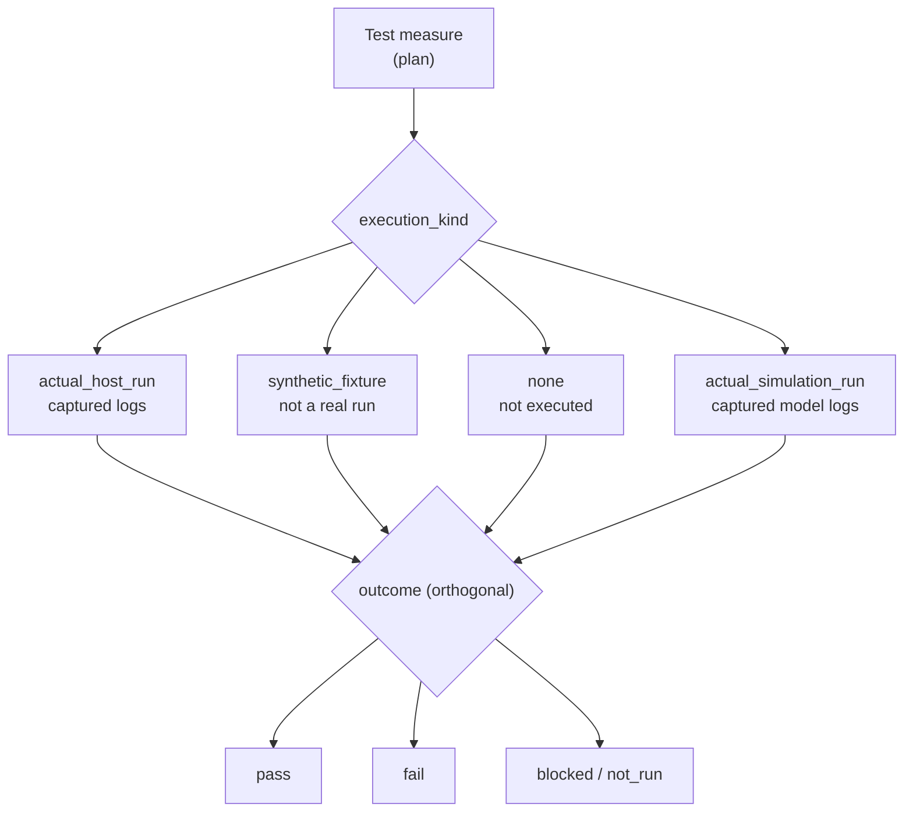

# Verification and validation — measures, executions, evidence (generated view)

Generated: 2026-09-29T14:03:33Z | Baseline: BAS-REF-001 | 219 artifacts, 460 links

## Provenance and status of this file

- **Derived, not authored.** Every table and section below is generated by
  `docs/artifacts/tools/corpus.py cmd_render` from the canonical JSON records. This file contains no
  hand-written engineering content and is not an independent source of truth.
- **Regenerable.** Re-run `python3 docs/artifacts/tools/corpus.py render` to
  reproduce it. Edit the canonical record, never this file.
- **Scope of this view:** The `verification` domain: every test measure and every execution record, with `execution_kind` and `outcome` shown as the orthogonal pair they are.
- **Guard fields.** Every record shown below is printed with its own
  `profile`, `origin`, `human_approval_status` and `production_authorized`
  values. Across the whole corpus `human_approval_status` is `pending` and
  `production_authorized` is `false`; `product_verification_credit` is `false`.
  This view does not and cannot change that.
- **Not a conformity claim.** This corpus is synthetic. Nothing here asserts
  ISO 26262 conformity, an ASIL capability level, an Automotive SPICE
  assessment, human review, or human approval.
- **Diagram validation.** Mermaid blocks are checked by
  `mermaid-cli` when it is available on the rendering host; the per-view
  *Diagram validation* section states plainly whether that check ran. An
  unvalidated diagram is never described as validated.

## Execution classification model

`execution_kind` and `outcome` are **orthogonal**: how the run was performed is recorded separately from what it concluded. A synthetic fixture can legitimately report `pass`, and that pass is not product evidence. Generated consistency-check results validate the corpus, not the BMS product.

| execution_kind | meaning |
|---|---|
| `none` | not executed |
| `actual_host_run` | executed on a real host, logs captured |
| `actual_simulation_run` | executed model with captured logs |
| `synthetic_fixture` | fixture, never a real run |

| outcome | meaning |
|---|---|
| `pass` | as defined by the execution schema |
| `fail` | as defined by the execution schema |
| `inconclusive` | as defined by the execution schema |
| `not_run` | as defined by the execution schema |
| `blocked` | as defined by the execution schema |

## Test measures

| Id | Profile | Title | Test type | Oracle basis | Lifecycle | Guard |
|---|---|---|---|---|---|---|
| `FB2-VER-TMS-000001` | as_is | Test: SOA Voltage Limit Detection | unit | source_grounded | reviewed | profile=`as_is` \| origin=`source_observed` \| human_approval_status=`pending` \| production_authorized=`false` |
| `FB2-VER-TMS-000001` | synthetic_reference | Test: SOA Voltage Limit Detection | unit | synthetic_assumption | reviewed | profile=`synthetic_reference` \| origin=`synthetic` \| human_approval_status=`pending` \| production_authorized=`false` |
| `FB2-VER-TMS-000002` | as_is | Test: Contactor State Machine and Fault Response | unit | source_grounded | reviewed | profile=`as_is` \| origin=`source_observed` \| human_approval_status=`pending` \| production_authorized=`false` |
| `FB2-VER-TMS-000002` | synthetic_reference | Test: Contactor State Machine Fault Response | unit | synthetic_assumption | reviewed | profile=`synthetic_reference` \| origin=`synthetic` \| human_approval_status=`pending` \| production_authorized=`false` |
| `FB2-VER-TMS-000003` | as_is | Test: AFE Cell Voltage Plausibility Checks | unit | source_grounded | reviewed | profile=`as_is` \| origin=`source_observed` \| human_approval_status=`pending` \| production_authorized=`false` |
| `FB2-VER-TMS-000003` | synthetic_reference | Test: AFE Cell Voltage Plausibility Checks | unit | synthetic_assumption | reviewed | profile=`synthetic_reference` \| origin=`synthetic` \| human_approval_status=`pending` \| production_authorized=`false` |
| `FB2-VER-TMS-000004` | as_is | Test: LTC6813-1 AFE Driver Communication and Measurement | unit | source_grounded | reviewed | profile=`as_is` \| origin=`source_observed` \| human_approval_status=`pending` \| production_authorized=`false` |
| `FB2-VER-TMS-000004` | synthetic_reference | Test: Independent Voltage Monitor Reaction | fault_injection | synthetic_assumption | reviewed | profile=`synthetic_reference` \| origin=`synthetic` \| human_approval_status=`pending` \| production_authorized=`false` |
| `FB2-VER-TMS-000005` | as_is | Test: Contactor Driver Configuration and Control | unit | source_grounded | reviewed | profile=`as_is` \| origin=`source_observed` \| human_approval_status=`pending` \| production_authorized=`false` |
| `FB2-VER-TMS-000005` | synthetic_reference | Test: AFE Communication Integrity | robustness | synthetic_assumption | reviewed | profile=`synthetic_reference` \| origin=`synthetic` \| human_approval_status=`pending` \| production_authorized=`false` |
| `FB2-VER-TMS-000006` | synthetic_reference | Test: Contactor Driver Configuration and Control | unit | synthetic_assumption | reviewed | profile=`synthetic_reference` \| origin=`synthetic` \| human_approval_status=`pending` \| production_authorized=`false` |
| `FB2-VER-TMS-000007` | synthetic_reference | Test: Software Integration Chain (SOA-Database-Contactor) | integration | synthetic_assumption | draft | profile=`synthetic_reference` \| origin=`synthetic` \| human_approval_status=`pending` \| production_authorized=`false` |
| `FB2-VER-TMS-000008` | synthetic_reference | Test: System Qualification (Cell-Voltage Safety Chain) | qualification | synthetic_assumption | draft | profile=`synthetic_reference` \| origin=`synthetic` \| human_approval_status=`pending` \| production_authorized=`false` |
| `FB2-VER-TMS-000009` | synthetic_reference | Test: Stakeholder Validation (Cell-Voltage Use Cases) | validation | synthetic_assumption | draft | profile=`synthetic_reference` \| origin=`synthetic` \| human_approval_status=`pending` \| production_authorized=`false` |
| `FB2-VER-TMS-000010` | synthetic_reference | Test: Component Verification (SOA Monitor + DIAG Callbacks) | unit | synthetic_assumption | draft | profile=`synthetic_reference` \| origin=`synthetic` \| human_approval_status=`pending` \| production_authorized=`false` |
| `FB2-VER-TMS-000011` | synthetic_reference | Test: HIL Fault Reaction (Target) | system | synthetic_assumption | draft | profile=`synthetic_reference` \| origin=`synthetic` \| human_approval_status=`pending` \| production_authorized=`false` |
| `FB2-VER-TMS-000012` | synthetic_reference | Validation: charging a healthy pack at the limit does not cause a spurious safety reaction (stakeho… | validation | synthetic_assumption | draft | profile=`synthetic_reference` \| origin=`synthetic` \| human_approval_status=`pending` \| production_authorized=`false` |
| `FB2-VER-TMS-000013` | synthetic_reference | Validation: the driver's usable experience after a genuine overvoltage reaction (operational scenar… | validation | synthetic_assumption | draft | profile=`synthetic_reference` \| origin=`synthetic` \| human_approval_status=`pending` \| production_authorized=`false` |
| `FB2-VER-TMS-000014` | synthetic_reference | Validation: degraded operation remains usable and is announced before it becomes a hard stop (opera… | validation | analytical_model | draft | profile=`synthetic_reference` \| origin=`synthetic` \| human_approval_status=`pending` \| production_authorized=`false` |
| `FB2-VER-TMS-000015` | synthetic_reference | Validation: the service technician can commission and service the item without being able to energi… | validation | synthetic_assumption | draft | profile=`synthetic_reference` \| origin=`synthetic` \| human_approval_status=`pending` \| production_authorized=`false` |
| `FB2-VER-TMS-000016` | synthetic_reference | Verification: an unauthenticated peer is refused service, and an authenticated session's payload is… | robustness | source_grounded | draft | profile=`synthetic_reference` \| origin=`synthetic` \| human_approval_status=`pending` \| production_authorized=`false` |
| `FB2-VER-TMS-000017` | synthetic_reference | Verification: a peer holding the maximum permitted connections open and silent does not deny servic… | robustness | analytical_model | draft | profile=`synthetic_reference` \| origin=`synthetic` \| human_approval_status=`pending` \| production_authorized=`false` |
| `FB2-VER-TMS-000018` | synthetic_reference | Verification: a bus peer without the shared secret cannot present a frame the dispatch layer accepts | robustness | source_grounded | draft | profile=`synthetic_reference` \| origin=`synthetic` \| human_approval_status=`pending` \| production_authorized=`false` |
| `FB2-VER-TMS-000019` | synthetic_reference | Verification: the serial link acts only on authenticated frames, and the XOFF/XON byte values are d… | robustness | source_grounded | draft | profile=`synthetic_reference` \| origin=`synthetic` \| human_approval_status=`pending` \| production_authorized=`false` |
| `FB2-VER-TMS-000020` | synthetic_reference | Verification: the initial sequence number is unpredictable across connections and power cycles, and… | robustness | synthetic_assumption | draft | profile=`synthetic_reference` \| origin=`synthetic` \| human_approval_status=`pending` \| production_authorized=`false` |

### FB2-VER-TMS-000001 (as_is) — Test: SOA Voltage Limit Detection

- guard: profile=`as_is` \| origin=`source_observed` \| human_approval_status=`pending` \| production_authorized=`false`
- objective: Verify SOA voltage limit detection accuracy and latency
- referenced requirements: FB2-SAF-FSR-000002; FB2-SW-SWR-000002
- referenced designs: FB2-SW-DSN-000002
- preconditions: SOA module initialized with valid config; Database accessible; Test doubles for DATA_ReadData injected
- expected outcomes: {'signal': 'fault_request', 'expected_value': 'true', 'tolerance': 'exact', 'unit': 'bool'}; {'signal': 'violation_cell_index', 'expected_value': '0', 'tolerance': 'exact', 'unit': 'index'}; {'signal': 'violation_type', 'expected_value': 'OVERVOLTAGE', 'tolerance': 'exact', 'unit': 'enum'}
- tolerances: latency=10 ms, voltage_threshold=1 mV
- timing: max_execution_time_ms=100, setup_time_ms=10, teardown_time_ms=5
- oracle basis: `source_grounded`
- regression selection: Always included in regression suite

### FB2-VER-TMS-000001 (synthetic_reference) — Test: SOA Voltage Limit Detection

- guard: profile=`synthetic_reference` \| origin=`synthetic` \| human_approval_status=`pending` \| production_authorized=`false`
- objective: Verify SOA voltage limit detection accuracy and latency
- referenced requirements: FB2-SAF-FSR-000002; FB2-SW-SWR-000002
- referenced designs: FB2-SW-DSN-000002
- preconditions: Module initialized with valid config; Test doubles injected
- expected outcomes: {'signal': 'fault_request', 'expected_value': 'true', 'tolerance': 'exact', 'unit': 'bool'}; {'signal': 'violation_type', 'expected_value': 'OVERVOLTAGE', 'tolerance': 'exact', 'unit': 'enum'}
- tolerances: value=exact
- timing: max_execution_time_ms=100, setup_time_ms=10, teardown_time_ms=5
- oracle basis: `synthetic_assumption`
- regression selection: Always included in regression suite

### FB2-VER-TMS-000002 (as_is) — Test: Contactor State Machine and Fault Response

- guard: profile=`as_is` \| origin=`source_observed` \| human_approval_status=`pending` \| production_authorized=`false`
- objective: Verify contactor state machine transitions and fault response latency
- referenced requirements: FB2-SAF-FSR-000003; FB2-SW-SWR-000003
- referenced designs: FB2-SW-DSN-000003
- preconditions: Contactor driver initialized; SBC mock injected; Feedback GPIO mocks injected; FRAM mock injected
- expected outcomes: {'signal': 'precharge_coil', 'expected_value': 'energized', 'tolerance': 'exact', 'unit': 'state'}; {'signal': 'main_coil', 'expected_value': 'energized', 'tolerance': 'exact', 'unit': 'state'}; {'signal': 'fault_response_latency', 'expected_value': '< 5', 'tolerance': 'max', 'unit': 'ms'}; {'signal': 'final_state', 'expected_value': 'FAULT_OPEN', 'tolerance': 'exact', 'unit': 'enum'}
- tolerances: fault_latency=5 ms, precharge_timeout=5 s, voltage_threshold=1 V
- timing: max_execution_time_ms=500, setup_time_ms=20, teardown_time_ms=10
- oracle basis: `source_grounded`
- regression selection: Always included in regression suite

### FB2-VER-TMS-000002 (synthetic_reference) — Test: Contactor State Machine Fault Response

- guard: profile=`synthetic_reference` \| origin=`synthetic` \| human_approval_status=`pending` \| production_authorized=`false`
- objective: Verify contactor state machine transitions and fault response latency
- referenced requirements: FB2-SAF-FSR-000003; FB2-SW-SWR-000003
- referenced designs: FB2-SW-DSN-000003
- preconditions: Module initialized with valid config; Test doubles injected
- expected outcomes: {'signal': 'contactor_open_latency_ms', 'expected_value': '<50', 'tolerance': 'exact', 'unit': 'ms'}; {'signal': 'fault_feedback_diag', 'expected_value': 'true', 'tolerance': 'exact', 'unit': 'bool'}
- tolerances: value=exact
- timing: max_execution_time_ms=100, setup_time_ms=10, teardown_time_ms=5
- oracle basis: `synthetic_assumption`
- regression selection: Always included in regression suite

### FB2-VER-TMS-000003 (as_is) — Test: AFE Cell Voltage Plausibility Checks

- guard: profile=`as_is` \| origin=`source_observed` \| human_approval_status=`pending` \| production_authorized=`false`
- objective: Verify AFE cell voltage measurement plausibility validation before database entry
- referenced requirements: FB2-SAF-FSR-000001; FB2-SW-SWR-000001
- referenced designs: FB2-SW-DSN-000001
- preconditions: Module initialized with valid config; Test doubles injected
- expected outcomes: {'signal': 'plausibility_result', 'expected_value': 'pass', 'tolerance': 'exact', 'unit': 'enum'}; {'signal': 'flagged_cell', 'expected_value': 'true', 'tolerance': 'exact', 'unit': 'bool'}
- tolerances: value=exact
- timing: max_execution_time_ms=100, setup_time_ms=10, teardown_time_ms=5
- oracle basis: `source_grounded`
- regression selection: Always included in regression suite

### FB2-VER-TMS-000003 (synthetic_reference) — Test: AFE Cell Voltage Plausibility Checks

- guard: profile=`synthetic_reference` \| origin=`synthetic` \| human_approval_status=`pending` \| production_authorized=`false`
- objective: Verify AFE cell voltage measurement plausibility validation before database entry
- referenced requirements: FB2-SAF-FSR-000001; FB2-SW-SWR-000001; FB2-HW-TSR-000001
- referenced designs: FB2-SW-DSN-000001
- preconditions: Module initialized with valid config; Test doubles injected
- expected outcomes: {'signal': 'plausibility_result', 'expected_value': 'pass', 'tolerance': 'exact', 'unit': 'enum'}
- tolerances: value=exact
- timing: max_execution_time_ms=100, setup_time_ms=10, teardown_time_ms=5
- oracle basis: `synthetic_assumption`
- regression selection: Always included in regression suite

### FB2-VER-TMS-000004 (as_is) — Test: LTC6813-1 AFE Driver Communication and Measurement

- guard: profile=`as_is` \| origin=`source_observed` \| human_approval_status=`pending` \| production_authorized=`false`
- objective: Verify AFE driver SPI communication integrity and cell voltage measurement accuracy
- referenced requirements: FB2-HW-TSR-000001; FB2-HW-TSR-000002
- referenced designs: -
- preconditions: Module initialized with valid config; Test doubles injected
- expected outcomes: {'signal': 'cell_voltage_mv', 'expected_value': '3300', 'tolerance': '±1.5 mV', 'unit': 'mV'}; {'signal': 'pec_error', 'expected_value': 'true', 'tolerance': 'exact', 'unit': 'bool'}
- tolerances: value=exact
- timing: max_execution_time_ms=100, setup_time_ms=10, teardown_time_ms=5
- oracle basis: `source_grounded`
- regression selection: Always included in regression suite

### FB2-VER-TMS-000004 (synthetic_reference) — Test: Independent Voltage Monitor Reaction

- guard: profile=`synthetic_reference` \| origin=`synthetic` \| human_approval_status=`pending` \| production_authorized=`false`
- objective: Verify independent monitor detects overvoltage and opens contactors on diverse path
- referenced requirements: FB2-SAF-FSR-000004; FB2-HW-TSR-000004
- referenced designs: -
- preconditions: Module initialized with valid config; Test doubles injected
- expected outcomes: {'signal': 'independent_open_latency_ms', 'expected_value': '<80', 'tolerance': 'exact', 'unit': 'ms'}; {'signal': 'path_independent', 'expected_value': 'true', 'tolerance': 'exact', 'unit': 'bool'}
- tolerances: value=exact
- timing: max_execution_time_ms=100, setup_time_ms=10, teardown_time_ms=5
- oracle basis: `synthetic_assumption`
- regression selection: Always included in regression suite

### FB2-VER-TMS-000005 (as_is) — Test: Contactor Driver Configuration and Control

- guard: profile=`as_is` \| origin=`source_observed` \| human_approval_status=`pending` \| production_authorized=`false`
- objective: Verify contactor driver initialization, channel mapping and switch-off safety behavior
- referenced requirements: FB2-HW-TSR-000003
- referenced designs: -
- preconditions: Module initialized with valid config; Test doubles injected
- expected outcomes: {'signal': 'contactor_state', 'expected_value': 'on', 'tolerance': 'exact', 'unit': 'enum'}; {'signal': 'all_off', 'expected_value': 'true', 'tolerance': 'exact', 'unit': 'bool'}
- tolerances: value=exact
- timing: max_execution_time_ms=100, setup_time_ms=10, teardown_time_ms=5
- oracle basis: `source_grounded`
- regression selection: Always included in regression suite

### FB2-VER-TMS-000005 (synthetic_reference) — Test: AFE Communication Integrity

- guard: profile=`synthetic_reference` \| origin=`synthetic` \| human_approval_status=`pending` \| production_authorized=`false`
- objective: Verify AFE SPI communication integrity under frame corruption
- referenced requirements: FB2-HW-TSR-000002
- referenced designs: -
- preconditions: Module initialized with valid config; Test doubles injected
- expected outcomes: {'signal': 'pec_error', 'expected_value': 'true', 'tolerance': 'exact', 'unit': 'bool'}; {'signal': 'afe_diag_entry', 'expected_value': 'true', 'tolerance': 'exact', 'unit': 'bool'}
- tolerances: value=exact
- timing: max_execution_time_ms=100, setup_time_ms=10, teardown_time_ms=5
- oracle basis: `synthetic_assumption`
- regression selection: Always included in regression suite

### FB2-VER-TMS-000006 (synthetic_reference) — Test: Contactor Driver Configuration and Control

- guard: profile=`synthetic_reference` \| origin=`synthetic` \| human_approval_status=`pending` \| production_authorized=`false`
- objective: Verify contactor driver initialization, channel mapping and switch-off safety behavior
- referenced requirements: FB2-HW-TSR-000003
- referenced designs: -
- preconditions: Module initialized with valid config; Test doubles injected
- expected outcomes: {'signal': 'all_off', 'expected_value': 'true', 'tolerance': 'exact', 'unit': 'bool'}
- tolerances: value=exact
- timing: max_execution_time_ms=100, setup_time_ms=10, teardown_time_ms=5
- oracle basis: `synthetic_assumption`
- regression selection: Always included in regression suite

### FB2-VER-TMS-000007 (synthetic_reference) — Test: Software Integration Chain (SOA-Database-Contactor)

- guard: profile=`synthetic_reference` \| origin=`synthetic` \| human_approval_status=`pending` \| production_authorized=`false`
- objective: Define the software integration verification intent for the SOA-database-contactor chain; PLANNING STUB — no execution performed, execution blocked (no integration harness in corpus scope)
- referenced requirements: FB2-SW-SWR-000001; FB2-SW-SWR-000002; FB2-SW-SWR-000003
- referenced designs: FB2-SW-DSN-000001; FB2-SW-DSN-000002; FB2-SW-DSN-000003
- preconditions: SOA, database and contactor units available as host builds; Integration harness defined (blocked — not in corpus scope)
- expected outcomes: {'signal': 'chain_fault_to_open_verified', 'expected_value': 'true', 'tolerance': 'exact', 'unit': 'bool'}
- tolerances: value=exact
- timing: max_execution_time_ms=1000, setup_time_ms=100, teardown_time_ms=50
- oracle basis: `synthetic_assumption`
- regression selection: Include once integration harness exists

### FB2-VER-TMS-000008 (synthetic_reference) — Test: System Qualification (Cell-Voltage Safety Chain)

- guard: profile=`synthetic_reference` \| origin=`synthetic` \| human_approval_status=`pending` \| production_authorized=`false`
- objective: Define the system/software qualification verification intent against FSR-001..004 end to end; PLANNING STUB — no execution performed, execution blocked (no qualification harness or target hardware in corpus scope)
- referenced requirements: FB2-SAF-FSR-000001; FB2-SAF-FSR-000002; FB2-SAF-FSR-000003; FB2-SAF-FSR-000004
- referenced designs: FB2-SW-DSN-000001; FB2-SW-DSN-000002; FB2-SW-DSN-000003
- preconditions: Integrated system build available (blocked — not in corpus scope); Qualification environment defined (blocked)
- expected outcomes: {'signal': 'qual_chain_pass', 'expected_value': 'true', 'tolerance': 'exact', 'unit': 'bool'}
- tolerances: value=exact
- timing: max_execution_time_ms=5000, setup_time_ms=500, teardown_time_ms=100
- oracle basis: `synthetic_assumption`
- regression selection: Include once qualification environment exists

### FB2-VER-TMS-000009 (synthetic_reference) — Test: Stakeholder Validation (Cell-Voltage Use Cases)

- guard: profile=`synthetic_reference` \| origin=`synthetic` \| human_approval_status=`pending` \| production_authorized=`false`
- objective: Define the validation intent of cell-voltage stakeholder use cases on the integrated system; PLANNING STUB — no execution performed, execution blocked (no validation environment or operational data in corpus scope)
- referenced requirements: FB2-SAF-SGO-000001; FB2-MAN-SCO-000001
- referenced designs: -
- preconditions: Stakeholder use cases baselined; Validation environment defined (blocked — not in corpus scope)
- expected outcomes: {'signal': 'validation_accepted', 'expected_value': 'true', 'tolerance': 'exact', 'unit': 'bool'}
- tolerances: value=exact
- timing: max_execution_time_ms=60000, setup_time_ms=5000, teardown_time_ms=1000
- oracle basis: `synthetic_assumption`
- regression selection: Include once validation environment exists

### FB2-VER-TMS-000010 (synthetic_reference) — Test: Component Verification (SOA Monitor + DIAG Callbacks)

- guard: profile=`synthetic_reference` \| origin=`synthetic` \| human_approval_status=`pending` \| production_authorized=`false`
- objective: Define the component-level verification intent for the SOA monitor plus DIAG callback chain; PLANNING STUB — no execution performed, execution blocked (no component harness in corpus scope)
- referenced requirements: FB2-SW-SWR-000002
- referenced designs: FB2-SW-DSN-000002
- preconditions: SOA and DIAG units available as host builds; Component harness defined (blocked — not in corpus scope)
- expected outcomes: {'expected_value': 'true', 'signal': 'component_reaction_verified', 'tolerance': 'exact', 'unit': 'bool'}
- tolerances: value=exact
- timing: max_execution_time_ms=1000, setup_time_ms=100, teardown_time_ms=50
- oracle basis: `synthetic_assumption`
- regression selection: Include once component harness exists

### FB2-VER-TMS-000011 (synthetic_reference) — Test: HIL Fault Reaction (Target)

- guard: profile=`synthetic_reference` \| origin=`synthetic` \| human_approval_status=`pending` \| production_authorized=`false`
- objective: Define the HIL verification intent for the cell-voltage safety chain on target hardware; PLANNING STUB — no execution performed, execution blocked (tests/hil placeholder only, no target hardware in corpus scope)
- referenced requirements: FB2-SAF-FSR-000001; FB2-SAF-FSR-000002; FB2-SAF-FSR-000003; FB2-SAF-FSR-000004
- referenced designs: FB2-SW-DSN-000001; FB2-SW-DSN-000002; FB2-SW-DSN-000003
- preconditions: HIL bench available (blocked — unpublished upstream); Target program built with coverage instrumentation (blocked)
- expected outcomes: {'expected_value': 'true', 'signal': 'hil_reaction_verified', 'tolerance': 'exact', 'unit': 'bool'}
- tolerances: value=exact
- timing: max_execution_time_ms=60000, setup_time_ms=5000, teardown_time_ms=1000
- oracle basis: `synthetic_assumption`
- regression selection: Include once HIL bench exists

### FB2-VER-TMS-000012 (synthetic_reference) — Validation: charging a healthy pack at the limit does not cause a spurious safety reaction (stakeholder intent: pack manufacturer)

- guard: profile=`synthetic_reference` \| origin=`synthetic` \| human_approval_status=`pending` \| production_authorized=`false`
- objective: Confirm that a pack operated correctly at its published charge limit produces no spurious safe-state reaction over a full charge, because the pack manufacturer's stated need is that the item does not reduce usable capacity through false reactions. This is a false-reaction validation: it does not test that the item detects a real violation (FB2-VER-TMS-000005 does that) but that it stays quiet whe…
- referenced requirements: FB2-SYS-NED-000001; FB2-SAF-SGO-000001
- referenced designs: -
- preconditions: The item is fitted to the declared pack configuration and its configuration data matches the pack's build record.; The cell voltages, temperatures and the pack current are logged at a rate that resolves 100 ms.; The charger respects the charge limits the item publishes (FB2-ASM-003).
- expected outcomes: {'signal': 'fault_reaction_count', 'expected_value': '0', 'tolerance': 'exact', 'unit': 'count'}; {'signal': 'delivered_capacity_fraction', 'expected_value': '98', 'tolerance': 'at least', 'unit': '%'}; {'signal': 'diagnosis_entries_forcing_safe_state', 'expected_value': '0', 'tolerance': 'exact', 'unit': 'entries'}
- tolerances: delivered_capacity_fraction=0.98, false_reaction_count=0
- timing: max_execution_time_ms=3600000, setup_time_ms=1800000, teardown_time_ms=600000
- oracle basis: `synthetic_assumption`
- regression selection: Re-run whenever the debounce, the limit set, the plausibility limits or the measurement path changes, and once per pack build. This is the single measure that detects a false reaction, so it is not a sample-only regression.

### FB2-VER-TMS-000013 (synthetic_reference) — Validation: the driver's usable experience after a genuine overvoltage reaction (operational scenario OS-002, traction discharge)

- guard: profile=`synthetic_reference` \| origin=`synthetic` \| human_approval_status=`pending` \| production_authorized=`false`
- objective: Confirm that when a genuine overvoltage reaction occurs while the vehicle is being driven, the outcome is the one the end-user driver stakeholder needs: the pack is isolated, the vehicle coasts to a stop under its own control, and the driver is told what happened in terms that do not require a diagnostic engineer to interpret. This measure exists because the master prompt warns that disconnecting…
- referenced requirements: FB2-SYS-NED-000003; FB2-SAF-SGO-000001
- referenced designs: -
- preconditions: The pack, vehicle and charger are real (hypothetical) installations, not a bench.; A driver representative from the declared end-user class is available and has not been briefed on what the item will do.; A logging setup captures the driver-facing indication, not only the internal state.
- expected outcomes: {'signal': 'contactor_open_time', 'expected_value': '100', 'tolerance': 'at most', 'unit': 'ms'}; {'signal': 'steering_and_brake_assist_retained', 'expected_value': 'true', 'tolerance': 'exact', 'unit': 'bool'}; {'signal': 'driver_indication_states_the_cause', 'expected_value': 'true', 'tolerance': 'exact', 'unit': 'bool'}
- tolerances: safe_state_reached_ms=100, unexplained_indication_count=0
- timing: max_execution_time_ms=3600000, setup_time_ms=1800000, teardown_time_ms=600000
- oracle basis: `synthetic_assumption`
- regression selection: Re-run whenever the fault-reaction logic, the state indication, the latching policy or the mode arbitration changes. It is the only measure that tests whether the mode-dependent reaction is comprehensible, so it is never sampled out.

### FB2-VER-TMS-000014 (synthetic_reference) — Validation: degraded operation remains usable and is announced before it becomes a hard stop (operational scenario: single-channel measurement degradation)

- guard: profile=`synthetic_reference` \| origin=`synthetic` \| human_approval_status=`pending` \| production_authorized=`false`
- objective: Confirm that a measurement-path degradation moves the item into its degraded mode with a capability the pack manufacturer can still use, and that the reduction is announced before the condition becomes a hard stop. The failure this guards against is specific: a degraded mode that silently removes capability, or one that escalates to a full safe state on the first degradation, makes the item unusa…
- referenced requirements: FB2-SYS-NED-000002; FB2-SYS-NED-000005
- referenced designs: -
- preconditions: The pack is at a nominal mid-discharge state with the vehicle stationary.; A channel degradation can be injected without disturbing the cells themselves.; The vehicle control unit is logging the item's published state.
- expected outcomes: {'signal': 'mode_on_first_degradation', 'expected_value': 'DEGRADED', 'tolerance': 'exact', 'unit': 'mode'}; {'signal': 'contactor_control_retained', 'expected_value': 'true', 'tolerance': 'exact', 'unit': 'bool'}; {'signal': 'degraded_indication_latency', 'expected_value': '100', 'tolerance': 'at most', 'unit': 'ms'}
- tolerances: degraded_indication_latency_ms=100, escalation_to_fault_on_first_degradation=0
- timing: max_execution_time_ms=3600000, setup_time_ms=1800000, teardown_time_ms=600000
- oracle basis: `analytical_model`
- regression selection: Re-run whenever a diagnosis severity changes, whenever a degraded mode is added or removed, and whenever the plausibility limits change.

### FB2-VER-TMS-000015 (synthetic_reference) — Validation: the service technician can commission and service the item without being able to energise it incorrectly (operational scenario OS-006, workshop service)

- guard: profile=`synthetic_reference` \| origin=`synthetic` \| human_approval_status=`pending` \| production_authorized=`false`
- objective: Confirm that a service technician following the documented commissioning and service procedure cannot bring the item into a state in which the contactors are commanded closed with open-circuit sensor inputs, and that the procedure's steps are executable in the order given. The stakeholder need is the service class's: a procedure that is technically correct but not executable in sequence causes te…
- referenced requirements: FB2-SYS-NED-000005
- referenced designs: -
- preconditions: The item is unpowered or on a low-voltage service supply with the contactor drivers inhibited.; The service procedure under test exists as an approved document; in this corpus it does not, and this measure is blocked partly for that reason.; Sense leads may be connected or left open without damaging anything, which is an assumption this corpus does not verify.
- expected outcomes: {'signal': 'contactor_close_command_without_sense_leads', 'expected_value': '0', 'tolerance': 'exact', 'unit': 'commands'}; {'signal': 'open_circuit_diagnosed', 'expected_value': 'true', 'tolerance': 'exact', 'unit': 'bool'}; {'signal': 'technician_improvised_steps', 'expected_value': '0', 'tolerance': 'exact', 'unit': 'steps'}
- tolerances: contactor_close_without_leads=0, unassisted_completion=pass
- timing: max_execution_time_ms=3600000, setup_time_ms=1800000, teardown_time_ms=600000
- oracle basis: `synthetic_assumption`
- regression selection: Re-run whenever the commissioning logic, the service interface, the maintenance input or the service procedure changes.

### FB2-VER-TMS-000016 (synthetic_reference) — Verification: an unauthenticated peer is refused service, and an authenticated session's payload is neither readable nor alterable by a passive or active segment observer

- guard: profile=`synthetic_reference` \| origin=`synthetic` \| human_approval_status=`pending` \| production_authorized=`false`
- objective: Confirm that the master software completes no externally reachable network session with a peer that has not authenticated, and that after authentication the session's application payload is neither recoverable in plaintext by an observer on the segment nor modifiable by one. Also confirm that each refusal is diagnosable, because a silent refusal cannot be distinguished from an outage during field…
- referenced requirements: FB2-SAF-SEC-000001
- referenced designs: FB2-SYS-SYR-000007; FB2-SYS-SYR-000008
- preconditions: The service is externally reachable in the configuration under test, which is the hypothetical project's planned commissioning service, not the one that exists in the pinned source.; The item is otherwise in a nominal mode with no active fault.; A capture point exists on the segment.
- expected outcomes: {'signal': 'unauthenticated_sessions', 'expected_value': '0', 'tolerance': 'exact', 'unit': 'sessions'}; {'signal': 'plaintext_payload_bytes_recovered', 'expected_value': '0', 'tolerance': 'exact', 'unit': 'bytes'}; {'signal': 'altered_frames_accepted', 'expected_value': '0', 'tolerance': 'exact', 'unit': 'frames'}; {'signal': 'authentication_latency', 'expected_value': '100', 'tolerance': 'at most', 'unit': 'ms'}; {'signal': 'diagnosis_entries_per_refusal', 'expected_value': '1', 'tolerance': 'exact', 'unit': 'entry'}
- tolerances: altered_frames_accepted=exact, authentication_latency=at most, diagnosis_entries_per_refusal=exact, plaintext_payload_bytes_recovered=exact, unauthenticated_sessions=exact
- timing: max_execution_time_ms=86400000, setup_time_ms=3600000, teardown_time_ms=1800000
- oracle basis: `source_grounded`
- regression selection: Re-run on every change to the service's authentication path, to the cryptographic library, to the key-derivation or storage, and to the session timeout. Also re-run once per release because the acceptance criteria are zero-tolerance and a single regression fails the whole measure.

### FB2-VER-TMS-000017 (synthetic_reference) — Verification: a peer holding the maximum permitted connections open and silent does not deny service to legitimate peers

- guard: profile=`synthetic_reference` \| origin=`synthetic` \| human_approval_status=`pending` \| production_authorized=`false`
- objective: Confirm that a hostile peer cannot make the service unavailable to a legitimate peer by opening the maximum number of permitted connections and sending nothing on them, and that every refusal and every budget breach is diagnosable. This is the measure for the requirement's availability clause; the resource figures it checks are the requirement's own, not figures this measure chooses.
- referenced requirements: FB2-SAF-SEC-000002
- referenced designs: FB2-SYS-SYR-000007; FB2-SYS-SYR-000008
- preconditions: The service under test implements the caps the requirement states.; The hostile peer can hold sockets open without sending data.; The legitimate peer behaves as a legitimate peer.
- expected outcomes: {'signal': 'concurrent_connections_serviced', 'expected_value': '4', 'tolerance': 'at most', 'unit': 'connections'}; {'signal': 'receive_timeout', 'expected_value': '2000', 'tolerance': 'at most', 'unit': 'ms'}; {'signal': 'per_connection_byte_budget', 'expected_value': '65536', 'tolerance': 'at most', 'unit': 'bytes'}; {'signal': 'breach_to_close_time', 'expected_value': '100', 'tolerance': 'at most', 'unit': 'ms'}; {'signal': 'legitimate_connections_per_hour_under_exhaustion', 'expected_value': '1', 'tolerance': 'at least', 'unit': 'connections/hour'}
- tolerances: breach_to_close_time=at most, concurrent_connections_serviced=at most, legitimate_connections_per_hour_under_exhaustion=at least, per_connection_byte_budget=at most, receive_timeout=at most
- timing: max_execution_time_ms=86400000, setup_time_ms=3600000, teardown_time_ms=1800000
- oracle basis: `analytical_model`
- regression selection: Re-run on any change to the connection limit, the timeout, the buffer sizes or the accept loop. This is the measure that would catch the single-deep-queue and discarded-enqueue behaviour the requirement's rationale describes, so it is never sampled out.

### FB2-VER-TMS-000018 (synthetic_reference) — Verification: a bus peer without the shared secret cannot present a frame the dispatch layer accepts

- guard: profile=`synthetic_reference` \| origin=`synthetic` \| human_approval_status=`pending` \| production_authorized=`false`
- objective: Confirm that for every CAN identifier whose payload influences a safety function, a frame carrying a valid identifier but no valid counter, no valid integrity value or the wrong data-length code is rejected before the receive callback is invoked, and that a genuine frame with a sequence error is rejected rather than accepted out of order.
- referenced requirements: FB2-SAF-SEC-000003
- referenced designs: FB2-SYS-SYR-000007; FB2-SYS-SYR-000008
- preconditions: The bus under test carries the item's normal traffic.; The shared secret is held only by the genuine peer and by the item.; The identifiers whose payloads influence a safety function are enumerated.
- expected outcomes: {'signal': 'injected_frames_accepted', 'expected_value': '0', 'tolerance': 'exact', 'unit': 'frames'}; {'signal': 'replayed_frames_accepted', 'expected_value': '0', 'tolerance': 'exact', 'unit': 'frames'}; {'signal': 'short_frames_accepted', 'expected_value': '0', 'tolerance': 'exact', 'unit': 'frames'}; {'signal': 'verification_latency', 'expected_value': '2', 'tolerance': 'at most', 'unit': 'ms'}; {'signal': 'genuine_frames_observed', 'expected_value': '3e6', 'tolerance': 'at least', 'unit': 'frames in the 24 h campaign'}; {'signal': 'genuine_frames_rejected', 'expected_value': '0', 'tolerance': 'exact, over a genuine-frame population of at least 3e6, i.e. a one-sided 95 percent upper bound of 1 per 10^6 genuine frames', 'unit': 'frames'}; {'signal': 'integrity_value_width', 'expected_value': '22', 'tolerance': 'at least', 'unit': 'bits'}
- tolerances: genuine_frames_observed=at least, genuine_frames_rejected=exact over a population of at least 3e6 frames, injected_frames_accepted=exact, integrity_value_width=at least, replayed_frames_accepted=exact, short_frames_accepted=exact, verification_latency=at most
- timing: max_execution_time_ms=86400000, setup_time_ms=3600000, teardown_time_ms=1800000
- oracle basis: `source_grounded`
- regression selection: Re-run on any change to the identifier set, the counter discipline, the integrity primitive, the key or the dispatch order. A change that removes one check from the dispatch path must re-run this measure and must fail it.

### FB2-VER-TMS-000019 (synthetic_reference) — Verification: the serial link acts only on authenticated frames, and the XOFF/XON byte values are demoted to ordinary payload

- guard: profile=`synthetic_reference` \| origin=`synthetic` \| human_approval_status=`pending` \| production_authorized=`false`
- objective: Confirm that no byte on the serial receive line reaches the application layer without passing a length check and an integrity check, that a structurally valid frame with a modified payload is rejected, that neither 0x13 nor 0x11 can change the transmit-enabled state outside an authenticated frame, and that a receive overflow is diagnosable.
- referenced requirements: FB2-SAF-SEC-000004
- referenced designs: FB2-SYS-SYR-000007; FB2-SYS-SYR-000008
- preconditions: The serial link under test is the link the item uses for its external service interface.; The item is otherwise nominal and no genuine peer is mid-transfer.; The receive queue depth is configured and known.
- expected outcomes: {'signal': 'unframed_bytes_passing', 'expected_value': '0', 'tolerance': 'exact', 'unit': 'bytes'}; {'signal': 'transmit_state_transitions_from_control_bytes', 'expected_value': '0', 'tolerance': 'exact', 'unit': 'transitions'}; {'signal': 'modified_payload_frames_accepted', 'expected_value': '0', 'tolerance': 'exact', 'unit': 'frames'}; {'signal': 'length_mismatch_frames_passed', 'expected_value': '0', 'tolerance': 'exact', 'unit': 'frames'}; {'signal': 'diagnosis_entries_per_overflow', 'expected_value': '1', 'tolerance': 'exact', 'unit': 'entry'}; {'signal': 'genuine_frames_observed', 'expected_value': '3e6', 'tolerance': 'at least', 'unit': 'frames in the 24 h campaign'}; {'signal': 'genuine_frames_rejected', 'expected_value': '0', 'tolerance': 'exact, over a genuine-frame population of at least 3e6, i.e. a one-sided 95 percent upper bound of 1 per 10^6 genuine frames', 'unit': 'frames'}; {'signal': 'integrity_value_width', 'expected_value': '22', 'tolerance': 'at least', 'unit': 'bits'}
- tolerances: diagnosis_entries_per_overflow=exact, genuine_frames_observed=at least, genuine_frames_rejected=exact over a population of at least 3e6 frames, integrity_value_width=at least, length_mismatch_frames_passed=exact, modified_payload_frames_accepted=exact, transmit_state_transitions_from_control_bytes=exact, unframed_bytes_passing=exact
- timing: max_execution_time_ms=86400000, setup_time_ms=3600000, teardown_time_ms=1800000
- oracle basis: `source_grounded`
- regression selection: Re-run on any change to the framing format, the integrity primitive, the key, the queue depth or the parser's resynchronisation behaviour. Any change that makes a byte actionable outside a verified frame must fail this measure.

### FB2-VER-TMS-000020 (synthetic_reference) — Verification: the initial sequence number is unpredictable across connections and power cycles, and the third-party component inventory is evidenced and checked against an advisory source on a stated interval

- guard: profile=`synthetic_reference` \| origin=`synthetic` \| human_approval_status=`pending` \| production_authorized=`false`
- objective: Two clauses with two different oracles, stated separately rather than blended. First: confirm that the initial TCP sequence number takes a distinct value on every one of 1000 connection establishments and that the entropy seed is distinct across 1000 power cycles. Second: confirm that every entry in the component inventory carries either evidenced version information or an explicit null with a st…
- referenced requirements: FB2-SAF-SEC-000005
- referenced designs: FB2-SYS-SYR-000007; FB2-SYS-SYR-000008
- preconditions: The item's network stack is reachable and the source can be inspected for the seed's origin.; A power-cycle fixture exists that records the seed at each boot.; The component inventory exists as a maintained document with an owner.; An authoritative advisory source exists and the project is permitted to consult it. This last precondition is NOT satisfied in this corpus, which is why this measure cannot produce a pass even in principle.
- expected outcomes: {'signal': 'distinct_initial_sequence_numbers', 'expected_value': '1000', 'tolerance': 'exact', 'unit': 'values'}; {'signal': 'distinct_seeds_across_power_cycles', 'expected_value': '1000', 'tolerance': 'exact', 'unit': 'values'}; {'signal': 'build_time_fixed_seeds', 'expected_value': '0', 'tolerance': 'exact', 'unit': 'seeds'}; {'signal': 'inventory_entries_with_version_evidence_or_explicit_null', 'expected_value': '100', 'tolerance': 'at least', 'unit': '%'}; {'signal': 'days_since_last_advisory_check', 'expected_value': '30', 'tolerance': 'at most', 'unit': 'days'}; {'signal': 'matches_without_adjudication', 'expected_value': '0', 'tolerance': 'exact', 'unit': 'matches'}; {'signal': 'entries_with_guessed_version', 'expected_value': '0', 'tolerance': 'exact', 'unit': 'entries'}
- tolerances: build_time_fixed_seeds=exact, days_since_last_advisory_check=at most, distinct_initial_sequence_numbers=exact, distinct_seeds_across_power_cycles=exact, entries_with_guessed_version=exact, inventory_entries_with_version_evidence_or_explicit_null=at least, matches_without_adjudication=exact
- timing: max_execution_time_ms=86400000, setup_time_ms=3600000, teardown_time_ms=1800000
- oracle basis: `synthetic_assumption`
- regression selection: Re-run on any change to the network stack's randomness path, to the seeding procedure, to the boot sequence, and on every advisory check cycle. The inventory half is re-run quarterly regardless of whether the firmware changed, because the vulnerability question changes without the code changing.

## Executions

| Id | Profile | Test measure | execution_kind | outcome | Lifecycle | Guard |
|---|---|---|---|---|---|---|
| `FB2-VER-EXE-000001` | as_is | `FB2-VER-TMS-000001` | `actual_host_run` | `pass` | reviewed | profile=`as_is` \| origin=`source_observed` \| human_approval_status=`pending` \| production_authorized=`false` |
| `FB2-VER-EXE-000001` | synthetic_reference | `FB2-VER-TMS-000001` | `synthetic_fixture` | `pass` | reviewed | profile=`synthetic_reference` \| origin=`synthetic` \| human_approval_status=`pending` \| production_authorized=`false` |
| `FB2-VER-EXE-000002` | as_is | `FB2-VER-TMS-000002` | `actual_host_run` | `pass` | reviewed | profile=`as_is` \| origin=`source_observed` \| human_approval_status=`pending` \| production_authorized=`false` |
| `FB2-VER-EXE-000002` | synthetic_reference | `FB2-VER-TMS-000002` | `synthetic_fixture` | `pass` | reviewed | profile=`synthetic_reference` \| origin=`synthetic` \| human_approval_status=`pending` \| production_authorized=`false` |
| `FB2-VER-EXE-000003` | as_is | `FB2-VER-TMS-000003` | `actual_host_run` | `pass` | reviewed | profile=`as_is` \| origin=`source_observed` \| human_approval_status=`pending` \| production_authorized=`false` |
| `FB2-VER-EXE-000003` | synthetic_reference | `FB2-VER-TMS-000003` | `synthetic_fixture` | `pass` | reviewed | profile=`synthetic_reference` \| origin=`synthetic` \| human_approval_status=`pending` \| production_authorized=`false` |
| `FB2-VER-EXE-000004` | as_is | `FB2-VER-TMS-000004` | `none` | `blocked` | reviewed | profile=`as_is` \| origin=`source_observed` \| human_approval_status=`pending` \| production_authorized=`false` |
| `FB2-VER-EXE-000004` | synthetic_reference | `FB2-VER-TMS-000004` | `synthetic_fixture` | `pass` | reviewed | profile=`synthetic_reference` \| origin=`synthetic` \| human_approval_status=`pending` \| production_authorized=`false` |
| `FB2-VER-EXE-000005` | as_is | `FB2-VER-TMS-000005` | `actual_host_run` | `pass` | reviewed | profile=`as_is` \| origin=`source_observed` \| human_approval_status=`pending` \| production_authorized=`false` |
| `FB2-VER-EXE-000005` | synthetic_reference | `FB2-VER-TMS-000005` | `synthetic_fixture` | `pass` | reviewed | profile=`synthetic_reference` \| origin=`synthetic` \| human_approval_status=`pending` \| production_authorized=`false` |
| `FB2-VER-EXE-000006` | as_is | `FB2-VER-TMS-000001..000005` | `actual_host_run` | `fail` | reviewed | profile=`as_is` \| origin=`source_observed` \| human_approval_status=`pending` \| production_authorized=`false` |
| `FB2-VER-EXE-000006` | synthetic_reference | `FB2-VER-TMS-000006` | `synthetic_fixture` | `pass` | reviewed | profile=`synthetic_reference` \| origin=`synthetic` \| human_approval_status=`pending` \| production_authorized=`false` |
| `FB2-VER-EXE-000007` | as_is | `FB2-VER-TMS-000001..000005` | `actual_host_run` | `fail` | reviewed | profile=`as_is` \| origin=`source_observed` \| human_approval_status=`pending` \| production_authorized=`false` |
| `FB2-VER-EXE-000007` | synthetic_reference | `FB2-VER-TMS-000007` | `none` | `blocked` | reviewed | profile=`synthetic_reference` \| origin=`synthetic` \| human_approval_status=`pending` \| production_authorized=`false` |
| `FB2-VER-EXE-000008` | as_is | `FB2-VER-TMS-000003` | `actual_host_run` | `fail` | reviewed | profile=`as_is` \| origin=`source_observed` \| human_approval_status=`pending` \| production_authorized=`false` |
| `FB2-VER-EXE-000008` | synthetic_reference | `FB2-VER-TMS-000008` | `none` | `blocked` | reviewed | profile=`synthetic_reference` \| origin=`synthetic` \| human_approval_status=`pending` \| production_authorized=`false` |
| `FB2-VER-EXE-000009` | as_is | `FB2-VER-TMS-000003` | `actual_host_run` | `fail` | reviewed | profile=`as_is` \| origin=`source_observed` \| human_approval_status=`pending` \| production_authorized=`false` |
| `FB2-VER-EXE-000009` | synthetic_reference | `FB2-VER-TMS-000009` | `none` | `blocked` | reviewed | profile=`synthetic_reference` \| origin=`synthetic` \| human_approval_status=`pending` \| production_authorized=`false` |
| `FB2-VER-EXE-000010` | as_is | `FB2-VER-TMS-000003` | `actual_host_run` | `fail` | reviewed | profile=`as_is` \| origin=`source_observed` \| human_approval_status=`pending` \| production_authorized=`false` |
| `FB2-VER-EXE-000010` | synthetic_reference | `FB2-VER-TMS-000010` | `none` | `blocked` | reviewed | profile=`synthetic_reference` \| origin=`synthetic` \| human_approval_status=`pending` \| production_authorized=`false` |
| `FB2-VER-EXE-000011` | as_is | `FB2-VER-TMS-000003` | `actual_host_run` | `fail` | reviewed | profile=`as_is` \| origin=`source_observed` \| human_approval_status=`pending` \| production_authorized=`false` |
| `FB2-VER-EXE-000011` | synthetic_reference | `FB2-VER-TMS-000011` | `none` | `blocked` | reviewed | profile=`synthetic_reference` \| origin=`synthetic` \| human_approval_status=`pending` \| production_authorized=`false` |
| `FB2-VER-EXE-000012` | as_is | `FB2-VER-TMS-000003` | `actual_host_run` | `fail` | reviewed | profile=`as_is` \| origin=`source_observed` \| human_approval_status=`pending` \| production_authorized=`false` |
| `FB2-VER-EXE-000012` | synthetic_reference | `FB2-VER-TMS-000012` | `none` | `blocked` | draft | profile=`synthetic_reference` \| origin=`synthetic` \| human_approval_status=`pending` \| production_authorized=`false` |
| `FB2-VER-EXE-000013` | as_is | `FB2-VER-TMS-000003` | `actual_host_run` | `fail` | reviewed | profile=`as_is` \| origin=`source_observed` \| human_approval_status=`pending` \| production_authorized=`false` |
| `FB2-VER-EXE-000013` | synthetic_reference | `FB2-VER-TMS-000013` | `none` | `blocked` | draft | profile=`synthetic_reference` \| origin=`synthetic` \| human_approval_status=`pending` \| production_authorized=`false` |
| `FB2-VER-EXE-000014` | as_is | `FB2-VER-TMS-000003` | `actual_host_run` | `fail` | reviewed | profile=`as_is` \| origin=`source_observed` \| human_approval_status=`pending` \| production_authorized=`false` |
| `FB2-VER-EXE-000014` | synthetic_reference | `FB2-VER-TMS-000014` | `none` | `blocked` | draft | profile=`synthetic_reference` \| origin=`synthetic` \| human_approval_status=`pending` \| production_authorized=`false` |
| `FB2-VER-EXE-000015` | synthetic_reference | `FB2-VER-TMS-000015` | `none` | `blocked` | draft | profile=`synthetic_reference` \| origin=`synthetic` \| human_approval_status=`pending` \| production_authorized=`false` |
| `FB2-VER-EXE-000016` | synthetic_reference | `FB2-VER-TMS-000016` | `none` | `blocked` | draft | profile=`synthetic_reference` \| origin=`synthetic` \| human_approval_status=`pending` \| production_authorized=`false` |
| `FB2-VER-EXE-000017` | synthetic_reference | `FB2-VER-TMS-000017` | `none` | `blocked` | draft | profile=`synthetic_reference` \| origin=`synthetic` \| human_approval_status=`pending` \| production_authorized=`false` |
| `FB2-VER-EXE-000018` | synthetic_reference | `FB2-VER-TMS-000018` | `none` | `blocked` | draft | profile=`synthetic_reference` \| origin=`synthetic` \| human_approval_status=`pending` \| production_authorized=`false` |
| `FB2-VER-EXE-000019` | synthetic_reference | `FB2-VER-TMS-000019` | `none` | `blocked` | draft | profile=`synthetic_reference` \| origin=`synthetic` \| human_approval_status=`pending` \| production_authorized=`false` |
| `FB2-VER-EXE-000020` | synthetic_reference | `FB2-VER-TMS-000020` | `none` | `blocked` | draft | profile=`synthetic_reference` \| origin=`synthetic` \| human_approval_status=`pending` \| production_authorized=`false` |

### Evidence classes present in the corpus

**Real captured host runs (13).** These have captured logs under `docs/artifacts/evidence/actual-runs/` and per-run input/output hashes. They are the only executions in this corpus that constitute captured evidence, and even they are host-platform results, not target-hardware results.

| Id | Profile | execution_kind | outcome | Environment | Captured logs | Guard |
|---|---|---|---|---|---|---|
| `FB2-VER-EXE-000001` | as_is | `actual_host_run` | `pass` | arm64-apple-darwin27 (Apple Silicon Mac, Darwin 27.0.0) | docs/artifacts/evidence/actual-runs/foxbms2-host-unit-test-macos-2026-09-29/logs-strict/tests__unit__app__application__soa__test_soa.txt | profile=`as_is` \| origin=`source_observed` \| human_approval_status=`pending` \| production_authorized=`false` |
| `FB2-VER-EXE-000002` | as_is | `actual_host_run` | `pass` | arm64-apple-darwin27 (Apple Silicon Mac, Darwin 27.0.0) | docs/artifacts/evidence/actual-runs/foxbms2-host-unit-test-macos-2026-09-29/logs-relaxed/tests__unit__app__driver__contactor__test_contactor.txt | profile=`as_is` \| origin=`source_observed` \| human_approval_status=`pending` \| production_authorized=`false` |
| `FB2-VER-EXE-000003` | as_is | `actual_host_run` | `pass` | arm64-apple-darwin27 (Apple Silicon Mac, Darwin 27.0.0) | docs/artifacts/evidence/actual-runs/foxbms2-host-unit-test-macos-2026-09-29/logs-strict/tests__unit__app__driver__afe__api__test_afe_plausibility.txt | profile=`as_is` \| origin=`source_observed` \| human_approval_status=`pending` \| production_authorized=`false` |
| `FB2-VER-EXE-000005` | as_is | `actual_host_run` | `pass` | arm64-apple-darwin27 (Apple Silicon Mac, Darwin 27.0.0) | docs/artifacts/evidence/actual-runs/foxbms2-host-unit-test-macos-2026-09-29/logs-relaxed/tests__unit__app__driver__contactor__test_contactor.txt | profile=`as_is` \| origin=`source_observed` \| human_approval_status=`pending` \| production_authorized=`false` |
| `FB2-VER-EXE-000006` | as_is | `actual_host_run` | `fail` | arm64-apple-darwin27 (Apple Silicon Mac, Darwin 27.0.0) | docs/artifacts/evidence/actual-runs/foxbms2-host-unit-test-macos-2026-09-29/results-strict.json; docs/artifacts/evidence/actual-runs/foxbms2-host-unit-test-macos-2026-09-29/logs-strict (one .txt per test, 136 files) | profile=`as_is` \| origin=`source_observed` \| human_approval_status=`pending` \| production_authorized=`false` |
| `FB2-VER-EXE-000007` | as_is | `actual_host_run` | `fail` | arm64-apple-darwin27 (Apple Silicon Mac, Darwin 27.0.0) | docs/artifacts/evidence/actual-runs/foxbms2-host-unit-test-macos-2026-09-29/results-relaxed.json; docs/artifacts/evidence/actual-runs/foxbms2-host-unit-test-macos-2026-09-29/logs-relaxed (one .txt per test, 136 files) | profile=`as_is` \| origin=`source_observed` \| human_approval_status=`pending` \| production_authorized=`false` |
| `FB2-VER-EXE-000008` | as_is | `actual_host_run` | `fail` | arm64-apple-darwin27 (Apple Silicon Mac, Darwin 27.0.0) | docs/artifacts/evidence/actual-runs/foxbms2-host-unit-test-macos-2026-09-29/logs-strict/tests__unit__app__application__algorithm__moving_average__test_moving_average.txt | profile=`as_is` \| origin=`source_observed` \| human_approval_status=`pending` \| production_authorized=`false` |
| `FB2-VER-EXE-000009` | as_is | `actual_host_run` | `fail` | arm64-apple-darwin27 (Apple Silicon Mac, Darwin 27.0.0) | docs/artifacts/evidence/actual-runs/foxbms2-host-unit-test-macos-2026-09-29/logs-strict/tests__unit__app__application__algorithm__state_estimation__soc__lookup-table__test_soc_lookup-table.txt | profile=`as_is` \| origin=`source_observed` \| human_approval_status=`pending` \| production_authorized=`false` |
| `FB2-VER-EXE-000010` | as_is | `actual_host_run` | `fail` | arm64-apple-darwin27 (Apple Silicon Mac, Darwin 27.0.0) | docs/artifacts/evidence/actual-runs/foxbms2-host-unit-test-macos-2026-09-29/logs-strict/tests__unit__app__application__algorithm__state_estimation__test_state_estimation.txt | profile=`as_is` \| origin=`source_observed` \| human_approval_status=`pending` \| production_authorized=`false` |
| `FB2-VER-EXE-000011` | as_is | `actual_host_run` | `fail` | arm64-apple-darwin27 (Apple Silicon Mac, Darwin 27.0.0) | docs/artifacts/evidence/actual-runs/foxbms2-host-unit-test-macos-2026-09-29/logs-strict/tests__unit__app__driver__afe__debug__default__test_debug_default.txt | profile=`as_is` \| origin=`source_observed` \| human_approval_status=`pending` \| production_authorized=`false` |
| `FB2-VER-EXE-000012` | as_is | `actual_host_run` | `fail` | arm64-apple-darwin27 (Apple Silicon Mac, Darwin 27.0.0) | docs/artifacts/evidence/actual-runs/foxbms2-host-unit-test-macos-2026-09-29/logs-strict/tests__unit__app__engine__config__test_diag_cfg.txt | profile=`as_is` \| origin=`source_observed` \| human_approval_status=`pending` \| production_authorized=`false` |
| `FB2-VER-EXE-000013` | as_is | `actual_host_run` | `fail` | arm64-apple-darwin27 (Apple Silicon Mac, Darwin 27.0.0) | docs/artifacts/evidence/actual-runs/foxbms2-host-unit-test-macos-2026-09-29/logs-relaxed/tests__unit__app__application__redundancy__test_redundancy.txt | profile=`as_is` \| origin=`source_observed` \| human_approval_status=`pending` \| production_authorized=`false` |
| `FB2-VER-EXE-000014` | as_is | `actual_host_run` | `fail` | arm64-apple-darwin27 (Apple Silicon Mac, Darwin 27.0.0) | docs/artifacts/evidence/actual-runs/foxbms2-host-unit-test-macos-2026-09-29/logs-relaxed/tests__unit__app__engine__diag__test_diag.txt | profile=`as_is` \| origin=`source_observed` \| human_approval_status=`pending` \| production_authorized=`false` |

**Synthetic fixtures (6).** `execution_kind=synthetic_fixture` with `outcome=pass`. These are fixtures, not runs. The `evidence/synthetic-fixtures/` directory is the designated home for their captured fixture artefacts; whether it holds them is reported in the verification-evidence report and in `evidence/synthetic-fixtures/`, and is not asserted here.

| Id | Profile | execution_kind | outcome | Distinct input digests | Guard |
|---|---|---|---|---|---|
| `FB2-VER-EXE-000001` | synthetic_reference | `synthetic_fixture` | `pass` | sha256:339004f08d538371540704e160c5195bf5eb89e94fb22727c8faf9dca70f8a4e | profile=`synthetic_reference` \| origin=`synthetic` \| human_approval_status=`pending` \| production_authorized=`false` |
| `FB2-VER-EXE-000002` | synthetic_reference | `synthetic_fixture` | `pass` | sha256:339004f08d538371540704e160c5195bf5eb89e94fb22727c8faf9dca70f8a4e | profile=`synthetic_reference` \| origin=`synthetic` \| human_approval_status=`pending` \| production_authorized=`false` |
| `FB2-VER-EXE-000003` | synthetic_reference | `synthetic_fixture` | `pass` | sha256:339004f08d538371540704e160c5195bf5eb89e94fb22727c8faf9dca70f8a4e | profile=`synthetic_reference` \| origin=`synthetic` \| human_approval_status=`pending` \| production_authorized=`false` |
| `FB2-VER-EXE-000004` | synthetic_reference | `synthetic_fixture` | `pass` | sha256:339004f08d538371540704e160c5195bf5eb89e94fb22727c8faf9dca70f8a4e | profile=`synthetic_reference` \| origin=`synthetic` \| human_approval_status=`pending` \| production_authorized=`false` |
| `FB2-VER-EXE-000005` | synthetic_reference | `synthetic_fixture` | `pass` | sha256:339004f08d538371540704e160c5195bf5eb89e94fb22727c8faf9dca70f8a4e | profile=`synthetic_reference` \| origin=`synthetic` \| human_approval_status=`pending` \| production_authorized=`false` |
| `FB2-VER-EXE-000006` | synthetic_reference | `synthetic_fixture` | `pass` | sha256:339004f08d538371540704e160c5195bf5eb89e94fb22727c8faf9dca70f8a4e | profile=`synthetic_reference` \| origin=`synthetic` \| human_approval_status=`pending` \| production_authorized=`false` |

**Blocked / not executed (15).** `execution_kind=none` with `outcome=blocked`. These record why a run did not happen.

| Id | Profile | execution_kind | outcome | Limitations | Guard |
|---|---|---|---|---|---|
| `FB2-VER-EXE-000004` | as_is | `none` | `blocked` | Not executed: HALCoGen-generated TI headers unavailable on this host; No verification credit for production | profile=`as_is` \| origin=`source_observed` \| human_approval_status=`pending` \| production_authorized=`false` |
| `FB2-VER-EXE-000007` | synthetic_reference | `none` | `blocked` | Integration harness not defined in corpus scope — execution blocked; No verification credit for production | profile=`synthetic_reference` \| origin=`synthetic` \| human_approval_status=`pending` \| production_authorized=`false` |
| `FB2-VER-EXE-000008` | synthetic_reference | `none` | `blocked` | No qualification environment or target hardware in corpus scope — execution blocked; No verification credit for production | profile=`synthetic_reference` \| origin=`synthetic` \| human_approval_status=`pending` \| production_authorized=`false` |
| `FB2-VER-EXE-000009` | synthetic_reference | `none` | `blocked` | No validation environment or operational data in corpus scope — execution blocked; No verification credit for production | profile=`synthetic_reference` \| origin=`synthetic` \| human_approval_status=`pending` \| production_authorized=`false` |
| `FB2-VER-EXE-000010` | synthetic_reference | `none` | `blocked` | Component harness not defined in corpus scope — execution blocked; No verification credit for production | profile=`synthetic_reference` \| origin=`synthetic` \| human_approval_status=`pending` \| production_authorized=`false` |
| `FB2-VER-EXE-000011` | synthetic_reference | `none` | `blocked` | HIL bench unpublished upstream (tests/hil placeholder) — execution blocked; No verification credit for production | profile=`synthetic_reference` \| origin=`synthetic` \| human_approval_status=`pending` \| production_authorized=`false` |
| `FB2-VER-EXE-000012` | synthetic_reference | `none` | `blocked` | No run occurred. duration_ms is 0 because no process started; it is not a measurement.; No output hash is recorded because no output exists. An empty output_hashes map on a blocked execution is the correct state and must not be filled with a placeholder.; This record carries no product verification credit. | profile=`synthetic_reference` \| origin=`synthetic` \| human_approval_status=`pending` \| production_authorized=`false` |
| `FB2-VER-EXE-000013` | synthetic_reference | `none` | `blocked` | No run occurred. duration_ms is 0 because no process started; it is not a measurement.; No output hash is recorded because no output exists. An empty output_hashes map on a blocked execution is the correct state and must not be filled with a placeholder.; This record carries no product verification credit. | profile=`synthetic_reference` \| origin=`synthetic` \| human_approval_status=`pending` \| production_authorized=`false` |
| `FB2-VER-EXE-000014` | synthetic_reference | `none` | `blocked` | No run occurred. duration_ms is 0 because no process started; it is not a measurement.; No output hash is recorded because no output exists. An empty output_hashes map on a blocked execution is the correct state and must not be filled with a placeholder.; This record carries no product verification credit. | profile=`synthetic_reference` \| origin=`synthetic` \| human_approval_status=`pending` \| production_authorized=`false` |
| `FB2-VER-EXE-000015` | synthetic_reference | `none` | `blocked` | No run occurred. duration_ms is 0 because no process started; it is not a measurement.; No output hash is recorded because no output exists. An empty output_hashes map on a blocked execution is the correct state and must not be filled with a placeholder.; This record carries no product verification credit. | profile=`synthetic_reference` \| origin=`synthetic` \| human_approval_status=`pending` \| production_authorized=`false` |
| `FB2-VER-EXE-000016` | synthetic_reference | `none` | `blocked` | No run occurred. duration_ms is 0 because no process started.; No output hash is recorded because no output exists. Filling it with a placeholder would manufacture evidence.; The measure itself carries an oracle basis. A planned oracle is not a verified result, and this record must not be read as evidence that the oracle was ever exercised.; Carries no product verification credit. | profile=`synthetic_reference` \| origin=`synthetic` \| human_approval_status=`pending` \| production_authorized=`false` |
| `FB2-VER-EXE-000017` | synthetic_reference | `none` | `blocked` | No run occurred. duration_ms is 0 because no process started.; No output hash is recorded because no output exists. Filling it with a placeholder would manufacture evidence.; The measure itself carries an oracle basis. A planned oracle is not a verified result, and this record must not be read as evidence that the oracle was ever exercised.; Carries no product verification credit. | profile=`synthetic_reference` \| origin=`synthetic` \| human_approval_status=`pending` \| production_authorized=`false` |
| `FB2-VER-EXE-000018` | synthetic_reference | `none` | `blocked` | No run occurred. duration_ms is 0 because no process started.; No output hash is recorded because no output exists. Filling it with a placeholder would manufacture evidence.; The measure itself carries an oracle basis. A planned oracle is not a verified result, and this record must not be read as evidence that the oracle was ever exercised.; Carries no product verification credit. | profile=`synthetic_reference` \| origin=`synthetic` \| human_approval_status=`pending` \| production_authorized=`false` |
| `FB2-VER-EXE-000019` | synthetic_reference | `none` | `blocked` | No run occurred. duration_ms is 0 because no process started.; No output hash is recorded because no output exists. Filling it with a placeholder would manufacture evidence.; The measure itself carries an oracle basis. A planned oracle is not a verified result, and this record must not be read as evidence that the oracle was ever exercised.; Carries no product verification credit. | profile=`synthetic_reference` \| origin=`synthetic` \| human_approval_status=`pending` \| production_authorized=`false` |
| `FB2-VER-EXE-000020` | synthetic_reference | `none` | `blocked` | No run occurred. duration_ms is 0 because no process started.; No output hash is recorded because no output exists. Filling it with a placeholder would manufacture evidence.; The measure itself carries an oracle basis. A planned oracle is not a verified result, and this record must not be read as evidence that the oracle was ever exercised.; Carries no product verification credit. | profile=`synthetic_reference` \| origin=`synthetic` \| human_approval_status=`pending` \| production_authorized=`false` |

### Execution detail

#### FB2-VER-EXE-000001 (as_is) — Execution: SOA Voltage Limit Test (real macOS host run)

- guard: profile=`as_is` \| origin=`source_observed` \| human_approval_status=`pending` \| production_authorized=`false`
- execution_kind: `actual_host_run` | outcome: `pass` (orthogonal axes)
- test measure: `FB2-VER-TMS-000001` rev `1`
- environment: configuration=conf/unit/app_project_posix.yml, hardware=arm64-apple-darwin27 (Apple Silicon Mac, Darwin 27.0.0), software=ruby 4.0.7 (2026-09-15 revision 229531a6cf) +PRISM [arm64-darwin27]
- input hashes: ceedling_project_file_shipped=sha256:ed84a79520d0933313a529808635ebcd6494423f8eeb0defc423104bb599988f, repository_head=sha256:27418be73b0d10701cf8f1fba917456fe2e53833c8b300e0d92a84617fc93259, test_source=sha256:380d07375c882253761268c2b31973c273fcb89dc312ebcd3ad603b0ab37d6b4
- output hashes: test_log=sha256:625d07edb5a0ddff772682c94151bc97bdc5157037092e7994b99169d0a7fc27
- logs: {'file': 'docs/artifacts/evidence/actual-runs/foxbms2-host-unit-test-macos-2026-09-29/logs-strict/tests__unit__app__application__soa__test_soa.txt', 'hash': 'sha256:625d07edb5a0ddff772682c94151bc97bdc5157037092e7994b99169d0a7fc27', 'type': 'stdout'}
- timestamps: duration_ms=1330, end=2026-09-29T10:28:50+0200, start=2026-09-29T10:28:50+0200
- anomalies: {'description': "macOS is not a supported foxBMS 2 host platform. cli/cmd_embedded_ut/embedded_ut_impl.py resolves the Ceedling project file with get_platform(), which returns only 'linux' or 'win32' and raises SystemExit at import time for any other value (embedded_ut_impl.py:88-91). The upstream entry point 'fox.py ceedling' therefore cannot be used on macOS at all. This run reproduced that entry point's build layout manually in an isolated workspace under docs/artifacts/.work/verification-env/ without modifying cli/.", 'severity': 'high', 'disposition': 'accepted'}; {'description': "HALCoGen, the proprietary Texas Instruments code generator, is not available on this host. The repository ships its inputs (conf/hcg/app.hcg, conf/hcg/app.dil) but not its output; conf/hcg/include/ and conf/hcg/source/ are gitignored and empty. Per tools/waf-tools/f_hcg.py:150-157 the only artefact the host build needs from HALCoGen is include/config_cpu_clock_hz.h, which was regenerated with HALCOGEN_CPU_CLOCK_HZ=100000000 read out of the repository's own conf/hcg/app.dil (DRIVER.OS.VAR.OS_CPUCLOCKHZ.VALUE). A minimal stand-in for HL_spi.h, which tests/unit/support/struct_helper.h includes for the single type spi_config_reg_t, was reconstructed from the public TMS570 SPI configuration register map. It is NOT the TI original and provides no register offsets, functions, enums or macros.", 'severity': 'high', 'disposition': 'accepted'}; {'description': 'Apple clang rejects the three TI section-placement attributes defined in src/os/freertos/freertos/include/mpu_wrappers.h (PRIVILEGED_FUNCTION, PRIVILEGED_DATA, FREERTOS_SYSTEM_CALL all use section(".kernelTEXT") and similar), because Mach-O requires a \'SEGMENT,SECTION\' pair. GNU/Linux ELF accepts them, so this is a macOS-only build failure. A force-included shim (foxbms_host_port_shim.h) pre-defines the mpu_wrappers.h include guard so those three macros become empty. The attributes only control target image layout and have no effect on test semantics.', 'severity': 'medium', 'disposition': 'accepted'}; {'description': "The compiler driver named by the shipped configuration is 'gcc'. On macOS /usr/bin/gcc is the Apple clang driver, so the test binaries are Mach-O rather than ELF. Diagnostics that Apple clang enables by default but GNU gcc does not under the same -std=c11 -Wextra -Wall -pedantic -Werror set were suppressed (-Wno-strict-prototypes, -Wno-deprecated-non-prototype). Each suppresses a diagnostic only.", 'severity': 'low', 'disposition': 'accepted'}; {'description': 'Ceedling 1.1.9 aborts on this test tree with :use_test_preprocessor: :all, failing in the preprocessor\'s directive-only pass with "Failed to read \'./test/preprocess/files/<test>/directives_only/raw/ftask.h\' for comment stripping ... No such file or directory". The value was set to :none, which selects Ceedling\'s own documented source-scan fallback and resolves the same headers. This is a Ceedling-side workaround in the isolated copy of the project file only.', 'severity': 'medium', 'disposition': 'accepted'}; {'description': "The project file :use_backtrace: :gdb requires an executable named 'gdb' on PATH or Ceedling refuses to start. GNU gdb does not ship with macOS. A shim at bin/gdb forwards the backtrace request to LLDB. It runs only when a test binary crashes and never influences a pass/fail verdict.", 'severity': 'low', 'disposition': 'accepted'}; {'description': 'The Ceedling project file was reproduced byte-identically from the shipped conf/unit/app_project_posix.yml and then rewritten only in the isolated copy. The four rewrites are: :use_test_preprocessor :all to :none, a force-include of foxbms_host_port_shim.h, and the two -Wno- diagnostic flags. No file under src/, tests/, conf/, tools/, cli/, gui/, hardware/ or the repository-root wscript, fox.py or fox.sh was modified.', 'severity': 'low', 'disposition': 'accepted'}
- limitations: Host execution on Apple Silicon macOS, not the Linux host upstream develops on and not target hardware; HALCoGen output is absent; config_cpu_clock_hz.h was regenerated from the repository's own conf/hcg/app.dil and HL_spi.h is a documented reconstruction; No target timing, no coverage run, no code executed on a TMS570

#### FB2-VER-EXE-000001 (synthetic_reference) — Execution: FB2-VER-TMS-000001 (synthetic_fixture)

- guard: profile=`synthetic_reference` \| origin=`synthetic` \| human_approval_status=`pending` \| production_authorized=`false`
- execution_kind: `synthetic_fixture` | outcome: `pass` (orthogonal axes)
- test measure: `FB2-VER-TMS-000001` rev `1`
- environment: configuration=conf/unit/app_project_posix.yml, hardware=x86_64 Linux host (simulated), software=Unity 2.5.2, CMock 2.4.0
- input hashes: config=sha256:339004f08d538371540704e160c5195bf5eb89e94fb22727c8faf9dca70f8a4e, test_source=sha256:339004f08d538371540704e160c5195bf5eb89e94fb22727c8faf9dca70f8a4e
- output hashes: result=sha256:339004f08d538371540704e160c5195bf5eb89e94fb22727c8faf9dca70f8a4e
- logs: {'file': 'build/synthetic/FB2-VER-EXE-000001.log', 'hash': 'sha256:339004f08d538371540704e160c5195bf5eb89e94fb22727c8faf9dca70f8a4e', 'type': 'stdout'}
- timestamps: duration_ms=5000, end=2026-09-13T00:00:05Z, start=2026-09-13T00:00:00Z
- anomalies: -
- limitations: Synthetic fixture execution (no target hardware); No verification credit for production

#### FB2-VER-EXE-000002 (as_is) — Execution: FB2-VER-TMS-000002 (real macOS host run)

- guard: profile=`as_is` \| origin=`source_observed` \| human_approval_status=`pending` \| production_authorized=`false`
- execution_kind: `actual_host_run` | outcome: `pass` (orthogonal axes)
- test measure: `FB2-VER-TMS-000002` rev `1`
- environment: configuration=conf/unit/app_project_posix.yml, hardware=arm64-apple-darwin27 (Apple Silicon Mac, Darwin 27.0.0), software=ruby 4.0.7 (2026-09-15 revision 229531a6cf) +PRISM [arm64-darwin27]
- input hashes: ceedling_project_file_shipped=sha256:ed84a79520d0933313a529808635ebcd6494423f8eeb0defc423104bb599988f, repository_head=sha256:27418be73b0d10701cf8f1fba917456fe2e53833c8b300e0d92a84617fc93259, test_source=sha256:08c18b3bf975a876bcf07eadf983329d4a501ade6db59da119291e7361fbe65f
- output hashes: test_log=sha256:92e8ba6f7d8efa7641e7c931f6dd8974ce0e63f866c6228a782275089b11b606
- logs: {'file': 'docs/artifacts/evidence/actual-runs/foxbms2-host-unit-test-macos-2026-09-29/logs-relaxed/tests__unit__app__driver__contactor__test_contactor.txt', 'hash': 'sha256:92e8ba6f7d8efa7641e7c931f6dd8974ce0e63f866c6228a782275089b11b606', 'type': 'stdout'}
- timestamps: duration_ms=1010, end=2026-09-29T10:32:02+0200, start=2026-09-29T10:32:02+0200
- anomalies: {'description': "macOS is not a supported foxBMS 2 host platform. cli/cmd_embedded_ut/embedded_ut_impl.py resolves the Ceedling project file with get_platform(), which returns only 'linux' or 'win32' and raises SystemExit at import time for any other value (embedded_ut_impl.py:88-91). The upstream entry point 'fox.py ceedling' therefore cannot be used on macOS at all. This run reproduced that entry point's build layout manually in an isolated workspace under docs/artifacts/.work/verification-env/ without modifying cli/.", 'severity': 'high', 'disposition': 'accepted'}; {'description': "HALCoGen, the proprietary Texas Instruments code generator, is not available on this host. The repository ships its inputs (conf/hcg/app.hcg, conf/hcg/app.dil) but not its output; conf/hcg/include/ and conf/hcg/source/ are gitignored and empty. Per tools/waf-tools/f_hcg.py:150-157 the only artefact the host build needs from HALCoGen is include/config_cpu_clock_hz.h, which was regenerated with HALCOGEN_CPU_CLOCK_HZ=100000000 read out of the repository's own conf/hcg/app.dil (DRIVER.OS.VAR.OS_CPUCLOCKHZ.VALUE). A minimal stand-in for HL_spi.h, which tests/unit/support/struct_helper.h includes for the single type spi_config_reg_t, was reconstructed from the public TMS570 SPI configuration register map. It is NOT the TI original and provides no register offsets, functions, enums or macros.", 'severity': 'high', 'disposition': 'accepted'}; {'description': 'Apple clang rejects the three TI section-placement attributes defined in src/os/freertos/freertos/include/mpu_wrappers.h (PRIVILEGED_FUNCTION, PRIVILEGED_DATA, FREERTOS_SYSTEM_CALL all use section(".kernelTEXT") and similar), because Mach-O requires a \'SEGMENT,SECTION\' pair. GNU/Linux ELF accepts them, so this is a macOS-only build failure. A force-included shim (foxbms_host_port_shim.h) pre-defines the mpu_wrappers.h include guard so those three macros become empty. The attributes only control target image layout and have no effect on test semantics.', 'severity': 'medium', 'disposition': 'accepted'}; {'description': "The compiler driver named by the shipped configuration is 'gcc'. On macOS /usr/bin/gcc is the Apple clang driver, so the test binaries are Mach-O rather than ELF. Diagnostics that Apple clang enables by default but GNU gcc does not under the same -std=c11 -Wextra -Wall -pedantic -Werror set were suppressed (-Wno-strict-prototypes, -Wno-deprecated-non-prototype). Each suppresses a diagnostic only.", 'severity': 'low', 'disposition': 'accepted'}; {'description': 'Ceedling 1.1.9 aborts on this test tree with :use_test_preprocessor: :all, failing in the preprocessor\'s directive-only pass with "Failed to read \'./test/preprocess/files/<test>/directives_only/raw/ftask.h\' for comment stripping ... No such file or directory". The value was set to :none, which selects Ceedling\'s own documented source-scan fallback and resolves the same headers. This is a Ceedling-side workaround in the isolated copy of the project file only.', 'severity': 'medium', 'disposition': 'accepted'}; {'description': "The project file :use_backtrace: :gdb requires an executable named 'gdb' on PATH or Ceedling refuses to start. GNU gdb does not ship with macOS. A shim at bin/gdb forwards the backtrace request to LLDB. It runs only when a test binary crashes and never influences a pass/fail verdict.", 'severity': 'low', 'disposition': 'accepted'}; {'description': 'The Ceedling project file was reproduced byte-identically from the shipped conf/unit/app_project_posix.yml and then rewritten only in the isolated copy. The four rewrites are: :use_test_preprocessor :all to :none, a force-include of foxbms_host_port_shim.h, and the two -Wno- diagnostic flags. No file under src/, tests/, conf/, tools/, cli/, gui/, hardware/ or the repository-root wscript, fox.py or fox.sh was modified.', 'severity': 'low', 'disposition': 'accepted'}; {'description': 'This test does not compile under the shipped flag set on Apple clang: the test source triggers -Werror,-Wenum-conversion, a diagnostic Apple clang enables by default and GNU gcc does not. The recorded pass is from the extended run that additionally suppresses -Wno-enum-conversion, -Wno-array-bounds and -Wno-parentheses-equality. Under the strict shipped flags the same test is a build failure and is recorded as such in the sweep record FB2-VER-EXE-000006. The enum conversions are themselves worth review: STD_RETURN_TYPE_e is being passed where FRAM_RETURN_TYPE_e and DIAG_RETURNTYPE_e are expected.', 'severity': 'medium', 'disposition': 'investigating'}
- limitations: Host execution on Apple Silicon macOS, not the Linux host upstream develops on and not target hardware; HALCoGen output is absent; config_cpu_clock_hz.h was regenerated from the repository's own conf/hcg/app.dil and HL_spi.h is a documented reconstruction; No target timing, no coverage run, no code executed on a TMS570

#### FB2-VER-EXE-000002 (synthetic_reference) — Execution: FB2-VER-TMS-000002 (synthetic_fixture)

- guard: profile=`synthetic_reference` \| origin=`synthetic` \| human_approval_status=`pending` \| production_authorized=`false`
- execution_kind: `synthetic_fixture` | outcome: `pass` (orthogonal axes)
- test measure: `FB2-VER-TMS-000002` rev `1`
- environment: configuration=conf/unit/app_project_posix.yml, hardware=x86_64 Linux host (simulated), software=Unity 2.5.2, CMock 2.4.0
- input hashes: config=sha256:339004f08d538371540704e160c5195bf5eb89e94fb22727c8faf9dca70f8a4e, test_source=sha256:339004f08d538371540704e160c5195bf5eb89e94fb22727c8faf9dca70f8a4e
- output hashes: result=sha256:339004f08d538371540704e160c5195bf5eb89e94fb22727c8faf9dca70f8a4e
- logs: {'file': 'build/synthetic/FB2-VER-EXE-000002.log', 'hash': 'sha256:339004f08d538371540704e160c5195bf5eb89e94fb22727c8faf9dca70f8a4e', 'type': 'stdout'}
- timestamps: duration_ms=5000, end=2026-09-13T00:00:05Z, start=2026-09-13T00:00:00Z
- anomalies: -
- limitations: Synthetic fixture execution (no target hardware); No verification credit for production

#### FB2-VER-EXE-000003 (as_is) — Execution: FB2-VER-TMS-000003 (real macOS host run)

- guard: profile=`as_is` \| origin=`source_observed` \| human_approval_status=`pending` \| production_authorized=`false`
- execution_kind: `actual_host_run` | outcome: `pass` (orthogonal axes)
- test measure: `FB2-VER-TMS-000003` rev `1`
- environment: configuration=conf/unit/app_project_posix.yml, hardware=arm64-apple-darwin27 (Apple Silicon Mac, Darwin 27.0.0), software=ruby 4.0.7 (2026-09-15 revision 229531a6cf) +PRISM [arm64-darwin27]
- input hashes: ceedling_project_file_shipped=sha256:ed84a79520d0933313a529808635ebcd6494423f8eeb0defc423104bb599988f, repository_head=sha256:27418be73b0d10701cf8f1fba917456fe2e53833c8b300e0d92a84617fc93259, test_source=sha256:8b2658a2818c516ab5d2ddb81f692b31226741c978b9b992c49e7b3787374847
- output hashes: test_log=sha256:3fad6d4627edcfcbccb76c8d99e7be5615e2a24c4796b85bb4f1b88533a099fd
- logs: {'file': 'docs/artifacts/evidence/actual-runs/foxbms2-host-unit-test-macos-2026-09-29/logs-strict/tests__unit__app__driver__afe__api__test_afe_plausibility.txt', 'hash': 'sha256:3fad6d4627edcfcbccb76c8d99e7be5615e2a24c4796b85bb4f1b88533a099fd', 'type': 'stdout'}
- timestamps: duration_ms=950, end=2026-09-29T10:29:02+0200, start=2026-09-29T10:29:02+0200
- anomalies: {'description': "macOS is not a supported foxBMS 2 host platform. cli/cmd_embedded_ut/embedded_ut_impl.py resolves the Ceedling project file with get_platform(), which returns only 'linux' or 'win32' and raises SystemExit at import time for any other value (embedded_ut_impl.py:88-91). The upstream entry point 'fox.py ceedling' therefore cannot be used on macOS at all. This run reproduced that entry point's build layout manually in an isolated workspace under docs/artifacts/.work/verification-env/ without modifying cli/.", 'severity': 'high', 'disposition': 'accepted'}; {'description': "HALCoGen, the proprietary Texas Instruments code generator, is not available on this host. The repository ships its inputs (conf/hcg/app.hcg, conf/hcg/app.dil) but not its output; conf/hcg/include/ and conf/hcg/source/ are gitignored and empty. Per tools/waf-tools/f_hcg.py:150-157 the only artefact the host build needs from HALCoGen is include/config_cpu_clock_hz.h, which was regenerated with HALCOGEN_CPU_CLOCK_HZ=100000000 read out of the repository's own conf/hcg/app.dil (DRIVER.OS.VAR.OS_CPUCLOCKHZ.VALUE). A minimal stand-in for HL_spi.h, which tests/unit/support/struct_helper.h includes for the single type spi_config_reg_t, was reconstructed from the public TMS570 SPI configuration register map. It is NOT the TI original and provides no register offsets, functions, enums or macros.", 'severity': 'high', 'disposition': 'accepted'}; {'description': 'Apple clang rejects the three TI section-placement attributes defined in src/os/freertos/freertos/include/mpu_wrappers.h (PRIVILEGED_FUNCTION, PRIVILEGED_DATA, FREERTOS_SYSTEM_CALL all use section(".kernelTEXT") and similar), because Mach-O requires a \'SEGMENT,SECTION\' pair. GNU/Linux ELF accepts them, so this is a macOS-only build failure. A force-included shim (foxbms_host_port_shim.h) pre-defines the mpu_wrappers.h include guard so those three macros become empty. The attributes only control target image layout and have no effect on test semantics.', 'severity': 'medium', 'disposition': 'accepted'}; {'description': "The compiler driver named by the shipped configuration is 'gcc'. On macOS /usr/bin/gcc is the Apple clang driver, so the test binaries are Mach-O rather than ELF. Diagnostics that Apple clang enables by default but GNU gcc does not under the same -std=c11 -Wextra -Wall -pedantic -Werror set were suppressed (-Wno-strict-prototypes, -Wno-deprecated-non-prototype). Each suppresses a diagnostic only.", 'severity': 'low', 'disposition': 'accepted'}; {'description': 'Ceedling 1.1.9 aborts on this test tree with :use_test_preprocessor: :all, failing in the preprocessor\'s directive-only pass with "Failed to read \'./test/preprocess/files/<test>/directives_only/raw/ftask.h\' for comment stripping ... No such file or directory". The value was set to :none, which selects Ceedling\'s own documented source-scan fallback and resolves the same headers. This is a Ceedling-side workaround in the isolated copy of the project file only.', 'severity': 'medium', 'disposition': 'accepted'}; {'description': "The project file :use_backtrace: :gdb requires an executable named 'gdb' on PATH or Ceedling refuses to start. GNU gdb does not ship with macOS. A shim at bin/gdb forwards the backtrace request to LLDB. It runs only when a test binary crashes and never influences a pass/fail verdict.", 'severity': 'low', 'disposition': 'accepted'}; {'description': 'The Ceedling project file was reproduced byte-identically from the shipped conf/unit/app_project_posix.yml and then rewritten only in the isolated copy. The four rewrites are: :use_test_preprocessor :all to :none, a force-include of foxbms_host_port_shim.h, and the two -Wno- diagnostic flags. No file under src/, tests/, conf/, tools/, cli/, gui/, hardware/ or the repository-root wscript, fox.py or fox.sh was modified.', 'severity': 'low', 'disposition': 'accepted'}
- limitations: Host execution on Apple Silicon macOS, not the Linux host upstream develops on and not target hardware; HALCoGen output is absent; config_cpu_clock_hz.h was regenerated from the repository's own conf/hcg/app.dil and HL_spi.h is a documented reconstruction; No target timing, no coverage run, no code executed on a TMS570

#### FB2-VER-EXE-000003 (synthetic_reference) — Execution: FB2-VER-TMS-000003 (synthetic_fixture)

- guard: profile=`synthetic_reference` \| origin=`synthetic` \| human_approval_status=`pending` \| production_authorized=`false`
- execution_kind: `synthetic_fixture` | outcome: `pass` (orthogonal axes)
- test measure: `FB2-VER-TMS-000003` rev `1`
- environment: configuration=conf/unit/app_project_posix.yml, hardware=x86_64 Linux host (simulated), software=Unity 2.5.2, CMock 2.4.0
- input hashes: config=sha256:339004f08d538371540704e160c5195bf5eb89e94fb22727c8faf9dca70f8a4e, test_source=sha256:339004f08d538371540704e160c5195bf5eb89e94fb22727c8faf9dca70f8a4e
- output hashes: result=sha256:339004f08d538371540704e160c5195bf5eb89e94fb22727c8faf9dca70f8a4e
- logs: {'file': 'build/synthetic/FB2-VER-EXE-000003.log', 'hash': 'sha256:339004f08d538371540704e160c5195bf5eb89e94fb22727c8faf9dca70f8a4e', 'type': 'stdout'}
- timestamps: duration_ms=5000, end=2026-09-13T00:00:05Z, start=2026-09-13T00:00:00Z
- anomalies: -
- limitations: Synthetic fixture execution (no target hardware); No verification credit for production

#### FB2-VER-EXE-000004 (as_is) — Execution: FB2-VER-TMS-000004 (still blocked: HALCoGen unavailable)

- guard: profile=`as_is` \| origin=`source_observed` \| human_approval_status=`pending` \| production_authorized=`false`
- execution_kind: `none` | outcome: `blocked` (orthogonal axes)
- test measure: `FB2-VER-TMS-000004` rev `1`
- environment: configuration=conf/unit/app_project_posix.yml, hardware=arm64-apple-darwin27 (Apple Silicon Mac, Darwin 27.0.0), software=ruby 4.0.7 (2026-09-15 revision 229531a6cf) +PRISM [arm64-darwin27]
- input hashes: test_source=sha256:451bd4ff80f72eae255ab1642261d3b642d023a7e8654f819fb789a185699949
- output hashes: halcogen_dependency_closure=sha256:df51a921954ace7f5d3f897dea1ff595cf675d6fd09629cdeda6deb65dc0f7a3
- logs: {'file': 'docs/artifacts/evidence/actual-runs/foxbms2-host-unit-test-macos-2026-09-29/halcogen-dependency-closure.json', 'hash': 'sha256:df51a921954ace7f5d3f897dea1ff595cf675d6fd09629cdeda6deb65dc0f7a3', 'type': 'custom'}
- timestamps: duration_ms=0, end=2026-09-29T08:13:21Z, start=2026-09-29T08:13:21Z
- anomalies: {'description': "macOS is not a supported foxBMS 2 host platform. cli/cmd_embedded_ut/embedded_ut_impl.py resolves the Ceedling project file with get_platform(), which returns only 'linux' or 'win32' and raises SystemExit at import time for any other value (embedded_ut_impl.py:88-91). The upstream entry point 'fox.py ceedling' therefore cannot be used on macOS at all. This run reproduced that entry point's build layout manually in an isolated workspace under docs/artifacts/.work/verification-env/ without modifying cli/.", 'severity': 'high', 'disposition': 'accepted'}; {'description': "HALCoGen, the proprietary Texas Instruments code generator, is not available on this host. The repository ships its inputs (conf/hcg/app.hcg, conf/hcg/app.dil) but not its output; conf/hcg/include/ and conf/hcg/source/ are gitignored and empty. Per tools/waf-tools/f_hcg.py:150-157 the only artefact the host build needs from HALCoGen is include/config_cpu_clock_hz.h, which was regenerated with HALCOGEN_CPU_CLOCK_HZ=100000000 read out of the repository's own conf/hcg/app.dil (DRIVER.OS.VAR.OS_CPUCLOCKHZ.VALUE). A minimal stand-in for HL_spi.h, which tests/unit/support/struct_helper.h includes for the single type spi_config_reg_t, was reconstructed from the public TMS570 SPI configuration register map. It is NOT the TI original and provides no register offsets, functions, enums or macros.", 'severity': 'high', 'disposition': 'accepted'}; {'description': 'Apple clang rejects the three TI section-placement attributes defined in src/os/freertos/freertos/include/mpu_wrappers.h (PRIVILEGED_FUNCTION, PRIVILEGED_DATA, FREERTOS_SYSTEM_CALL all use section(".kernelTEXT") and similar), because Mach-O requires a \'SEGMENT,SECTION\' pair. GNU/Linux ELF accepts them, so this is a macOS-only build failure. A force-included shim (foxbms_host_port_shim.h) pre-defines the mpu_wrappers.h include guard so those three macros become empty. The attributes only control target image layout and have no effect on test semantics.', 'severity': 'medium', 'disposition': 'accepted'}; {'description': "The compiler driver named by the shipped configuration is 'gcc'. On macOS /usr/bin/gcc is the Apple clang driver, so the test binaries are Mach-O rather than ELF. Diagnostics that Apple clang enables by default but GNU gcc does not under the same -std=c11 -Wextra -Wall -pedantic -Werror set were suppressed (-Wno-strict-prototypes, -Wno-deprecated-non-prototype). Each suppresses a diagnostic only.", 'severity': 'low', 'disposition': 'accepted'}; {'description': 'Ceedling 1.1.9 aborts on this test tree with :use_test_preprocessor: :all, failing in the preprocessor\'s directive-only pass with "Failed to read \'./test/preprocess/files/<test>/directives_only/raw/ftask.h\' for comment stripping ... No such file or directory". The value was set to :none, which selects Ceedling\'s own documented source-scan fallback and resolves the same headers. This is a Ceedling-side workaround in the isolated copy of the project file only.', 'severity': 'medium', 'disposition': 'accepted'}; {'description': "The project file :use_backtrace: :gdb requires an executable named 'gdb' on PATH or Ceedling refuses to start. GNU gdb does not ship with macOS. A shim at bin/gdb forwards the backtrace request to LLDB. It runs only when a test binary crashes and never influences a pass/fail verdict.", 'severity': 'low', 'disposition': 'accepted'}; {'description': 'The Ceedling project file was reproduced byte-identically from the shipped conf/unit/app_project_posix.yml and then rewritten only in the isolated copy. The four rewrites are: :use_test_preprocessor :all to :none, a force-include of foxbms_host_port_shim.h, and the two -Wno- diagnostic flags. No file under src/, tests/, conf/, tools/, cli/, gui/, hardware/ or the repository-root wscript, fox.py or fox.sh was modified.', 'severity': 'low', 'disposition': 'accepted'}; {'description': "The test file named by the previous record, tests/unit/app/driver/ltc/6813-1/test_ltc_6813-1.c, does not exist in this checkout; the 'afe/' path segment is missing. The real file is tests/unit/app/driver/afe/ltc/6813-1/test_ltc_6813-1.c. evidence_refs has been corrected.", 'severity': 'medium', 'disposition': 'fixed'}
- limitations: Not executed: HALCoGen-generated TI headers unavailable on this host; No verification credit for production

#### FB2-VER-EXE-000004 (synthetic_reference) — Execution: FB2-VER-TMS-000004 (synthetic_fixture)

- guard: profile=`synthetic_reference` \| origin=`synthetic` \| human_approval_status=`pending` \| production_authorized=`false`
- execution_kind: `synthetic_fixture` | outcome: `pass` (orthogonal axes)
- test measure: `FB2-VER-TMS-000004` rev `1`
- environment: configuration=conf/unit/app_project_posix.yml, hardware=x86_64 Linux host (simulated), software=Unity 2.5.2, CMock 2.4.0
- input hashes: config=sha256:339004f08d538371540704e160c5195bf5eb89e94fb22727c8faf9dca70f8a4e, test_source=sha256:339004f08d538371540704e160c5195bf5eb89e94fb22727c8faf9dca70f8a4e
- output hashes: result=sha256:339004f08d538371540704e160c5195bf5eb89e94fb22727c8faf9dca70f8a4e
- logs: {'file': 'build/synthetic/FB2-VER-EXE-000004.log', 'hash': 'sha256:339004f08d538371540704e160c5195bf5eb89e94fb22727c8faf9dca70f8a4e', 'type': 'stdout'}
- timestamps: duration_ms=5000, end=2026-09-13T00:00:05Z, start=2026-09-13T00:00:00Z
- anomalies: -
- limitations: Synthetic fixture execution (no target hardware); No verification credit for production

#### FB2-VER-EXE-000005 (as_is) — Execution: FB2-VER-TMS-000005 (real macOS host run)

- guard: profile=`as_is` \| origin=`source_observed` \| human_approval_status=`pending` \| production_authorized=`false`
- execution_kind: `actual_host_run` | outcome: `pass` (orthogonal axes)
- test measure: `FB2-VER-TMS-000005` rev `1`
- environment: configuration=conf/unit/app_project_posix.yml, hardware=arm64-apple-darwin27 (Apple Silicon Mac, Darwin 27.0.0), software=ruby 4.0.7 (2026-09-15 revision 229531a6cf) +PRISM [arm64-darwin27]
- input hashes: ceedling_project_file_shipped=sha256:ed84a79520d0933313a529808635ebcd6494423f8eeb0defc423104bb599988f, repository_head=sha256:27418be73b0d10701cf8f1fba917456fe2e53833c8b300e0d92a84617fc93259, test_source=sha256:08c18b3bf975a876bcf07eadf983329d4a501ade6db59da119291e7361fbe65f
- output hashes: test_log=sha256:92e8ba6f7d8efa7641e7c931f6dd8974ce0e63f866c6228a782275089b11b606
- logs: {'file': 'docs/artifacts/evidence/actual-runs/foxbms2-host-unit-test-macos-2026-09-29/logs-relaxed/tests__unit__app__driver__contactor__test_contactor.txt', 'hash': 'sha256:92e8ba6f7d8efa7641e7c931f6dd8974ce0e63f866c6228a782275089b11b606', 'type': 'stdout'}
- timestamps: duration_ms=1010, end=2026-09-29T10:32:02+0200, start=2026-09-29T10:32:02+0200
- anomalies: {'description': "macOS is not a supported foxBMS 2 host platform. cli/cmd_embedded_ut/embedded_ut_impl.py resolves the Ceedling project file with get_platform(), which returns only 'linux' or 'win32' and raises SystemExit at import time for any other value (embedded_ut_impl.py:88-91). The upstream entry point 'fox.py ceedling' therefore cannot be used on macOS at all. This run reproduced that entry point's build layout manually in an isolated workspace under docs/artifacts/.work/verification-env/ without modifying cli/.", 'severity': 'high', 'disposition': 'accepted'}; {'description': "HALCoGen, the proprietary Texas Instruments code generator, is not available on this host. The repository ships its inputs (conf/hcg/app.hcg, conf/hcg/app.dil) but not its output; conf/hcg/include/ and conf/hcg/source/ are gitignored and empty. Per tools/waf-tools/f_hcg.py:150-157 the only artefact the host build needs from HALCoGen is include/config_cpu_clock_hz.h, which was regenerated with HALCOGEN_CPU_CLOCK_HZ=100000000 read out of the repository's own conf/hcg/app.dil (DRIVER.OS.VAR.OS_CPUCLOCKHZ.VALUE). A minimal stand-in for HL_spi.h, which tests/unit/support/struct_helper.h includes for the single type spi_config_reg_t, was reconstructed from the public TMS570 SPI configuration register map. It is NOT the TI original and provides no register offsets, functions, enums or macros.", 'severity': 'high', 'disposition': 'accepted'}; {'description': 'Apple clang rejects the three TI section-placement attributes defined in src/os/freertos/freertos/include/mpu_wrappers.h (PRIVILEGED_FUNCTION, PRIVILEGED_DATA, FREERTOS_SYSTEM_CALL all use section(".kernelTEXT") and similar), because Mach-O requires a \'SEGMENT,SECTION\' pair. GNU/Linux ELF accepts them, so this is a macOS-only build failure. A force-included shim (foxbms_host_port_shim.h) pre-defines the mpu_wrappers.h include guard so those three macros become empty. The attributes only control target image layout and have no effect on test semantics.', 'severity': 'medium', 'disposition': 'accepted'}; {'description': "The compiler driver named by the shipped configuration is 'gcc'. On macOS /usr/bin/gcc is the Apple clang driver, so the test binaries are Mach-O rather than ELF. Diagnostics that Apple clang enables by default but GNU gcc does not under the same -std=c11 -Wextra -Wall -pedantic -Werror set were suppressed (-Wno-strict-prototypes, -Wno-deprecated-non-prototype). Each suppresses a diagnostic only.", 'severity': 'low', 'disposition': 'accepted'}; {'description': 'Ceedling 1.1.9 aborts on this test tree with :use_test_preprocessor: :all, failing in the preprocessor\'s directive-only pass with "Failed to read \'./test/preprocess/files/<test>/directives_only/raw/ftask.h\' for comment stripping ... No such file or directory". The value was set to :none, which selects Ceedling\'s own documented source-scan fallback and resolves the same headers. This is a Ceedling-side workaround in the isolated copy of the project file only.', 'severity': 'medium', 'disposition': 'accepted'}; {'description': "The project file :use_backtrace: :gdb requires an executable named 'gdb' on PATH or Ceedling refuses to start. GNU gdb does not ship with macOS. A shim at bin/gdb forwards the backtrace request to LLDB. It runs only when a test binary crashes and never influences a pass/fail verdict.", 'severity': 'low', 'disposition': 'accepted'}; {'description': 'The Ceedling project file was reproduced byte-identically from the shipped conf/unit/app_project_posix.yml and then rewritten only in the isolated copy. The four rewrites are: :use_test_preprocessor :all to :none, a force-include of foxbms_host_port_shim.h, and the two -Wno- diagnostic flags. No file under src/, tests/, conf/, tools/, cli/, gui/, hardware/ or the repository-root wscript, fox.py or fox.sh was modified.', 'severity': 'low', 'disposition': 'accepted'}; {'description': 'This test does not compile under the shipped flag set on Apple clang: the test source triggers -Werror,-Wenum-conversion, a diagnostic Apple clang enables by default and GNU gcc does not. The recorded pass is from the extended run that additionally suppresses -Wno-enum-conversion, -Wno-array-bounds and -Wno-parentheses-equality. Under the strict shipped flags the same test is a build failure and is recorded as such in the sweep record FB2-VER-EXE-000006. The enum conversions are themselves worth review: STD_RETURN_TYPE_e is being passed where FRAM_RETURN_TYPE_e and DIAG_RETURNTYPE_e are expected.', 'severity': 'medium', 'disposition': 'investigating'}
- limitations: Host execution on Apple Silicon macOS, not the Linux host upstream develops on and not target hardware; HALCoGen output is absent; config_cpu_clock_hz.h was regenerated from the repository's own conf/hcg/app.dil and HL_spi.h is a documented reconstruction; No target timing, no coverage run, no code executed on a TMS570

#### FB2-VER-EXE-000005 (synthetic_reference) — Execution: FB2-VER-TMS-000005 (synthetic_fixture)

- guard: profile=`synthetic_reference` \| origin=`synthetic` \| human_approval_status=`pending` \| production_authorized=`false`
- execution_kind: `synthetic_fixture` | outcome: `pass` (orthogonal axes)
- test measure: `FB2-VER-TMS-000005` rev `1`
- environment: configuration=conf/unit/app_project_posix.yml, hardware=x86_64 Linux host (simulated), software=Unity 2.5.2, CMock 2.4.0
- input hashes: config=sha256:339004f08d538371540704e160c5195bf5eb89e94fb22727c8faf9dca70f8a4e, test_source=sha256:339004f08d538371540704e160c5195bf5eb89e94fb22727c8faf9dca70f8a4e
- output hashes: result=sha256:339004f08d538371540704e160c5195bf5eb89e94fb22727c8faf9dca70f8a4e
- logs: {'file': 'build/synthetic/FB2-VER-EXE-000005.log', 'hash': 'sha256:339004f08d538371540704e160c5195bf5eb89e94fb22727c8faf9dca70f8a4e', 'type': 'stdout'}
- timestamps: duration_ms=5000, end=2026-09-13T00:00:05Z, start=2026-09-13T00:00:00Z
- anomalies: -
- limitations: Synthetic fixture execution (no target hardware); No verification credit for production

#### FB2-VER-EXE-000006 (as_is) — Execution: foxBMS 2 host unit test sweep, strict shipped flag set (136 tests, macOS arm64)

- guard: profile=`as_is` \| origin=`source_observed` \| human_approval_status=`pending` \| production_authorized=`false`
- execution_kind: `actual_host_run` | outcome: `fail` (orthogonal axes)
- test measure: `FB2-VER-TMS-000001..000005` rev `1`
- environment: configuration=conf/unit/app_project_posix.yml, hardware=arm64-apple-darwin27 (Apple Silicon Mac, Darwin 27.0.0), software=ruby 4.0.7 (2026-09-15 revision 229531a6cf) +PRISM [arm64-darwin27]
- input hashes: ceedling_project_file_shipped=sha256:ed84a79520d0933313a529808635ebcd6494423f8eeb0defc423104bb599988f, halcogen_dil_input=sha256:c9be5d9bb068ef95a1e26bfe22e29aa142a03c53e1e354ac2ac55672180cf3ac, halcogen_hcg_input=sha256:8118efee47afdaf389a455f86f70cb6eb0ba60b94a852a510ffeac8dba778b79, repository_head=sha256:27418be73b0d10701cf8f1fba917456fe2e53833c8b300e0d92a84617fc93259
- output hashes: halcogen_dependency_closure=sha256:df51a921954ace7f5d3f897dea1ff595cf675d6fd09629cdeda6deb65dc0f7a3, per_test_log_manifest_strict=sha256:c9ee0687d4a0af02c561e8c22db28959be975438a1e4809fb6dd3c306c06a341, results=sha256:462d9a9b5f08f580cec787a4363306d7e7639e25dd6d338f02d6058b3307543c
- logs: {'file': 'docs/artifacts/evidence/actual-runs/foxbms2-host-unit-test-macos-2026-09-29/results-strict.json', 'hash': 'sha256:462d9a9b5f08f580cec787a4363306d7e7639e25dd6d338f02d6058b3307543c', 'type': 'custom'}; {'file': 'docs/artifacts/evidence/actual-runs/foxbms2-host-unit-test-macos-2026-09-29/logs-strict (one .txt per test, 136 files)', 'hash': 'sha256:c9ee0687d4a0af02c561e8c22db28959be975438a1e4809fb6dd3c306c06a341', 'type': 'stdout'}
- timestamps: duration_ms=149670, end=2026-09-29T10:30:52+0200, start=2026-09-29T10:30:52+0200
- anomalies: {'description': "macOS is not a supported foxBMS 2 host platform. cli/cmd_embedded_ut/embedded_ut_impl.py resolves the Ceedling project file with get_platform(), which returns only 'linux' or 'win32' and raises SystemExit at import time for any other value (embedded_ut_impl.py:88-91). The upstream entry point 'fox.py ceedling' therefore cannot be used on macOS at all. This run reproduced that entry point's build layout manually in an isolated workspace under docs/artifacts/.work/verification-env/ without modifying cli/.", 'severity': 'high', 'disposition': 'accepted'}; {'description': "HALCoGen, the proprietary Texas Instruments code generator, is not available on this host. The repository ships its inputs (conf/hcg/app.hcg, conf/hcg/app.dil) but not its output; conf/hcg/include/ and conf/hcg/source/ are gitignored and empty. Per tools/waf-tools/f_hcg.py:150-157 the only artefact the host build needs from HALCoGen is include/config_cpu_clock_hz.h, which was regenerated with HALCOGEN_CPU_CLOCK_HZ=100000000 read out of the repository's own conf/hcg/app.dil (DRIVER.OS.VAR.OS_CPUCLOCKHZ.VALUE). A minimal stand-in for HL_spi.h, which tests/unit/support/struct_helper.h includes for the single type spi_config_reg_t, was reconstructed from the public TMS570 SPI configuration register map. It is NOT the TI original and provides no register offsets, functions, enums or macros.", 'severity': 'high', 'disposition': 'accepted'}; {'description': 'Apple clang rejects the three TI section-placement attributes defined in src/os/freertos/freertos/include/mpu_wrappers.h (PRIVILEGED_FUNCTION, PRIVILEGED_DATA, FREERTOS_SYSTEM_CALL all use section(".kernelTEXT") and similar), because Mach-O requires a \'SEGMENT,SECTION\' pair. GNU/Linux ELF accepts them, so this is a macOS-only build failure. A force-included shim (foxbms_host_port_shim.h) pre-defines the mpu_wrappers.h include guard so those three macros become empty. The attributes only control target image layout and have no effect on test semantics.', 'severity': 'medium', 'disposition': 'accepted'}; {'description': "The compiler driver named by the shipped configuration is 'gcc'. On macOS /usr/bin/gcc is the Apple clang driver, so the test binaries are Mach-O rather than ELF. Diagnostics that Apple clang enables by default but GNU gcc does not under the same -std=c11 -Wextra -Wall -pedantic -Werror set were suppressed (-Wno-strict-prototypes, -Wno-deprecated-non-prototype). Each suppresses a diagnostic only.", 'severity': 'low', 'disposition': 'accepted'}; {'description': 'Ceedling 1.1.9 aborts on this test tree with :use_test_preprocessor: :all, failing in the preprocessor\'s directive-only pass with "Failed to read \'./test/preprocess/files/<test>/directives_only/raw/ftask.h\' for comment stripping ... No such file or directory". The value was set to :none, which selects Ceedling\'s own documented source-scan fallback and resolves the same headers. This is a Ceedling-side workaround in the isolated copy of the project file only.', 'severity': 'medium', 'disposition': 'accepted'}; {'description': "The project file :use_backtrace: :gdb requires an executable named 'gdb' on PATH or Ceedling refuses to start. GNU gdb does not ship with macOS. A shim at bin/gdb forwards the backtrace request to LLDB. It runs only when a test binary crashes and never influences a pass/fail verdict.", 'severity': 'low', 'disposition': 'accepted'}; {'description': 'The Ceedling project file was reproduced byte-identically from the shipped conf/unit/app_project_posix.yml and then rewritten only in the isolated copy. The four rewrites are: :use_test_preprocessor :all to :none, a force-include of foxbms_host_port_shim.h, and the two -Wno- diagnostic flags. No file under src/, tests/, conf/, tools/, cli/, gui/, hardware/ or the repository-root wscript, fox.py or fox.sh was modified.', 'severity': 'low', 'disposition': 'accepted'}; {'description': "The 136 tests in scope are those whose quoted-#include closure reaches no HALCoGen-generated header. Of the repository's 313 test_*.c files, 177 are outside that scope and were not run here. 34 distinct HL_*.h headers are required by the remainder, which cannot be honestly stubbed.", 'severity': 'high', 'disposition': 'deferred'}
- limitations: Apple Silicon macOS host; upstream develops and runs this suite on Windows and Linux; Not target hardware: no TMS570 execution, no timing, no interrupts; HALCoGen absent; see the per-run anomalies; 177 of 313 repository tests not in scope because they need HALCoGen output

#### FB2-VER-EXE-000006 (synthetic_reference) — Execution: FB2-VER-TMS-000006 (synthetic_fixture)

- guard: profile=`synthetic_reference` \| origin=`synthetic` \| human_approval_status=`pending` \| production_authorized=`false`
- execution_kind: `synthetic_fixture` | outcome: `pass` (orthogonal axes)
- test measure: `FB2-VER-TMS-000006` rev `1`
- environment: configuration=conf/unit/app_project_posix.yml, hardware=x86_64 Linux host (simulated), software=Unity 2.5.2, CMock 2.4.0
- input hashes: config=sha256:339004f08d538371540704e160c5195bf5eb89e94fb22727c8faf9dca70f8a4e, test_source=sha256:339004f08d538371540704e160c5195bf5eb89e94fb22727c8faf9dca70f8a4e
- output hashes: result=sha256:339004f08d538371540704e160c5195bf5eb89e94fb22727c8faf9dca70f8a4e
- logs: {'file': 'build/synthetic/FB2-VER-EXE-000006.log', 'hash': 'sha256:339004f08d538371540704e160c5195bf5eb89e94fb22727c8faf9dca70f8a4e', 'type': 'stdout'}
- timestamps: duration_ms=5000, end=2026-09-13T00:00:05Z, start=2026-09-13T00:00:00Z
- anomalies: -
- limitations: Synthetic fixture execution (no target hardware); No verification credit for production

#### FB2-VER-EXE-000007 (as_is) — Execution: foxBMS 2 host unit test sweep, extended clang diagnostic set (136 tests, macOS arm64)

- guard: profile=`as_is` \| origin=`source_observed` \| human_approval_status=`pending` \| production_authorized=`false`
- execution_kind: `actual_host_run` | outcome: `fail` (orthogonal axes)
- test measure: `FB2-VER-TMS-000001..000005` rev `1`
- environment: configuration=conf/unit/app_project_posix.yml, hardware=arm64-apple-darwin27 (Apple Silicon Mac, Darwin 27.0.0), software=ruby 4.0.7 (2026-09-15 revision 229531a6cf) +PRISM [arm64-darwin27]
- input hashes: ceedling_project_file_shipped=sha256:ed84a79520d0933313a529808635ebcd6494423f8eeb0defc423104bb599988f, halcogen_dil_input=sha256:c9be5d9bb068ef95a1e26bfe22e29aa142a03c53e1e354ac2ac55672180cf3ac, halcogen_hcg_input=sha256:8118efee47afdaf389a455f86f70cb6eb0ba60b94a852a510ffeac8dba778b79, repository_head=sha256:27418be73b0d10701cf8f1fba917456fe2e53833c8b300e0d92a84617fc93259
- output hashes: halcogen_dependency_closure=sha256:df51a921954ace7f5d3f897dea1ff595cf675d6fd09629cdeda6deb65dc0f7a3, per_test_log_manifest_relaxed=sha256:c9ee0687d4a0af02c561e8c22db28959be975438a1e4809fb6dd3c306c06a341, results=sha256:b6e5322b58af2451dae2dfe9fabc7ed3fea5776780072fe69cd62f741dcfd9b7
- logs: {'file': 'docs/artifacts/evidence/actual-runs/foxbms2-host-unit-test-macos-2026-09-29/results-relaxed.json', 'hash': 'sha256:b6e5322b58af2451dae2dfe9fabc7ed3fea5776780072fe69cd62f741dcfd9b7', 'type': 'custom'}; {'file': 'docs/artifacts/evidence/actual-runs/foxbms2-host-unit-test-macos-2026-09-29/logs-relaxed (one .txt per test, 136 files)', 'hash': 'sha256:c9ee0687d4a0af02c561e8c22db28959be975438a1e4809fb6dd3c306c06a341', 'type': 'stdout'}
- timestamps: duration_ms=137200, end=2026-09-29T10:33:16+0200, start=2026-09-29T10:33:16+0200
- anomalies: {'description': "macOS is not a supported foxBMS 2 host platform. cli/cmd_embedded_ut/embedded_ut_impl.py resolves the Ceedling project file with get_platform(), which returns only 'linux' or 'win32' and raises SystemExit at import time for any other value (embedded_ut_impl.py:88-91). The upstream entry point 'fox.py ceedling' therefore cannot be used on macOS at all. This run reproduced that entry point's build layout manually in an isolated workspace under docs/artifacts/.work/verification-env/ without modifying cli/.", 'severity': 'high', 'disposition': 'accepted'}; {'description': "HALCoGen, the proprietary Texas Instruments code generator, is not available on this host. The repository ships its inputs (conf/hcg/app.hcg, conf/hcg/app.dil) but not its output; conf/hcg/include/ and conf/hcg/source/ are gitignored and empty. Per tools/waf-tools/f_hcg.py:150-157 the only artefact the host build needs from HALCoGen is include/config_cpu_clock_hz.h, which was regenerated with HALCOGEN_CPU_CLOCK_HZ=100000000 read out of the repository's own conf/hcg/app.dil (DRIVER.OS.VAR.OS_CPUCLOCKHZ.VALUE). A minimal stand-in for HL_spi.h, which tests/unit/support/struct_helper.h includes for the single type spi_config_reg_t, was reconstructed from the public TMS570 SPI configuration register map. It is NOT the TI original and provides no register offsets, functions, enums or macros.", 'severity': 'high', 'disposition': 'accepted'}; {'description': 'Apple clang rejects the three TI section-placement attributes defined in src/os/freertos/freertos/include/mpu_wrappers.h (PRIVILEGED_FUNCTION, PRIVILEGED_DATA, FREERTOS_SYSTEM_CALL all use section(".kernelTEXT") and similar), because Mach-O requires a \'SEGMENT,SECTION\' pair. GNU/Linux ELF accepts them, so this is a macOS-only build failure. A force-included shim (foxbms_host_port_shim.h) pre-defines the mpu_wrappers.h include guard so those three macros become empty. The attributes only control target image layout and have no effect on test semantics.', 'severity': 'medium', 'disposition': 'accepted'}; {'description': "The compiler driver named by the shipped configuration is 'gcc'. On macOS /usr/bin/gcc is the Apple clang driver, so the test binaries are Mach-O rather than ELF. Diagnostics that Apple clang enables by default but GNU gcc does not under the same -std=c11 -Wextra -Wall -pedantic -Werror set were suppressed (-Wno-strict-prototypes, -Wno-deprecated-non-prototype). Each suppresses a diagnostic only.", 'severity': 'low', 'disposition': 'accepted'}; {'description': 'Ceedling 1.1.9 aborts on this test tree with :use_test_preprocessor: :all, failing in the preprocessor\'s directive-only pass with "Failed to read \'./test/preprocess/files/<test>/directives_only/raw/ftask.h\' for comment stripping ... No such file or directory". The value was set to :none, which selects Ceedling\'s own documented source-scan fallback and resolves the same headers. This is a Ceedling-side workaround in the isolated copy of the project file only.', 'severity': 'medium', 'disposition': 'accepted'}; {'description': "The project file :use_backtrace: :gdb requires an executable named 'gdb' on PATH or Ceedling refuses to start. GNU gdb does not ship with macOS. A shim at bin/gdb forwards the backtrace request to LLDB. It runs only when a test binary crashes and never influences a pass/fail verdict.", 'severity': 'low', 'disposition': 'accepted'}; {'description': 'The Ceedling project file was reproduced byte-identically from the shipped conf/unit/app_project_posix.yml and then rewritten only in the isolated copy. The four rewrites are: :use_test_preprocessor :all to :none, a force-include of foxbms_host_port_shim.h, and the two -Wno- diagnostic flags. No file under src/, tests/, conf/, tools/, cli/, gui/, hardware/ or the repository-root wscript, fox.py or fox.sh was modified.', 'severity': 'low', 'disposition': 'accepted'}; {'description': 'This run additionally suppresses -Wno-enum-conversion, -Wno-array-bounds and -Wno-parentheses-equality, which unblocks six further tests relative to the strict run: four now pass (test_contactor, test_diag_cbs_current, test_diag_cbs_deep-discharge, test_sys_mon) and two now run and FAIL (test_redundancy, test_diag). Relaxing the diagnostics did not merely unlock more passes, it exposed two previously hidden test failures. The strict run remains the primary result.', 'severity': 'high', 'disposition': 'investigating'}; {'description': "The 136 tests in scope are those whose quoted-#include closure reaches no HALCoGen-generated header. Of the repository's 313 test_*.c files, 177 are outside that scope and were not run here. 34 distinct HL_*.h headers are required by the remainder, which cannot be honestly stubbed.", 'severity': 'high', 'disposition': 'deferred'}
- limitations: Apple Silicon macOS host; upstream develops and runs this suite on Windows and Linux; Not target hardware: no TMS570 execution, no timing, no interrupts; HALCoGen absent; see the per-run anomalies; 177 of 313 repository tests not in scope because they need HALCoGen output

#### FB2-VER-EXE-000007 (synthetic_reference) — Execution: FB2-VER-TMS-000007 (blocked)

- guard: profile=`synthetic_reference` \| origin=`synthetic` \| human_approval_status=`pending` \| production_authorized=`false`
- execution_kind: `none` | outcome: `blocked` (orthogonal axes)
- test measure: `FB2-VER-TMS-000007` rev `1`
- environment: configuration=conf/unit/app_project_posix.yml, hardware=POSIX host (Linux) — harness blocked, software=Unity/CMock
- input hashes: 
- output hashes: 
- logs: -
- timestamps: duration_ms=0, end=2026-09-19T00:00:00Z, start=2026-09-19T00:00:00Z
- anomalies: -
- limitations: Integration harness not defined in corpus scope — execution blocked; No verification credit for production

#### FB2-VER-EXE-000008 (as_is) — Execution: ALGO moving average (tests/unit/app/application/algorithm/moving_average/test_moving_average.c) - real macOS host run, FAILING

- guard: profile=`as_is` \| origin=`source_observed` \| human_approval_status=`pending` \| production_authorized=`false`
- execution_kind: `actual_host_run` | outcome: `fail` (orthogonal axes)
- test measure: `FB2-VER-TMS-000003` rev `1`
- environment: configuration=conf/unit/app_project_posix.yml, hardware=arm64-apple-darwin27 (Apple Silicon Mac, Darwin 27.0.0), software=ruby 4.0.7 (2026-09-15 revision 229531a6cf) +PRISM [arm64-darwin27]
- input hashes: ceedling_project_file_shipped=sha256:ed84a79520d0933313a529808635ebcd6494423f8eeb0defc423104bb599988f, database_header=sha256:291456ed775a3505abc613d4fd1291bce83d77d1041e8b7947a8488f459566fc, test_source=sha256:5d82f1302a0635a5fd99369003627a58b58ac3b26eb25b176dad111135ffd70b
- output hashes: test_log=sha256:9c692bd7a7b0f909811f24a5bf8bad2a25046a16421ae75eb4249c0370224ab8
- logs: {'file': 'docs/artifacts/evidence/actual-runs/foxbms2-host-unit-test-macos-2026-09-29/logs-strict/tests__unit__app__application__algorithm__moving_average__test_moving_average.txt', 'hash': 'sha256:9c692bd7a7b0f909811f24a5bf8bad2a25046a16421ae75eb4249c0370224ab8', 'type': 'stdout'}
- timestamps: duration_ms=1610, end=2026-09-29T10:28:24+0200, start=2026-09-29T10:28:24+0200
- anomalies: {'description': "macOS is not a supported foxBMS 2 host platform. cli/cmd_embedded_ut/embedded_ut_impl.py resolves the Ceedling project file with get_platform(), which returns only 'linux' or 'win32' and raises SystemExit at import time for any other value (embedded_ut_impl.py:88-91). The upstream entry point 'fox.py ceedling' therefore cannot be used on macOS at all. This run reproduced that entry point's build layout manually in an isolated workspace under docs/artifacts/.work/verification-env/ without modifying cli/.", 'severity': 'high', 'disposition': 'accepted'}; {'description': "HALCoGen, the proprietary Texas Instruments code generator, is not available on this host. The repository ships its inputs (conf/hcg/app.hcg, conf/hcg/app.dil) but not its output; conf/hcg/include/ and conf/hcg/source/ are gitignored and empty. Per tools/waf-tools/f_hcg.py:150-157 the only artefact the host build needs from HALCoGen is include/config_cpu_clock_hz.h, which was regenerated with HALCOGEN_CPU_CLOCK_HZ=100000000 read out of the repository's own conf/hcg/app.dil (DRIVER.OS.VAR.OS_CPUCLOCKHZ.VALUE). A minimal stand-in for HL_spi.h, which tests/unit/support/struct_helper.h includes for the single type spi_config_reg_t, was reconstructed from the public TMS570 SPI configuration register map. It is NOT the TI original and provides no register offsets, functions, enums or macros.", 'severity': 'high', 'disposition': 'accepted'}; {'description': 'Apple clang rejects the three TI section-placement attributes defined in src/os/freertos/freertos/include/mpu_wrappers.h (PRIVILEGED_FUNCTION, PRIVILEGED_DATA, FREERTOS_SYSTEM_CALL all use section(".kernelTEXT") and similar), because Mach-O requires a \'SEGMENT,SECTION\' pair. GNU/Linux ELF accepts them, so this is a macOS-only build failure. A force-included shim (foxbms_host_port_shim.h) pre-defines the mpu_wrappers.h include guard so those three macros become empty. The attributes only control target image layout and have no effect on test semantics.', 'severity': 'medium', 'disposition': 'accepted'}; {'description': "The compiler driver named by the shipped configuration is 'gcc'. On macOS /usr/bin/gcc is the Apple clang driver, so the test binaries are Mach-O rather than ELF. Diagnostics that Apple clang enables by default but GNU gcc does not under the same -std=c11 -Wextra -Wall -pedantic -Werror set were suppressed (-Wno-strict-prototypes, -Wno-deprecated-non-prototype). Each suppresses a diagnostic only.", 'severity': 'low', 'disposition': 'accepted'}; {'description': 'Ceedling 1.1.9 aborts on this test tree with :use_test_preprocessor: :all, failing in the preprocessor\'s directive-only pass with "Failed to read \'./test/preprocess/files/<test>/directives_only/raw/ftask.h\' for comment stripping ... No such file or directory". The value was set to :none, which selects Ceedling\'s own documented source-scan fallback and resolves the same headers. This is a Ceedling-side workaround in the isolated copy of the project file only.', 'severity': 'medium', 'disposition': 'accepted'}; {'description': "The project file :use_backtrace: :gdb requires an executable named 'gdb' on PATH or Ceedling refuses to start. GNU gdb does not ship with macOS. A shim at bin/gdb forwards the backtrace request to LLDB. It runs only when a test binary crashes and never influences a pass/fail verdict.", 'severity': 'low', 'disposition': 'accepted'}; {'description': 'The Ceedling project file was reproduced byte-identically from the shipped conf/unit/app_project_posix.yml and then rewritten only in the isolated copy. The four rewrites are: :use_test_preprocessor :all to :none, a force-include of foxbms_host_port_shim.h, and the two -Wno- diagnostic flags. No file under src/, tests/, conf/, tools/, cli/, gui/, hardware/ or the repository-root wscript, fox.py or fox.sh was modified.', 'severity': 'low', 'disposition': 'accepted'}; {'description': 'Unity assertion failure, verbatim: At line (135): "Expected 0x00000001044AC038 Was 0x00000001044AC0C8:Function DATA_Read1DataBlock Argument pDataToReceiver0:Function called with unexpected argument value."', 'severity': 'high', 'disposition': 'investigating'}; {'description': "Probable root cause, established from the sources and NOT from the host environment: src/app/engine/database/database.h declares the database access API with untyped void* parameters, e.g. 'extern STD_RETURN_TYPE_e DATA_Write4DataBlocks(void *pDataFromSender0, ...)'. The shipped Ceedling configuration sets :cmock: :when_ptr: :compare_data, which requires CMock to know the size of the pointed-to type in order to memcmp. Given void* it cannot, so CMock emits UNITY_TEST_ASSERT_EQUAL_PTR, i.e. a pointer-identity check. The tests pass a pointer to their own file-static copy of the table while the code under test passes a pointer to its own different file-static copy, so the identity check can never succeed. This is compiler- and platform-independent: the same failure is expected under GNU gcc on Linux. It was not caused by the macOS adaptation.", 'severity': 'high', 'disposition': 'investigating'}
- limitations: Host execution on Apple Silicon macOS; Root cause attribution to the void*-typed database API is an analysis of the sources, not a fix; it has not been re-run under GNU gcc to confirm the same failure occurs there

#### FB2-VER-EXE-000008 (synthetic_reference) — Execution: FB2-VER-TMS-000008 (blocked)

- guard: profile=`synthetic_reference` \| origin=`synthetic` \| human_approval_status=`pending` \| production_authorized=`false`
- execution_kind: `none` | outcome: `blocked` (orthogonal axes)
- test measure: `FB2-VER-TMS-000008` rev `1`
- environment: configuration=conf/unit/app_project_posix.yml, hardware=Target + HIL bench (blocked), software=Unity/CMock
- input hashes: 
- output hashes: 
- logs: -
- timestamps: duration_ms=0, end=2026-09-19T00:00:00Z, start=2026-09-19T00:00:00Z
- anomalies: -
- limitations: No qualification environment or target hardware in corpus scope — execution blocked; No verification credit for production

#### FB2-VER-EXE-000009 (as_is) — Execution: SOC lookup-table state estimation (tests/unit/app/application/algorithm/state_estimation/soc/lookup-table/test_soc_lookup-table.c) - real macOS host run, FAILING

- guard: profile=`as_is` \| origin=`source_observed` \| human_approval_status=`pending` \| production_authorized=`false`
- execution_kind: `actual_host_run` | outcome: `fail` (orthogonal axes)
- test measure: `FB2-VER-TMS-000003` rev `1`
- environment: configuration=conf/unit/app_project_posix.yml, hardware=arm64-apple-darwin27 (Apple Silicon Mac, Darwin 27.0.0), software=ruby 4.0.7 (2026-09-15 revision 229531a6cf) +PRISM [arm64-darwin27]
- input hashes: ceedling_project_file_shipped=sha256:ed84a79520d0933313a529808635ebcd6494423f8eeb0defc423104bb599988f, database_header=sha256:291456ed775a3505abc613d4fd1291bce83d77d1041e8b7947a8488f459566fc, test_source=sha256:b623837def0fb1dabdfce18428589fa8aaba0a9c1abb97ef11109d930ab2e6ed
- output hashes: test_log=sha256:7583e58d224ea7d66661db155e8354c1f9901c93212bb7fe2b36b20afefb7c4b
- logs: {'file': 'docs/artifacts/evidence/actual-runs/foxbms2-host-unit-test-macos-2026-09-29/logs-strict/tests__unit__app__application__algorithm__state_estimation__soc__lookup-table__test_soc_lookup-table.txt', 'hash': 'sha256:7583e58d224ea7d66661db155e8354c1f9901c93212bb7fe2b36b20afefb7c4b', 'type': 'stdout'}
- timestamps: duration_ms=1360, end=2026-09-29T10:28:29+0200, start=2026-09-29T10:28:29+0200
- anomalies: {'description': "macOS is not a supported foxBMS 2 host platform. cli/cmd_embedded_ut/embedded_ut_impl.py resolves the Ceedling project file with get_platform(), which returns only 'linux' or 'win32' and raises SystemExit at import time for any other value (embedded_ut_impl.py:88-91). The upstream entry point 'fox.py ceedling' therefore cannot be used on macOS at all. This run reproduced that entry point's build layout manually in an isolated workspace under docs/artifacts/.work/verification-env/ without modifying cli/.", 'severity': 'high', 'disposition': 'accepted'}; {'description': "HALCoGen, the proprietary Texas Instruments code generator, is not available on this host. The repository ships its inputs (conf/hcg/app.hcg, conf/hcg/app.dil) but not its output; conf/hcg/include/ and conf/hcg/source/ are gitignored and empty. Per tools/waf-tools/f_hcg.py:150-157 the only artefact the host build needs from HALCoGen is include/config_cpu_clock_hz.h, which was regenerated with HALCOGEN_CPU_CLOCK_HZ=100000000 read out of the repository's own conf/hcg/app.dil (DRIVER.OS.VAR.OS_CPUCLOCKHZ.VALUE). A minimal stand-in for HL_spi.h, which tests/unit/support/struct_helper.h includes for the single type spi_config_reg_t, was reconstructed from the public TMS570 SPI configuration register map. It is NOT the TI original and provides no register offsets, functions, enums or macros.", 'severity': 'high', 'disposition': 'accepted'}; {'description': 'Apple clang rejects the three TI section-placement attributes defined in src/os/freertos/freertos/include/mpu_wrappers.h (PRIVILEGED_FUNCTION, PRIVILEGED_DATA, FREERTOS_SYSTEM_CALL all use section(".kernelTEXT") and similar), because Mach-O requires a \'SEGMENT,SECTION\' pair. GNU/Linux ELF accepts them, so this is a macOS-only build failure. A force-included shim (foxbms_host_port_shim.h) pre-defines the mpu_wrappers.h include guard so those three macros become empty. The attributes only control target image layout and have no effect on test semantics.', 'severity': 'medium', 'disposition': 'accepted'}; {'description': "The compiler driver named by the shipped configuration is 'gcc'. On macOS /usr/bin/gcc is the Apple clang driver, so the test binaries are Mach-O rather than ELF. Diagnostics that Apple clang enables by default but GNU gcc does not under the same -std=c11 -Wextra -Wall -pedantic -Werror set were suppressed (-Wno-strict-prototypes, -Wno-deprecated-non-prototype). Each suppresses a diagnostic only.", 'severity': 'low', 'disposition': 'accepted'}; {'description': 'Ceedling 1.1.9 aborts on this test tree with :use_test_preprocessor: :all, failing in the preprocessor\'s directive-only pass with "Failed to read \'./test/preprocess/files/<test>/directives_only/raw/ftask.h\' for comment stripping ... No such file or directory". The value was set to :none, which selects Ceedling\'s own documented source-scan fallback and resolves the same headers. This is a Ceedling-side workaround in the isolated copy of the project file only.', 'severity': 'medium', 'disposition': 'accepted'}; {'description': "The project file :use_backtrace: :gdb requires an executable named 'gdb' on PATH or Ceedling refuses to start. GNU gdb does not ship with macOS. A shim at bin/gdb forwards the backtrace request to LLDB. It runs only when a test binary crashes and never influences a pass/fail verdict.", 'severity': 'low', 'disposition': 'accepted'}; {'description': 'The Ceedling project file was reproduced byte-identically from the shipped conf/unit/app_project_posix.yml and then rewritten only in the isolated copy. The four rewrites are: :use_test_preprocessor :all to :none, a force-include of foxbms_host_port_shim.h, and the two -Wno- diagnostic flags. No file under src/, tests/, conf/, tools/, cli/, gui/, hardware/ or the repository-root wscript, fox.py or fox.sh was modified.', 'severity': 'low', 'disposition': 'accepted'}; {'description': 'Unity assertion failure, verbatim: At line (114): "Expected 0x0000000102B48020 Was 0x0000000102B48060:Function DATA_Read1DataBlock Argument pDataToReceiver0:Function called with unexpected argument value."', 'severity': 'high', 'disposition': 'investigating'}; {'description': "Probable root cause, established from the sources and NOT from the host environment: src/app/engine/database/database.h declares the database access API with untyped void* parameters, e.g. 'extern STD_RETURN_TYPE_e DATA_Write4DataBlocks(void *pDataFromSender0, ...)'. The shipped Ceedling configuration sets :cmock: :when_ptr: :compare_data, which requires CMock to know the size of the pointed-to type in order to memcmp. Given void* it cannot, so CMock emits UNITY_TEST_ASSERT_EQUAL_PTR, i.e. a pointer-identity check. The tests pass a pointer to their own file-static copy of the table while the code under test passes a pointer to its own different file-static copy, so the identity check can never succeed. This is compiler- and platform-independent: the same failure is expected under GNU gcc on Linux. It was not caused by the macOS adaptation.", 'severity': 'high', 'disposition': 'investigating'}
- limitations: Host execution on Apple Silicon macOS; Root cause attribution to the void*-typed database API is an analysis of the sources, not a fix; it has not been re-run under GNU gcc to confirm the same failure occurs there

#### FB2-VER-EXE-000009 (synthetic_reference) — Execution: FB2-VER-TMS-000009 (blocked)

- guard: profile=`synthetic_reference` \| origin=`synthetic` \| human_approval_status=`pending` \| production_authorized=`false`
- execution_kind: `none` | outcome: `blocked` (orthogonal axes)
- test measure: `FB2-VER-TMS-000009` rev `1`
- environment: configuration=conf/unit/app_project_posix.yml, hardware=Operational target vehicle/bench (blocked), software=N/A — operational use
- input hashes: 
- output hashes: 
- logs: -
- timestamps: duration_ms=0, end=2026-09-19T00:00:00Z, start=2026-09-19T00:00:00Z
- anomalies: -
- limitations: No validation environment or operational data in corpus scope — execution blocked; No verification credit for production

#### FB2-VER-EXE-000010 (as_is) — Execution: State estimation initialisation (tests/unit/app/application/algorithm/state_estimation/test_state_estimation.c) - real macOS host run, FAILING

- guard: profile=`as_is` \| origin=`source_observed` \| human_approval_status=`pending` \| production_authorized=`false`
- execution_kind: `actual_host_run` | outcome: `fail` (orthogonal axes)
- test measure: `FB2-VER-TMS-000003` rev `1`
- environment: configuration=conf/unit/app_project_posix.yml, hardware=arm64-apple-darwin27 (Apple Silicon Mac, Darwin 27.0.0), software=ruby 4.0.7 (2026-09-15 revision 229531a6cf) +PRISM [arm64-darwin27]
- input hashes: ceedling_project_file_shipped=sha256:ed84a79520d0933313a529808635ebcd6494423f8eeb0defc423104bb599988f, database_header=sha256:291456ed775a3505abc613d4fd1291bce83d77d1041e8b7947a8488f459566fc, test_source=sha256:560dbca76882e53dd21997bce356242ac4e27cb0388a00e8a52f514a0d7e8db9
- output hashes: test_log=sha256:5c87c940732d4ce23fdd8be33c4b21ad7ae4657f32509ddc4881de4c09840c00
- logs: {'file': 'docs/artifacts/evidence/actual-runs/foxbms2-host-unit-test-macos-2026-09-29/logs-strict/tests__unit__app__application__algorithm__state_estimation__test_state_estimation.txt', 'hash': 'sha256:5c87c940732d4ce23fdd8be33c4b21ad7ae4657f32509ddc4881de4c09840c00', 'type': 'stdout'}
- timestamps: duration_ms=1030, end=2026-09-29T10:28:39+0200, start=2026-09-29T10:28:39+0200
- anomalies: {'description': "macOS is not a supported foxBMS 2 host platform. cli/cmd_embedded_ut/embedded_ut_impl.py resolves the Ceedling project file with get_platform(), which returns only 'linux' or 'win32' and raises SystemExit at import time for any other value (embedded_ut_impl.py:88-91). The upstream entry point 'fox.py ceedling' therefore cannot be used on macOS at all. This run reproduced that entry point's build layout manually in an isolated workspace under docs/artifacts/.work/verification-env/ without modifying cli/.", 'severity': 'high', 'disposition': 'accepted'}; {'description': "HALCoGen, the proprietary Texas Instruments code generator, is not available on this host. The repository ships its inputs (conf/hcg/app.hcg, conf/hcg/app.dil) but not its output; conf/hcg/include/ and conf/hcg/source/ are gitignored and empty. Per tools/waf-tools/f_hcg.py:150-157 the only artefact the host build needs from HALCoGen is include/config_cpu_clock_hz.h, which was regenerated with HALCOGEN_CPU_CLOCK_HZ=100000000 read out of the repository's own conf/hcg/app.dil (DRIVER.OS.VAR.OS_CPUCLOCKHZ.VALUE). A minimal stand-in for HL_spi.h, which tests/unit/support/struct_helper.h includes for the single type spi_config_reg_t, was reconstructed from the public TMS570 SPI configuration register map. It is NOT the TI original and provides no register offsets, functions, enums or macros.", 'severity': 'high', 'disposition': 'accepted'}; {'description': 'Apple clang rejects the three TI section-placement attributes defined in src/os/freertos/freertos/include/mpu_wrappers.h (PRIVILEGED_FUNCTION, PRIVILEGED_DATA, FREERTOS_SYSTEM_CALL all use section(".kernelTEXT") and similar), because Mach-O requires a \'SEGMENT,SECTION\' pair. GNU/Linux ELF accepts them, so this is a macOS-only build failure. A force-included shim (foxbms_host_port_shim.h) pre-defines the mpu_wrappers.h include guard so those three macros become empty. The attributes only control target image layout and have no effect on test semantics.', 'severity': 'medium', 'disposition': 'accepted'}; {'description': "The compiler driver named by the shipped configuration is 'gcc'. On macOS /usr/bin/gcc is the Apple clang driver, so the test binaries are Mach-O rather than ELF. Diagnostics that Apple clang enables by default but GNU gcc does not under the same -std=c11 -Wextra -Wall -pedantic -Werror set were suppressed (-Wno-strict-prototypes, -Wno-deprecated-non-prototype). Each suppresses a diagnostic only.", 'severity': 'low', 'disposition': 'accepted'}; {'description': 'Ceedling 1.1.9 aborts on this test tree with :use_test_preprocessor: :all, failing in the preprocessor\'s directive-only pass with "Failed to read \'./test/preprocess/files/<test>/directives_only/raw/ftask.h\' for comment stripping ... No such file or directory". The value was set to :none, which selects Ceedling\'s own documented source-scan fallback and resolves the same headers. This is a Ceedling-side workaround in the isolated copy of the project file only.', 'severity': 'medium', 'disposition': 'accepted'}; {'description': "The project file :use_backtrace: :gdb requires an executable named 'gdb' on PATH or Ceedling refuses to start. GNU gdb does not ship with macOS. A shim at bin/gdb forwards the backtrace request to LLDB. It runs only when a test binary crashes and never influences a pass/fail verdict.", 'severity': 'low', 'disposition': 'accepted'}; {'description': 'The Ceedling project file was reproduced byte-identically from the shipped conf/unit/app_project_posix.yml and then rewritten only in the isolated copy. The four rewrites are: :use_test_preprocessor :all to :none, a force-include of foxbms_host_port_shim.h, and the two -Wno- diagnostic flags. No file under src/, tests/, conf/, tools/, cli/, gui/, hardware/ or the repository-root wscript, fox.py or fox.sh was modified.', 'severity': 'low', 'disposition': 'accepted'}; {'description': 'Unity assertion failure, verbatim: At line (116): "Expected 0x0000000104C3C000 Was 0x0000000104C3C064:Function DATA_Write1DataBlock Argument pDataFromSender0:Function called with unexpected argument value." | At line (123): "Expected 0x0000000104C3C020 Was 0x0000000104C3C084:Function DATA_Write1DataBlock Argument pDataFromSender0:Function called with unexpected argument value." | At line (129): "Expected 0x0000000104C3C04C Was 0x0000000104C3C0B0:Function DATA_Write1DataBlock Argument pDataFromSender0:Function called with unexpected argument value." | At line (135): "Expected 0x0000000104C3C000 Was 0x0000000104C3C064:Function DATA_Write3DataBlocks Argument pDataFromSender0:Function called with unexpected argument value."', 'severity': 'high', 'disposition': 'investigating'}; {'description': "Probable root cause, established from the sources and NOT from the host environment: src/app/engine/database/database.h declares the database access API with untyped void* parameters, e.g. 'extern STD_RETURN_TYPE_e DATA_Write4DataBlocks(void *pDataFromSender0, ...)'. The shipped Ceedling configuration sets :cmock: :when_ptr: :compare_data, which requires CMock to know the size of the pointed-to type in order to memcmp. Given void* it cannot, so CMock emits UNITY_TEST_ASSERT_EQUAL_PTR, i.e. a pointer-identity check. The tests pass a pointer to their own file-static copy of the table while the code under test passes a pointer to its own different file-static copy, so the identity check can never succeed. This is compiler- and platform-independent: the same failure is expected under GNU gcc on Linux. It was not caused by the macOS adaptation.", 'severity': 'high', 'disposition': 'investigating'}
- limitations: Host execution on Apple Silicon macOS; Root cause attribution to the void*-typed database API is an analysis of the sources, not a fix; it has not been re-run under GNU gcc to confirm the same failure occurs there

#### FB2-VER-EXE-000010 (synthetic_reference) — Execution: FB2-VER-TMS-000010 (blocked)

- guard: profile=`synthetic_reference` \| origin=`synthetic` \| human_approval_status=`pending` \| production_authorized=`false`
- execution_kind: `none` | outcome: `blocked` (orthogonal axes)
- test measure: `FB2-VER-TMS-000010` rev `1`
- environment: configuration=conf/unit/app_project_posix.yml, hardware=POSIX host (Linux) — component harness blocked, software=Unity/CMock
- input hashes: 
- output hashes: 
- logs: -
- timestamps: duration_ms=0, end=2026-09-19T00:00:00Z, start=2026-09-19T00:00:00Z
- anomalies: -
- limitations: Component harness not defined in corpus scope — execution blocked; No verification credit for production

#### FB2-VER-EXE-000011 (as_is) — Execution: Debug AFE default driver (tests/unit/app/driver/afe/debug/default/test_debug_default.c) - real macOS host run, FAILING

- guard: profile=`as_is` \| origin=`source_observed` \| human_approval_status=`pending` \| production_authorized=`false`
- execution_kind: `actual_host_run` | outcome: `fail` (orthogonal axes)
- test measure: `FB2-VER-TMS-000003` rev `1`
- environment: configuration=conf/unit/app_project_posix.yml, hardware=arm64-apple-darwin27 (Apple Silicon Mac, Darwin 27.0.0), software=ruby 4.0.7 (2026-09-15 revision 229531a6cf) +PRISM [arm64-darwin27]
- input hashes: ceedling_project_file_shipped=sha256:ed84a79520d0933313a529808635ebcd6494423f8eeb0defc423104bb599988f, database_header=sha256:291456ed775a3505abc613d4fd1291bce83d77d1041e8b7947a8488f459566fc, test_source=sha256:111c206a275b1ba64e7e0b5dbf25d61c234798eb89c38d00b437b17b4d0b451e
- output hashes: test_log=sha256:3c46a13146399b2504be1f0b4d708983b4695198770c4a36a04da447bc5e79d0
- logs: {'file': 'docs/artifacts/evidence/actual-runs/foxbms2-host-unit-test-macos-2026-09-29/logs-strict/tests__unit__app__driver__afe__debug__default__test_debug_default.txt', 'hash': 'sha256:3c46a13146399b2504be1f0b4d708983b4695198770c4a36a04da447bc5e79d0', 'type': 'stdout'}
- timestamps: duration_ms=1120, end=2026-09-29T10:29:05+0200, start=2026-09-29T10:29:05+0200
- anomalies: {'description': "macOS is not a supported foxBMS 2 host platform. cli/cmd_embedded_ut/embedded_ut_impl.py resolves the Ceedling project file with get_platform(), which returns only 'linux' or 'win32' and raises SystemExit at import time for any other value (embedded_ut_impl.py:88-91). The upstream entry point 'fox.py ceedling' therefore cannot be used on macOS at all. This run reproduced that entry point's build layout manually in an isolated workspace under docs/artifacts/.work/verification-env/ without modifying cli/.", 'severity': 'high', 'disposition': 'accepted'}; {'description': "HALCoGen, the proprietary Texas Instruments code generator, is not available on this host. The repository ships its inputs (conf/hcg/app.hcg, conf/hcg/app.dil) but not its output; conf/hcg/include/ and conf/hcg/source/ are gitignored and empty. Per tools/waf-tools/f_hcg.py:150-157 the only artefact the host build needs from HALCoGen is include/config_cpu_clock_hz.h, which was regenerated with HALCOGEN_CPU_CLOCK_HZ=100000000 read out of the repository's own conf/hcg/app.dil (DRIVER.OS.VAR.OS_CPUCLOCKHZ.VALUE). A minimal stand-in for HL_spi.h, which tests/unit/support/struct_helper.h includes for the single type spi_config_reg_t, was reconstructed from the public TMS570 SPI configuration register map. It is NOT the TI original and provides no register offsets, functions, enums or macros.", 'severity': 'high', 'disposition': 'accepted'}; {'description': 'Apple clang rejects the three TI section-placement attributes defined in src/os/freertos/freertos/include/mpu_wrappers.h (PRIVILEGED_FUNCTION, PRIVILEGED_DATA, FREERTOS_SYSTEM_CALL all use section(".kernelTEXT") and similar), because Mach-O requires a \'SEGMENT,SECTION\' pair. GNU/Linux ELF accepts them, so this is a macOS-only build failure. A force-included shim (foxbms_host_port_shim.h) pre-defines the mpu_wrappers.h include guard so those three macros become empty. The attributes only control target image layout and have no effect on test semantics.', 'severity': 'medium', 'disposition': 'accepted'}; {'description': "The compiler driver named by the shipped configuration is 'gcc'. On macOS /usr/bin/gcc is the Apple clang driver, so the test binaries are Mach-O rather than ELF. Diagnostics that Apple clang enables by default but GNU gcc does not under the same -std=c11 -Wextra -Wall -pedantic -Werror set were suppressed (-Wno-strict-prototypes, -Wno-deprecated-non-prototype). Each suppresses a diagnostic only.", 'severity': 'low', 'disposition': 'accepted'}; {'description': 'Ceedling 1.1.9 aborts on this test tree with :use_test_preprocessor: :all, failing in the preprocessor\'s directive-only pass with "Failed to read \'./test/preprocess/files/<test>/directives_only/raw/ftask.h\' for comment stripping ... No such file or directory". The value was set to :none, which selects Ceedling\'s own documented source-scan fallback and resolves the same headers. This is a Ceedling-side workaround in the isolated copy of the project file only.', 'severity': 'medium', 'disposition': 'accepted'}; {'description': "The project file :use_backtrace: :gdb requires an executable named 'gdb' on PATH or Ceedling refuses to start. GNU gdb does not ship with macOS. A shim at bin/gdb forwards the backtrace request to LLDB. It runs only when a test binary crashes and never influences a pass/fail verdict.", 'severity': 'low', 'disposition': 'accepted'}; {'description': 'The Ceedling project file was reproduced byte-identically from the shipped conf/unit/app_project_posix.yml and then rewritten only in the isolated copy. The four rewrites are: :use_test_preprocessor :all to :none, a force-include of foxbms_host_port_shim.h, and the two -Wno- diagnostic flags. No file under src/, tests/, conf/, tools/, cli/, gui/, hardware/ or the repository-root wscript, fox.py or fox.sh was modified.', 'severity': 'low', 'disposition': 'accepted'}; {'description': 'Unity assertion failure, verbatim: At line (245): "Expected 0x0000000100F68174 Was 0x0000000100F68000:Function DATA_Write4DataBlocks Argument pDataFromSender0:Function called with unexpected argument value."', 'severity': 'high', 'disposition': 'investigating'}; {'description': "Probable root cause, established from the sources and NOT from the host environment: src/app/engine/database/database.h declares the database access API with untyped void* parameters, e.g. 'extern STD_RETURN_TYPE_e DATA_Write4DataBlocks(void *pDataFromSender0, ...)'. The shipped Ceedling configuration sets :cmock: :when_ptr: :compare_data, which requires CMock to know the size of the pointed-to type in order to memcmp. Given void* it cannot, so CMock emits UNITY_TEST_ASSERT_EQUAL_PTR, i.e. a pointer-identity check. The tests pass a pointer to their own file-static copy of the table while the code under test passes a pointer to its own different file-static copy, so the identity check can never succeed. This is compiler- and platform-independent: the same failure is expected under GNU gcc on Linux. It was not caused by the macOS adaptation.", 'severity': 'high', 'disposition': 'investigating'}
- limitations: Host execution on Apple Silicon macOS; Root cause attribution to the void*-typed database API is an analysis of the sources, not a fix; it has not been re-run under GNU gcc to confirm the same failure occurs there

#### FB2-VER-EXE-000011 (synthetic_reference) — Execution: FB2-VER-TMS-000011 (blocked)

- guard: profile=`synthetic_reference` \| origin=`synthetic` \| human_approval_status=`pending` \| production_authorized=`false`
- execution_kind: `none` | outcome: `blocked` (orthogonal axes)
- test measure: `FB2-VER-TMS-000011` rev `1`
- environment: configuration=tests/hil placeholder (unpublished), hardware=Target TMS570LC4357 + HIL bench (blocked — unpublished upstream), software=Linked target program
- input hashes: 
- output hashes: 
- logs: -
- timestamps: duration_ms=0, end=2026-09-19T00:00:00Z, start=2026-09-19T00:00:00Z
- anomalies: -
- limitations: HIL bench unpublished upstream (tests/hil placeholder) — execution blocked; No verification credit for production

#### FB2-VER-EXE-000012 (as_is) — Execution: DIAG flag table update (tests/unit/app/engine/config/test_diag_cfg.c) - real macOS host run, FAILING

- guard: profile=`as_is` \| origin=`source_observed` \| human_approval_status=`pending` \| production_authorized=`false`
- execution_kind: `actual_host_run` | outcome: `fail` (orthogonal axes)
- test measure: `FB2-VER-TMS-000003` rev `1`
- environment: configuration=conf/unit/app_project_posix.yml, hardware=arm64-apple-darwin27 (Apple Silicon Mac, Darwin 27.0.0), software=ruby 4.0.7 (2026-09-15 revision 229531a6cf) +PRISM [arm64-darwin27]
- input hashes: ceedling_project_file_shipped=sha256:ed84a79520d0933313a529808635ebcd6494423f8eeb0defc423104bb599988f, database_header=sha256:291456ed775a3505abc613d4fd1291bce83d77d1041e8b7947a8488f459566fc, test_source=sha256:9304c3a62046d079297bd89ffafa3e14296b5c5e5afab9459bda508cab030cea
- output hashes: test_log=sha256:85df528478dbf4d766018d4607732ae678985d582af71ab85b18003dca144f00
- logs: {'file': 'docs/artifacts/evidence/actual-runs/foxbms2-host-unit-test-macos-2026-09-29/logs-strict/tests__unit__app__engine__config__test_diag_cfg.txt', 'hash': 'sha256:85df528478dbf4d766018d4607732ae678985d582af71ab85b18003dca144f00', 'type': 'stdout'}
- timestamps: duration_ms=2620, end=2026-09-29T10:30:05+0200, start=2026-09-29T10:30:05+0200
- anomalies: {'description': "macOS is not a supported foxBMS 2 host platform. cli/cmd_embedded_ut/embedded_ut_impl.py resolves the Ceedling project file with get_platform(), which returns only 'linux' or 'win32' and raises SystemExit at import time for any other value (embedded_ut_impl.py:88-91). The upstream entry point 'fox.py ceedling' therefore cannot be used on macOS at all. This run reproduced that entry point's build layout manually in an isolated workspace under docs/artifacts/.work/verification-env/ without modifying cli/.", 'severity': 'high', 'disposition': 'accepted'}; {'description': "HALCoGen, the proprietary Texas Instruments code generator, is not available on this host. The repository ships its inputs (conf/hcg/app.hcg, conf/hcg/app.dil) but not its output; conf/hcg/include/ and conf/hcg/source/ are gitignored and empty. Per tools/waf-tools/f_hcg.py:150-157 the only artefact the host build needs from HALCoGen is include/config_cpu_clock_hz.h, which was regenerated with HALCOGEN_CPU_CLOCK_HZ=100000000 read out of the repository's own conf/hcg/app.dil (DRIVER.OS.VAR.OS_CPUCLOCKHZ.VALUE). A minimal stand-in for HL_spi.h, which tests/unit/support/struct_helper.h includes for the single type spi_config_reg_t, was reconstructed from the public TMS570 SPI configuration register map. It is NOT the TI original and provides no register offsets, functions, enums or macros.", 'severity': 'high', 'disposition': 'accepted'}; {'description': 'Apple clang rejects the three TI section-placement attributes defined in src/os/freertos/freertos/include/mpu_wrappers.h (PRIVILEGED_FUNCTION, PRIVILEGED_DATA, FREERTOS_SYSTEM_CALL all use section(".kernelTEXT") and similar), because Mach-O requires a \'SEGMENT,SECTION\' pair. GNU/Linux ELF accepts them, so this is a macOS-only build failure. A force-included shim (foxbms_host_port_shim.h) pre-defines the mpu_wrappers.h include guard so those three macros become empty. The attributes only control target image layout and have no effect on test semantics.', 'severity': 'medium', 'disposition': 'accepted'}; {'description': "The compiler driver named by the shipped configuration is 'gcc'. On macOS /usr/bin/gcc is the Apple clang driver, so the test binaries are Mach-O rather than ELF. Diagnostics that Apple clang enables by default but GNU gcc does not under the same -std=c11 -Wextra -Wall -pedantic -Werror set were suppressed (-Wno-strict-prototypes, -Wno-deprecated-non-prototype). Each suppresses a diagnostic only.", 'severity': 'low', 'disposition': 'accepted'}; {'description': 'Ceedling 1.1.9 aborts on this test tree with :use_test_preprocessor: :all, failing in the preprocessor\'s directive-only pass with "Failed to read \'./test/preprocess/files/<test>/directives_only/raw/ftask.h\' for comment stripping ... No such file or directory". The value was set to :none, which selects Ceedling\'s own documented source-scan fallback and resolves the same headers. This is a Ceedling-side workaround in the isolated copy of the project file only.', 'severity': 'medium', 'disposition': 'accepted'}; {'description': "The project file :use_backtrace: :gdb requires an executable named 'gdb' on PATH or Ceedling refuses to start. GNU gdb does not ship with macOS. A shim at bin/gdb forwards the backtrace request to LLDB. It runs only when a test binary crashes and never influences a pass/fail verdict.", 'severity': 'low', 'disposition': 'accepted'}; {'description': 'The Ceedling project file was reproduced byte-identically from the shipped conf/unit/app_project_posix.yml and then rewritten only in the isolated copy. The four rewrites are: :use_test_preprocessor :all to :none, a force-include of foxbms_host_port_shim.h, and the two -Wno- diagnostic flags. No file under src/, tests/, conf/, tools/, cli/, gui/, hardware/ or the repository-root wscript, fox.py or fox.sh was modified.', 'severity': 'low', 'disposition': 'accepted'}; {'description': 'Unity assertion failure, verbatim: At line (90): "Expected 0x0000000102688000 Was 0x0000000102688098:Function DATA_Write4DataBlocks Argument pDataFromSender0:Function called with unexpected argument value."', 'severity': 'high', 'disposition': 'investigating'}; {'description': "Probable root cause, established from the sources and NOT from the host environment: src/app/engine/database/database.h declares the database access API with untyped void* parameters, e.g. 'extern STD_RETURN_TYPE_e DATA_Write4DataBlocks(void *pDataFromSender0, ...)'. The shipped Ceedling configuration sets :cmock: :when_ptr: :compare_data, which requires CMock to know the size of the pointed-to type in order to memcmp. Given void* it cannot, so CMock emits UNITY_TEST_ASSERT_EQUAL_PTR, i.e. a pointer-identity check. The tests pass a pointer to their own file-static copy of the table while the code under test passes a pointer to its own different file-static copy, so the identity check can never succeed. This is compiler- and platform-independent: the same failure is expected under GNU gcc on Linux. It was not caused by the macOS adaptation.", 'severity': 'high', 'disposition': 'investigating'}
- limitations: Host execution on Apple Silicon macOS; Root cause attribution to the void*-typed database API is an analysis of the sources, not a fix; it has not been re-run under GNU gcc to confirm the same failure occurs there

#### FB2-VER-EXE-000012 (synthetic_reference) — Execution: FB2-VER-TMS-000012 (blocked - no validation environment)

- guard: profile=`synthetic_reference` \| origin=`synthetic` \| human_approval_status=`pending` \| production_authorized=`false`
- execution_kind: `none` | outcome: `blocked` (orthogonal axes)
- test measure: `FB2-VER-TMS-000012` rev `1`
- environment: configuration=not applicable, hardware=none - no vehicle, pack, charger or bench harness exists in this corpus, software=not applicable
- input hashes: 
- output hashes: 
- logs: -
- timestamps: duration_ms=0, end=2026-09-29T00:00:00Z, start=2026-09-29T00:00:00Z
- anomalies: -
- limitations: No run occurred. duration_ms is 0 because no process started; it is not a measurement.; No output hash is recorded because no output exists. An empty output_hashes map on a blocked execution is the correct state and must not be filled with a placeholder.; This record carries no product verification credit.

#### FB2-VER-EXE-000013 (as_is) — Execution: Redundancy layer (tests/unit/app/application/redundancy/test_redundancy.c) - real macOS host run, FAILING

- guard: profile=`as_is` \| origin=`source_observed` \| human_approval_status=`pending` \| production_authorized=`false`
- execution_kind: `actual_host_run` | outcome: `fail` (orthogonal axes)
- test measure: `FB2-VER-TMS-000003` rev `1`
- environment: configuration=conf/unit/app_project_posix.yml, hardware=arm64-apple-darwin27 (Apple Silicon Mac, Darwin 27.0.0), software=ruby 4.0.7 (2026-09-15 revision 229531a6cf) +PRISM [arm64-darwin27]
- input hashes: ceedling_project_file_shipped=sha256:ed84a79520d0933313a529808635ebcd6494423f8eeb0defc423104bb599988f, database_header=sha256:291456ed775a3505abc613d4fd1291bce83d77d1041e8b7947a8488f459566fc, test_source=sha256:348a12b4f93f7b9a93e562939f647d498a3d226d2a35cb132f16731d5de37ae2
- output hashes: test_log=sha256:cca268d9fef07bdb2566437c5f30f7ae34f9359892d103faf51bf4eb0c64865a
- logs: {'file': 'docs/artifacts/evidence/actual-runs/foxbms2-host-unit-test-macos-2026-09-29/logs-relaxed/tests__unit__app__application__redundancy__test_redundancy.txt', 'hash': 'sha256:cca268d9fef07bdb2566437c5f30f7ae34f9359892d103faf51bf4eb0c64865a', 'type': 'stdout'}
- timestamps: duration_ms=1110, end=2026-09-29T10:31:27+0200, start=2026-09-29T10:31:27+0200
- anomalies: {'description': "macOS is not a supported foxBMS 2 host platform. cli/cmd_embedded_ut/embedded_ut_impl.py resolves the Ceedling project file with get_platform(), which returns only 'linux' or 'win32' and raises SystemExit at import time for any other value (embedded_ut_impl.py:88-91). The upstream entry point 'fox.py ceedling' therefore cannot be used on macOS at all. This run reproduced that entry point's build layout manually in an isolated workspace under docs/artifacts/.work/verification-env/ without modifying cli/.", 'severity': 'high', 'disposition': 'accepted'}; {'description': "HALCoGen, the proprietary Texas Instruments code generator, is not available on this host. The repository ships its inputs (conf/hcg/app.hcg, conf/hcg/app.dil) but not its output; conf/hcg/include/ and conf/hcg/source/ are gitignored and empty. Per tools/waf-tools/f_hcg.py:150-157 the only artefact the host build needs from HALCoGen is include/config_cpu_clock_hz.h, which was regenerated with HALCOGEN_CPU_CLOCK_HZ=100000000 read out of the repository's own conf/hcg/app.dil (DRIVER.OS.VAR.OS_CPUCLOCKHZ.VALUE). A minimal stand-in for HL_spi.h, which tests/unit/support/struct_helper.h includes for the single type spi_config_reg_t, was reconstructed from the public TMS570 SPI configuration register map. It is NOT the TI original and provides no register offsets, functions, enums or macros.", 'severity': 'high', 'disposition': 'accepted'}; {'description': 'Apple clang rejects the three TI section-placement attributes defined in src/os/freertos/freertos/include/mpu_wrappers.h (PRIVILEGED_FUNCTION, PRIVILEGED_DATA, FREERTOS_SYSTEM_CALL all use section(".kernelTEXT") and similar), because Mach-O requires a \'SEGMENT,SECTION\' pair. GNU/Linux ELF accepts them, so this is a macOS-only build failure. A force-included shim (foxbms_host_port_shim.h) pre-defines the mpu_wrappers.h include guard so those three macros become empty. The attributes only control target image layout and have no effect on test semantics.', 'severity': 'medium', 'disposition': 'accepted'}; {'description': "The compiler driver named by the shipped configuration is 'gcc'. On macOS /usr/bin/gcc is the Apple clang driver, so the test binaries are Mach-O rather than ELF. Diagnostics that Apple clang enables by default but GNU gcc does not under the same -std=c11 -Wextra -Wall -pedantic -Werror set were suppressed (-Wno-strict-prototypes, -Wno-deprecated-non-prototype). Each suppresses a diagnostic only.", 'severity': 'low', 'disposition': 'accepted'}; {'description': 'Ceedling 1.1.9 aborts on this test tree with :use_test_preprocessor: :all, failing in the preprocessor\'s directive-only pass with "Failed to read \'./test/preprocess/files/<test>/directives_only/raw/ftask.h\' for comment stripping ... No such file or directory". The value was set to :none, which selects Ceedling\'s own documented source-scan fallback and resolves the same headers. This is a Ceedling-side workaround in the isolated copy of the project file only.', 'severity': 'medium', 'disposition': 'accepted'}; {'description': "The project file :use_backtrace: :gdb requires an executable named 'gdb' on PATH or Ceedling refuses to start. GNU gdb does not ship with macOS. A shim at bin/gdb forwards the backtrace request to LLDB. It runs only when a test binary crashes and never influences a pass/fail verdict.", 'severity': 'low', 'disposition': 'accepted'}; {'description': 'The Ceedling project file was reproduced byte-identically from the shipped conf/unit/app_project_posix.yml and then rewritten only in the isolated copy. The four rewrites are: :use_test_preprocessor :all to :none, a force-include of foxbms_host_port_shim.h, and the two -Wno- diagnostic flags. No file under src/, tests/, conf/, tools/, cli/, gui/, hardware/ or the repository-root wscript, fox.py or fox.sh was modified.', 'severity': 'low', 'disposition': 'accepted'}; {'description': 'Unity assertion failure, verbatim: At line (101): "Expected 0x0000000102758000 Was 0x00000001027581C4:Function DATA_Read4DataBlocks Argument pDataToReceiver0:Function called with unexpected argument value."', 'severity': 'high', 'disposition': 'investigating'}; {'description': "Probable root cause, established from the sources and NOT from the host environment: src/app/engine/database/database.h declares the database access API with untyped void* parameters, e.g. 'extern STD_RETURN_TYPE_e DATA_Write4DataBlocks(void *pDataFromSender0, ...)'. The shipped Ceedling configuration sets :cmock: :when_ptr: :compare_data, which requires CMock to know the size of the pointed-to type in order to memcmp. Given void* it cannot, so CMock emits UNITY_TEST_ASSERT_EQUAL_PTR, i.e. a pointer-identity check. The tests pass a pointer to their own file-static copy of the table while the code under test passes a pointer to its own different file-static copy, so the identity check can never succeed. This is compiler- and platform-independent: the same failure is expected under GNU gcc on Linux. It was not caused by the macOS adaptation.", 'severity': 'high', 'disposition': 'investigating'}; {'description': 'This test does not compile under the shipped strict flag set on Apple clang. The recorded result is from the extended run that adds -Wno-enum-conversion, -Wno-array-bounds and -Wno-parentheses-equality. Under the strict run it is a build failure and this defect would have been invisible.', 'severity': 'medium', 'disposition': 'investigating'}
- limitations: Host execution on Apple Silicon macOS; Root cause attribution to the void*-typed database API is an analysis of the sources, not a fix; it has not been re-run under GNU gcc to confirm the same failure occurs there

#### FB2-VER-EXE-000013 (synthetic_reference) — Execution: FB2-VER-TMS-000013 (blocked - no validation environment)

- guard: profile=`synthetic_reference` \| origin=`synthetic` \| human_approval_status=`pending` \| production_authorized=`false`
- execution_kind: `none` | outcome: `blocked` (orthogonal axes)
- test measure: `FB2-VER-TMS-000013` rev `1`
- environment: configuration=not applicable, hardware=none - no vehicle, pack, charger or bench harness exists in this corpus, software=not applicable
- input hashes: 
- output hashes: 
- logs: -
- timestamps: duration_ms=0, end=2026-09-29T00:00:00Z, start=2026-09-29T00:00:00Z
- anomalies: -
- limitations: No run occurred. duration_ms is 0 because no process started; it is not a measurement.; No output hash is recorded because no output exists. An empty output_hashes map on a blocked execution is the correct state and must not be filled with a placeholder.; This record carries no product verification credit.

#### FB2-VER-EXE-000014 (as_is) — Execution: DIAG engine (tests/unit/app/engine/diag/test_diag.c) - real macOS host run, FAILING

- guard: profile=`as_is` \| origin=`source_observed` \| human_approval_status=`pending` \| production_authorized=`false`
- execution_kind: `actual_host_run` | outcome: `fail` (orthogonal axes)
- test measure: `FB2-VER-TMS-000003` rev `1`
- environment: configuration=conf/unit/app_project_posix.yml, hardware=arm64-apple-darwin27 (Apple Silicon Mac, Darwin 27.0.0), software=ruby 4.0.7 (2026-09-15 revision 229531a6cf) +PRISM [arm64-darwin27]
- input hashes: ceedling_project_file_shipped=sha256:ed84a79520d0933313a529808635ebcd6494423f8eeb0defc423104bb599988f, database_header=sha256:291456ed775a3505abc613d4fd1291bce83d77d1041e8b7947a8488f459566fc, test_source=sha256:67de881e472d8ab412f34ab5a3810e8b0c0fb8fac37e45e5d6e4f01d02eea297
- output hashes: test_log=sha256:43ea4925427088006e484b2a81f76f7e2695b848ce3566836f0a0a4e7626782b
- logs: {'file': 'docs/artifacts/evidence/actual-runs/foxbms2-host-unit-test-macos-2026-09-29/logs-relaxed/tests__unit__app__engine__diag__test_diag.txt', 'hash': 'sha256:43ea4925427088006e484b2a81f76f7e2695b848ce3566836f0a0a4e7626782b', 'type': 'stdout'}
- timestamps: duration_ms=1020, end=2026-09-29T10:33:07+0200, start=2026-09-29T10:33:07+0200
- anomalies: {'description': "macOS is not a supported foxBMS 2 host platform. cli/cmd_embedded_ut/embedded_ut_impl.py resolves the Ceedling project file with get_platform(), which returns only 'linux' or 'win32' and raises SystemExit at import time for any other value (embedded_ut_impl.py:88-91). The upstream entry point 'fox.py ceedling' therefore cannot be used on macOS at all. This run reproduced that entry point's build layout manually in an isolated workspace under docs/artifacts/.work/verification-env/ without modifying cli/.", 'severity': 'high', 'disposition': 'accepted'}; {'description': "HALCoGen, the proprietary Texas Instruments code generator, is not available on this host. The repository ships its inputs (conf/hcg/app.hcg, conf/hcg/app.dil) but not its output; conf/hcg/include/ and conf/hcg/source/ are gitignored and empty. Per tools/waf-tools/f_hcg.py:150-157 the only artefact the host build needs from HALCoGen is include/config_cpu_clock_hz.h, which was regenerated with HALCOGEN_CPU_CLOCK_HZ=100000000 read out of the repository's own conf/hcg/app.dil (DRIVER.OS.VAR.OS_CPUCLOCKHZ.VALUE). A minimal stand-in for HL_spi.h, which tests/unit/support/struct_helper.h includes for the single type spi_config_reg_t, was reconstructed from the public TMS570 SPI configuration register map. It is NOT the TI original and provides no register offsets, functions, enums or macros.", 'severity': 'high', 'disposition': 'accepted'}; {'description': 'Apple clang rejects the three TI section-placement attributes defined in src/os/freertos/freertos/include/mpu_wrappers.h (PRIVILEGED_FUNCTION, PRIVILEGED_DATA, FREERTOS_SYSTEM_CALL all use section(".kernelTEXT") and similar), because Mach-O requires a \'SEGMENT,SECTION\' pair. GNU/Linux ELF accepts them, so this is a macOS-only build failure. A force-included shim (foxbms_host_port_shim.h) pre-defines the mpu_wrappers.h include guard so those three macros become empty. The attributes only control target image layout and have no effect on test semantics.', 'severity': 'medium', 'disposition': 'accepted'}; {'description': "The compiler driver named by the shipped configuration is 'gcc'. On macOS /usr/bin/gcc is the Apple clang driver, so the test binaries are Mach-O rather than ELF. Diagnostics that Apple clang enables by default but GNU gcc does not under the same -std=c11 -Wextra -Wall -pedantic -Werror set were suppressed (-Wno-strict-prototypes, -Wno-deprecated-non-prototype). Each suppresses a diagnostic only.", 'severity': 'low', 'disposition': 'accepted'}; {'description': 'Ceedling 1.1.9 aborts on this test tree with :use_test_preprocessor: :all, failing in the preprocessor\'s directive-only pass with "Failed to read \'./test/preprocess/files/<test>/directives_only/raw/ftask.h\' for comment stripping ... No such file or directory". The value was set to :none, which selects Ceedling\'s own documented source-scan fallback and resolves the same headers. This is a Ceedling-side workaround in the isolated copy of the project file only.', 'severity': 'medium', 'disposition': 'accepted'}; {'description': "The project file :use_backtrace: :gdb requires an executable named 'gdb' on PATH or Ceedling refuses to start. GNU gdb does not ship with macOS. A shim at bin/gdb forwards the backtrace request to LLDB. It runs only when a test binary crashes and never influences a pass/fail verdict.", 'severity': 'low', 'disposition': 'accepted'}; {'description': 'The Ceedling project file was reproduced byte-identically from the shipped conf/unit/app_project_posix.yml and then rewritten only in the isolated copy. The four rewrites are: :use_test_preprocessor :all to :none, a force-include of foxbms_host_port_shim.h, and the two -Wno- diagnostic flags. No file under src/, tests/, conf/, tools/, cli/, gui/, hardware/ or the repository-root wscript, fox.py or fox.sh was modified.', 'severity': 'low', 'disposition': 'accepted'}; {'description': 'Unity assertion failure, verbatim: At line (292): "Expected 0x00000001040DC008 Was 0x00000001040DC0A0:Function DATA_Write4DataBlocks Argument pDataFromSender0:Function called with unexpected argument value."', 'severity': 'high', 'disposition': 'investigating'}; {'description': "Probable root cause, established from the sources and NOT from the host environment: src/app/engine/database/database.h declares the database access API with untyped void* parameters, e.g. 'extern STD_RETURN_TYPE_e DATA_Write4DataBlocks(void *pDataFromSender0, ...)'. The shipped Ceedling configuration sets :cmock: :when_ptr: :compare_data, which requires CMock to know the size of the pointed-to type in order to memcmp. Given void* it cannot, so CMock emits UNITY_TEST_ASSERT_EQUAL_PTR, i.e. a pointer-identity check. The tests pass a pointer to their own file-static copy of the table while the code under test passes a pointer to its own different file-static copy, so the identity check can never succeed. This is compiler- and platform-independent: the same failure is expected under GNU gcc on Linux. It was not caused by the macOS adaptation.", 'severity': 'high', 'disposition': 'investigating'}; {'description': 'This test does not compile under the shipped strict flag set on Apple clang. The recorded result is from the extended run that adds -Wno-enum-conversion, -Wno-array-bounds and -Wno-parentheses-equality. Under the strict run it is a build failure and this defect would have been invisible.', 'severity': 'medium', 'disposition': 'investigating'}
- limitations: Host execution on Apple Silicon macOS; Root cause attribution to the void*-typed database API is an analysis of the sources, not a fix; it has not been re-run under GNU gcc to confirm the same failure occurs there

#### FB2-VER-EXE-000014 (synthetic_reference) — Execution: FB2-VER-TMS-000014 (blocked - no validation environment)

- guard: profile=`synthetic_reference` \| origin=`synthetic` \| human_approval_status=`pending` \| production_authorized=`false`
- execution_kind: `none` | outcome: `blocked` (orthogonal axes)
- test measure: `FB2-VER-TMS-000014` rev `1`
- environment: configuration=not applicable, hardware=none - no vehicle, pack, charger or bench harness exists in this corpus, software=not applicable
- input hashes: 
- output hashes: 
- logs: -
- timestamps: duration_ms=0, end=2026-09-29T00:00:00Z, start=2026-09-29T00:00:00Z
- anomalies: -
- limitations: No run occurred. duration_ms is 0 because no process started; it is not a measurement.; No output hash is recorded because no output exists. An empty output_hashes map on a blocked execution is the correct state and must not be filled with a placeholder.; This record carries no product verification credit.

#### FB2-VER-EXE-000015 (synthetic_reference) — Execution: FB2-VER-TMS-000015 (blocked - no validation environment)

- guard: profile=`synthetic_reference` \| origin=`synthetic` \| human_approval_status=`pending` \| production_authorized=`false`
- execution_kind: `none` | outcome: `blocked` (orthogonal axes)
- test measure: `FB2-VER-TMS-000015` rev `1`
- environment: configuration=not applicable, hardware=none - no vehicle, pack, charger or bench harness exists in this corpus, software=not applicable
- input hashes: 
- output hashes: 
- logs: -
- timestamps: duration_ms=0, end=2026-09-29T00:00:00Z, start=2026-09-29T00:00:00Z
- anomalies: -
- limitations: No run occurred. duration_ms is 0 because no process started; it is not a measurement.; No output hash is recorded because no output exists. An empty output_hashes map on a blocked execution is the correct state and must not be filled with a placeholder.; This record carries no product verification credit.

#### FB2-VER-EXE-000016 (synthetic_reference) — Execution: FB2-VER-TMS-000016 (blocked - FB2-SAF-SEC-000001 has no executable security harness in this corpus)

- guard: profile=`synthetic_reference` \| origin=`synthetic` \| human_approval_status=`pending` \| production_authorized=`false`
- execution_kind: `none` | outcome: `blocked` (orthogonal axes)
- test measure: `FB2-VER-TMS-000016` rev `1`
- environment: configuration=not applicable, hardware=none - no target hardware and no instrumented bus in this corpus, software=not applicable
- input hashes: 
- output hashes: 
- logs: -
- timestamps: duration_ms=0, end=2026-09-29T00:00:00Z, start=2026-09-29T00:00:00Z
- anomalies: -
- limitations: No run occurred. duration_ms is 0 because no process started.; No output hash is recorded because no output exists. Filling it with a placeholder would manufacture evidence.; The measure itself carries an oracle basis. A planned oracle is not a verified result, and this record must not be read as evidence that the oracle was ever exercised.; Carries no product verification credit.

#### FB2-VER-EXE-000017 (synthetic_reference) — Execution: FB2-VER-TMS-000017 (blocked - FB2-SAF-SEC-000002 has no executable security harness in this corpus)

- guard: profile=`synthetic_reference` \| origin=`synthetic` \| human_approval_status=`pending` \| production_authorized=`false`
- execution_kind: `none` | outcome: `blocked` (orthogonal axes)
- test measure: `FB2-VER-TMS-000017` rev `1`
- environment: configuration=not applicable, hardware=none - no target hardware and no instrumented bus in this corpus, software=not applicable
- input hashes: 
- output hashes: 
- logs: -
- timestamps: duration_ms=0, end=2026-09-29T00:00:00Z, start=2026-09-29T00:00:00Z
- anomalies: -
- limitations: No run occurred. duration_ms is 0 because no process started.; No output hash is recorded because no output exists. Filling it with a placeholder would manufacture evidence.; The measure itself carries an oracle basis. A planned oracle is not a verified result, and this record must not be read as evidence that the oracle was ever exercised.; Carries no product verification credit.

#### FB2-VER-EXE-000018 (synthetic_reference) — Execution: FB2-VER-TMS-000018 (blocked - FB2-SAF-SEC-000003 has no executable security harness in this corpus)

- guard: profile=`synthetic_reference` \| origin=`synthetic` \| human_approval_status=`pending` \| production_authorized=`false`
- execution_kind: `none` | outcome: `blocked` (orthogonal axes)
- test measure: `FB2-VER-TMS-000018` rev `1`
- environment: configuration=not applicable, hardware=none - no target hardware and no instrumented bus in this corpus, software=not applicable
- input hashes: 
- output hashes: 
- logs: -
- timestamps: duration_ms=0, end=2026-09-29T00:00:00Z, start=2026-09-29T00:00:00Z
- anomalies: -
- limitations: No run occurred. duration_ms is 0 because no process started.; No output hash is recorded because no output exists. Filling it with a placeholder would manufacture evidence.; The measure itself carries an oracle basis. A planned oracle is not a verified result, and this record must not be read as evidence that the oracle was ever exercised.; Carries no product verification credit.

#### FB2-VER-EXE-000019 (synthetic_reference) — Execution: FB2-VER-TMS-000019 (blocked - FB2-SAF-SEC-000004 has no executable security harness in this corpus)

- guard: profile=`synthetic_reference` \| origin=`synthetic` \| human_approval_status=`pending` \| production_authorized=`false`
- execution_kind: `none` | outcome: `blocked` (orthogonal axes)
- test measure: `FB2-VER-TMS-000019` rev `1`
- environment: configuration=not applicable, hardware=none - no target hardware and no instrumented bus in this corpus, software=not applicable
- input hashes: 
- output hashes: 
- logs: -
- timestamps: duration_ms=0, end=2026-09-29T00:00:00Z, start=2026-09-29T00:00:00Z
- anomalies: -
- limitations: No run occurred. duration_ms is 0 because no process started.; No output hash is recorded because no output exists. Filling it with a placeholder would manufacture evidence.; The measure itself carries an oracle basis. A planned oracle is not a verified result, and this record must not be read as evidence that the oracle was ever exercised.; Carries no product verification credit.

#### FB2-VER-EXE-000020 (synthetic_reference) — Execution: FB2-VER-TMS-000020 (blocked - FB2-SAF-SEC-000005 has no executable security harness in this corpus)

- guard: profile=`synthetic_reference` \| origin=`synthetic` \| human_approval_status=`pending` \| production_authorized=`false`
- execution_kind: `none` | outcome: `blocked` (orthogonal axes)
- test measure: `FB2-VER-TMS-000020` rev `1`
- environment: configuration=not applicable, hardware=none - no target hardware and no instrumented bus in this corpus, software=not applicable
- input hashes: 
- output hashes: 
- logs: -
- timestamps: duration_ms=0, end=2026-09-29T00:00:00Z, start=2026-09-29T00:00:00Z
- anomalies: -
- limitations: No run occurred. duration_ms is 0 because no process started.; No output hash is recorded because no output exists. Filling it with a placeholder would manufacture evidence.; The measure itself carries an oracle basis. A planned oracle is not a verified result, and this record must not be read as evidence that the oracle was ever exercised.; Carries no product verification credit.

### Evidence classification diagram

## Diagram validation

Validator: mermaid-cli /opt/homebrew/bin/mmdc with Chrome; 8/8 diagrams parsed and rendered to SVG

| Diagram | Result |
|---|---|
| `verification-validation.evidence-classes` | validated |

